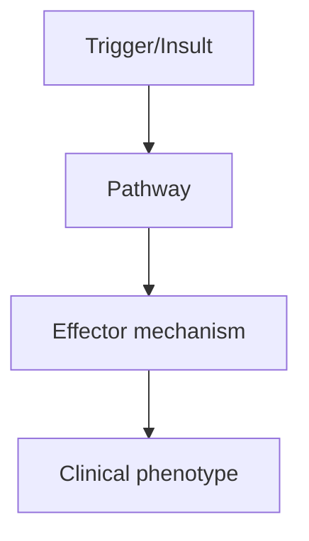
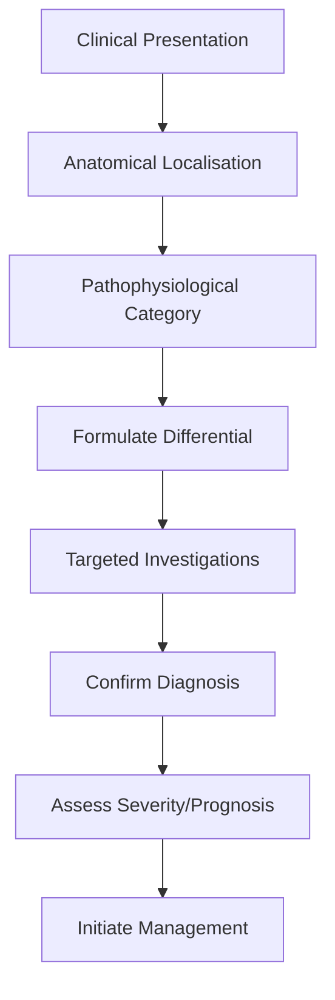
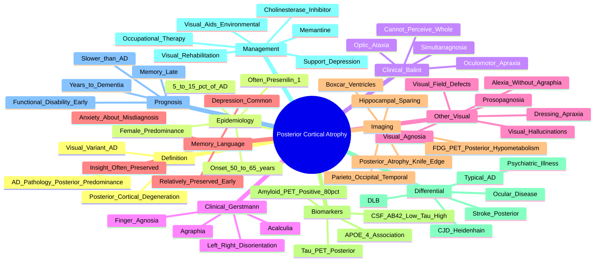

# Posterior Cortical Atrophy

> [!tip] **High-Yield Definition**
> Posterior cortical atrophy (PCA): neurodegenerative syndrome predominantly affecting posterior cortex (occipitoparietal, occipitotemporal), most commonly AD pathology. Visual variant of AD. Bálint syndrome (simultanagnosia, optic ataxia, oculomotor apraxia), Gerstmann (acalculia, agraphia, finger agnosia, left-right disorientation), visual agnosia, alexia.

---

## 1. Definition / Epidemiology / Classification

### Definition
Posterior cortical atrophy (PCA): neurodegenerative syndrome predominantly affecting posterior cortex (occipitoparietal, occipitotemporal), most commonly AD pathology. Visual variant of AD. Bálint syndrome (simultanagnosia, optic ataxia, oculomotor apraxia), Gerstmann (acalculia, agraphia, finger agnosia, left-right disorientation), visual agnosia, alexia.

### Epidemiology
5% of AD. Onset: 50-65y (younger than typical AD). Female predominance. Often initial misdiagnosis (visual problem, psychiatric). Delay to diagnosis 4 years average.

### Classification
| Variant | Key Features | Prognosis |
|---------|-------------|-----------|
| | | |

---

## 2. Aetiology / Pathophysiology

### Aetiology
Pathology: 80% AD (atypical distribution - posterior predominance), 10% CBD, 5% LBD, 5% other. Posterior cortical atrophy - selective vulnerability of occipitoparietal/occipitotemporal regions. Genetic: PSEN1, PSEN2, APP mutations (familial AD, atypical presentation). APOE4 (similar to AD).

### Pathophysiology

---

## 3. Clinical Features

### History
- **Onset/Duration:**
- **Progression:**
- **Key symptoms:**
- **Triggers:**
- **Systemic symptoms:**
- **Drug/Family/Social history:**

### Examination
| Domain | Key Findings | Localisation Value |
|--------|-------------|-------------------|
| | | |

### Specific Clinical Features
Visuospatial: simultanagnosia (inability to perceive multiple objects at once), optic ataxia (reaching errors, mis-reaching despite intact vision), oculomotor apraxia (inability to direct gaze voluntarily). Visual: visual agnosia, prosopagnosia, alexia, visual field defects (especially inferior altitudinal), visual hallucinations (less common than DLB). Visuoconstructive: difficulty with dressing, eating, copying. Other: Bálint syndrome (simultanagnosia + optic ataxia + oculomotor apraxia), Gerstmann syndrome (left parietal: agraphia, acalculia, finger agnosia, left-right disorientation). Memory relatively preserved early (unlike typical AD). Insight often preserved (depression common).

---

## 4. Diagnostic Approach / Algorithm

---

## 5. Investigations

MRI brain: posterior atrophy (occipitoparietal, occipitotemporal), posterior hippocampal sparing, 'knife-edge' or 'knife' atrophy (posterior cingulate, precuneus), posterior sulcal widening, 'boxcar' or 'hourglass' atrophy. FDG-PET: hypometabolism posterior (occipitoparietal, posterior cingulate, precuneus). Amyloid PET: positive in 80% (AD). CSF: AD pattern (low Aβ42, high tau). Tau PET: posterior predominance. Neuropsychology: visuospatial, visuoperceptual, praxis impaired; memory, language relatively preserved. Visual testing: visual fields, acuity, fundoscopy, OCT (exclude ocular).

---

## 6. Differential Diagnosis

| Differential | Distinguishing Features | Key Test |
|--------------|------------------------|----------|
| | | |

---

## 7. Management

Symptomatic: visual aids (magnifying glass, high-contrast), environmental adaptation (good lighting, declutter), OT, home safety, walking aids. Cholinesterase inhibitors (donepezil, rivastigmine, galantamine) - modest benefit, similar to AD. Memantine (modest, late stage). Antidepressants (SSRIs) for depression, anxiety. Avoid: anticholinergics (worsen cognition), neuroleptics (worsen parkinsonism if present). Multidisciplinary: ophthalmology (visual aids), OT, neuropsychology, social work, low vision services, palliative. Driving: assess (visuospatial impairment). Disease-modifying: lecanemab, donanemab (AD-positive, off-label, ARIA risk).

---

## 8. Drug Interactions / Contraindications / Comorbidity Cautions

| Drug | Interaction / Caution | Management |
|------|----------------------|------------|
| | | |

---

## 9. Procedures (if applicable)

### Procedure:
- **Indications:**
- **Contraindications:**
- **Preparation / Principle:**
- **Complications:**
- **Viva Pearls:**

---

## 10. Complications

| Complication | Frequency | Prevention / Monitoring | Management |
|--------------|-----------|------------------------|------------|
| | | | |

---

## 11. Red Flags / Emergencies

Falls, fractures, driving safety, depression, anxiety, suicidal ideation, malnutrition (difficulty eating), abuse (visual impairment, dependency).

---

## 12. Prognosis

Median survival: 8-12 years from onset (similar to typical AD). Progressive disability (visual, visuospatial, then memory, language, behaviour). Falls, fractures common. Driving cessation. Quality of life significantly affected. End-stage: akinetic mutism, dysphagia.

---

## 13. Topic Correlation

| Related Topic | Link | Key Overlap |
|---------------|------|-------------|
| | | |

---

## 14. Special Situations

| Situation | Consideration |
|-----------|---------------|
| **Pregnancy** | |
| **Lactation** | |
| **Paediatric** | |
| **Elderly / Frail** | |
| **Renal impairment** | |
| **Hepatic impairment** | |
| **Immunocompromised** | |
| **Perioperative** | |
| **Driving / DVLA** | |
| **Occupational** | |

---

## FCPS/MRCP High-Yield Summary

| Category | Key Points |
|----------|------------|
| **Definition** | Posterior cortical atrophy (PCA): neurodegenerative syndrome predominantly affecting posterior cortex (occipitoparietal, occipitotemporal), most commonly AD pathology. Visual variant of AD. Bálint syn |
| **Epidemiology** | 5% of AD. Onset: 50-65y (younger than typical AD). Female predominance. Often initial misdiagnosis (visual problem, psychiatric). Delay to diagnosis 4 |
| **Pathophysiology** | |
| **Clinical** | Visuospatial: simultanagnosia (inability to perceive multiple objects at once), optic ataxia (reaching errors, mis-reaching despite intact vision), oculomotor apraxia (inability to direct gaze volunta |
| **Diagnosis** | |
| **Investigations** | MRI brain: posterior atrophy (occipitoparietal, occipitotemporal), posterior hippocampal sparing, 'knife-edge' or 'knife' atrophy (posterior cingulate, precuneus), posterior sulcal widening, 'boxcar'  |
| **Management** | Symptomatic: visual aids (magnifying glass, high-contrast), environmental adaptation (good lighting, declutter), OT, home safety, walking aids. Cholinesterase inhibitors (donepezil, rivastigmine, gala |
| **Complications** | |
| **Prognosis** | Median survival: 8-12 years from onset (similar to typical AD). Progressive disability (visual, visuospatial, then memory, language, behaviour). Falls, fractures common. Driving cessation. Quality of  |
| **Viva Pearls** | |
| **Drug Doses** | |
| **Scoring Systems** | |
| **Genetics** | |
| **Imaging Signs** | |

---

## Viva Questions (PACES/FCPS Style)

1. **Q:** Define Posterior Cortical Atrophy and classify its variants.
   **A:** Based on the definition above.

2. **Q:** What are the key clinical features?
   **A:** Visuospatial: simultanagnosia (inability to perceive multiple objects at once), optic ataxia (reaching errors, mis-reaching despite intact vision), oculomotor apraxia (inability to direct gaze voluntarily). Visual: visual agnosia, prosopagnosia, alexia, visual field defects (especially inferior alti

3. **Q:** What is the first-line treatment?
   **A:** Based on the management section.

4. **Q:** What are the red flags requiring urgent referral?
   **A:** Falls, fractures, driving safety, depression, anxiety, suicidal ideation, malnutrition (difficulty eating), abuse (visual impairment, dependency).

5. **Q:** What is the prognosis?
   **A:** Median survival: 8-12 years from onset (similar to typical AD). Progressive disability (visual, visuospatial, then memory, language, behaviour). Falls, fractures common. Driving cessation. Quality of life significantly affected. End-stage: akinetic mutism, dysphagia.

6. **Q:** How do you differentiate Posterior Cortical Atrophy from key differentials?
   **A:** Clinical features, investigations, and response to treatment.

7. **Q:** What investigations are most useful?
   **A:** Based on the investigations section.

8. **Q:** Describe the stepwise management approach.
   **A:** Based on the management algorithm.

9. **Q:** What are the emergency presentations?
   **A:** Based on the red flags section.

10. **Q:** How does management change in pregnancy/paediatrics/elderly?
    **A:** Special considerations per population.

---

## Common Confusions / Exam Traps

| Confusion | Clarification |
|-----------|---------------|
| | |

---

## Mnemonics

1. **PCA 'Bálint + Gerstmann':** **B**álint syndrome (simultanagnosia + optic ataxia + oculomotor apraxia) + **G**erstmann syndrome (agraphia + acalculia + finger agnosia + left-right disorientation) = parieto-occipital dysfunction.
2. **PCA 'Posterior Pitfalls':** **P**rosopagnosia (faces), alexia (without agraphia), **A**l**T**itudinal visual field defect, dressing/constructive apraxia, topographagnosia (places) — all posterior cortical.
3. **PCA 'Memory Spared Early':** **M**emory and language relatively preserved initially despite disabling visual dysfunction — patient often labelled 'psychiatric' or 'eye problem' first.
4. **PCA 'Knife-Edge Atrophy':** **K**ey MRI finding = focal occipitoparietal ('knife-edge') atrophy with 'boxcar' ventricles and posterior hippocampal SPARING.
5. **PCA 'Visual Variant AD':** Same AD pathology as typical AD but with **posterior** cortical predominance — amyloid PET positive, CSF Aβ42 low, tau high; onset 50–65 y.

---

## Mind Map

---

## Spaced Repetition Trackers
| Day | Recall Score (/10) | Key Facts Reviewed | Weak Areas |
|-----|--------------------|--------------------|------------|
| Day 1 | __ | Visual variant AD; onset 50–65; Bálint + Gerstmann syndromes | |
| Day 3 | __ | Simultanagnosia, optic ataxia, oculomotor apraxia (Bálint triad) | |
| Day 7 | __ | Gerstmann (acalculia, agraphia, finger agnosia, L-R disorientation) | |
| Day 14 | __ | MRI: occipitoparietal atrophy, knife-edge, hippocampal sparing | |
| Day 30 | __ | Amyloid PET positive 80%, CSF AD pattern, memory preserved early | |
| Day 90 | __ | Differential from DLB/CJD; rehabilitation; prognosis; APOE | |

---

## Self-Test Scorecard
| Section | Topic | Score (/5) |
|---------|-------|-----------:|
| 1 | Definition as visual variant AD | __/5 |
| 2 | Epidemiology: 50–65 y onset, 5–15% of AD | __/5 |
| 3 | Bálint syndrome triad | __/5 |
| 4 | Gerstmann syndrome tetrad | __/5 |
| 5 | Visual features: prosopagnosia, alexia, apraxia | __/5 |
| 6 | Memory and language preserved early | __/5 |
| 7 | MRI: posterior atrophy, knife-edge, hippocampal sparing | __/5 |
| 8 | Biomarkers: amyloid PET+, CSF Aβ42/tau | __/5 |
| 9 | Differential (DLB, CJD, AD, ocular) | __/5 |
| 10 | Management and visual rehabilitation | __/5 |
| **Total** | | **__/50** |

---

## One-Page Revision Card
| **Topic** | **Posterior Cortical Atrophy (PCA)** |
|-----------|--------------------------------------|
| **Definition** | Visual variant of Alzheimer's disease with focal atrophy of parieto-occipital cortex; same AD pathology as typical AD but with posterior predominance. |
| **Epidemiology** | Onset typically 50–65 y (younger than typical AD); 5–15% of AD cases; female predominance; often PSEN1 mutation carriers present this phenotype. |
| **Bálint syndrome** | **S**imultanagnosia (cannot perceive more than one object at a time), **O**ptic ataxia (mis-reaching despite normal vision), **O**culomotor apraxia (cannot direct gaze voluntarily). |
| **Gerstmann syndrome** | **A**calculia, **A**graphia, **F**inger agnosia, **L**eft-right disorientation — dominant parietal signs. |
| **Other features** | Prosopagnosia, alexia without agraphia, dressing/constructive apraxia, topographagnosia, inferior altitudinal visual field defects, visual hallucinations (less than DLB). Memory and language preserved early — insight often retained. |
| **Imaging** | MRI: posterior occipitoparietal/occipitotemporal atrophy ('knife-edge' / 'boxcar' / 'hourglass' atrophy), **hippocampal sparing**, posterior sulcal widening. FDG-PET: posterior hypometabolism. |
| **Biomarkers** | Amyloid PET positive in ~80%; CSF low Aβ42, high t-tau/p-tau (AD pattern); tau PET posterior predominance. APOE ε4 associated. |
| **Differential** | Typical AD (memory first), DLB (fluctuations, parkinsonism, RBD), CJD (Heidenhain variant — rapid), ocular disease (examine fundi, OCT), stroke (sudden), psychiatric (often misdiagnosed). |
| **Treatment** | Donepezil/rivastigmine (cholinesterase inhibitors); memantine add-on; **visual rehabilitation** + environmental adaptation; OT; treat depression/anxiety. |
| **Prognosis** | Slower progression to global dementia than typical AD; functional disability (driving, reading, recognising faces) early; average 8–12 years survival. |
| **Viva pearls** | Patient labelled 'psychiatric' or sent to opticians first — high misdiagnosis rate; ask about **reading, dressing, finding objects**; posterior cortical signs + AD biomarkers = PCA. |

---

## MCQs (10)

1. **A 58-year-old woman complains she cannot read, cannot recognise her husband's face, and bumps into furniture. She describes the world as a 'jumble of disconnected pieces'. Memory is reportedly normal. MRI shows occipitoparietal atrophy with hippocampal sparing. Most likely diagnosis?**
   A. Typical Alzheimer's disease
   B. **Posterior Cortical Atrophy**
   C. Dementia with Lewy bodies
   D. Creutzfeldt–Jakob disease (Heidenhain)
   *Answer: B*
   *Explanation: Visual dysfunction with preserved memory + posterior atrophy = PCA (visual variant AD). Simultanagnosia ('jumble of pieces'), prosopagnosia, and alexia are classic.*

2. **Which triad defines Bálint syndrome?**
   A. Aphasia, apraxia, agnosia
   B. **Simultanagnosia, optic ataxia, oculomotor apraxia**
   C. Acalculia, agraphia, finger agnosia
   D. Amnesia, confabulation, disorientation
   *Answer: B*
   *Explanation: Bálint syndrome arises from bilateral parieto-occipital lesions and comprises simultanagnosia, optic ataxia, and oculomotor (psychic) apraxia.*

3. **Which feature is characteristic of Gerstmann syndrome (dominant parietal)?**
   A. Prosopagnosia
   B. **Acalculia, agraphia, finger agnosia, left–right disorientation**
   C. Simultanagnosia
   D. Visual hallucinations
   *Answer: B*
   *Explanation: Gerstmann syndrome is the tetrad of acalculia, agraphia, finger agnosia, and left-right disorientation, localising to the dominant (usually left) parietal lobe (angular gyrus).*

4. **Which cognitive domain is RELATIVELY PRESERVED in early PCA?**
   A. Visuospatial function
   B. Praxis
   C. **Episodic memory**
   D. Visual recognition
   *Answer: C*
   *Explanation: Memory and language are typically preserved early in PCA — unlike typical AD. The striking dissociation between profound visual dysfunction and intact memory is a clinical clue.*

5. **Which MRI finding is MOST characteristic of PCA?**
   A. Medial temporal lobe atrophy
   B. Frontotemporal atrophy
   C. **Occipitoparietal/posterior cortical atrophy with hippocampal sparing**
   D. Cerebellar atrophy
   *Answer: C*
   *Explanation: Posterior ('knife-edge' or 'boxcar') atrophy with relative hippocampal sparing is the hallmark of PCA; the opposite pattern (medial temporal atrophy) suggests typical AD.*

6. **Biomarker results in PCA typically show:**
   A. Normal amyloid PET
   B. **Low CSF Aβ42, high t-tau/p-tau, positive amyloid PET in ~80%**
   C. 14-3-3 protein positive in CSF
   D. Anti-NMDA receptor antibodies
   *Answer: B*
   *Explanation: PCA is a visual variant of AD; CSF and PET biomarkers show AD pattern. 14-3-3 is for CJD; anti-NMDA for autoimmune encephalitis.*

7. **What is simultanagnosia?**
   A. Inability to recognise faces
   B. **Inability to perceive more than one object or element of a visual scene at a time**
   C. Loss of colour vision
   D. Inability to direct gaze voluntarily
   *Answer: B*
   *Explanation: Simultanagnosia is a disorder of visual attention — the patient can identify single objects but cannot integrate them into a coherent whole (often cannot describe a complex picture or 'Where's Wally?').*

8. **Which clinical feature helps DIFFERENTIATE PCA from DLB?**
   A. Visual hallucinations
   B. **Memory preserved early in PCA; DLB has fluctuating cognition and parkinsonism**
   C. REM sleep behaviour disorder
   D. Posterior atrophy
   *Answer: B*
   *Explanation: DLB features fluctuating cognition, parkinsonism, REM sleep behaviour disorder, and neuroleptic sensitivity. PCA has prominent posterior cortical signs with preserved memory early.*

9. **A patient with PCA asks about driving. What is appropriate advice?**
   A. Continue if comfortable
   B. Annual review only
   C. **Immediate cessation and notification to DVLA — significant risk due to visuospatial dysfunction**
   D. Restrict to daylight only
   *Answer: C*
   *Explanation: Visuospatial impairment, simultanagnosia, and visual field defects make driving unsafe. UK DVLA requires notification; many jurisdictions mandate immediate cessation.*

10. **Which is the MOST common pathology underlying PCA?**
    A. Lewy body disease
    B. **Alzheimer's disease (amyloid plaques + neurofibrillary tangles)**
    C. Prion disease
    D. TDP-43 proteinopathy
    *Answer: B*
    *Explanation: Despite the focal posterior presentation, PCA shares AD pathology — amyloid plaques and neurofibrillary tangles — but with posterior (rather than medial temporal) predominance.*

---

## SBA Questions (10)

1. **Scenario:** A 60-year-old presents with 2-year history of progressive difficulty reading, dressing, and finding objects in familiar environments. MMSE 28/30 but fails clock-drawing and copy of intersecting pentagons.
   **Question:** Most likely diagnosis?
   A. Typical Alzheimer's disease
   B. **Posterior Cortical Atrophy**
   C. Frontotemporal dementia
   D. Vascular dementia
   *Answer: B*
   *Explanation: PCA — young onset, visuoperceptual/visuospatial deficits with preserved MMSE memory component and failure on constructional tasks.*

2. **Scenario:** Patient with PCA is commenced on donepezil by another clinician. Family asks about expected benefit.
   **Question:** Most appropriate response?
   A. No benefit expected
   B. **Modest benefit on cognition and global function; evidence supports use in atypical AD variants**
   C. Marked improvement expected
   D. Only for behavioural symptoms
   *Answer: B*
   *Explanation: Cholinesterase inhibitors (donepezil, rivastigmine, galantamine) are used off-label but with modest benefit in PCA; memantine may be added in moderate–severe disease.*

3. **Scenario:** A patient with PCA cannot recognise family members' faces, reads letters but not words, and describes seeing the world as 'pieces'. MRI shows occipitotemporal atrophy.
   **Question:** Which neuropsychological term describes the face-recognition deficit?
   A. Simultanagnosia
   B. **Prosopagnosia**
   C. Optic ataxia
   D. Agraphia
   *Answer: B*
   *Explanation: Prosopagnosia = inability to recognise familiar faces; caused by fusiform face area (occipitotemporal) dysfunction. Combined with alexia without agraphia (splenium/lingual–fusiform) supports PCA.*

4. **Scenario:** Patient with PCA becomes distressed and stops attending clinic because they cannot find the way in. MRI shows bilateral posterior cortical atrophy.
   **Question:** Most likely cause of the spatial disorientation?
   A. Hippocampal atrophy
   B. **Topographagnosia (environmental agnosia)**
   C. Anosognosia
   D. Aphasia
   *Answer: B*
   *Explanation: Topographagnosia = inability to orient in familiar environments due to right parietal dysfunction; common in PCA and contributes to functional disability.*

5. **Scenario:** Patient with PCA has visual hallucinations (well-formed, recurrent). Family asks if this means DLB.
   **Question:** Most appropriate response?
   A. Definitely DLB — switch diagnosis
   B. **Visual hallucinations CAN occur in PCA (less common than DLB); distinction based on full clinical picture**
   C. Hallucinations rule out AD pathology
   D. Start quetiapine immediately
   *Answer: B*
   *Explanation: Visual hallucinations occur in ~10–25% of PCA but are less prominent and less consistent than in DLB. PCA lacks fluctuating cognition, parkinsonism, RBD, and neuroleptic sensitivity typical of DLB.*

6. **Scenario:** Patient with PCA has negative amyloid PET. Family asks about diagnosis.
   **Question:** Most appropriate response?
   A. Rules out PCA completely
   B. **Amyloid PET is positive in ~80% of PCA; negative result suggests alternative pathology (e.g., corticobasal degeneration)**
   C. Repeat MRI instead
   D. Start memantine only
   *Answer: B*
   *Explanation: Most PCA has AD pathology (amyloid PET positive in ~80%); the remainder may have corticobasal degeneration, Lewy body disease, or prion disease — investigate further.*

7. **Scenario:** A 55-year-old with PCA cannot read signs while driving and misjudges distances. Asks if they can drive.
   **Question:** Most appropriate advice?
   A. Continue with caution
   B. Restrict to local roads
   C. **Stop driving immediately and inform DVLA — visuospatial deficits preclude safe driving**
   D. Annual ophthalmology review only
   *Answer: C*
   *Explanation: Driving is unsafe with simultanagnosia, optic ataxia, and visual field defects. UK DVLA requires notification; cessation is usually mandatory.*

8. **Scenario:** Patient with PCA develops depression 3 years into the illness. Most appropriate first-line therapy?
   A. Tricyclic antidepressant
   B. **SSRI (e.g., sertraline)**
   C. Antipsychotic
   D. ECT
   *Answer: B*
   *Explanation: SSRIs are first-line for depression in dementia; avoid TCAs (anticholinergic, may worsen cognition) and antipsychotics (extrapyramidal sensitivity, especially if any DLB component).*

9. **Scenario:** MRI of a patient with suspected PCA shows hippocampal atrophy equal to posterior atrophy.
   **Question:** Interpretation?
   A. Classic PCA
   B. **Atypical — typical PCA shows posterior atrophy OUT OF PROPORTION to medial temporal involvement**
   C. Suggests DLB
   D. Suggests FTD
   *Answer: B*
   *Explanation: PCA's signature is posterior cortical atrophy with relative hippocampal sparing. Prominent hippocampal atrophy suggests typical AD or mixed pathology.*

10. **Scenario:** Patient with PCA has progressive difficulty using a fork and dressing — getting arms into wrong sleeves.
    **Question:** Best term for this deficit?
    A. Ideomotor apraxia
    B. **Dressing apraxia**
    C. Constructional apraxia
    D. Limb-kinetic apraxia
    *Answer: B*
    *Explanation: Dressing apraxia = inability to orient clothing on the body; a classic right parietal sign and very common in PCA due to loss of body schema and visuospatial integration.*

---

## Flashcards

- **Q: What is PCA?**
  A: Posterior Cortical Atrophy — visual variant of AD with focal parieto-occipital atrophy.

- **Q: Bálint syndrome triad.**
  A: Simultanagnosia + optic ataxia + oculomotor (psychic) apraxia.

- **Q: Gerstmann syndrome tetrad.**
  A: Acalculia + agraphia + finger agnosia + left-right disorientation.

- **Q: Typical age of PCA onset.**
  A: 50–65 years (younger than typical AD).

- **Q: Which cognitive domain is preserved early in PCA?**
  A: Episodic memory (unlike typical AD where memory fails first).

- **Q: MRI hallmark of PCA.**
  A: Posterior (occipitoparietal) atrophy with hippocampal sparing ('knife-edge' atrophy).

- **Q: Biomarker pattern in PCA.**
  A: Amyloid PET positive ~80%, CSF low Aβ42, high tau — same as typical AD.

- **Q: Why is PCA often misdiagnosed initially?**
  A: Patients have preserved memory and insight; visual symptoms lead to optician referral or psychiatric mislabelling.

- **Q: Treatment for PCA.**
  A: Cholinesterase inhibitors ± memantine; visual rehabilitation; treat depression.

- **Q: Driving advice in PCA.**
  A: Stop immediately, notify DVLA — visuospatial impairment precludes safe driving.

---

## Answer Key with Explanations

### MCQs
1. **B** — Visual dysfunction + preserved memory + posterior atrophy = PCA.
2. **B** — Bálint triad: simultanagnosia + optic ataxia + oculomotor apraxia.
3. **B** — Gerstmann tetrad: acalculia + agraphia + finger agnosia + L-R disorientation.
4. **C** — Memory preserved early in PCA.
5. **C** — Posterior atrophy with hippocampal sparing.
6. **B** — AD biomarker pattern in PCA.
7. **B** — Simultanagnosia = cannot perceive whole scene.
8. **B** — Memory preserved in PCA; DLB has fluctuations, parkinsonism, RBD.
9. **C** — Stop driving immediately — visuospatial deficits unsafe.
10. **B** — PCA is AD pathology with posterior predominance.

### SBAs
1. **B** — PCA — preserved MMSE memory, constructional failure.
2. **B** — Modest benefit from cholinesterase inhibitors.
3. **B** — Prosopagnosia = face-recognition deficit (fusiform).
4. **B** — Topographagnosia = spatial disorientation (right parietal).
5. **B** — Visual hallucinations can occur in PCA; full clinical picture needed.
6. **B** — Negative amyloid PET in ~20% suggests alternative pathology.
7. **C** — Stop driving immediately, notify DVLA.
8. **B** — SSRI first-line for depression in dementia.
9. **B** — Hippocampal sparing is the PCA hallmark.
10. **B** — Dressing apraxia = parietal dressing difficulty.

## Tags
#neurology #dementia #PCA #Alzheimer #visual #Balint #Gerstmann #FCPS #MRCP #PACES

## Local Navigation
**Heading Hub:** [[../Hub]]  
**Chapter Hierarchy:** [[Davidson Chapter 25 - Neurology Hierarchy]]  
**Chapter MOC:** [[Neurology MOC]]  
**Drug Reference:** [[../00_Index/Neurology Drug Reference]]

## PasTest Scenario SBAs (Clinical Vignettes)

> **Auto-generated PasTest/Mediscope-style scenario SBAs** grounded in the authored source. Each scenario tests a real clinical fact (triad, specific sign, contraindication, trial, first-line Rx) extracted from the topic. *Source: Ch 27: Neurology & Stroke — Posterior Cortical Atrophy*

**Q1.** Which of the following features is most specific or characteristic of Posterior Cortical Atrophy?

  - **A.** PCA 'Visual Variant AD':
  - **B.** A feature common to many acute inflammatory conditions
  - **C.** A non-specific sign that does not localise the diagnosis
  - **D.** An investigation finding rather than a clinical feature

  > **Answer: A** — PCA 'Visual Variant AD':
  >
  > *Source:* **PCA 'Visual Variant AD':** Same AD pathology as typical AD but with **posterior** cortical predominance — amyloid PET positive, CSF Aβ42 low, tau high; onset 50–65 y

