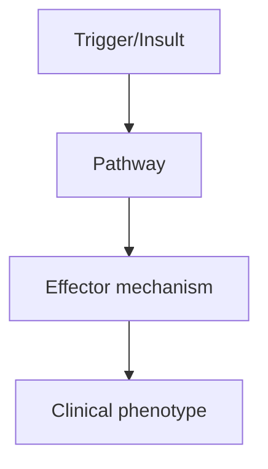
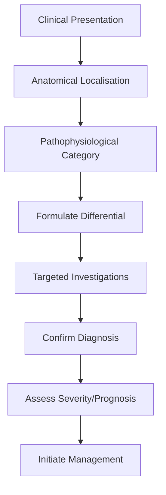
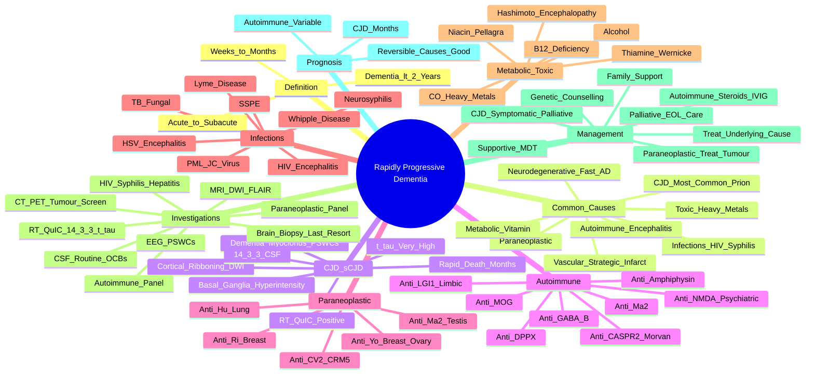

# Rapidly Progressive Dementia

> [!tip] **High-Yield Definition**
> Rapidly progressive dementia (RPD): cognitive decline over weeks to <1-2 years. Includes prion disease (CJD), autoimmune encephalitis, paraneoplastic, infections (HIV, syphilis, Whipple's), vasculitis, metabolic (B12, Wernicke, Wilson's, hepatic, renal), toxic, neurodegenerative (rarely fast AD, DLB, FTD).

---

## 1. Definition / Epidemiology / Classification

### Definition
Rapidly progressive dementia (RPD): cognitive decline over weeks to <1-2 years. Includes prion disease (CJD), autoimmune encephalitis, paraneoplastic, infections (HIV, syphilis, Whipple's), vasculitis, metabolic (B12, Wernicke, Wilson's, hepatic, renal), toxic, neurodegenerative (rarely fast AD, DLB, FTD).

### Epidemiology
CJD: 1-2/1000,000/year. RPD: 3-4% of all dementia presentations. Mean age 60-70y. CJD most common cause of RPD. Autoimmune increasingly recognised.

### Classification
| Variant | Key Features | Prognosis |
|---------|-------------|-----------|
| | | |

---

## 2. Aetiology / Pathophysiology

### Aetiology
Prion: sCJD (most common, MM1, MM2, VV1, etc.), vCJD (BSE, young), FFI (PRNP D178N with methionine), GSS (PRNP P102L). Autoimmune encephalitis: anti-NMDA, LGI1, CASPR2, GABA-B, DPPX, anti-Ma2 (paraneoplastic). Paraneoplastic: anti-Hu, anti-Yo, anti-Ma, anti-CRMP5. Infections: HIV, syphilis, Whipple's, Lyme, HSV, JC virus (PML). Vascular: vasculitis (PACNS, SLE, Behçet's), CADASIL, CAA-related inflammation. Metabolic: B12, Wernicke, Wilson's, hepatic, renal, hypocalcaemia, hypercalcaemia, hyponatraemia. Toxic: alcohol, drugs, heavy metals. Tumour: primary CNS lymphoma, glioma, metastases.

### Pathophysiology

---

## 3. Clinical Features

### History
- **Onset/Duration:**
- **Progression:**
- **Key symptoms:**
- **Triggers:**
- **Systemic symptoms:**
- **Drug/Family/Social history:**

### Examination
| Domain | Key Findings | Localisation Value |
|--------|-------------|-------------------|
| | | |

### Specific Clinical Features
Rapid decline (weeks-months). CJD: rapidly progressive dementia, myoclonus (startle-induced), ataxia, visual/cerebellar, pyramidal/extrapyramidal, AChE inhibitors worsen, EEG (PSWCs 1-2Hz), MRI pulvinar sign (vCJD), cortical ribbon (sCJD DWI). Autoimmune: subacute onset, fluctuating, seizures, movement disorders (anti-NMDA dyskinesias), psychiatric, hyponatraemia (LGI1, anti-VGKC). Paraneoplastic: smoking, weight loss, preceding symptoms. Infections: HIV, syphilis, HSV. Workup: MRI brain, EEG, CSF (cells, OCBs, Aβ42, t-tau, RT-QuIC, paraneoplastic, autoimmune encephalitis panel, infection), bloods (B12, TFTs, autoimmune, infection, paraneoplastic). Brain biopsy: if diagnosis remains uncertain.

---

## 4. Diagnostic Approach / Algorithm

---

## 5. Investigations

MRI brain: DWI/FLAIR hyperintensity (cortical ribbon - CJD, limbic - autoimmune, basal ganglia - CJD, vasculitis). EEG: PSWCs (CJD), slowing, epileptiform. CSF: routine, OCBs, autoimmune encephalitis panel (anti-NMDA, LGI1, CASPR2, GABA-B, DPPX, anti-Ma2), paraneoplastic (anti-Hu, Yo, Ma, CRMP5), infection (HIV, syphilis, HSV, VZV, JC virus PCR, Whipple's PCR), RT-QuIC (CJD), t-tau/p-tau (CJD: high t-tau, low Aβ42). Bloods: B12, folate, TFTs, LFTs, renal, autoimmune, paraneoplastic, lactate, ammonia, copper, ceruloplasmin, ACE. CT chest/abdomen/pelvis, mammogram, testicular ultrasound, PET-CT (tumour). Brain biopsy: if uncertain.

---

## 6. Differential Diagnosis

| Differential | Distinguishing Features | Key Test |
|--------------|------------------------|----------|
| | | |

---

## 7. Management

Treat underlying cause: autoimmune (IV methylprednisolone 1g/day ×5d, IVIG 2g/kg, PLEX, rituximab, MMF, azathioprine, cyclophosphamide - depends on antibody and severity), paraneoplastic (treat tumour), infection (specific antimicrobial), metabolic (replace, withdraw toxic). CJD: symptomatic only, no disease-modifying therapy, palliative. Supportive: nutrition, hydration, pressure care, mobility, communication, palliative. Multidisciplinary: neurology, palliative, OT, neuropsychology, social, chaplaincy. Family support: genetic counselling (familial CJD, FFI, GSS), prognosis, support groups. Driving: immediate cessation.

---

## 8. Drug Interactions / Contraindications / Comorbidity Cautions

| Drug | Interaction / Caution | Management |
|------|----------------------|------------|
| | | |

---

## 9. Procedures (if applicable)

### Procedure:
- **Indications:**
- **Contraindications:**
- **Preparation / Principle:**
- **Complications:**
- **Viva Pearls:**

---

## 10. Complications

| Complication | Frequency | Prevention / Monitoring | Management |
|--------------|-----------|------------------------|------------|
| | | | |

---

## 11. Red Flags / Emergencies

Rapid decline (weeks-months), myoclonus (CJD), seizures, autonomic dysfunction, respiratory failure, aspiration, sudden death (CJD, FFI).

---

## 12. Prognosis

Variable. CJD: 90% mortality within 1 year, median 6 months. Autoimmune: 50-80% respond to immunotherapy, some fully recover. Paraneoplastic: poor (malignancy), but immunotherapy may help. Infectious: depends on organism, treat. Metabolic: replace. Overall: rapid decline, high mortality, palliative focus. Early diagnosis and treatment critical for reversible causes.

---

## 13. Topic Correlation

| Related Topic | Link | Key Overlap |
|---------------|------|-------------|
| | | |

---

## 14. Special Situations

| Situation | Consideration |
|-----------|---------------|
| **Pregnancy** | |
| **Lactation** | |
| **Paediatric** | |
| **Elderly / Frail** | |
| **Renal impairment** | |
| **Hepatic impairment** | |
| **Immunocompromised** | |
| **Perioperative** | |
| **Driving / DVLA** | |
| **Occupational** | |

---

## FCPS/MRCP High-Yield Summary

| Category | Key Points |
|----------|------------|
| **Definition** | Rapidly progressive dementia (RPD): cognitive decline over weeks to <1-2 years. Includes prion disease (CJD), autoimmune encephalitis, paraneoplastic, infections (HIV, syphilis, Whipple's), vasculitis |
| **Epidemiology** | CJD: 1-2/1000,000/year. RPD: 3-4% of all dementia presentations. Mean age 60-70y. CJD most common cause of RPD. Autoimmune increasingly recognised. |
| **Pathophysiology** | |
| **Clinical** | Rapid decline (weeks-months). CJD: rapidly progressive dementia, myoclonus (startle-induced), ataxia, visual/cerebellar, pyramidal/extrapyramidal, AChE inhibitors worsen, EEG (PSWCs 1-2Hz), MRI pulvin |
| **Diagnosis** | |
| **Investigations** | MRI brain: DWI/FLAIR hyperintensity (cortical ribbon - CJD, limbic - autoimmune, basal ganglia - CJD, vasculitis). EEG: PSWCs (CJD), slowing, epileptiform. CSF: routine, OCBs, autoimmune encephalitis  |
| **Management** | Treat underlying cause: autoimmune (IV methylprednisolone 1g/day ×5d, IVIG 2g/kg, PLEX, rituximab, MMF, azathioprine, cyclophosphamide - depends on antibody and severity), paraneoplastic (treat tumour |
| **Complications** | |
| **Prognosis** | Variable. CJD: 90% mortality within 1 year, median 6 months. Autoimmune: 50-80% respond to immunotherapy, some fully recover. Paraneoplastic: poor (malignancy), but immunotherapy may help. Infectious: |
| **Viva Pearls** | |
| **Drug Doses** | |
| **Scoring Systems** | |
| **Genetics** | |
| **Imaging Signs** | |

---

## Viva Questions (PACES/FCPS Style)

1. **Q:** Define Rapidly Progressive Dementia and classify its variants.
   **A:** Based on the definition above.

2. **Q:** What are the key clinical features?
   **A:** Rapid decline (weeks-months). CJD: rapidly progressive dementia, myoclonus (startle-induced), ataxia, visual/cerebellar, pyramidal/extrapyramidal, AChE inhibitors worsen, EEG (PSWCs 1-2Hz), MRI pulvinar sign (vCJD), cortical ribbon (sCJD DWI). Autoimmune: subacute onset, fluctuating, seizures, movem

3. **Q:** What is the first-line treatment?
   **A:** Based on the management section.

4. **Q:** What are the red flags requiring urgent referral?
   **A:** Rapid decline (weeks-months), myoclonus (CJD), seizures, autonomic dysfunction, respiratory failure, aspiration, sudden death (CJD, FFI).

5. **Q:** What is the prognosis?
   **A:** Variable. CJD: 90% mortality within 1 year, median 6 months. Autoimmune: 50-80% respond to immunotherapy, some fully recover. Paraneoplastic: poor (malignancy), but immunotherapy may help. Infectious: depends on organism, treat. Metabolic: replace. Overall: rapid decline, high mortality, palliative 

6. **Q:** How do you differentiate Rapidly Progressive Dementia from key differentials?
   **A:** Clinical features, investigations, and response to treatment.

7. **Q:** What investigations are most useful?
   **A:** Based on the investigations section.

8. **Q:** Describe the stepwise management approach.
   **A:** Based on the management algorithm.

9. **Q:** What are the emergency presentations?
   **A:** Based on the red flags section.

10. **Q:** How does management change in pregnancy/paediatrics/elderly?
    **A:** Special considerations per population.

---

## Common Confusions / Exam Traps

| Confusion | Clarification |
|-----------|---------------|
| | |

---

## Mnemonics

1. **RPD 'CJD Clues':** **C**ortical ribboning (DWI) + **J**erk (myoclonus) + **D**ementia + **PSWCs** on EEG (1 Hz) + **RT-QuIC** positive = **S**poradic CJD (sCJD). Mnemonic 'CJDS = Cortical-Jerk-Dementia-Springs'.
2. **RPD 'AUTOIMMUNE Antibodies':** **L**GI1 (limbic encephalitis, faciobrachial seizures, hyponatraemia), **C**ASPR2 (Morvan syndrome), **N**MDA (psychiatric, dyskinesias, dysautonomia), **G**ABA-B (seizures), **D**PPX (tremor, ataxia), **Ma2** (brainstem/limbic).
3. **RPD 'Treatable Don't-Miss':** **T**hiamine (Wernicke), **B**12, **H**IV, **S**yphilis, **W**hipple, **H**ashimoto, **S**LE vasculitis, **P**araneoplastic, **A**utoimmune — these are **reversible** if caught early.
4. **RPD 'Workup WARS':** **W**eight (B12, thiamine, Niacin), **A**utoimmune serology (LGI1, NMDA, TPO), **R**outine (FBC, TFTs, HIV, syphilis), **S**pecific (CSF RT-QuIC, 14-3-3, paraneoplastic panel).
5. **RPD 'CJD Triad':** **D**ementia + **M**yoclonus + **P**eriodic sharp wave complexes (PSWCs) on EEG = clinical CJD triad; add **RT-QuIC** for definitive diagnosis.

---

## Mind Map

---

## Spaced Repetition Trackers
| Day | Recall Score (/10) | Key Facts Reviewed | Weak Areas |
|-----|--------------------|--------------------|------------|
| Day 1 | __ | Definition (<2 years); broad differential; treatable causes first | |
| Day 3 | __ | CJD triad (dementia, myoclonus, PSWCs); MRI cortical ribboning; RT-QuIC | |
| Day 7 | __ | Autoimmune antibodies (LGI1, CASPR2, NMDA, GABA-B, Ma2, DPPX) | |
| Day 14 | __ | Paraneoplastic (Hu, Yo, Ma2, CV2/CRMP5, Ri, amphiphysin) | |
| Day 30 | __ | Treatable causes (B12, thiamine, HIV, syphilis, Whipple, Hashimoto) | |
| Day 90 | __ | Full workup (MRI, EEG, CSF, serology, PET); brain biopsy role; prognosis | |

---

## Self-Test Scorecard
| Section | Topic | Score (/5) |
|---------|-------|-----------:|
| 1 | Definition: dementia progression <2 years | __/5 |
| 2 | Most common cause (CJD) and prion disease features | __/5 |
| 3 | CJD triad: dementia, myoclonus, PSWCs | __/5 |
| 4 | CJD MRI: cortical ribboning, basal ganglia | __/5 |
| 5 | Autoimmune encephalitis antibodies | __/5 |
| 6 | Paraneoplastic syndromes and antibodies | __/5 |
| 7 | Treatable infections (HIV, syphilis, Whipple, PML) | __/5 |
| 8 | Metabolic/toxic: B12, thiamine, Niacin, CO, heavy metals | __/5 |
| 9 | Workup: MRI, EEG, CSF, RT-QuIC, serology | __/5 |
| 10 | Management: treat underlying, immunotherapy, palliative for CJD | __/5 |
| **Total** | | **__/50** |

---

## One-Page Revision Card
| **Topic** | **Rapidly Progressive Dementia (RPD)** |
|-----------|----------------------------------------|
| **Definition** | Dementia progressing from first symptom to severe disability in **<2 years** (often weeks–months). A neurological emergency requiring urgent broad workup. |
| **Categories** | **Prion (CJD)** most common; **autoimmune encephalitis**; **paraneoplastic**; **infections** (HIV, syphilis, Whipple, PML); **metabolic/vitamin** (B12, thiamine, Niacin); **toxic** (CO, heavy metals); **vascular** (strategic infarcts); **rarely fast neurodegenerative**. |
| **CJD triad** | **D**ementia + **M**yoclonus (startle, periodic) + **PSWCs** (1 Hz periodic sharp wave complexes) on EEG. Heidenhain variant = visual onset (rapid visual loss). |
| **CJD investigations** | MRI: cortical ribboning on DWI, basal ganglia (caudate/putamen) hyperintensity. CSF: **RT-QuIC** (specificity ~99%, sensitivity ~92%), 14-3-3, very high t-tau. EEG: PSWCs in ~60%. |
| **Autoimmune causes** | LGI1 (limbic encephalitis, faciobrachial dystonic seizures, hyponatraemia); CASPR2 (Morvan); NMDA (psychosis, orofacial dyskinesias, dysautonomia); GABA-B (seizures); Ma2 (brainstem/limbic, testicular cancer); DPPX; amphiphysin (stiff-person). |
| **Paraneoplastic** | Anti-Hu (SCLC), anti-Yo (breast/ovary), anti-Ma2 (testicular), anti-CV2/CRMP5, anti-Ri (breast, opsoclonus-myoclonus), anti-amphiphysin (breast). Always search for tumour. |
| **Treatable causes** | **Don't miss:** infections (HIV, syphilis, Whipple, HSV, PML), vitamins (B12, thiamine, Niacin), Hashimoto encephalopathy (anti-TPO), autoimmune, paraneoplastic (treat tumour). All reversible if caught early. |
| **Investigations** | MRI brain with DWI/FLAIR; EEG; CSF (cells, protein, OCBs, RT-QuIC, 14-3-3, t-tau, autoimmune/paraneoplastic panel, viral PCR); bloods (B12, folate, TFTs, HIV, syphilis, autoimmune, paraneoplastic, lactate, ammonia); CT C/A/P, PET-CT; brain biopsy (last resort). |
| **Treatment** | **Treat the underlying cause.** Autoimmune: IV methylprednisolone 1 g × 5 d ± IVIG 2 g/kg ± PLEX, then rituximab/MMF/azathioprine. Paraneoplastic: treat tumour. CJD: symptomatic, palliative only. |
| **Prognosis** | CJD: death in 6–12 months (median). Autoimmune: variable, often good with treatment. Reversible causes: full recovery possible. Family screening/genetic counselling for familial CJD, FFI, GSS. |
| **Viva pearls** | **Always screen for treatable causes BEFORE labelling CJD**; RT-QuIC has largely replaced 14-3-3 for CJD; stop driving immediately; palliative involvement early. |

---

## MCQs (10)

1. **A 65-year-old man develops rapidly progressive cognitive decline over 8 weeks with startle myoclonus. EEG shows periodic sharp wave complexes at 1 Hz. MRI shows cortical ribboning on DWI and basal ganglia hyperintensity. Most likely diagnosis?**
   A. Autoimmune encephalitis
   B. **Sporadic Creutzfeldt–Jakob disease**
   C. Hashimoto encephalopathy
   D. Paraneoplastic encephalitis
   *Answer: B*
   *Explanation: The triad of rapidly progressive dementia, myoclonus, and PSWCs on EEG with MRI cortical ribboning is classic for sCJD. RT-QuIC confirms diagnosis.*

2. **Which CSF test has the highest specificity for sporadic CJD?**
   A. 14-3-3 protein
   B. **RT-QuIC (Real-Time Quaking-Induced Conversion)**
   C. Oligoclonal bands
   D. Anti-NMDA receptor antibody
   *Answer: B*
   *Explanation: RT-QuIC detects misfolded prion protein (PrPSc) seed amplification; sensitivity ~92%, specificity ~99% for sCJD. It has largely replaced 14-3-3, which is less specific.*

3. **Which antibody is associated with faciobrachial dystonic seizures and hyponatraemia?**
   A. Anti-NMDA receptor
   B. **Anti-LGI1**
   C. Anti-CASPR2
   D. Anti-GABA-B
   *Answer: B*
   *Explanation: Anti-LGI1 (leucine-rich glioma-inactivated 1) causes limbic encephalitis with characteristic faciobrachial dystonic seizures (FBDS), amnesia, confusion, and hyponatraemia.*

4. **A patient with rapidly progressive dementia and agitation is found to have ovarian teratoma and anti-NMDA receptor antibodies. Most appropriate initial management?**
   A. IV aciclovir
   B. **Tumour removal + immunotherapy (steroids, IVIG, PLEX, rituximab)**
   C. Plasma exchange only
   D. Palliative care only
   *Answer: B*
   *Explanation: Anti-NMDA receptor encephalitis is treated with tumour removal (when present) and immunotherapy (first-line: steroids, IVIG, PLEX; second-line: rituximab, cyclophosphamide).*

5. **Which MRI finding is characteristic of sporadic CJD?**
   A. Hippocampal atrophy
   B. **Cortical ribboning on DWI with basal ganglia hyperintensity**
   C. Unilateral temporal lobe hyperintensity
   D. Pontine 'hot cross bun'
   *Answer: B*
   *Explanation: Cortical ribboning (cortical gyral hyperintensity on DWI) and basal ganglia (caudate, putamen) hyperintensity are characteristic of sCJD; hippocampal atrophy is non-specific.*

6. **Which vitamin deficiency can cause rapidly progressive dementia and Wernicke encephalopathy?**
   A. B12
   B. **Thiamine (B1)**
   C. Folate
   D. Vitamin D
   *Answer: B*
   *Explanation: Thiamine deficiency causes Wernicke encephalopathy (triad: confusion, ophthalmoplegia, ataxia) and can progress to Korsakoff with severe amnesia. Always give thiamine BEFORE glucose.*

7. **A 50-year-old man with rapidly progressive dementia has anti-Ma2 antibodies. What underlying tumour should be sought?**
   A. Lung (small cell)
   B. **Testicular germ cell tumour**
   C. Breast
   D. Thymoma
   *Answer: B*
   *Explanation: Anti-Ma2 (anti-Ta) encephalitis is strongly associated with testicular germ cell tumours in young men; brainstem/limbic involvement common. Tumour removal improves outcome.*

8. **Which finding is most suggestive of paraneoplastic anti-Hu (anti-ANNA-1) syndrome?**
   A. Faciobrachial dystonic seizures
   B. **Sensory neuronopathy + limbic/brainstem encephalitis with small-cell lung cancer**
   C. Opsoclonus-myoclonus
   D. NMDA receptor encephalitis
   *Answer: B*
   *Explanation: Anti-Hu is associated with small-cell lung cancer, causing paraneoplastic sensory neuronopathy, limbic encephalitis, brainstem encephalitis, and autonomic dysfunction.*

9. **A patient with HIV presents with rapid cognitive decline and right hemiparesis. MRI shows confluent white matter lesions without mass effect or enhancement. Most likely diagnosis?**
   A. HIV encephalitis
   B. **Progressive Multifocal Leukoencephalopathy (PML)**
   C. Primary CNS lymphoma
   D. Toxoplasmosis
   *Answer: B*
   *Explanation: PML is caused by JC virus reactivation in immunosuppressed patients; subcortical white matter lesions, no mass effect, no enhancement. CSF JC virus PCR confirms.*

10. **Which finding on EEG is characteristic of sporadic CJD?**
    A. Generalised periodic epileptiform discharges (GPEDs) at 3 Hz
    B. **Periodic sharp wave complexes (PSWCs) at ~1 Hz**
    C. Temporal intermittent rhythmic delta activity (TIRDA)
    D. Focal slowing only
    *Answer: B*
    *Explanation: PSWCs at ~1 Hz (every 1–2 seconds) are characteristic of sCJD, present in ~60% of cases. Sensitivity increases with serial EEGs.*

---

## SBA Questions (10)

1. **Scenario:** A 70-year-old develops progressive cognitive decline, gait ataxia, and startle myoclonus over 3 months. MRI shows cortical ribboning on DWI; EEG shows PSWCs at 1 Hz.
   **Question:** Most appropriate definitive diagnostic test?
   A. Brain biopsy
   B. **CSF RT-QuIC (Real-Time Quaking-Induced Conversion)**
   C. Serum anti-NMDA receptor antibody
   D. Repeat MRI in 3 months
   *Answer: B*
   *Explanation: RT-QuIC detects prion protein with high sensitivity (~92%) and specificity (~99%); now the gold-standard non-invasive test for sCJD.*

2. **Scenario:** Patient with rapidly progressive dementia is found to have anti-LGI1 antibodies. Family asks about prognosis.
   **Question:** Most appropriate response?
   A. Death within 6 months
   B. **Generally good prognosis with immunotherapy — typically responds to steroids, IVIG, PLEX**
   C. Permanent dementia
   D. Always associated with malignancy
   *Answer: B*
   *Explanation: Anti-LGI1 encephalitis is treatable; ~70–80% respond well to immunotherapy. Malignancy is uncommon (<10%); surveillance still recommended.*

3. **Scenario:** Patient with rapidly progressive dementia has B12 deficiency (level 50 ng/L) but no macrocytosis.
   **Question:** Most appropriate management?
   A. Oral B12 replacement
   B. **Parenteral (IM) hydroxocobalamin loading then maintenance**
   C. Folate supplementation
   D. Watchful waiting
   *Answer: B*
   *Explanation: Severe B12 deficiency with neurological involvement requires parenteral replacement regardless of haematological status; oral replacement is inadequate. Monitor response.*

4. **Scenario:** A patient with rapidly progressive dementia and refractory seizures has anti-GABA-B receptor antibodies. What tumour should be sought?**
   A. Testicular
   B. **Small-cell lung cancer**
   C. Ovarian
   D. Thymoma
   *Answer: B*
   *Explanation: Anti-GABA-B receptor encephalitis is strongly associated with SCLC; CT chest and PET-CT indicated.*

5. **Scenario:** Patient with rapidly progressive dementia, weight loss, and sensory neuronopathy. Anti-Hu antibodies positive.
   **Question:** Most appropriate tumour investigation?
   A. Mammography
   B. **CT chest (small-cell lung cancer)**
   C. Testicular ultrasound
   D. Colonoscopy
   *Answer: B*
   *Explanation: Anti-Hu antibodies are most commonly associated with SCLC; CT chest ± PET-CT is the first investigation. Smoking history important.*

6. **Scenario:** Patient with rapidly progressive dementia is found to have CSF OCBs and positive anti-NMDA receptor antibodies. MRI brain is normal.
   **Question:** Most appropriate management?
   A. Watchful waiting
   B. **Tumour screen (especially ovarian teratoma) + immunotherapy**
   C. Antipsychotic medication
   D. Antibiotics
   *Answer: B*
   *Explanation: Anti-NMDA receptor encephalitis requires urgent tumour screen (ovarian teratoma in young women is common) and immunotherapy (steroids, IVIG, PLEX, rituximab).*

7. **Scenario:** A patient with rapidly progressive dementia has Whipple disease (Tropheryma whipplei PCR positive).
   **Question:** Most appropriate treatment?
   A. IV aciclovir
   B. **Long-term IV ceftriaxone followed by oral co-trimoxazole for ≥1 year**
   C. Antifungals
   D. Steroids alone
   *Answer: B*
   *Explanation: CNS Whipple disease requires prolonged antibiotic therapy — initial IV ceftriaxone or penicillin for 2–4 weeks, then oral co-trimoxazole for 1–2 years to cross the blood–brain barrier.*

8. **Scenario:** Patient with rapidly progressive dementia and CSF shows very high t-tau (>1200 pg/mL), positive 14-3-3, and positive RT-QuIC. MRI shows cortical ribboning.
   **Question:** Diagnosis?**
   A. Autoimmune encephalitis
   B. **Sporadic Creutzfeldt–Jakob disease**
   C. Hashimoto encephalopathy
   D. Alzheimer's disease
   *Answer: B*
   *Explanation: Combination of cortical ribboning on MRI, positive RT-QuIC, very high CSF t-tau, and positive 14-3-3 is highly diagnostic of sCJD.*

9. **Scenario:** A 60-year-old with rapidly progressive dementia has positive anti-TPO antibodies (Hashimoto encephalopathy). Cognitive symptoms fluctuate.
   **Question:** Most appropriate initial treatment?**
   A. Antithyroid medication
   B. **High-dose corticosteroids (e.g., prednisolone 1 mg/kg)**
   C. IVIG
   D. Anticoagulation
   *Answer: B*
   *Explanation: Hashimoto encephalopathy (steroid-responsive encephalopathy) typically responds to corticosteroids; response is often dramatic. Must first exclude CJD and other causes.*

10. **Scenario:** Family asks about post-mortem confirmation of suspected CJD.
    **Question:** Most accurate information?**
    A. Brain biopsy is contraindicated
    B. **Autopsy with brain histopathology (spongiform change, neuronal loss, astrogliosis, PrPSc deposition) is gold standard**
    C. CSF is sufficient
    D. Genetic testing is required
    *Answer: B*
    *Explanation: Definitive CJD diagnosis requires brain tissue (autopsy) showing spongiform change, neuronal loss, astrogliosis, and PrPSc deposition. Brain biopsy is generally avoided pre-mortem due to transmissibility risk.*

---

## Flashcards

- **Q: Define RPD.**
  A: Dementia progressing from first symptom to severe disability in <2 years (often weeks–months).

- **Q: Most common cause of RPD?**
  A: Sporadic CJD (most common prion disease).

- **Q: CJD clinical triad.**
  A: Dementia + myoclonus + PSWCs on EEG (1 Hz).

- **Q: CJD MRI findings.**
  A: Cortical ribboning (DWI) + basal ganglia hyperintensity.

- **Q: Best CSF test for CJD.**
  A: RT-QuIC (sensitivity ~92%, specificity ~99%).

- **Q: Anti-LGI1 features.**
  A: Limbic encephalitis + faciobrachial dystonic seizures + hyponatraemia.

- **Q: Anti-NMDA receptor associations.**
  A: Ovarian teratoma, psychiatric onset, dyskinesias, dysautonomia.

- **Q: Anti-Ma2 association.**
  A: Testicular germ cell tumour in young men; brainstem/limbic.

- **Q: Anti-Hu association.**
  A: Small-cell lung cancer; sensory neuronopathy + limbic/brainstem encephalitis.

- **Q: PML cause and treatment.**
  A: JC virus reactivation in immunosuppressed (HIV, natalizumab, rituximab); restore immunity, no specific antiviral.

---

## Answer Key with Explanations

### MCQs
1. **B** — sCJD: dementia + myoclonus + PSWCs + cortical ribboning.
2. **B** — RT-QuIC — sensitivity 92%, specificity 99%.
3. **B** — Anti-LGI1 — FBDS + hyponatraemia.
4. **B** — Anti-NMDA + teratoma: tumour removal + immunotherapy.
5. **B** — Cortical ribboning + basal ganglia hyperintensity on DWI.
6. **B** — Thiamine (B1) deficiency → Wernicke.
7. **B** — Anti-Ma2 — testicular germ cell tumour.
8. **B** — Anti-Hu — SCLC + sensory neuronopathy + encephalitis.
9. **B** — PML — JC virus, no mass effect, no enhancement.
10. **B** — PSWCs at ~1 Hz in sCJD.

### SBAs
1. **B** — RT-QuIC — gold standard non-invasive test for sCJD.
2. **B** — Anti-LGI1 — generally good prognosis with treatment.
3. **B** — Parenteral hydroxocobalamin for neurological B12 deficiency.
4. **B** — Anti-GABA-B — SCLC association.
5. **B** — Anti-Hu — SCLC (CT chest).
6. **B** — Anti-NMDA — ovarian teratoma + immunotherapy.
7. **B** — Whipple — long-term ceftriaxone + co-trimoxazole.
8. **B** — sCJD with positive RT-QuIC and 14-3-3.
9. **B** — Hashimoto encephalopathy — steroids (responds well).
10. **B** — Autopsy brain histopathology is the gold standard.

## Tags
#neurology #dementia #RPD #CJD #prion #autoimmune #paraneoplastic #FCPS #MRCP #PACES

## Local Navigation
**Heading Hub:** [[../Hub]]  
**Chapter Hierarchy:** [[Davidson Chapter 25 - Neurology Hierarchy]]  
**Chapter MOC:** [[Neurology MOC]]  
**Drug Reference:** [[../00_Index/Neurology Drug Reference]]  
