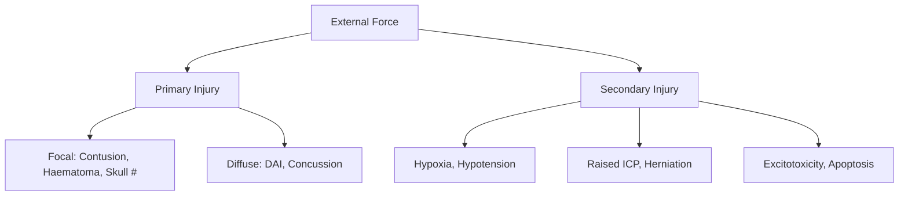
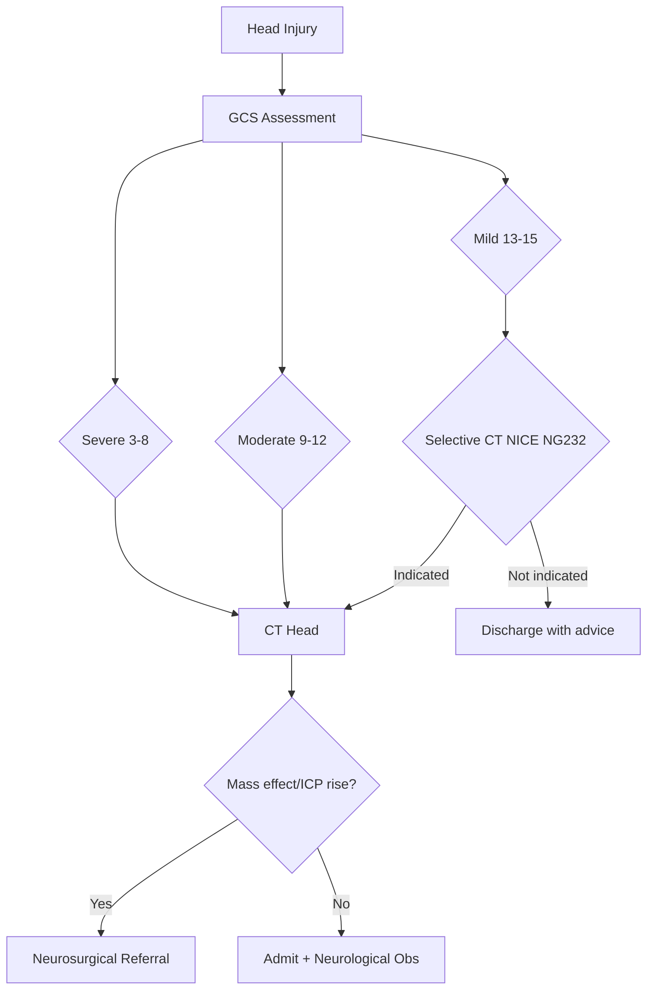

# Traumatic Brain Injury & CTE

Related: [[Cognitive Screening]], [[Dementia Workup]], [[Alzheimers Disease]], [[Frontotemporal Dementia]], [[Delirium vs Dementia]]

> [!tip] **Definition**
> **TBI:** Alteration in brain function or other evidence of brain pathology caused by an external force. Severity by **GCS** (Mild 13-15, Moderate 9-12, Severe 3-8) and **post-traumatic amnesia (PTA)** duration.
> **CTE:** A **tauopathy** from **repetitive mild TBI** (boxing, contact sports, military), with pathognomonic **perivascular p-tau aggregates in neurons/astrocytes at depths of cortical sulci** (NINDS/NIBIB 2015).

## Learning Objectives
- [ ] Define TBI severity and classify by mechanism
- [ ] Describe acute and chronic sequelae
- [ ] Localise focal vs diffuse injury
- [ ] Outline acute resuscitation and surgical indications
- [ ] Diagnose CTE clinicopathologically
- [ ] Differentiate CTE from AD, FTD, PCS
- [ ] Recall FCPS/MRCP high-yield facts

---

## 1. Definition / Epidemiology / Classification

### Definition
**TBI:** External mechanical force causing brain dysfunction (LOC, amnesia, neurological deficit, skull #, intracranial lesion).
**CTE:** Progressive tauopathy from repetitive subconcussive/concussive head impacts.

### Epidemiology
- **Incidence:** 50-60 million/year worldwide; 1.4 million UK attendances/year
- **Age:** Bimodal — young males (15-24) and elderly (>65 falls)
- **Sex:** M:F = 2:1
- **Risk factors:** Alcohol, contact sports, military combat, falls, prior TBI (2-3x risk)

### Classification (Severity)
| Category | GCS | PTA | LOC |
|----------|-----|-----|-----|
| **Mild (concussion)** | 13-15 | <24h | <30 min |
| **Moderate** | 9-12 | 1-7 days | 30 min-24h |
| **Severe** | 3-8 | >7 days | >24h |

### Classification (Morphology)
- **Focal:** Extradural (epidural) haematoma, subdural haematoma (acute/chronic), ICH, contusion, depressed #
- **Diffuse:** Diffuse axonal injury (DAI), concussion, hypoxic-ischaemic injury

---

## 2. Aetiology / Pathophysiology

### Aetiology
- **Mechanical:** Direct impact, acceleration-deceleration, rotational, penetrating
- **Mechanisms:** MVC (most common cause of severe TBI), falls, assault, sports, blast (military)

### Pathophysiology

### CTE Molecular Pathology
- **McKee/NINDS criteria:** Perivascular p-tau aggregates in neurons + astrocytes at depths of sulci (pathognomonic)
- **Staging:** I (focal epicentres) → II (multiple foci) → III (widespread) → IV (widespread + medial temporal lobe)
- **TDP-43** in 80% (esp. CTE-ALS); **Aβ** in 50% (co-pathology)
- **ApoE ε4** allele ↑ risk/severity

---

## 3. Clinical Features

### History
- **Mechanism:** Direction, force, helmet, intoxication
- **LOC, PTA, retrograde amnesia** (PTA >1h = poor prognosis)
- **Symptoms:** Headache, vomiting, seizures, confusion, focal deficit
- **Red flags:** GCS<13, focal neurology, persistent vomiting, skull #, anticoagulation, PTA>30 min

### Examination
| Domain | Findings | Significance |
|--------|----------|--------------|
| **GCS** | Eye + Verbal + Motor | Severity + serial monitoring |
| **Pupils** | Anisocoria, reactivity | Uncal herniation, CN III |
| **Focal neurology** | Hemiparesis, aphasia | Focal lesion |
| **CSF rhinorrhoea/otorrhoea** | Glucose+, halo | Basal skull # |
| **Battle sign, Raccoon eyes** | Bruising | Basal skull # |

### Post-Concussion Syndrome (PCS)
- **Symptoms:** Headache, dizziness, cognitive fog, sleep disturbance, mood changes
- **Duration:** Days to weeks (most), or months (10-15%)

### CTE Clinical Phenotype
- **Behavioural/Mood (younger):** Impulsivity, aggression, depression, suicidality
- **Cognitive (older):** Memory loss, executive dysfunction
- **Motor (late):** Parkinsonism, gait disturbance, dysarthria
- **Mixed AD/ALS:** Cognitive + motor neuron signs

---

## 4. Diagnostic Approach

### CT Head Indications (NICE NG232)
- GCS <13, or GCS <15 at 2h post-injury
- Suspected skull #, focal neurological deficit
- Seizure, >1 vomit, PTA >30 min, LOC >5 min
- Anticoagulation

### CTE Diagnostic Criteria
- **Definitive:** Postmortem pathognomonic lesion (perivascular p-tau at sulcal depths)
- **Clinical research:** Repetitive head impact + core features + gradual progression + exclusion of alternative diagnosis

---

## 5. Investigations

### First-Line
| Investigation | Indication | Finding |
|---------------|------------|---------|
| **CT Head** | All moderate/severe; selected mild | Haematoma, contusion, #, oedema, mass effect, midline shift |
| **GCS + PTA** | All | Severity |

### MRI (subacute/chronic)
| Sequence | Finding |
|----------|---------|
| **DWI/ADC** | DAI (corpus callosum, brainstem, grey-white junction) |
| **SWI/GRE** | Microbleeds (DAI, amyloid angiopathy) |
| **T2/FLAIR** | Gliosis, contusion, encephalomalacia |

### Biomarkers (research)
- **NSE, GFAP, UCH-L1, NFL** — TBI severity/prognosis
- **p-tau in CSF/blood** — CTE research (no validated clinical test)

### CTE Pathological Diagnosis
- **Brain donation** to CTE research bank
- McKee staging: I (focal) → IV (widespread + neurodegeneration)

---

## 6. Differential Diagnosis

| Differential | Distinguishing Features | Key Test |
|--------------|------------------------|----------|
| **Alzheimer's disease** | Insidious onset, episodic memory, no trauma | MRI hippocampal atrophy, amyloid PET |
| **FTD** | Personality/behavioral change, frontal atrophy | MRI (knife-edge atrophy) |
| **DLB** | Visual hallucinations, parkinsonism | DAT-SPECT |
| **Post-concussion syndrome** | Single TBI, resolves weeks | Clinical, MRI normal |
| **Chronic SDH** | Elderly, fluctuating, minimal trauma | CT (crescentic) |
| **NPH** | Triad: gait+cognition+incontinence | CT/MRI ventriculomegaly |
| **Vascular dementia** | Stepwise, vascular risk factors | MRI white matter |
| **Depression / PTSD** | Mood-related, trauma history | Psychiatric evaluation |

---

## 7. Management

### Emergency / Acute
| Step | Action |
|------|--------|
| **ABCDE** | Airway + C-spine, Breathing, Circulation, Disability, Exposure |
| **Intubation** | GCS ≤8, airway compromise |
| **Resuscitation bundle** | SBP ≥110, PaO2 ≥13 kPa, PaCO2 4.5-5.0, head up 30°, normothermia, glucose 4-10 mmol/L |
| **Hyperosmolar therapy** | **Mannitol 20% 0.25-1g/kg** OR **5% Hypertonic saline 150-250ml** for ICP >20 mmHg |
| **Sedation/ventilation** | Propofol/midazolam; titrate to ICP/CPP |
| **Seizure prophylaxis** | Phenytoin 15-18mg/kg load → 100mg IV q8h × 7d (early only) |

### Surgical
| Lesion | Indication | Procedure |
|--------|------------|-----------|
| **Epidural haematoma** | >30ml, shift >5mm, GCS<9, herniation | **Craniotomy + evacuation** |
| **Acute SDH** | Thickness >10mm, shift >5mm, deteriorating GCS | Craniotomy + evacuation |
| **Chronic SDH** | Symptomatic, >10mm thickness | **Burr hole drainage** |
| **Depressed skull #** | Open, >1cm depression, haematoma | Elevation |
| **Massive contusion/ICH** | Mass effect | Decompressive craniectomy |
| **Refractory ICP** | ICP >25-30 mmHg despite medical | Decompressive craniectomy |

### Chronic Sequelae
- **PCS:** Education, reassurance, graduated return, vestibular rehab
- **Headache:** Post-traumatic (triptans, propranolol, amitriptyline)
- **Mood disorder:** SSRIs, CBT
- **Cognitive rehabilitation:** OT, neuropsychology

### CTE Management
- **No disease-modifying treatment** (prevention critical)
- **Symptomatic:** SSRIs, behavioural strategies, mood stabilisers
- **Exercise moderation:** Avoid further head impact, retire from contact sport
- **Research:** Lecanemab, tau-targeting clinical trials

---

## 8. Drug Interactions / Cautions

| Drug | Caution | Management |
|------|---------|------------|
| **Anticoagulants** | ↑ICH expansion | Reverse (PCC + Vit K for warfarin, Andexanet for Factor Xa) |
| **Antiplatelets** | ↑Bleeding risk | Platelet transfusion in selected cases |
| **Phenytoin** | CYP inducer | Monitor levels |
| **Mannitol** | Hypovolaemia, renal failure | Osmolality gap |
| **Hypertonic saline** | Osmotic demyelination | Slow correction of Na+ |

---

## 9. Procedures

### ICP Monitor Insertion
- **Indication:** Severe TBI (GCS ≤8) + abnormal CT, or normal CT with risk factors (age>40, hypotension, motor posturing)
- **Types:** Parenchymal (Codman, Camino), Intraventricular (EVD)
- **Target:** ICP <20-22 mmHg; CPP 60-70 mmHg
- **Complications:** Infection, haemorrhage, obstruction, malposition

### Burr Hole Drainage (Chronic SDH)
- **Indication:** Symptomatic, >10mm thickness, shift >5mm
- **Twist-drill or burr hole + drain placement 24-48h**

---

## 10. Complications

| Complication | Frequency | Management |
|--------------|-----------|------------|
| **Epilepsy (post-traumatic)** | 5-7% (severe), 50% with haematoma | ASMs; Phenytoin prophylaxis ×1 wk only |
| **Chronic SDH** | Elderly, alcoholics | Burr hole drainage |
| **Hydrocephalus** | SAH, IVH, meningitis | EVD, VP shunt |
| **CSF leak** | Basal skull # | Conservative 1-2 weeks; surgical if persists |
| **Meningitis** | Base of skull # | Antibiotics ± repair |
| **Cognitive impairment** | 50-65% severe TBI | Rehabilitation |
| **Personality change** | Common, frontal | MDT, supportive |
| **Hypopituitarism** | 25-50% | Hormone screen + replace |
| **CTE** | Repeated subconcussive impact | Prevention |

---

## 11. Red Flags / Emergencies

| Red Flag | Action |
|----------|--------|
| **GCS ≤8** | Intubate + ICU + ICP monitor |
| **Cushing's triad** (bradycardia + HTN + irregular respiration) | Impending herniation — hyperventilate, mannitol, neurosurgery |
| **Pupil anisocoria** | Uncal herniation — urgent CT + surgery |
| **EDH/SDH mass effect** | Emergency craniotomy |
| **Status epilepticus post-TBI** | Standard SE protocol + treat cause |

---

## 12. Prognosis

| Factor | Good | Poor |
|--------|------|------|
| **GCS** | 13-15 | 3-8 |
| **Age** | <40 | >60 |
| **PTA** | <24h | >1-2 weeks |
| **CT** | Normal | Diffuse oedema, DAI, brainstem |
| **ICP** | <20 mmHg | >25 mmHg |

- **Mortality:** Mild 0.1%, Moderate 10%, Severe 30-50%
- **GOS-E:** 8 categories from death to upper good recovery
- **CTE:** Progressive, median survival 6 years post-diagnosis

---

## 13. Topic Correlation

| Related Topic | Overlap |
|---------------|---------|
| **Cognitive Screening** | MoCA/ACE tools for chronic impairment |
| **Alzheimers Disease** | CTE-Aβ co-pathology; differentiation |
| **FTD** | Behavioural variant CTE vs FTD |
| **DLB** | Parkinsonism overlap |
| **Hypopituitarism** | Post-TBI endocrine sequelae |

---

## 14. Special Situations

| Situation | Consideration |
|-----------|---------------|
| **Pregnancy** | CT if severe — benefit > risk; lead shield |
| **Paediatric** | Special GCS; abusive head trauma; NAI screen |
| **Elderly** | Falls prevention, antiplatelets/anticoagulants, chronic SDH risk |
| **Anticoagulated** | Urgent CT, reverse anticoagulation |
| **Driving (DVLA)** | Suspended 6-12 months; Group 2 longer |
| **Contact sports** | Graduated return-to-play; retirement after multiple concussions |

---

## FCPS/MRCP High-Yield Summary

| Category | Key Points |
|----------|------------|
| **Definition** | TBI = external force causing brain dysfunction; CTE = repetitive impact tauopathy |
| **Severity** | GCS mild 13-15, moderate 9-12, severe 3-8 |
| **Pathology CTE** | Perivascular p-tau at sulcal depths (NINDS 2015) |
| **Acute management** | ABCDE, SBP>110, ICP<20-22, CPP 60-70, mannitol/hypertonic saline |
| **Surgical** | EDH/SDH mass effect = craniotomy; chronic SDH = burr hole; refractory ICP = decompressive craniectomy |
| **Complications** | Epilepsy, chronic SDH, hypopituitarism, hydrocephalus, cognitive, CTE |
| **CTE** | Behavioural (young) + cognitive (older) + motor late; TDP-43 80%, Aβ 50% |
| **Differential** | AD, FTD, DLB, post-concussion, chronic SDH, NPH, vascular dementia |

---

## Viva Questions

1. **Q:** Classify TBI severity. **A:** Mild GCS 13-15 (PTA<24h, LOC<30min); Moderate 9-12 (PTA 1-7d); Severe 3-8 (PTA>7d, LOC>24h).
2. **Q:** Pathognomonic lesion in CTE. **A:** Perivascular p-tau aggregates in neurons/astrocytes at depths of cortical sulci (NINDS 2015).
3. **Q:** Management of raised ICP. **A:** Head up 30°, sedation, hyperosmolar therapy (mannitol 0.25-1g/kg or 5% saline), controlled ventilation, surgical decompression; ICP<20-22 mmHg.
4. **Q:** Indications for EDH surgery. **A:** Volume >30ml, midline shift >5mm, GCS<9, focal signs, herniation.
5. **Q:** Difference between acute and chronic SDH. **A:** Acute: <7 days, hyperdense crescent, venous (bridging veins), trauma. Chronic: >21 days, hypodense, elderly/alcoholic, may have minimal trauma, treated with burr hole.
6. **Q:** Post-traumatic epilepsy timing. **A:** Early = within 7 days; Late = after 7 days. Phenytoin prophylaxis 7 days only.
7. **Q:** Differentiate CTE from AD. **A:** CTE: repetitive trauma, perivascular p-tau at sulcal depths, TDP-43. AD: insidious onset, episodic memory, Aβ plaques, hippocampal atrophy, no trauma.
8. **Q:** Cushing's triad. **A:** Bradycardia, hypertension (widened pulse pressure), irregular respiration — raised ICP, impending herniation.

---

## Common Confusions / Exam Traps

| Confusion | Clarification |
|-----------|---------------|
| **EDH vs SDH source** | EDH = middle meningeal artery (lens shape, doesn't cross sutures); SDH = bridging veins (crescent, crosses sutures) |
| **CTE vs AD tau** | CTE = sulcal depths, perivascular, astrocytes+neurons; AD = hippocampal/neocortical, neurofibrillary tangles, no trauma |
| **Concussion CT** | Often normal; symptoms out of proportion |
| **Phenytoin prophylaxis** | Only 7 days; does NOT prevent late epilepsy |
| **Return to play** | Stepwise (rest → exercise → contact) minimum 7 days |

---

## Mnemonics

1. **ABCDE** — Airway, Breathing, Circulation, Disability, Exposure
2. **CTE 4 R's** — Repetitive trauma, Ramping tau, Rising age, Resist no treatment

---

## One-Page Revision Card

| **Topic** | **TBI & CTE** |
|-----------|---------------|
| **Definition** | TBI = mechanical force causing brain dysfunction; CTE = repetitive impact tauopathy |
| **Severity** | GCS mild 13-15, moderate 9-12, severe 3-8 |
| **Acute pathway** | ABCDE → SBP>110, ICP<20-22 → mannitol/hypertonic saline → surgery |
| **Surgical indications** | EDH/SDH with mass effect, depressed #, refractory ICP |
| **CTE pathology** | Perivascular p-tau at sulcal depths (NINDS 2015) |
| **CTE clinical** | Behavioural (young) → cognitive (older) → motor late |
| **Differentials** | AD, FTD, DLB, PCS, chronic SDH, NPH |
| **Drug doses** | Mannitol 0.25-1g/kg; Phenytoin 15-18mg/kg; Hypertonic saline 5% 150-250ml |

---

## MCQs (10)

1. **Pathognomonic lesion of CTE?** A. Diffuse Aβ plaques B. Lewy bodies C. **Perivascular p-tau at sulcal depths** D. Pick bodies
   **Answer:** C — NINDS 2015 criteria; perivascular p-tau aggregates in neurons/astrocytes at sulcal depths.

2. **Severe TBI with refractory ICP 35 mmHg. Next step?** A. Repeat mannitol B. **Decompressive craniectomy** C. Thiopentone coma D. Hypothermia
   **Answer:** B — Refractory ICP >25-30 mmHg with mass effect = decompressive craniectomy (DECRA/RESCUEicp).

3. **Source of bleeding in EDH?** A. Bridging veins B. **Middle meningeal artery** C. ACA D. Basal veins
   **Answer:** B — EDH typically from middle meningeal artery, often with pterion fracture.

4. **Classic CT of chronic SDH?** A. Hyperdense biconvex B. Hyperdense crescent C. **Hypodense crescent** D. Hyperdense in ventricles
   **Answer:** C — Chronic SDH (>3 weeks) hypodense crescentic; acute SDH hyperdense; subacute isodense.

5. **Target ICP in severe TBI?** A. <10 B. **<20-22 mmHg** C. <30 D. <5
   **Answer:** B — Target ICP <20-22 mmHg; CPP 60-70 mmHg (BTF guidelines).

6. **Phenytoin prophylaxis duration post-TBI?** A. 24h B. **7 days** C. 3 months D. Lifelong
   **Answer:** B — Phenytoin 7 days only; reduces early seizures, not late epilepsy.

7. **CTE variant in younger patients?** A. Cognitive B. **Behavioural/Mood** C. Motor D. Sensory
   **Answer:** B — Behavioural/mood (impulsivity, aggression, depression) presents younger; cognitive in older.

8. **NICE criteria for CT in mild TBI — all EXCEPT?** A. GCS<13 at 2h B. Suspected skull # C. **Single vomiting** D. Focal neurology
   **Answer:** C — Single vomit is NOT indication; >1 vomit is.

9. **Risk factor for chronic SDH?** A. Young male athlete B. **Elderly alcoholic** C. Pregnancy D. Childhood
   **Answer:** B — Risk factors: elderly, alcohol, anticoagulants, brain atrophy, ventricular shunts.

10. **Cytokine pathway in chronic neuroinflammation post-TBI?** A. **IL-1β/IL-6/NF-κB** B. IL-2/IFN-γ C. IL-4/IL-13 D. IL-10/TGF-β
    **Answer:** A — Chronic microglial activation drives IL-1β, IL-6, TNF-α via NF-κB.

---

## SBA Questions (10)

1. **25-year-old boxer, 10 years post-retirement, with irritability, depression, memory problems; medial temporal/frontal atrophy. Diagnosis?**
   A. AD B. bvFTD C. **CTE stage III** D. DLB
   **Answer:** C — Repetitive impact + behavioural + cognitive + motor + MRI = CTE III.

2. **60-year-old on warfarin falls, GCS 14, no LOC, no focal deficit. Next step?**
   A. Discharge B. **Urgent CT head** C. Aspirin 300mg D. LP
   **Answer:** B — Anticoagulation = CT head always (NICE NG232).

3. **20-year-old RTC, GCS 4, fixed dilated right pupil, BP 180/100, HR 50, 30ml right temporal EDH with 8mm shift. Management?**
   A. Reverse anticoag B. Mannitol only C. **Emergency craniotomy + evacuation** D. Observe
   **Answer:** C — Cushing's triad + large EDH with mass effect = emergency craniotomy.

4. **75-year-old, 3 weeks post-fall, confusion, headache, left-sided weakness. CT: right hypodense crescent 12mm, 6mm shift. Diagnosis?**
   A. Acute SDH B. **Chronic SDH** C. EDH D. SD hygroma
   **Answer:** B — Hypodense (>3 weeks) crescent = chronic SDH; burr hole if symptomatic or >10mm.

5. **35-year-old footballer, 3 concussions in 18 months. After the second, advise?**
   A. Continue B. **Retire from contact sport** C. Better helmet D. Aspirin
   **Answer:** B — Multiple concussions + CTE risk = retirement from contact sport.

6. **Severe TBI, ICP 25, CPP 55, MAP 80. Intervention?**
   A. Stop fluids B. **Increase MAP with noradrenaline to CPP>60** C. LP D. Stop sedation
   **Answer:** B — CPP = MAP-ICP; if <60, ↑ MAP to maintain CPP 60-70.

7. **Chronic alcoholic with progressive cognitive decline, gait disturbance, incontinence; ventriculomegaly out of proportion to atrophy. Next investigation?**
   A. Biopsy B. **LP infusion study/tap test** C. EEG D. DAT-SPECT
   **Answer:** B — NPH suspected → LP tap test or infusion study pre-VP shunt.

8. **TBI patient on phenytoin with nystagmus, ataxia, confusion. Cause?**
   A. **Phenytoin toxicity** B. Recurrent seizure C. Wernicke's D. Raised ICP
   **Answer:** A — Nystagmus+ataxia+confusion = phenytoin toxicity; check level (10-20 mg/L).

9. **6 months post-severe TBI: fatigue, weight loss, low BP, hyponatraemia. Diagnosis?**
   A. Adrenal crisis B. **Post-traumatic hypopituitarism** C. SIADH D. DI
   **Answer:** B — Post-TBI hypopituitarism common (25-50%); check cortisol, TSH, GH, gonadotropins.

10. **Severe TBI, positive S100β and UCH-L1. These are markers of?**
    A. **Astrocyte and neuronal injury** B. Renal function C. Coagulation D. Liver function
    **Answer:** A — S100β (astrocyte) and UCH-L1 (neuronal) = brain injury biomarkers.

---

## Flashcards

- **Q:** GCS classification of TBI severity? **A:** Mild 13-15, Moderate 9-12, Severe 3-8
- **Q:** Pathognomonic lesion in CTE? **A:** Perivascular p-tau at sulcal depths (NINDS 2015)
- **Q:** Source of EDH bleeding? **A:** Middle meningeal artery
- **Q:** Source of SDH bleeding? **A:** Bridging veins
- **Q:** Target ICP in severe TBI? **A:** <20-22 mmHg; CPP 60-70 mmHg
- **Q:** Osmotic therapy agents? **A:** Mannitol 0.25-1g/kg; Hypertonic saline 5% 150-250ml
- **Q:** Phenytoin prophylaxis duration? **A:** 7 days (early only, not late)
- **Q:** Indications for CT in mild TBI (NICE)? **A:** GCS<13, >1 vomit, focal signs, suspected #, LOC>5min, PTA>30min, anticoagulation
- **Q:** CTE clinical variants? **A:** Behavioural (young), Cognitive (older), Motor (late)
- **Q:** SDH treatments? **A:** Acute = craniotomy; Chronic = burr hole drainage

---

## Answer Key with Explanations

### MCQs
1. **C** — Perivascular p-tau at sulcal depths
2. **B** — Decompressive craniectomy for refractory ICP
3. **B** — Middle meningeal artery
4. **C** — Hypodense crescent = chronic SDH
5. **B** — ICP <20-22 mmHg (BTF)
6. **B** — Phenytoin 7 days
7. **B** — Behavioural/mood in young
8. **C** — Single vomit not indication
9. **B** — Elderly + alcohol = chronic SDH
10. **A** — IL-1β/IL-6/NF-κB

### SBAs
1. **C** — Repetitive trauma + clinical + MRI = CTE III
2. **B** — Anticoagulation = CT head always
3. **C** — Cushing's triad + EDH = emergency craniotomy
4. **B** — Hypodense crescent = chronic SDH
5. **B** — Multiple concussions = retire
6. **B** — CPP<60 → increase MAP
7. **B** — NPH = LP/tap test
8. **A** — Nystagmus+ataxia = phenytoin toxicity
9. **B** — Post-TBI hypopituitarism (25-50%)
10. **A** — S100β + UCH-L1 = brain injury biomarkers

---

## Local Navigation
**Heading Hub:** [[06_Dementia_Cognitive_Disorders/Dementia & Cognitive Disorders Hub]]  
**Topic-Group Hub:** [[06_Dementia_Cognitive_Disorders/Cognitive Assessment & Other Hub]]  
**Related Topics:** [[Cognitive Screening]], [[Dementia with Lewy Bodies]], [[Alzheimers Disease]], [[Frontotemporal Dementia]], [[Delirium vs Dementia]]
