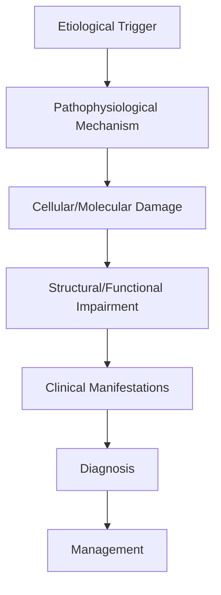
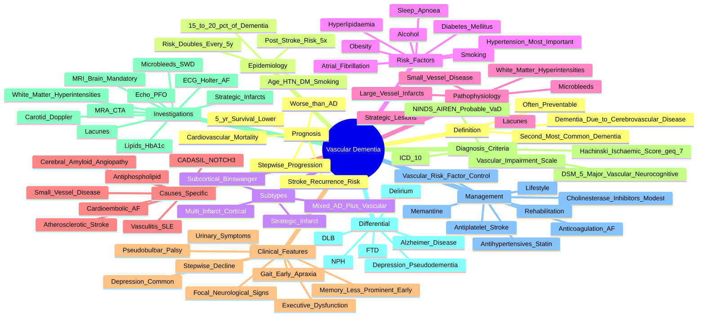

# Vascular Dementia

> [!tip] **High-Yield Definition**
> Comprehensive clinical note for Vascular Dementia covering definition, epidemiology, aetiology, pathophysiology, clinical features, investigations, differential diagnosis, management, drug interactions, procedures, complications, red flags, prognosis, topic correlation, and special situations for FCPS/MRCP examination preparation based on Davidson 24th Edition Chapter 25: Neurology.

---

## 1. Definition / Epidemiology / Classification

### Definition
Vascular Dementia is a neurological disorder within the 06 dementia cognitive disorders category. It is characterised by specific clinical, pathological, radiological, and laboratory features that allow differentiation from related conditions.

### Epidemiology
- **Incidence/Prevalence:** Variable depending on the specific condition.
- **Age:** Adult onset is most common, but paediatric and elderly presentations occur.
- **Sex:** Variable depending on the condition.
- **Geography:** Worldwide distribution, with higher prevalence in certain regions.
- **Risk Factors:** Genetic predisposition, environmental factors, comorbidities, family history.

### Classification
| Subtype | Key Features | Prognosis |
|---------|-------------|-----------|
| Mild/early | Subtle symptoms, preserved function | Best |
| Moderate | Clear symptoms, functional impairment | Variable |
| Severe | Significant disability, complications | Worst |

---

## 2. Aetiology / Pathophysiology

### Aetiology
- **Primary (idiopathic):** Most cases have no identifiable cause.
- **Genetic:** May be inherited (AD, AR, X-linked, mitochondrial, sporadic).
- **Autoimmune:** Autoantibodies, immune-mediated inflammation.
- **Infectious:** Viral, bacterial, fungal, parasitic.
- **Metabolic:** Electrolyte, endocrine, hepatic, renal, nutritional.
- **Toxic:** Drugs, alcohol, heavy metals, environmental toxins.
- **Vascular:** Ischaemia, haemorrhage, vasculitis.
- **Neoplastic:** Primary, secondary, paraneoplastic.
- **Traumatic:** Acute, chronic, repetitive.
- **Degenerative:** Neurodegeneration, protein misfolding.

### Pathophysiology


---

## 3. Clinical Features

### History
- **Onset/Duration:** Acute, subacute, or chronic.
- **Progression:** Static, progressive, relapsing-remitting, stepwise.
- **Key symptoms:** Specific to the condition.
- **Triggers:** Stress, infection, trauma, drugs, hormonal, environmental.
- **Systemic symptoms:** Constitutional features.
- **Drug/Family/Social history:** Relevant exposures, comorbidities.

### Examination
| Domain | Key Findings | Localisation Value |
|--------|-------------|-------------------|
| Higher function | Cognitive, behavioural | Cortical, subcortical, limbic |
| Cranial nerves | Pupils, eye movements, facial, bulbar | Brainstem, cranial nerve, NMJ |
| Motor | Weakness, tone, reflexes | UMN, LMN, NMJ, muscle |
| Sensory | All modalities, pattern | Peripheral, spinal, brainstem |
| Coordination | Ataxia, nystagmus, dysmetria | Cerebellar, sensory, vestibular |
| Gait | Spastic, ataxic, parkinsonian | Multiple |
| Autonomic | Orthostatic, sweating, GI, bladder | Autonomic, peripheral, central |

### Specific Clinical Features
The clinical features are determined by the underlying aetiology, location of pathology, and rate of progression. Patients typically present with a constellation of symptoms and signs that allow clinical localisation and subsequent targeted investigation.

---

## 4. Diagnostic Approach / Algorithm

```mermaid
flowchart TD
    A[Clinical Presentation] --> B[Anatomical Localisation]
    B --> C[Pathophysiological Category]
    C --> D[Formulate Differential]
    D --> E[Targeted Investigations]
    E --> F[Confirm Diagnosis]
    F --> G[Assess Severity/Prognosis]
    G --> H[Initiate Management]
    H --> I[Monitor Response]
    I --> J{Response?}
    J --> YES1 [Good - Continue]
    J --> NO1 [Poor - Escalate]
    YES1 --> K[Monitor]
    NO1 --> H
```

---

## 5. Investigations

### First-Line Investigations
- **Blood tests:** FBC, U&Es, LFTs, glucose, calcium, magnesium, ESR, CRP, autoimmune, infection.
- **Imaging:** CT/MRI brain/spine (essential for most neurological conditions).
- **Neurophysiology:** EEG, nerve conduction, EMG, evoked potentials.
- **CSF:** Cell count, protein, glucose, OCBs, PCR, culture.

### Second-Line Investigations
- **Genetic testing:** Gene panels, WES, WGS.
- **Antibody testing:** Antineuronal, autoimmune, paraneoplastic.
- **Biopsy:** Nerve, muscle, brain, skin.
- **Advanced imaging:** PET-CT, MR spectroscopy, fMRI.

### Specialised Investigations
- **Biomarkers:** Neurofilament light chain, tau, beta-amyloid, 14-3-3, RT-QuIC.
- **Autonomic testing:** Head-up tilt, sudomotor, QSART.
- **Neuropsychology:** Cognitive testing, behavioural assessment.
- **Genetic counselling:** Family screening, predictive testing.

---

## 6. Differential Diagnosis

| Differential | Distinguishing Features | Key Test |
|--------------|------------------------|----------|
| Vascular | Sudden onset, focal, vascular risk factors | MRI/CT, vessel imaging |
| Inflammatory | Subacute, multifocal, systemic | MRI, CSF, antibodies |
| Infectious | Fever, systemic, exposure | Bloods, CSF, imaging |
| Neoplastic | Progressive, mass effect | MRI, biopsy |
| Degenerative | Progressive, symmetric, hereditary | MRI, genetic |
| Toxic/Metabolic | Drug history, systemic, reversible | Bloods, toxicology |
| Autoimmune | Multifocal, antibodies, immunotherapy response | Antibodies, MRI, CSF |
| Functional | Inconsistent, distractible | Clinical, video, biomarkers |

---

## 7. Management

### Acute Management
- **Stabilisation:** ABCDE approach, emergency resuscitation.
- **Specific treatment:** Disease-specific interventions.
- **Symptomatic relief:** Pain, seizures, spasticity, autonomic dysfunction.
- **Prevention of complications:** DVT, pressure sores, infection.

### Disease-Modifying Treatment
- **Pharmacological:** First-line, second-line, escalation, maintenance.
- **Procedural:** Surgery, biopsy, drainage, ablation, stimulation.
- **Immunotherapy:** Steroids, IVIG, plasma exchange, immunosuppressants, biologics.
- **Rehabilitation:** Physiotherapy, OT, speech therapy.

### Long-Term Management
- **Monitoring:** Clinical, imaging, biomarkers, side effects.
- **Prevention:** Vaccinations, prophylaxis, lifestyle modification.
- **Supportive care:** Multidisciplinary team, social work, psychological support.
- **Palliative care:** Advanced care planning, end-of-life care, hospice.

---

## 8. Drug Interactions / Contraindications / Comorbidity Cautions

| Drug Class | Interaction / Caution | Management |
|------------|----------------------|------------|
| Antiseizure medications | Enzyme induction, teratogenicity | Monitor, supplement, switch |
| Immunosuppressants | Infection, malignancy, teratogenicity | Monitor, prophylaxis |
| Anticoagulants | Bleeding risk, drug interactions | Monitor INR, avoid combinations |
| Antihypertensives | Hypotension, falls | Monitor BP, adjust dose |
| Antibiotics | Nephrotoxicity, ototoxicity | Monitor renal |
| Antivirals | Nephrotoxicity, neuropsychiatric | Monitor renal, dose adjust |
| Steroids | DM, HTN, osteoporosis, infection | Monitor, prophylaxis, taper |
| Biologics | Infusion reactions, infection | Monitor, prophylaxis |

---

## 9. Procedures

### Common Procedures
- **Lumbar puncture:** Diagnostic, therapeutic (IIH, NPH). Contraindications: raised ICP, mass lesion, coagulopathy.
- **Nerve conduction studies/EMG:** Diagnostic, prognosis. Minor discomfort.
- **EEG:** Diagnostic, monitoring. No significant complications.
- **MRI brain/spine:** Diagnostic, monitoring. Contraindications: pacemaker, metallic implants.
- **CT head:** Emergency, rapid. Radiation exposure, contrast reactions.
- **Biopsy:** Stereotactic, open. Indications: diagnosis, molecular profiling.

---

## 10. Complications

| Complication | Frequency | Prevention | Management |
|--------------|-----------|------------|------------|
| Infection | Common | Hygiene, prophylaxis, vaccination | Antibiotics, antifungals |
| Thrombosis | Common | Prophylaxis, mobility | Anticoagulation |
| Pressure sores | Common | Positioning, nutrition | Wound care, surgery |
| Spasticity | Common | Positioning, stretching | Baclofen, BoNT |
| Contractures | Common | Passive movements, splints | Physiotherapy, surgery |
| Aspiration | Common | Swallow assessment | NGT, PEG, thickeners |
| Falls | Common | Environment, mobility | Walking aids |
| Fractures | Common | Bone health, prevention | Vitamin D, bisphosphonate |
| Depression | Common | Screening, support | Antidepressants, CBT |
| Cognitive decline | Variable | Monitoring, training | Rehabilitation |
| Autonomic dysfunction | Variable | Monitoring, hydration | Midodrine, fludrocortisone |
| Respiratory failure | Variable | Monitoring, supportive | Ventilation, NIV |
| Death | Variable | Monitoring, palliative | End-of-life care |

---

## 11. Red Flags / Emergencies

### Emergency Presentations
- **Rapid neurological deterioration:** New focal deficit, decreased consciousness, seizures.
- **Status epilepticus:** Continuous seizures >5 min.
- **Raised ICP:** Headache, vomiting, papilloedema, altered consciousness.
- **Respiratory failure:** Hypoxia, hypercapnia, ventilatory failure.
- **Cardiac arrest:** Arrhythmia, MI, pulmonary embolism.
- **Infection:** Sepsis, meningitis, abscess, encephalitis.
- **Drug toxicity:** Overdose, side effects, interactions.
- **Haemorrhage:** Intracranial, systemic, coagulopathy.

---

## 12. Prognosis

### Natural History
- **Acute:** May resolve with treatment, may progress, may be fatal.
- **Subacute:** Variable, depends on cause and treatment.
- **Chronic:** Often progressive, may be stable, may have relapses.
- **Recovery:** Variable, may be complete, partial, or none.

### Prognostic Factors
- **Favourable:** Young age, early treatment, mild disease, reversible cause, good premorbid function, family support.
- **Unfavourable:** Older age, delayed treatment, severe disease, irreversible cause, poor premorbid function, comorbidities.

---

## 13. Topic Correlation

| Related Topic | Link | Key Overlap |
|---------------|------|-------------|
| Davidson 24th Ed Chapter 25 | [[Davidson Chapter 25 - Neurology Hierarchy]] | Comprehensive neurology |
| Neurology MOC | [[Neurology MOC]] | All neurology topics |
| Drug Reference | [[../00_Index/Neurology Drug Reference]] | Medications |
| Local Hub | [[../06_Dementia_Cognitive_Disorders/Hub]] | Section-specific |
| Clinical Examination | [[../01_Fundamentals_Examination/Neurological History Taking]] | Clinical approach |
| Investigation | [[../01_Fundamentals_Examination/Neuroimaging (CT-MRI) Principles]] | Imaging |

---

## 14. Special Situations

| Situation | Consideration |
|-----------|---------------|
| **Pregnancy** | Pre-conception counselling, teratogenicity, drug safety, monitoring, delivery planning, breastfeeding. |
| **Lactation** | Drug safety, breastfeeding, monitoring, support. |
| **Paediatric** | Developmental considerations, drug dosing, school, family, vaccination, growth, puberty. |
| **Elderly / Frail** | Comorbidities, polypharmacy, falls, bone health, cognition, social, end-of-life. |
| **Renal impairment** | Drug dose adjustment, monitoring, dialysis, transplant. |
| **Hepatic impairment** | Drug dose adjustment, monitoring, transplant. |
| **Immunocompromised** | Infection prophylaxis, vaccination, drug interactions, malignancy screening. |
| **Perioperative** | Drug management, anaesthesia planning, VTE prophylaxis, infection prevention, monitoring. |
| **Driving / DVLA** | Fitness to drive, restrictions, notification, reassessment. |
| **Occupational** | Fitness for work, adaptations, rehabilitation, disability, return to work. |

---

## FCPS/MRCP High-Yield Summary

| Category | Key Points |
|----------|------------|
| **Definition** | Comprehensive definition with key diagnostic criteria |
| **Epidemiology** | Incidence, prevalence, age, sex, geography, risk factors |
| **Aetiology** | Primary causes, secondary causes, genetic, environmental |
| **Pathophysiology** | Mechanism of disease, cellular/molecular basis |
| **Clinical Features** | History, examination, key findings, variants |
| **Diagnosis** | Diagnostic criteria, classification, severity |
| **Investigations** | First-line, second-line, specialised, biomarkers |
| **Differential Diagnosis** | Key differentials, distinguishing features, tests |
| **Management** | Acute, disease-modifying, symptomatic, supportive |
| **Complications** | Common, serious, prevention, management |
| **Prognosis** | Natural history, prognostic factors, outcomes |
| **Viva Pearls** | Key examination points |
| **Drug Doses** | First-line, second-line, emergency |
| **Scoring Systems** | Specific scores used in management |
| **Genetics** | Inheritance, genes, mutations, family screening |
| **Imaging Signs** | Characteristic findings, differential |

---

## Viva Questions (PACES/FCPS Style)

1. **Q:** Define and classify its variants.
   **A:** Comprehensive definition with classification of subtypes based on aetiology, severity, and clinical features.

2. **Q:** What are the key clinical features?
   **A:** Specific symptoms and signs including onset, progression, key features, and associated findings.

3. **Q:** What is the first-line treatment?
   **A:** First-line pharmacological and non-pharmacological management based on current evidence.

4. **Q:** What are the red flags requiring urgent referral?
   **A:** Specific emergency presentations and complications requiring immediate intervention.

5. **Q:** What is the prognosis?
   **A:** Natural history, prognostic factors, and long-term outcomes.

6. **Q:** How do you differentiate from key differentials?
   **A:** Clinical features, investigations, and response to treatment that distinguish from alternative diagnoses.

7. **Q:** What investigations are most useful?
   **A:** First-line and second-line investigations including imaging, neurophysiology, CSF, and biomarkers.

8. **Q:** Describe the stepwise management approach.
   **A:** Stepwise escalation from first-line to second-line to third-line therapy with monitoring.

9. **Q:** What are the emergency presentations?
   **A:** Specific emergency scenarios and immediate management priorities.

10. **Q:** How does management change in pregnancy/paediatrics/elderly?
    **A:** Special considerations for each population including drug safety, monitoring, and support.

---

## Common Confusions / Exam Traps

| Confusion | Clarification |
|-----------|---------------|
| Similar presentation but different cause | Differentiate by history, examination, investigations |
| Treatment response vs natural history | Assess with objective measures, biomarkers |
| Drug interactions | Check each drug, monitor, adjust doses |
| Disease progression vs treatment failure | Monitor response, escalate appropriately |
| Functional vs organic | Inconsistent, distractible, disability greater than impairment |
| Acute vs chronic | Time course, progression, reversibility |
| Primary vs secondary | Underlying cause, contributing factors |
| Side effects vs symptoms | Temporal relationship, dose relationship |

---

## Mnemonics

1. **VaD 'Hachinski Ischaemic Score ≥7':** **A**brupt onset (2) + **S**tepwise deterioration (1) + **F**ocal neurological signs (2) + **F**luctuating course (2) = vascular. Mnemonic: **A**brupt, **S**tepwise, **F**ocal, **F**luctuating — vascular.
2. **VaD 'Multi-Infarct':** **M**ulti = multiple cortical infarcts in different vascular territories → cortical VaD. **S**trategic = single infarct in critical site (thalamus, hippocampus, angular gyrus, basal ganglia). **S**ubcortical = small vessel disease (lacunes, WMH) → Binswanger.
3. **VaD 'CADASIL Triad':** **C**ADASIL = **C**erebral **A**utosomal **D**ominant **A**rteriopathy with **S**ubcortical **I**nfarcts and **L**eukoencephalopathy — **NOTCH3** mutation on Chr 19; migraine with aura + subcortical strokes + dementia in middle age.
4. **VaD 'NINDS-AIREN':** Probable VaD requires: (1) **D**ementia, (2) **C**erebrovascular disease (focal signs + imaging), (3) **R**elationship (stroke within 3 months, or abrupt/stepwise). Mnemonic: **D**isease + **C**ause + **R**elationship.
5. **VaD 'Treat Risk Factors':** **B**lood pressure (HTN most important), **S**tatin, **A**nticoagulate (AF), **D**iabetes control, **S**moking cessation, **E**xercise, **D**iet — **BSAD-SED** vascular prevention.

---

## Mind Map


---

## Spaced Repetition Trackers
| Day | Recall Score (/10) | Key Facts Reviewed | Weak Areas |
|-----|--------------------|--------------------|------------|
| Day 1 | __ | Definition; Hachinski ≥7; stepwise decline; focal signs; second most common | |
| Day 3 | __ | Subtypes: multi-infarct, strategic, subcortical (Binswanger), mixed | |
| Day 7 | __ | Risk factors: HTN, DM, AF, smoking, hyperlipidaemia; BP most important | |
| Day 14 | __ | NINDS-AIREN criteria; CADASIL (NOTCH3); amyloid angiopathy | |
| Day 30 | __ | Imaging: WMH, lacunes, microbleeds, strategic infarcts; Hachinski components | |
| Day 90 | __ | Management: risk factor control, cholinesterase inhibitors (modest), prognosis | |

---

## Self-Test Scorecard
| Section | Topic | Score (/5) |
|---------|-------|-----------:|
| 1 | Definition and epidemiology (15–20% of dementia) | __/5 |
| 2 | Subtypes: cortical, strategic, subcortical, mixed | __/5 |
| 3 | Hachinski Ischaemic Score components | __/5 |
| 4 | NINDS-AIREN diagnostic criteria | __/5 |
| 5 | Risk factors (HTN, DM, AF, smoking) | __/5 |
| 6 | Imaging: WMH, lacunes, microbleeds, strategic infarcts | __/5 |
| 7 | CADASIL — NOTCH3, autosomal dominant | __/5 |
| 8 | Cerebral amyloid angiopathy | __/5 |
| 9 | Treatment: risk factor control, cholinesterase inhibitors | __/5 |
| 10 | Prognosis and stroke recurrence prevention | __/5 |
| **Total** | | **__/50** |

---

## One-Page Revision Card
| **Topic** | **Vascular Dementia (VaD)** |
|-----------|----------------------------|
| **Definition** | Dementia caused by cerebrovascular disease — ischemic or haemorrhagic — sufficient to cause cognitive decline. Second most common cause of dementia after AD. Often **preventable**. |
| **Epidemiology** | 15–20% of dementia (more in elderly with stroke); post-stroke risk of dementia increased 5-fold and doubles every 5 years; mixed AD + vascular common. |
| **Subtypes** | (1) **Multi-infarct (cortical)** — multiple cortical infarcts in different territories; (2) **Strategic infarct** — single infarct in critical site (thalamus, hippocampus, angular gyrus, basal ganglia, ACA); (3) **Subcortical (Binswanger)** — small vessel disease, lacunes, WMH; (4) **Mixed (AD + vascular)** — common. |
| **Risk factors** | **Hypertension** (most important), diabetes, atrial fibrillation, hyperlipidaemia, smoking, alcohol, obesity, sleep apnoea, homocysteine. All modifiable. |
| **Clinical features** | **Stepwise** deterioration (each stroke = step down); **focal neurological signs** (hemiparesis, pseudobulbar palsy, gait apraxia); executive dysfunction prominent early; memory less affected early; depression common; urinary urgency. |
| **Hachinski Ischaemic Score** | ≥7 favours VaD: abrupt onset (2), stepwise deterioration (1), fluctuating course (2), nocturnal confusion (1), relative preservation of personality (1), depression (1), somatic complaints (1), emotional incontinence (1), history of HTN (1), history of strokes (2), evidence of associated atherosclerosis (1), focal neurological symptoms (2), focal neurological signs (2). |
| **NINDS-AIREN criteria** | **Probable VaD**: (1) dementia; (2) cerebrovascular disease (focal signs + relevant imaging); (3) **relationship** (stroke within 3 months, or abrupt/stepwise decline). |
| **Imaging** | MRI: **white matter hyperintensities (Fazekas scale)**, **lacunes** (<15 mm cavities), **microbleeds** (cerebral amyloid angiopathy or hypertensive), strategic infarcts (thalamus, hippocampus, angular gyrus), cortical infarcts, global atrophy. CT if MRI contraindicated. |
| **Specific causes** | **CADASIL** (NOTCH3, Chr 19, autosomal dominant — migraine with aura, strokes, dementia, MRI WMH in anterior temporal poles); **cerebral amyloid angiopathy** (lobar microbleeds, APOE ε4); **vasculitis** (SLE, PACNS); **antiphospholipid syndrome**. |
| **Management** | (1) **Vascular risk factor control** — antihypertensives (target BP <130/80), statins, antidiabetics, anticoagulation for AF (DOACs), antiplatelets for non-AF stroke, smoking cessation; (2) **Cholinesterase inhibitors (donepezil, rivastigmine)** — **modest** benefit; memantine add-on; (3) Rehabilitation, lifestyle, exercise, Mediterranean diet. |
| **Prognosis** | Worse than AD — stepwise progression, higher cardiovascular mortality, post-stroke dementia has lower 5-year survival; **stroke recurrence prevention** is key. |
| **Viva pearls** | VaD is potentially **preventable** — control BP aggressively; Hachinski ≥7 supports VaD, ≤4 supports AD; mixed AD/VaD very common in elderly; CADASIL has anterior temporal pole WMH on MRI (highly suggestive). |

---

## MCQs (10)

1. **Which is the SINGLE MOST IMPORTANT modifiable risk factor for vascular dementia?**
   A. Diabetes mellitus
   B. **Hypertension**
   C. Smoking
   D. Hyperlipidaemia
   *Answer: B*
   *Explanation: Hypertension is the most important modifiable risk factor for all-cause VaD — control reduces risk by ~50%. Target BP <130/80 mmHg in high-risk individuals.*

2. **A patient with a Hachinski Ischaemic Score of 8 most likely has:**
   A. Alzheimer's disease
   B. **Vascular dementia**
   C. Dementia with Lewy bodies
   D. Frontotemporal dementia
   *Answer: B*
   *Explanation: Hachinski score ≥7 supports vascular dementia; ≤4 supports Alzheimer's. Score of 8 strongly favours VaD.*

3. **Which MRI finding is MOST characteristic of small vessel disease causing vascular dementia?**
   A. Hippocampal atrophy
   B. **White matter hyperintensities, lacunes, and microbleeds**
   C. Posterior cortical atrophy
   D. Cortical ribboning
   *Answer: B*
   *Explanation: Small vessel disease manifests as WMH (Fazekas grade), lacunar infarcts (<15 mm cavities), and microbleeds — collectively the substrate of subcortical VaD (Binswanger).*

4. **CADASIL is caused by mutations in:**
   A. APP
   B. **NOTCH3**
   C. PSEN1
   D. APOE
   *Answer: B*
   *Explanation: CADASIL (Cerebral Autosomal Dominant Arteriopathy with Subcortical Infarcts and Leukoencephalopathy) is caused by NOTCH3 mutations on chromosome 19. Anterior temporal pole WMH on MRI is highly suggestive.*

5. **Which clinical pattern is MOST suggestive of vascular dementia (versus AD)?**
   A. Gradual memory loss with hippocampal atrophy
   B. **Stepwise deterioration with focal neurological signs**
   C. Visual hallucinations and parkinsonism
   D. Personality change and disinhibition
   *Answer: B*
   *Explanation: Stepwise decline (each stroke = a step) with focal signs (hemiparesis, pseudobulbar palsy, gait apraxia) is the hallmark of VaD. Memory-predominant gradual decline is typical AD.*

6. **A 70-year-old presents with cognitive decline 2 months after a left thalamic stroke. MRI shows the known thalamic infarct plus scattered WMH and lacunes. Most likely diagnosis?**
   A. AD
   B. **Strategic infarct dementia (vascular)**
   C. DLB
   D. FTD
   *Answer: B*
   *Explanation: A single infarct in a strategic location (thalamus, hippocampus, angular gyrus, basal ganglia, ACA territory) can cause dementia without multiple infarcts — strategic infarct dementia.*

7. **Which feature distinguishes cerebral amyloid angiopathy from hypertensive small vessel disease on MRI?**
   A. Lacunar infarcts
   B. White matter hyperintensities
   C. **Lobar (cortical/subcortical) microbleeds**
   D. Cortical atrophy
   *Answer: C*
   *Explanation: Cerebral amyloid angiopathy causes **lobar** microbleeds (cortical/subcortical, often posterior); hypertensive SVD causes **deep** microbleeds (basal ganglia, thalamus, pons, cerebellum). Lobar microbleeds + APOE ε4.*

8. **NINDS-AIREN criteria for PROBABLE vascular dementia require:**
   A. Memory loss only
   B. Dementia + cerebrovascular disease + temporal/causal relationship
   C. Hachinski score >4
   D. Single lacunar infarct
   *Answer: B*
   *Explanation: NINDS-AIREN requires: (1) dementia, (2) cerebrovascular disease (focal signs + imaging), (3) **relationship** between the two — stroke within 3 months, or abrupt onset, or stepwise deterioration.*

9. **Cholinesterase inhibitors (donepezil, rivastigmine, galantamine) in vascular dementia:**
   A. Are highly effective
   B. **Have modest benefit on cognition; may be considered**
   C. Are contraindicated
   D. Cure the disease
   *Answer: B*
   *Explanation: Trials show modest cognitive benefit; NICE and other bodies consider them in VaD. They are not as effective as in AD but may help in mixed cases. Memantine can be added.*

10. **Post-stroke, the risk of developing dementia is increased by approximately:**
    A. 2-fold
    B. **5-fold**
    C. 10-fold
    D. Unchanged
    *Answer: B*
    *Explanation: Post-stroke dementia risk is increased ~5-fold compared with age-matched controls and doubles with every recurrent stroke. Recurrent strokes and pre-stroke cognitive decline are key risk factors.*

---

## SBA Questions (10)

1. **Scenario:** A 75-year-old with hypertension, diabetes, atrial fibrillation, and previous right hemiparesis presents with cognitive decline. Examination shows left-sided weakness, gait apraxia, and pseudobulbar affect.
   **Question:** Most likely diagnosis?**
   A. Alzheimer's disease
   B. **Vascular dementia**
   C. DLB
   D. FTD
   *Answer: B*
   *Explanation: Stepwise decline + focal neurological signs (hemiparesis, pseudobulbar affect) + multiple vascular risk factors = vascular dementia. Hachinski score will be ≥7.*

2. **Scenario:** Patient with vascular dementia has new onset atrial fibrillation (CHA₂DS₂-VASc 4). What is most appropriate stroke prevention?
   A. Aspirin
   B. **Anticoagulation (DOAC preferred)**
   C. Clopidogrel
   D. No prophylaxis needed
   *Answer: B*
   *Explanation: AF with CHA₂DS₂-VASc ≥2 (men) or ≥3 (women) requires anticoagulation. DOACs (apixaban, rivaroxaban, dabigatran, edoxaban) are preferred over warfarin in non-valvular AF. Antiplatelets inadequate.*

3. **Scenario:** A 50-year-old with strong family history of stroke presents with migraine with aura, recurrent lacunar strokes, and progressive cognitive decline. MRI shows extensive WMH including anterior temporal poles.
   **Question:** Most likely diagnosis?**
   A. Multiple sclerosis
   B. **CADASIL (NOTCH3 mutation)**
   C. Fabry disease
   D. MELAS
   *Answer: B*
   *Explanation: CADASIL — autosomal dominant NOTCH3 mutation; clinical triad of migraine with aura, subcortical strokes, and dementia; **anterior temporal pole WMH** is the imaging hallmark.*

4. **Scenario:** An 80-year-old with cognitive decline has multiple lobar (cortical) microbleeds on MRI but no deep microbleeds. History includes lobar haemorrhage.
   **Question:** Most likely underlying vasculopathy?**
   A. Hypertensive vasculopathy
   B. **Cerebral amyloid angiopathy**
   C. CADASIL
   D. Vasculitis
   *Answer: B*
   *Explanation: Lobar microbleeds (cortical/subcortical distribution, often occipital) are characteristic of cerebral amyloid angiopathy (CAA); deep microbleeds suggest hypertensive vasculopathy.*

5. **Scenario:** Patient with vascular dementia is started on donepezil. Family asks about expected benefit.
   **Question:** Most appropriate response?**
   A. Cure expected
   B. **Modest cognitive benefit only — not curative; main benefit is vascular risk factor control**
   C. No benefit at all
   D. Worsening of cognition
   *Answer: B*
   *Explanation: Cholinesterase inhibitors show modest cognitive benefit in VaD (smaller than AD). The mainstay is aggressive vascular risk factor control — antihypertensives, statins, anticoagulation, lifestyle.*

6. **Scenario:** Patient with vascular dementia presents with recurrent emotional lability — sudden crying then laughing. MRI shows multiple lacunar infarcts.
   **Question:** Most likely syndrome?**
   A. Depression
   B. **Pseudobulbar palsy (emotional incontinence)**
   C. Mania
   D. Catatonia
   *Answer: B*
   *Explanation: Pseudobulbar palsy from bilateral corticobulbar tract lesions causes emotional lability (pathological laughing/crying). Common in subcortical VaD. Treat with SSRIs (e.g., sertraline).*

7. **Scenario:** Patient presents with cognitive decline 6 weeks after a left middle cerebral artery stroke. Pre-stroke cognition was normal. MRI shows the recent infarct plus chronic WMH and lacunes.
   **Question:** Most likely cause of cognitive decline?**
   A. AD
   B. **Post-stroke vascular dementia (multi-infarct)**
   C. Delirium
   D. Depression
   *Answer: B*
   *Explanation: New dementia within 3–6 months of a stroke, with imaging showing the relevant infarct + chronic cerebrovascular disease, meets NINDS-AIREN criteria for probable VaD (relationship criterion met).*

8. **Scenario:** A 78-year-old with vascular dementia has BP 165/92, LDL 4.1 mmol/L, and HbA1c 8.5%. What is the most important next step?
   A. Donepezil
   B. **Aggressive vascular risk factor control — antihypertensive, statin, optimise diabetes**
   C. Memantine
   D. Anticoagulation
   *Answer: B*
   *Explanation: Aggressive risk factor control is the cornerstone of VaD management — BP <130/80, LDL <1.8 mmol/L (or <2.6), HbA1c individualised. This reduces stroke recurrence and may slow progression.*

9. **Scenario:** A 65-year-old with vascular dementia is being assessed for driving.
   **Question:** Most appropriate advice?**
   A. Continue if comfortable
   B. **Stop driving, notify DVLA — requires formal assessment; usually licence revoked**
   C. Restrict to daylight
   D. Annual ophthalmology review only
   *Answer: B*
   *Explanation: VaD with executive dysfunction, gait apraxia, and pseudobulbar affect precludes safe driving. UK DVLA requires notification; licence usually revoked.*

10. **Scenario:** Patient with vascular dementia is reviewed at 3 years. Family asks about prognosis.
    **Question:** Most accurate information?**
    A. Similar to AD
    B. **Worse than AD — stepwise progression, high cardiovascular mortality, 5-year survival lower**
    C. Full recovery expected
    D. Curable with treatment
    *Answer: B*
    *Explanation: VaD has worse prognosis than AD due to combined dementia + cardiovascular comorbidity. Median survival ~3–5 years; main cause of death is cardiovascular (stroke, MI). Aggressive prevention is key.*

---

## Flashcards

- **Q: Define vascular dementia.**
  A: Dementia caused by cerebrovascular disease (ischaemic or haemorrhagic) — second most common dementia, often preventable.

- **Q: Hachinski Ischaemic Score threshold for VaD?**
  A: ≥7 favours vascular dementia; ≤4 favours Alzheimer's.

- **Q: Most important modifiable risk factor for VaD.**
  A: Hypertension — control BP <130/80 mmHg.

- **Q: Common VaD subtypes.**
  A: Multi-infarct (cortical), strategic infarct, subcortical (Binswanger), mixed AD + vascular.

- **Q: CADASIL — gene and imaging clue.**
  A: NOTCH3 mutation; anterior temporal pole WMH on MRI is highly suggestive.

- **Q: NINDS-AIREN criteria for probable VaD.**
  A: Dementia + cerebrovascular disease + temporal/causal relationship.

- **Q: Cerebral amyloid angiopathy — key imaging.**
  A: Lobar (cortical/subcortical) microbleeds — sparing deep grey matter.

- **Q: Hachinski score components (max 18).**
  A: Abrupt onset (2), stepwise (1), fluctuating (2), nocturnal confusion (1), preservation of personality (1), depression (1), somatic complaints (1), emotional incontinence (1), HTN (1), stroke history (2), atherosclerosis (1), focal symptoms (2), focal signs (2).

- **Q: Treatment mainstay of VaD.**
  A: Vascular risk factor control (BP, statin, anticoagulation for AF, DM control) — not just cholinesterase inhibitors.

- **Q: Stepwise decline.**
  A: Each stroke causes a 'step' of cognitive decline followed by plateau — classic for multi-infarct VaD.

---

## Answer Key with Explanations

### MCQs
1. **B** — Hypertension is the most important modifiable risk factor for VaD.
2. **B** — Hachinski ≥7 supports vascular dementia.
3. **B** — White matter hyperintensities + lacunes + microbleeds = small vessel disease.
4. **B** — CADASIL — NOTCH3 mutation, Chr 19.
5. **B** — Stepwise decline + focal signs = VaD.
6. **B** — Strategic infarct dementia (thalamic stroke).
7. **C** — Lobar microbleeds = cerebral amyloid angiopathy.
8. **B** — NINDS-AIREN: dementia + cerebrovascular disease + relationship.
9. **B** — Cholinesterase inhibitors have modest benefit in VaD.
10. **B** — Post-stroke dementia risk ~5-fold increased.

### SBAs
1. **B** — Vascular dementia with focal signs and risk factors.
2. **B** — DOAC for AF in VaD.
3. **B** — CADASIL — NOTCH3, anterior temporal pole WMH.
4. **B** — Cerebral amyloid angiopathy — lobar microbleeds.
5. **B** — Modest benefit only; risk factor control is mainstay.
6. **B** — Pseudobulbar palsy — emotional lability from bilateral corticobulbar lesions.
7. **B** — Post-stroke VaD within 3 months = NINDS-AIREN relationship.
8. **B** — Aggressive vascular risk factor control is cornerstone.
9. **B** — Stop driving, notify DVLA.
10. **B** — Worse prognosis than AD; stepwise progression; CV mortality.

## Tags
#neurology #dementia #vascular #VaD #stroke #Hachinski #CADASIL #NOTCH3 #FCPS #MRCP #PACES

## Local Navigation
**Heading Hub:** [[../Hub]]  
**Chapter Hierarchy:** [[Davidson Chapter 25 - Neurology Hierarchy]]  
**Chapter MOC:** [[Neurology MOC]]  
**Drug Reference:** [[../00_Index/Neurology Drug Reference]]  
