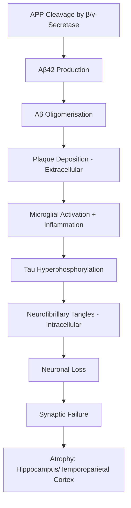
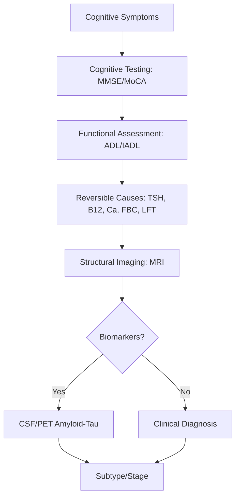
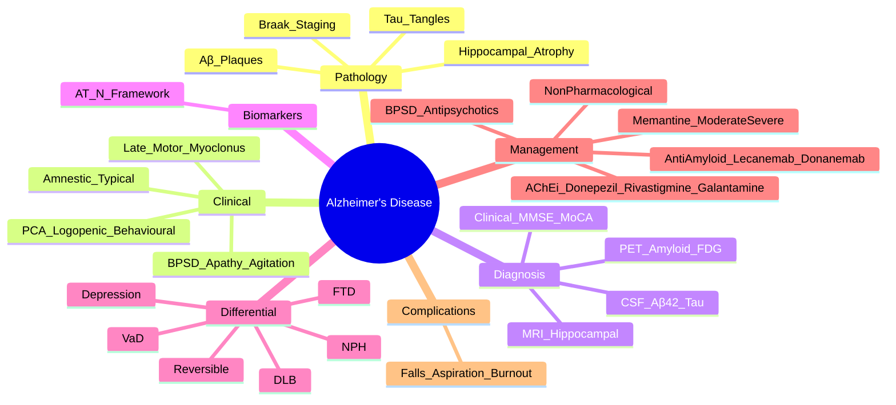

# Alzheimer's Disease

> [!tip] **AD = Insidious onset, progressive amnestic (hippocampal) dementia with cortical atrophy, β-amyloid plaques + neurofibrillary tau tangles**
> **Plasma/CSF Aβ42 ↓, total/phosphorylated tau ↑**; **MRI shows hippocampal/medial temporal atrophy**

## 1. Definition / Epidemiology / Classification

### Definition
A chronic, progressive neurodegenerative disorder characterised by **β-amyloid (Aβ) extracellular plaques** and **hyperphosphorylated tau (neurofibrillary) tangles**, presenting with episodic memory loss and global cognitive decline.

### Epidemiology
- **Prevalence:** 50 million people worldwide (2020); expected 152 million by 2050
- **Age-standardised:** 5-7% >65y; **15-20% >85y**
- **Incidence:** Doubles every 5 years after 65y
- **Sex:** F > M (1.5x), partly due to longevity
- **Risk factors:** Age, **APOE ε4** (3-15x risk if homozygous), family history, low education (cognitive reserve), Down syndrome, cardiovascular (HTN, DM, dyslipidaemia), TBI, depression
- **Protective:** Higher education, cognitive activity, physical exercise, Mediterranean diet, social engagement

### Classification (NIA-AA 2018)
| Stage | AT(N) Framework |
|-------|-----------------|
| **Preclinical AD** | Amyloid (A+) + Tau (T+) but asymptomatic |
| **MCI due to AD** | Mild cognitive symptoms + positive biomarkers |
| **Dementia due to AD** | Cognitive decline affecting function + biomarkers |
| **Typical (amnestic)** | Memory-predominant |
| **Atypical (non-amnestic)** | Posterior cortical atrophy, logopenic variant, behavioural variant (rare) |

---

## 2. Aetiology / Pathophysiology

### Aetiology
- **Genetic (Familial, <1%):** **PSEN1** (chromosome 14, most common), **PSEN2** (chromosome 1), **APP** (chromosome 21) — autosomal dominant, onset 30-60y
- **Sporadic:** **APOE ε4** allele — risk ↑; **ε2** protective
- **Vascular:** Midlife cardiovascular risk factors contribute

### Pathophysiology

### Pathology
- **Macroscopic:** Cortical atrophy (temporoparietal), hippocampal atrophy, ventricular enlargement (ex vacuo)
- **Microscopic:**
  - **Neuritic (senile) plaques:** β-amyloid core + dystrophic neurites
  - **Neurofibrillary tangles:** Hyperphosphorylated **tau** (paired helical filaments)
  - **Granulovacuolar degeneration, Hirano bodies**
- **Braak staging of tangles:** I-II (transentorhinal, asymptomatic) → III-IV (limbic, MCI/mild AD) → V-VI (isocortical, severe)
- **Biochemistry:** ↓ ACh (nucleus basalis of Meynert loss); ↓ NA, 5-HT, somatostatin; ↑ glutamate (excitotoxicity)

---

## 3. Clinical Features

### History (Subtypes)
| Subtype | Features | Localisation |
|---------|----------|--------------|
| **Typical (amnestic)** | **Episodic memory loss first**; topographical disorientation; word-finding difficulty | **Medial temporal/hippocampus** |
| **Posterior Cortical Atrophy (PCA)** | Visuospatial, visual deficits (Balint's: simultanagnosia, optic ataxia, ocular apraxia); Gerstmann (acalculia, agraphia, finger agnosia, left-right disorientation) | Parieto-occipital |
| **Logopenic variant** | Word retrieval, sentence repetition, phonologic loop deficits | Left temporoparietal |
| **Behavioural/dysexecutive (rare)** | Executive dysfunction early | Frontal |

### Common Features (Progression)
- **Memory:** Episodic (recent events) → semantic → remote
- **Language:** Anomia → Wernicke's → global aphasia
- **Visuospatial:** Dressing apraxia, environmental disorientation
- **Executive:** Planning, multitasking decline
- **Behavioural:** Apathy early; later wandering, agitation, psychosis
- **Motor:** Late (Parkinsonian gait, myoclonus); if early → consider DLB/CJD

### Examination
- **MMSE/MoCA:** Progressive decline
- **Neurological:** Usually normal early; primitive reflexes (palmomental, grasp, snout) late
- **Gait:** Normal early; later apraxic/shuffling

---

## 4. Diagnostic Approach / Algorithm

### Diagnostic Criteria — NIA-AA 2011 (Probable AD)
| Criterion | Detail |
|-----------|--------|
| **Core** | Insidious onset; clear-cut worsening; **amnestic** (or non-amnestic) presentation; no evidence of alternative |
| **Supportive Biomarker** | ↓ Aβ42 + ↑ tau/phospho-tau in CSF; PET amyloid (+) or tau (+); hippocampal atrophy on MRI |
| **Exclusion** | Sudden onset, focal features, early seizures, early gait, prominent behavioural (consider FTD/DLB) |

---

## 5. Investigations

### First-Line
| Test | Indication | Finding |
|------|------------|---------|
| **MRI Brain** | All dementia | **Hippocampal/medial temporal atrophy** (Scheltens score); ventriculomegaly; rule out tumour, subdural, NPH |
| **CT Head** | If MRI contraindicated | Atrophy pattern |
| **Bloods (reversible causes)** | All | **TSH, B12, folate, FBC, U&E, LFT, glucose, calcium, HIV, syphilis** (VDRL/TPHA) |

### CSF Analysis
| Parameter | Typical in AD |
|-----------|---------------|
| **Aβ42** | **↓** |
| **Total tau** | **↑** |
| **Phosphorylated tau** | **↑** |
| **Aβ42/40 ratio** | ↓ |

### Specialist Investigations
| Test | Indication |
|------|------------|
| **FDG-PET (glucose metabolism)** | Atypical presentations, biomarker-negative |
| **Amyloid PET (Florbetapir/Florbetaben)** | Atypical, MCI biomarkers |
| **Tau PET** | Research/selected cases |
| **Plasma p-tau217, p-tau181, Aβ42/40** | Emerging screening (high accuracy) |
| **EEG** | If CJD suspected (PSWCs) |
| **DATscan** | If DLB suspected |
| **Genetic testing** | Early-onset (<65y), strong family history (PSEN1/2, APP) |

---

## 6. Differential Diagnosis
| Condition | Distinguishing Features |
|-----------|------------------------|
| **Dementia with Lewy Bodies** | Visual hallucinations early, fluctuating cognition, Parkinsonism, RBD |
| **Vascular Dementia** | Stepwise decline, focal neurology, vascular lesions on imaging, executive > memory |
| **Frontotemporal Dementia** | Personality/behavioral change early (bvFTD) OR language (PNFA, semantic); usually <65y |
| **Normal Pressure Hydrocephalus** | **Triad: gait apraxia, urinary incontinence, dementia** ("wet, wobbly, wacky"); large ventricles |
| **Depression/Pseudo-dementia** | Depressed mood, "I don't know" answers, improves with antidepressants |
| **Delirium** | Acute, fluctuating, reversible |
| **Wernicke-Korsakoff** | Thiamine deficiency; confabulation, ophthalmoplegia, ataxia |
| **CJD** | Rapid progression (months), myoclonus, PSWCs on EEG, 14-3-3 protein |
| **Reversible causes** | Hypothyroidism, B12 deficiency, NPH, syphilis, HIV |

---

## 7. Management

### Disease-Modifying — Anti-Amyloid Therapies (NEW 2024)
| Drug | Mechanism | Indication | Monitoring |
|------|-----------|------------|------------|
| **Lecanemab** | Anti-Aβ protofibril mAb | **Early AD (MCI/mild dementia)** with confirmed amyloid | MRI q3mo for **ARIA-E** (oedema) and ARIA-H (microhaemorrhage); APOE genotyping (↑ARIA in ε4+) |
| **Donanemab** | Anti-Aβ (pyroglutamate) mAb | Early AD with confirmed amyloid | MRI q3mo for ARIA |
| **Aducanumab** (US only) | Anti-Aβ fibril | Discontinued in some regions | ARIA monitoring |

> [!tip] **Anti-amyloid mAbs:** Limited to **early AD with confirmed amyloid**; ARIA (amyloid-related imaging abnormalities) monitoring mandatory; not for advanced/severe AD.

### Symptomatic — Cholinesterase Inhibitors (AChEi)
| Drug | Dose | Notes |
|------|------|-------|
| **Donepezil** | 5mg → 10mg nocte | Mild-severe AD; once daily; **bradycardia risk** |
| **Rivastigmine** | 3mg BD → 6mg BD oral; OR **patch 4.6/9.5/13.3 mg/24h** | Mild-moderate AD; also licensed for PD dementia; patch ↓GI SE |
| **Galantamine** | 8mg → 16-24mg daily (MR) | Mild-moderate AD; nicotinic modulation |

- **Side effects:** Nausea, vomiting, diarrhoea, anorexia, **bradycardia, syncope**; slow titration
- **Contraindications:** Sick sinus syndrome, AV block, severe asthma/COPD, active GI bleed

### NMDA Receptor Antagonist
| Drug | Dose | Notes |
|------|------|-------|
| **Memantine** | 5mg daily → 10mg BD | **Moderate-severe AD**; reduces glutamatergic excitotoxicity; can combine with AChEi |

### Behavioural and Psychological Symptoms of Dementia (BPSD)
| Symptom | Treatment |
|---------|-----------|
| **Agitation** | Non-pharmacological first; **Risperidone 0.5-1mg** (max 6 weeks; ↑stroke risk); Quetiapine; Trazodone |
| **Depression** | Sertraline, citalopram (avoid paroxetine — anticholinergic); mirtazapine (↑ appetite) |
| **Psychosis** | Atypical antipsychotics (lowest dose, shortest time); **AVOID** haloperidol (↑stroke/mortality) |
| **Sleep disturbance** | Melatonin, sleep hygiene; avoid benzodiazepines (falls) |
| **Apathy** | No effective drug; consider activating strategies |

### Non-Pharmacological
- **Cognitive stimulation therapy (CST)** — evidence-based
- **Occupational therapy** for ADL
- **Exercise, social engagement, diet (Mediterranean)**
- **Advance care planning, lasting power of attorney**
- **Carer support and education**

---

## 8. Drug Interactions / Cautions
| Drug | Interaction |
|------|-------------|
| **AChEi + β-blockers/CCB** | ↑ Bradycardia risk |
| **AChEi + anticholinergics** | Antagonise effect; ↑ cognitive impairment |
| **AChEi + NSAIDs** | ↑ GI bleed risk |
| **Memantine** | Adjust dose in renal impairment |
| **Antipsychotics** | ↑ Mortality in elderly dementia (black box); use lowest dose, shortest time |

---

## 9. Procedures
### Lumbar Puncture (CSF biomarkers)
- **Indication:** Atypical presentations, young-onset, biomarker confirmation
- **Findings in AD:** ↓Aβ42, ↑total tau, ↑phospho-tau

### Genetic Testing
- **Indication:** Early-onset (<65y) with family history
- **Genes:** PSEN1, PSEN2, APP (AD); consider C9orf72, MAPT (FTD); NOTCH3 (CADASIL); Huntington's

---

## 10. Complications
| Complication | Prevention/Management |
|--------------|----------------------|
| **Falls** | Remove hazards, hip protectors, PT |
| **Aspiration** | Swallowing assessment, SALT |
| **Pressure ulcers** | Repositioning, mattresses |
| **Wandering** | GPS trackers, secure environment |
| **Behavioural disturbances** | Non-pharmacological first; antipsychotics cautiously |
| **Caregiver burnout** | Respite care, support groups |
| **Mortality** | Median survival 4-8y from diagnosis; pneumonia, falls |

---

## 11. Red Flags
| Red Flag | Consider |
|----------|----------|
| **Rapid progression (weeks-months)** | CJD, autoimmune (LGI1/NMDA), vasculitis |
| **Early prominent visual hallucinations** | DLB |
| **Early behavioural/personality change** | FTD |
| **Focal neurological signs** | Vascular, tumour |
| **Gait early** | NPH, vascular |
| **Early seizures** | Tumour, CJD |
| **Sudden onset** | Vascular, delirium |
| **Age <65y** | Consider genetic, FTD |

---

## 12. Prognosis
| Factor | Good | Poor |
|--------|------|------|
| **Age onset** | >75y | <65y (early onset, aggressive) |
| **Comorbidities** | Few | Multiple (cardiovascular, frailty) |
| **Phenotype** | Amnestic (typical) | Atypical (PCA, behavioural) |
| **BPSD** | Few | Prominent (agitation, psychosis) |
| **Care** | Good social support | Isolated |

- **Median survival:** 4-8 years (range 3-15)
- **Cause of death:** Pneumonia (aspiration), cardiovascular, falls

---

## 13. Topic Correlation
| Topic | Overlap |
|-------|---------|
| **DLB** | Same α-synuclein pathology; visual hallucinations; RBD |
| **Vascular Dementia** | Stepwise; vascular risk factors; focal signs |
| **FTD** | Personality change early; <65y |
| **MCI** | Pre-dementia stage; annual conversion ~10-15% |
| **NPH** | Triad (gait, urinary, cognitive); reversible with shunt |

---

## 14. Special Situations
- **Young-onset AD (<65y):** Consider genetic (PSEN1/2, APP); atypical presentations more common; aggressive course
- **Down Syndrome:** ↑↑ AD risk (APP on chr 21); screen from age 30-40
- **Pregnancy:** AChEi not recommended; memantine category B
- **Driving (DVLA):** Must notify; medical assessment; varies by stage (Group 1: 6mo-2y depending on condition)
- **Anaesthesia:** Avoid anticholinergics (worsen cognition); careful with benzodiazepines
- **Capacity assessment:** Mental Capacity Act (UK) — decision-specific, functional assessment

---

## FCPS/MRCP High-Yield Summary
| Category | Key Points |
|----------|------------|
| **Definition** | Progressive amnestic dementia with Aβ plaques + tau tangles |
| **Epidemiology** | 5-7% >65y; 15-20% >85y; F>M; ↑with age |
| **Genetics** | APOE ε4 risk; familial AD (PSEN1/2, APP) <1%, autosomal dominant, early onset |
| **Pathology** | Aβ plaques, tau tangles, hippocampal/medial temporal atrophy |
| **CSF biomarkers** | ↓Aβ42, ↑tau, ↑p-tau |
| **Treatment** | AChEi (donepezil, rivastigmine, galantamine) for mild-moderate; memantine + AChEi for moderate-severe |
| **NEW Anti-amyloid** | Lecanemab, donanemab for early AD (MCI/mild) with amyloid; ARIA monitoring |
| **BPSD** | Risperidone, quetiapine, trazodone; AVOID haloperidol |
| **Driving** | Notify DVLA |
| **Differentials** | DLB, VaD, FTD, NPH, depression, reversible |

---

## Viva Questions
1. **Pathology hallmarks of AD?** β-amyloid plaques (extracellular) + hyperphosphorylated tau tangles (intracellular).
2. **Where is earliest atrophy?** **Hippocampus / medial temporal lobe** (Braak stages I-II).
3. **CSF biomarkers?** ↓ Aβ42, ↑ total tau, ↑ phosphorylated tau.
4. **Genes for familial AD?** PSEN1, PSEN2, APP (autosomal dominant).
5. **Risk allele for sporadic AD?** **APOE ε4**.
6. **AChEi mechanism?** Inhibit acetylcholinesterase → ↑synaptic ACh; for symptomatic benefit only.
7. **AChEi contraindications?** Sick sinus syndrome, AV block, severe asthma/COPD, active GI bleed.
8. **NMDA antagonist?** Memantine for moderate-severe AD.
9. **PCA features?** Balint's syndrome (simultanagnosia, optic ataxia, ocular apraxia), Gerstmann, visual deficits.
10. **Anti-amyloid mAb risks?** **ARIA-E** (oedema), **ARIA-H** (microbleeds); APOE ε4 ↑ risk; MRI monitoring.

---

## Common Confusions
| Confusion | Clarification |
|-----------|---------------|
| **AD vs DLB** | DLB: visual hallucinations, fluctuating, Parkinsonism, RBD early; AD: memory first |
| **AD vs FTD** | FTD: personality/language early, memory preserved early; AD: memory first |
| **AD vs Vascular** | Vascular: stepwise, focal signs, executive > memory |
| **Anti-amyloid therapy** | Lecanemab/donanemab only for **early** AD with confirmed amyloid |
| **AChEi for severe AD** | Donepezil licensed for severe; memantine for moderate-severe |
| **Antipsychotics in dementia** | ↑mortality (black box); use lowest dose, shortest time; avoid haloperidol |
| **NPH vs AD** | NPH triad: gait, urinary, cognitive; large ventricles; reversible with VP shunt |

---

## Mnemonics
1. **AD pathology:** "**A**myloid **B**efore **T**au" — plaques form before tangles
2. **NPH triad:** "**Wet, Wobbly, Wacky**" — Urinary, Gait, Cognitive
3. **AChEi SE:** "**N**ausea, **V**omiting, **D**iarrhoea, **B**radycardia"
4. **PCA features:** "**Balint + Gerstmann**" — visual + parietal

---

## Mind Map

---

## One-Page Revision Card
| **Topic** | **Alzheimer's Disease** |
|-----------|-------------------------|
| **Definition** | Insidious, progressive amnestic dementia with Aβ plaques + tau tangles |
| **Pathology** | ↓ACh (nucleus basalis); Braak staging; hippocampal atrophy |
| **Genetics** | APOE ε4 risk; familial (PSEN1/2, APP) |
| **CSF** | ↓Aβ42, ↑tau, ↑p-tau |
| **MRI** | Medial temporal/hippocampal atrophy |
| **Treatment** | **AChEi** (donepezil/rivastigmine/galantamine) mild-mod; + **Memantine** mod-severe; **Lecanemab/Donanemab** early AD (anti-amyloid) |
| **BPSD** | Risperidone, quetiapine (AVOID haloperidol); SSRI for depression |
| **Differentials** | DLB, VaD, FTD, NPH, depression |
| **Driving** | DVLA notification |

---

## MCQs (10)

1. **Earliest site of pathology in typical AD:**
   A. Frontal cortex B. **Hippocampus/medial temporal** C. Cerebellum D. Occipital lobe
   *Answer: B*

2. **CSF findings in AD include:**
   A. ↑Aβ42, ↓tau B. **↓Aβ42, ↑tau** C. ↑14-3-3 protein D. Normal
   *Answer: B*

3. **Which AChEi is available as a patch?**
   A. Donepezil B. **Rivastigmine** C. Galantamine D. Memantine
   *Answer: B*

4. **Memantine is licensed for which stage of AD?**
   A. Preclinical B. Mild only C. **Moderate-to-severe** D. All stages
   *Answer: C*

5. **APOE ε4 allele is associated with:**
   A. Reduced AD risk B. **Increased AD risk** C. FTD D. DLB
   *Answer: B*

6. **Balint's syndrome (simultanagnosia, optic ataxia, ocular apraxia) localises to:**
   A. Frontal lobe B. **Bilateral parieto-occipital (PCA)** C. Cerebellum D. Hippocampus
   *Answer: B*

7. **Antipsychotic to AVOID in dementia:**
   A. Quetiapine B. Risperidone C. **Haloperidol** D. Trazodone
   *Answer: C*

8. **Down syndrome is associated with:**
   A. Parkinson's disease B. **Early-onset AD (APP on chromosome 21)** C. FTD D. Huntington's
   *Answer: B*

9. **Lecanemab and donanemab work via:**
   A. Acetylcholinesterase inhibition B. NMDA antagonism C. **Anti-amyloid (β) monoclonal antibodies** D. Tau phosphorylation inhibition
   *Answer: C*

10. **Anti-amyloid therapy monitoring requires:**
    A. ECG B. **MRI for ARIA (amyloid-related imaging abnormalities)** C. EEG D. Liver biopsy
    *Answer: B*

---

## SBAs (10)

1. **A 70-year-old man has 2 years of progressive memory loss and difficulty finding words. MMSE 18/30. MRI: bilateral hippocampal atrophy. CSF: ↓Aβ42, ↑tau. Diagnosis?**
   A. DLB B. **Probable Alzheimer's disease** C. Vascular dementia D. FTD
   *Answer: B* — Insidious amnestic onset + hippocampal atrophy + supportive CSF biomarkers = probable AD.

2. **A 75-year-old with mild AD on donepezil develops persistent nausea and vomiting. Best action?**
   A. Stop donepezil permanently B. **Switch to rivastigmine patch (lower GI side effects)** C. Add metoclopramide D. Add loperamide
   *Answer: B* — Patch formulation bypasses GI tract; lower GI side effects.

3. **A 60-year-old presents with progressive dressing apraxia, simultanagnosia, and difficulty writing. MMSE 24. Diagnosis?**
   A. Typical AD B. **Posterior Cortical Atrophy** C. FTD D. DLB
   *Answer: B* — PCA = visual/visuospatial deficit with relative memory preservation.

4. **A patient with moderate AD is on donepezil. Adding memantine will:**
   A. Reverse disease B. **Provide additional symptomatic benefit for moderate-severe AD** C. Be contraindicated D. Cure AD
   *Answer: B* — Memantine + AChEi for moderate-severe AD; not disease-modifying.

5. **A patient with severe dementia becomes agitated and hits carers. First-line management?**
   A. **Risperidone 0.5mg** B. Haloperidol 5mg C. Diazepam 10mg D. Chlorpromazine
   *Answer: A* — Atypical antipsychotics preferred; haloperidol ↑stroke/mortality risk.

6. **A 50-year-old woman has rapidly progressive dementia (months), myoclonus, and startle. EEG shows periodic sharp wave complexes. Diagnosis?**
   A. AD B. **Creutzfeldt-Jakob disease (CJD)** C. DLB D. FTD
   *Answer: B* — Rapid dementia + myoclonus + PSWCs = CJD.

7. **A 65-year-old has gait apraxia, urinary incontinence, and mild dementia. MRI shows ventriculomegaly out of proportion to atrophy. Diagnosis?**
   A. AD B. **Normal Pressure Hydrocephalus (NPH)** C. PSP D. DLB
   *Answer: B* — Classic NPH triad; treatable with VP shunt.

8. **A patient with AD on donepezil develops syncope. ECG shows sinus bradycardia HR 40. Best action?**
   A. Increase donepezil B. **Stop donepezil; consider alternative (rivastigmine patch)** C. Add beta-blocker D. Add SSRI
   *Answer: B* — Bradycardia is AChEi side effect; stop and consider safer alternative.

9. **In NPH, the triad "wet, wobbly, wacky" refers to:**
   A. Urinary incontinence, gait apraxia, dementia B. Urinary incontinence, seizures, falls C. Falls, dementia, depression D. Tremor, gait apraxia, dementia
   *Answer: A* — NPH = urinary incontinence + gait apraxia + dementia.

10. **A 45-year-old with strong family history of early-onset AD. Which gene is most likely?**
    A. APOE B. **PSEN1** C. C9orf72 D. MAPT
    *Answer: B* — PSEN1 = most common familial AD; C9orf72, MAPT = FTD.

---

## Flashcards

- **Q:** Earliest pathology in AD?
  **A:** Hippocampus / medial temporal lobe (Braak I-II)
- **Q:** CSF biomarkers in AD?
  **A:** ↓Aβ42, ↑total tau, ↑phospho-tau
- **Q:** AChEi mechanism?
  **A:** Inhibit AChE → ↑synaptic ACh
- **Q:** Donepezil dose?
  **A:** 5mg → 10mg nocte
- **Q:** Memantine mechanism?
  **A:** NMDA receptor antagonist
- **Q:** Anti-amyloid mAb examples?
  **A:** Lecanemab, donanemab (early AD + confirmed amyloid)
- **Q:** ARIA?
  **A:** Amyloid-related imaging abnormalities (E=oedema, H=haemorrhage); anti-amyloid mAb risk
- **Q:** APOE ε4?
  **A:** Risk allele for sporadic AD
- **Q:** Familial AD genes?
  **A:** PSEN1, PSEN2, APP
- **Q:** NPH triad?
  **A:** Wet (urinary), Wobbly (gait), Wacky (cognitive)

---

## Answer Key

### MCQs
1. **B** — Hippocampus earliest
2. **B** — ↓Aβ42, ↑tau
3. **B** — Rivastigmine patch
4. **C** — Memantine for mod-severe
5. **B** — APOE ε4 = AD risk
6. **B** — PCA = parieto-occipital
7. **C** — Haloperidol ↑stroke risk
8. **B** — APP on chr 21 → early AD
9. **C** — Lecanemab/donanemab = anti-Aβ
10. **B** — MRI for ARIA monitoring

### SBAs
1. **B** — Amnestic + hippocampal atrophy + CSF = probable AD
2. **B** — Rivastigmine patch ↓GI SE
3. **B** — PCA = visual/visuospatial
4. **B** — Memantine add-on for mod-severe
5. **A** — Risperidone for BPSD
6. **B** — CJD = rapid + PSWCs
7. **B** — NPH triad + ventriculomegaly
8. **B** — Bradycardia → stop AChEi
9. **A** — NPH = urinary, gait, cognitive
10. **B** — PSEN1 = familial AD

---

## Local Navigation
**Heading Hub:** [[06_Dementia_Cognitive_Disorders/Dementia Hub]]
**Topic-Group Hub:** [[06_Dementia_Cognitive_Disorders/Dementia MOC]]
**Chapter Hierarchy:** [[Davidson Chapter 25 - Neurology Hierarchy]]

## PasTest Scenario SBAs (Clinical Vignettes)

> **Auto-generated PasTest/Mediscope-style scenario SBAs** grounded in the authored source. Each scenario tests a real clinical fact (triad, specific sign, contraindication, trial, first-line Rx) extracted from the topic. *Source: Ch 27: Neurology & Stroke — Alzheimers Disease*

**Q1.** Which of the following is characterised by the clinical triad: gait, urinary, cognitive?

  - **A.** Alzheimers Disease
  - **B.** Stroke
  - **C.** TIA
  - **D.** Migraine

  > **Answer: A** — Alzheimers Disease
  >
  > *Source:* nality change early; <65y |
| **MCI** | Pre-dementia stage; annual conversion ~10-15% |
| **NPH** | Triad (gait, urinary, cognitive); reversible with shunt |

---
## 14

**Q2.** Which of the following features is most specific or characteristic of Alzheimers Disease?

  - **A.** FDG-PET
  - **B.** A feature common to many acute inflammatory conditions
  - **C.** A non-specific sign that does not localise the diagnosis
  - **D.** An investigation finding rather than a clinical feature

  > **Answer: A** — FDG-PET
  >
  > *Source:* *Aβ42/40 ratio** | ↓ |

### Specialist Investigations
| Test | Indication |
|------|------------|
| **FDG-PET (glucose metabolism)** | Atypical presentations, biomarker-negative |
| **Amyloid PET (Flo

**Q3.** What is the most appropriate first-line therapy for Alzheimers Disease?

  - **A.** Cognitive stimulation therapy
  - **B.** An advanced/surgical therapy reserved for refractory disease
  - **C.** Symptomatic treatment only, no disease-modifying therapy
  - **D.** Empiric broad-spectrum therapy without specific indication

  > **Answer: A** — Cognitive stimulation therapy
  >
  > *Source:* **Cognitive stimulation therapy (CST)** — evidence-based

