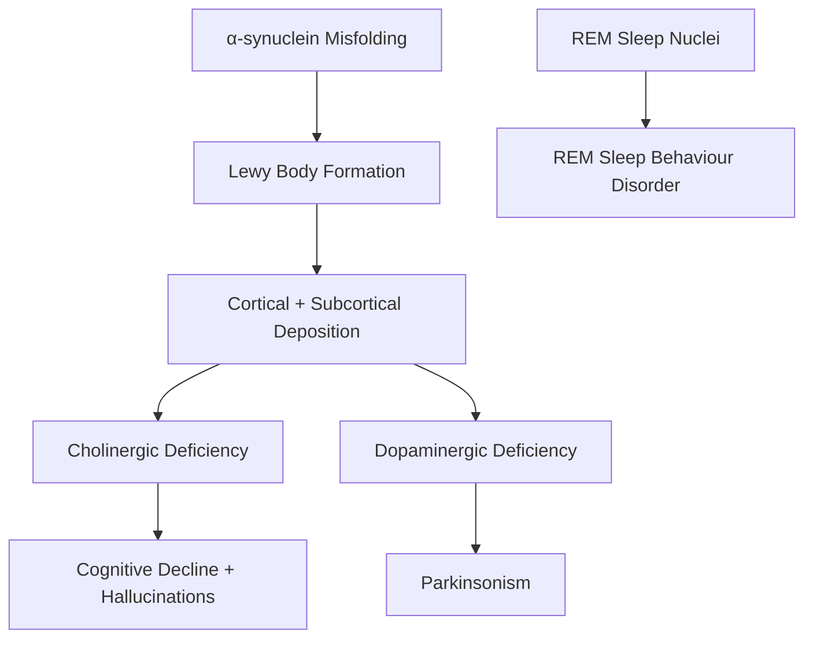

# Dementia with Lewy Bodies (DLB)

> [!tip] **DLB = "Parkinson's Plus Dementia"** — cognitive symptoms occur **before or within 1 year of parkinsonism** (vs Parkinson's Disease Dementia where parkinsonism precedes dementia by ≥1 year).

> [!tip] **Antipsychotics can be FATAL in DLB** — severe neuroleptic sensitivity reactions (parkinsonism, autonomic dysfunction, NMS-like). Use **quetiapine** low-dose or **pimavanserin** if absolutely needed.

## 1. Definition / Epidemiology / Classification

**DLB** = progressive dementia with **core features** of fluctuating cognition, visual hallucinations, parkinsonism, and REM sleep behaviour disorder, due to **α-synuclein (Lewy body)** pathology in cortex + brainstem.

**Epidemiology:**
- **Prevalence:** 10-15% of dementia cases (3rd most common after AD, VaD)
- **Incidence:** 1-2/1000 person-years
- **Age:** Typically >65y (rare <50y)
- **Sex:** M > F (1.5:1)
- **Risk factors:** Age, family history, GBA mutations, APOE ε4, REM sleep behaviour disorder

**Classification:**
- **DLB** (dementia first or concurrent with parkinsonism)
- **PDD** (Parkinson's Disease Dementia — parkinsonism >1 year before dementia)
- **Lewy body spectrum** = DLB + PDD + Lewy body variant of AD

## 2. Aetiology / Pathophysiology

**Pathology:** Widespread **α-synuclein** Lewy bodies in:
- **Brainstem** (substantia nigra) — parkinsonism
- **Cortex** (cingulate, frontal, temporal) — cognitive/psychiatric
- **Limbic** (amygdala) — visual hallucinations
- **Autonomic nuclei** — autonomic dysfunction
- **Spinal cord** — autonomic dysfunction

**Pathophysiology:**

**Molecular:**
- **α-synuclein:** SNCA gene; GBA mutations increase risk
- **APOE ε4:** Modifies risk
- **Neurotransmitters:** ↓ Acetylcholine (cortical cholinergic loss > AD), ↓ Dopamine, ↓ Norepinephrine

## 3. Clinical Features — **Core 4**

| Core Feature | Description | Frequency |
|--------------|-------------|-----------|
| **Fluctuating cognition** | Pronounced variations in attention/alertness; daytime drowsiness, staring spells, "switched off" | 80-90% |
| **Recurrent visual hallucinations** | **Well-formed, detailed** (people, animals) — often insight preserved initially; recurrent | 70-80% |
| **Spontaneous parkinsonism** | Bradykinesia + rigidity + tremor; often symmetric, axial | 70-80% |
| **REM sleep behaviour disorder (RBD)** | Loss of REM atonia → **enactment of dreams** (shouting, kicking, punching) | 50-80% |

**Supportive Features:**
- Severe **antipsychotic sensitivity** (NMS-like)
- Severe **autonomic dysfunction** (orthostatic hypotension, urinary incontinence, constipation, erectile dysfunction)
- **Hyposmia**, anosmia
- Repeated falls, syncope
- Depression, anxiety, apathy
- Visual hallucinations in other modalities (auditory rare)
- Relative preservation of medial temporal lobe (vs AD)

**Clinical Clues (FCPS/MRCP high-yield):**
- Visual hallucinations of **people/children** early, with retained insight
- **Capgras** (impostor) and other delusions
- Fluctuating attention (look "spaced out")
- **Falls** early (vs AD late)
- **Syncope** (autonomic)

## 4. Diagnostic Criteria — **DLB Consortium 2017**

| Category | Criterion |
|----------|-----------|
| **Essential** | Dementia (progressive cognitive decline interfering with function) |
| **Core (≥2 = probable DLB; 1 = possible)** | Fluctuating cognition + Visual hallucinations + Spontaneous parkinsonism + RBD |
| **Supportive** | Antipsychotic sensitivity, autonomic dysfunction, hyposmia, repeated falls, depression, hallucinations (other), preserved hippocampus |
| **Indicative biomarkers** | ↓DAT-SPECT uptake (caudate/putamen); ↓MIBG myocardial scintigraphy; PSG-confirmed RBD; abnormal FP-CIT SPECT/PET |
| **Supportive biomarkers** | Relative preservation of medial temporal lobe on MRI; occipital hypoperfusion on SPECT/PET; FDG-PET cingulate island sign |

**Probable DLB:** Dementia + ≥2 core features (any core) OR dementia + 1 core + ≥1 indicative biomarker
**Possible DLB:** Dementia + 1 core OR dementia + ≥1 indicative biomarker

## 5. Investigations

| Investigation | Finding in DLB |
|---------------|----------------|
| **DAT-SPECT (FP-CIT, Ioflupane I-123)** | ↓ Striatal dopamine transporter uptake (caudate + putamen) — distinguishes DLB from AD |
| **MIBG myocardial scintigraphy** | ↓ Cardiac sympathetic innervation (post-ganglionic sympathetic) |
| **MRI Brain** | **Relative preservation of hippocampus**; cortical atrophy; mild WMH |
| **FDG-PET** | **Cingulate island sign** (preserved posterior cingulate) + occipital hypoperfusion |
| **Polysomnography (PSG)** | Confirms **REM sleep without atonia** (RSWA) |
| **CSF Aβ42/tau** | Often mixed AD + DLB; Aβ42 may be ↓ |
| **DAT imaging vs EMG/SEP** | DAT differentiates DLB/PDD from AD; EMG normal |

## 6. Differential Diagnosis

| Differential | Distinguishing Features | Key Test |
|--------------|------------------------|----------|
| **Alzheimer Disease** | Prominent memory loss, no hallucinations, no parkinsonism (early) | MRI hippocampal atrophy; amyloid PET |
| **Parkinson Disease Dementia (PDD)** | Parkinsonism **>1 year** before dementia | Timing |
| **Vascular Dementia** | Stepwise, focal deficits, vascular risk | MRI WMH, infarcts |
| **Frontotemporal Dementia** | Behavioural disinhibition, language | MRI frontal atrophy |
| **Creutzfeldt-Jakob Disease (CJD)** | Rapid progression, myoclonus, PSWCs | EEG, MRI, RT-QuIC, 14-3-3 |
| **Progressive Supranuclear Palsy (PSP)** | Vertical gaze palsy, axial rigidity | Supranuclear gaze palsy |
| **Multiple System Atrophy (MSA)** | Autonomic failure + cerebellar/parkinsonism | MRI hot cross bun, MSA pattern |
| **Lewy body variant AD** | Mixed AD + DLB pathology | Biomarkers, autopsy |
| **Delirium** | Acute, fluctuating, medical cause | 4AT, EEG, workup |

## 7. Management

### Cholinesterase Inhibitors (First-line)
| Drug | Dose | Notes |
|------|------|-------|
| **Rivastigmine** | 1.5mg BD → 6mg BD PO (or 4.6/9.5/13.3 mg/24h patch) | **Preferred** (also PDD, MCI-DLB); may worsen parkinsonism slightly |
| **Donepezil** | 5-10mg OD | Alternative |
| **Galantamine** | 8-24mg OD (ER) | Alternative |

**Note:** Cholinergic loss in DLB > AD; cognitive + psychiatric benefit, especially hallucinations. Modest motor benefit.

### Memantine
- Moderate-severe DLB: add-on or alternative

### Parkinsonian Symptoms
- **Levodopa** (low-dose; may worsen hallucinations)
- Often levodopa-responsive but limited

### Antipsychotic Use — **EXTREME CAUTION**
| Rule | Action |
|------|--------|
| **AVOID** | Typical antipsychotics (haloperidol, chlorpromazine) — **life-threatening sensitivity** |
| **AVOID** | Olanzapine, risperidone (high EPS) |
| **Acceptable** | **Quetiapine** 12.5-50mg PRN; **Pimavanserin** (34mg OD) |
| **Alternative** | Reduce AChEi, treat with cholinergic agent only; consider clozapine (specialist) |

### RBD Treatment
| Strategy | Notes |
|----------|-------|
| **Sleep hygiene** | Bed safety (padding, remove weapons) |
| **Clonazepam** | 0.25-0.5mg nocte (caution: falls, sedation) |
| **Melatonin** | 3-12mg nocte (first-line for RBD) |

### Symptomatic
| Symptom | Treatment |
|---------|-----------|
| Visual hallucinations | Reduce/stop anticholinergics, AChEi, quetiapine low-dose |
| Orthostatic hypotension | Midodrine, fludrocortisone, hydration |
| Constipation | Laxatives, diet |
| Depression | SSRIs (caution: hyponatraemia) |
| Falls | Physiotherapy, walking aids, remove hazards |

## 8. Drug Interactions / Cautions

| Drug | Risk |
|------|------|
| **Typical antipsychotics (haloperidol)** | **FATAL** neuroleptic sensitivity — contraindicated |
| **Olanzapine, risperidone** | Severe EPS — avoid |
| **Anticholinergics** | Worsen cognition, hallucinations, urinary retention |
| **Benzodiazepines** | Falls, paradoxical agitation |
| **Metoclopramide, prochlorperazine** | Antidopaminergic — avoid |
| **Levodopa** | May worsen hallucinations; balance motor vs psychiatric |
| **SSRIs (sertraline, citalopram)** | Hyponatraemia risk |
| **Anaesthesia** | Severe sensitivity to anaesthetics reported |

## 9. Complications

| Complication | Notes |
|--------------|-------|
| **Falls** | Early (parkinsonism, autonomic, cognitive) |
| **Hip fracture** | Common (falls) |
| **Aspiration pneumonia** | Late; dysphagia |
| **Antipsychotic-induced NMS** | Mortality up to 50% in DLB |
| **Pressure ulcers** | Late immobility |
| **Incontinence** | Autonomic + cognitive |
| **Mortality** | Median survival 5-8 years from diagnosis |

## 10. Red Flags / Emergencies

| Red Flag | Action |
|----------|--------|
| New antipsychotic + parkinsonism worsening | **STOP** antipsychotic; NMS-like reaction |
| Sudden cognitive decline | Exclude **delirium** superimposed (UTI, pneumonia) |
| Falls, syncope | Check postural BP, hydration, medications |
| Aspiration | Swallow assessment, NG/PEG |
| Severe autonomic crisis | ICU, inotropes, IV fluids |

## 11. Prognosis

| Factor | Good | Poor |
|--------|------|------|
| Age at onset | <70 | >75 |
| Hallucinations | Well-tolerated | Severe, distressing |
| Falls | Few | Repeated |
| Response to AChEi | Excellent | Poor |
| Comorbidities | Few | Multiple |
| **Median survival** | 5-8 years (vs AD 8-10 years) | Worse prognosis |

## 12. Topic Correlation
| Related Topic | Key Overlap |
|---------------|-------------|
| **Parkinson Disease Dementia** | Timing distinction (>1 year = PDD) |
| **Alzheimer Disease** | Memory loss dominant; differentiate by imaging |
| **REM Sleep Behaviour Disorder** | Often precedes DLB by years |
| **PSP, MSA** | Atypical parkinsonism with dementia |
| **Antipsychotic sensitivity** | Life-threatening in DLB |

## 13. Special Situations

| Situation | Consideration |
|-----------|---------------|
| **Pregnancy** | Rare; review anticholinergics, AChEi (caution) |
| **Elderly** | Falls risk, autonomic, polypharmacy |
| **Anaesthesia** | Severe sensitivity reported; minimize drugs |
| **Driving (DVLA)** | Dementia = cease driving; reassess on AChEi |
| **Palliative** | Manage distressing symptoms, avoid antipsychotics |

## FCPS/MRCP High-Yield Summary
| Category | Key Points |
|----------|------------|
| **Core features (4)** | **FVPR** — Fluctuating cognition, Visual hallucinations, Parkinsonism, RBD |
| **Probable DLB** | Dementia + ≥2 core |
| **Pathology** | α-synuclein Lewy bodies; cortical + brainstem |
| **Neurotransmitters** | ↓ Acetylcholine (cortical), ↓ Dopamine |
| **DAT-SPECT** | ↓ Striatal uptake (distinguishes from AD) |
| **MRI** | **Hippocampus preserved** (vs AD) |
| **FDG-PET** | **Cingulate island sign** + occipital hypoperfusion |
| **AChE inhibitors** | Rivastigmine first-line; may help hallucinations |
| **Antipsychotic sensitivity** | **AVOID** typical antipsychotics — life-threatening |
| **Quetiapine** | Lowest-risk antipsychotic if needed (12.5-50mg) |
| **RBD** | Melatonin 3-12mg; Clonazepam 0.25-0.5mg |
| **GBA, APOE** | Genetic risk factors |
| **Median survival** | 5-8 years |

## Viva Questions
1. **Q:** Core features of DLB. **A:** **FVPR** — **F**luctuating cognition, **V**isual hallucinations (well-formed, detailed), **P**arkinsonism, **R**EM sleep behaviour disorder. Probable DLB = dementia + ≥2 core.
2. **Q:** Differentiate DLB from PDD. **A:** **DLB** = dementia first or within 1 year of parkinsonism. **PDD** = parkinsonism >1 year before dementia.
3. **Q:** Why avoid typical antipsychotics in DLB? **A:** Severe **neuroleptic sensitivity** — life-threatening reaction with severe parkinsonism, autonomic dysfunction, NMS-like picture, high mortality. Use quetiapine or pimavanserin.
4. **Q:** DAT-SPECT in DLB. **A:** ↓ Striatal dopamine transporter uptake (caudate + putamen); distinguishes DLB/PDD from AD.
5. **Q:** First-line treatment for DLB? **A:** **Rivastigmine** (cholinesterase inhibitor); may improve cognition, hallucinations, behaviour.
6. **Q:** RBD in DLB. **A:** Loss of REM atonia → enactment of dreams; can precede DLB by years; treat with melatonin 3-12mg or clonazepam 0.25-0.5mg.
7. **Q:** Cingulate island sign. **A:** FDG-PET finding — preserved posterior cingulate metabolism with occipital hypoperfusion; characteristic of DLB.
8. **Q:** MIBG myocardial scintigraphy. **A:** ↓ Cardiac sympathetic innervation in DLB/PDD; distinguishes from AD (which is normal).
9. **Q:** Pathological hallmark of DLB. **A:** **α-synuclein Lewy bodies** in cortex + brainstem.
10. **Q:** Hypotension management in DLB. **A:** Midodrine, fludrocortisone, hydration, salt, compression stockings, head-up tilt at night.

## Common Confusions / Exam Traps
| Confusion | Clarification |
|-----------|---------------|
| DLB vs PDD | DLB = dementia ≤1 year of parkinsonism; PDD = parkinsonism >1 year before dementia |
| Typical antipsychotics in DLB | **FATAL** — neuroleptic sensitivity |
| Visual hallucinations of people | Classic DLB; may have insight initially |
| Hippocampus in DLB | **Preserved** (vs AD atrophy) |
| DAT-SPECT in PD vs PSP vs DLB | All show ↓ uptake; helps distinguish from AD |
| RBD = early DLB | Often precedes by years; idiopathic RBD → 80% develop synucleinopathy |
| RBD in AD | **Not a feature** of AD |

## Mnemonics
1. **FVPR** — DLB core: **F**luctuations, **V**isual hallucinations, **P**arkinsonism, **R**BD
2. **DLB = AD + Parkinson** — Memory + hallucinations + parkinsonism
3. **DAT-SPECT ↓** in DLB; **Hippocampus preserved**
4. **Antipsychotic = Death** in DLB
5. **Cingulate Island Sign** — posterior cingulate spared on FDG-PET
6. **RBD — "Acting out dreams"**

## MCQs (10)
1. **Q:** Core features of DLB (4)? **A:** D. Fluctuating cognition, visual hallucinations, parkinsonism, RBD
2. **Q:** DLB vs PDD distinction? **A:** A. DLB: dementia first or ≤1 year
3. **Q:** DAT-SPECT in DLB shows? **A:** B. ↓ Striatal uptake
4. **Q:** MRI in DLB shows? **A:** A. Hippocampus preserved
5. **Q:** First-line treatment for DLB? **A:** C. Rivastigmine
6. **Q:** Antipsychotic to AVOID in DLB? **A:** A. Haloperidol
7. **Q:** RBD pathology? **A:** A. Loss of REM atonia
8. **Q:** Pathology of DLB? **A:** A. α-synuclein
9. **Q:** FDG-PET in DLB shows? **A:** C. Cingulate island sign
10. **Q:** MIBG scan reflects? **A:** A. Cardiac sympathetic denervation

## SBA Questions (10)
1. **Scenario:** 70-year-old with fluctuating confusion, visual hallucinations of children, falls. MRI: preserved hippocampus. **A:** A. DLB
2. **Scenario:** DLB patient, severe agitation. Best antipsychotic? **A:** B. Quetiapine 12.5mg
3. **Scenario:** DLB on rivastigmine, persecutory delusions. Next step? **A:** C. Reduce AChEi or quetiapine low-dose
4. **Scenario:** Parkinson's patient, 2 years after diagnosis, develops visual hallucinations, dementia. **A:** B. PDD
5. **Scenario:** RBD patient 5 years later develops visual hallucinations and parkinsonism. **A:** A. DLB
6. **Scenario:** 65-year-old with dementia, severe orthostatic hypotension, urinary incontinence. **A:** C. DLB (autonomic)
7. **Scenario:** DAT-SPECT normal, but suspected DLB. Most likely alternative? **A:** C. Alzheimer disease
8. **Scenario:** DAT-SPECT abnormal but patient on sertraline. Effect? **A:** C. None — DAT-SPECT not affected by SSRIs (not like MIBG)
9. **Scenario:** DLB patient with severe RBD, no injury. First step? **A:** A. Melatonin + sleep hygiene
10. **Scenario:** 80-year-old DLB, severe constipation, orthostasis. **A:** C. Autonomic dysfunction of DLB

## Flashcards
- **Q:** DLB core features (4)? **A:** **FVPR** — Fluctuations, Visual hallucinations, Parkinsonism, RBD
- **Q:** DLB vs PDD timing? **A:** **DLB ≤1 year**; PDD >1 year
- **Q:** DAT-SPECT in DLB? **A:** **↓ striatal uptake** (distinguishes from AD)
- **Q:** MRI hippocampus in DLB? **A:** **Preserved**
- **Q:** FDG-PET sign? **A:** **Cingulate island sign**
- **Q:** Antipsychotic in DLB? **A:** **AVOID** typicals; quetiapine lowest risk
- **Q:** First-line AChEi in DLB? **A:** **Rivastigmine**
- **Q:** Pathology? **A:** **α-synuclein** Lewy bodies
- **Q:** RBD treatment? **A:** **Melatonin 3-12mg** or clonazepam
- **Q:** Survival? **A:** **5-8 years**

## Answer Key
### MCQs
1. **D** 2. **A** 3. **B** 4. **A** 5. **C** 6. **A** 7. **A** 8. **A** 9. **C** 10. **A**

### SBAs
1. **A** — Fluctuations + VH + falls + preserved hippocampus = DLB
2. **B** — Quetiapine lowest-risk in DLB
3. **C** — Reduce AChEi or low-dose quetiapine
4. **B** — Parkinsonism >1y before dementia = PDD
5. **A** — RBD often precedes DLB
6. **C** — Autonomic dysfunction in DLB
7. **C** — Normal DAT-SPECT = AD, not DLB
8. **C** — DAT-SPECT not affected by SSRIs
9. **A** — Melatonin first-line for RBD
10. **C** — Autonomic dysfunction in DLB
