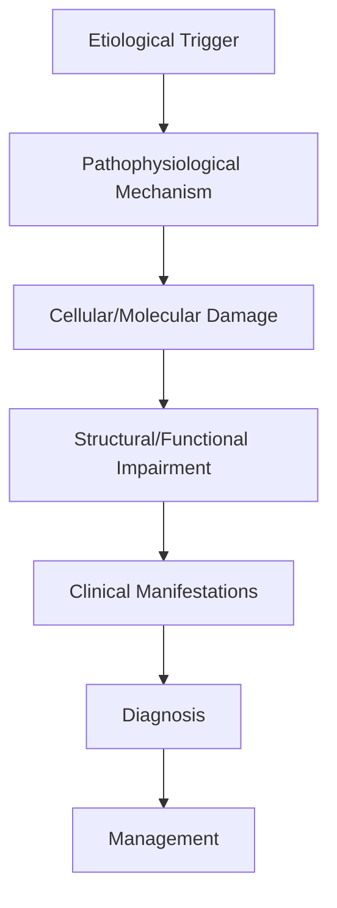
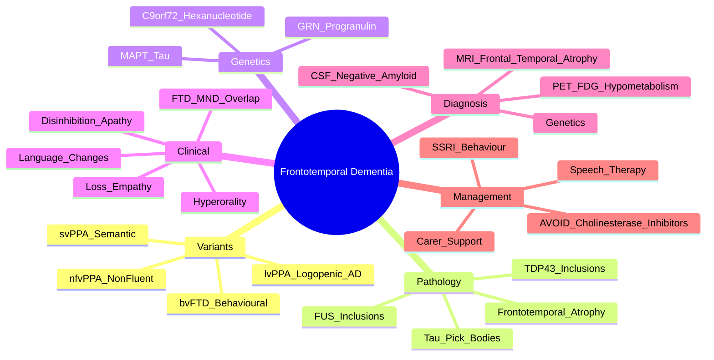

# Frontotemporal Dementia

> [!tip] **High-Yield Definition**
> Comprehensive clinical note for Frontotemporal Dementia covering definition, epidemiology, aetiology, pathophysiology, clinical features, investigations, differential diagnosis, management, drug interactions, procedures, complications, red flags, prognosis, topic correlation, and special situations for FCPS/MRCP examination preparation based on Davidson 24th Edition Chapter 25: Neurology.

---

## 1. Definition / Epidemiology / Classification

### Definition
Frontotemporal Dementia is a neurological disorder within the 06 dementia cognitive disorders category. It is characterised by specific clinical, pathological, radiological, and laboratory features that allow differentiation from related conditions.

### Epidemiology
- **Incidence/Prevalence:** Variable depending on the specific condition.
- **Age:** Adult onset is most common, but paediatric and elderly presentations occur.
- **Sex:** Variable depending on the condition.
- **Geography:** Worldwide distribution, with higher prevalence in certain regions.
- **Risk Factors:** Genetic predisposition, environmental factors, comorbidities, family history.

### Classification
| Subtype | Key Features | Prognosis |
|---------|-------------|-----------|
| Mild/early | Subtle symptoms, preserved function | Best |
| Moderate | Clear symptoms, functional impairment | Variable |
| Severe | Significant disability, complications | Worst |

---

## 2. Aetiology / Pathophysiology

### Aetiology
- **Primary (idiopathic):** Most cases have no identifiable cause.
- **Genetic:** May be inherited (AD, AR, X-linked, mitochondrial, sporadic).
- **Autoimmune:** Autoantibodies, immune-mediated inflammation.
- **Infectious:** Viral, bacterial, fungal, parasitic.
- **Metabolic:** Electrolyte, endocrine, hepatic, renal, nutritional.
- **Toxic:** Drugs, alcohol, heavy metals, environmental toxins.
- **Vascular:** Ischaemia, haemorrhage, vasculitis.
- **Neoplastic:** Primary, secondary, paraneoplastic.
- **Traumatic:** Acute, chronic, repetitive.
- **Degenerative:** Neurodegeneration, protein misfolding.

### Pathophysiology


---

## 3. Clinical Features

### History
- **Onset/Duration:** Acute, subacute, or chronic.
- **Progression:** Static, progressive, relapsing-remitting, stepwise.
- **Key symptoms:** Specific to the condition.
- **Triggers:** Stress, infection, trauma, drugs, hormonal, environmental.
- **Systemic symptoms:** Constitutional features.
- **Drug/Family/Social history:** Relevant exposures, comorbidities.

### Examination
| Domain | Key Findings | Localisation Value |
|--------|-------------|-------------------|
| Higher function | Cognitive, behavioural | Cortical, subcortical, limbic |
| Cranial nerves | Pupils, eye movements, facial, bulbar | Brainstem, cranial nerve, NMJ |
| Motor | Weakness, tone, reflexes | UMN, LMN, NMJ, muscle |
| Sensory | All modalities, pattern | Peripheral, spinal, brainstem |
| Coordination | Ataxia, nystagmus, dysmetria | Cerebellar, sensory, vestibular |
| Gait | Spastic, ataxic, parkinsonian | Multiple |
| Autonomic | Orthostatic, sweating, GI, bladder | Autonomic, peripheral, central |

### Specific Clinical Features
The clinical features are determined by the underlying aetiology, location of pathology, and rate of progression. Patients typically present with a constellation of symptoms and signs that allow clinical localisation and subsequent targeted investigation.

---

## 4. Diagnostic Approach / Algorithm

```mermaid
flowchart TD
    A[Clinical Presentation] --> B[Anatomical Localisation]
    B --> C[Pathophysiological Category]
    C --> D[Formulate Differential]
    D --> E[Targeted Investigations]
    E --> F[Confirm Diagnosis]
    F --> G[Assess Severity/Prognosis]
    G --> H[Initiate Management]
    H --> I[Monitor Response]
    I --> J{Response?}
    J --> YES1 [Good - Continue]
    J --> NO1 [Poor - Escalate]
    YES1 --> K[Monitor]
    NO1 --> H
```

---

## 5. Investigations

### First-Line Investigations
- **Blood tests:** FBC, U&Es, LFTs, glucose, calcium, magnesium, ESR, CRP, autoimmune, infection.
- **Imaging:** CT/MRI brain/spine (essential for most neurological conditions).
- **Neurophysiology:** EEG, nerve conduction, EMG, evoked potentials.
- **CSF:** Cell count, protein, glucose, OCBs, PCR, culture.

### Second-Line Investigations
- **Genetic testing:** Gene panels, WES, WGS.
- **Antibody testing:** Antineuronal, autoimmune, paraneoplastic.
- **Biopsy:** Nerve, muscle, brain, skin.
- **Advanced imaging:** PET-CT, MR spectroscopy, fMRI.

### Specialised Investigations
- **Biomarkers:** Neurofilament light chain, tau, beta-amyloid, 14-3-3, RT-QuIC.
- **Autonomic testing:** Head-up tilt, sudomotor, QSART.
- **Neuropsychology:** Cognitive testing, behavioural assessment.
- **Genetic counselling:** Family screening, predictive testing.

---

## 6. Differential Diagnosis

| Differential | Distinguishing Features | Key Test |
|--------------|------------------------|----------|
| Vascular | Sudden onset, focal, vascular risk factors | MRI/CT, vessel imaging |
| Inflammatory | Subacute, multifocal, systemic | MRI, CSF, antibodies |
| Infectious | Fever, systemic, exposure | Bloods, CSF, imaging |
| Neoplastic | Progressive, mass effect | MRI, biopsy |
| Degenerative | Progressive, symmetric, hereditary | MRI, genetic |
| Toxic/Metabolic | Drug history, systemic, reversible | Bloods, toxicology |
| Autoimmune | Multifocal, antibodies, immunotherapy response | Antibodies, MRI, CSF |
| Functional | Inconsistent, distractible | Clinical, video, biomarkers |

---

## 7. Management

### Acute Management
- **Stabilisation:** ABCDE approach, emergency resuscitation.
- **Specific treatment:** Disease-specific interventions.
- **Symptomatic relief:** Pain, seizures, spasticity, autonomic dysfunction.
- **Prevention of complications:** DVT, pressure sores, infection.

### Disease-Modifying Treatment
- **Pharmacological:** First-line, second-line, escalation, maintenance.
- **Procedural:** Surgery, biopsy, drainage, ablation, stimulation.
- **Immunotherapy:** Steroids, IVIG, plasma exchange, immunosuppressants, biologics.
- **Rehabilitation:** Physiotherapy, OT, speech therapy.

### Long-Term Management
- **Monitoring:** Clinical, imaging, biomarkers, side effects.
- **Prevention:** Vaccinations, prophylaxis, lifestyle modification.
- **Supportive care:** Multidisciplinary team, social work, psychological support.
- **Palliative care:** Advanced care planning, end-of-life care, hospice.

---

## 8. Drug Interactions / Contraindications / Comorbidity Cautions

| Drug Class | Interaction / Caution | Management |
|------------|----------------------|------------|
| Antiseizure medications | Enzyme induction, teratogenicity | Monitor, supplement, switch |
| Immunosuppressants | Infection, malignancy, teratogenicity | Monitor, prophylaxis |
| Anticoagulants | Bleeding risk, drug interactions | Monitor INR, avoid combinations |
| Antihypertensives | Hypotension, falls | Monitor BP, adjust dose |
| Antibiotics | Nephrotoxicity, ototoxicity | Monitor renal |
| Antivirals | Nephrotoxicity, neuropsychiatric | Monitor renal, dose adjust |
| Steroids | DM, HTN, osteoporosis, infection | Monitor, prophylaxis, taper |
| Biologics | Infusion reactions, infection | Monitor, prophylaxis |

---

## 9. Procedures

### Common Procedures
- **Lumbar puncture:** Diagnostic, therapeutic (IIH, NPH). Contraindications: raised ICP, mass lesion, coagulopathy.
- **Nerve conduction studies/EMG:** Diagnostic, prognosis. Minor discomfort.
- **EEG:** Diagnostic, monitoring. No significant complications.
- **MRI brain/spine:** Diagnostic, monitoring. Contraindications: pacemaker, metallic implants.
- **CT head:** Emergency, rapid. Radiation exposure, contrast reactions.
- **Biopsy:** Stereotactic, open. Indications: diagnosis, molecular profiling.

---

## 10. Complications

| Complication | Frequency | Prevention | Management |
|--------------|-----------|------------|------------|
| Infection | Common | Hygiene, prophylaxis, vaccination | Antibiotics, antifungals |
| Thrombosis | Common | Prophylaxis, mobility | Anticoagulation |
| Pressure sores | Common | Positioning, nutrition | Wound care, surgery |
| Spasticity | Common | Positioning, stretching | Baclofen, BoNT |
| Contractures | Common | Passive movements, splints | Physiotherapy, surgery |
| Aspiration | Common | Swallow assessment | NGT, PEG, thickeners |
| Falls | Common | Environment, mobility | Walking aids |
| Fractures | Common | Bone health, prevention | Vitamin D, bisphosphonate |
| Depression | Common | Screening, support | Antidepressants, CBT |
| Cognitive decline | Variable | Monitoring, training | Rehabilitation |
| Autonomic dysfunction | Variable | Monitoring, hydration | Midodrine, fludrocortisone |
| Respiratory failure | Variable | Monitoring, supportive | Ventilation, NIV |
| Death | Variable | Monitoring, palliative | End-of-life care |

---

## 11. Red Flags / Emergencies

### Emergency Presentations
- **Rapid neurological deterioration:** New focal deficit, decreased consciousness, seizures.
- **Status epilepticus:** Continuous seizures >5 min.
- **Raised ICP:** Headache, vomiting, papilloedema, altered consciousness.
- **Respiratory failure:** Hypoxia, hypercapnia, ventilatory failure.
- **Cardiac arrest:** Arrhythmia, MI, pulmonary embolism.
- **Infection:** Sepsis, meningitis, abscess, encephalitis.
- **Drug toxicity:** Overdose, side effects, interactions.
- **Haemorrhage:** Intracranial, systemic, coagulopathy.

---

## 12. Prognosis

### Natural History
- **Acute:** May resolve with treatment, may progress, may be fatal.
- **Subacute:** Variable, depends on cause and treatment.
- **Chronic:** Often progressive, may be stable, may have relapses.
- **Recovery:** Variable, may be complete, partial, or none.

### Prognostic Factors
- **Favourable:** Young age, early treatment, mild disease, reversible cause, good premorbid function, family support.
- **Unfavourable:** Older age, delayed treatment, severe disease, irreversible cause, poor premorbid function, comorbidities.

---

## 13. Topic Correlation

| Related Topic | Link | Key Overlap |
|---------------|------|-------------|
| Davidson 24th Ed Chapter 25 | [[Davidson Chapter 25 - Neurology Hierarchy]] | Comprehensive neurology |
| Neurology MOC | [[Neurology MOC]] | All neurology topics |
| Drug Reference | [[../00_Index/Neurology Drug Reference]] | Medications |
| Local Hub | [[../06_Dementia_Cognitive_Disorders/Hub]] | Section-specific |
| Clinical Examination | [[../01_Fundamentals_Examination/Neurological History Taking]] | Clinical approach |
| Investigation | [[../01_Fundamentals_Examination/Neuroimaging (CT-MRI) Principles]] | Imaging |

---

## 14. Special Situations

| Situation | Consideration |
|-----------|---------------|
| **Pregnancy** | Pre-conception counselling, teratogenicity, drug safety, monitoring, delivery planning, breastfeeding. |
| **Lactation** | Drug safety, breastfeeding, monitoring, support. |
| **Paediatric** | Developmental considerations, drug dosing, school, family, vaccination, growth, puberty. |
| **Elderly / Frail** | Comorbidities, polypharmacy, falls, bone health, cognition, social, end-of-life. |
| **Renal impairment** | Drug dose adjustment, monitoring, dialysis, transplant. |
| **Hepatic impairment** | Drug dose adjustment, monitoring, transplant. |
| **Immunocompromised** | Infection prophylaxis, vaccination, drug interactions, malignancy screening. |
| **Perioperative** | Drug management, anaesthesia planning, VTE prophylaxis, infection prevention, monitoring. |
| **Driving / DVLA** | Fitness to drive, restrictions, notification, reassessment. |
| **Occupational** | Fitness for work, adaptations, rehabilitation, disability, return to work. |

---

## FCPS/MRCP High-Yield Summary

| Category | Key Points |
|----------|------------|
| **Definition** | Comprehensive definition with key diagnostic criteria |
| **Epidemiology** | Incidence, prevalence, age, sex, geography, risk factors |
| **Aetiology** | Primary causes, secondary causes, genetic, environmental |
| **Pathophysiology** | Mechanism of disease, cellular/molecular basis |
| **Clinical Features** | History, examination, key findings, variants |
| **Diagnosis** | Diagnostic criteria, classification, severity |
| **Investigations** | First-line, second-line, specialised, biomarkers |
| **Differential Diagnosis** | Key differentials, distinguishing features, tests |
| **Management** | Acute, disease-modifying, symptomatic, supportive |
| **Complications** | Common, serious, prevention, management |
| **Prognosis** | Natural history, prognostic factors, outcomes |
| **Viva Pearls** | Key examination points |
| **Drug Doses** | First-line, second-line, emergency |
| **Scoring Systems** | Specific scores used in management |
| **Genetics** | Inheritance, genes, mutations, family screening |
| **Imaging Signs** | Characteristic findings, differential |

---

## Viva Questions (PACES/FCPS Style)

1. **Q:** Define and classify its variants.
   **A:** Comprehensive definition with classification of subtypes based on aetiology, severity, and clinical features.

2. **Q:** What are the key clinical features?
   **A:** Specific symptoms and signs including onset, progression, key features, and associated findings.

3. **Q:** What is the first-line treatment?
   **A:** First-line pharmacological and non-pharmacological management based on current evidence.

4. **Q:** What are the red flags requiring urgent referral?
   **A:** Specific emergency presentations and complications requiring immediate intervention.

5. **Q:** What is the prognosis?
   **A:** Natural history, prognostic factors, and long-term outcomes.

6. **Q:** How do you differentiate from key differentials?
   **A:** Clinical features, investigations, and response to treatment that distinguish from alternative diagnoses.

7. **Q:** What investigations are most useful?
   **A:** First-line and second-line investigations including imaging, neurophysiology, CSF, and biomarkers.

8. **Q:** Describe the stepwise management approach.
   **A:** Stepwise escalation from first-line to second-line to third-line therapy with monitoring.

9. **Q:** What are the emergency presentations?
   **A:** Specific emergency scenarios and immediate management priorities.

10. **Q:** How does management change in pregnancy/paediatrics/elderly?
    **A:** Special considerations for each population including drug safety, monitoring, and support.

---

## Common Confusions / Exam Traps

| Confusion | Clarification |
|-----------|---------------|
| Similar presentation but different cause | Differentiate by history, examination, investigations |
| Treatment response vs natural history | Assess with objective measures, biomarkers |
| Drug interactions | Check each drug, monitor, adjust doses |
| Disease progression vs treatment failure | Monitor response, escalate appropriately |
| Functional vs organic | Inconsistent, distractible, disability greater than impairment |
| Acute vs chronic | Time course, progression, reversibility |
| Primary vs secondary | Underlying cause, contributing factors |
| Side effects vs symptoms | Temporal relationship, dose relationship |

---

## Mnemonics
1. **bvFTD features (Rascovsky):** "**3 of these, it's FTD**" — disinhibition, apathy, loss of empathy, stereotyped behaviour, hyperorality, executive dysfunction
2. **FTD variants:** "**bvSvNf**" — **b**ehavioural, **s**emantic, **n**on-fluent (language variants)
3. **FTD genes:** "**MAP** (tau) **GR**anules **C9** (hexanucleotide)" — **MAP**T, **GR**N, **C9**orf72

---

## Mind Map


---

## Spaced Repetition Trackers
| Day | Recall Score (/10) | Key Facts Reviewed | Weak Areas |
|-----|--------------------|--------------------|------------|
| Day 1 | __ | bvFTD 6 features (Rascovsky); variants | |
| Day 3 | __ | svPPA vs nfvPPA differences; FTD-MND | |
| Day 7 | __ | Genetics: MAPT, GRN, C9orf72 | |
| Day 14 | __ | Pick bodies vs TDP-43 vs FUS pathology | |
| Day 30 | __ | Imaging; avoid AChEi; SSRI for behaviour | |
| Day 90 | __ | Full FTD syndrome, prognosis, differential | |

---

## Self-Test Scorecard
| Section | Topic | Score (/5) |
|---------|-------|-----------|
| 1 | bvFTD clinical features | __/5 |
| 2 | PPA variants (svPPA, nfvPPA, lvPPA) | __/5 |
| 3 | FTD genetics (MAPT, GRN, C9orf72) | __/5 |
| 4 | Pathology (Pick bodies, TDP-43, FUS) | __/5 |
| 5 | Imaging (MRI, PET) | __/5 |
| 6 | FTD-MND overlap | __/5 |
| 7 | Management (SSRI, no AChEi) | __/5 |
| 8 | Differential diagnosis | __/5 |
| 9 | Prognosis | __/5 |
| 10 | Behavioural symptoms | __/5 |
| **Total** | | **__/50** |

---

## One-Page Revision Card
| **Topic** | **Frontotemporal Dementia (FTD)** |
|-----------|------------------------------------|
| **Core variants** | bvFTD (behavioural, ~50%); svPPA (semantic); nfvPPA (non-fluent); lvPPA = AD spectrum |
| **bvFTD features** | Disinhibition, apathy, loss of empathy, stereotyped behaviour, hyperorality, executive dysfunction |
| **svPPA** | Loss of word/semantic knowledge; "I don't know what that is"; bilateral anterior temporal atrophy |
| **nfvPPA** | Effortful speech, agrammatism, apraxia of speech; left posterior frontal/insular atrophy |
| **Genetics** | MAPT (tau), GRN (progranulin), C9orf72 (most common, also causes ALS) — autosomal dominant |
| **Pathology** | Tau (Pick bodies) — 40%; TDP-43 — 50%; FUS — 5% |
| **Imaging** | MRI: frontal and/or temporal atrophy ("knife-edge" gyri); FDG-PET hypometabolism |
| **Treatment** | SSRI for disinhibition/depression; **AVOID** cholinesterase inhibitors (worsen behaviour); antipsychotics cautiously |
| **FTD-MND** | C9orf72 overlap with motor neurone disease; poor prognosis |
| **Prognosis** | Median survival 6-11 years from onset; faster than AD |

---

## MCQs (10)

1. **bvFTD (behavioural variant FTD) is characterised by all EXCEPT:**
   A. Disinhibition
   B. Apathy
   C. **Prominent episodic memory loss (early)**
   D. Loss of empathy
   *Answer: C*

2. **Semantic variant PPA (svPPA) typically presents with:**
   A. Non-fluent speech
   B. **Loss of word meaning ("what is a zebra?")**
   C. Fluent but empty speech with word-finding pauses
   D. Mutism
   *Answer: B*

3. **Which gene is most commonly implicated in FTD-ALS overlap?**
   A. MAPT
   B. GRN
   C. **C9orf72 (hexanucleotide GGGGCC repeat)**
   D. APP
   *Answer: C*

4. **Pick bodies are composed of:**
   A. α-synuclein
   B. Beta-amyloid
   C. **Hyperphosphorylated tau (3R isoform)**
   D. TDP-43
   *Answer: C*

5. **First-line pharmacological management for disinhibition in bvFTD is:**
   A. Donepezil
   B. **SSRI (e.g. sertraline, citalopram)**
   C. Risperidone
   D. Memantine
   *Answer: B*

6. **Cholinesterase inhibitors (donepezil, rivastigmine) should be AVOIDED in FTD because:**
   A. Cause severe liver toxicity
   B. **May worsen behavioural symptoms**
   C. No effect on memory
   D. Cause seizures
   *Answer: B*

7. **MRI in bvFTD characteristically shows:**
   A. Hippocampal atrophy
   B. **"Knife-edge" frontal and anterior temporal atrophy**
   C. Parieto-occipital atrophy
   D. Cerebellar atrophy
   *Answer: B*

8. **svPPA classically affects which brain region?**
   A. Left posterior frontal
   B. **Bilateral anterior temporal lobes**
   C. Posterior cingulate
   D. Cerebellum
   *Answer: B*

9. **nfvPPA is characterised by:**
   A. Loss of word meaning
   B. Fluent empty speech
   C. **Effortful, agrammatic speech with apraxia of speech**
   D. Echolalia
   *Answer: C*

10. **Median survival from symptom onset in FTD is approximately:**
    A. 2-3 years
    B. **6-11 years**
    C. 15-20 years
    D. >20 years
    *Answer: B*

---

## SBA Questions (10)

1. **A 58-year-old man becomes disinhibited, eats food from others' plates, and makes inappropriate sexual comments. His wife reports he has lost empathy. MRI shows frontal atrophy. Diagnosis?**
   A. Alzheimer's disease
   B. **bvFTD**
   C. DLB
   D. Vascular dementia
   *Answer: B* — Disinhibition, loss of empathy, hyperorality + frontal atrophy = bvFTD.

2. **A 62-year-old woman asks "what is a...?" repeatedly, cannot name objects despite fluent speech, and shows bilateral anterior temporal atrophy on MRI. Diagnosis?**
   A. nfvPPA
   B. **svPPA**
   C. bvFTD
   D. AD
   *Answer: B* — Loss of word meaning with bilateral anterior temporal atrophy = svPPA.

3. **A 60-year-old man has effortful, halting speech with sound distortions. He is fluent in comprehension. MRI shows left posterior frontal and insular atrophy. Diagnosis?**
   A. svPPA
   B. **nfvPPA (non-fluent)**
   C. lvPPA
   D. AD
   *Answer: B* — Effortful speech + apraxia of speech + left posterior frontal atrophy = nfvPPA.

4. **FTD with motor neurone disease is most commonly associated with:**
   A. MAPT mutation
   B. **C9orf72 hexanucleotide repeat expansion**
   C. PSEN1 mutation
   D. LRRK2 mutation
   *Answer: B* — C9orf72 is the FTD-ALS gene.

5. **A patient with probable bvFTD has agitation. First-line pharmacological treatment?**
   A. Haloperidol
   B. Donepezil
   C. **Trazodone or an SSRI**
   D. Memantine
   *Answer: C* — SSRIs/trazodone are first-line for FTD behavioural symptoms.

6. **TDP-43 inclusions are characteristic of which FTD subtype?**
   A. Pick's disease
   B. **FTLD-TDP (most FTD with GRN/C9orf72 mutations)**
   C. PSP
   D. CBD
   *Answer: B* — TDP-43 pathology = FTLD-TDP.

7. **A patient with FTD develops weakness, fasciculations, and bulbar dysfunction. Diagnosis?**
   A. AD progression
   B. **FTD-MND (motor neurone disease)**
   C. PSP
   D. CBD
   *Answer: B* — FTD + LMN/UMN signs = FTD-MND (often C9orf72).

8. **A 45-year-old presents with behavioural change. Family history: father had FTD, paternal aunt had ALS. Most likely genetic cause?**
   A. PSEN1
   B. **C9orf72 repeat expansion**
   C. Huntingtin
   D. APOE ε4
   *Answer: B* — Family hx FTD+ALS = C9orf72.

9. **Progranulin (GRN) mutation causes FTD via:**
   A. Tau hyperphosphorylation
   B. **Haploinsufficiency leading to TDP-43 pathology**
   C. α-synuclein accumulation
   D. Beta-amyloid deposition
   *Answer: B* — GRN mutation → progranulin haploinsufficiency → TDP-43.

10. **Compared to Alzheimer's disease, FTD typically:**
    A. Has later onset
    B. **Younger onset (45-65 years) with personality/ behavioural change**
    C. Is more slowly progressive
    D. Responds to cholinesterase inhibitors
    *Answer: B* — FTD = younger onset, behavioural/language predominance.

---

## Flashcards
- **Q:** Three main FTD clinical variants?
  **A:** bvFTD (behavioural); svPPA (semantic); nfvPPA (non-fluent/agrammatic)
- **Q:** bvFTD core features (Rascovsky)?
  **A:** Disinhibition, apathy, loss of empathy, stereotyped behaviour, hyperorality, executive dysfunction (≥3 of 6)
- **Q:** svPPA features?
  **A:** Loss of word/semantic knowledge; "I don't know"; bilateral anterior temporal atrophy
- **Q:** nfvPPA features?
  **A:** Effortful speech, agrammatism, apraxia of speech; left posterior frontal/insular atrophy
- **Q:** FTD genes?
  **A:** MAPT (tau), GRN (progranulin), C9orf72 (hexanucleotide repeat) — autosomal dominant
- **Q:** Pick bodies?
  **A:** Round silver-staining intraneuronal inclusions of 3R tau
- **Q:** TDP-43 pathology?
  **A:** Most non-tau FTD (FTLD-TDP); associated with GRN, C9orf72 mutations
- **Q:** C9orf72?
  **A:** GGGGCC hexanucleotide repeat; FTD, FTD-ALS, ALS
- **Q:** MRI in bvFTD?
  **A:** "Knife-edge" atrophy of frontal/anterior temporal gyri
- **Q:** Treatment of bvFTD disinhibition?
  **A:** SSRI (sertraline, citalopram) or trazodone
- **Q:** Why avoid AChEi in FTD?
  **A:** No cholinergic deficit; may worsen behaviour
- **Q:** FTD prognosis?
  **A:** Median survival 6-11 years; faster than AD

---

## Answer Key with Explanations

### MCQs
1. **C** — Memory is relatively preserved early in bvFTD
2. **B** — Semantic variant = loss of meaning
3. **C** — C9orf72 = FTD-ALS link
4. **C** — Pick bodies = 3R tau
5. **B** — SSRI first-line for disinhibition
6. **B** — AChEi worsen FTD behaviour
7. **B** — Knife-edge frontal/temporal atrophy
8. **B** — Anterior temporal atrophy in svPPA
9. **C** — Effortful, agrammatic, apraxic speech
10. **B** — 6-11 years survival

### SBAs
1. **B** — Disinhibition + hyperorality + frontal atrophy = bvFTD
2. **B** — Loss of word meaning = svPPA
3. **B** — Effortful speech = nfvPPA
4. **B** — C9orf72 = FTD-ALS
5. **C** — SSRI/trazodone first-line for behaviour
6. **B** — TDP-43 in most non-tau FTD
7. **B** — FTD + MND = FTD-MND
8. **B** — Family FTD+ALS = C9orf72
9. **B** — GRN haploinsufficiency → TDP-43
10. **B** — FTD = younger, behavioural onset

---

## Tags
#neurology #dementia #FTD #frontotemporal #behavioural #Pick #FCPS #MRCP #PACES

## Local Navigation
**Heading Hub:** [[../Hub]]  
**Chapter Hierarchy:** [[Davidson Chapter 25 - Neurology Hierarchy]]  
**Chapter MOC:** [[Neurology MOC]]  
**Drug Reference:** [[../00_Index/Neurology Drug Reference]]  
