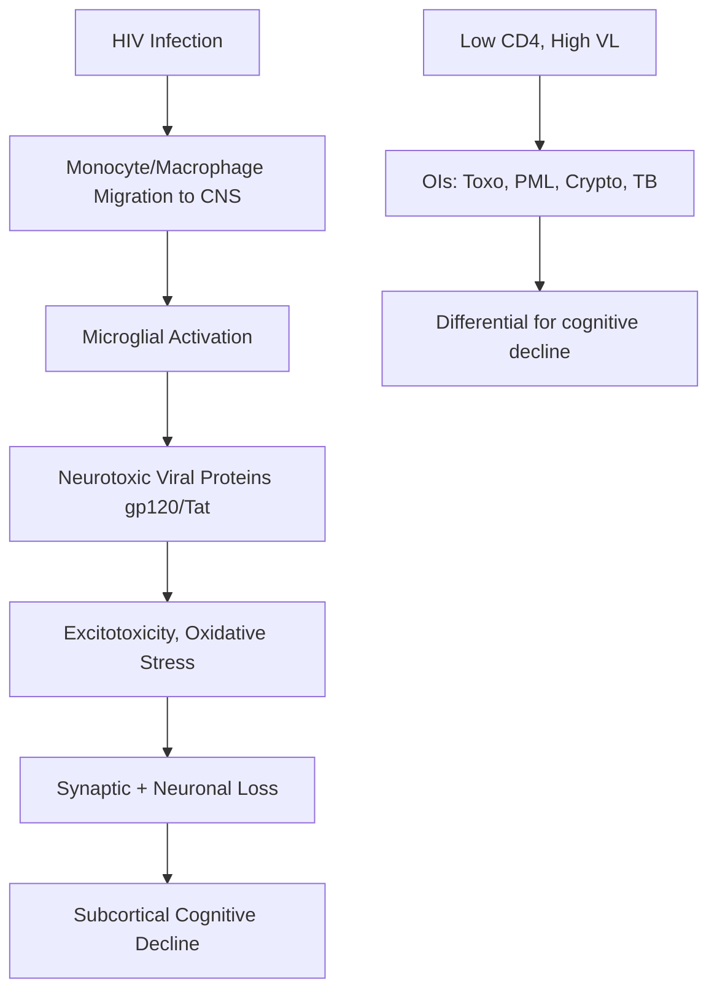

# HIV-Associated Neurocognitive Disorder (HAND)

> [!tip] **HAND is the most common neurological complication of HIV**, affecting **30-50%** of untreated individuals. **ART reduces but does NOT eliminate risk** — 15-25% of virally suppressed patients still meet criteria.

> [!tip] **Frascati Criteria (2007)** classify HAND into **ANI, MND, HAD** based on cognitive testing and functional impairment.

## 1. Definition / Epidemiology / Classification

**HAND** = spectrum of cognitive impairment directly caused by HIV, from mild (ANI) to severe (HAD), excluding opportunistic infections.

| Stage | Acronym | Definition | Functional Impact |
|-------|---------|------------|-------------------|
| **Asymptomatic Neurocognitive Impairment** | ANI | ≥1 cognitive domain ≥1 SD below mean | No functional impairment |
| **HIV-Associated Mild Neurocognitive Disorder** | MND | ≥2 cognitive domains ≥1 SD below mean | **Mild** functional impairment |
| **HIV-Associated Dementia** | HAD | ≥2 cognitive domains ≥2 SD below mean | **Marked** functional impairment (AIDS-dementia complex) |

**Epidemiology:**
- **Prevalence:** 30-50% untreated; 15-25% on ART
- **Risk factors:** Low CD4 nadir (<200), high viral load, older age, comorbidities (HCV, syphilis, vascular), low education, substance use
- **ART effect:** Reduces incidence of HAD dramatically but MND/ANI persist

## 2. Aetiology / Pathophysiology

**Direct HIV effect:**
- HIV enters CNS via "Trojan horse" (infected monocytes/macrophages) within 2 weeks of infection
- Microglia and perivascular macrophages = main CNS reservoir
- **gp120, Tat, Nef, Vpr** neurotoxic viral proteins
- **Indirect:** Chronic immune activation, cytokines (TNF-α, IL-1β, IL-6), oxidative stress
- Neuronal loss is **indirect** (no productive infection of neurons)

**Pathology:**
- **Microglial nodules** and **multinucleated giant cells** (HIV encephalitis)
- **White matter pallor** and **vacuolar myelopathy** (especially dorsal columns)
- **Astrogliosis, neuronal loss** (subcortical deep grey, hippocampus, frontal)
- **HIV-associated lipoatrophy syndrome** (metabolic)

## 3. Clinical Features — **Subcortical Pattern**

| Domain | Manifestation |
|--------|---------------|
| **Psychomotor slowing** | Most prominent — bradyphrenia, bradykinesia |
| **Executive dysfunction** | Poor planning, mental flexibility |
| **Attention/Concentration** | Impaired |
| **Working memory** | Impaired |
| **Information processing** | Slowed |
| **Retrieval memory** | Impaired (encoding preserved) |
| **Motor** | Slowed, gait disturbance, hyperreflexia |
| **Behavioural** | Apathy, depression, social withdrawal |
| **Late** | Global dementia, myoclonus, seizures, incontinence |

**Differences from AD (cortical):**
- AD = cortical (memory loss, aphasia, apraxia prominent)
- HAND = **subcortical** (slowing, executive, retrieval, motor)

**HAD (Severe):** Marked slowing, severe executive dysfunction, gait disturbance, hyperreflexia, primitive reflexes (snout, grasp), myoclonus, incontinence, mutism.

## 4. Diagnostic Approach / Algorithm

**Frascati Criteria (2007):**
1. **Acquired** cognitive impairment (≥1 month duration)
2. ≥1 cognitive domain impairment on formal testing
3. **Exclusion** of delirium, substance, opportunistic CNS disease
4. Functional impact (MND/HAD)

**Stepwise workup:**
1. Confirm HIV status + CD4 + viral load
2. Exclude OI (CT/MRI + LP)
3. Formal neuropsychometric testing (≥5 domains): motor, executive, speed, attention, memory, language
4. Apply Frascati criteria
5. Assess adherence + viral suppression
6. Functional assessment (IADLs)

## 5. Investigations

| Investigation | Purpose |
|---------------|---------|
| **CD4 count** | Risk stratification; <200 = high OI risk |
| **HIV viral load** | Uncontrolled = direct neuronal injury |
| **CSF HIV RNA** | Independent CNS viral replication (CNS escape) |
| **MRI Brain** | Atrophy, white matter hyperintensities, exclude OI |
| **CSF (mandatory)** | Exclude: crypto Ag, TB PCR, Toxo PCR, VDRL, CMV PCR, JC virus PCR (PML), HSV |
| **Neuropsychometric testing** | ≥5 domains; Frascati criteria |
| **CSF neopterin / NFL** | Research; marker of immune activation |

**MRI Findings:**
- **HAND:** Symmetric **periventricular and deep white matter hyperintensities** (T2/FLAIR), **cerebral atrophy** (out of proportion to age)
- **PML:** Asymmetric subcortical white matter, no mass effect, no enhancement
- **Toxoplasmosis:** Multiple ring-enhancing lesions, basal ganglia
- **Cryptococcoma:** Pseudocysts, dilated perivascular spaces (Virchow-Robin)
- **PCNSL:** Solitary, often periventricular, homogeneous enhancement

## 6. Differential Diagnosis

| Differential | Distinguishing Features | Key Test |
|--------------|------------------------|----------|
| **Toxoplasmosis** | Multiple ring-enhancing lesions, basal ganglia | MRI + Toxo serology, PCR |
| **PML (JC virus)** | Asymmetric white matter, no enhancement, rapid | MRI + CSF JC virus PCR |
| **Cryptococcal meningitis** | Headache, fever, ↑ICP | CSF CrAg, India ink |
| **TB meningitis** | Basal meningeal enhancement, hydrocephalus | CSF TB PCR, ADA |
| **PCNSL** | Solitary periventricular enhancing | Brain biopsy |
| **CMV encephalitis** | Periventricular, rapid progression | CSF CMV PCR |
| **HIV encephalitis** | Microglial nodules, MGC | Biopsy (research) |
| **Neurosyphilis** | General paresis, Argyll Robertson pupil | CSF VDRL, TPHA |
| **Metabolic (B12, thyroid)** | Reversible, no HIV direct effect | B12, TSH |
| **Depression pseudodementia** | "Don't know", low mood, normal testing | GDS, BDI, antidepressant trial |

## 7. Management

### ART (Foundation)
| Strategy | Notes |
|----------|-------|
| **Continue/re-initiate ART** | First-line; reduce VL, immune reconstitution |
| **CNS-penetrating regimens** | **CPE (CNS Penetration Effectiveness) score**; prefer high CPE in HAD |
| **High CPE drugs** | Zidovudine, Abacavir, Nevirapine, Efavirenz, Indinavir, Darunavir, Raltegravir, Dolutegravir, Maraviroc |
| **Low CPE drugs** | Tenofovir, Lamivudine, Emtricitabine, Atazanavir, Enfurvitide |
| **CNS escape** | CSF VL > plasma VL → consider ART intensification + LP for genotype |

### Symptomatic / Adjunctive
| Intervention | Indication |
|--------------|------------|
| **Optimize ART adherence** | Always |
| **Stimulants (methylphenidate)** | Severe psychomotor slowing |
| **Antidepressants (SSRIs)** | Comorbid depression |
| **Sleep hygiene** | Sleep disturbance |
| **Treat comorbidities** | HCV, syphilis, vascular risk |
| **Neuropsychological rehab** | Cognitive training, compensatory strategies |
| **Psychosocial support** | Disclosure, stigma, employment, benefits |
| **Occupational therapy** | ADL support |
| **Antipsychotics (low-dose)** | Severe agitation (avoid typical if possible) |

### When to Start ART in HIV-Associated OIs
- **HAD:** Start ART **immediately** (no delay needed)
- **Toxoplasmosis:** 2-3 weeks after starting anti-toxo (IRIS risk)
- **Cryptococcal meningitis:** **Defer 4-6 weeks** (mortality benefit; COAT trial)
- **TB meningitis:** 2-8 weeks (controversial)
- **PML:** Start ART immediately; IRIS possible

## 8. Drug Interactions / Cautions

| Drug | Issue |
|------|-------|
| **Efavirenz** | Neuropsychiatric side effects (confusion, depression, vivid dreams) |
| **Antipsychotics** | QT prolongation, EPS |
| **SSRIs** | Serotonin syndrome risk with MAOIs, tramadol |
| **Anticonvulsants** | CYP3A4 interactions with PIs, NNRTIs (↓levels) |
| **PIs (ritonavir, cobicistat)** | CYP3A4 inhibition; many interactions |
| **Methadone** | NNRTIs (efavirenz, nevirapine) ↓methadone |

## 9. Complications

| Complication | Notes |
|--------------|-------|
| **IRIS (Immune Reconstitution Inflammatory Syndrome)** | After ART start; paradoxical worsening; manage with steroids + continue ART |
| **Opportunistic infections** | Toxo, PML, crypto, TB, CMV |
| **Vacuolar myelopathy** | Spastic paraparesis, dorsal column loss |
| **HIV-associated distal symmetric polyneuropathy** | Pain, sensory loss, NCS abnormal |
| **Treatment failure** | CNS escape, resistance |

## 10. Red Flags / Emergencies

| Red Flag | Action |
|----------|--------|
| New focal deficit + CD4<200 | Urgent MRI (Toxo, PML, PCNSL) |
| Seizures + CD4<200 | LP, MRI, exclude OI |
| Personality change + CD4<200 | Exclude PML, PCNSL |
| Worsening despite ART | Consider IRIS, CNS escape, new OI |
| Cryptococcal meningitis | Reduce ICP (serial LPs), start fluconazole, **defer ART 4-6 weeks** |

## 11. Prognosis

| Factor | Good Prognosis | Poor Prognosis |
|--------|----------------|----------------|
| ART adherence | Excellent | Poor |
| CD4 nadir | >200 | <200 |
| Viral load | Undetectable | High |
| Age | <50 | >50 |
| Comorbidities | Few | Multiple (HCV, vascular) |
| HAND stage at diagnosis | ANI/MND | HAD |

- **HAD mortality:** 25-50% at 1 year untreated; reduced with ART
- **MCI/HAND persist** even with viral suppression
- **Functional decline** correlates with HAND severity

## 12. Topic Correlation
| Related Topic | Key Overlap |
|---------------|-------------|
| **HIV Neurology** | Toxo, PML, crypto, primary CNS lymphoma |
| **PML** | Asymmetric white matter, JC virus, ART |
| **Toxoplasmosis** | Multiple ring-enhancing lesions |
| **Cryptococcal meningitis** | ↑ICP, CrAg, ART timing |
| **Vacuolar myelopathy** | Spastic paraparesis, dorsal column loss |

## 13. Special Situations

| Situation | Consideration |
|-----------|---------------|
| **Pregnancy** | ART continues; efavirenz historically avoided (now safer); consider C-section if high VL |
| **Paediatric** | Encephalopathy, developmental delay, ART early |
| **Elderly** | Faster cognitive decline, ART benefit preserved |
| **Hepatitis C co-infection** | Additive neurocognitive risk |
| **Renal impairment** | Tenofovir dose adjust |
| **TB co-infection** | Rifampicin ↔ PIs; raltegravir-based regimen |
| **Driving (DVLA)** | If HAD with impaired insight → cease driving |

## FCPS/MRCP High-Yield Summary
| Category | Key Points |
|----------|------------|
| **Definition** | Frascati 2007: ANI, MND, HAD |
| **Epidemiology** | 30-50% untreated; 15-25% on ART |
| **Pattern** | **Subcortical** (slowing, executive, retrieval, motor) |
| **Aetiology** | Direct HIV neurotoxicity + immune activation |
| **Pathology** | Microglial nodules, MGC, white matter pallor |
| **MRI** | Periventricular WMH, atrophy |
| **CD4 nadir** | Most important prognostic factor |
| **CPE score** | High CPE drugs for HAD |
| **CNS escape** | CSF VL > plasma VL; ART intensification |
| **ART effect** | Reduces HAD; MND/ANI persist |
| **Differential** | Toxo, PML, crypto, PCNSL, depression, metabolic |
| **Vacuolar myelopathy** | Spastic paraparesis, dorsal column |

## Viva Questions
1. **Q:** Define HAND and its subtypes. **A:** Frascati 2007: ANI (asymptomatic, ≥1 domain ≥1SD), MND (≥2 domains ≥1SD + mild functional), HAD (≥2 domains ≥2SD + marked functional).
2. **Q:** Pathophysiology of HAND. **A:** HIV enters CNS via infected macrophages (Trojan horse); microglial activation; viral proteins (gp120, Tat) neurotoxic; chronic immune activation (TNF, IL-1β, IL-6); indirect neuronal injury.
3. **Q:** Subcortical pattern of HAND. **A:** Psychomotor slowing, executive dysfunction, attention, retrieval memory, motor — **slowing prominent**; vs AD (cortical: memory, aphasia, apraxia).
4. **Q:** Most important prognostic factor in HAND? **A:** **CD4 nadir** (lowest ever CD4 count).
5. **Q:** What is CNS escape? **A:** CSF HIV VL > plasma VL (or detectable CSF with suppressed plasma); consider ART intensification, CSF genotype.
6. **Q:** CPE score in HIV. **A:** CNS Penetration Effectiveness; high CPE drugs preferred in HAD (Zidovudine, Abacavir, Nevirapine, Efavirenz, Raltegravir, Dolutegravir, Maraviroc).
7. **Q:** MRI findings in HAND. **A:** Symmetric periventricular and deep white matter hyperintensities (T2/FLAIR); cerebral atrophy out of proportion to age.
8. **Q:** ART timing in cryptococcal meningitis. **A:** **Defer ART 4-6 weeks** after starting antifungal (mortality benefit, COAT trial).
9. **Q:** Major differential in HIV cognitive decline? **A:** Opportunistic infections: Toxo, PML, crypto, TB, PCNSL, CMV. Each excluded by MRI + CSF.
10. **Q:** What is vacuolar myelopathy? **A:** Spastic paraparesis + dorsal column loss in HIV; due to HIV itself (not OI); pathology = vacuolation of posterior/lateral columns.

## Common Confusions / Exam Traps
| Confusion | Clarification |
|-----------|---------------|
| HAND persists on ART | Yes, MND/ANI persist; not "cured" by ART |
| Cortical vs subcortical | AD = cortical; HAND = subcortical (slowing) |
| CD4 nadir vs current | **Nadir** is most prognostic for HAND |
| ART in crypto meningitis | **Defer 4-6 weeks** (mortality) |
| ART in toxoplasmosis | Start anti-toxo first; ART 2-3 weeks later |
| IRIS | Worsening after ART start; continue ART + steroids |
| PML vs Toxo on MRI | PML = no enhancement, asymmetric; Toxo = ring-enhancing, basal ganglia |
| MND/ANI reversible? | MND partly reversible with ART; ANI less so |

## Mnemonics
1. **HAND** — **H**IV, **A**ssociated, **N**eurocognitive, **D**isorder
2. **Frascati stages** — **A**symptomatic, **M**ild (MND), **H**AD
3. **HAD features** — **A**pathy, **B**radyphrenia, **C**ognitive slowing, **D**ifficulty walking
4. **OIs to exclude** — **T**oxo, **P**ML, **C**rypto, **T**B, **P**CNSL, **C**MV
5. **High CPE drugs** — **ZANDR**: **Z**idovudine, **A**bacavir, **N**evirapine, **D**arunavir, **R**altegravir
6. **HAND** = **S**ubcortical **S**lowing (vs AD = Cortical)

## MCQs (10)
1. **Q:** Frascati criteria classify HAND into? **A:** C. ANI, MND, HAD
2. **Q:** Most important prognostic factor in HAND? **A:** B. CD4 nadir
3. **Q:** HAND clinical pattern is? **A:** B. Subcortical (slowing)
4. **Q:** High CPE drug? **A:** A. Zidovudine
5. **Q:** ART timing in cryptococcal meningitis? **A:** B. Defer 4-6 weeks
6. **Q:** Most sensitive test for HAND diagnosis? **A:** B. Formal neuropsychometric testing (≥5 domains)
7. **Q:** Pathology of HIV encephalitis includes? **A:** A. Microglial nodules and multinucleated giant cells
8. **Q:** Vacuolar myelopathy affects? **A:** C. Posterior and lateral columns
9. **Q:** OI to exclude with asymmetric white matter, no enhancement? **A:** A. PML
10. **Q:** HIV enters CNS via? **A:** B. Infected monocytes (Trojan horse)

## SBA Questions (10)
1. **Scenario:** 45-year-old HIV+ on ART, virally suppressed, CD4 350. Slowing, poor planning, retrieval deficit. Diagnosis? **A:** B. HAND (MND)
2. **Scenario:** CD4 50, headache, fever, ↑ICP. CSF: CrAg+. ART timing? **A:** C. Defer 4-6 weeks
3. **Scenario:** CD4 100, focal deficit, MRI: multiple ring-enhancing lesions basal ganglia. **A:** A. Toxoplasmosis
4. **Scenario:** CD4 80, asymmetric white matter lesion, no mass effect, no enhancement. **A:** B. PML
5. **Scenario:** CD4 30, personality change, MRI: solitary periventricular enhancing lesion. **A:** C. PCNSL
6. **Scenario:** HAND patient, ART intensification considered. Best regimen? **A:** A. High CPE score
7. **Scenario:** HIV patient, spastic paraparesis, dorsal column loss. **A:** A. Vacuolar myelopathy
8. **Scenario:** CD4 60, deteriorating 2 weeks after starting ART. **A:** B. IRIS
9. **Scenario:** HIV, CD4 200, plasma VL undetectable, but cognitive decline. **A:** C. CSF VL to exclude CNS escape
10. **Scenario:** HIV patient, abnormal movements, encephalopathy, CD4 50. MRI: basal ganglia hyperintensity. **A:** B. Toxoplasmosis

## Flashcards
- **Q:** HAND classification (Frascati)? **A:** **ANI, MND, HAD**
- **Q:** Most important prognostic factor? **A:** **CD4 nadir**
- **Q:** HAND pattern? **A:** **Subcortical** (slowing, executive, retrieval, motor)
- **Q:** High CPE drugs (3)? **A:** Zidovudine, Abacavir, Raltegravir
- **Q:** ART in crypto meningitis? **A:** **Defer 4-6 weeks**
- **Q:** PML MRI? **A:** Asymmetric white matter, **no enhancement**
- **Q:** Toxo MRI? **A:** Multiple **ring-enhancing** lesions, basal ganglia
- **Q:** HIV entry to CNS? **A:** **Infected monocytes** (Trojan horse)
- **Q:** Pathology of HIV encephalitis? **A:** Microglial nodules, **multinucleated giant cells**
- **Q:** Vacuolar myelopathy? **A:** Spastic paraparesis + dorsal column loss

## Answer Key
### MCQs
1. **C** 2. **B** 3. **B** 4. **A** 5. **B** 6. **B** 7. **A** 8. **C** 9. **A** 10. **B**

### SBAs
1. **B** — Subcortical pattern on ART = MND
2. **C** — Defer ART in crypto meningitis
3. **A** — Multiple ring-enhancing = Toxo
4. **B** — Asymmetric, no enhancement = PML
5. **C** — Solitary periventricular enhancing = PCNSL
6. **A** — High CPE for HAND
7. **A** — Vacuolar myelopathy in HIV
8. **B** — IRIS post-ART
9. **C** — CSF VL for CNS escape
10. **B** — Multiple ring-enhancing basal ganglia = Toxo
