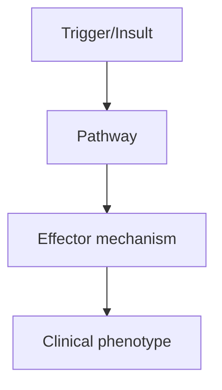
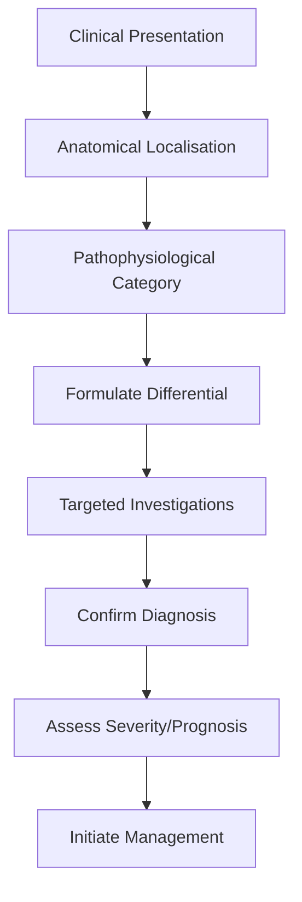
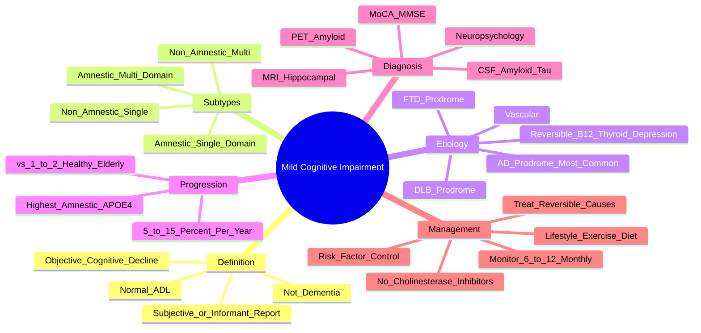

# Mild Cognitive Impairment

> [!tip] **High-Yield Definition**
> Mild cognitive impairment (MCI): objective cognitive decline (≥1.5 SD below norm) in ≥1 cognitive domain, with normal ADLs preserved, no dementia. Prodromal stage often, but stable in some. Conversion to dementia: 5-15% per year.

---

## 1. Definition / Epidemiology / Classification

### Definition
Mild cognitive impairment (MCI): objective cognitive decline (≥1.5 SD below norm) in ≥1 cognitive domain, with normal ADLs preserved, no dementia. Prodromal stage often, but stable in some. Conversion to dementia: 5-15% per year.

### Epidemiology
Prevalence: 10-20% of population >65y. Conversion to dementia: 5-15%/year (vs 1-2% in normal elderly). Amnestic MCI: higher conversion to AD. Non-amnestic: higher conversion to other dementias.

### Classification
| Variant | Key Features | Prognosis |
|---------|-------------|-----------|
| | | |

---

## 2. Aetiology / Pathophysiology

### Aetiology
Amnestic single-domain: prodromal AD (most common). Amnestic multi-domain: AD, vascular. Non-amnestic single-domain: DLB (visual hallucinations, RBD), FTLD (behavioural, language). Non-amnestic multi-domain: AD, vascular, DLB. Reversible: depression, medications, sleep, B12, hypothyroidism, NPH, subdural. Biomarkers: CSF Aβ42, total tau, phosphorylated tau (p-tau 181), hippocampal atrophy, amyloid PET.

### Pathophysiology

---

## 3. Clinical Features

### History
- **Onset/Duration:**
- **Progression:**
- **Key symptoms:**
- **Triggers:**
- **Systemic symptoms:**
- **Drug/Family/Social history:**

### Examination
| Domain | Key Findings | Localisation Value |
|--------|-------------|-------------------|
| | | |

### Specific Clinical Features
Memory complaint (usually, with normal learning curve change). Objective impairment in ≥1 domain: memory (most common, especially delayed recall), executive function, attention, language, visuospatial. Normal ADLs preserved (may have mild inefficiency, longer time to complete). NOT dementia. No significant functional impairment. Insight often preserved. May have: depression, anxiety, apathy, irritability.

---

## 4. Diagnostic Approach / Algorithm

---

## 5. Investigations

Cognitive testing: MMSE (less sensitive for MCI), MoCA (>26 normal, 25-26 borderline, <25 impairment), ACE-III, neuropsychology (gold standard). Bloods: FBC, U&Es, LFTs, TFTs, B12, folate, vitamin D, syphilis, HIV. MRI brain: atrophy pattern (mesial temporal - AD; parietal - PCA; frontal - FTD), vascular changes, NPH. CSF: Aβ42, t-tau, p-tau (AD pattern). Amyloid PET (if available). FDG-PET (pattern: AD - temporoparietal).

---

## 6. Differential Diagnosis

| Differential | Distinguishing Features | Key Test |
|--------------|------------------------|----------|
| | | |

---

## 7. Management

Lifestyle: exercise (aerobic, resistance - reduces progression by 30-40%), Mediterranean diet, cognitive stimulation, social engagement, sleep hygiene, vascular risk factor control (BP, lipids, diabetes, smoking cessation). Treat reversible: depression (SSRI), sleep, hearing/vision, thyroid, B12. Consider: cognitive training, neurogenesis (BDNF), multicomponent intervention. Disease-modifying (for AD prodrome): lecanemab, donanemab (mild cognitive impairment/mild AD, amyloid-positive). Anti-amyloid antibodies: monitoring for ARIA (amyloid-related imaging abnormalities - oedema, microbleeds). Monitor: cognitive testing q6-12mo, MRI annually.

---

## 8. Drug Interactions / Contraindications / Comorbidity Cautions

| Drug | Interaction / Caution | Management |
|------|----------------------|------------|
| | | |

---

## 9. Procedures (if applicable)

### Procedure:
- **Indications:**
- **Contraindications:**
- **Preparation / Principle:**
- **Complications:**
- **Viva Pearls:**

---

## 10. Complications

| Complication | Frequency | Prevention / Monitoring | Management |
|--------------|-----------|------------------------|------------|
| | | | |

---

## 11. Red Flags / Emergencies

Rapid decline (vascular, autoimmune, CJD), behavioural change (FTD), parkinsonism (DLB, PSP), focal neurology, seizures, gait disturbance, incontinence (NPH, normal pressure hydrocephalus).

---

## 12. Prognosis

5-15% convert to dementia per year. 30-50% stable over 5 years (revert to normal or stable MCI). 20-30% progress to AD (esp. amnestic MCI with positive AD biomarkers). Amnestic + positive AD biomarkers: 80% convert within 5 years. Non-amnestic: more variable (DLB, FTD, vascular).

---

## 13. Topic Correlation

| Related Topic | Link | Key Overlap |
|---------------|------|-------------|
| | | |

---

## 14. Special Situations

| Situation | Consideration |
|-----------|---------------|
| **Pregnancy** | |
| **Lactation** | |
| **Paediatric** | |
| **Elderly / Frail** | |
| **Renal impairment** | |
| **Hepatic impairment** | |
| **Immunocompromised** | |
| **Perioperative** | |
| **Driving / DVLA** | |
| **Occupational** | |

---

## FCPS/MRCP High-Yield Summary

| Category | Key Points |
|----------|------------|
| **Definition** | Mild cognitive impairment (MCI): objective cognitive decline (≥1.5 SD below norm) in ≥1 cognitive domain, with normal ADLs preserved, no dementia. Prodromal stage often, but stable in some. Conversion |
| **Epidemiology** | Prevalence: 10-20% of population >65y. Conversion to dementia: 5-15%/year (vs 1-2% in normal elderly). Amnestic MCI: higher conversion to AD. Non-amne |
| **Pathophysiology** | |
| **Clinical** | Memory complaint (usually, with normal learning curve change). Objective impairment in ≥1 domain: memory (most common, especially delayed recall), executive function, attention, language, visuospatial |
| **Diagnosis** | |
| **Investigations** | Cognitive testing: MMSE (less sensitive for MCI), MoCA (>26 normal, 25-26 borderline, <25 impairment), ACE-III, neuropsychology (gold standard). Bloods: FBC, U&Es, LFTs, TFTs, B12, folate, vitamin D,  |
| **Management** | Lifestyle: exercise (aerobic, resistance - reduces progression by 30-40%), Mediterranean diet, cognitive stimulation, social engagement, sleep hygiene, vascular risk factor control (BP, lipids, diabet |
| **Complications** | |
| **Prognosis** | 5-15% convert to dementia per year. 30-50% stable over 5 years (revert to normal or stable MCI). 20-30% progress to AD (esp. amnestic MCI with positive AD biomarkers). Amnestic + positive AD biomarker |
| **Viva Pearls** | |
| **Drug Doses** | |
| **Scoring Systems** | |
| **Genetics** | |
| **Imaging Signs** | |

---

## Viva Questions (PACES/FCPS Style)

1. **Q:** Define Mild Cognitive Impairment and classify its variants.
   **A:** Based on the definition above.

2. **Q:** What are the key clinical features?
   **A:** Memory complaint (usually, with normal learning curve change). Objective impairment in ≥1 domain: memory (most common, especially delayed recall), executive function, attention, language, visuospatial. Normal ADLs preserved (may have mild inefficiency, longer time to complete). NOT dementia. No sign

3. **Q:** What is the first-line treatment?
   **A:** Based on the management section.

4. **Q:** What are the red flags requiring urgent referral?
   **A:** Rapid decline (vascular, autoimmune, CJD), behavioural change (FTD), parkinsonism (DLB, PSP), focal neurology, seizures, gait disturbance, incontinence (NPH, normal pressure hydrocephalus).

5. **Q:** What is the prognosis?
   **A:** 5-15% convert to dementia per year. 30-50% stable over 5 years (revert to normal or stable MCI). 20-30% progress to AD (esp. amnestic MCI with positive AD biomarkers). Amnestic + positive AD biomarkers: 80% convert within 5 years. Non-amnestic: more variable (DLB, FTD, vascular).

6. **Q:** How do you differentiate Mild Cognitive Impairment from key differentials?
   **A:** Clinical features, investigations, and response to treatment.

7. **Q:** What investigations are most useful?
   **A:** Based on the investigations section.

8. **Q:** Describe the stepwise management approach.
   **A:** Based on the management algorithm.

9. **Q:** What are the emergency presentations?
   **A:** Based on the red flags section.

10. **Q:** How does management change in pregnancy/paediatrics/elderly?
    **A:** Special considerations per population.

---

## Common Confusions / Exam Traps

| Confusion | Clarification |
|-----------|---------------|
| | |

---

## Mnemonics
1. **MCI definition:** "**Objectively impaired, but functioning normally**" — 1-2 SD below norm on testing, ADL preserved
2. **MCI subtypes:** "**amnestic single, amnestic multi, non-amnestic single, non-amnestic multi**"
3. **MCI to dementia:** "**5-15% per year**" — vs 1-2% in healthy elderly; **highest risk if amnestic + APOE4**

---

## Mind Map

---

## Spaced Repetition Trackers
| Day | Recall Score (/10) | Key Facts Reviewed | Weak Areas |
|-----|--------------------|--------------------|------------|
| Day 1 | __ | MCI definition; ADL preserved; not dementia | |
| Day 3 | __ | Subtypes: amnestic vs non-amnestic, single vs multi | |
| Day 7 | __ | Progression rate 5-15%/year | |
| Day 14 | __ | Biomarkers: CSF Aβ42/tau, MRI hippocampal, PET amyloid | |
| Day 30 | __ | Reversible causes; lifestyle modification | |
| Day 90 | __ | Full assessment, monitoring, prognosis | |

---

## Self-Test Scorecard
| Section | Topic | Score (/5) |
|---------|-------|-----------|
| 1 | MCI diagnostic criteria | __/5 |
| 2 | MCI subtypes (4 categories) | __/5 |
| 3 | Progression to dementia | __/5 |
| 4 | Screening tests (MoCA, MMSE) | __/5 |
| 5 | Biomarkers (CSF, MRI, PET) | __/5 |
| 6 | Reversible causes | __/5 |
| 7 | Etiology (AD prodrome) | __/5 |
| 8 | Management (no AChEi) | __/5 |
| 9 | Risk factors (APOE4) | __/5 |
| 10 | Follow-up and monitoring | __/5 |
| **Total** | | **__/50** |

---

## One-Page Revision Card
| **Topic** | **Mild Cognitive Impairment (MCI)** |
|-----------|--------------------------------------|
| **Definition** | Objective cognitive decline (1-2 SD below norm) with preserved ADL; not dementia |
| **Subtypes** | Amnestic single-domain, amnestic multi-domain, non-amnestic single, non-amnestic multi |
| **Most common cause** | AD prodrome (especially amnestic MCI) |
| **Progression** | 5-15%/year to dementia (vs 1-2% in healthy elderly) |
| **Screening** | MoCA (more sensitive than MMSE); MMSE poor for MCI |
| **Biomarkers** | CSF ↓Aβ42, ↑tau; MRI hippocampal atrophy; FDG-PET; amyloid PET |
| **Reversible causes** | B12 deficiency, hypothyroidism, depression, sleep apnoea, medications, normal pressure hydrocephalus |
| **Management** | NO cholinesterase inhibitors (no benefit, may harm); treat reversible causes; lifestyle modification |
| **Lifestyle** | Exercise (best evidence), Mediterranean diet, cognitive stimulation, social engagement, vascular risk control |
| **Follow-up** | 6-12 monthly review; consider MCI registries (e.g. ADNI) |

---

## MCQs (10)

1. **MCI is defined by:**
   A. Dementia with impaired ADL
   B. **Objective cognitive impairment with preserved ADL**
   C. Subjective memory loss only
   D. Severe memory loss
   *Answer: B*

2. **The most common underlying cause of amnestic MCI is:**
   A. Vascular disease
   B. **Alzheimer's disease prodrome**
   C. DLB
   D. FTD
   *Answer: B*

3. **Annual conversion rate from MCI to dementia is approximately:**
   A. 1-2%
   B. **5-15%**
   C. 25-30%
   D. 50%
   *Answer: B*

4. **Cholinesterase inhibitors in MCI are:**
   A. Recommended
   B. **Not recommended (no benefit; possible harm)**
   C. Only in amnestic MCI
   D. Only if APOE4 positive
   *Answer: B*

5. **Which cognitive screening tool is MOST sensitive for MCI?**
   A. MMSE
   B. **MoCA (Montreal Cognitive Assessment)**
   C. GPCOG
   D. AMTS
   *Answer: B*

6. **CSF biomarkers supporting AD as cause of MCI include:**
   A. ↑Aβ42, ↓tau
   B. **↓Aβ42, ↑total tau, ↑phospho-tau**
   C. 14-3-3 protein
   D. Normal CSF
   *Answer: B*

7. **All of the following are reversible causes of cognitive impairment EXCEPT:**
   A. Vitamin B12 deficiency
   B. Hypothyroidism
   C. **Alzheimer's disease**
   D. Depression
   *Answer: C*

8. **The strongest lifestyle intervention for MCI is:**
   A. Cognitive training
   B. **Regular aerobic exercise**
   C. Vitamin supplementation
   D. Hormone replacement
   *Answer: B*

9. **APOE ε4 allele in MCI is associated with:**
   A. **Higher risk of progression to Alzheimer's dementia**
   B. Reduced risk
   C. FTD
   D. Vascular dementia only
   *Answer: A*

10. **MRI brain in MCI due to AD typically shows:**
    A. Normal scan
    B. **Hippocampal/medial temporal atrophy**
    C. Cerebellar atrophy
    D. Frontal atrophy
    *Answer: B*

---

## SBA Questions (10)

1. **A 72-year-old has 2 years of worsening memory confirmed on MoCA (24/30). His wife reports he still drives, manages finances, and is independent in ADL. Diagnosis?**
   A. Alzheimer's dementia
   B. **MCI (mild cognitive impairment)**
   C. Normal ageing
   D. Subjective cognitive decline
   *Answer: B* — Objective impairment + preserved ADL = MCI.

2. **A 70-year-old with MCI asks about medication to prevent dementia. Best evidence-based response?**
   A. Start donepezil
   B. Start memantine
   C. **Lifestyle modification (exercise, Mediterranean diet)**
   D. Start ginkgo biloba
   *Answer: C* — No pharmacological prevention; lifestyle is best.

3. **A 68-year-old with MCI has B12 level 90 ng/L (low). Most appropriate action?**
   A. Reassure
   B. **IM vitamin B12 replacement; reassess cognition**
   C. Start donepezil
   D. MRI brain only
   *Answer: B* — Treat reversible causes first.

4. **CSF in MCI due to AD shows:**
   A. ↑Aβ42, ↓tau
   B. **↓Aβ42, ↑total tau and phospho-tau**
   C. 14-3-3 positive
   D. Normal
   *Answer: B* — Classic AD CSF profile.

5. **A patient with MCI should be reviewed at what interval?**
   A. Every 5 years
   B. **6-12 monthly**
   C. Every 2 years
   D. Only if symptomatic deterioration
   *Answer: B* — Close monitoring detects conversion to dementia.

6. **Amnestic MCI is most likely to convert to which dementia?**
   A. FTD
   B. **Alzheimer's disease**
   C. DLB
   D. PSP
   *Answer: B* — Amnestic presentation strongly predicts AD.

7. **Non-amnestic single-domain MCI (e.g. executive dysfunction) may be prodrome to:**
   A. AD only
   B. **FTD, DLB, or vascular dementia**
   C. Depression only
   D. CJD
   *Answer: B* — Non-amnestic MCI may reflect non-AD prodromes.

8. **The strongest single modifiable risk factor for dementia progression in MCI is:**
   A. Education
   B. **Vascular risk factor control (BP, diabetes, cholesterol)**
   C. Caffeine intake
   D. Social class
   *Answer: B* — Vascular risk reduction slows progression.

9. **Amyloid PET in MCI due to AD typically shows:**
   A. Normal uptake
   B. **Positive cortical amyloid uptake**
   C. Reduced uptake
   D. Striatal binding only
   *Answer: B* — Amyloid PET positive supports AD pathology.

10. **A 74-year-old with MCI has MMSE 28/30 but MoCA 22/30. Most likely explanation?**
    A. **MoCA is more sensitive to MCI than MMSE**
    B. Patient is malingering
    C. MMSE underestimates
    D. Severe dementia
    *Answer: A* — MoCA has better sensitivity for MCI.

---

## Flashcards
- **Q:** MCI criteria?
  **A:** Objective cognitive decline (1-2 SD below norm); preserved ADL; not dementia
- **Q:** MCI annual conversion rate?
  **A:** 5-15% per year (vs 1-2% in healthy elderly)
- **Q:** Amnestic MCI most likely converts to?
  **A:** Alzheimer's disease
- **Q:** Non-amnestic MCI may be prodrome to?
  **A:** DLB, FTD, vascular dementia
- **Q:** Best screening tool for MCI?
  **A:** MoCA (more sensitive than MMSE)
- **Q:** MMSE cut-off for MCI?
  **A:** MMSE often normal in MCI; poor sensitivity
- **Q:** MCI biomarkers of AD?
  **A:** CSF ↓Aβ42, ↑tau; MRI hippocampal atrophy; amyloid PET positive
- **Q:** Reversible causes of cognitive impairment?
  **A:** B12, folate, hypothyroidism, depression, sleep apnoea, NPH, drugs, infection
- **Q:** Treatment of MCI?
  **A:** No AChEi (no benefit); treat reversible causes; lifestyle modification
- **Q:** Best lifestyle for MCI?
  **A:** Aerobic exercise + Mediterranean diet + cognitive/social engagement
- **Q:** APOE ε4 in MCI?
  **A:** Increases risk of conversion to AD dementia
- **Q:** MCI follow-up?
  **A:** 6-12 monthly review of cognition and function

---

## Answer Key with Explanations

### MCQs
1. **B** — Objective impairment + preserved ADL = MCI
2. **B** — Amnestic MCI usually AD prodrome
3. **B** — 5-15% conversion per year
4. **B** — AChEi not recommended for MCI
5. **B** — MoCA more sensitive than MMSE
6. **B** — ↓Aβ42, ↑tau = AD CSF
7. **C** — AD is irreversible
8. **B** — Aerobic exercise = best evidence
9. **A** — APOE4 increases AD risk
10. **B** — Hippocampal atrophy in MCI-AD

### SBAs
1. **B** — Cognitive impairment + intact ADL = MCI
2. **C** — Lifestyle is best prevention
3. **B** — Treat reversible causes
4. **B** — ↓Aβ42 + ↑tau = AD
5. **B** — 6-12 monthly review
6. **B** — Amnestic → AD
7. **B** — Non-amnestic → other dementias
8. **B** — Vascular risk factor control
9. **B** — Amyloid PET positive in AD
10. **A** — MoCA more sensitive

---

## Tags
#neurology #dementia #MCI #cognition #biomarkers #prevention #FCPS #MRCP #PACES

## Local Navigation
**Heading Hub:** [[../Hub]]  
**Chapter Hierarchy:** [[Davidson Chapter 25 - Neurology Hierarchy]]  
**Chapter MOC:** [[Neurology MOC]]  
**Drug Reference:** [[../00_Index/Neurology Drug Reference]]  
