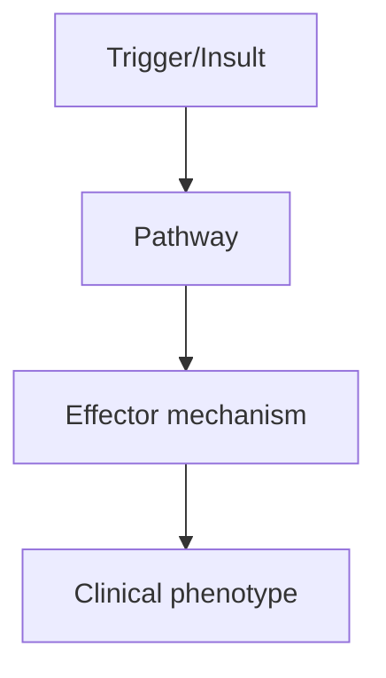
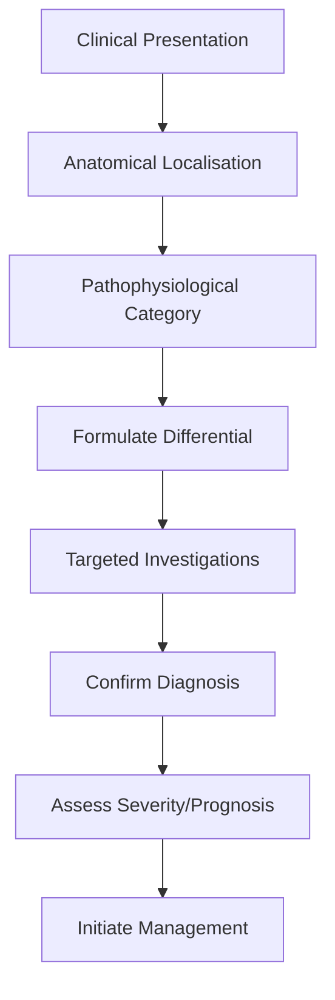
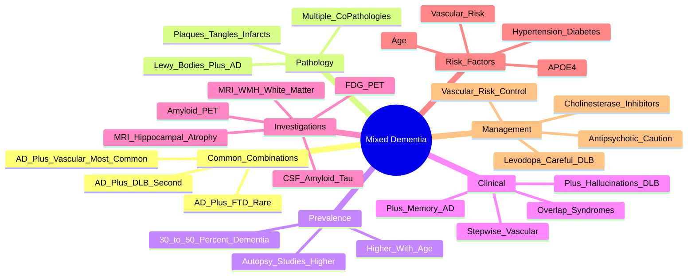

# Mixed Dementia

> [!tip] **High-Yield Definition**
> Mixed dementia: coexistence of ≥2 dementia pathologies in same patient, most commonly AD + vascular, AD + DLB, or AD + TDP-43 (LATE). Common in elderly. Often clinically under-recognised.

---

## 1. Definition / Epidemiology / Classification

### Definition
Mixed dementia: coexistence of ≥2 dementia pathologies in same patient, most commonly AD + vascular, AD + DLB, or AD + TDP-43 (LATE). Common in elderly. Often clinically under-recognised.

### Epidemiology
Very common in elderly. Population-based: 30-50% of dementia has mixed pathology. AD + vascular: most common (30% of AD). AD + DLB: 10-20% of DLB. LATE + AD: 30% of AD >80y. Often under-recognised clinically.

### Classification
| Variant | Key Features | Prognosis |
|---------|-------------|-----------|
| | | |

---

## 2. Aetiology / Pathophysiology

### Aetiology
AD + vascular: AD amyloid + vascular infarcts/ischaemia (small vessel disease, strategic infarcts). AD + DLB: AD + Lewy bodies (alpha-synuclein). AD + LATE: AD + TDP-43 (limbic-predominant age-related TDP-43 encephalopathy, hippocampal sclerosis). Triple pathology: AD + vascular + DLB. Pathological overlap increases with age.

### Pathophysiology

---

## 3. Clinical Features

### History
- **Onset/Duration:**
- **Progression:**
- **Key symptoms:**
- **Triggers:**
- **Systemic symptoms:**
- **Drug/Family/Social history:**

### Examination
| Domain | Key Findings | Localisation Value |
|--------|-------------|-------------------|
| | | |

### Specific Clinical Features
AD + vascular: AD features (episodic memory, naming) + vascular features (stepwise decline, focal neurology, gait, executive). AD + DLB: AD features + DLB features (fluctuations, visual hallucinations, parkinsonism, RBD, neuroleptic sensitivity). AD + LATE: AD features + disproportionate hippocampal amnesia. Mixed presentations often atypical. Vascular + AD: more rapid progression, more severe executive dysfunction, more falls. DLB + AD: more hallucinations, fluctuations. Triple: combination.

---

## 4. Diagnostic Approach / Algorithm

---

## 5. Investigations

MRI brain: AD pattern (mesial temporal atrophy) + vascular changes (white matter hyperintensities, lacunes, microbleeds, strategic infarcts) - common. FDG-PET: AD pattern + posterior parietal + occipital hypometabolism (vs typical AD temporal predominance). DaT-SPECT: reduced uptake (suggests DLB component). MIBG: reduced uptake (DLB). CSF: AD pattern (low Aβ42, high tau) in 80% mixed dementia. Amyloid PET: positive in AD. Polymorphisms: APOE (AD risk). TDP-43: not measured clinically (pathological).

---

## 6. Differential Diagnosis

| Differential | Distinguishing Features | Key Test |
|--------------|------------------------|----------|
| | | |

---

## 7. Management

Treat each component: AD (cholinesterase inhibitors: donepezil, rivastigmine, galantamine, memantine), vascular risk factor control (BP, statins, antiplatelets, glycaemic control, smoking cessation, diet, exercise), DLB (cholinesterase inhibitors - rivastigmine, memantine, avoid antipsychotics, levodopa trial, sleep hygiene, RBD management). Anticholinesterases: rivastigmine, donepezil, galantamine. Memantine: add-on for moderate-severe AD. Lifestyle: cognitive stimulation, exercise, Mediterranean diet, social engagement, vascular risk reduction. Multidisciplinary: geriatrician, neurologist, OT, neuropsychology, social work. Driving: assess.

---

## 8. Drug Interactions / Contraindications / Comorbidity Cautions

| Drug | Interaction / Caution | Management |
|------|----------------------|------------|
| | | |

---

## 9. Procedures (if applicable)

### Procedure:
- **Indications:**
- **Contraindications:**
- **Preparation / Principle:**
- **Complications:**
- **Viva Pearls:**

---

## 10. Complications

| Complication | Frequency | Prevention / Monitoring | Management |
|--------------|-----------|------------------------|------------|
| | | | |

---

## 11. Red Flags / Emergencies

Falls, fractures, stroke, MI, vascular events, depression, aspiration, malnutrition, drug interactions (anticholinergics, antipsychotics).

---

## 12. Prognosis

Worse than single-pathology dementia. Faster progression, more disability, more neuropsychiatric symptoms. Median survival: 5-8 years. Cause of death: vascular, pneumonia, dementia-related. Treat each component.

---

## 13. Topic Correlation

| Related Topic | Link | Key Overlap |
|---------------|------|-------------|
| | | |

---

## 14. Special Situations

| Situation | Consideration |
|-----------|---------------|
| **Pregnancy** | |
| **Lactation** | |
| **Paediatric** | |
| **Elderly / Frail** | |
| **Renal impairment** | |
| **Hepatic impairment** | |
| **Immunocompromised** | |
| **Perioperative** | |
| **Driving / DVLA** | |
| **Occupational** | |

---

## FCPS/MRCP High-Yield Summary

| Category | Key Points |
|----------|------------|
| **Definition** | Mixed dementia: coexistence of ≥2 dementia pathologies in same patient, most commonly AD + vascular, AD + DLB, or AD + TDP-43 (LATE). Common in elderly. Often clinically under-recognised. |
| **Epidemiology** | Very common in elderly. Population-based: 30-50% of dementia has mixed pathology. AD + vascular: most common (30% of AD). AD + DLB: 10-20% of DLB. LAT |
| **Pathophysiology** | |
| **Clinical** | AD + vascular: AD features (episodic memory, naming) + vascular features (stepwise decline, focal neurology, gait, executive). AD + DLB: AD features + DLB features (fluctuations, visual hallucinations |
| **Diagnosis** | |
| **Investigations** | MRI brain: AD pattern (mesial temporal atrophy) + vascular changes (white matter hyperintensities, lacunes, microbleeds, strategic infarcts) - common. FDG-PET: AD pattern + posterior parietal + occipi |
| **Management** | Treat each component: AD (cholinesterase inhibitors: donepezil, rivastigmine, galantamine, memantine), vascular risk factor control (BP, statins, antiplatelets, glycaemic control, smoking cessation, d |
| **Complications** | |
| **Prognosis** | Worse than single-pathology dementia. Faster progression, more disability, more neuropsychiatric symptoms. Median survival: 5-8 years. Cause of death: vascular, pneumonia, dementia-related. Treat each |
| **Viva Pearls** | |
| **Drug Doses** | |
| **Scoring Systems** | |
| **Genetics** | |
| **Imaging Signs** | |

---

## Viva Questions (PACES/FCPS Style)

1. **Q:** Define Mixed Dementia and classify its variants.
   **A:** Based on the definition above.

2. **Q:** What are the key clinical features?
   **A:** AD + vascular: AD features (episodic memory, naming) + vascular features (stepwise decline, focal neurology, gait, executive). AD + DLB: AD features + DLB features (fluctuations, visual hallucinations, parkinsonism, RBD, neuroleptic sensitivity). AD + LATE: AD features + disproportionate hippocampal

3. **Q:** What is the first-line treatment?
   **A:** Based on the management section.

4. **Q:** What are the red flags requiring urgent referral?
   **A:** Falls, fractures, stroke, MI, vascular events, depression, aspiration, malnutrition, drug interactions (anticholinergics, antipsychotics).

5. **Q:** What is the prognosis?
   **A:** Worse than single-pathology dementia. Faster progression, more disability, more neuropsychiatric symptoms. Median survival: 5-8 years. Cause of death: vascular, pneumonia, dementia-related. Treat each component.

6. **Q:** How do you differentiate Mixed Dementia from key differentials?
   **A:** Clinical features, investigations, and response to treatment.

7. **Q:** What investigations are most useful?
   **A:** Based on the investigations section.

8. **Q:** Describe the stepwise management approach.
   **A:** Based on the management algorithm.

9. **Q:** What are the emergency presentations?
   **A:** Based on the red flags section.

10. **Q:** How does management change in pregnancy/paediatrics/elderly?
    **A:** Special considerations per population.

---

## Common Confusions / Exam Traps

| Confusion | Clarification |
|-----------|---------------|
| | |

---

## Mnemonics
1. **Mixed dementia common pairings:** "**AD+V the most common; AD+DLB second**" — AD + vascular most frequent; AD + Lewy body second
2. **Mixed dementia features:** "**when features overlap**" — stepwise decline (vascular) + amnesia (AD) + visual hallucinations (DLB)
3. **Mixed dementia imaging:** "**Atrophy AND white matter**" — hippocampal atrophy + WMH/leukoaraiosis

---

## Mind Map

---

## Spaced Repetition Trackers
| Day | Recall Score (/10) | Key Facts Reviewed | Weak Areas |
|-----|--------------------|--------------------|------------|
| Day 1 | __ | Definition; common combinations (AD+V, AD+DLB) | |
| Day 3 | __ | Prevalence (30-50% on autopsy) | |
| Day 7 | __ | Clinical features overlap (stepwise + memory) | |
| Day 14 | __ | Imaging (MRI hippocampal atrophy + WMH) | |
| Day 30 | __ | Treatment (AChEi + vascular risk control) | |
| Day 90 | __ | Full syndrome, prognosis, biomarkers | |

---

## Self-Test Scorecard
| Section | Topic | Score (/5) |
|---------|-------|-----------|
| 1 | Definition and prevalence | __/5 |
| 2 | Common pathological combinations | __/5 |
| 3 | AD + vascular dementia | __/5 |
| 4 | AD + DLB | __/5 |
| 5 | Clinical features overlap | __/5 |
| 6 | Imaging findings | __/5 |
| 7 | Biomarkers (amyloid PET, CSF) | __/5 |
| 8 | Vascular risk factors | __/5 |
| 9 | Treatment | __/5 |
| 10 | Prognosis | __/5 |
| **Total** | | **__/50** |

---

## One-Page Revision Card
| **Topic** | **Mixed Dementia** |
|-----------|---------------------|
| **Definition** | Co-existence of ≥2 dementia pathologies in same patient (usually AD + vascular, AD + DLB) |
| **Prevalence** | 30-50% of dementia cases (higher in autopsy studies); increases with age |
| **Most common** | AD + vascular dementia (most frequent); AD + DLB (second most common) |
| **Clinical features** | AD pattern (memory) + vascular pattern (stepwise, focal signs) OR + DLB (hallucinations, parkinsonism) |
| **Imaging** | MRI: hippocampal atrophy (AD) + white matter hyperintensities/lacunes (vascular) |
| **Risk factors** | Age, APOE ε4, vascular risk (HTN, DM, AF, hyperlipidaemia) |
| **Diagnosis** | Clinical + MRI + biomarkers (amyloid PET, FDG-PET, CSF Aβ42/tau) |
| **Treatment** | Cholinesterase inhibitor (donepezil/rivastigmine); vascular risk factor control; memantine add-on for moderate-severe |
| **Caution** | Antipsychotics — especially avoid in DLB component (severe sensitivity); may worsen parkinsonism |
| **Prognosis** | Worse than single-pathology dementia; faster progression |

---

## MCQs (10)

1. **Mixed dementia most commonly refers to the combination of:**
   A. DLB + FTD
   B. **Alzheimer's disease + vascular dementia**
   C. FTD + PSP
   D. PSP + CBD
   *Answer: B*

2. **Prevalence of mixed dementia in autopsy studies is approximately:**
   A. 5%
   B. **30-50%**
   C. 70%
   D. 90%
   *Answer: B*

3. **Which feature suggests a VASCULAR component in a patient with cognitive decline?**
   A. Gradual memory loss
   B. **Stepwise deterioration with focal neurological signs**
   C. Visual hallucinations
   D. Personality change
   *Answer: B*

4. **MRI findings supporting mixed AD + vascular dementia include:**
   A. Hippocampal atrophy only
   B. White matter hyperintensities only
   C. **Hippocampal atrophy plus white matter hyperintensities and lacunes**
   D. Normal MRI
   *Answer: C*

5. **In mixed AD + DLB, which medication class should be AVOIDED?**
   A. Cholinesterase inhibitors
   B. **Typical antipsychotics (e.g. haloperidol) — severe neuroleptic sensitivity**
   C. Memantine
   D. SSRI
   *Answer: B*

6. **The risk of mixed dementia increases with:**
   A. Female sex only
   B. **Age and vascular risk factors**
   C. Smoking only
   D. Family history of DLB only
   *Answer: B*

7. **Which biomarker supports AD as a co-pathology?**
   A. DAT-SPECT positive
   B. **Amyloid PET positive / CSF ↓Aβ42**
   C. Normal CSF
   D. MRI showing frontal atrophy
   *Answer: B*

8. **Donepezil in mixed AD + vascular dementia:**
   A. Is contraindicated
   B. **May provide modest cognitive benefit**
   C. Always worsens symptoms
   D. Only for vascular component
   *Answer: B*

9. **Compared to "pure" AD, mixed dementia has:**
   A. Better prognosis
   B. **Faster progression and worse prognosis**
   C. Identical prognosis
   D. No cognitive impairment
   *Answer: B*

10. **A 78-year-old with memory loss and visual hallucinations, falls, and stepwise decline. MRI shows hippocampal atrophy + multiple lacunes. Diagnosis?**
    A. Pure AD
    B. Pure DLB
    C. **Mixed dementia (AD + vascular + possibly DLB)**
    D. Vascular dementia only
    *Answer: C*

---

## SBA Questions (10)

1. **An 80-year-old has 5 years of gradual memory loss, but family reports two episodes of sudden deterioration after small strokes. MRI shows hippocampal atrophy plus multiple lacunes. Most likely diagnosis?**
   A. Pure AD
   B. Pure vascular dementia
   C. **Mixed AD + vascular dementia**
   D. DLB
   *Answer: C* — Gradual AD course + stepwise decline + hippocampal atrophy + lacunes = mixed AD + vascular.

2. **A patient with mixed dementia should have which investigations to identify contributing pathologies?**
   A. MRI only
   B. **MRI + amyloid PET ± CSF biomarkers + DAT-SPECT if DLB suspected**
   C. CT only
   D. EEG only
   *Answer: B* — Multimodal biomarkers identify co-pathologies.

3. **A 76-year-old with mixed AD + vascular dementia. Best initial management strategy?**
   A. Aspirin + donepezil
   B. **Vascular risk factor control + consider donepezil**
   C. Warfarin only
   D. Antipsychotic
   *Answer: B* — Vascular risk factor control + symptomatic cognitive therapy.

4. **A patient with mixed AD + DLB develops visual hallucinations. Best treatment?**
   A. Haloperidol
   B. **Reduce/withdraw anticholinergics; consider rivastigmine; quetiapine cautiously if needed**
   C. Chlorpromazine
   D. Risperidone high dose
   *Answer: B* — DLB = severe neuroleptic sensitivity; rivastigmine may help.

5. **Mixed dementia is most commonly underdiagnosed because:**
   A. Patients refuse investigation
   B. **Co-pathologies are not detected on routine clinical assessment**
   C. Imaging is always normal
   D. Symptoms resolve
   *Answer: B* — Co-pathologies require biomarker confirmation.

6. **Which vascular risk factor is most important to control in mixed AD + vascular dementia?**
   A. Obesity only
   B. **Hypertension**
   C. Family history
   D. Allergy
   *Answer: B* — Hypertension is the most modifiable vascular risk factor.

7. **Amyloid PET in mixed AD + vascular dementia typically shows:**
   A. Always negative
   B. **Positive cortical amyloid binding (AD component)**
   C. Equivocal only
   D. Not used
   *Answer: B* — Amyloid PET supports AD co-pathology.

8. **A patient with mixed dementia has MMSE 18. Best pharmacological combination?**
   A. Donepezil only
   B. Memantine only
   C. **Donepezil + memantine (moderate-severe AD)**
   D. Antipsychotic
   *Answer: C* — For moderate-severe AD component, combination therapy.

9. **Compared to pure AD, mixed dementia shows on MRI:**
   A. Hippocampal atrophy only
   B. WMH only
   C. **Both hippocampal atrophy AND WMH/lacunes**
   D. Cerebellar atrophy
   *Answer: C* — Both AD and vascular signatures.

10. **A 74-year-old with cognitive decline is found to have both amyloid PET positivity AND significant white matter hyperintensities on MRI. Most likely pathology?**
    A. Pure AD
    B. Pure vascular dementia
    C. **Mixed AD + vascular pathology**
    D. CAA only
    *Answer: C* — Amyloid (AD) + WMH (vascular) = mixed pathology.

---

## Flashcards
- **Q:** What is mixed dementia?
  **A:** Co-existence of ≥2 dementia pathologies in same patient (commonly AD + vascular)
- **Q:** Most common combination?
  **A:** AD + vascular dementia
- **Q:** Prevalence of mixed dementia (autopsy)?
  **A:** 30-50% of dementia cases
- **Q:** Vascular component clinical clue?
  **A:** Stepwise deterioration, focal neurological signs, lacunes on MRI
- **Q:** AD component clinical clue?
  **A:** Gradual memory loss, hippocampal atrophy
- **Q:** DLB component clinical clue?
  **A:** Visual hallucinations, parkinsonism, REM sleep behaviour disorder, fluctuation
- **Q:** Mixed dementia imaging?
  **A:** Hippocampal atrophy (AD) + WMH/lacunes (vascular) on MRI
- **Q:** Amyloid PET in mixed AD + vascular?
  **A:** Positive (supports AD component)
- **Q:** Most important modifiable vascular risk factor?
  **A:** Hypertension
- **Q:** Treatment of mixed AD + vascular dementia?
  **A:** AChEi (donepezil/rivastigmine) + vascular risk control
- **Q:** Mixed dementia prognosis vs pure AD?
  **A:** Worse — faster progression
- **Q:** Why avoid antipsychotics in DLB component?
  **A:** Severe neuroleptic sensitivity (parkinsonism, NMS-like)

---

## Answer Key with Explanations

### MCQs
1. **B** — AD + vascular = most common mixed dementia
2. **B** — 30-50% prevalence on autopsy
3. **B** — Stepwise decline = vascular component
4. **C** — Both atrophy and WMH
5. **B** — Antipsychotics = severe sensitivity in DLB
6. **B** — Age + vascular risk factors
7. **B** — Amyloid PET/CSF supports AD
8. **B** — Donepezil may help in mixed dementia
9. **B** — Worse prognosis than pure AD
10. **C** — Memory + hallucinations + stepwise = mixed

### SBAs
1. **C** — AD + vascular features
2. **B** — Multimodal biomarkers
3. **B** — Vascular risk control + cognitive therapy
4. **B** — DLB = avoid typical antipsychotics
5. **B** — Co-pathologies often missed clinically
6. **B** — HTN = key modifiable risk
7. **B** — Amyloid PET positive = AD component
8. **C** — Combination therapy for mod-severe
9. **C** — Both atrophy and WMH
10. **C** — Amyloid + WMH = mixed pathology

---

## Tags
#neurology #dementia #mixed #vascular #Alzheimer #LewyBody #FCPS #MRCP #PACES

## Local Navigation
**Heading Hub:** [[../Hub]]  
**Chapter Hierarchy:** [[Davidson Chapter 25 - Neurology Hierarchy]]  
**Chapter MOC:** [[Neurology MOC]]  
**Drug Reference:** [[../00_Index/Neurology Drug Reference]]  
