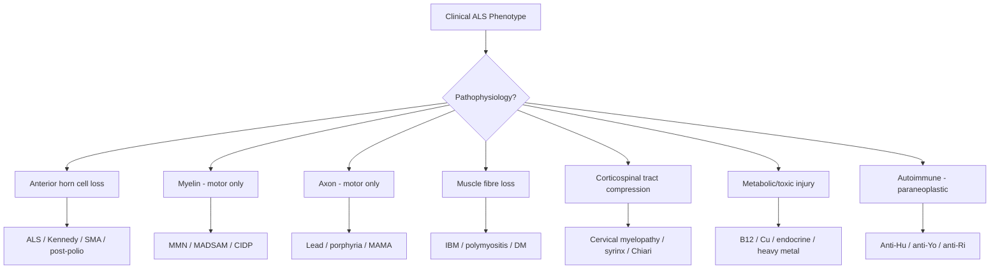
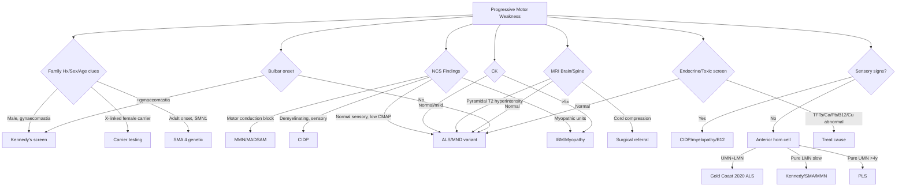
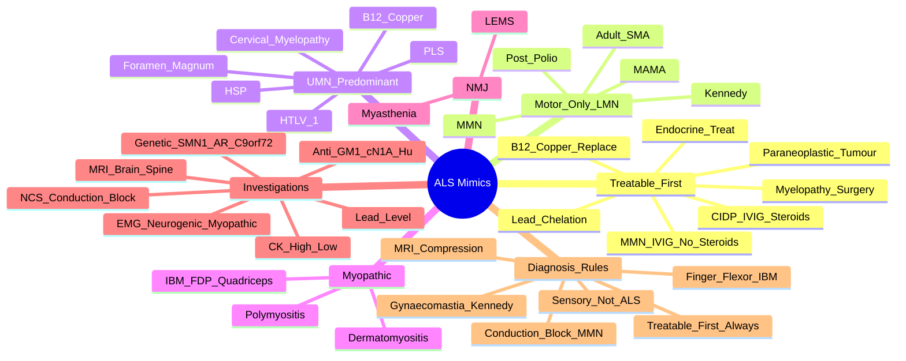

# ALS Mimics & Differential Diagnosis

> [!tip] **High-Yield Definition**
> **ALS mimics** are conditions that phenocopy the motor neuron syndrome (progressive UMN/LMN weakness) but have a **different aetiology, treatment and prognosis**. They MUST be excluded before diagnosing ALS.
> **5-10% of "suspected ALS" turn out to be a mimic** — most commonly: **MMN, CIDP, IBM, cervical myelopathy, Kennedy disease, paraneoplastic motor neuronopathy**.
> Crucially, **MMN and CIDP are TREATABLE** — missing the diagnosis is a major clinical error.

---

## 1. Definition / Epidemiology / Classification

### Definition
A heterogeneous group of neurological disorders that present with progressive motor weakness, fasciculations, wasting, or spasticity, closely mimicking the **Gold Coast 2020 ALS phenotype**, but caused by alternative pathophysiological mechanisms — demyelination, axonal degeneration, myopathy, structural cord/brain disease, endocrinopathy, toxicity, or paraneoplastic autoimmunity. Some are fully reversible; most are treatable to some degree.

### Epidemiology
- **Prevalence of mimics:** 5-10% of cases referred to tertiary MND clinics
- **Mean diagnostic delay** for mimics: 12-18 months (similar to ALS)
- **Most common mimics** (in order of frequency in the literature):
  1. **Multifocal Motor Neuropathy (MMN)** — 1-2/100,000; the most important treatable mimic
  2. **Cervical Spondylotic Myelopathy (CSM)** — extremely common in older adults
  3. **Kennedy Disease (SBMA)** — under-recognised in males
  4. **Chronic Inflammatory Demyelinating Polyneuropathy (CIDP)** — variants
  5. **Inclusion Body Myositis (IBM)** — commonest acquired myopathy >50y
  6. **Adult-onset SMA (SMA type IV)** — 1/100,000
  7. **Paraneoplastic motor neuronopathy** — anti-Hu, anti-Yo, anti-Ri
  8. **Lead, mercury, arsenic toxicity**
  9. **Endocrine:** hyperthyroidism, hyperparathyroidism, Addison's
  10. **Structural:** foramen magnum lesions, syringomyelia, Chiari

### Classification — by Pathophysiology
| Pathophysiology | Examples | Treatable? |
|-----------------|----------|------------|
| **Demyelinating neuropathy** | MMN, MADSAM, CIDP | YES — IVIG, steroids, PLEX |
| **Axonal motor neuropathy** | MAMA, lead, porphyria | Variable |
| **Myopathy** | IBM, polymyositis, distal myopathies | Limited |
| **Anterior horn cell (non-ALS)** | Kennedy, adult SMA, post-polio, West Nile | Supportive |
| **UMN-only** | PLS, HSP, primary progressive MS, B12/copper deficiency | Variable |
| **Structural** | Cervical myelopathy, foramen magnum tumour, syrinx | YES (surgical) |
| **Endocrine/metabolic** | Hyperthyroid, hyperparathyroid, B12, copper | YES |
| **Toxic** | Lead, mercury, organophosphates, L-tryptophan | Yes (chelation) |
| **Paraneoplastic** | Anti-Hu (small cell lung Ca), anti-Yo (breast/ovarian), anti-Ri, anti-CV2/CRMP5 | Treat tumour |
| **Infectious/post-infectious** | HTLV-1 (tropical spastic paraparesis), HIV, neuroborreliosis, poliomyelitis | Antimicrobials |
| **NMJ** | Myasthenia, LEMS | YES |

---

## 2. Aetiology / Pathophysiology

### Demyelinating Mimics
- **Multifocal Motor Neuropathy (MMN):** Autoimmune attack on peripheral motor nerve myelin (paranodal region). IgM **anti-GM1** antibodies in 30-50%. Persistent **motor conduction block** outside entrapment sites. NO sensory involvement. Asymmetric, predominantly distal upper limb onset.
- **CIDP / MADSAM (Lewis-Sumner):** Multifocal acquired demyelinating sensory AND motor neuropathy. Sensory symptoms present (key!). CSF protein elevated. Demyelinating features on NCS (prolonged distal latencies, slowed CV, prolonged F-waves, conduction block, temporal dispersion).

### Axonal Mimics
- **Multifocal Acquired Motor Axonalopathy (MAMA):** Motor axonal, NO conduction block, anti-GM1 may be positive. Treatment-resistant.
- **Lead toxicity:** Demyelination/axonal loss of motor nerves. Wrist/foot drop. Microcytic anaemia with **basophilic stippling**. Lead level >50 µg/dL.
- **Porphyria (AIP):** Motor predominant axonal neuropathy, recurrent episodes, abdominal pain, psychiatric features, hyponatraemia.

### Myopathic Mimics
- **Inclusion Body Myositis (IBM):** Sporadic, >50y, slowly progressive, asymmetric **finger flexor (esp. FDP) and quadriceps** weakness. Dysphagia common. **Rimmed vacuoles** on biopsy with **inflammation** (CD8+ T cells). **Anti-cN1A (NT5C1A)** antibodies in 30-70%. CK mildly-moderately elevated. **Steroid-resistant**.
- **Polymyositis / Dermatomyositis:** Proximal symmetric, ↑↑CK, autoimmune, skin features in DM.

### Anterior Horn Cell (non-ALS)
- **Kennedy Disease (SBMA):** X-linked; CAG trinucleotide repeat in **androgen receptor (AR)** gene on Xq11-12; toxic gain-of-function. Onset 20-50y. Bulbar + LMN, **gynaecomastia**, **perioral fasciculations**, postural tremor. Slowly progressive (10-20y).
- **Adult SMA (Type IV):** AR, **SMN1** gene (5q13) deletion. Proximal symmetric, fasciculations, no UMN. Onset >21y.
- **Post-polio syndrome:** Decades after polio, new weakness, fatigue in previously affected muscles.

### Structural Mimics
- **Cervical myelopathy:** Cord compression → UMN below + LMN at level; **sensory level**, bladder symptoms, Lhermitte's. MRI is diagnostic.
- **Foramen magnum lesions** (meningioma, Chiari): UMN signs in all 4 limbs, posterior column signs, lower CN involvement. Often missed.
- **Syringomyelia:** Cape-distribution dissociated sensory loss + LMN at level (cervical).

### Endocrine / Metabolic
- **Hyperthyroidism:** Proximal myopathy, fasciculations occasionally, weight loss, tremor, tachycardia. Check TFTs.
- **Hyperparathyroidism:** Proximal weakness, fatigue, hyperreflexia, hypercalcaemia.
- **B12 deficiency:** Combined UMN + sensory neuropathy, subacute combined degeneration.
- **Copper deficiency:** Mimics B12 deficiency; myeloneuropathy; check after bariatric surgery.
- **Vitamin D deficiency:** Proximal myopathy.

### Toxic
- **Lead:** Wrist/foot drop, abdominal pain, anaemia, basophilic stippling. Occupational exposure (battery, smelting, paint).
- **Mercury, arsenic, thallium, organophosphates.**
- **Drug-induced:** Statins (myopathy), vincristine (axonal neuropathy), nitrofurantoin, isoniazid.

### Paraneoplastic
- **Anti-Hu (ANNA-1):** Small cell lung cancer, sensorimotor neuronopathy, encephalomyelitis.
- **Anti-Yo (PCA-1):** Breast/ovarian, cerebellar > motor.
- **Anti-Ri (ANNA-2):** Breast, SCLC; opsoclonus-myoclonus.
- **Anti-CV2/CRMP5:** Mixed; optic neuritis, chorea, sensorimotor neuropathy.
- **Anti-VGCC:** Lambert-Eaton (proximal weakness, autonomic, ↑with activity).

### Infectious
- **HTLV-1 associated myelopathy/tropical spastic paraparesis (HAM/TSP):** Chronic progressive spastic paraparesis, bladder, tropical.
- **HIV:** Distal symmetric neuropathy, rarely motor neuron syndrome.
- **Neuroborreliosis (Lyme):** Multifocal radiculopathy, facial palsy.
- **Neurosyphilis:** Tabes dorsalis, Argyll Robertson pupils.
- **West Nile, Japanese encephalitis, enterovirus D68:** Poliomyelitis-like.

### Pathophysiology — Common Mechanisms

### Pathology (where biopsy done)
- **IBM:** Rimmed vacuoles, eosinophilic inclusions, **CD8+ T-cell** infiltrates, MHC-I upregulation
- **Polymyositis:** Endomysial CD8+ T cells
- **Kennedy:** Loss of lower motor neurons, **intranuclear inclusions** containing mutant AR
- **MMN:** Demyelination with onion-bulb formation on nerve biopsy

---

## 3. Clinical Features

### Red Flag Clues that SUGGEST a MIMIC rather than ALS
| Clue | Consider |
|------|----------|
| **Sensory symptoms/signs** | CIDP, MADSAM, cervical myelopathy, B12, porphyria |
| **Pure LMN, no UMN, slow progression** | MMN, MAMA, Kennedy, adult SMA, post-polio |
| **Marked asymmetry persisting** | MMN, IBM, lead, MADSAM |
| **Conduction block on NCS** | MMN, CIDP, MADSAM |
| **Marked ↑ CK (>5x normal)** | IBM, polymyositis, rhabdomyolysis |
| **Improvement with treatment** | MMN (IVIG), CIDP (steroid/IVIG), endocrine |
| **Pain prominent** | Radiculopathy, CIDP, inflammatory, lead, porphyria |
| **Family history X-linked** | Kennedy (maternal uncles) |
| **Onset <40y with slow progression** | Kennedy, SMA, MMN |
| **Ocular/facial weakness** | Myasthenia, IBM, mitochondrial |
| **Marked weight loss early** | Endocrine, paraneoplastic, lead |
| **Multifocal weakness in nerve territory** | MMN, MADSAM, mononeuritis multiplex |
| **Bladder/bowel involvement** | Cord compression, MS, B12 |
| **CSF protein >1 g/L** | CIDP |
| **Cranial nerve lower involvement** | Foramen magnum, Chiari |
| **Reversibility** | Treatable cause (MMN, myasthenia, endocrine) |

### Specific Clinical Features by Mimic

**MMN:**
- Asymmetric, predominantly DISTAL upper limb weakness (wrist drop, hand clumsiness)
- **NO wasting early** (key — distinguishes from ALS)
- **NO UMN signs**
- **NO sensory symptoms**
- Cramps common
- Reflexes often PRESERVED in weak muscles (paradoxical — characteristic)
- Slow progression over years
- Anti-GM1 positive in 30-50%
- NCS: motor conduction block OUTSIDE entrapment sites (forearm, arm, leg)

**IBM:**
- Age >50, slow progression
- Asymmetric **finger flexor (FDP)** weakness → difficulty with grip, key turn
- **Quadriceps** weakness → falls, buckling
- Dysphagia (50%)
- **CK moderately elevated** (2-10x)
- **Anti-cN1A** in 30-70%
- Muscle biopsy diagnostic (rimmed vacuoles, inclusion bodies, inflammation)

**Cervical Myelopathy:**
- Neck pain, radiculopathy
- UMN signs in legs (spastic gait)
- LMN signs at level (wasted hand intrinsic)
- **Sensory level** on trunk
- Lhermitte's sign
- Bladder dysfunction (urgency, retention)
- MRI: cord compression, signal change

**Kennedy Disease:**
- Adult MALE only (X-linked)
- **Bulbar onset** (dysarthria, dysphagia)
- **Gynaecomastia** (key)
- **Perioral/periorbital fasciculations**
- Postural tremor of hands
- Symmetric proximal weakness
- Absent reflexes
- **CAG repeat expansion in androgen receptor (Xq11-12)**; normal 5-34, disease >38
- Slight ↑ CK
- Sural nerve sensory action potentials REDUCED (subclinical sensory)
- Slow progression (10-20y)

**Adult SMA (Type IV):**
- Proximal symmetric weakness, lower limbs first
- Fasciculations, no UMN
- Onset >21y
- **SMN1 homozygous deletion** (also SMN2 copy number affects severity)

**CIDP/MADSAM:**
- Symmetric (typical) or asymmetric (MADSAM) weakness
- **Sensory symptoms** (numbness, paraesthesia) — KEY
- Hyporeflexia/areflexia
- CSF protein elevated (>0.45 g/L)
- NCS: demyelinating features

---

## 4. Diagnostic Approach / Algorithm

### Stepwise Approach to Suspected MND

### Diagnostic Criteria — Key Mimics

**MMN (EFNS/PNS 2010):**
1. Slowly progressive, asymmetric, predominantly distal limb weakness (motor)
2. NO objective sensory abnormalities (except vibration sense in older patients)
3. **Motor conduction block** in ≥1 motor nerve outside entrapment sites
4. Normal sensory NCS in all nerves tested
5. Anti-GM1 in 30-50% (supportive)

**IBM (European Neuromuscular Centre 2011):**
- **Clinical:** >6 months, onset >40y, finger flexor or quadriceps weakness
- **Pathology:** Rimmed vacuoles + protein aggregates OR inflammation + upregulation of MHC-I
- **Definite:** all 3 (clinical + vacuoles + inflammation)
- **Probable:** clinical + vacuoles
- **Possible:** clinical + inflammation only

**Kennedy Disease (SBMA):**
- Adult male
- LMN signs + bulbar
- **Gynaecomastia**
- **CAG repeat expansion in AR gene (>38)**

**Adult SMA (Type IV):**
- Onset >21y
- Proximal symmetric weakness
- **SMN1 deletion/mutation**
- EMG: chronic neurogenic

---

## 5. Investigations

### First-Line — ALWAYS order in suspected MND
| Test | Rationale | Expected Finding |
|------|-----------|------------------|
| **Nerve Conduction Studies (NCS)** | Exclude demyelinating (MMN, CIDP), sensory neuropathy | Sensory normal in ALS, MMN. **Conduction block** in MMN. Demyelinating features in CIDP |
| **EMG (needle)** | Confirm widespread chronic neurogenic; differentiate from myopathy | Chronic neurogenic: fibrillation, fasciculations, large polyphasic units, reduced recruitment. **Myopathic** in IBM |
| **MRI brain + whole spine** | Exclude structural (cord, brainstem, foramen magnum) | May show CST hyperintensity in ALS; structural lesion = mimic |
| **CK** | Differentiate myopathy from neuropathy | Modest ↑ (<5x) in ALS, Kennedy; **markedly ↑** in IBM, PM |
| **FBC, U&E, LFT, Ca, Mg, PO4, TFTs, PTH, B12, folate, copper** | Exclude metabolic | Treatable if abnormal |
| **ESR/CRP, autoimmune (ANA, ENA, ANCA)** | Vasculitis mimics | Vasculitic neuropathy |
| **SPEP/immunofixation, urine BJP** | Paraproteinemic neuropathy | MGUS, myeloma |
| **Anti-GM1, anti-MAG, anti-GQ1b, anti-sulfatide** | Demyelinating mimics | MMN, anti-MAG neuropathy |
| **Anti-Hu, Yo, Ri, CV2/CRMP5, amphiphysin, NMDAR, VGCC** | Paraneoplastic | Identify tumour |
| **HIV, syphilis, Lyme, HTLV-1** | Infectious mimics | Treat infection |
| **Blood lead, urine heavy metals** | Toxicology | Lead >50 µg/dL |

### Second-Line / Targeted
| Test | Indication |
|------|------------|
| **CSF** (cells, protein, glucose, OCB) | If inflammatory suspected; **protein >1 g/L suggests CIDP** |
| **Genetic testing** | Family history, young onset, sex-specific — **C9orf72, SOD1, FUS, TARDBP, SMN1, AR (CAG), SPG4** |
| **Muscle biopsy** | Suspected IBM or inflammatory myopathy |
| **Nerve biopsy** | Suspected vasculitis, sarcoidosis, CIDP atypical |
| **Whole-body PET-CT** | Suspected paraneoplastic (no tumour on conventional imaging) |
| **Spirometry (FVC, SNIP)** | Baseline respiratory assessment (ALS) |
| **Anti-cN1A (NT5C1A)** | IBM supportive |
| **Anti-NfL (serum/CSF)** | Prognostic — ↑ in ALS, mimics; helps differentiate IBM from ALS |

### Key Biomarkers & Tests
- **Neurofilament light chain (NfL):** ↑ in ALS, MMN (less), IBM (modest). Discriminates IBM from ALS in some studies.
- **Anti-GM1:** Present in 30-50% MMN; rare in ALS (<5%). IgM subclass.
- **Anti-cN1A:** 30-70% IBM. Highly specific.
- **Anti-Hu (ANNA-1):** Small cell lung cancer + neuronopathy.
- **Lead level:** EDTA whole blood; >50 µg/dL (children) or >70 µg/dL (adults) requires intervention.
- **CAG repeat in AR:** >38 repeats diagnostic of Kennedy.

---

## 6. Differential Diagnosis — Comprehensive Table

| Differential | Distinguishing Features | Key Test |
|--------------|------------------------|----------|
| **MMN** | Pure motor, distal asymmetric, NO UMN, NO sensory, reflexes preserved in weak muscles, anti-GM1+ | **Motor conduction block on NCS**; IVIG-responsive |
| **MADSAM (Lewis-Sumner)** | Asymmetric CIDP variant, sensory + motor | Demyelinating NCS, CSF protein ↑ |
| **CIDP** | Symmetric sensorymotor, hyporeflexia, ± painful | CSF protein >0.45 g/L, demyelinating NCS |
| **Cervical Myelopathy** | UMN legs + LMN arms, sensory level, bladder, Lhermitte's | **MRI cord compression** |
| **Kennedy Disease (SBMA)** | X-linked male, bulbar, **gynaecomastia**, perioral fasciculations, slow | **CAG repeat in AR gene** |
| **Adult SMA (Type IV)** | Proximal symmetric, no UMN, no bulbar (early), adult onset | **SMN1 deletion** |
| **IBM** | >50y, asymmetric FDP + quadriceps, dysphagia, slow | **Anti-cN1A**, muscle biopsy: rimmed vacuoles |
| **Polymyositis** | Proximal symmetric, ↑↑CK, autoimmune | CK, EMG myopathic, biopsy |
| **Dermatomyositis** | Proximal + skin (heliotrope, Gottron) | Anti-Mi-2, ANA, biopsy |
| **Post-polio syndrome** | History of polio, fatigue + new weakness | History, EMG chronic denervation |
| **Paraneoplastic motor neuronopathy** | Cancer (SCLC, breast), rapid progression, sensory often | Anti-Hu/Yo/Ri; PET-CT |
| **Lead toxicity** | Wrist/foot drop, anaemia, basophilic stippling, occupational | **Blood lead level** |
| **Mercury toxicity** | Tremor, ataxia, personality change | Urine mercury |
| **Hyperthyroidism** | Proximal weakness, tremor, tachycardia, weight loss | **TFTs (low TSH, high T4)** |
| **Hyperparathyroidism** | Weakness, fatigue, hypercalcaemia | **Ca, PTH** |
| **B12 deficiency** | Subacute combined degeneration, sensory, megaloblastic | **B12, MMA, homocysteine** |
| **Copper deficiency** | Myeloneuropathy, mimics B12 | **Serum copper, caeruloplasmin** |
| **Myasthenia Gravis** | Fatigable, ocular, fluctuating | Anti-AChR, anti-MuSK, SFEMG |
| **LEMS** | Proximal, ↑with activity, autonomic, SCLC | **Anti-VGCC**; CMAP ↑ on exercise |
| **HTLV-1 myelopathy (HAM/TSP)** | Spastic paraparesis, bladder, tropical, serology | **HTLV-1 antibodies** |
| **HIV neuropathy** | Distal symmetric, sensory predominant | HIV serology |
| **Foramen magnum lesion** | UMN in 4 limbs, sensory, CN lower | MRI craniocervical junction |
| **Syringomyelia** | Cape sensory loss + LMN at level | MRI spine |
| **Chiari malformation** | Down-beat nystagmus, occipital headache, long-tract signs | MRI |
| **Primary Lateral Sclerosis (PLS)** | Pure UMN, **>4 years without LMN** | Diagnosis of exclusion |
| **Progressive Muscular Atrophy (PMA)** | Pure LMN, evolving to ALS | Often reclassified over time |
| **HSP (Hereditary Spastic Paraparesis)** | Family history, slowly progressive, spastic gait | Genetic (SPG4 most common) |
| **West Nile / enterovirus D68** | Acute flaccid paralysis, fever, epidemic | Serology/PCR |
| **Lyme disease** | Multifocal radiculopathy, facial palsy, tick bite | Borrelia serology |
| **Radiation myelopathy** | History of radiation, latent period | MRI, history |

---

## 7. Management

### Treatable Mimics — Specific Therapies
| Mimic | First-line | Second-line | Notes |
|-------|-----------|-------------|-------|
| **MMN** | **IVIG 2 g/kg over 2-5 days, then 1 g/kg every 2-4 weeks** | Cyclophosphamide, rituximab | **AVOID steroids (worsen!)** |
| **MADSAM** | IVIG | Steroids, PLEX | Similar to CIDP |
| **CIDP** | IVIG 2 g/kg | Steroids (1 mg/kg/d), PLEX | PLEX equally effective acutely |
| **Cervical myelopathy** | **Surgical decompression** (laminectomy, discectomy, corpectomy) | Conservative if mild (mJOA >15) | Time-critical before cord damage |
| **IBM** | No proven treatment (IVIG trial may help dysphagia) | Supportive | **Steroids ineffective**; trials ongoing (sirolimus, arimoclomol, follistatin) |
| **Kennedy** | No specific therapy | Supportive, anti-androgen trial | Avoid anabolic steroids |
| **Adult SMA (Type IV)** | **Nusinersen** (intrathecal) | Risdiplam, gene therapy (onasemnogene) | New disease-modifying therapies |
| **Polymyositis** | Steroids 1 mg/kg | Azathioprine, methotrexate, IVIG | Bulous disease |
| **Dermatomyositis** | Steroids | IVIG (esp. with dysphagia), immunosuppression | Screen for cancer |
| **Lead toxicity** | **Chelation:** EDTA, DMSA, dimercaprol | Remove source | Occupational hygiene |
| **Hyperthyroidism** | Antithyroid drugs (carbimazole, PTU) | Radioiodine, surgery | Treat the cause |
| **Hyperparathyroidism** | **Parathyroidectomy** | Cinacalcet | Adenoma most common |
| **B12 deficiency** | **Hydroxocobalamin 1 mg IM alternate days × 1-2 weeks, then 3-monthly** | Oral if dietary | Monitor potassium |
| **Copper deficiency** | Copper supplementation 2 mg/d PO | IV if symptomatic | Monitor zinc excess |
| **Paraneoplastic** | **Treat tumour** (chemo, surgery, XRT) | IVIG, PLEX, rituximab | Often stabilises |
| **HTLV-1 (HAM/TSP)** | Interferon-α | Corticosteroids, plasmapheresis | Limited efficacy |
| **Myasthenia Gravis** | Pyridostigmine, steroids, immunosuppression, thymectomy | Eculizumab, ravulizumab | Treat crises with IVIG/PLEX |
| **LEMS** | 3,4-diaminopyridine, treat SCLC | IVIG, immunosuppression | Improves with exercise |

### Symptomatic / Supportive (for all mimics)
- **Physiotherapy** — preserve function, prevent contracture
- **Occupational therapy** — equipment, ADL
- **Speech & language** — if bulbar involvement (IBM, Kennedy)
- **Respiratory monitoring** — FVC/SNIP (esp. Kennedy, MND variants)
- **Nutritional support** — dietitian, consider PEG if progressive
- **Psychology / counselling** — chronic disease
- **Palliative / hospice** — when disease progressive

### Avoid in MMN: **STEROIDS and PLASMAPHERESIS** — may worsen MMN.
### Don't start Riluzole / Edaravone unless true ALS confirmed.

### Multidisciplinary
Neurology + relevant specialist (rheumatology for IBM, endocrinology for endocrine, oncology for paraneoplastic) + MND nurse + PT/OT/SALT + dietitian + psychology + palliative.

### Reassess diagnosis
- If atypical course (improvement, sensory progression, atypical regions)
- Repeat EMG/NCS at 6-12 months
- Consider muscle/nerve biopsy
- Genetic panel update

---

## 8. Drug Interactions / Contraindications

| Drug | Caution in Mimic | Management |
|------|------------------|------------|
| **Steroids** | **Worsen MMN**; may help CIDP/PM/DM | Avoid in MMN |
| **IVIG** | Aseptic meningitis, renal failure (sucrose), thrombosis | Hydration, slow infusion |
| **Cyclophosphamide** | Haemorrhagic cystitis, myelosuppression | Hydration, MESNA |
| **Rituximab** | Hepatitis B reactivation, PML | Screen HBsAg, anti-HBc |
| **Chelators (DMSA, EDTA)** | Renal, chelate essential metals | Monitor renal, zinc, copper |
| **Pyridostigmine** | Cholinergic side effects, bradycardia | Dose titration |
| **Eculizumab** | Meningococcal sepsis | Vaccinate (ACWY, B), monitor |
| **Nusinersen** | Thrombocytopenia, post-LP headache | Monitor platelets |
| **Risdiplam** | Avoid in pregnancy | Contraception |

---

## 9. Procedures

### Nerve Conduction Studies (NCS) & EMG
- **Indication:** Every suspected MND case
- **Method:** Surface electrodes for motor/sensory NCS; concentric needle EMG of multiple muscles (≥3 regions)
- **Findings in MMN:** Motor conduction block ≥50% reduction in CMAP amplitude/area across non-entrapment site
- **Findings in CIDP:** Demyelinating features — prolonged distal motor latency, slowed conduction velocity (<70% of LLN), prolonged F-wave, conduction block, temporal dispersion
- **Findings in IBM:** Myopathic units — short duration, small amplitude, polyphasic, early recruitment
- **Complications:** Bruising, very rarely infection at needle site
- **Viva pearls:** "Conduction block outside entrapment = MMN until proven otherwise"

### Lumbar Puncture
- **Indication:** Suspected CIDP, paraneoplastic, MS mimic
- **Findings:** ↑ Protein in CIDP (>0.45, often >1 g/L); OCB in MS; anti-NMDA-R in CSF; pleocytosis in inflammatory

### Muscle Biopsy
- **Indication:** Suspected IBM, inflammatory myopathy
- **Findings in IBM:** Rimmed vacuoles (modified Gomori trichrome), congophilic inclusions, CD8+ T-cell infiltrates, MHC-I upregulation, TDP-43 inclusions in some

### Nerve Biopsy
- **Indication:** Suspected vasculitic neuropathy, sarcoidosis, atypical CIDP
- **Findings:** Vasculitis, granulomas, demyelination with onion bulbs

---

## 10. Complications

| Complication | Frequency | Monitoring | Management |
|--------------|-----------|------------|------------|
| **Missed treatable diagnosis** | 5-10% mimics | Reassess atypical course | Repeat NCS/EMG, biopsy, MDT review |
| **Inappropriate ALS treatment** | Common | Don't start riluzole/edaravone | Confirm Gold Coast criteria |
| **Adverse effects of treatment** | Common | LFTs on riluzole, TFTs on methimazole | Dose adjust |
| **Disease progression despite Rx** | Variable | Clinical, respiratory FVC | Add/escalate, palliative |
| **Psychological morbidity** | High | PHQ-9, GAD-7 | SSRIs, counselling |
| **Contractures** | Slow progression | ROM, splints | Physio, splints |
| **Respiratory failure (late)** | ALS, IBM, Kennedy late | FVC, SNIP | NIV, cough assist |
| **Pressure ulcers** | If immobile | Skin checks, repositioning | Equipment |

---

## 11. Red Flags / Emergencies

| Red Flag | Action | Time Window |
|----------|--------|-------------|
| **Rapidly progressive weakness + sensory + cancer** | Paraneoplastic workup, treat tumour | Days |
| **Sensory level + UMN** | MRI spine urgently (cord compression) | Hours |
| **Bulbar + respiratory** | FVC, NIV consideration | Hours-days |
| **Hypercalcaemia + weakness** | PTH, hydration, bisphosphonate | Hours |
| **Lead level >70 µg/dL** | Chelation, remove source | Days |
| **Confusion + abdominal pain + neuropathy** | Porphyria screen (urine PBG) | Days |
| **Worsening on steroids (MMN)** | STOP steroids, start IVIG | Days |
| **Anaphylaxis to IVIG** | Stop, supportive, switch brand | Immediate |
| **PML on rituximab** | Stop drug, MRI, CSF JCV | Days |
| **Respiratory failure (FVC <30%)** | NIV, ICU referral | Hours |
| **Inappropriate riluzole for mimic** | Stop drug | At diagnosis |

---

## 12. Prognosis

| Disease | Median Survival / Outcome |
|---------|--------------------------|
| **ALS** | 2-5 years; bulbar worst |
| **MMN** | Normal life expectancy with IVIG; stable or improved |
| **CIDP** | Variable; 80% respond to IVIG/steroids; chronic course |
| **Cervical myelopathy** | Good with timely surgery; recovery depends on severity |
| **Kennedy** | 10-20 years; slow; normal life expectancy (often) |
| **Adult SMA Type IV** | Stable or slow progression; normal life expectancy |
| **IBM** | 5-10 years post-diagnosis; wheelchair-bound ~10y; dysphagia late |
| **IBM with dysphagia** | Aspiration pneumonia risk |
| **Polymyositis / DM** | Good with treatment; 5-year survival 80%+ |
| **Lead toxicity** | Reversible with chelation if early |
| **Endocrine mimics** | Reversible with correction |
| **B12 deficiency** | Neurological recovery if treated <6 months |
| **Paraneoplastic** | Often limited by tumour prognosis |
| **HTLV-1 (HAM/TSP)** | Slow progression; disability accumulates |

**Critical message: getting the diagnosis right avoids unnecessary morbidity, inappropriate treatment, and allows disease-specific therapy where available.**

---

## 13. Topic Correlation

| Related Topic | Link | Key Overlap |
|---------------|------|-------------|
| **ALS** | [[Amyotrophic Lateral Sclerosis]] | MMN is the most important mimic |
| **MMN** | [[Multifocal Motor Neuropathy]] | Treatable mimic |
| **Kennedy Disease** | [[Kennedys Disease]] | Bulbar LMN with gynaecomastia |
| **IBM** | [[Inclusion Body Myositis]] | Finger flexor + quadriceps |
| **CIDP** | [[CIDP]] | Sensory + motor, demyelinating |
| **Cervical Myelopathy** | [[Cervical Myelopathy]] | UMN + LMN + sensory level |
| **PLS** | [[Primary Lateral Sclerosis]] | Pure UMN >4y |
| **PMA** | [[Progressive Muscular Atrophy]] | Pure LMN, evolving |
| **Myasthenia Gravis** | [[Myasthenia Gravis]] | Fatigable, ocular |
| **LEMS** | [[LEMS]] | Proximal, autonomic, SCLC |
| **HSP** | [[Hereditary Spastic Paraparesis]] | Spastic paraparesis, family Hx |

---

## 14. Special Situations

| Situation | Consideration |
|-----------|---------------|
| **Pregnancy** | IVIG safe; AVOID cyclophosphamide, methotrexate, leflunomide; chelation risk to fetus; riluzole teratogenic; consider delaying non-urgent surgery |
| **Lactation** | Most immunosuppressants contraindicated; IVIG safe |
| **Paediatric** | Consider SMA (type I-III), Duchenne, Becker's; C9orf72 very rare |
| **Elderly / Frail** | Cervical myelopathy more common; IBM >50y; consider comorbidities; conservative Rx |
| **Renal impairment** | Avoid IVIG with sucrose (renal failure); use glycine |
| **Hepatic impairment** | Riluzole requires LFT monitoring; avoid in severe liver disease |
| **Immunocompromised** | HIV, post-transplant; opportunistic infections (CMV, PML); consider lymphoma |
| **Perioperative** | Regional anaesthesia often safer in ALS (NMJ sensitivity); suxamethonium caution in MND |
| **Driving / DVLA** | Notify DVLA for MND; symptomatic UMN weakness requires assessment |
| **Occupational** | Lead exposure (battery, smelting, paint) — chelation + remove from source |

---

## FCPS/MRCP High-Yield Summary

| Category | Key Points |
|----------|------------|
| **Definition** | ALS mimics: conditions that mimic motor neuron syndrome; 5-10% of suspected ALS |
| **Most important treatable mimics** | **MMN (IVIG), CIDP (IVIG/steroids), myasthenia (AChEi/immunosuppression), cervical myelopathy (surgery), endocrine (treat cause), B12 (replace)** |
| **MMN key features** | Pure motor, asymmetric distal, NO UMN, NO sensory, anti-GM1+, **conduction block**, IVIG-responsive |
| **Kennedy key features** | X-linked male, bulbar + LMN, **gynaecomastia**, **CAG repeat in AR**, slow |
| **IBM key features** | >50y, asymmetric **FDP + quadriceps**, **anti-cN1A**, **rimmed vacuoles**, steroid-resistant |
| **Cervical myelopathy key features** | UMN + sensory level + Lhermitte's + bladder; MRI diagnostic |
| **Investigations to do for ALL** | NCS, EMG, MRI brain + spine, CK, autoimmune, anti-GM1, anti-Hu, B12, TFTs, Ca |
| **Anti-GM1** | Present in MMN (30-50%); rare in ALS |
| **Anti-cN1A** | IBM (30-70%) |
| **Anti-Hu** | Paraneoplastic motor/sensory neuronopathy (SCLC) |
| **Steroid caution** | Worsen MMN; use in CIDP/PM/DM |
| **Don't start riluzole** | Until mimics excluded |
| **MMN treatment** | IVIG 2 g/kg loading, then 1 g/kg every 2-4 weeks |
| **Kennedy treatment** | Supportive only; trials of anti-androgens |
| **IBM treatment** | No proven therapy; IVIG trial for dysphagia |
| **C9orf72** | Most common familial ALS gene; also FTD |

---

## Viva Questions

1. **Q: Define ALS mimics and give 5 examples.**
   A: Conditions that phenocopy ALS but have different aetiology/treatment. Examples: MMN, CIDP, IBM, cervical myelopathy, Kennedy disease. (Plus: lead toxicity, hyperthyroidism, adult SMA, paraneoplastic, B12 deficiency, syringomyelia.)

2. **Q: Why is missing MMN such a clinical error?**
   A: MMN is a treatable mimic; patients wrongly diagnosed as ALS miss out on IVIG, which can stabilise or improve weakness. Steroids can worsen MMN.

3. **Q: How do you distinguish MMN from ALS clinically?**
   A: MMN is pure LMN (no UMN), NO sensory symptoms, NO bulbar involvement, slow progression, reflexes often preserved in weak muscles. ALS has UMN+LMN and bulbar signs.

4. **Q: What is the key NCS finding in MMN?**
   A: **Motor conduction block outside entrapment sites** (e.g., across the forearm, not the wrist). Anti-GM1 antibodies in 30-50%.

5. **Q: How do you distinguish Kennedy from ALS?**
   A: Kennedy is X-linked, onset 20-50y, has **gynaecomastia**, **perioral fasciculations**, **CAG repeat in AR**, slower progression, subclinical sensory loss on NCS.

6. **Q: What is the classic clinical picture of IBM?**
   A: Age >50, slow progression, asymmetric **finger flexor (FDP)** and **quadriceps** weakness, dysphagia, **anti-cN1A** antibodies, **rimmed vacuoles** on biopsy. Steroid-resistant.

7. **Q: Name 3 endocrine mimics of ALS.**
   A: Hyperthyroidism (proximal myopathy, fasciculations), hyperparathyroidism (hypercalcaemia, weakness), Addison's (fatigue, hyperpigmentation), hyperaldosteronism (Conn's — weakness with hypokalaemia).

8. **Q: What is the role of anti-Hu antibodies?**
   A: Anti-Hu (ANNA-1) is a paraneoplastic antibody, often associated with small cell lung cancer; causes sensorymotor neuronopathy and encephalomyelitis.

9. **Q: How do you differentiate cervical myelopathy from ALS?**
   A: Cervical myelopathy has a **sensory level**, **bladder/bowel symptoms**, **Lhermitte's sign**, and **MRI shows cord compression**. ALS has no sensory or bladder symptoms.

10. **Q: What happens if you give steroids to a patient with MMN?**
    A: **Worsens** the condition. Steroids are contraindicated in MMN — they may unmask/destabilise immune attack on motor nerves.

11. **Q: Why is it important to test C9orf72?**
    A: C9orf72 hexanucleotide repeat is the most common cause of familial ALS (~40%) and ~7% sporadic ALS; also associated with FTD. Has implications for genetic counselling.

12. **Q: What is the role of muscle biopsy in suspected ALS?**
    A: To differentiate ALS from IBM (rimmed vacuoles) and inflammatory myopathies (PM/DM). ALS shows only neurogenic atrophy on biopsy (grouped atrophy, fibre type grouping).

---

## Common Confusions

| Confusion | Clarification |
|-----------|---------------|
| **MMN vs ALS** | MMN: pure LMN, conduction block, anti-GM1+, IVIG-responsive, no UMN. ALS: UMN+LMN |
| **MMN vs CIDP** | MMN: pure motor, no sensory, anti-GM1+; CIDP: sensorimotor, demyelinating, CSF protein ↑ |
| **IBM vs polymyositis** | IBM: distal (FDP/quadriceps), asymmetric, older, **steroid-resistant**, rimmed vacuoles; PM: proximal, symmetric, ↑CK, responds to steroids |
| **Kennedy vs ALS** | Kennedy: X-linked male, gynaecomastia, CAG repeat, slow, perioral fasciculations, subclinical sensory on NCS |
| **PLS vs spastic HSP** | PLS: adult onset, no family history, evolves; HSP: family history, often earlier onset, slowly progressive |
| **PMA vs MMN** | PMA: progressive LMN, no conduction block, anti-GM1 negative; MMN: conduction block, IVIG-responsive |
| **Cervical myelopathy vs ALS** | Myelopathy: sensory level, bladder, MRI compression; ALS: no sensory/bladder, MRI normal cord |
| **CIDP vs diabetic polyneuropathy** | CIDP: demyelinating, CSF protein ↑, response to IVIG; diabetic: chronic, axonal, length-dependent, sensory predominant |
| **B12 deficiency vs ALS** | B12: sensory, dorsal column loss, megaloblastic, MMA/homocysteine ↑; ALS: motor only |
| **Lead vs MMN** | Lead: wrist drop, anaemia, basophilic stippling, blood lead ↑; MMN: no anaemia, conduction block |
| **Anti-GM1 in MMN vs GBS** | MMN: IgM, motor, persistent, focal; GBS: IgG, acute, demyelinating, motor + sensory |
| **Steroid trial in IBM** | Often tried empirically but does NOT work in IBM — saves patient from side effects |
| **MMN as ALS** | Giving riluzole useless; missing IVIG delays recovery |

---

## Mnemonics

1. **"MMN is MOTOR only"** — **M**otor, **M**ale-predominant, **N**o sensory, **N**o UMN, **N**CS conduction block, **N**eeds IVIG, **N**o steroids.
2. **IBM = "Finger Flexor + Quadriceps"** — "**FFQ**" — *FDP and Quads fail first*.
3. **Kennedy = "MAN with moobs"** — **M**ale only, **A**ndrogen receptor, **N**europathy LMN + **M**oobs (gynaecomastia), CAG repeat.
4. **Cervical myelopathy = "UMC"** — **U**MN below, **M**ixed LMN at level, **C**ompression on MRI.
5. **"C9orf72 = 9 letters, hexanucleotide GGGGCC repeat"** — most common familial ALS.
6. **"Don't give STEROIDS in MMN"** — *S*teroids *S*icken *M*M*N*ers.
7. **Treatable mimics — "MMN Cures I Make All Lists"** — **M**MN (IVIG), **C**IDP (IVIG), **I**BM (trial IVIG for dysphagia), **M**yasthenia (AChEi), **A**ll **L**ists — including **L**EMS, **E**ndocrine, **N**utritional (B12, copper).

---

## Mind Map

---

## One-Page Revision Card

| **Topic** | **ALS Mimics & Differential Diagnosis** |
|-----------|------------|
| **Definition** | Conditions that mimic ALS — must be excluded; 5-10% of cases |
| **Most Important** | MMN (treatable!), CIDP, IBM, cervical myelopathy, Kennedy, paraneoplastic |
| **MMN clue** | Pure motor, no UMN/sensory, conduction block, anti-GM1+, IVIG |
| **Kennedy clue** | X-linked male, gynaecomastia, CAG repeat, slow |
| **IBM clue** | >50y, FDP + quadriceps, anti-cN1A, rimmed vacuoles |
| **Myelopathy clue** | Sensory level, bladder, MRI compression |
| **Key tests** | NCS, EMG, MRI, CK, anti-GM1, anti-Hu, anti-cN1A, SMN1, AR |
| **Avoid** | Steroids in MMN; riluzole/edaravone if not ALS |
| **Treatable** | IVIG (MMN, CIDP), surgery (cord), replacement (B12/Cu/end) |
| **Viva pearl** | "If a patient with 'ALS' improves — reconsider the diagnosis" |

---

## MCQs (10)

1. **A 50-year-old man has slowly progressive asymmetric right wrist drop and left foot drop over 3 years. No sensory symptoms, no UMN signs, no bulbar. Reflexes preserved. Anti-GM1 positive. Diagnosis?**
   A. ALS
   B. **Multifocal Motor Neuropathy (MMN)**
   C. CIDP
   D. Kennedy disease
   *Answer: B* — Pure motor, asymmetric, distal, anti-GM1+, preserved reflexes in weak muscles, no UMN/sensory = MMN. Treat with IVIG.

2. **A 60-year-old man has progressive weakness, wasting, gynaecomastia, and perioral fasciculations. Diagnosis?**
   A. ALS
   B. **Kennedy Disease (SBMA)**
   C. Myasthenia gravis
   D. IBM
   *Answer: B* — X-linked, gynaecomastia, perioral fasciculations = Kennedy. Confirm with CAG repeat in AR gene.

3. **Which antibody is associated with IBM?**
   A. Anti-GM1
   B. **Anti-cN1A (NT5C1A)**
   C. Anti-Hu
   D. Anti-AChR
   *Answer: B* — Anti-cN1A found in 30-70% of IBM.

4. **A patient with MMN should NOT receive:**
   A. IVIG
   B. **Corticosteroids**
   C. Cyclophosphamide
   D. Rituximab
   *Answer: B* — Steroids worsen MMN.

5. **Which finding on NCS is diagnostic of MMN?**
   A. Reduced sensory action potentials
   B. **Motor conduction block outside entrapment sites**
   C. Prolonged F-waves only
   D. Slow sensory conduction
   *Answer: B* — Motor conduction block in a non-entrapment site is the hallmark of MMN.

6. **A 65-year-old with spastic gait, urinary urgency, neck pain, and Lhermitte's sign. Diagnosis?**
   A. ALS
   B. **Cervical myelopathy**
   C. HSP
   D. PLS
   *Answer: B* — UMN + sensory + bladder + Lhermitte's = cervical myelopathy. MRI confirms.

7. **Inclusion body myositis characteristically affects:**
   A. Quadriceps and shoulder abductors
   B. **Finger flexors (FDP) and quadriceps**
   C. Extraocular muscles
   D. Distal lower limbs
   *Answer: B* — IBM = FDP + quadriceps weakness.

8. **Anti-Hu antibodies are most commonly associated with:**
   A. Breast cancer
   B. **Small cell lung cancer**
   C. Ovarian cancer
   D. Lymphoma
   *Answer: B* — Anti-Hu (ANNA-1) with SCLC and paraneoplastic neuronopathy.

9. **A patient with "ALS" improves with IVIG. The most likely diagnosis is:**
   A. ALS
   B. **MMN**
   C. Kennedy
   D. IBM
   *Answer: B* — MMN is IVIG-responsive. ALS does not improve.

10. **Which is the gold standard investigation for IBM?**
    A. Anti-cN1A antibody
    B. CK
    C. **Muscle biopsy**
    D. EMG
    *Answer: C* — Biopsy with rimmed vacuoles and inflammation is diagnostic; antibodies are supportive.

---

## SBAs (10)

1. **A 45-year-old man with progressive proximal weakness, mild CK rise, EMG with chronic neurogenic changes. Mother has mild gynaecomastia. Diagnosis?**
   A. ALS
   B. **Kennedy Disease**
   C. Adult SMA
   D. Myasthenia
   *Answer: B* — Bulbar + LMN + family (maternal male) = Kennedy. Test AR gene CAG repeat.

2. **A patient with pure LMN weakness, anti-GM1 positive, conduction block on NCS across forearm. Best treatment?**
   A. Riluzole
   B. **IVIG**
   C. Steroids
   D. Edaravone
   *Answer: B* — MMN is treated with IVIG. Steroids worsen MMN.

3. **A 50-year-old with progressive weakness, dysphagia, finger flexor wasting, and quadriceps wasting. CK 4× normal. Anti-cN1A positive. Diagnosis?**
   A. ALS
   B. **IBM**
   C. Polymyositis
   D. Myasthenia
   *Answer: B* — IBM = FDP + quadriceps + dysphagia + anti-cN1A. Steroid-resistant.

4. **A 70-year-old with progressive gait disturbance, spastic legs, urinary urgency, sensory level at T10. MRI spine is the investigation of choice. What is the most likely diagnosis?**
   A. ALS
   B. **Cervical myelopathy**
   C. HSP
   D. PLS
   *Answer: B* — UMN + sensory level + bladder = myelopathy. MRI confirms.

5. **A patient with rapidly progressive weakness, lung mass, and anti-Hu antibodies. What is the most likely underlying tumour?**
   A. Breast
   B. **Small cell lung cancer**
   C. Lymphoma
   D. Colon
   *Answer: B* — Anti-Hu associated with SCLC and paraneoplastic neuronopathy.

6. **A patient with motor weakness, foot drop, anaemia with basophilic stippling, and occupational battery exposure. What investigation confirms?**
   A. Anti-GM1
   B. **Blood lead level**
   C. CK
   D. EMG
   *Answer: B* — Lead toxicity. Confirm with elevated blood lead.

7. **Steroid trial was started in MMN. What is the most likely effect?**
   A. Improvement
   B. **Worsening**
   C. No effect
   D. Initial improvement then worsening
   *Answer: B* — Steroids are contraindicated in MMN — they worsen it.

8. **A 40-year-old with proximal weakness, fasciculations, no UMN, SMN1 deletion confirmed. Diagnosis?**
   A. ALS
   B. **Adult SMA Type IV**
   C. Kennedy
   D. IBM
   *Answer: B* — Proximal, no UMN, SMN1 deletion = adult SMA. Treat with nusinersen/risdiplam.

9. **A patient on chemotherapy for breast cancer develops progressive weakness. Anti-Yo positive. What is the most likely cause?**
   A. Drug-induced neuropathy
   B. **Paraneoplastic motor neuronopathy / cerebellar degeneration**
   C. Carcinomatous meningitis
   D. Cachexia
   *Answer: B* — Anti-Yo with breast/ovarian cancer causes paraneoplastic syndrome. Treat the tumour.

10. **In a patient with progressive bulbar weakness and gynaecomastia, what is the diagnostic genetic test?**
    A. C9orf72 repeat
    B. **Androgen receptor (AR) CAG repeat**
    C. SOD1
    D. SMN1
    *Answer: B* — Kennedy is X-linked AR CAG repeat expansion (>38).

---

## Flashcards

- **Q: What is the most important treatable ALS mimic?**
  **A:** MMN (Multifocal Motor Neuropathy) — IVIG responsive
- **Q: MMN NCS hallmark?**
  **A:** Motor conduction block outside entrapment sites
- **Q: Kennedy's disease gene?**
  **A:** Androgen Receptor (AR) on Xq11-12; CAG repeat >38
- **Q: IBM pattern of weakness?**
  **A:** Asymmetric FDP (finger flexor) and quadriceps
- **Q: IBM biopsy finding?**
  **A:** Rimmed vacuoles with inflammation (CD8+)
- **Q: Anti-cN1A is for?**
  **A:** Inclusion body myositis
- **Q: What drugs worsen MMN?**
  **A:** Corticosteroids (steroids)
- **Q: Paraneoplastic antibody for SCLC + neuronopathy?**
  **A:** Anti-Hu (ANNA-1)
- **Q: Kennedy triad?**
  **A:** Bulbar + LMN + gynaecomastia in male
- **Q: 5% of suspected ALS = ?**
  **A:** Mimic (treatable cause) — never stop looking for one

---

## Answer Key

### MCQs
1. **B** — MMN (pure motor, anti-GM1+)
2. **B** — Kennedy (gynaecomastia)
3. **B** — Anti-cN1A
4. **B** — Steroids worsen MMN
5. **B** — Motor conduction block
6. **B** — Cervical myelopathy
7. **B** — FDP + quadriceps
8. **B** — SCLC + anti-Hu
9. **B** — MMN improves with IVIG
10. **C** — Muscle biopsy diagnostic

### SBAs
1. **B** — Kennedy (X-linked, gynaecomastia)
2. **B** — IVIG for MMN
3. **B** — IBM
4. **B** — Myelopathy
5. **B** — Anti-Hu with SCLC
6. **B** — Lead level
7. **B** — Steroids worsen MMN
8. **B** — Adult SMA
9. **B** — Paraneoplastic
10. **B** — AR CAG repeat

---

## Local Navigation

**Heading Hub:** [[MND & Related Disorders Hub]]
**Topic-Group Hub:** [[Motor Neurone Disease Hub]]
**Chapter Hierarchy:** [[Davidson Chapter 25 - Neurology Hierarchy]]
**Related Topics:** [[Amyotrophic Lateral Sclerosis]], [[Kennedys Disease]], [[Primary Lateral Sclerosis]], [[Progressive Muscular Atrophy]], [[Spinal Muscular Atrophy]]
