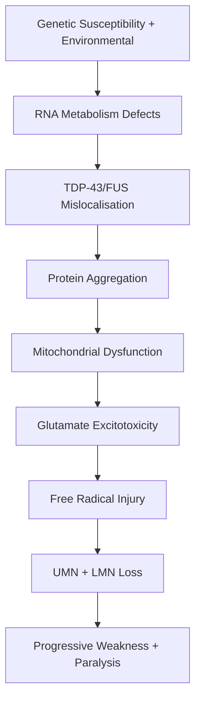
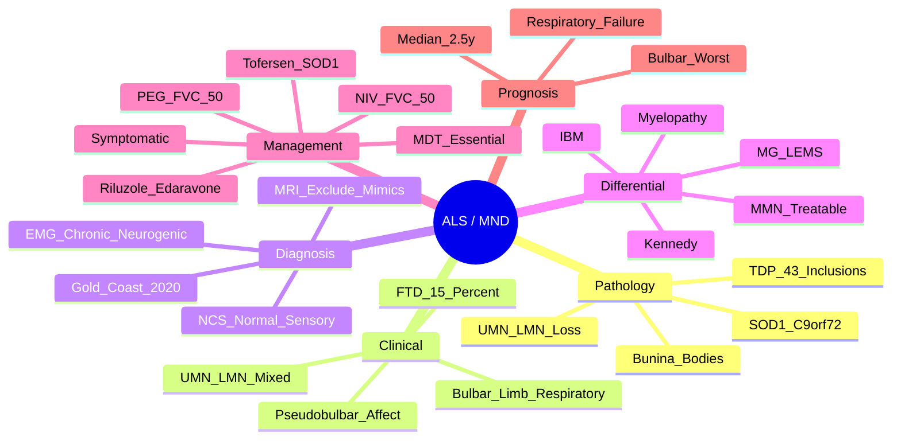

# Amyotrophic Lateral Sclerosis (ALS / Motor Neurone Disease)

> [!tip] **MND = UMN + LMN signs in MULTIPLE regions, NO sensory/cerebellar/autonomic/ocular involvement**
> **Gold Coast 2020** simplified El Escorial; diagnosis by **clinical + EMG** alone (no imaging required if progression evident)

## 1. Definition / Epidemiology / Classification

### Definition
Progressive neurodegenerative disorder of **upper motor neurons (UMN)** and **lower motor neurons (LMN)** in motor cortex, brainstem, and spinal cord → progressive weakness, paralysis, death typically 2-5 years from symptom onset (median 2.5y).

### Epidemiology
- **Incidence:** 2-3/100,000/year
- **Prevalence:** 5-7/100,000
- **Age:** Median onset 55-65y; ↑ with age
- **Sex:** M:F = 3:2 (younger onset more often male)
- **Risk factors:** Age, male sex, family history (5-10%), smoking, military service, heavy metals, trauma (head); BMI ↓; athletic activity (?)

### Classification — Phenotypes
| Phenotype | Features | Prognosis |
|-----------|----------|-----------|
| **Classical ALS (Charcot)** | UMN + LMN in ≥3 regions | Median 2.5y |
| **Bulbar-onset ALS** | Bulbar weakness first (dysarthria, dysphagia); 30%; often female, older | Median 1.5-2y (worst) |
| **Limb-onset ALS** | Limb weakness first (70%) | Median 2-3y |
| **Primary Lateral Sclerosis (PLS)** | UMN only; progresses slowly; >4y to involve LMN | Better (10-20y) |
| **Progressive Muscular Atrophy (PMA)** | LMN only; evolves into ALS over time | Variable |
| **Flail Arm/Leg Syndrome** | Brachial amyotrophic diplegia / leg | Slower progression |
| **Kennedy Disease (SBMA)** | LMN only + bulbar + androgens; X-linked | Slowly progressive |

---

## 2. Aetiology / Pathophysiology

### Aetiology
- **Genetic (10% familial, 90% sporadic):**
  - **C9orf72** (40% familial, 7% sporadic) — most common; hexanucleotide repeat; TDP-43
  - **SOD1** (20% familial) — free radical scavenger; **Tofersen** is targeted therapy
  - **TARDBP** (TDP-43)
  - **FUS, TBK1, OPTN, UBQLN2**
- **Sporadic:** Multifactorial; glutamatergic excitotoxicity, oxidative stress, mitochondrial dysfunction, neuroinflammation

### Pathophysiology

### Pathology
- **TDP-43 inclusions** (95% sporadic, 50% familial)
- **SOD1 inclusions** (SOD1 familial)
- **Bunina bodies** (small eosinophilic inclusions in motor neurons)
- **Atrophy:** Precentral gyrus (UMN), anterior nerve roots (LMN), hypoglossal nerve
- **No sensory or autonomic involvement** (key diagnostic feature)

---

## 3. Clinical Features

### History
- **Onset:** Insidious, progressive, **asymmetric weakness** (80%)
- **Symptoms:**
  - **Limb:** Distal weakness (foot drop, hand clumsiness), cramps, stiffness
  - **Bulbar:** Dysarthria (spastic-flaccid), dysphagia, nasal regurgitation, weight loss
  - **Respiratory:** Dyspnoea, orthopnoea, poor sleep (hypoventilation)
  - **Cognitive/Behavioural:** 15% frontotemporal dementia (C9orf72); emotional lability (pseudobulbar affect)
- **Sensation, eye movements, bowel/bladder ALWAYS spared** (key)

### Examination
| Domain | UMN Signs | LMN Signs |
|--------|-----------|-----------|
| **Tone** | ↑ Spasticity, clonus | ↓ Flaccidity |
| **Reflexes** | ↑ Brisk; Babinski + | ↓ Areflexia |
| **Power** | Weakness | Weakness, atrophy, **fasciculations** |
| **Other** | Pseudobulbar (spastic dysarthria, brisk jaw jerk) | Bulbar (tongue wasting, fasciculations) |

### Specific Signs
- **Split hand:** First dorsal interosseous + APB wasting with relative sparing of lateral thenar (cortical origin)
- **Tongue fasciculations:** LMN (hypoglossal nucleus)
- **Brisk jaw jerk + spastic dysarthria:** UMN (corticobulbar)
- **Emotional lability:** Pseudobulbar affect (10-20%) — inappropriate crying/laughing
- **No:** Sensory loss, cerebellar signs, autonomic dysfunction, ophthalmoplegia, bed sores (despite paralysis)

### MND Mimics — **"No sensory, no ocular, no autonomic"**

---

## 4. Diagnostic Approach / Algorithm

### Gold Coast Criteria (2020) — Simplified El Escorial
**Diagnosis requires:**
1. **Progressive motor decline** (clinical or by history)
2. **≥1 of:** 
   - **UMN + LMN signs in ≥1 body region** (clinical)
   - **UMN signs in ≥2 regions** (clinical)
   - **LMN signs in ≥1 region + EMG showing chronic neurogenic changes in ≥2 regions** (excluding the clinically affected region)
3. **Exclusion:** Sensory signs (unless explained), parkinsonism, cerebellar signs, autonomic dysfunction, visual/ocular signs, stridor/dysphagia (with preserved bulbar function), cognitive/behavioural (with preserved MND criteria)

**Levels of Certainty:**
- **Definite ALS:** ≥3 body regions with UMN+LMN signs (clinical/EMG)
- **Probable ALS:** ≥2 regions with UMN+LMN (clinical/EMG)
- **Possible ALS:** ≥1 region with UMN+LMN, OR UMN in ≥2 regions, OR LMN in ≥2 regions (EMG)

**Body regions:** Bulbar, cervical, thoracic, lumbosacral

---

## 5. Investigations

### First-Line
| Test | Indication | Finding |
|------|------------|---------|
| **Nerve Conduction Studies (NCS)** | Rule out neuropathy | Normal sensory NCS; motor may be low CMAP |
| **EMG (needle)** | **Mandatory** — confirm widespread LMN | **Chronic neurogenic changes: fibrillations, positive sharp waves, fasciculations, large polyphasic motor units, reduced recruitment** in multiple regions |
| **MRI Brain + Cord** | Exclude structural causes (cord compression, syrinx, tumour) | May show corticospinal tract hyperintensity (subtle) |
| **Bloods** | Exclude mimics | CK (modestly ↑), autoimmune (anti-GM1), B12, TSH, paraprotein |

### When to Consider
| Test | Indication |
|------|------------|
| **Genetic testing** | Family history, young-onset (<50y) — **C9orf72, SOD1, FUS, TARDBP** |
| **Anti-GM1 antibodies** | Multifocal motor neuropathy (MMN) — conduction block |
| **Anti-MAG** | Demyelinating neuropathy mimics |
| **CK** | ↑ 2-3x in ALS; marked ↑ in myopathy |
| **LP** | If inflammatory (rarely needed) |
| **Spirometry** | **Vital capacity (VC)**, **SNIP (Sniff Nasal Inspiratory Pressure)** — respiratory monitoring |
| **ABG** | ↑ pCO₂ in late disease |

### Key Biomarkers
- **Neurofilament light chain (NfL)** — ↑ in serum/CSF (prognostic, research)
- **p75ECD** — urinary trophic factor (research)

---

## 6. Differential Diagnosis
| Condition | Distinguishing Feature |
|-----------|----------------------|
| **Multifocal Motor Neuropathy (MMN)** | Pure motor; **conduction block on NCS**; anti-GM1+; treatable (IVIG) |
| **Cervical Myelopathy** | Sensory level, bladder/bowel involvement, MRI cord compression |
| **Kennedy Disease (SBMA)** | X-linked; bulbar + LMN + gynaecomastia; CAG repeat in androgen receptor |
| **Inclusion Body Myositis** | Older; **finger flexor + quadriceps** weakness; ↑CK; muscle biopsy |
| **Polymyositis/Dermatomyositis** | Proximal; ↑CK; autoimmune; skin (DM) |
| **Myasthenia Gravis** | Fatigable weakness, ocular, NMJ antibodies, response to edrophonium |
| **Lambert-Eaton Myasthenic Syndrome (LEMS)** | Proximal weakness, ↑with activity; small cell lung cancer; anti-VGCC |
| **Primary Lateral Sclerosis** | UMN only; slow progression; >4y |
| **Progressive Muscular Atrophy** | LMN only; progression variable |
| **Post-polio syndrome** | Remote history of polio |

---

## 7. Management

### Disease-Modifying Therapy
| Drug | Mechanism | Effect |
|------|-----------|--------|
| **Riluzole** | Inhibits glutamate release; sodium channel block | **Modestly prolongs survival by ~3-6 months** |
| **Edaravone** | Free radical scavenger (antioxidant) | Modest slowing of functional decline (especially early ALS) |
| **Tofersen** | Antisense oligonucleotide against SOD1 | For **SOD1 mutation** ALS only (FDA approved 2023) |

### Symptomatic Management
| Symptom | Treatment |
|---------|-----------|
| **Spasticity** | Baclofen, tizanidine, gabapentin; botulinum toxin (severe) |
| **Cramps** | Quinine, magnesium, massage, gabapentin |
| **Dysarthria** | SALT; communication aids (Lightwriter, eye-gaze) |
| **Dysphagia** | SALT assessment; modified diet; nasogastric tube (short-term); **PEG/RIG (gastrostomy)** when FVC >50% predicted |
| **Sialorrhoea** | Hyoscine patch, amitriptyline, atropine drops SL, botulinum toxin (parotid), glycopyrronium |
| **Pseudobulbar affect** | **Dextromethorphan/quinidine (Nuedexta)**; SSRIs |
| **Respiratory** | Non-invasive ventilation (NIV) — **BiPAP when FVC <50% or symptomatic orthopnoea**; cough assist; tracheostomy (rare) |
| **Mood/depression** | SSRIs, mirtazapine |
| **Pain** | NSAIDs, gabapentin, opioids (severe) |
| **Cognitive/behavioural (FTD)** | SSRIs; avoid antipsychotics (↓mobility) |
| **Constipation** | Laxatives; fibre; ensure hydration |

### Multidisciplinary Care (MDT) — **ESSENTIAL**
- Neurologist + MND nurse specialist
- Physiotherapy (mobility, exercise, breathing)
- Occupational therapy (ADL, equipment)
- Speech & Language Therapy (SALT) — communication, swallowing
- Dietitian (nutrition, PEG)
- Respiratory team (NIV)
- Psychology / palliative care
- Social worker, hospice referral
- **MDT ↑ survival and QOL** (evidence-based)

### End-of-Life Care
- Advance care planning (early discussion)
- Decision-making capacity (when does it fail?)
- DNACPR; place of death preference
- Palliative care integration
- **Opioids (morphine SC) + midazolam** for terminal dyspnoea/distress

---

## 8. Drug Interactions / Contraindications
- **Aminoglycosides:** Neuromuscular blockade (avoid)
- **Statins:** May worsen weakness (consider trial off)
- **Neuromuscular blocking agents:** Severe sensitivity; avoid if possible
- **Tofersen:** Meningitis, myelitis, ↑ICP risk; monitor

---

## 9. Procedures
### PEG/RIG Insertion
- **Indication:** Weight loss >10%, dysphagia with risk of aspiration, prolonged meal times
- **Timing:** **FVC >50%** to reduce procedural respiratory failure risk
- **Approach:** PEG (endoscopic) or RIG (radiologically inserted gastrostomy)

### EMG
- **Indication:** Confirm widespread LMN; exclude mimics (MMN)
- **Findings:** Chronic denervation + reinnervation (large polyphasic units), fibrillation, fasciculations, reduced recruitment

### Spirometry (VC, SNIP)
- **Baseline + 3-monthly**
- **NIV indication:** FVC <50% predicted OR orthopnoea + symptoms

---

## 10. Complications
| Complication | Management |
|--------------|------------|
| **Respiratory failure** (leading cause of death) | NIV; tracheostomy (if requested) |
| **Aspiration pneumonia** | SALT, modified diet, PEG |
| **DVT/PE** | Prophylaxis (consider); immobility |
| **Pressure ulcers** | Equipment (pressure-relieving mattresses), repositioning |
| **Depression** | SSRIs, psychological support |
| **Weight loss** | Dietitian, PEG, calorie supplements |
| **Falls** | Walking aids, OT, hip protectors |

---

## 11. Red Flags
| Red Flag | Consider Alternative |
|----------|---------------------|
| **Sensory symptoms/signs** | Peripheral neuropathy, myelopathy |
| **Eye movement abnormalities** | Not ALS (consider mitochondrial) |
| **Autonomic dysfunction** | MSA, neuropathy |
| **Prominent bladder/bowel** | Myelopathy |
| **Pure UMN or LMN (>4y)** | PLS, PMA, Kennedy |
| **Reversibility** | MMN (IVIG-responsive), myasthenia (AChEi) |
| **Marked ↑ CK** | Myopathy (IBM, polymyositis) |
| **Family history of FTD** | C9orf72 — test |

---

## 12. Prognosis
| Factor | Good | Poor |
|--------|------|------|
| **Onset** | Limb, young | Bulbar, old |
| **Phenotype** | PLS, flail arm | Bulbar, respiratory onset |
| **Genetic** | SOD1 (some) | C9orf72 (FTD + ALS worse) |
| **Respiratory** | Preserved FVC | Rapid FVC decline |
| **Cognitive** | Preserved | FTD (worse prognosis) |
| **Delay to diagnosis** | Earlier diagnosis (paradoxically worse?) | Later diagnosis |

- **Median survival:** 2.5-3.5 years from symptom onset
- **5-year survival:** 20-25%; 10-year: 5-10%
- **Cause of death:** Respiratory failure (most common), aspiration pneumonia, pulmonary embolism
- **Positive prognostic factors:** Limb onset, young age, normal cognition, slow FVC decline

---

## 13. Topic Correlation
| Topic | Overlap |
|-------|---------|
| **PLS, PMA** | UMN/LMN-only variants |
| **MMN** | Pure motor; conduction block; IVIG-responsive (treatable!) |
| **Kennedy Disease** | X-linked bulbar + LMN |
| **IBM** | Inclusion body myositis — finger flexors |
| **FTD** | C9orf72 common; 15% of ALS have FTD |

---

## 14. Special Situations
- **Pregnancy:** Rare (most post-reproductive); riluzole category C; PEG/NIV challenging
- **Paediatric:** Very rare; consider SMA, Duchenne
- **Genetic counselling:** C9orf72 (autosomal dominant, anticipation), SOD1 (AD); offer testing if family history or young-onset
- **Driving (DVLA):** Must notify; medical assessment; conditional licences
- **Anaesthesia:** Sensitivity to suxamethonium, non-depolarising NMBAs; regional preferred
- **End-of-life:** Discuss early (BPS/MND Association); palliative referral at diagnosis

---

## FCPS/MRCP High-Yield Summary
| Category | Key Points |
|----------|------------|
| **Definition** | Progressive UMN + LMN degeneration; spared sensation, eyes, bladder |
| **Diagnosis** | Gold Coast 2020: progressive + UMN+LMN in 1 region OR UMN in 2 OR LMN+EMG in 2 |
| **Genetics** | C9orf72 (40% familial), SOD1, FUS, TDP-43 |
| **EMG** | Chronic neurogenic; fibrillation, fasciculation, large polyphasic units |
| **Treatment** | **Riluzole** (prolongs ~3-6mo); **Edaravone** (free radical scavenger); **Tofersen** (SOD1); MDT care |
| **Respiratory** | NIV when FVC <50% or symptoms; SNIP monitoring |
| **PEG** | When FVC >50% (before respiratory decline) |
| **Mimics** | MMN (treatable!), myelopathy, IBM, Kennedy, myasthenia |
| **Prognosis** | Median 2.5y; bulbar worst, limb best |
| **Cause of death** | Respiratory failure (most common) |

---

## Viva Questions
1. **MND definition?** Progressive UMN + LMN disease; no sensory, ocular, autonomic involvement.
2. **Gold Coast criteria (2020)?** Progressive + UMN+LMN in 1 region OR UMN in 2 OR LMN+EMG in 2.
3. **EMG findings in ALS?** Chronic neurogenic changes: fibrillations, positive sharp waves, fasciculations, large polyphasic units, reduced recruitment.
4. **Riluzole mechanism?** Inhibits glutamate release (excitotoxicity); prolongs survival by 3-6 months.
5. **Tofersen use?** SOD1 mutation ALS only (antisense oligonucleotide).
6. **PEG timing?** When FVC >50% (to reduce procedural respiratory risk).
7. **NIV indication?** FVC <50% predicted OR orthopnoea/symptoms of hypoventilation.
8. **MMN vs ALS?** MMN: pure motor, conduction block on NCS, anti-GM1+, treatable with IVIG.
9. **Cause of death in ALS?** Respiratory failure (most common).
10. **C9orf72?** Most common familial ALS gene; TDP-43 pathology; ↑ FTD association.

---

## Common Confusions
| Confusion | Clarification |
|-----------|---------------|
| **ALS vs MMN** | MMN: pure motor, conduction block, IVIG-responsive; ALS: UMN+LMN |
| **ALS vs PMA/PLS** | ALS: UMN+LMN; PMA: LMN only; PLS: UMN only (>4y) |
| **ALS vs myelopathy** | Myelopathy: sensory level, bladder/bowel |
| **ALS vs Kennedy** | Kennedy: X-linked, bulbar+LMN, gynaecomastia |
| **Respiratory indication** | FVC <50% → NIV; <30% → high mortality |
| **PEG timing** | FVC >50% (before respiratory decline) |
| **Split hand** | APB/FDI wasting (cortical) — characteristic of ALS |

---

## Mnemonics
1. **MND spares:** **S**ensation, **E**yes, **B**ladder/bowel, **B**ed sores — "**SEBs** spared"
2. **UMN signs:** **S**pasticity, **B**risk reflexes, **B**abinski — "SBB"
3. **LMN signs:** **W**eakness, **A**reflexia, **A**trophy, **F**asciculations — "WAAF"
4. **C9orf72 = Chromosome 9, Open Reading Frame 72; Hexanucleotide GGGGCC repeat**

---

## Mind Map

---

## One-Page Revision Card
| **Topic** | **ALS / MND** |
|-----------|---------------|
| **Definition** | Progressive UMN + LMN disease; spared sensation, eyes, bladder |
| **Diagnosis** | Gold Coast 2020: progressive + UMN+LMN in 1 region OR UMN in 2 OR LMN+EMG in 2 |
| **EMG** | Chronic neurogenic: fibrillation, fasciculation, large polyphasic units |
| **Genetics** | C9orf72 (40% familial), SOD1, FUS, TDP-43 |
| **Treatment** | **Riluzole** (~3-6mo), **Edaravone**, **Tofersen** (SOD1) |
| **Respiratory** | NIV when FVC <50% or orthopnoea |
| **PEG** | When FVC >50% (before respiratory decline) |
| **MDT** | Essential; ↑ survival + QOL |
| **Mimics** | MMN (treatable!), myelopathy, IBM, Kennedy, MG |
| **Prognosis** | Median 2.5y; bulbar worst; respiratory failure = cause of death |

---

## MCQs (10)

1. **Gold Coast 2020 criteria for ALS require:**
   A. Sensory loss in multiple regions B. **Progressive motor decline + UMN+LMN in ≥1 region (clinical) or LMN+EMG in ≥2 regions** C. MRI brain atrophy D. Genetic mutation
   *Answer: B*

2. **Which is NOT involved in MND?**
   A. UMN B. LMN C. **Sensory neurons** D. Brainstem motor nuclei
   *Answer: C*

3. **Most common genetic cause of familial ALS is:**
   A. SOD1 B. **C9orf72** C. FUS D. TDP-43
   *Answer: B*

4. **Riluzole acts by:**
   A. Antioxidant B. **Inhibiting glutamate release** C. Anti-inflammatory D. Promoting muscle growth
   *Answer: B*

5. **Tofersen is used in:**
   A. All ALS B. **SOD1-mutation ALS** C. C9orf72 ALS D. Bulbar-onset ALS only
   *Answer: B*

6. **NIV is indicated when:**
   A. FVC <30% B. **FVC <50% or symptoms** C. FVC >80% D. All patients at diagnosis
   *Answer: B*

7. **PEG placement in ALS is recommended when:**
   A. FVC <30% B. **FVC >50%** C. Weight loss >20% D. After NIV
   *Answer: B*

8. **EMG findings in ALS include all EXCEPT:**
   A. Fibrillation B. Fasciculations C. **Sensory slowing** D. Large polyphasic units
   *Answer: C*

9. **A treatment-responsive MND mimic is:**
   A. **Multifocal Motor Neuropathy (MMN)** B. Kennedy disease C. PLS D. Inclusion body myositis
   *Answer: A*

10. **Median survival from symptom onset in ALS is:**
    A. 6 months B. **2.5 years** C. 5 years D. 10 years
    *Answer: B*

---

## SBAs (10)

1. **A 60-year-old man has 1 year of progressive right hand weakness, then left foot drop, and now dysarthria. Exam: tongue fasciculations, brisk jaw jerk, wasted hand, fasciculations in arms, hyperreflexia, equivocal plantar. EMG shows widespread denervation. Diagnosis?**
   A. MMN B. **Definite ALS** C. PLS D. Kennedy disease
   *Answer: B* — UMN+LMN in 3+ regions (cervical, lumbosacral, bulbar); chronic neurogenic EMG = definite ALS.

2. **A 55-year-old with bulbar ALS has FVC 70% and 10% weight loss. Best management for dysphagia?**
   A. Wait for FVC <50% B. **PEG insertion now (FVC >50%)** C. NG tube only D. Total parenteral nutrition
   *Answer: B* — PEG when FVC >50% to reduce procedural respiratory failure risk.

3. **A 50-year-old man with pure LMN weakness, no UMN signs, and abnormal anti-GM1 antibodies. Diagnosis?**
   A. ALS B. **MMN** C. Kennedy disease D. PMA
   *Answer: B* — Anti-GM1+ + pure motor + conduction block = MMN (IVIG-responsive).

4. **A 45-year-old with family history of ALS is diagnosed with SOD1-mutation ALS. What targeted therapy is available?**
   A. Riluzole B. Edaravone C. **Tofersen** D. No targeted therapy
   *Answer: C* — Tofersen is antisense oligonucleotide for SOD1 ALS.

5. **A patient with ALS has inappropriate crying and laughing episodes. Best treatment?**
   A. Quinine B. **Dextromethorphan/quinidine (Nuedexta)** C. Risperidone D. Baclofen
   *Answer: B* — Dextromethorphan/quinidine is licensed for pseudobulbar affect.

6. **A patient with ALS develops dyspnoea on lying flat. FVC is 45%. Best management?**
   A. Wait for FVC <30% B. **Initiate NIV (BiPAP)** C. Intubation D. Tracheostomy
   *Answer: B* — FVC <50% OR orthopnoea = NIV indication.

7. **Pseudobulbar affect in ALS is best treated with:**
   A. Anticholinesterases B. **Dextromethorphan/quinidine or SSRIs** C. Dopamine agonists D. NMDA antagonists
   *Answer: B* — Pseudobulbar (spastic dysarthria, emotional lability) responds to dextromethorphan/quinidine.

8. **Which of these MND phenotypes has the best prognosis?**
   A. Bulbar-onset ALS B. **Flail arm syndrome** C. Respiratory-onset ALS D. ALS-FTD
   *Answer: B* — Flail arm has slower progression.

9. **A 70-year-old with rapidly progressive weakness, fasciculations, AND sensory loss. Most likely diagnosis?**
   A. ALS B. **Not ALS — sensory involvement argues against** C. PMA D. MMN
   *Answer: B* — Sensory involvement rules out ALS; consider neuropathy/myelopathy.

10. **In ALS, what causes most deaths?**
    A. Cardiac arrhythmia B. **Respiratory failure** C. DVT/PE D. Suicide
    *Answer: B* — Respiratory failure is the leading cause of death in ALS.

---

## Flashcards

- **Q:** Gold Coast criteria?
  **A:** Progressive + UMN+LMN in 1 region OR UMN in 2 OR LMN+EMG in 2
- **Q:** ALS spares?
  **A:** Sensation, eyes, bladder/bowel
- **Q:** Riluzole mechanism?
  **A:** Inhibits glutamate release
- **Q:** Tofersen use?
  **A:** SOD1-mutation ALS only
- **Q:** Most common familial ALS gene?
  **A:** C9orf72 (hexanucleotide repeat)
- **Q:** NIV indication?
  **A:** FVC <50% or symptoms
- **Q:** PEG timing?
  **A:** FVC >50%
- **Q:** MMN treatment?
  **A:** IVIG (treatable mimic!)
- **Q:** Cause of death in ALS?
  **A:** Respiratory failure
- **Q:** Median survival?
  **A:** 2.5 years

---

## Answer Key

### MCQs
1. **B** — Progressive + UMN+LMN or LMN+EMG
2. **C** — Sensory spared in MND
3. **B** — C9orf72 most common
4. **B** — Glutamate inhibitor
5. **B** — Tofersen = SOD1 ALS
6. **B** — FVC <50% → NIV
7. **B** — PEG when FVC >50%
8. **C** — Sensory NCS normal in ALS
9. **A** — MMN is IVIG-responsive
10. **B** — Median 2.5y

### SBAs
1. **B** — UMN+LMN in 3 regions + EMG = definite ALS
2. **B** — PEG when FVC >50%
3. **B** — Anti-GM1+ = MMN
4. **C** — Tofersen for SOD1 ALS
5. **B** — Nuedexta for pseudobulbar
6. **B** — NIV when FVC <50% or symptoms
7. **B** — Nuedexta or SSRIs
8. **B** — Flail arm = best prognosis
9. **B** — Sensory = not ALS
10. **B** — Respiratory failure

---

## Local Navigation
**Heading Hub:** [[07_Motor_Neurone_Disease/MND Hub]]
**Topic-Group Hub:** [[07_Motor_Neurone_Disease/MND MOC]]
**Chapter Hierarchy:** [[Davidson Chapter 25 - Neurology Hierarchy]]
