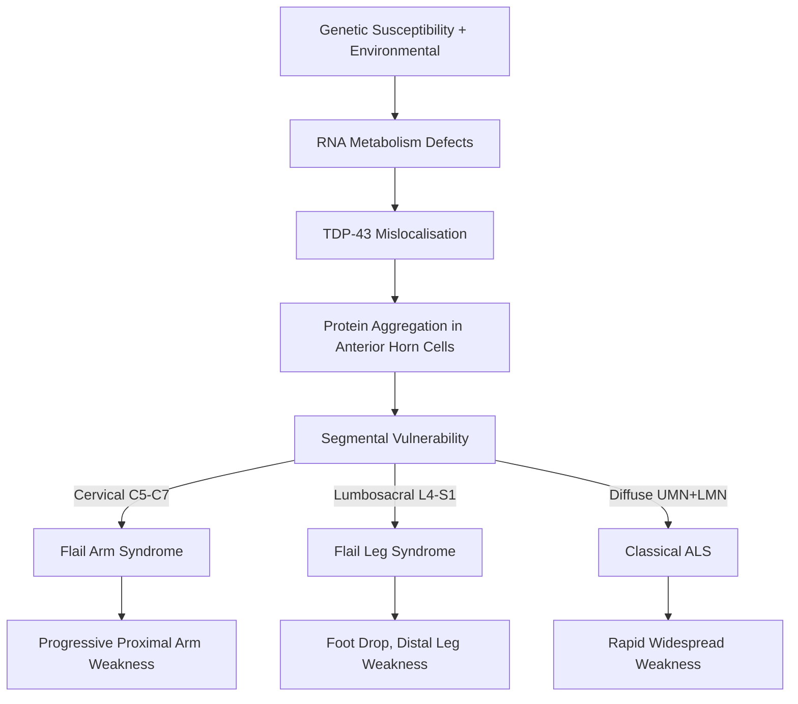
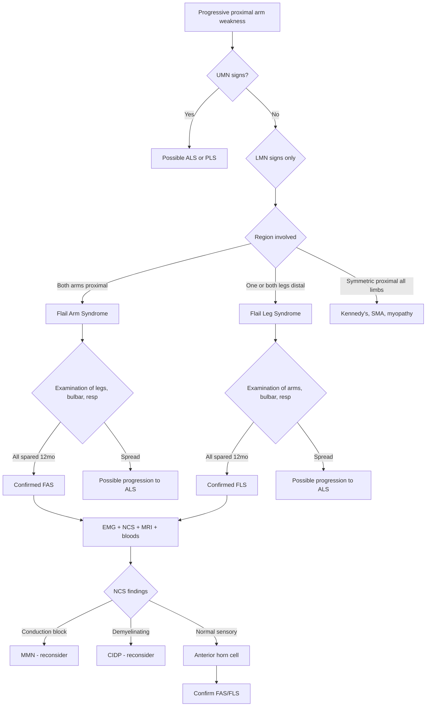
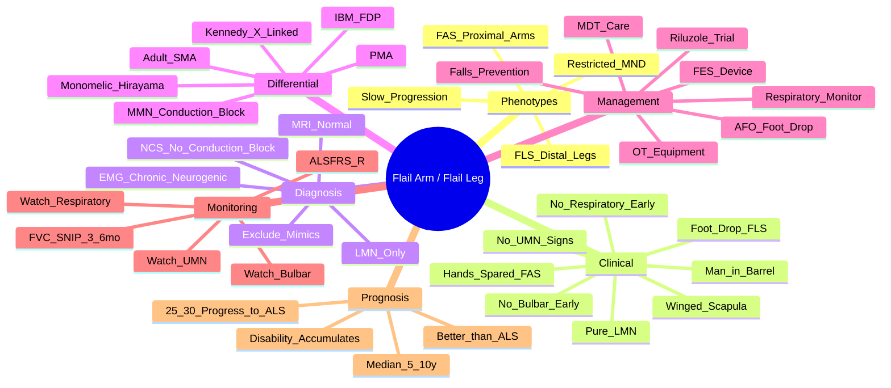

# Flail Arm & Flail Leg Variants (MND)

> [!tip] **High-Yield Definition**
> **Flail Arm Syndrome (FAS)** = Brachial Amyotrophic Diplegia (BAD): progressive, **asymmetric, predominantly proximal LMN weakness of both upper limbs** with **relative sparing of hands**, no UMN signs, no bulbar/respiratory involvement (early).
> **Flail Leg Syndrome (FLS)** = Pseudopolyneuritic form: progressive **distal LMN weakness of one or both lower limbs** (foot drop), no UMN signs, slow progression.
> Both are **MND variants with significantly better prognosis** than classical ALS (median survival 4-10y vs 2-3y).

---

## 1. Definition / Epidemiology / Classification

### Definition
**Flail Arm Syndrome (FAS):** A restricted phenotype of motor neuron disease in which progressive, predominantly proximal, asymmetric LMN weakness is confined to the upper limbs (cervical region) for ≥12 months without involvement of other regions. Bilateral but often asymmetric; relative sparing of the hands distinguishes it from distal-onset ALS.

**Flail Leg Syndrome (FLS):** A restricted MND phenotype with progressive, predominantly distal LMN weakness in the lower limbs (lumbosacral region) for ≥12 months, with or without contralateral leg involvement. No UMN signs, no bulbar/respiratory involvement (early). Slower progression.

### Epidemiology
- **FAS:** 10-15% of all MND cases; **M:F = 4-9:1**; median age of onset 60-70 years
- **FLS:** 5-10% of MND; similar demographics, M>F
- **Median survival:**
  - FAS: **65 months (~5.4 years)** from symptom onset
  - FLS: **80-120 months (~7-10 years)**
  - Classical ALS: ~30 months (~2.5 years)
- **5-year survival:** FAS 50-60%; FLS 70-80%; ALS 20-25%
- Long-term disability accumulates; some patients progress to typical ALS over time

### Classification (within MND spectrum)

| Phenotype | Distribution | UMN | LMN | Progression | Prognosis |
|-----------|-------------|-----|-----|-------------|-----------|
| **Flail Arm (BAD)** | Bilateral, asymmetric, **proximal upper limb** | **Absent** (early) | **Present** (proximal > distal) | Slow | **Best of MND variants** |
| **Flail Leg (Pseudopolyneuritic)** | Distal lower limb, foot drop | Absent (early) | Present | Slow | **Best** |
| **Classical ALS** | Bulbar + limb | Present | Present | Rapid | Poor (2-3y) |
| **Bulbar ALS** | Bulbar predominant | ± | ± | Rapid | Worst |
| **PLS** | UMN only | Present | Absent >4y | Very slow | 10-20y |
| **PMA** | LMN only | Absent | Present | Variable | Variable |
| **Kennedy's** | Bulbar + LMN + gynaecomastia | Absent | Present | Slow | 10-20y |
| **Respiratory-onset ALS** | Diaphragm first | ± | ± | Rapid | Very poor |

### Diagnostic Criteria (Working Criteria)
**FAS (Hu et al., 1998):**
1. Progressive, predominantly proximal weakness of both upper limbs
2. Asymmetric onset
3. LMN signs only in upper limbs (no UMN)
4. No significant functional involvement of lower limbs, bulbar, or respiratory muscles for ≥12 months
5. EMG: chronic neurogenic changes in upper limb muscles, with or without similar changes in lower limbs but no UMN features

**FLS (Wijesekera et al., 2009):**
1. Progressive, predominantly distal weakness of one or both lower limbs
2. LMN signs in lower limbs (no UMN)
3. No significant functional involvement of upper limbs, bulbar, or respiratory muscles for ≥12 months
4. EMG: chronic neurogenic changes in lower limbs ± similar in upper limbs, no UMN

---

## 2. Aetiology / Pathophysiology

### Aetiology
- **Mostly sporadic**
- Familial cases rare; possible links to **CHMP2B**, **ANG**, **VAPB** mutations
- Pathology: **TDP-43 inclusions** (similar to ALS — supports spectrum)
- No clear environmental risk factors distinct from ALS
- Some overlap with **Kennedy's** in phenotype; distinguish by sex (FAS more common in males, Kennedy X-linked)

### Pathophysiology

### Pathology
- **TDP-43 positive cytoplasmic inclusions** in remaining anterior horn cells (C5-T1 in FAS, L4-S2 in FLS)
- Bunina bodies occasionally
- Atrophy of anterior nerve roots in affected segments
- No corticospinal tract degeneration (UMN spared)
- **Cortical thinning** may be seen on MRI in some cases (subclinical)

### Molecular Basis
- **TDP-43** proteinopathy (similar to ALS)
- Rare reports of **SOD1**, **FUS** mutations
- Some overlap with **multisystem proteinopathy (VCP, HNRNPA1)**
- **C9orf72** repeat expansions reported in some atypical cases

---

## 3. Clinical Features

### History — Flail Arm
- **Onset:** Insidious, asymmetric proximal arm weakness
- **Symptoms:** Difficulty lifting arms overhead, reaching up, washing hair, getting dressed
- **Progression:** Spreads to contralateral arm; hands relatively preserved (key — distinguishes from ALS where hands often first)
- **Cramps:** Common in deltoid, biceps, triceps
- **NO** neck weakness, NO bulbar (early), NO respiratory (early), NO leg weakness (early)
- **NO** sensory symptoms, NO pain (or mild shoulder pain from glenohumeral instability)

### History — Flail Leg
- **Onset:** Foot drop, ankle weakness, tripping
- **Symptoms:** Difficulty walking on heels, climbing stairs
- **Progression:** May affect contralateral leg; proximal legs spared (early)
- **Cramps** in calves
- **NO** arm weakness, NO bulbar, NO respiratory (early), NO sphincter disturbance

### Examination

| Domain | Flail Arm Findings | Flail Leg Findings |
|--------|--------------------|--------------------|
| **Tone** | ↓ in arms (LMN) | ↓ in legs (LMN) |
| **Power** | Severe weakness: deltoid, biceps, triceps, spinati; **hands relatively spared** | Severe distal weakness: ankle dorsiflexion, plantarflexion, EHL |
| **Reflexes** | ↓ or absent in arms; preserved in legs | ↓ or absent in legs; preserved in arms; jaw jerk normal |
| **Wasting** | Prominent in proximal arms, shoulders (may be "winged scapulae") | Distal leg wasting (calf, intrinsic foot) |
| **Fasciculations** | Common in affected muscles | Common in calves |
| **Plantar** | Flexor (no Babinski!) | Flexor (no Babinski!) |
| **Sensation** | Preserved | Preserved |
| **Bulbar** | Normal | Normal |
| **Cognition** | Normal | Normal |

### Classic Signs
- **"Man in a barrel"** appearance in FAS: proximal arm weakness with preserved hands and legs
- **Winged scapula** from serratus anterior/trapezius weakness
- **Bilateral but asymmetric** weakness
- **Reflexes absent in affected limbs** (LMN pattern)
- **No spasticity, no Babinski, no pseudobulbar affect** (early)
- **Respiratory function preserved** (FVC >80% typically at diagnosis)

### Associated Findings
- May develop **FTD** in 5-10% (less common than ALS)
- **Pseudobulbar affect** rare in pure FAS/FLS
- Weight loss from upper limb disability

### Key Clinical Distinction from Classical ALS
| Feature | FAS/FLS | Classical ALS |
|---------|---------|---------------|
| UMN signs | **Absent (early)** | Present |
| Bulbar | **Spared** (≥12mo) | Often involved |
| Respiratory | **Spared** (≥12mo) | Progressive decline |
| Spread | **Restricted** to one region | Multifocal |
| Progression | **Slow** | Rapid |
| Median survival | **5-10 years** | 2-3 years |
| Hands (in FAS) | **Spared** | Often affected early |
| Functional decline | Gradual | Rapid |

---

## 4. Diagnostic Approach / Algorithm

### Stepwise Approach

### Diagnostic Criteria
**Gold Coast 2020 / EFNS Criteria for FAS:**
- Progressive motor decline
- Pure LMN signs in cervical region (both upper limbs)
- No UMN signs
- No functional involvement of bulbar, thoracic, or lumbosacral regions for **≥12 months**
- EMG: chronic neurogenic changes in upper limb muscles
- Exclusion of mimics (MMN, CIDP, IBM, structural, Kennedy's)

**FLS Criteria:**
- Progressive, asymmetric, distal LMN weakness in lumbosacral region
- No UMN, no bulbar, no respiratory involvement for ≥12 months
- EMG: chronic neurogenic changes in lower limb muscles
- Exclusion of mimics (CIDP, MMN, structural, IBM, MAMA)

### Severity / Staging
- **ALSFRS-R** (ALS Functional Rating Scale-Revised): tracks bulbar, fine motor, gross motor, respiratory function (0-48)
- **MRC sum score** for muscle strength
- **Norris scale** (older)
- **FVC / SNIP** for respiratory monitoring (every 3-6 months)

---

## 5. Investigations

### First-Line

| Test | Indication | Expected Finding |
|------|------------|------------------|
| **NCS** | Exclude demyelinating (MMN, CIDP) | Sensory normal; CMAP ↓ in affected muscles; **NO conduction block** (vs MMN) |
| **EMG (needle)** | Confirm chronic neurogenic LMN | Fibrillations, positive sharp waves, fasciculations, **large polyphasic units, reduced recruitment** in affected region; chronic neurogenic in some non-affected regions may be present |
| **MRI brain + whole spine** | Exclude structural (cord compression, syrinx, foramen magnum) | Normal in FAS/FLS; CST hyperintensity in ALS |
| **CK** | Modest rise expected | Mild ↑ (<5x); higher in IBM |
| **FBC, U&E, LFT, Ca, Mg, TFTs** | Baseline | Normal |

### Second-Line / Targeted

| Test | Indication |
|------|------------|
| **Anti-GM1 antibodies** | Exclude MMN (positive in 30-50% MMN) |
| **Anti-MAG, anti-sulfatide** | Exclude demyelinating mimics |
| **Anti-cN1A (NT5C1A)** | Exclude IBM (overlapping age group) |
| **Anti-Hu, Yo, Ri, CV2/CRMP5** | Exclude paraneoplastic |
| **HIV, syphilis, Lyme, HTLV-1** | Exclude infectious |
| **SPEP/immunofixation, BJP** | Exclude paraproteinemia |
| **Genetic testing** | Family history or atypical: **SMN1, AR (CAG), C9orf72, SOD1, FUS, VCP** |
| **CSF** | If inflammatory suspected |
| **Muscle biopsy** | If IBM suspected (rimmed vacuoles) |
| **Spirometry (FVC, SNIP)** | Baseline respiratory; monitor |
| **Anti-NfL (serum)** | Prognostic; usually <ALS levels |
| **Anti-neurofilament heavy chain** | Research |

### Key Biomarkers
- **Neurofilament light (NfL):** Modest ↑ in FAS/FLS (lower than ALS); prognostic
- **Phosphorylated neurofilament heavy chain (pNfH):** Similar
- **TDP-43 in CSF/plasma:** Research tool

---

## 6. Differential Diagnosis

| Differential | Distinguishing Features | Key Test |
|--------------|------------------------|----------|
| **Classical ALS** | UMN+LMN, bulbar, respiratory, multifocal, rapid | EMG widespread; CST hyperintensity on MRI |
| **Multifocal Motor Neuropathy (MMN)** | Pure motor, asymmetric, anti-GM1+, **conduction block** | NCS conduction block |
| **CIDP / MADSAM** | Sensorimotor, demyelinating, CSF protein ↑ | NCS demyelinating |
| **Kennedy Disease (SBMA)** | X-linked male, bulbar, **gynaecomastia**, slow | **CAG repeat in AR** |
| **Adult SMA (Type IV)** | Symmetric proximal, no UMN, no bulbar, SMN1 deletion | **SMN1 genetic** |
| **Progressive Muscular Atrophy (PMA)** | LMN only, **multifocal**, evolves to ALS | Watch for UMN |
| **Cervical Myelopathy** | UMN below, sensory level, bladder, Lhermitte's | **MRI cord compression** |
| **Inclusion Body Myositis (IBM)** | Older, **FDP + quadriceps**, ↑CK, anti-cN1A | Muscle biopsy |
| **Cervical Radiculopathy** | Pain, sensory, single root distribution | MRI cervical spine |
| **Brachial Plexopathy** | Single limb, often post-trauma/tumour | MRI plexus, EMG |
| **Polymyositis** | Proximal symmetric, ↑↑CK, autoimmune | CK, biopsy |
| **Spinal Muscular Atrophy (SMA Type III/IV)** | Symmetric proximal, no UMN, SMN1 | **SMN1 genetic** |
| **Post-polio syndrome** | History of polio, fatigue, new weakness | History |
| **Monomelic Amyotrophy (Hirayama)** | Young Asian male, distal upper limb, self-limiting | **Dynamic MRI cervical flexion** |
| **Foramen Magnum Lesion** | UMN in 4 limbs, CN involvement, sensory | MRI craniocervical junction |
| **Multifocal Acquired Motor Axonalopathy (MAMA)** | Motor axonal, anti-GM1+, NO conduction block, treatment-resistant | NCS |

### Monomelic Amyotrophy (Hirayama) — Important Mimic
- **Young adult males (15-25y)**, Asian descent
- **Distal upper limb** weakness + wasting
- **Self-limiting** after 3-5 years
- **Dynamic MRI** shows forward displacement of posterior dura on flexion
- NOT a true MND variant — generally non-progressive

---

## 7. Management

### Disease-Modifying Therapy
| Agent | Indication | Evidence in FAS/FLS |
|-------|------------|---------------------|
| **Riluzole** | Standard ALS care | Modest survival benefit; some clinicians offer |
| **Edaravone** | Standard ALS care | Limited evidence in FAS/FLS; may help early |
| **Tofersen** | SOD1-ALS | Not indicated unless SOD1+ |

### Symptomatic Management

| Symptom | First-line | Second-line |
|---------|-----------|-------------|
| **Proximal arm weakness** | Physiotherapy, OT, **adaptive equipment** (long-handled reacher, dressing aids), home modifications | Functional electrical stimulation (FES) |
| **Foot drop (FLS)** | **Ankle-foot orthosis (AFO)**, FES (e.g., Bioness L300), physiotherapy | Wheeled walker |
| **Cramps** | Quinine, magnesium, massage | Gabapentin |
| **Falls prevention** | Hip protectors, walking aids (cane, walker), home safety assessment | Strength training |
| **Contracture prevention** | Passive stretching, splints, ROM exercises | Serial casting (severe) |
| **Respiratory monitoring** | Baseline + 3-6 monthly **FVC, SNIP** | Early NIV if decline |
| **Bulbar (late)** | SALT, modified diet | PEG if needed |
| **Mood/depression** | SSRIs, psychological support | CBT |
| **Pain** | NSAIDs, paracetamol | Gabapentin, amitriptyline |
| **Sialorrhoea (late)** | Hyoscine patch, glycopyrronium | Botulinum toxin |
| **Pseudobulbar (rare)** | Dextromethorphan/quinidine | SSRIs |

### Rehabilitation / Multidisciplinary
- **Physiotherapy:** Maintain ROM, prevent contracture, gait training
- **Occupational therapy:** Equipment provision (wheelchair, hoist), home modifications
- **Orthotics:** AFOs for foot drop, shoulder supports
- **Speech & language:** If bulbar develops
- **Dietitian:** Nutritional support, weight management
- **Psychology / counselling:** Chronic disease adjustment
- **Palliative care:** Symptom management, advance care planning
- **Social work:** Disability benefits, employment support

### Surgical / Procedural
- **Ankle-foot orthosis (AFO):** For foot drop; standard
- **Functional electrical stimulation (FES):** e.g., Bioness L300, WalkAide
- **Wheelchair:** Power wheelchair when walking unsafe
- **PEG/RIG:** If bulbar develops and FVC >50% (less common than ALS)
- **Tracheostomy:** Very rare in FAS/FLS

### MDT Approach — **ESSENTIAL**
- Neurologist + MND nurse specialist
- PT/OT/SALT
- Dietitian
- Respiratory physician
- Orthotist
- Psychologist, palliative care

### Genetic Counselling
- Test if family history or young onset
- Most cases are sporadic
- Discuss implications for children/siblings

### Reassess Regularly
- Watch for **UMN signs** (suggests progression to ALS)
- Watch for **bulbar/respiratory** involvement
- If atypical course, **reconsider diagnosis** — repeat NCS, MRI

---

## 8. Drug Interactions / Contraindications

| Drug | Caution in FAS/FLS | Management |
|------|--------------------|------------|
| **Aminoglycosides** | Neuromuscular blockade | Avoid if possible |
| **Statins** | May worsen weakness | Trial off |
| **Neuromuscular blocking agents** | Severe sensitivity | Avoid; use regional |
| **Quinine** | QT prolongation, thrombocytopenia | Baseline ECG |
| **Baclofen** | Sedation, weakness | Start low |
| **Gabapentin** | Sedation, ataxia | Slow titration |
| **Tizanidine** | Hypotension, hepatotoxicity | LFTs |

---

## 9. Procedures

### Nerve Conduction Studies & EMG
- **Indication:** Confirm neurogenic LMN; exclude MMN (conduction block), CIDP (demyelinating)
- **FAS Findings:** Reduced CMAP in affected arm muscles; chronic neurogenic EMG in arms ± subclinical changes in legs; **no conduction block**; sensory NCS normal
- **FLS Findings:** Reduced CMAP in leg muscles; chronic neurogenic in legs ± arms
- **Complications:** Bruising, very rarely infection at needle site
- **Viva pearl:** "Conduction block = MMN, not FAS/FLS"

### MRI Brain + Whole Spine
- **Indication:** Exclude structural cause (cord compression, syrinx, foramen magnum lesion)
- **FAS/FLS Findings:** Normal; may show mild cortical thinning or CST changes in long-standing cases

### Spirometry (FVC, SNIP)
- **Indication:** Baseline + every 3-6 months
- **Normal in early FAS/FLS**
- **Decline** suggests spread — re-evaluate

### Genetic Testing
- **SMN1** (adult SMA), **AR CAG repeat** (Kennedy's), **C9orf72, SOD1, FUS** (atypical familial)
- **VCP, HNRNPA1** for multisystem proteinopathy (rare)

---

## 10. Complications

| Complication | Frequency | Prevention / Monitoring | Management |
|--------------|-----------|------------------------|------------|
| **Progression to ALS** | 25-30% over years | Monitor for UMN, bulbar, respiratory | Reclassify; consider riluzole/edaravone |
| **Falls** | Common | AFO, walking aids, hip protectors, home safety | PT, OT |
| **Contractures** | Common in late disease | ROM, splints, positioning | Stretching, serial casting |
| **Pressure ulcers** | Late | Repositioning, mattresses | Equipment, debridement |
| **Respiratory failure (late)** | 10-20% | FVC/SNIP 3-6 monthly | NIV; tracheostomy rare |
| **Aspiration pneumonia (late)** | Rare in pure FAS/FLS | SALT, modified diet | PEG, antibiotics |
| **DVT/PE** | With immobility | Prophylaxis, ambulation | Anticoagulation |
| **Weight loss** | From disability | Dietitian, supplements | PEG if severe |
| **Depression** | 20-30% | Screen (PHQ-9) | SSRIs, CBT |
| **Social isolation** | Common | Support groups, MDT | MND Association, online communities |
| **FTD** | 5-10% | Monitor cognition | SSRIs; avoid antipsychotics |

---

## 11. Red Flags / Emergencies

| Red Flag | Action | Time Window |
|----------|--------|-------------|
| **Development of UMN signs** | Reassess — likely progression to ALS | Months |
| **Bulbar weakness onset** | SALT, swallow assessment | Days |
| **Dyspnoea, orthopnoea** | Urgent FVC/SNIP; consider NIV | Hours-days |
| **Aspiration pneumonia** | IV antibiotics, NPO, swallow eval | Hours |
| **FVC <50%** | NIV, MDT discussion | Days |
| **FVC <30%** | Urgent NIV, ICU discussion, advance care | Hours |
| **Severe depression / suicidal ideation** | Urgent psych, safety plan | Hours |
| **Respiratory failure (acute)** | NIV → intubation discussions; advanced directive | Immediate |
| **Sudden progression** | Reconsider diagnosis, repeat NCS, MRI | Days |
| **Falls with injury** | Trauma workup, AFO, hip protectors | Hours |
| **Family history emerges** | Genetic testing, counselling | Months |
| **Pregnancy** | Multidisciplinary management | Months |

---

## 12. Prognosis

| Factor | Better | Worse |
|--------|--------|-------|
| **Phenotype** | FAS, FLS | Bulbar-onset ALS |
| **UMN signs** | Absent | Present (progression) |
| **Onset age** | Younger (<60) | Older |
| **Respiratory** | Preserved FVC | Decline |
| **Cognition** | Normal | FTD |
| **Weight** | Maintained | Loss |
| **Genetic** | No mutation | SOD1, C9orf72 (variable) |
| **Progression rate** | Slow | Rapid |

- **Median survival:** FAS 5-6 years; FLS 7-10 years; ALS 2-3 years
- **5-year survival:** FAS 50-60%; FLS 70%; ALS 20%
- **10-year survival:** FAS 20-30%; FLS 30-40%
- **Cause of death:** Respiratory failure (most common), aspiration, PE
- **Quality of life:** Maintained with multidisciplinary care; disability accumulates but slowly

### Natural History
- Most patients **never progress** to typical ALS (70% FAS remain FAS at 5 years)
- Progression when it occurs: usually to typical ALS with UMN signs and bulbar/respiratory involvement
- Long-term disability: wheelchair-bound common after 5-10 years
- Cognitive function usually preserved

---

## 13. Topic Correlation

| Related Topic | Link | Key Overlap |
|---------------|------|-------------|
| **ALS** | [[Amyotrophic Lateral Sclerosis]] | FAS/FLS = restricted phenotype; better prognosis |
| **PMA** | [[Progressive Muscular Atrophy]] | Pure LMN; PMA often evolves to ALS |
| **PLS** | [[Primary Lateral Sclerosis]] | Pure UMN; opposite phenotype |
| **Kennedy's** | [[Kennedys Disease]] | X-linked LMN; bulbar; gynaecomastia |
| **Adult SMA** | [[Spinal Muscular Atrophy]] | SMN1 deletion; proximal symmetric |
| **MMN** | [[Multifocal Motor Neuropathy]] | Pure motor; conduction block; IVIG |
| **Monomelic Amyotrophy** | [[Hirayama Disease]] | Young male, distal arm, self-limiting |
| **IBM** | [[Inclusion Body Myositis]] | FDP + quadriceps, anti-cN1A |
| **Cervical Myelopathy** | [[Cervical Myelopathy]] | UMN + sensory level |

---

## 14. Special Situations

| Situation | Consideration |
|-----------|---------------|
| **Pregnancy** | Very rare; riluzole category C; consider MDT; delivery planning with anaesthetics |
| **Lactation** | Most drugs excreted; discuss benefit-risk |
| **Paediatric** | Monomelic amyotrophy (Hirayama) in young Asian males; SMA types 1-3 |
| **Elderly / Frail** | FAS common; consider comorbidities; conservative Rx; falls risk high |
| **Renal impairment** | Gabapentin dose reduction; baclofen caution |
| **Hepatic impairment** | Riluzole LFT monitoring |
| **Immunocompromised** | PML risk with immunosuppression |
| **Perioperative** | **Extreme sensitivity to suxamethonium and non-depolarising NMBAs**; use regional; avoid volatile agents if possible |
| **Driving / DVLA** | Notify if symptomatic; medical assessment; restricted licence possible |
| **Occupational** | Workplace adaptations; consider early retirement; disability employment services |

---

## FCPS/MRCP High-Yield Summary

| Category | Key Points |
|----------|------------|
| **Definition** | FAS = proximal arm LMN; FLS = distal leg LMN; MND variants; restricted phenotype |
| **Epidemiology** | FAS 10-15% of MND; M:F 4-9:1; onset 60-70y; FLS 5-10% |
| **Prognosis** | Median 5-10y (much better than ALS 2-3y) |
| **Key clinical** | No UMN, no bulbar, no respiratory for ≥12mo; hands spared in FAS |
| **Diagnosis** | Clinical + EMG chronic neurogenic; no conduction block; MRI normal |
| **Differential** | MMN (conduction block), Kennedy (X-linked, gynaecomastia), adult SMA (SMN1), IBM, ALS |
| **Treatment** | Riluzole trial; supportive; MDT essential; AFO for foot drop |
| **Monitoring** | FVC/SNIP 3-6 monthly; watch for UMN, bulbar, respiratory |
| **Viva pearl** | "FAS = 'man in a barrel' — proximal arms, spared hands" |
| **Anatomy** | Cervical C5-C7 (FAS); lumbosacral L4-S1 (FLS) |

---

## Viva Questions

1. **Q: Define flail arm syndrome.**
   A: Progressive, asymmetric, predominantly proximal LMN weakness of both upper limbs, with relative sparing of hands, no UMN signs, no bulbar/respiratory involvement for ≥12 months. Median survival 5-6 years.

2. **Q: How do you clinically distinguish FAS from classical ALS?**
   A: FAS has no UMN signs, no bulbar or respiratory involvement (early), hands relatively spared, restricted to one region, slower progression. ALS has UMN+LMN, bulbar/respiratory, multifocal, rapid.

3. **Q: What is the classic appearance in FAS?**
   A: "Man in the barrel" — bilateral proximal arm weakness with preserved hands and legs, giving a "barrel" appearance.

4. **Q: How do you distinguish FAS from MMN?**
   A: MMN has NO wasting early, NO UMN, anti-GM1+ in 30-50%, and **conduction block on NCS outside entrapment sites**. FAS has wasting, no conduction block. IVIG helps MMN.

5. **Q: What is the difference between FAS and FLS?**
   A: FAS = proximal upper limb weakness. FLS = distal lower limb weakness (foot drop). Both have no UMN, slow progression, better prognosis than ALS.

6. **Q: What is the role of genetic testing in FAS/FLS?**
   A: Most are sporadic. Consider SMN1 (adult SMA), AR CAG (Kennedy's), and rarely C9orf72/SOD1/FUS in familial cases. Generally a clinical diagnosis.

7. **Q: How do you monitor a patient with FAS/FLS?**
   A: 3-6 monthly: clinical review (UMN, bulbar, respiratory), FVC/SNIP, ALSFRS-R, weight, mood. Watch for progression to ALS.

8. **Q: What is the role of riluzole in FAS/FLS?**
   A: Modest evidence; some clinicians offer (standard ALS care). Survival benefit uncertain in restricted phenotypes.

9. **Q: When does a patient with FAS/FLS progress to typical ALS?**
   A: 25-30% over 5-10 years; heralded by development of UMN signs, bulbar weakness, or respiratory involvement. Monitor closely.

10. **Q: What is monomelic amyotrophy (Hirayama disease)? How does it differ from FAS?**
    A: Hirayama = young Asian male, distal upper limb (often unilateral), self-limiting after 3-5 years, **dynamic MRI shows posterior dural displacement on flexion**. FAS = older, proximal, bilateral, progressive.

11. **Q: What is the differential for distal leg weakness (FLS mimic)?**
    A: MMN, CIDP, MAMA, lead toxicity, peroneal neuropathy, L5 radiculopathy, IBM (quadriceps), adult SMA, post-polio, Kennedy's, structural (cord compression).

12. **Q: What is the role of orthotics in FAS/FLS?**
    A: Ankle-foot orthosis (AFO) for foot drop in FLS; functional electrical stimulation (FES) for foot drop; shoulder supports; wrist/hand splints. Essential for mobility and function.

---

## Common Confusions

| Confusion | Clarification |
|-----------|---------------|
| **FAS vs ALS** | FAS: pure LMN, restricted region, no UMN/bulbar/resp (early), slow. ALS: UMN+LMN, multifocal, rapid. |
| **FAS vs MMN** | MMN: no wasting early, anti-GM1+, **conduction block**, IVIG-responsive. FAS: wasting, no conduction block. |
| **FAS vs Kennedy's** | Kennedy's: X-linked male, **gynaecomastia**, bulbar, CAG repeat, sensory NCS ↓. |
| **FLS vs adult SMA** | Adult SMA: **symmetric proximal**, SMN1 deletion, no UMN. FLS: distal, asymmetric, focal. |
| **FLS vs L5 radiculopathy** | Radiculopathy: pain, single root, sensory deficit, MRI disc herniation. FLS: painless, multiple roots, EMG widespread. |
| **FLS vs peroneal neuropathy** | Peroneal neuropathy: single nerve, often after trauma/compression, recovers. FLS: progressive, multiple nerves. |
| **FAS vs monomelic amyotrophy** | Monomelic: young male, distal, unilateral, **self-limiting**, dynamic MRI. FAS: older, proximal, bilateral, progressive. |
| **FAS vs PMA** | PMA: LMN only, **multifocal**, evolves to ALS. FAS: LMN only, **restricted**, slow, less progression. |
| **Hands spared vs hands affected** | FAS = hands spared; ALS = hands often first affected; IBM = FDP wasted but other hand preserved |
| **"Restricted" vs "evolving"** | FAS/FLS = restricted to one region ≥12mo. If it spreads, reconsider as ALS. |

---

## Mnemonics

1. **FAS = "Flail Arms, Spare hands"** — *FAS* = *F*lail *A*rms (proximal), *S*pare hands.
2. **FLS = "Flail Legs, no Spasticity"** — *FLS* = *F*lail *L*egs (distal), no *S*pasticity (no UMN).
3. **"Man in a Barrel"** — FAS gives a barrel-like appearance (proximal arms weak, hands & legs intact).
4. **"No UMN, no bulbar, no respiratory = FAS/FLS"** — three absences distinguish from ALS.
5. **"MND spectrum"** — *PLS* (UMN), *PMA* (LMN), *FAS* (LMN restricted to arms), *FLS* (LMN restricted to legs), *ALS* (UMN+LMN), *Kennedy* (LMN+bulbar+X-linked).
6. **"Better prognosis than ALS"** — *FAS lives 5-6 years; FLS lives 7-10 years* — about 2-3× ALS survival.
7. **"Watch for three progressions"** — *UMN* signs, *Bulbar* weakness, *Respiratory* decline = no longer restricted.

---

## Mind Map

---

## One-Page Revision Card

| **Topic** | **Flail Arm & Flail Leg Variants** |
|-----------|------------|
| **Definition** | Restricted MND; pure LMN in one region (arms or legs); ≥12mo |
| **FAS** | Proximal bilateral arm weakness; hands spared; "man in a barrel" |
| **FLS** | Distal leg weakness; foot drop; pseudopolyneuritic |
| **Epidemiology** | 10-15% of MND (FAS); 5-10% (FLS); M>F; onset 60-70y |
| **Prognosis** | Median 5-10 years (2-3× ALS survival) |
| **Diagnosis** | Pure LMN; EMG chronic neurogenic; no conduction block; MRI normal |
| **Differential** | MMN (conduction block), Kennedy (X-linked), adult SMA, IBM, ALS |
| **Treatment** | Riluzole trial; MDT; AFO; OT/PT; orthotics |
| **Monitor** | FVC/SNIP 3-6mo; UMN, bulbar, respiratory signs |
| **Viva pearl** | "FAS = LMN only in arms; FLS = LMN only in legs; both better than ALS" |

---

## MCQs (10)

1. **A 65-year-old man has 2 years of progressive bilateral shoulder weakness with deltoid wasting, preserved hand function, no leg/bulbar/respiratory involvement, no UMN signs. EMG shows chronic neurogenic changes in arms. Diagnosis?**
   A. ALS
   B. **Flail Arm Syndrome**
   C. Kennedy disease
   D. MMN
   *Answer: B* — Pure LMN, bilateral proximal arm, hands spared, restricted to one region, no UMN = FAS.

2. **Flail arm syndrome has what characteristic clinical appearance?**
   A. Wrist drop
   B. **"Man in a barrel" — proximal arm weakness with intact hands/legs**
   C. Distal wasting
   D. Scapular winging alone
   *Answer: B* — Classic "man in a barrel" appearance.

3. **Which investigation distinguishes FAS from MMN?**
   A. EMG
   B. MRI
   C. **NCS — conduction block in MMN**
   D. CK
   *Answer: C* — Motor conduction block outside entrapment sites = MMN. FAS has no conduction block.

4. **A patient with FAS develops UMN signs and bulbar weakness 3 years after diagnosis. This is most consistent with:**
   A. Medication side effect
   B. **Progression to typical ALS**
   C. Concurrent stroke
   D. Normal disease course
   *Answer: B* — 25-30% of FAS/FLS progresses to typical ALS over time.

5. **Median survival in flail arm syndrome is approximately:**
   A. 18 months
   B. **5-6 years**
   C. 10-15 years
   D. 20 years
   *Answer: B* — FAS median 5-6 years; better than ALS 2-3 years.

6. **Which is the most useful orthosis in flail leg syndrome?**
   A. Wrist splint
   B. **Ankle-foot orthosis (AFO)**
   C. Cervical collar
   D. Knee brace
   *Answer: B* — AFO corrects foot drop and improves gait.

7. **Monomelic amyotrophy (Hirayama disease) differs from FAS by:**
   A. Affects proximal arms
   B. **Affects distal arm in young Asian male, self-limiting**
   C. Has UMN signs
   D. Has bulbar involvement
   *Answer: B* — Hirayama = young, distal, unilateral, self-limiting; FAS = older, proximal, bilateral, progressive.

8. **In flail arm syndrome, hand function is typically:**
   A. Severely affected first
   B. **Relatively preserved**
   C. Spared but painful
   D. Always affected later
   *Answer: B* — Hand sparing is a key feature of FAS distinguishing it from ALS.

9. **A patient with FLS has foot drop. Best initial management for mobility?**
   A. Wheelchair
   B. **Ankle-foot orthosis (AFO) or functional electrical stimulation (FES)**
   C. Bed rest
   D. Surgery
   *Answer: B* — AFO/FES are first-line for foot drop.

10. **In flail arm/leg syndromes, what is the role of MRI brain and spine?**
    A. Confirm diagnosis
    B. **Exclude structural causes (cord compression, syrinx, foramen magnum lesion)**
    C. Identify fasciculations
    D. Measure muscle bulk
    *Answer: B* — MRI is to exclude structural mimics; FAS/FLS MRI is normal.

---

## SBAs (10)

1. **A 60-year-old man with 18 months of progressive bilateral shoulder and arm weakness, preserved hands, no UMN/bulbar/respiratory signs. EMG: chronic neurogenic in arms, no conduction block. MRI spine normal. Diagnosis?**
   A. ALS
   B. **Flail Arm Syndrome**
   C. MMN
   D. Kennedy's
   *Answer: B* — Pure LMN, bilateral arm, hands spared, restricted, no UMN, no conduction block = FAS.

2. **A 70-year-old with progressive foot drop and distal leg weakness over 2 years, no UMN, no bulbar, no upper limb involvement, EMG chronic neurogenic in legs. Best management?**
   A. Wheelchair
   B. **Ankle-foot orthosis (AFO) + multidisciplinary care**
   C. IVIG
   D. Steroids
   *Answer: B* — FLS management: AFO, PT, OT, MDT. IVIG is for MMN.

3. **A patient with FAS/FLS develops UMN signs at 4 years. What is the most likely change in classification?**
   A. Stays as FAS
   B. **Progressed to classical ALS**
   C. Developed PLS
   D. Developed Kennedy's
   *Answer: B* — UMN signs + bulbar/respiratory = no longer restricted; reclassify as ALS.

4. **A 30-year-old Asian man has unilateral distal arm wasting that has been stable for 3 years. Dynamic MRI shows posterior dural displacement on neck flexion. Diagnosis?**
   A. Flail arm syndrome
   B. **Hirayama disease (monomelic amyotrophy)**
   C. ALS
   D. MMN
   *Answer: B* — Young Asian, distal, unilateral, stable, dynamic MRI positive = Hirayama.

5. **A patient with FAS is found to have FVC 60% and rising CO2. Best management?**
   A. Tracheostomy
   B. **Monitor; initiate NIV when FVC <50% or symptomatic**
   C. Intubation
   D. Hospice
   *Answer: B* — FVC <50% or symptoms = NIV. Most FAS have preserved FVC early.

6. **A 55-year-old man with FAS develops fasciculations and progressive tongue wasting with preserved UMN findings. What has developed?**
   A. Kennedy's disease
   B. **Bulbar involvement suggesting ALS progression**
   C. MG
   D. Myasthenia
   *Answer: B* — Bulbar onset in a FAS patient = progression to typical ALS.

7. **Which medication may be offered in FAS/FLS despite modest evidence?**
   A. Steroids
   B. IVIG
   C. **Riluzole**
   D. Cyclophosphamide
   *Answer: C* — Riluzole is standard of care in MND; may be offered in restricted phenotypes with informed discussion.

8. **A 65-year-old with flail arm syndrome has worsening shoulder pain. What is the most likely cause?**
   A. ALS progression
   B. **Glenohumeral subluxation from deltoid weakness**
   C. Bulbar involvement
   D. Polymyositis
   *Answer: B* — Shoulder pain in FAS often from glenohumeral instability due to deltoid wasting; treat with shoulder support.

9. **A patient with FLS has NCS showing motor conduction block across the fibular head. Reassess the diagnosis to:**
   A. Kennedy's
   B. **Peroneal neuropathy or MMN — not FLS**
   C. Adult SMA
   D. PMA
   *Answer: B* — Conduction block at entrapment site may be peroneal neuropathy or MMN; FLS has no conduction block.

10. **A patient with FAS has anti-GM1 antibody positive. What is the most likely reclassification?**
    A. Still FAS
    B. **MMN — anti-GM1+ suggests MMN**
    C. Kennedy's
    D. PLS
    *Answer: B* — Anti-GM1+ is for MMN; not consistent with FAS.

---

## Flashcards

- **Q: Flail Arm Syndrome = ?**
  **A:** Restricted MND: pure LMN, bilateral proximal arms, hands spared, no UMN/bulbar/resp, slow
- **Q: Median survival FAS?**
  **A:** 5-6 years
- **Q: Median survival FLS?**
  **A:** 7-10 years
- **Q: "Man in a barrel"?**
  **A:** FAS clinical appearance
- **Q: Distinguishes FAS from MMN?**
  **A:** Conduction block on NCS in MMN (not FAS)
- **Q: Distinguishes FAS from Kennedy's?**
  **A:** X-linked male, gynaecomastia, CAG repeat in AR
- **Q: AFO used for?**
  **A:** Foot drop in FLS
- **Q: Best prognosis MND variant?**
  **A:** FLS (~10y), then FAS (~5-6y), then PLS (~10-20y)
- **Q: Watch for what in FAS/FLS?**
  **A:** UMN, bulbar, respiratory — signals progression to ALS
- **Q: When to start NIV in FAS/FLS?**
  **A:** FVC <50% or symptoms

---

## Answer Key

### MCQs
1. **B** — FAS
2. **B** — Man in a barrel
3. **C** — Conduction block in MMN
4. **B** — Progression to ALS
5. **B** — 5-6 years
6. **B** — AFO
7. **B** — Hirayama
8. **B** — Hands preserved in FAS
9. **B** — AFO/FES
10. **B** — Exclude structural

### SBAs
1. **B** — FAS
2. **B** — AFO + MDT
3. **B** — Progressed to ALS
4. **B** — Hirayama
5. **B** — NIV when FVC <50%
6. **B** — Bulbar = ALS progression
7. **C** — Riluzole
8. **B** — Glenohumeral subluxation
9. **B** — Conduction block = peroneal/MMN
10. **B** — Anti-GM1 = MMN

---

## Local Navigation

**Heading Hub:** [[MND & Related Disorders Hub]]
**Topic-Group Hub:** [[Motor Neurone Disease Hub]]
**Chapter Hierarchy:** [[Davidson Chapter 25 - Neurology Hierarchy]]
**Related Topics:** [[Amyotrophic Lateral Sclerosis]], [[Primary Lateral Sclerosis]], [[Progressive Muscular Atrophy]], [[Kennedys Disease]]
