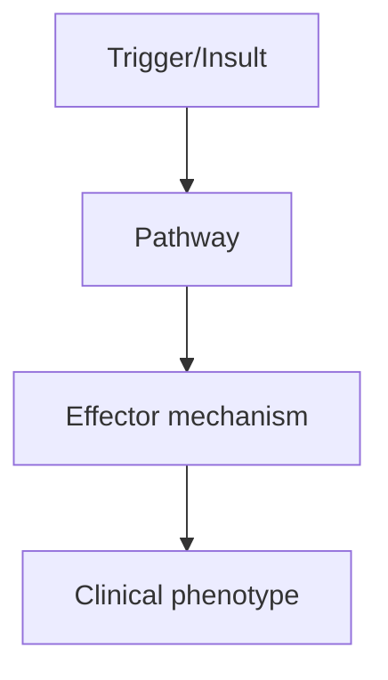
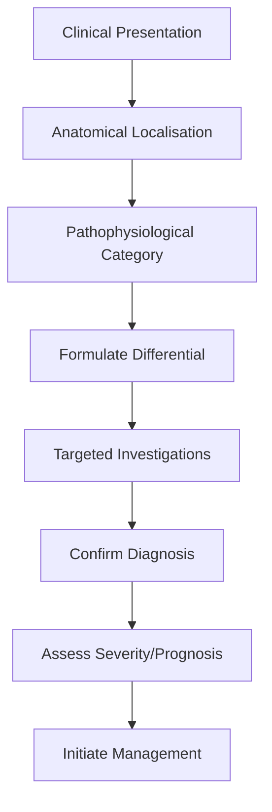

# Kennedys Disease

> [!tip] **High-Yield Definition**
> Kennedy's disease (Spinal and Bulbar Muscular Atrophy, SBMA): X-linked motor neuron disease due to androgen receptor (AR) gene CAG repeat expansion. Adult-onset, slowly progressive proximal weakness, bulbar, gynaecomastia, infertility, diabetes.

---

## Learning Objectives
- [ ] Define the condition and classify its variants
- [ ] Describe epidemiology and inheritance/genetics
- [ ] Explain pathophysiology and molecular mechanisms
- [ ] Recognise clinical features and distinguish from mimics
- [ ] List diagnostic criteria and confirmatory investigations
- [ ] Outline stepwise management (pharmacological, supportive, MDT)
- [ ] Identify red flags, complications, and prognostic factors
- [ ] Apply special situations (pregnancy, paediatric, elderly)
- [ ] Recall FCPS/MRCP high-yield facts, drug doses, genetic patterns
- [ ] Answer viva questions confidently

---

## 1. Definition / Epidemiology / Classification

### Definition
Kennedy's disease (Spinal and Bulbar Muscular Atrophy, SBMA): X-linked motor neuron disease due to androgen receptor (AR) gene CAG repeat expansion. Adult-onset, slowly progressive proximal weakness, bulbar, gynaecomastia, infertility, diabetes.

### Epidemiology
Prevalence: 1-2/100,000 males. Adult onset (30-50y). X-linked recessive (males affected, female carriers may have mild features). CAG repeat 38-66 (normal <34). Anticipation minimal (X-linked).

### Classification
| Variant | Key Features | Prognosis |
|---------|-------------|-----------|
| | | |

---

## 2. Aetiology / Pathophysiology

### Aetiology
Androgen receptor gene (Xq11-12) CAG trinucleotide repeat expansion (38-66, normal <34). Toxic gain of function: mutant AR protein aggregates (intranuclear inclusions), motor neuron degeneration. Androgen-dependent (only males, later onset than other polyQ diseases). Reduced fertility (testicular atrophy, oligospermia).

### Pathophysiology


---

## 3. Clinical Features

### History
- **Onset/Duration:**
- **Progression:**
- **Key symptoms:**
- **Triggers:**
- **Systemic symptoms:**
- **Drug/Family/Social history:**

### Examination
| Domain | Key Findings | Localisation Value |
|--------|-------------|-------------------|
| | | |

### Specific Clinical Features
Proximal LMN weakness (legs, arms): symmetric, progressive, wasting, fasciculations (often perioral, tongue, limb). Bulbar: dysarthria, dysphagia (late). Tongue: wasting, fasciculations, perioral fasciculations (subtle, characteristic). Reflexes: reduced or absent (LMN, no UMN signs). Cramps, tremor (perioral, postural). Gynaecomastia (androgen insensitivity). Erectile dysfunction, reduced fertility (oligospermia, testicular atrophy). Diabetes mellitus (insulin resistance, 10-20%). Adult onset, slow progression. No UMN signs (no spasticity, hyperreflexia, Babinski). Sensation preserved. Cognition preserved.

---

## 4. Diagnostic Approach / Algorithm



---

## 5. Investigations

Genetic: AR gene CAG repeat (38-66). Confirmatory. CK: mildly elevated. EMG: chronic neurogenic changes, widespread denervation, large motor units, fasciculations. NCS: normal sensory, reduced CMAP. Bloods: testosterone (low/normal), LH (high), FSH (normal), oestradiol (high), SHBG (altered), fasting glucose (diabetes), HbA1c. MRI brain + spine: normal. Muscle biopsy: neurogenic atrophy, androgen receptor inclusions. Family history: X-linked (maternal uncles).

---

## 6. Differential Diagnosis

| Differential | Distinguishing Features | Key Test |
|--------------|------------------------|----------|
| | | |

---

## 7. Management

Symptomatic: weakness (physiotherapy, OT, walking aids, FES, splints), bulbar (SLT, NG/PEG late), cramps (quinine, magnesium, gabapentin), tremor (propranolol), gynaecomastia (tamoxifen, surgery if desired), diabetes (lifestyle, metformin), erectile dysfunction (PDE5 inhibitors). Multidisciplinary: neurologist, endocrinologist, urologist, OT, PT, dietitian, social. No disease-modifying therapy. Riluzole trial (no benefit). Experimental: anti-androgen (leuprorelin, dutasteride - trials ongoing, conflicting results). Genetic counselling: X-linked, female carriers (mild, may need testing), prenatal testing. Avoid: testosterone supplementation (may worsen).

---

## 8. Drug Interactions / Contraindications / Comorbidity Cautions

| Drug | Interaction / Caution | Management |
|------|----------------------|------------|
| | | |

---

## 9. Procedures (if applicable)

### Procedure:
- **Indications:**
- **Contraindications:**
- **Preparation / Principle:**
- **Complications:**
- **Viva Pearls:**

---

## 10. Complications

| Complication | Frequency | Prevention / Monitoring | Management |
|--------------|-----------|------------------------|------------|
| | | | |

---

## 11. Red Flags / Emergencies

Respiratory failure (late, rare), aspiration, falls, fractures, diabetes complications, depression, suicide (depression common), gynaecomastia (psychological).

---

## 12. Prognosis

Slow progression. Median survival: 10-20 years from diagnosis. Most retain ambulation for years. Respiratory involvement late. Cause of death: pneumonia, aspiration, intercurrent. Quality of life: variable, depression common. Multidisciplinary care essential. Endocrine management: important (diabetes, gynaecomastia).

---

## 13. Topic Correlation

| Related Topic | Link | Key Overlap |
|---------------|------|-------------|
| | | |

---

## 14. Special Situations

| Situation | Consideration |
|-----------|---------------|
| **Pregnancy** | |
| **Lactation** | |
| **Paediatric** | |
| **Elderly / Frail** | |
| **Renal impairment** | |
| **Hepatic impairment** | |
| **Immunocompromised** | |
| **Perioperative** | |
| **Driving / DVLA** | |
| **Occupational** | |

---

## FCPS/MRCP High-Yield Summary

| Category | Key Points |
|----------|------------|
| **Definition** | Kennedy's disease (Spinal and Bulbar Muscular Atrophy, SBMA): X-linked motor neuron disease due to androgen receptor (AR) gene CAG repeat expansion. Adult-onset, slowly progressive proximal weakness,  |
| **Epidemiology** | Prevalence: 1-2/100,000 males. Adult onset (30-50y). X-linked recessive (males affected, female carriers may have mild features). CAG repeat 38-66 (no |
| **Pathophysiology** | |
| **Clinical** | Proximal LMN weakness (legs, arms): symmetric, progressive, wasting, fasciculations (often perioral, tongue, limb). Bulbar: dysarthria, dysphagia (late). Tongue: wasting, fasciculations, perioral fasc |
| **Diagnosis** | |
| **Investigations** | Genetic: AR gene CAG repeat (38-66). Confirmatory. CK: mildly elevated. EMG: chronic neurogenic changes, widespread denervation, large motor units, fasciculations. NCS: normal sensory, reduced CMAP. B |
| **Management** | Symptomatic: weakness (physiotherapy, OT, walking aids, FES, splints), bulbar (SLT, NG/PEG late), cramps (quinine, magnesium, gabapentin), tremor (propranolol), gynaecomastia (tamoxifen, surgery if de |
| **Complications** | |
| **Prognosis** | Slow progression. Median survival: 10-20 years from diagnosis. Most retain ambulation for years. Respiratory involvement late. Cause of death: pneumonia, aspiration, intercurrent. Quality of life: var |
| **Viva Pearls** | |
| **Drug Doses** | |
| **Scoring Systems** | |
| **Genetics** | |
| **Imaging Signs** | |

---

## Viva Questions (PACES/FCPS Style)

1. **Q:** Define Kennedys Disease and classify its variants.
   **A:** Based on the definition above.

2. **Q:** What are the key clinical features?
   **A:** Proximal LMN weakness (legs, arms): symmetric, progressive, wasting, fasciculations (often perioral, tongue, limb). Bulbar: dysarthria, dysphagia (late). Tongue: wasting, fasciculations, perioral fasciculations (subtle, characteristic). Reflexes: reduced or absent (LMN, no UMN signs). Cramps, tremor

3. **Q:** What is the first-line treatment?
   **A:** Based on the management section.

4. **Q:** What are the red flags requiring urgent referral?
   **A:** Respiratory failure (late, rare), aspiration, falls, fractures, diabetes complications, depression, suicide (depression common), gynaecomastia (psychological).

5. **Q:** What is the prognosis?
   **A:** Slow progression. Median survival: 10-20 years from diagnosis. Most retain ambulation for years. Respiratory involvement late. Cause of death: pneumonia, aspiration, intercurrent. Quality of life: variable, depression common. Multidisciplinary care essential. Endocrine management: important (diabete

6. **Q:** How do you differentiate Kennedys Disease from key differentials?
   **A:** Clinical features, investigations, and response to treatment.

7. **Q:** What investigations are most useful?
   **A:** Based on the investigations section.

8. **Q:** Describe the stepwise management approach.
   **A:** Based on the management algorithm.

9. **Q:** What are the emergency presentations?
   **A:** Based on the red flags section.

10. **Q:** How does management change in pregnancy/paediatrics/elderly?
    **A:** Special considerations per population.

---

## Common Confusions / Exam Traps

| Confusion | Clarification |
|-----------|---------------|
| | |

---

## Mnemonics
1. **Kennedy's = Androgen CAG** — **K**ennedy's = X-linked **A**ndrogen receptor **C**AG repeat (Kennedy, Androgen, CAG)
2. **SBMA Five F's** — **F**asciculations (perioral), **F**emale carriers (mild), **F**ertility reduced, **F**rame shift (AR), **F**atigue (slow)
3. **No UMN in Kennedy** — pure **L**ower motor **n**euron disease, **K**ennedy has **N**o upper signs

---

## MCQs (10)

1. **Question:** A 42-year-old man presents with progressive proximal weakness, perioral fasciculations, and gynaecomastia. Genetic testing reveals 45 CAG repeats in the AR gene. Diagnosis?
   **Options:** A. Amyotrophic Lateral Sclerosis B. Kennedy's disease C. Becker muscular dystrophy D. Myasthenia gravis
   **Answer:** B
   **Explanation:** Kennedy's disease (SBMA) = X-linked motor neuron disease, AR gene CAG repeat 38-66. Perioral fasciculations and gynaecomastia are characteristic.

2. **Question:** Which gene is mutated in Kennedy's disease?
   **Options:** A. SMN1 B. SOD1 C. AR (androgen receptor) D. C9orf72
   **Answer:** C
   **Explanation:** AR gene (Xq11-12) CAG repeat expansion. SMN1 = SMA, SOD1 = familial ALS, C9orf72 = ALS/FTD.

3. **Question:** What is the inheritance pattern of Kennedy's disease?
   **Options:** A. Autosomal dominant B. Autosomal recessive C. X-linked recessive D. Mitochondrial
   **Answer:** C
   **Explanation:** X-linked recessive; only males affected, female carriers may have mild features (subtle cramps, occasional fasciculations).

4. **Question:** Which clinical feature distinguishes Kennedy's disease from ALS?
   **Options:** A. Both have UMN and LMN signs B. Kennedy's has NO UMN signs and gynaecomastia C. ALS is X-linked D. Kennedy's has sensory loss
   **Answer:** B
   **Explanation:** Kennedy's = pure LMN (no UMN, no spasticity, no Babinski) + gynaecomastia, infertility, diabetes. ALS = UMN + LMN.

5. **Question:** What is the confirmatory diagnostic test for Kennedy's disease?
   **Options:** A. Muscle biopsy B. EMG C. AR gene CAG repeat analysis D. MRI brain
   **Answer:** C
   **Explanation:** Genetic testing for AR gene CAG repeat (38-66, normal <34) is confirmatory.

6. **Question:** A Kennedy's disease patient develops hyperglycaemia. What is the mechanism?
   **Options:** A. Pancreatic autoimmunity B. Insulin resistance from androgen insensitivity C. Steroid use D. Type 1 diabetes
   **Answer:** B
   **Explanation:** 10-20% of Kennedy's patients develop diabetes due to insulin resistance from androgen receptor dysfunction.

7. **Question:** What is the typical age of onset for Kennedy's disease?
   **Options:** A. Childhood B. Adolescence C. 30-50 years D. >70 years
   **Answer:** C
   **Explanation:** Adult onset, typically 30-50 years. Slowly progressive. SMA Type 1 = childhood.

8. **Question:** Why do female carriers of Kennedy's disease usually have minimal symptoms?
   **Options:** A. Skewed X-inactivation only B. AR mutation requires androgens (higher in males) for toxicity C. Female hormones protect D. AR not expressed in females
   **Answer:** B
   **Explanation:** Mutant AR toxicity is androgen-dependent. Female carriers have lower androgen levels so milder/no phenotype (occasional cramps, late-onset mild weakness).

9. **Question:** Which investigation finding is typical in Kennedy's disease?
   **Options:** A. Slow nerve conduction velocities B. Normal sensory NCS, chronic neurogenic EMG C. Absent CMAP only D. Myotonic discharges
   **Answer:** B
   **Explanation:** EMG = chronic neurogenic changes (large motor units, fibrillations, fasciculations); NCS sensory normal, motor CMAP reduced (axon loss, no demyelination).

10. **Question:** What is the prognosis of Kennedy's disease?
    **Options:** A. Death within 2 years B. Slowly progressive; normal/near-normal life expectancy C. Childhood mortality D. Acute deterioration
    **Answer:** B
    **Explanation:** Slowly progressive; normal life expectancy. Major morbidity from progressive weakness, falls, dysphagia. NOT like ALS (death 3-5y).

---

## SBA Questions (10)

1. **Scenario:** 45-year-old man with progressive proximal weakness, tongue fasciculations, gynaecomastia. EMG shows chronic neurogenic changes. Mother is unaffected.
   **Question:** Most likely diagnosis?
   **Options:** A. ALS B. Kennedy's disease (SBMA) C. Myasthenia gravis D. Polymyositis
   **Answer:** B
   **Explanation:** Adult man, LMN signs (fasciculations, weakness), gynaecomastia, X-linked pattern (mother carrier) = Kennedy's disease.

2. **Scenario:** Patient with Kennedy's disease develops dysphagia and recurrent aspiration. First-line management?
   **Options:** A. Tracheostomy B. PEG tube C. NPO with IV fluids D. Reassurance
   **Answer:** B
   **Explanation:** PEG tube for progressive dysphagia in Kennedy's (and ALS) preserves nutrition, reduces aspiration risk, improves QoL. Tracheostomy for respiratory failure.

3. **Scenario:** 38-year-old male with Kennedy's disease, recently married, asks about having children. Advice?
   **Options:** A. He will be infertile, no need for contraception B. Sons of his daughters are at 50% risk (X-linked); genetic counselling C. All children will be affected D. He can have children with no risk
   **Answer:** B
   **Explanation:** X-linked: ALL his daughters are carriers (inherit mutant X); NONE of his sons affected. Carrier daughters' sons have 50% risk. Offer genetic counselling.

4. **Scenario:** Kennedy's disease patient with new-onset hand tremor. Best initial management?
   **Options:** A. Propranolol B. Primidone C. Observation (perioral/postural tremor is part of disease) D. DBS
   **Answer:** C
   **Explanation:** Postural/perioral tremor is part of Kennedy's phenotype. Propranolol may help but not first-line. Not essential tremor.

5. **Scenario:** Kennedy's disease confirmed by genetic testing. Which additional screening is recommended annually?
   **Options:** A. Colonoscopy B. Fasting glucose/HbA1c C. PSA D. Mammography
   **Answer:** B
   **Explanation:** 10-20% develop diabetes mellitus from insulin resistance. Annual glucose/HbA1c screening recommended.

6. **Scenario:** Family history of Kennedy's disease. Asymptomatic 25-year-old sister of affected male requests testing.
   **Question:** Approach?
   **Options:** A. Mandatory predictive testing B. Offer genetic counselling; if she chooses, CAG repeat analysis with psychological support C. Refuse testing (no cure) D. Test only if pregnant
   **Answer:** B
   **Explanation:** Huntington's disease protocol: pre-test counselling, psychological support, autonomous decision. No treatment to prevent onset, but informs reproductive choices.

7. **Scenario:** Kennedy's disease patient with elevated CK, myalgias, but no weakness progression. Most likely cause?
   **Options:** A. Disease progression B. Statin myopathy (drug interaction) C. Polymyositis D. Rhabdomyolysis
   **Answer:** B
   **Explanation:** CK can be mildly elevated in Kennedy's. New elevation with myalgias on statin = statin myopathy (common interaction in this population).

8. **Scenario:** 50-year-old with Kennedy's, progressive dysphagia, weight loss 8kg in 3 months, FVC 60% predicted. Management priority?
   **Options:** A. PEG placement before FVC <50% (safer procedure) B. Wait for FVC <30% C. Oral nutritional supplements only D. Tracheostomy
   **Answer:** A
   **Explanation:** PEG should be placed when FVC >50% (safer sedation/anaesthesia). Once FVC <50%, procedural risk rises sharply. Tracheostomy later for ventilation.

9. **Scenario:** Kennedy's patient on metformin for diabetes, develops B12 deficiency symptoms. Action?
   **Options:** A. Stop metformin B. Add B12 supplementation, continue metformin C. Switch to insulin D. Switch to sulfonylurea
   **Answer:** B
   **Explanation:** Metformin causes B12 malabsorption (~10-30%); supplement B12, continue metformin (don't stop effective drug).

10. **Scenario:** Kennedy's disease, EMG shows chronic denervation, sensory NCS normal, motor CMAP reduced. Localisation?
    **Options:** A. Sensory neuropathy B. Motor neuronopathy/anterior horn cell disease C. Neuromuscular junction D. Myopathy
    **Answer:** B
    **Explanation:** Pure motor findings (normal sensory) with chronic neurogenic EMG = motor neuronopathy (anterior horn cell). NMJ = decrement on RNS. Myopathy = small motor units.

---

## Mind Map

```mermaid
mindmap
  root((Kennedy's Disease (SBMA)))
    Definition
    Epidemiology
    Pathophysiology
      Molecular
      Genetic
    Clinical
      History
      Examination
      Variants
    Investigations
      Genetic
      EMG/NCS
      Imaging
      Bloods
    Differential
    Management
      Disease-modifying
      Symptomatic
      Multidisciplinary
    Complications
    Prognosis
    Special Situations
      Pregnancy
      Paediatric
      Genetic counselling
```

---

## Spaced Repetition Trackers

| Review Interval | Date | Score (0-5) | Notes |
|-----------------|------|-------------|-------|
| Day 1 | | | |
| Day 3 | | | |
| Day 7 | | | |
| Day 14 | | | |
| Day 30 | | | |
| Day 90 | | | |

---

## Self-Test Scorecard

| Section | Score /5 | Last Attempt |
|---------|----------|--------------|
| Definition & Epidemiology | | |
| Pathophysiology & Genetics | | |
| Clinical Features | | |
| Investigations | | |
| Differential Diagnosis | | |
| Management | | |
| Complications & Prognosis | | |
| Viva Questions | | |
| MCQs | | |
| SBAs | | |

---

## Tags
**Tags:** #neurology #MND #kennedys-disease #SBMA #androgen-receptor #CAG-repeat #X-linked #LMN-only #gynaecomastia #polyglutamine #bulbar #FCPS #MRCP

---

## Local Navigation
**Heading Hub:** [[../Hub]]  
**Chapter Hierarchy:** [[Davidson Chapter 25 - Neurology Hierarchy]]  
**Chapter MOC:** [[Neurology MOC]]  
**Drug Reference:** [[../00_Index/Neurology Drug Reference]]  
