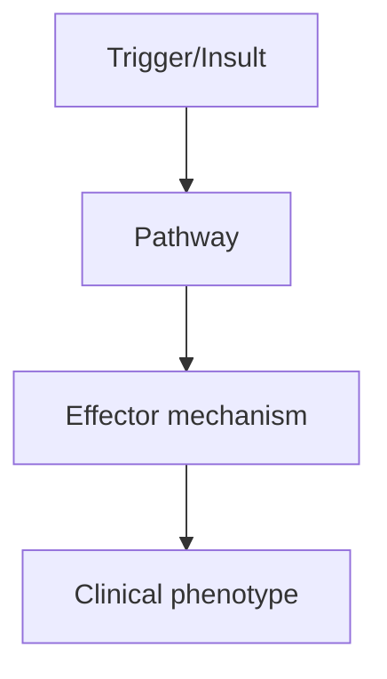
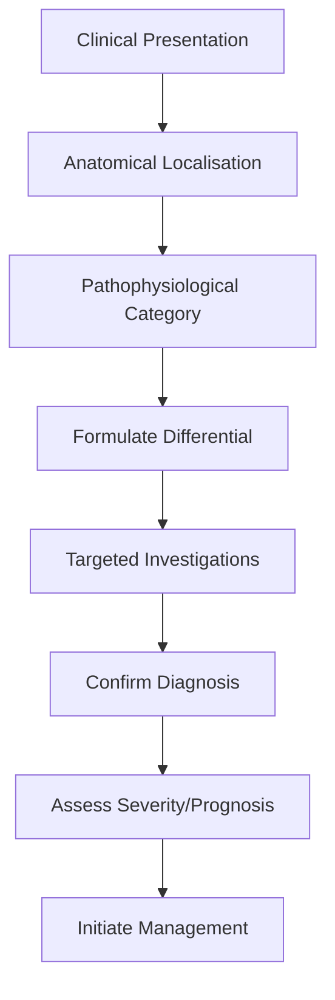
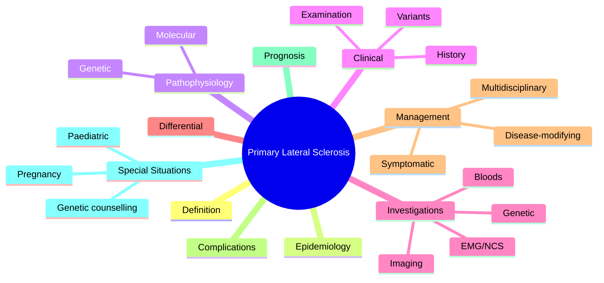

# Primary Lateral Sclerosis

> [!tip] **High-Yield Definition**
> Primary lateral sclerosis (PLS): rare MND variant with UMN signs only, no LMN signs. Spastic paresis, pseudobulbar, emotional lability, slow progression. Diagnosis of exclusion (require ≥4 years of progression without LMN signs to confirm).

---

## Learning Objectives
- [ ] Define the condition and classify its variants
- [ ] Describe epidemiology and inheritance/genetics
- [ ] Explain pathophysiology and molecular mechanisms
- [ ] Recognise clinical features and distinguish from mimics
- [ ] List diagnostic criteria and confirmatory investigations
- [ ] Outline stepwise management (pharmacological, supportive, MDT)
- [ ] Identify red flags, complications, and prognostic factors
- [ ] Apply special situations (pregnancy, paediatric, elderly)
- [ ] Recall FCPS/MRCP high-yield facts, drug doses, genetic patterns
- [ ] Answer viva questions confidently

---

## 1. Definition / Epidemiology / Classification

### Definition
Primary lateral sclerosis (PLS): rare MND variant with UMN signs only, no LMN signs. Spastic paresis, pseudobulbar, emotional lability, slow progression. Diagnosis of exclusion (require ≥4 years of progression without LMN signs to confirm).

### Epidemiology
1-3% of MND. Older onset (50s-60s). Male predominance. Median survival: 10-20 years (much longer than ALS).

### Classification
| Variant | Key Features | Prognosis |
|---------|-------------|-----------|
| | | |

---

## 2. Aetiology / Pathophysiology

### Aetiology
Sporadic: unknown, no SOD1. Rare: familial, adult-onset HSP mimic. Corticospinal tract degeneration, no anterior horn cell loss. No LMN signs (denervation on EMG, no fasciculations, no wasting). Differentiate from UMN-predominant ALS (which eventually develops LMN signs), HSP (genetic, often younger, family history).

### Pathophysiology

---

## 3. Clinical Features

### History
- **Onset/Duration:**
- **Progression:**
- **Key symptoms:**
- **Triggers:**
- **Systemic symptoms:**
- **Drug/Family/Social history:**

### Examination
| Domain | Key Findings | Localisation Value |
|--------|-------------|-------------------|
| | | |

### Specific Clinical Features
Spastic paresis: progressive, asymmetric, often leg onset, UMN signs (spasticity, hyperreflexia, Babinski, clonus). Pseudobulbar: spastic dysarthria, dysphagia, emotional lability (pathological laughing/crying). Spastic quadriparesis (advanced). UMN-type urinary urgency. NO LMN signs (no wasting, fasciculations, weakness without spasticity, no flaccidity). Sensation preserved. No respiratory failure (slow progression, late if ever).

---

## 4. Diagnostic Approach / Algorithm

---

## 5. Investigations

Clinical: progressive UMN signs, no LMN signs for ≥4 years. EMG: NO denervation (chronic neurogenic changes), no fasciculations, normal motor unit morphology. If denervation: re-evaluate for ALS. MRI brain + spine: exclude structural (cord compression, MS, tumour). NCS: normal. Genetic: exclude HSP (SPG4, SPG7, others). Bloods: CK, autoimmune, B12, copper (mimics), HTLV-1 (tropical spastic paraparesis), HIV, syphilis. Lumbar puncture: exclude infection, inflammation.

---

## 6. Differential Diagnosis

| Differential | Distinguishing Features | Key Test |
|--------------|------------------------|----------|
| | | |

---

## 7. Management

Symptomatic: spasticity (baclofen, tizanidine, gabapentin, intrathecal baclofen, BoNT for focal), pseudobulbar (dextromethorphan/quinidine, amitriptyline), emotional lability (SSRI), dysphagia (SLT, thickened fluids, NG/PEG), urinary urgency (anticholinergics, mirabegron), mobility (physiotherapy, walking aids, FES), contractures (stretching, splints). Multidisciplinary: neurologist, OT, PT, SLT, dietitian, social work. No disease-modifying therapy. Riluzole trial (limited benefit). Multidisciplinary MND care (similar to ALS but slower progression).

---

## 8. Drug Interactions / Contraindications / Comorbidity Cautions

| Drug | Interaction / Caution | Management |
|------|----------------------|------------|
| | | |

---

## 9. Procedures (if applicable)

### Procedure:
- **Indications:**
- **Contraindications:**
- **Preparation / Principle:**
- **Complications:**
- **Viva Pearls:**

---

## 10. Complications

| Complication | Frequency | Prevention / Monitoring | Management |
|--------------|-----------|------------------------|------------|
| | | | |

---

## 11. Red Flags / Emergencies

Development of LMN signs (fasciculations, wasting) - suggests ALS. Falls, contractures, pressure sores, dysphagia, aspiration, depression. Progression to respiratory failure (rare, late).

---

## 12. Prognosis

Better than ALS. Median survival 10-20 years. Slow progression over years. Disability accumulates (wheelchair, dysphagia, communication aids). No respiratory failure usually. Some progress to ALS (LMN signs, faster). Quality of life maintained for years. Multidisciplinary care essential.

---

## 13. Topic Correlation

| Related Topic | Link | Key Overlap |
|---------------|------|-------------|
| | | |

---

## 14. Special Situations

| Situation | Consideration |
|-----------|---------------|
| **Pregnancy** | |
| **Lactation** | |
| **Paediatric** | |
| **Elderly / Frail** | |
| **Renal impairment** | |
| **Hepatic impairment** | |
| **Immunocompromised** | |
| **Perioperative** | |
| **Driving / DVLA** | |
| **Occupational** | |

---

## FCPS/MRCP High-Yield Summary

| Category | Key Points |
|----------|------------|
| **Definition** | Primary lateral sclerosis (PLS): rare MND variant with UMN signs only, no LMN signs. Spastic paresis, pseudobulbar, emotional lability, slow progression. Diagnosis of exclusion (require ≥4 years of pr |
| **Epidemiology** | 1-3% of MND. Older onset (50s-60s). Male predominance. Median survival: 10-20 years (much longer than ALS). |
| **Pathophysiology** | |
| **Clinical** | Spastic paresis: progressive, asymmetric, often leg onset, UMN signs (spasticity, hyperreflexia, Babinski, clonus). Pseudobulbar: spastic dysarthria, dysphagia, emotional lability (pathological laughi |
| **Diagnosis** | |
| **Investigations** | Clinical: progressive UMN signs, no LMN signs for ≥4 years. EMG: NO denervation (chronic neurogenic changes), no fasciculations, normal motor unit morphology. If denervation: re-evaluate for ALS. MRI  |
| **Management** | Symptomatic: spasticity (baclofen, tizanidine, gabapentin, intrathecal baclofen, BoNT for focal), pseudobulbar (dextromethorphan/quinidine, amitriptyline), emotional lability (SSRI), dysphagia (SLT, t |
| **Complications** | |
| **Prognosis** | Better than ALS. Median survival 10-20 years. Slow progression over years. Disability accumulates (wheelchair, dysphagia, communication aids). No respiratory failure usually. Some progress to ALS (LMN |
| **Viva Pearls** | |
| **Drug Doses** | |
| **Scoring Systems** | |
| **Genetics** | |
| **Imaging Signs** | |

---

## Viva Questions (PACES/FCPS Style)

1. **Q:** Define Primary Lateral Sclerosis and classify its variants.
   **A:** Based on the definition above.

2. **Q:** What are the key clinical features?
   **A:** Spastic paresis: progressive, asymmetric, often leg onset, UMN signs (spasticity, hyperreflexia, Babinski, clonus). Pseudobulbar: spastic dysarthria, dysphagia, emotional lability (pathological laughing/crying). Spastic quadriparesis (advanced). UMN-type urinary urgency. NO LMN signs (no wasting, fa

3. **Q:** What is the first-line treatment?
   **A:** Based on the management section.

4. **Q:** What are the red flags requiring urgent referral?
   **A:** Development of LMN signs (fasciculations, wasting) - suggests ALS. Falls, contractures, pressure sores, dysphagia, aspiration, depression. Progression to respiratory failure (rare, late).

5. **Q:** What is the prognosis?
   **A:** Better than ALS. Median survival 10-20 years. Slow progression over years. Disability accumulates (wheelchair, dysphagia, communication aids). No respiratory failure usually. Some progress to ALS (LMN signs, faster). Quality of life maintained for years. Multidisciplinary care essential.

6. **Q:** How do you differentiate Primary Lateral Sclerosis from key differentials?
   **A:** Clinical features, investigations, and response to treatment.

7. **Q:** What investigations are most useful?
   **A:** Based on the investigations section.

8. **Q:** Describe the stepwise management approach.
   **A:** Based on the management algorithm.

9. **Q:** What are the emergency presentations?
   **A:** Based on the red flags section.

10. **Q:** How does management change in pregnancy/paediatrics/elderly?
    **A:** Special considerations per population.

---

## Common Confusions / Exam Traps

| Confusion | Clarification |
|-----------|---------------|
| | |

---

## Mnemonics
1. **PLS = Pure Pyramidal** — **P**rimary **L**ateral **S**clerosis = pure **P**yramidal signs (UMN only) without LMN
2. **No LMN, No Fasic, No Atrophy** — PLS rule: NO LMN signs, NO fasciculations, NO muscle atrophy
3. **Slow PLS, Fast ALS** — PLS: very slow progression (>10-20y); ALS: rapid (3-5y)

---

## MCQs (10)

1. **Question:** 55-year-old with slowly progressive spastic quadriparesis, hyperreflexia, bilateral Babinski. No fasciculations, no wasting, EMG normal. Diagnosis?
   **Options:** A. ALS B. Primary Lateral Sclerosis (PLS) C. HSP D. MS
   **Answer:** B
   **Explanation:** Pure UMN signs (spasticity, hyperreflexia, Babinski), NO LMN, normal EMG, slow progression = PLS. ALS would show UMN + LMN.

2. **Question:** What is the diagnostic hallmark of PLS?
   **Options:** A. Both UMN and LMN signs B. Pure UMN signs without LMN involvement C. Sensory loss D. Cognitive decline only
   **Answer:** B
   **Explanation:** PLS = isolated UMN degeneration (corticospinal tract) without anterior horn cell involvement. Some pseudo-bulbar affect.

3. **Question:** What is the expected progression rate of PLS compared to ALS?
   **Options:** A. Faster than ALS B. Same rate C. Much slower (>10-15 years survival vs 3-5y) D. Acute deterioration
   **Answer:** C
   **Explanation:** PLS progression: 10-20+ years. ALS: 3-5y median survival. PLS = benign motor neuron disease variant.

4. **Question:** Which investigation is normal in PLS?
   **Options:** A. MRI brain B. EMG (no denervation) C. NCS D. CSF
   **Answer:** B
   **Explanation:** EMG is NORMAL in PLS (no anterior horn cell loss). If denervation/fibrillations → consider ALS (UMN+LMN).

5. **Question:** A PLS patient develops tongue fasciculations 3 years after onset. Diagnosis revision?
   **Options:** A. Still PLS B. ALS (UMN + LMN now present) C. Kennedy's disease D. Myasthenia
   **Answer:** B
   **Explanation:** Development of LMN signs (fasciculations, wasting) reclassifies as ALS. PLS diagnosis requires NO LMN signs at all (Pringle criteria).

6. **Question:** What is the typical age of onset for PLS?
   **Options:** A. Childhood B. 20-30y C. 50-60y D. >80y
   **Answer:** C
   **Explanation:** PLS onset typically 50-60 years (slightly older than ALS). Both more common in males.

7. **Question:** Which is the most common clinical presentation of PLS?
   **Options:** A. Asymmetric distal weakness B. Slowly progressive spastic paraparesis (symmetric, distal) C. Acute stroke-like onset D. Bulbar onset
   **Answer:** B
   **Explanation:** Classic PLS = slowly progressive, symmetric, spastic lower extremity weakness → ascends to upper limbs/bulbar. Pringle criteria require this progression.

8. **Question:** What is the prevalence of PLS compared to ALS?
   **Options:** A. 10x more common B. Same C. 50-100x less common (rare) D. PLS is more common
   **Answer:** C
   **Explanation:** PLS is rare (~1-3% of motor neuron disease cases). ALS is far more common.

9. **Question:** Pseudo-bulbar affect (pathological laughing/crying) is a feature of:
   **Options:** A. ALS only B. PLS (and other UMN disorders: MS, stroke, PSP) C. Myasthenia gravis D. Guillain-Barré
   **Answer:** B
   **Explanation:** Pseudo-bulbar affect occurs in UMN disorders (PLS, MS, stroke, PSP, ALS). Treated with dextromethorphan/quinidine.

10. **Question:** First-line symptomatic treatment for spasticity in PLS?
    **Options:** A. Baclofen (oral or intrathecal) B. Carbamazepine C. Steroids D. Pyridostigmine
    **Answer:** A
    **Explanation:** Baclofen (GABA-B agonist) first-line for spasticity. Tizanidine, dantrolene, benzodiazepines alternatives. Intrathecal baclofen for severe cases.

---

## SBA Questions (10)

1. **Scenario:** 58-year-old with 4-year history of progressive spastic gait, hyperreflexia in legs, bilateral Babinski. EMG normal. MRI brain/spine normal. Diagnosis?
   **Options:** A. ALS B. Hereditary spastic paraplegia C. PLS (or HSP) D. MS
   **Answer:** C
   **Explanation:** Adult onset, no family history, no EMG denervation = PLS. HSP typically has family history, earlier onset. MRI normal excludes MS, structural lesions.

2. **Scenario:** Patient with PLS has painful leg spasms disrupting sleep. Best initial therapy?
   **Options:** A. Quinine (now restricted) B. Baclofen starting 5mg TDS C. IVIG D. Steroids
   **Answer:** B
   **Explanation:** Baclofen first-line for spasticity/cramps in PLS. Tizanidine alternative. Quinine rarely used (cardiac risk).

3. **Scenario:** PLS patient with progressive dysphagia, FVC now 55%. Next step?
   **Options:** A. PEG tube placement now (FVC >50%, safer) B. Wait until FVC <30% C. NPO with TPN D. Tracheostomy
   **Answer:** A
   **Explanation:** PEG insertion safer when FVC >50%. Waiting until <30% carries high procedural risk. ALS/PLS protocol same.

4. **Scenario:** Patient with PLS develops urinary urgency. Best treatment?
   **Options:** A. Oxybutynin (anticholinergic) B. Tamsulosin (alpha-blocker) C. Topical oestrogen D. Indwelling catheter
   **Answer:** A
   **Explanation:** Detrusor overactivity (UMN bladder) → anticholinergics (oxybutynin, tolterodine). Beta-3 agonist mirabegron alternative. Tamsulosin for BPH.

5. **Scenario:** 4-year history of PLS, mild disability, walks with stick. FVC 75%. Should be on Riluzil?
   **Options:** A. Yes, Riluzole is standard for all MND B. No, Riluzole is for ALS, PLS has no proven DMT C. Only if bulbar onset C. Only with PEG
   **Answer:** B
   **Explanation:** Riluzole and edaravone are for ALS. No proven DMT for PLS. Management is symptomatic (spasticity, dysphagia, mobility, communication).

6. **Scenario:** PLS patient with emotional lability (pathological laughing/crying). Best therapy?
   **Options:** A. SSRI alone B. Dextromethorphan/quinidine (Nuedexta) C. Lithium D. ECT
   **Answer:** B
   **Explanation:** Dextromethorphan/quinidine (Nuedexta) FDA/EMA approved for pseudo-bulbar affect. SSRI alternative. Mechanism: NMDA antagonist + sigma-1 agonist.

7. **Scenario:** Patient with 2-year progressive spastic quadriparesis. Differential includes PLS and ALS. Which test most reliably differentiates?
   **Options:** A. MRI brain B. EMG (looking for denervation) C. CSF D. Genetic panel
   **Answer:** B
   **Explanation:** EMG looking for fibrillation potentials, positive sharp waves, fasciculations in 3+ regions → ALS (UMN+LMN). Normal EMG in pure UMN = PLS.

8. **Scenario:** 62-year-old with PLS, falls while walking. Multi-disciplinary approach should include:
   **Options:** A. PT, OT, orthotics, FES B. Chemotherapy C. Anticoagulation D. CPAP
   **Answer:** A
   **Explanation:** MDT essential: PT (gait, balance), OT (ADL aids), orthotics (AFO), FES for foot drop, wheelchair when needed, SALT for communication, dietitian, psychology.

9. **Scenario:** PLS patient with spasticity, weight loss, fatigue. Most likely contributing factor?
   **Options:** A. Hyperthyroidism B. Increased caloric need from spasticity/dystonia + dysphagia C. Malignancy D. Diabetes
   **Answer:** B
   **Explanation:** Spasticity, fasciculations, dysphagia increase caloric needs while reducing intake. Calorie-dense supplements, dietitian input. PEG when oral fails.

10. **Scenario:** 5-year history PLS, considering trial of intrathecal baclofen pump. Best candidate?
    **Options:** A. Patient with severe spasticity unresponsive to oral baclofen + tizanidine, no contractures B. Mild spasticity C. Patient with dementia D. Wheelchair-bound with pressure sores
    **Answer:** A
    **Explanation:** Intrathecal baclofen for severe spasticity failing oral therapy. Requires: no contractures (still has range), no infection, can tolerate procedure. Test dose first.

---

## Mind Map

---

## Spaced Repetition Trackers

| Review Interval | Date | Score (0-5) | Notes |
|-----------------|------|-------------|-------|
| Day 1 | | | |
| Day 3 | | | |
| Day 7 | | | |
| Day 14 | | | |
| Day 30 | | | |
| Day 90 | | | |

---

## Self-Test Scorecard

| Section | Score /5 | Last Attempt |
|---------|----------|--------------|
| Definition & Epidemiology | | |
| Pathophysiology & Genetics | | |
| Clinical Features | | |
| Investigations | | |
| Differential Diagnosis | | |
| Management | | |
| Complications & Prognosis | | |
| Viva Questions | | |
| MCQs | | |
| SBAs | | |

---

## Tags
**Tags:** #neurology #MND #PLS #UMN-only #spastic-paraparesis #motor-neuron-disease #pseudo-bulbar #slow-progression #no-LMN #rare #FCPS #MRCP

---

## Local Navigation
**Heading Hub:** [[../Hub]]  
**Chapter Hierarchy:** [[Davidson Chapter 25 - Neurology Hierarchy]]  
**Chapter MOC:** [[Neurology MOC]]  
**Drug Reference:** [[../00_Index/Neurology Drug Reference]]  
