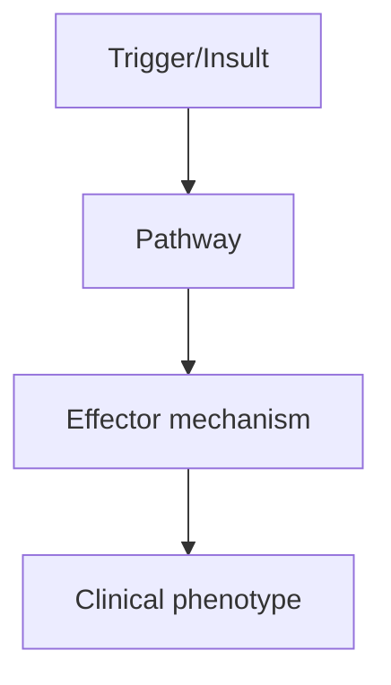
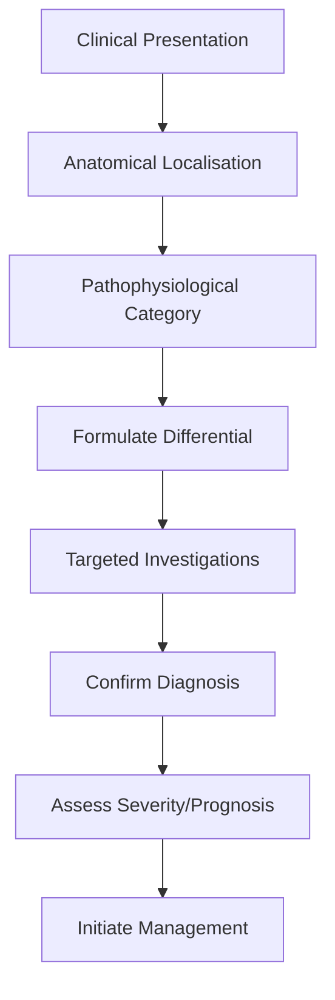
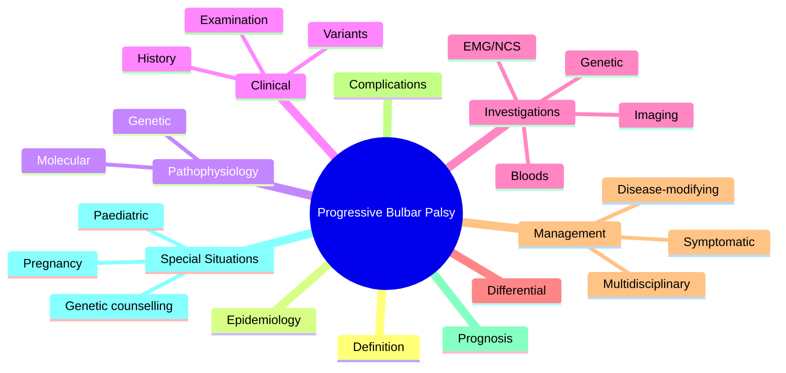

# Progressive Bulbar Palsy

> [!tip] **High-Yield Definition**
> Progressive bulbar palsy (PBP): MND variant with bulbar onset (tongue, pharynx, larynx). Dysarthria, dysphagia, tongue wasting, fasciculations. Often progresses to limb involvement (ALS). Shorter survival than limb-onset ALS.

---

## Learning Objectives
- [ ] Define the condition and classify its variants
- [ ] Describe epidemiology and inheritance/genetics
- [ ] Explain pathophysiology and molecular mechanisms
- [ ] Recognise clinical features and distinguish from mimics
- [ ] List diagnostic criteria and confirmatory investigations
- [ ] Outline stepwise management (pharmacological, supportive, MDT)
- [ ] Identify red flags, complications, and prognostic factors
- [ ] Apply special situations (pregnancy, paediatric, elderly)
- [ ] Recall FCPS/MRCP high-yield facts, drug doses, genetic patterns
- [ ] Answer viva questions confidently

---

## 1. Definition / Epidemiology / Classification

### Definition
Progressive bulbar palsy (PBP): MND variant with bulbar onset (tongue, pharynx, larynx). Dysarthria, dysphagia, tongue wasting, fasciculations. Often progresses to limb involvement (ALS). Shorter survival than limb-onset ALS.

### Epidemiology
20-30% of MND. Older age at onset (60s-70s). Female predominance. Median survival: 1-2 years (shortest MND phenotype).

### Classification
| Variant | Key Features | Prognosis |
|---------|-------------|-----------|
| | | |

---

## 2. Aetiology / Pathophysiology

### Aetiology
TDP-43 (90%), SOD1 (rare). Bulbar motor neurons (CN IX, X, XII) preferentially affected. UMN + LMN at brainstem (bulbar) level. Combined with limb-onset ALS progression in 70-80%.

### Pathophysiology

---

## 3. Clinical Features

### History
- **Onset/Duration:**
- **Progression:**
- **Key symptoms:**
- **Triggers:**
- **Systemic symptoms:**
- **Drug/Family/Social history:**

### Examination
| Domain | Key Findings | Localisation Value |
|--------|-------------|-------------------|
| | | |

### Specific Clinical Features
Dysarthria: flaccid (nasal, breathy, weak) + spastic (strained, harsh) - mixed. Dysphagia: liquids first, then solids, aspiration, weight loss. Tongue: wasting, fasciculations, weakness (tongue deviation to weak side), atrophy. Palate: weak elevation. Jaw jerk: brisk (UMN). Reflexes: brisk. Emotional lability: pseudobulbar affect (pathological laughing/crying). Respiratory: diaphragmatic weakness, SOB, orthopnoea, sleep-disordered breathing. Salivation: thick, drooling. Choking. Weight loss.

---

## 4. Diagnostic Approach / Algorithm

---

## 5. Investigations

Clinical: bulbar UMN + LMN signs without significant limb involvement. EMG: tongue denervation, chronic neurogenic changes, widespread denervation (may be normal early). MRI brain: exclude structural (stroke, tumour, demyelination - pons, medulla). MRI spine: exclude cervical cord compression. NCS: normal (no sensory involvement). Serum: CK mildly elevated, anti-GM1 (negative), paraneoplastic (negative), autoimmune (exclude mimic). Lumbar puncture: exclude infection, inflammation. Spirometry: FVC, SNIP (sniff nasal inspiratory pressure) - respiratory function.

---

## 6. Differential Diagnosis

| Differential | Distinguishing Features | Key Test |
|--------------|------------------------|----------|
| | | |

---

## 7. Management

Multidisciplinary MND clinic: neurologist, palliative, OT, PT, speech and language therapist (SLT), dietitian, respiratory, social work. Bulbar: SLT (communication aids - iPad, lightwriter, AAC), suction, thickened fluids, NG/NJ tube or PEG/RIG (early, FVC >50%), chin tuck, posture. Salivation: hyoscine patch, amitriptyline, glycopyrrolate, botulinum toxin (submandibular). Pseudobulbar affect: dextromethorphan/quinidine, amitriptyline, SSRI. Respiratory: NIV (BiPAP), cough assist, monitoring. MDT: ALS multidisciplinary care, edaravone (where available), riluzole, edaravone. Genetic counselling if familial. Advance care planning, palliative, end-of-life decisions (non-invasive ventilation, gastrostomy).

---

## 8. Drug Interactions / Contraindications / Comorbidity Cautions

| Drug | Interaction / Caution | Management |
|------|----------------------|------------|
| | | |

---

## 9. Procedures (if applicable)

### Procedure:
- **Indications:**
- **Contraindications:**
- **Preparation / Principle:**
- **Complications:**
- **Viva Pearls:**

---

## 10. Complications

| Complication | Frequency | Prevention / Monitoring | Management |
|--------------|-----------|------------------------|------------|
| | | | |

---

## 11. Red Flags / Emergencies

Aspiration pneumonia, respiratory failure, sudden death (bulbar, respiratory), malnutrition, dehydration, falls, choking, depression, suicide, pseudobulbar affect distress.

---

## 12. Prognosis

Poor. Median survival: 1-2 years (shortest MND). 70-80% progress to ALS. Riluzole (modest survival benefit 2-3 months). Edaravone (modest functional benefit). Tofersen (SOD1 only). Multidisciplinary care improves quality of life. Palliative focus. Advance care planning essential.

---

## 13. Topic Correlation

| Related Topic | Link | Key Overlap |
|---------------|------|-------------|
| | | |

---

## 14. Special Situations

| Situation | Consideration |
|-----------|---------------|
| **Pregnancy** | |
| **Lactation** | |
| **Paediatric** | |
| **Elderly / Frail** | |
| **Renal impairment** | |
| **Hepatic impairment** | |
| **Immunocompromised** | |
| **Perioperative** | |
| **Driving / DVLA** | |
| **Occupational** | |

---

## FCPS/MRCP High-Yield Summary

| Category | Key Points |
|----------|------------|
| **Definition** | Progressive bulbar palsy (PBP): MND variant with bulbar onset (tongue, pharynx, larynx). Dysarthria, dysphagia, tongue wasting, fasciculations. Often progresses to limb involvement (ALS). Shorter surv |
| **Epidemiology** | 20-30% of MND. Older age at onset (60s-70s). Female predominance. Median survival: 1-2 years (shortest MND phenotype). |
| **Pathophysiology** | |
| **Clinical** | Dysarthria: flaccid (nasal, breathy, weak) + spastic (strained, harsh) - mixed. Dysphagia: liquids first, then solids, aspiration, weight loss. Tongue: wasting, fasciculations, weakness (tongue deviat |
| **Diagnosis** | |
| **Investigations** | Clinical: bulbar UMN + LMN signs without significant limb involvement. EMG: tongue denervation, chronic neurogenic changes, widespread denervation (may be normal early). MRI brain: exclude structural  |
| **Management** | Multidisciplinary MND clinic: neurologist, palliative, OT, PT, speech and language therapist (SLT), dietitian, respiratory, social work. Bulbar: SLT (communication aids - iPad, lightwriter, AAC), suct |
| **Complications** | |
| **Prognosis** | Poor. Median survival: 1-2 years (shortest MND). 70-80% progress to ALS. Riluzole (modest survival benefit 2-3 months). Edaravone (modest functional benefit). Tofersen (SOD1 only). Multidisciplinary c |
| **Viva Pearls** | |
| **Drug Doses** | |
| **Scoring Systems** | |
| **Genetics** | |
| **Imaging Signs** | |

---

## Viva Questions (PACES/FCPS Style)

1. **Q:** Define Progressive Bulbar Palsy and classify its variants.
   **A:** Based on the definition above.

2. **Q:** What are the key clinical features?
   **A:** Dysarthria: flaccid (nasal, breathy, weak) + spastic (strained, harsh) - mixed. Dysphagia: liquids first, then solids, aspiration, weight loss. Tongue: wasting, fasciculations, weakness (tongue deviation to weak side), atrophy. Palate: weak elevation. Jaw jerk: brisk (UMN). Reflexes: brisk. Emotiona

3. **Q:** What is the first-line treatment?
   **A:** Based on the management section.

4. **Q:** What are the red flags requiring urgent referral?
   **A:** Aspiration pneumonia, respiratory failure, sudden death (bulbar, respiratory), malnutrition, dehydration, falls, choking, depression, suicide, pseudobulbar affect distress.

5. **Q:** What is the prognosis?
   **A:** Poor. Median survival: 1-2 years (shortest MND). 70-80% progress to ALS. Riluzole (modest survival benefit 2-3 months). Edaravone (modest functional benefit). Tofersen (SOD1 only). Multidisciplinary care improves quality of life. Palliative focus. Advance care planning essential.

6. **Q:** How do you differentiate Progressive Bulbar Palsy from key differentials?
   **A:** Clinical features, investigations, and response to treatment.

7. **Q:** What investigations are most useful?
   **A:** Based on the investigations section.

8. **Q:** Describe the stepwise management approach.
   **A:** Based on the management algorithm.

9. **Q:** What are the emergency presentations?
   **A:** Based on the red flags section.

10. **Q:** How does management change in pregnancy/paediatrics/elderly?
    **A:** Special considerations per population.

---

## Common Confusions / Exam Traps

| Confusion | Clarification |
|-----------|---------------|
| | |

---

## Mnemonics
1. **PBP = Pure Bulbar** — **P**rogressive **B**ulbar **P**alsy = bulbar UMN+LMN without limb signs (initially)
2. **Bulbar = Lower Brainstem** — bulbar signs = CN IX, X, XI, XII (tongue, palate, pharynx, larynx)
3. **Pseudobulbar vs Bulbar** — **Pseudobulbar** = UMN (spastic tongue, brisk jaw jerk); **Bulbar** = LMN (wasted, fasciculating tongue)

---

## MCQs (10)

1. **Question:** 60-year-old with progressive dysarthria, dysphagia, tongue wasting and fasciculations, absent gag reflex. Diagnosis?
   **Options:** A. Myasthenia gravis B. Progressive Bulbar Palsy (PBP) C. Stroke D. Bell's palsy
   **Answer:** B
   **Explanation:** PBP = bulbar LMN signs (wasting, fasciculations) ± UMN. Tongue wasting/fasciculations + dysphagia = anterior horn cell of CN XII involvement.

2. **Question:** Which cranial nerves are primarily affected in Progressive Bulbar Palsy?
   **Options:** A. II, III, IV, VI B. VII C. IX, X, XI, XII (bulbar) D. V
   **Answer:** C
   **Explanation:** Bulbar = lower brainstem CNs: IX (glossopharyngeal), X (vagus), XI (spinal accessory), XII (hypoglossal). Affects speech, swallowing, tongue.

3. **Question:** What is the most common cause of death in PBP?
   **Options:** A. Cardiac arrhythmia B. Aspiration pneumonia C. Stroke D. Tumour
   **Answer:** B
   **Explanation:** Aspiration pneumonia (dysphagia → food/liquid into lungs) is the most common cause of death in bulbar-onset MND.

4. **Question:** A PBP patient has tongue fasciculations and a brisk jaw jerk. This indicates:
   **Options:** A. Pure LMN B. Pure UMN C. Both UMN and LMN bulbar signs D. Sensory neuropathy
   **Answer:** C
   **Explanation:** Fasciculations/wasting = LMN; brisk jaw jerk = UMN (trigeminobulbar). Both present = mixed UMN/LMN bulbar pattern (typical of ALS bulbar onset).

5. **Question:** First-line investigation in suspected PBP?
   **Options:** A. MRI brain (exclude structural) + EMG (denervation in tongue/limbs) B. CT chest C. Lumbar puncture D. EEG
   **Answer:** A
   **Explanation:** Exclude structural (MRI brain, especially brainstem) and confirm MND with EMG showing chronic denervation in 3+ regions including bulbar muscles.

6. **Question:** Best initial symptomatic treatment for dysphagia in PBP?
   **Options:** A. Speech and language therapist (SALT) assessment + diet modification + chin-tuck swallow B. Total parenteral nutrition C. Tracheostomy first D. Steroids
   **Answer:** A
   **Explanation:** SALT assessment, diet modification (soft, thickened fluids), chin-tuck, smaller frequent meals. PEG when weight loss >10% or FVC approaching 50%.

7. **Question:** Patient with PBP and FVC 45% predicted. Is PEG placement appropriate?
   **Options:** A. Yes, FVC must be >50% for safe PEG → wait or use radiologically inserted gastrostomy (RIG) B. Yes, regardless of FVC C. No, never in PBP D. Only if patient is DNR
   **Answer:** A
   **Explanation:** PEG requires FVC >50% (sedation/anaesthesia risk). If FVC <50%, use RIG (radiologically inserted gastrostomy) which doesn't need sedation. If RIG not available, NG tube bridging.

8. **Question:** Which speech aid is most useful in advanced PBP with anarthria?
   **Options:** A. AAC (augmentative and alternative communication): Lightwriter, iPad, eye-gaze B. Tracheostomy alone C. Cochlear implant D. Hearing aid
   **Answer:** A
   **Explanation:** AAC devices (text-to-speech, Lightwriter, eye-gaze systems for locked-in patients) preserve communication when speech is lost. Voice banking (Message Banking) earlier useful.

9. **Question:** Drug shown to extend survival in PBP (and other MND)?
   **Options:** A. Riluzole (glutamate antagonist, 2-3 months survival benefit) B. Steroids C. IVIG D. Aspirin
   **Answer:** A
   **Explanation:** Riluzole (Rilutek) 50mg BD = NMDA antagonist, prolongs survival ~2-3 months. Edaravone (free radical scavenger) alternative in some countries.

10. **Question:** What is the typical progression pattern of PBP?
    **Options:** A. Bulbar → limb (becomes ALS); or pure PBP (no limb for 2y) B. Limb only C. Sensory then motor D. Cognitive then motor
    **Answer:** A
    **Explanation:** Bulbar-onset MND: 70-80% progress to limb involvement (becoming ALS). Pure PBP (no limb signs for 2+ years) = rare variant with better prognosis.

---

## SBA Questions (10)

1. **Scenario:** 64-year-old with 6-month progressive dysarthria, dysphagia for solids>liquids, tongue fasciculations. EMG shows fibrillations in tongue, deltoid, quadriceps. Diagnosis?
   **Options:** A. Myasthenia gravis B. Bulbar-onset ALS (PBP with limb involvement) C. Brainstem stroke D. Polymyositis
   **Answer:** B
   **Explanation:** Bulbar LMN + EMG denervation in limb muscles = bulbar-onset ALS. Likely to progress to overt ALS within months.

2. **Scenario:** PBP patient with new aspiration pneumonia, FVC 40%. Best approach to long-term nutrition?
   **Options:** A. PEG (RIG) now given FVC <50% B. PEG regardless of FVC C. NG tube only D. TPN only
   **Answer:** A
   **Explanation:** RIG (radiologically inserted gastrostomy) safer than PEG when FVC <50% (avoids sedation). Improves nutrition, reduces aspiration. TPN is last resort.

3. **Scenario:** PBP patient on Riluzole, develops LFTs 5x ULN. Action?
   **Options:** A. Continue, monitor B. Stop Riluzole; recheck LFTs; consider restarting if normalises C. Double the dose D. Add another hepatotoxic drug
   **Answer:** B
   **Explanation:** Riluzole causes transaminitis (10-15%). >5x ULN = stop. Monitor weekly. Re-challenge cautiously if LFTs normalise and benefit likely. ALT/AST baseline + monthly.

4. **Scenario:** PBP patient with thick saliva (drooling) and dry mouth simultaneously. Best approach?
   **Options:** A. Anticholinergics (hyoscine patch, glycopyrrolate) for drooling; artificial saliva for dry B. Both increase C. Stop all meds D. Reassurance
   **Answer:** A
   **Explanation:** Common paradox: thick saliva causes drooling AND dry mouth (mucus vs serous). Hyoscine patch/glycopyrrolate for drooling; carbocisteine to thin; artificial saliva for dry.

5. **Scenario:** PBP patient with emotional lability, episodic laughing/crying. Most likely mechanism?
   **Options:** A. Frontal dementia B. Pseudo-bulbar affect (disinhibited brainstem reflexes from UMN) C. Depression D. Hypoxia
   **Answer:** B
   **Explanation:** Pseudo-bulbar affect = UMN bulbar lesion → loss of cortical inhibition of brainstem emotional reflexes. Treated with dextromethorphan/quinidine.

6. **Scenario:** PBP patient with stridor at night. Next step?
   **Options:** A. Urgent ENT assessment, consider tracheostomy B. Sedation C. Steroids D. Antibiotics
   **Answer:** A
   **Explanation:** Stridor = vocal cord abductor weakness (CN X) → life-threatening. Urgent ENT/laryngoscopy; CPAP/BiPAP; tracheostomy if progressive. Avoid sedation (resp depression).

7. **Scenario:** PBP patient asks about disease duration. Most honest answer?
   **Options:** A. "You will be fine" B. "Bulbar-onset MND typically 2-3 years from symptom onset, with Riluzole + supportive care" C. "5-10 years" D. "Incurable but normal life"
   **Answer:** B
   **Explanation:** Bulbar-onset MND median survival 2-3y. Pure PBP (no limb for 2y) better prognosis. Riluzole adds ~2-3 months. Honest MDT communication essential.

8. **Scenario:** PBP patient on thickened fluids, FVC 50%, weight loss 5kg in 3 months. Indication for gastrostomy?
   **Options:** A. No, weight stable on diet B. Yes (weight loss >10% body weight or approaching) C. Only at end of life D. Only if FVC <30%
   **Answer:** B
   **Explanation:** Indications for gastrostomy in MND: weight loss >10% body weight, FVC approaching 50%, frequent aspiration, patient wishes. Earlier is better.

9. **Scenario:** PBP patient with weak cough, recurrent chest infections. Best airway clearance?
   **Options:** A. Mechanical insufflation-exsufflation (CoughAssist) B. Antibiotics only C. Postural drainage alone D. Tracheostomy
   **Answer:** A
   **Explanation:** CoughAssist machine (MI-E) clears secretions non-invasively, reduces pneumonia. Breath-stacking, chest physio adjuncts. Tracheostomy is last resort.

10. **Scenario:** PBP patient develops depression. First-line therapy?
    **Options:** A. SSRI (e.g., citalopram) B. ECT C. MAOI D. Lithium
    **Answer:** A
    **Explanation:** SSRI (citalopram, sertraline) first-line for depression in MND. Helps emotional lability too. Avoid TCAs (anticholinergic, worsen drooling/dry mouth).

---

## Mind Map

---

## Spaced Repetition Trackers

| Review Interval | Date | Score (0-5) | Notes |
|-----------------|------|-------------|-------|
| Day 1 | | | |
| Day 3 | | | |
| Day 7 | | | |
| Day 14 | | | |
| Day 30 | | | |
| Day 90 | | | |

---

## Self-Test Scorecard

| Section | Score /5 | Last Attempt |
|---------|----------|--------------|
| Definition & Epidemiology | | |
| Pathophysiology & Genetics | | |
| Clinical Features | | |
| Investigations | | |
| Differential Diagnosis | | |
| Management | | |
| Complications & Prognosis | | |
| Viva Questions | | |
| MCQs | | |
| SBAs | | |

---

## Tags
**Tags:** #neurology #MND #PBP #bulbar #dysphagia #dysarthria #tongue-fasciculations #aspiration #CN-IX-X-XI-XII #PEG #FCPS #MRCP

---

## Local Navigation
**Heading Hub:** [[../Hub]]  
**Chapter Hierarchy:** [[Davidson Chapter 25 - Neurology Hierarchy]]  
**Chapter MOC:** [[Neurology MOC]]  
**Drug Reference:** [[../00_Index/Neurology Drug Reference]]  
