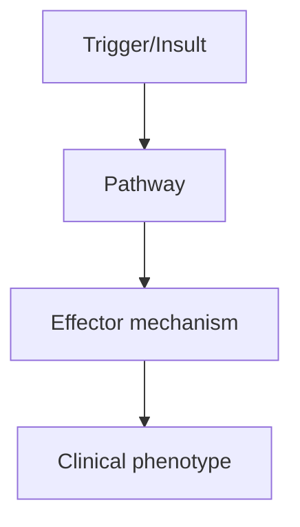
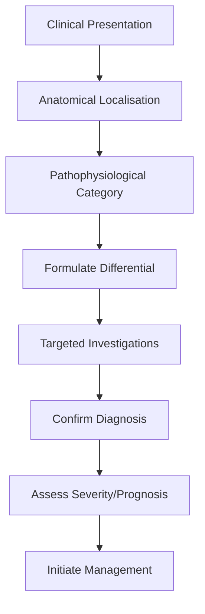
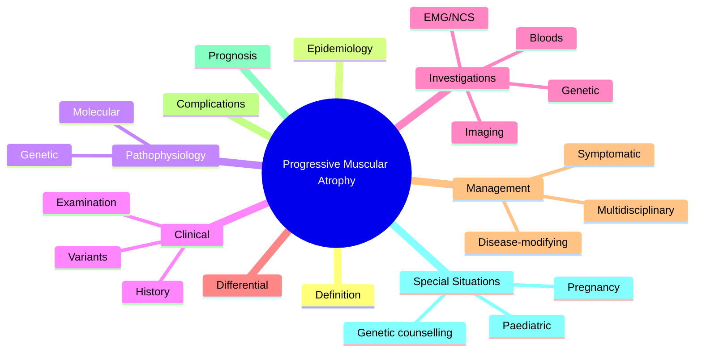

# Progressive Muscular Atrophy

> [!tip] **High-Yield Definition**
> Progressive muscular atrophy (PMA): rare MND variant with LMN signs only, no UMN signs. Distal weakness, wasting, fasciculations. Slow progression. Diagnosis of exclusion (require ≥4 years of progression without UMN signs to confirm).

---

## Learning Objectives
- [ ] Define the condition and classify its variants
- [ ] Describe epidemiology and inheritance/genetics
- [ ] Explain pathophysiology and molecular mechanisms
- [ ] Recognise clinical features and distinguish from mimics
- [ ] List diagnostic criteria and confirmatory investigations
- [ ] Outline stepwise management (pharmacological, supportive, MDT)
- [ ] Identify red flags, complications, and prognostic factors
- [ ] Apply special situations (pregnancy, paediatric, elderly)
- [ ] Recall FCPS/MRCP high-yield facts, drug doses, genetic patterns
- [ ] Answer viva questions confidently

---

## 1. Definition / Epidemiology / Classification

### Definition
Progressive muscular atrophy (PMA): rare MND variant with LMN signs only, no UMN signs. Distal weakness, wasting, fasciculations. Slow progression. Diagnosis of exclusion (require ≥4 years of progression without UMN signs to confirm).

### Epidemiology
5-10% of MND. Adult onset (40s-50s). Male predominance. Median survival: 5-10 years (longer than ALS).

### Classification
| Variant | Key Features | Prognosis |
|---------|-------------|-----------|
| | | |

---

## 2. Aetiology / Pathophysiology

### Aetiology
Sporadic: unknown. No SOD1. Anterior horn cell degeneration without corticospinal tract involvement. Differential: MMN (asymmetric, no UMN, anti-GM1, conduction block), adult SMA (proximal, symmetric, SMN1), Kennedy's (bulbar, gynaecomastia, X-linked), post-polio (remote polio history).

### Pathophysiology

---

## 3. Clinical Features

### History
- **Onset/Duration:**
- **Progression:**
- **Key symptoms:**
- **Triggers:**
- **Systemic symptoms:**
- **Drug/Family/Social history:**

### Examination
| Domain | Key Findings | Localisation Value |
|--------|-------------|-------------------|
| | | |

### Specific Clinical Features
Progressive, asymmetric distal weakness and wasting (legs, hands). Fasciculations (visible, often in vastus lateralis, deltoid, intrinsic hand muscles). Hyporeflexia/areflexia. No UMN signs (no spasticity, no hyperreflexia, no Babinski, no pseudobulbar affect). Cramps, fatigue. Sensation preserved. Bulbar: may develop later. Respiratory: late. NO upper motor neuron signs (no spasticity, no brisk reflexes, no Babinski, no emotional lability).

---

## 4. Diagnostic Approach / Algorithm

---

## 5. Investigations

Clinical: progressive LMN signs, no UMN signs for ≥4 years. EMG: chronic neurogenic changes, widespread denervation, large motor units, no fasciculations in MMN. MRI brain + spine: exclude structural. NCS: normal sensory, normal or reduced CMAP motor, no conduction block (vs MMN). Genetic: SMN1 (SMA), androgen receptor (Kennedy's), SOD1, FUS, C9orf72 (familial ALS), GARS (rare). Bloods: CK (mildly elevated), anti-GM1 (negative, vs MMN), autoimmune, paraneoplastic, B12, copper. CSF: protein (CIDP - high), OCBs (MS - positive). Muscle biopsy: neurogenic atrophy (no inflammation, vs IBM).

---

## 6. Differential Diagnosis

| Differential | Distinguishing Features | Key Test |
|--------------|------------------------|----------|
| | | |

---

## 7. Management

Symptomatic: weakness (physiotherapy, OT, walking aids, FES, splints), fasciculations/cramps (quinine, magnesium, gabapentin, baclofen), fatigue (energy conservation, pacing), bulbar (SLT, NG/PEG, communication aids), respiratory (monitoring, NIV late), weight loss (dietitian, supplements), constipation, saliva management, mood (depression, anxiety). Multidisciplinary: neurologist, MND clinic, palliative, OT, PT, SLT, dietitian, respiratory, social work, OT, neuropsychology. Riluzole (modest survival benefit). Edaravone (some functional benefit). Genetic counselling if familial. Advance care planning. Reassess if UMN signs develop (progression to ALS).

---

## 8. Drug Interactions / Contraindications / Comorbidity Cautions

| Drug | Interaction / Caution | Management |
|------|----------------------|------------|
| | | |

---

## 9. Procedures (if applicable)

### Procedure:
- **Indications:**
- **Contraindications:**
- **Preparation / Principle:**
- **Complications:**
- **Viva Pearls:**

---

## 10. Complications

| Complication | Frequency | Prevention / Monitoring | Management |
|--------------|-----------|------------------------|------------|
| | | | |

---

## 11. Red Flags / Emergencies

Development of UMN signs (suggests ALS progression). Falls, aspiration, respiratory failure, contractures, pressure sores, malnutrition, depression. SMA mimics in young adults: proximal weakness, family history.

---

## 12. Prognosis

Better than ALS. Median survival 5-10 years. Slow progression over years. Disability accumulates (wheelchair, eventually respiratory). Some progress to ALS. Multidisciplinary care essential. Quality of life maintained for years.

---

## 13. Topic Correlation

| Related Topic | Link | Key Overlap |
|---------------|------|-------------|
| | | |

---

## 14. Special Situations

| Situation | Consideration |
|-----------|---------------|
| **Pregnancy** | |
| **Lactation** | |
| **Paediatric** | |
| **Elderly / Frail** | |
| **Renal impairment** | |
| **Hepatic impairment** | |
| **Immunocompromised** | |
| **Perioperative** | |
| **Driving / DVLA** | |
| **Occupational** | |

---

## FCPS/MRCP High-Yield Summary

| Category | Key Points |
|----------|------------|
| **Definition** | Progressive muscular atrophy (PMA): rare MND variant with LMN signs only, no UMN signs. Distal weakness, wasting, fasciculations. Slow progression. Diagnosis of exclusion (require ≥4 years of progress |
| **Epidemiology** | 5-10% of MND. Adult onset (40s-50s). Male predominance. Median survival: 5-10 years (longer than ALS). |
| **Pathophysiology** | |
| **Clinical** | Progressive, asymmetric distal weakness and wasting (legs, hands). Fasciculations (visible, often in vastus lateralis, deltoid, intrinsic hand muscles). Hyporeflexia/areflexia. No UMN signs (no spasti |
| **Diagnosis** | |
| **Investigations** | Clinical: progressive LMN signs, no UMN signs for ≥4 years. EMG: chronic neurogenic changes, widespread denervation, large motor units, no fasciculations in MMN. MRI brain + spine: exclude structural. |
| **Management** | Symptomatic: weakness (physiotherapy, OT, walking aids, FES, splints), fasciculations/cramps (quinine, magnesium, gabapentin, baclofen), fatigue (energy conservation, pacing), bulbar (SLT, NG/PEG, com |
| **Complications** | |
| **Prognosis** | Better than ALS. Median survival 5-10 years. Slow progression over years. Disability accumulates (wheelchair, eventually respiratory). Some progress to ALS. Multidisciplinary care essential. Quality o |
| **Viva Pearls** | |
| **Drug Doses** | |
| **Scoring Systems** | |
| **Genetics** | |
| **Imaging Signs** | |

---

## Viva Questions (PACES/FCPS Style)

1. **Q:** Define Progressive Muscular Atrophy and classify its variants.
   **A:** Based on the definition above.

2. **Q:** What are the key clinical features?
   **A:** Progressive, asymmetric distal weakness and wasting (legs, hands). Fasciculations (visible, often in vastus lateralis, deltoid, intrinsic hand muscles). Hyporeflexia/areflexia. No UMN signs (no spasticity, no hyperreflexia, no Babinski, no pseudobulbar affect). Cramps, fatigue. Sensation preserved. 

3. **Q:** What is the first-line treatment?
   **A:** Based on the management section.

4. **Q:** What are the red flags requiring urgent referral?
   **A:** Development of UMN signs (suggests ALS progression). Falls, aspiration, respiratory failure, contractures, pressure sores, malnutrition, depression. SMA mimics in young adults: proximal weakness, family history.

5. **Q:** What is the prognosis?
   **A:** Better than ALS. Median survival 5-10 years. Slow progression over years. Disability accumulates (wheelchair, eventually respiratory). Some progress to ALS. Multidisciplinary care essential. Quality of life maintained for years.

6. **Q:** How do you differentiate Progressive Muscular Atrophy from key differentials?
   **A:** Clinical features, investigations, and response to treatment.

7. **Q:** What investigations are most useful?
   **A:** Based on the investigations section.

8. **Q:** Describe the stepwise management approach.
   **A:** Based on the management algorithm.

9. **Q:** What are the emergency presentations?
   **A:** Based on the red flags section.

10. **Q:** How does management change in pregnancy/paediatrics/elderly?
    **A:** Special considerations per population.

---

## Common Confusions / Exam Traps

| Confusion | Clarification |
|-----------|---------------|
| | |

---

## Mnemonics
1. **PMA = Pure LMN** — **P**rogressive **M**uscular **A**trophy = pure **L**ower **M**otor **N**euron signs only
2. **No UMN, No UMN** — PMA rule: NO UMN signs, NO spasticity, NO Babinski
3. **PMA → ALS conversion** — 20-30% of PMA develop UMN signs within 2-3y → reclassified ALS

---

## MCQs (10)

1. **Question:** 50-year-old with progressive proximal weakness, wasting, fasciculations. Reflexes reduced/absent. No spasticity, no Babinski, no hyperreflexia. Diagnosis?
   **Options:** A. ALS B. Progressive Muscular Atrophy (PMA) C. Polymyositis D. Myasthenia
   **Answer:** B
   **Explanation:** PMA = pure LMN signs (wasting, weakness, fasciculations, reduced reflexes) without UMN signs. ALS would have UMN + LMN.

2. **Question:** What distinguishes PMA from ALS clinically?
   **Options:** A. PMA has UMN signs, ALS does not B. PMA has only LMN signs; ALS has both UMN and LMN C. ALS is X-linked D. PMA has sensory loss
   **Answer:** B
   **Explanation:** PMA = pure LMN. ALS = UMN + LMN. Both anterior horn cell diseases. ~20-30% of PMA develop UMN signs → reclassified ALS.

3. **Question:** EMG findings in PMA?
   **Options:** A. Normal B. Chronic neurogenic changes (fibrillations, fasciculations, large motor units) C. Decrement on RNS D. Myotonic discharges
   **Answer:** B
   **Explanation:** EMG shows chronic denervation: fibrillations, positive sharp waves, fasciculations, large motor units, reduced recruitment. Decrement = NMJ. Myotonic = myotonia.

4. **Question:** What is the prevalence of PMA compared to ALS?
   **Options:** A. PMA more common B. PMA accounts for ~5-10% of MND cases C. Same prevalence D. PMA is 50% of MND
   **Answer:** B
   **Explanation:** PMA accounts for ~5-10% of MND cases. ALS is most common (~80-90%). PLS ~2-3%, PBP ~5-10%.

5. **Question:** Median survival in PMA vs ALS?
   **Options:** A. PMA worse than ALS B. PMA better (~5-7y) than ALS (3-5y) C. Same D. PMA always fatal in 1y
   **Answer:** B
   **Explanation:** PMA median survival ~5-7 years (better than ALS 3-5y). Slower progression, no UMN involvement, no pseudo-bulbar affect.

6. **Question:** 45-year-old with PMA develops brisk reflexes and Babinski 3 years after onset. Revised diagnosis?
   **Options:** A. Still PMA B. ALS (UMN + LMN now present) C. HSP D. PLS
   **Answer:** B
   **Explanation:** Development of UMN signs in a patient previously pure LMN = ALS reclassification. PMA is sometimes "ALS in evolution".

7. **Question:** Which investigation is most useful to confirm PMA diagnosis?
   **Options:** A. EMG (chronic denervation, no UMN features) B. Muscle biopsy alone C. MRI brain D. Genetic panel
   **Answer:** A
   **Explanation:** EMG confirms anterior horn cell disease (fibrillations, fasciculations, large motor units in multiple regions). Excludes myopathy, NMJ, sensory neuropathy.

8. **Question:** First-line treatment for muscle cramps in PMA?
   **Options:** A. Quinine (rarely) B. Magnesium, stretching, baclofen C. Steroids D. IVIG
   **Answer:** B
   **Explanation:** Stretching, hydration, magnesium, baclofen, gabapentin first-line. Quinine used historically but cardiac QT risk; restricted use.

9. **Question:** Sensation is typically:
   **Options:** A. Lost in PMA B. Preserved in PMA (and all MND) C. Painful neuropathy D. Variable
   **Answer:** B
   **Explanation:** Sensation preserved in ALL motor neuron diseases (PMA, ALS, PLS, PBP). Anterior horn cell disease does not affect sensory neurons.

10. **Question:** Best multidisciplinary approach for PMA patient with progressive proximal weakness?
    **Options:** A. PT, OT, orthotics, MDT supportive care + Riluzole B. Chemotherapy C. Steroids D. Plasmapheresis
    **Answer:** A
    **Explanation:** PMA management: Riluzole (modest survival benefit), MDT (PT, OT, SALT, dietitian, orthotics, psychology, palliative), symptomatic. No curative treatment.

---

## SBA Questions (10)

1. **Scenario:** 52-year-old with 2-year history of progressive proximal weakness, wasting, fasciculations. Reflexes reduced. No UMN signs. EMG shows chronic denervation in 3 regions. Diagnosis?
   **Options:** A. ALS B. Progressive Muscular Atrophy (PMA) C. Inclusion body myositis D. CIDP
   **Answer:** B
   **Explanation:** Pure LMN signs, chronic neurogenic EMG in 3+ regions, no UMN, no sensory = PMA. ALS would have UMN signs.

2. **Scenario:** PMA patient with new brisk knee reflexes and bilateral Babinski 18 months after diagnosis. Management change?
   **Options:** A. Continue same B. Reclassify as ALS; update patient, MDT, advance care planning C. Stop Riluzole D. Discharge from clinic
   **Answer:** B
   **Explanation:** UMN signs reclassify as ALS. Update patient, MDT, prognosis discussion (3-5y), advance care planning, BiPAP, PEG timing.

3. **Scenario:** PMA patient with progressive dysphagia, weight loss 6kg in 3 months, FVC 65%. Next step?
   **Options:** A. SALT assessment, diet modification, consider gastrostomy when FVC <50% B. PEG now C. NPO with TPN D. Wait
   **Answer:** A
   **Explanation:** SALT assessment, calorie-dense supplements, monitor FVC. Plan PEG/RIG when FVC approaches 50% (don't wait until crisis).

4. **Scenario:** Patient with PMA develops foot drop. Best intervention?
   **Options:** A. Ankle-foot orthosis (AFO) B. Bedrest C. Surgery D. Steroids
   **Answer:** A
   **Explanation:** AFO (ankle-foot orthosis) is first-line for foot drop in PMA (and any cause) — improves gait, prevents falls, conserves energy.

5. **Scenario:** PMA patient with fatigue, weight loss, FVC 60%, no respiratory symptoms. Action?
   **Options:** A. Reassure B. Baseline sleep study + consider nocturnal NIV if symptomatic C. Tracheostomy D. Intubate
   **Answer:** B
   **Explanation:** Early respiratory involvement often asymptomatic. Baseline sleep study (or morning ABG) + FVC trend. Nocturnal NIV (BiPAP) when symptomatic or FVC <50%.

6. **Scenario:** PMA patient considering Riluzole. Counselling points?
   **Options:** A. Cure; no side effects B. Modest survival benefit (2-3 months); monitor LFTs monthly; expensive C. Causes hair loss D. Improves strength
   **Answer:** B
   **Explanation:** Riluzole modestly prolongs survival (~2-3 months), does NOT improve strength. Side effects: nausea, weakness, transaminitis (monitor LFTs monthly for first year).

7. **Scenario:** PMA patient with new low back pain, no trauma. Best investigation?
   **Options:** A. MRI spine (exclude mechanical, metastasis) B. Reassure C. Steroids D. Wait
   **Answer:** A
   **Explanation:** PMA patients can have coexistent pathology. Mechanical back pain common but exclude metastasis (especially in older patients), cord/cauda equina compression.

8. **Scenario:** Patient with PMA, 4-year disease duration, walks with frame, FVC 75%, mild dysphagia. Is respiratory failure imminent?
   **Options:** A. Yes, in 1 month B. No; monitor FVC and symptoms; plan for NIV when FVC <50% or symptomatic C. Yes, urgent intubation D. Tracheostomy now
   **Answer:** B
   **Explanation:** FVC 75% with mild symptoms is NOT imminent failure. Monitor FVC 3-monthly, sleep study if symptoms. Plan NIV (non-invasive) when FVC <50% or symptomatic hypoventilation.

9. **Scenario:** PMA patient with cognitive impairment, behavioural change. Most likely diagnosis?
   **Options:** A. C9orf72 mutation (MND-FTD spectrum) B. Alzheimer's C. Vascular dementia D. Depression
   **Answer:** A
   **Explanation:** C9orf72 hexanucleotide repeat expansion = MND-FTD (frontotemporal dementia) spectrum. 5-15% of MND patients have FTD. Genetic testing + neuropsychology.

10. **Scenario:** End-stage PMA, FVC 25%, severe dyspnoea, family distressed. Best approach?
    **Options:** A. Intubation + ICU B. MDT meeting: clarify goals of care, NIV, palliative, opioids, anxiolytics; respect advance directive C. Abandon D. Dialysis
    **Answer:** B
    **Explanation:** End-stage MND: MDT, clarify goals, NIV for dyspnoea, opioids (morphine) for breathlessness, benzodiazepines (midazolam) for anxiety. Respect advance directive (DNR may be appropriate).

---

## Mind Map

---

## Spaced Repetition Trackers

| Review Interval | Date | Score (0-5) | Notes |
|-----------------|------|-------------|-------|
| Day 1 | | | |
| Day 3 | | | |
| Day 7 | | | |
| Day 14 | | | |
| Day 30 | | | |
| Day 90 | | | |

---

## Self-Test Scorecard

| Section | Score /5 | Last Attempt |
|---------|----------|--------------|
| Definition & Epidemiology | | |
| Pathophysiology & Genetics | | |
| Clinical Features | | |
| Investigations | | |
| Differential Diagnosis | | |
| Management | | |
| Complications & Prognosis | | |
| Viva Questions | | |
| MCQs | | |
| SBAs | | |

---

## Tags
**Tags:** #neurology #MND #PMA #LMN-only #motor-neuron-disease #proximal-weakness #wasting #fasciculations #areflexia #chronic-neurogenic-EMG #FCPS #MRCP

---

## Local Navigation
**Heading Hub:** [[../Hub]]  
**Chapter Hierarchy:** [[Davidson Chapter 25 - Neurology Hierarchy]]  
**Chapter MOC:** [[Neurology MOC]]  
**Drug Reference:** [[../00_Index/Neurology Drug Reference]]  
