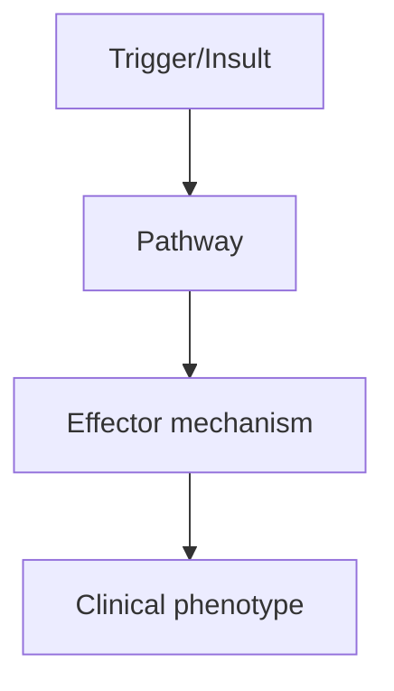
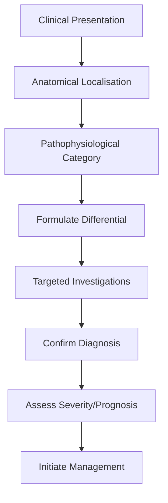
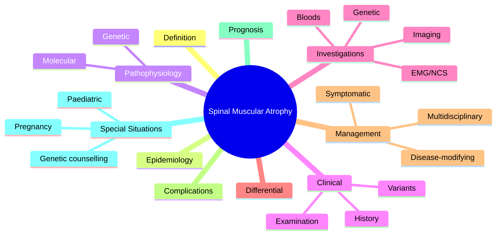

# Spinal Muscular Atrophy

> [!tip] **High-Yield Definition**
> Spinal muscular atrophy (SMA): autosomal recessive motor neuron disease, SMN1 gene deletion/mutation. Progressive proximal weakness, wasting. Spectrum from severe (type 1, Werdnig-Hoffmann, <6mo) to adult (type 4). Treatable with disease-modifying therapies (nusinersen, risdiplam, onasemnogene).

---

## Learning Objectives
- [ ] Define the condition and classify its variants
- [ ] Describe epidemiology and inheritance/genetics
- [ ] Explain pathophysiology and molecular mechanisms
- [ ] Recognise clinical features and distinguish from mimics
- [ ] List diagnostic criteria and confirmatory investigations
- [ ] Outline stepwise management (pharmacological, supportive, MDT)
- [ ] Identify red flags, complications, and prognostic factors
- [ ] Apply special situations (pregnancy, paediatric, elderly)
- [ ] Recall FCPS/MRCP high-yield facts, drug doses, genetic patterns
- [ ] Answer viva questions confidently

---

## 1. Definition / Epidemiology / Classification

### Definition
Spinal muscular atrophy (SMA): autosomal recessive motor neuron disease, SMN1 gene deletion/mutation. Progressive proximal weakness, wasting. Spectrum from severe (type 1, Werdnig-Hoffmann, <6mo) to adult (type 4). Treatable with disease-modifying therapies (nusinersen, risdiplam, onasemnogene).

### Epidemiology
Incidence: 1/10,000 live births. Carrier frequency: 1/40-50. SMN2 copy number modifies severity. Type 1 (45%, severe), type 2 (20%, intermediate), type 3 (30%, juvenile), type 4 (<5%, adult).

### Classification
| Variant | Key Features | Prognosis |
|---------|-------------|-----------|
| | | |

---

## 2. Aetiology / Pathophysiology

### Aetiology
SMN1 gene (chromosome 5q) deletion/mutation. SMN protein: motor neuron survival. SMN2: paralogue, modifies severity (more copies = milder). Complete loss SMN1 = type 1. Hypomorphic alleles = type 2-4. Anterior horn cell degeneration. Genetic: AR inheritance.

### Pathophysiology

---

## 3. Clinical Features

### History
- **Onset/Duration:**
- **Progression:**
- **Key symptoms:**
- **Triggers:**
- **Systemic symptoms:**
- **Drug/Family/Social history:**

### Examination
| Domain | Key Findings | Localisation Value |
|--------|-------------|-------------------|
| | | |

### Specific Clinical Features
Type 1 (Werdnig-Hoffmann): severe, <6mo onset, never sits, swallowing/breathing difficulty, tongue fasciculations, death by 2y (without treatment). Type 2 (Dubowitz): intermediate, 6-18mo onset, sits but never stands, scoliosis, respiratory involvement, survive to adulthood. Type 3 (Kugelberg-Welander): juvenile, >18mo onset, stands and walks but may lose, scoliosis, life expectancy normal. Type 4: adult onset, mild, slow progression, normal life expectancy. All: progressive proximal weakness (legs > arms), wasting, fasciculations, areflexia, tongue fasciculations, normal sensation, normal cognition.

---

## 4. Diagnostic Approach / Algorithm

---

## 5. Investigations

Genetic: SMN1 homozygous deletion (95%), SMN1 point mutation (5%). SMN2 copy number (prognostic). EMG: chronic neurogenic changes, large motor units, denervation. CK: mildly elevated (often normal early). Muscle biopsy: neurogenic atrophy, fibre type grouping. MRI: muscle atrophy (fatty infiltration), normal brain/spine. NCS: normal sensory, normal or reduced CMAP motor. Bloods: CK, autoimmune (exclude mimics), paraneoplastic. Newborn screening: SMN1 deletion (UK, US - emerging).

---

## 6. Differential Diagnosis

| Differential | Distinguishing Features | Key Test |
|--------------|------------------------|----------|
| | | |

---

## 7. Management

Disease-modifying: (1) Nusinersen (Spinraza) - intrathecal antisense oligonucleotide, 12mg loading (4 doses in 2 months), then maintenance q4months. (2) Risdiplam (Evrysdi) - oral SMN2 splicing modifier, daily, weight-based, <2y 0.2mg/kg, ≥2y 5mg. (3) Onasemnogene abeparvovec (Zolgensma) - AAV9 gene therapy, single IV infusion, <2y, SMA type 1 only (also approved type 2 in some countries), expensive. Best outcomes: treated early (pre-symptomatic or early symptomatic). Multidisciplinary: neurologist, palliative, respiratory, orthopaedic (scoliosis), physio, OT, dietitian, genetic counselling. Supportive: NIV (BiPAP), cough assist, scoliosis surgery, feeding (NG/PEG). Surveillance: respiratory (FVC, SNIP), bulbar, scoliosis, weight, mobility, function (CHOP-INTEND, HFMSE, MFM).

---

## 8. Drug Interactions / Contraindications / Comorbidity Cautions

| Drug | Interaction / Caution | Management |
|------|----------------------|------------|
| | | |

---

## 9. Procedures (if applicable)

### Procedure:
- **Indications:**
- **Contraindications:**
- **Preparation / Principle:**
- **Complications:**
- **Viva Pearls:**

---

## 10. Complications

| Complication | Frequency | Prevention / Monitoring | Management |
|--------------|-----------|------------------------|------------|
| | | | |

---

## 11. Red Flags / Emergencies

Respiratory failure (scoliosis, weak cough), aspiration, scoliosis (surgical), fractures (osteoporosis, falls), failure to thrive, progressive weakness, anaesthetic complications (succinylcholine - hyperkalaemia).

---

## 12. Prognosis

Improved with disease-modifying therapies. Type 1: previously fatal in infancy, now treated patients achieve milestones (sit, stand, walk with treatment). Type 2: improved motor function, slower decline. Type 3-4: stabilised, maintained function. Best outcomes: treated pre-symptomatically (newborn screening). Multidisciplinary care essential. Lifelong treatment.

---

## 13. Topic Correlation

| Related Topic | Link | Key Overlap |
|---------------|------|-------------|
| | | |

---

## 14. Special Situations

| Situation | Consideration |
|-----------|---------------|
| **Pregnancy** | |
| **Lactation** | |
| **Paediatric** | |
| **Elderly / Frail** | |
| **Renal impairment** | |
| **Hepatic impairment** | |
| **Immunocompromised** | |
| **Perioperative** | |
| **Driving / DVLA** | |
| **Occupational** | |

---

## FCPS/MRCP High-Yield Summary

| Category | Key Points |
|----------|------------|
| **Definition** | Spinal muscular atrophy (SMA): autosomal recessive motor neuron disease, SMN1 gene deletion/mutation. Progressive proximal weakness, wasting. Spectrum from severe (type 1, Werdnig-Hoffmann, <6mo) to a |
| **Epidemiology** | Incidence: 1/10,000 live births. Carrier frequency: 1/40-50. SMN2 copy number modifies severity. Type 1 (45%, severe), type 2 (20%, intermediate), typ |
| **Pathophysiology** | |
| **Clinical** | Type 1 (Werdnig-Hoffmann): severe, <6mo onset, never sits, swallowing/breathing difficulty, tongue fasciculations, death by 2y (without treatment). Type 2 (Dubowitz): intermediate, 6-18mo onset, sits  |
| **Diagnosis** | |
| **Investigations** | Genetic: SMN1 homozygous deletion (95%), SMN1 point mutation (5%). SMN2 copy number (prognostic). EMG: chronic neurogenic changes, large motor units, denervation. CK: mildly elevated (often normal ear |
| **Management** | Disease-modifying: (1) Nusinersen (Spinraza) - intrathecal antisense oligonucleotide, 12mg loading (4 doses in 2 months), then maintenance q4months. (2) Risdiplam (Evrysdi) - oral SMN2 splicing modifi |
| **Complications** | |
| **Prognosis** | Improved with disease-modifying therapies. Type 1: previously fatal in infancy, now treated patients achieve milestones (sit, stand, walk with treatment). Type 2: improved motor function, slower decli |
| **Viva Pearls** | |
| **Drug Doses** | |
| **Scoring Systems** | |
| **Genetics** | |
| **Imaging Signs** | |

---

## Viva Questions (PACES/FCPS Style)

1. **Q:** Define Spinal Muscular Atrophy and classify its variants.
   **A:** Based on the definition above.

2. **Q:** What are the key clinical features?
   **A:** Type 1 (Werdnig-Hoffmann): severe, <6mo onset, never sits, swallowing/breathing difficulty, tongue fasciculations, death by 2y (without treatment). Type 2 (Dubowitz): intermediate, 6-18mo onset, sits but never stands, scoliosis, respiratory involvement, survive to adulthood. Type 3 (Kugelberg-Weland

3. **Q:** What is the first-line treatment?
   **A:** Based on the management section.

4. **Q:** What are the red flags requiring urgent referral?
   **A:** Respiratory failure (scoliosis, weak cough), aspiration, scoliosis (surgical), fractures (osteoporosis, falls), failure to thrive, progressive weakness, anaesthetic complications (succinylcholine - hyperkalaemia).

5. **Q:** What is the prognosis?
   **A:** Improved with disease-modifying therapies. Type 1: previously fatal in infancy, now treated patients achieve milestones (sit, stand, walk with treatment). Type 2: improved motor function, slower decline. Type 3-4: stabilised, maintained function. Best outcomes: treated pre-symptomatically (newborn s

6. **Q:** How do you differentiate Spinal Muscular Atrophy from key differentials?
   **A:** Clinical features, investigations, and response to treatment.

7. **Q:** What investigations are most useful?
   **A:** Based on the investigations section.

8. **Q:** Describe the stepwise management approach.
   **A:** Based on the management algorithm.

9. **Q:** What are the emergency presentations?
   **A:** Based on the red flags section.

10. **Q:** How does management change in pregnancy/paediatrics/elderly?
    **A:** Special considerations per population.

---

## Common Confusions / Exam Traps

| Confusion | Clarification |
|-----------|---------------|
| | |

---

## Mnemonics
1. **SMA Types 1-4 by SMN2 copies** — **T**ype 1 (no SMN2): severe infantile, **T**ype 2-3 (1-3 SMN2): intermediate, **T**ype 4 (4+ SMN2): adult onset
2. **Werdnig-Hoffmann 1, Dubowitz 2, Kugelberg-Welander 3** — Type 1 Werdnig-Hoffmann, Type 2 Dubowitz, Type 3 Kugelberg-Welander
3. **SMN1 = Survival Motor Neuron 1** — chromosome 5q, deleted/mutated in 95% of SMA

---

## MCQs (10)

1. **Question:** 6-month-old infant with progressive proximal weakness, tongue fasciculations, areflexia, severe hypotonia. Genetic test confirms homozygous SMN1 deletion. Diagnosis?
   **Options:** A. Duchenne muscular dystrophy B. SMA Type 1 (Werdnig-Hoffmann) C. Congenital myopathy D. Pompe disease
   **Answer:** B
   **Explanation:** SMA Type 1 = severe infantile onset, homozygous SMN1 deletion, tongue fasciculations, never sits. Death typically by 2y without treatment.

2. **Question:** Which gene is mutated in SMA?
   **Options:** A. DMD B. SMN1 (Survival Motor Neuron 1) C. PMP22 D. MPZ
   **Answer:** B
   **Explanation:** SMN1 gene on chromosome 5q. 95% have homozygous exon 7 deletion. SMN2 is paralogue; copy number modifies severity (more SMN2 = milder).

3. **Question:** What is the inheritance pattern of SMA?
   **Options:** A. X-linked recessive B. Autosomal dominant C. Autosomal recessive D. Mitochondrial
   **Answer:** C
   **Explanation:** Autosomal recessive. Both parents carriers (1/40-50 frequency). 25% chance of affected child if both parents carriers.

4. **Question:** SMA Type 2 (Dubowitz) clinical features?
   **Options:** A. Severe, never sits, death by 2y B. Intermediate, sits but never stands, survive to adulthood C. Adult onset, mild, normal life D. Acute infantile
   **Answer:** B
   **Explanation:** SMA Type 2: onset 6-18mo, can sit but never stand, scoliosis, respiratory involvement, survive to adulthood (with care).

5. **Question:** SMA Type 3 (Kugelberg-Welander) clinical features?
   **Options:** A. Severe infantile B. Adult onset mild C. Juvenile onset, stands and walks but may lose, normal life expectancy D. Bulbar onset
   **Answer:** C
   **Explanation:** SMA Type 3: onset >18mo, walks independently (may lose ambulation in adolescence), scoliosis, normal life expectancy, proximal weakness.

6. **Question:** Disease-modifying therapy approved for SMA?
   **Options:** A. Steroids B. Nusinersen (Spinraza, antisense oligonucleotide, intrathecal) C. IVIG D. Aspirin
   **Answer:** B
   **Explanation:** Nusinersen (Spinraza) = antisense oligonucleotide modifying SMN2 splicing → more functional SMN protein. Intrathecal injection. Gene therapy: onasemnogene abeparvovec (Zolgensma, single IV). Risdiplam (oral).

7. **Question:** How does Nusinersen work?
   **Options:** A. Replaces SMN1 gene B. Modifies SMN2 splicing to include exon 7 → more functional SMN protein C. Inhibits BACE1 D. Immune modulation
   **Answer:** B
   **Explanation:** Nusinersen = antisense oligo binds SMN2 pre-mRNA, displaces splicing silencers, includes exon 7 → produces full-length functional SMN protein. SMN2 normally skips exon 7 → truncated unstable protein.

8. **Question:** Newborn screening for SMA is performed because:
   **Options:** A. SMA is treatable if diagnosed early (pre-symptomatic treatment better) B. There's a cure C. It's required by law D. For research
   **Answer:** A
   **Explanation:** Pre-symptomatic treatment (Nusinersen, gene therapy, risdiplam) dramatically improves outcomes. NBS added in many countries (US, EU). SMN1 deletion assay on dried blood spot.

9. **Question:** Carrier frequency of SMA in the general population?
   **Options:** A. 1/1000 B. 1/100 C. 1/40-50 D. 1/10
   **Answer:** C
   **Explanation:** Carrier frequency ~1/40-50. Autosomal recessive; couples with both carriers have 25% affected child. Genetic counselling and prenatal testing available.

10. **Question:** What is the role of Risdiplam (Evrysdi) in SMA?
    **Options:** A. SMN2 splicing modifier (oral, daily) — produces more functional SMN protein B. Gene therapy (single IV) C. Antisense (intrathecal) D. Steroid
    **Answer:** A
    **Explanation:** Risdiplam (Evrysdi) = oral small molecule SMN2 splicing modifier, daily dosing. Approved for all SMA types, including adults. Alternative to intrathecal Nusinersen and IV gene therapy.

---

## SBA Questions (10)

1. **Scenario:** 8-month-old with hypotonia, weakness, tongue fasciculations, areflexia. SMN1 homozygous deletion confirmed. 2 SMN2 copies. Most likely SMA type and prognosis?
   **Options:** A. Type 1 (severe, never sits) B. Type 2 (sits, never stands) C. Type 3 D. Type 4
   **Answer:** A
   **Explanation:** Onset <6mo + tongue fasciculations + 2 SMN2 copies = SMA Type 1 (Werdnig-Hoffmann). Severe; with current DMT (Nusinersen/Zolgensma) prognosis improving but historically fatal by 2y.

2. **Scenario:** 2-year-old with SMA Type 2, progressive scoliosis, FVC 60%. Management?
   **Options:** A. Observation B. Multidisciplinary: PT, orthotics, scoliosis monitoring, respiratory support, possibly Nusinersen C. Steroids D. Plasmapheresis
   **Answer:** B
   **Explanation:** MDT: PT, OT, orthotics (spinal brace), respiratory (BiPAP if needed), scoliosis surgery when curve >50°, nutrition, Nusinersen or other DMT.

3. **Scenario:** Pregnant couple, both SMA carriers (1 SMN1 deletion). Risk of affected child?
   **Options:** A. 0% B. 25% C. 50% D. 100%
   **Answer:** B
   **Explanation:** AR inheritance; 25% affected, 50% carrier, 25% unaffected. Prenatal testing (CVS/amniocentesis) or preimplantation genetic diagnosis (PGD) available.

4. **Scenario:** Infant with SMA Type 1, started Nusinersen at 2 months (after NBS). What is the expected benefit?
   **Options:** A. No effect B. Improved motor milestones (sit, stand) compared to untreated, but variable C. Complete cure D. Death accelerated
   **Answer:** B
   **Explanation:** Pre-symptomatic Nusinersen dramatically improves outcomes: most sit, many stand/walk. Real-world SHINE/SHINE-EXT show sustained benefit. Earlier = better.

5. **Scenario:** 18-month-old with SMA, on Nusinersen, requires intrathecal injection. FVC 45%, severe scoliosis with spinal fusion. How to administer?
   **Options:** A. Stop Nusinersen B. Stop spinal fusion C. Transforaminal or cervical intrathecal approach under imaging D. IV route
   **Answer:** C
   **Explanation:** Spinal fusion/curvature doesn't preclude Nusinersen. Use image-guided (fluoroscopy, US) alternative approach: cervical, transforaminal, or intraoperative. Consider risdiplam (oral) as alternative.

6. **Scenario:** SMA Type 3 patient, 30 years old, ambulatory with ankle-foot orthoses. Best DMT option for adult?
   **Options:** A. No DMT available B. Risdiplam (oral) or Nusinersen (intrathecal) C. Gene therapy only D. Steroids
   **Answer:** B
   **Explanation:** Adults: Nusinersen (intrathecal) and Risdiplam (oral) approved for all ages. Gene therapy (Zolgensma) limited to <2y due to weight/safety. Risdiplam often preferred in adults (oral, no IT injection).

7. **Scenario:** Pregnant SMA patient on Risdiplam. Management?
   **Options:** A. Continue Risdiplam B. Stop Risdiplam before/during pregnancy; resume postpartum C. Switch to Nusinersen C. Miscarriage
   **Answer:** B
   **Explanation:** Risdiplam is teratogenic in animal studies. Stop before/during pregnancy. Resume postpartum. Discuss family planning + contraception. Pre-conception genetic counselling if partner carrier.

8. **Scenario:** SMA Type 1 infant, parents decline intrathecal Nusinersen (fear of injection). Best alternative?
   **Options:** A. Risdiplam (oral) or Onasemnogene (Zolgensma, single IV gene therapy) B. Steroids C. No treatment D. Acupuncture
   **Answer:** A
   **Explanation:** Risdiplam (oral, daily) or Onasemnogene abeparvovec (Zolgensma, single IV AAV9 gene therapy, replaces SMN1) are alternatives. Zolgensma one-time, <2y age, expensive (~2M USD).

9. **Scenario:** SMA patient on chronic non-invasive ventilation (BiPAP) for nocturnal hypoventilation. Monitoring?
   **Options:** A. No monitoring needed B. Annual sleep study, FVC, ABG, mask fit, secretions C. Daily ABG only D. CT chest
   **Answer:** B
   **Explanation:** Regular monitoring: sleep study (download compliance, CO2), FVC/spirometry, ABG/morning capillary CO2, mask fit (face growth in children), secretion management, equipment service.

10. **Scenario:** Adult SMA patient considering pregnancy. Pre-conception counselling?
    **Options:** A. Avoid pregnancy always B. Partner carrier testing, genetic counselling, stop teratogenic DMT, MDT plan for pregnancy/delivery C. Continue Risdiplam D. Termination
    **Answer:** B
    **Explanation:** Pre-conception: partner carrier testing (1/40-50), genetic counselling, switch teratogenic DMT, MDT plan (anaesthesia, respiratory, obstetric), monitoring during pregnancy.

---

## Mind Map

---

## Spaced Repetition Trackers

| Review Interval | Date | Score (0-5) | Notes |
|-----------------|------|-------------|-------|
| Day 1 | | | |
| Day 3 | | | |
| Day 7 | | | |
| Day 14 | | | |
| Day 30 | | | |
| Day 90 | | | |

---

## Self-Test Scorecard

| Section | Score /5 | Last Attempt |
|---------|----------|--------------|
| Definition & Epidemiology | | |
| Pathophysiology & Genetics | | |
| Clinical Features | | |
| Investigations | | |
| Differential Diagnosis | | |
| Management | | |
| Complications & Prognosis | | |
| Viva Questions | | |
| MCQs | | |
| SBAs | | |

---

## Tags
**Tags:** #neurology #MND #SMA #SMN1 #SMN2 #autosomal-recessive #infantile-onset #juvenile-onset #adult-onset #Nusinersen #Risdiplam #Zolgensma #gene-therapy #FCPS #MRCP

---

## Local Navigation
**Heading Hub:** [[../Hub]]  
**Chapter Hierarchy:** [[Davidson Chapter 25 - Neurology Hierarchy]]  
**Chapter MOC:** [[Neurology MOC]]  
**Drug Reference:** [[../00_Index/Neurology Drug Reference]]  
