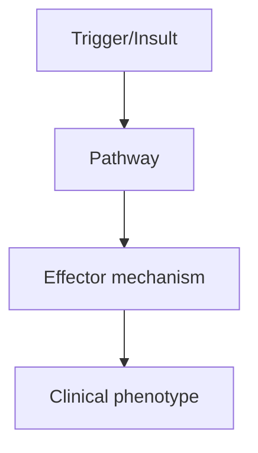
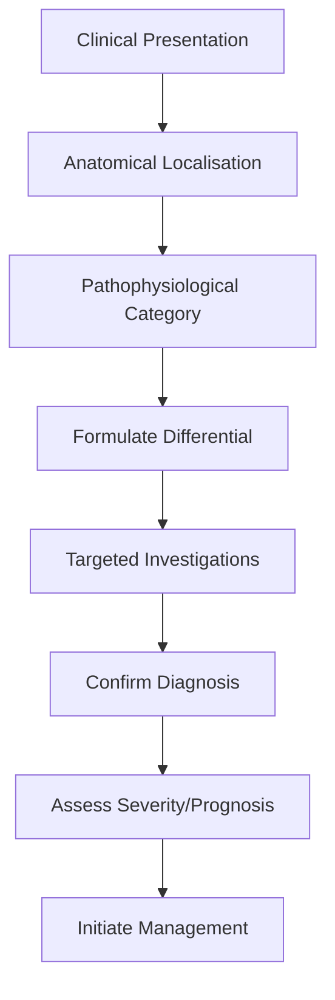
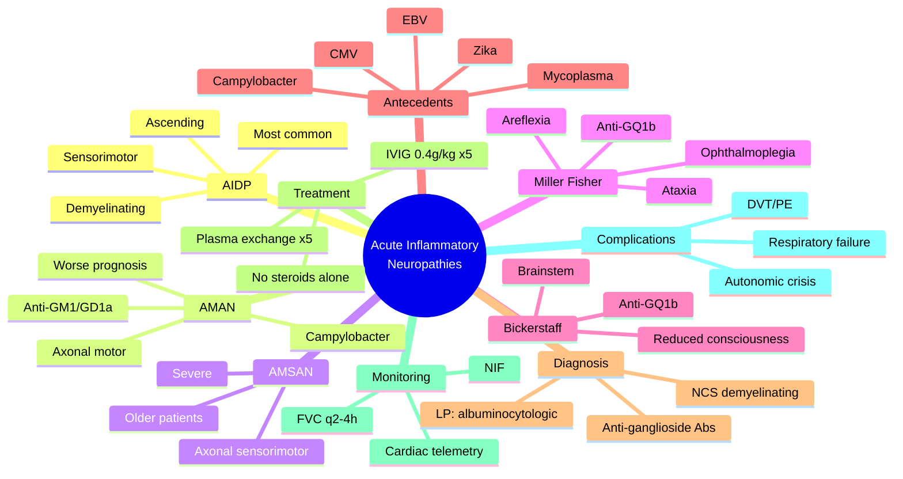

# Acute Inflammatory Neuropathies Overview

> [!tip] **High-Yield Definition**
> GBS spectrum: acute inflammatory demyelinating polyradiculoneuropathies. AIDP (most common, sensorimotor demyelinating, 90%), AMAN (axonal motor, Campylobacter, Asia), AMSAN (axonal sensorimotor, severe), Miller Fisher (anti-GQ1b, ataxia, ophthalmoplegia, areflexia), Bickerstaff brainstem encephalitis (rhombencephalitis), pharyngeal-cervical-brachial variant. Acute onset (<4 weeks), monophasic.

---

## 1. Definition / Epidemiology / Classification

### Definition
GBS spectrum: acute inflammatory demyelinating polyradiculoneuropathies. AIDP (most common, sensorimotor demyelinating, 90%), AMAN (axonal motor, Campylobacter, Asia), AMSAN (axonal sensorimotor, severe), Miller Fisher (anti-GQ1b, ataxia, ophthalmoplegia, areflexia), Bickerstaff brainstem encephalitis (rhombencephalitis), pharyngeal-cervical-brachial variant. Acute onset (<4 weeks), monophasic.

### Epidemiology
GBS: 1-2/100,000/year. AIDP: 85-90% (West). AMAN: 30-50% (Asia, China, Japan). Miller Fisher: 5-10% (Asia). Antecedent infection: 70% (Campylobacter jejuni 30%, CMV, EBV, Mycoplasma, hepatitis E, Zika, recent vaccination - rare).

### Classification
| Variant | Key Features | Prognosis |
|---------|-------------|-----------|
| | | |

---

## 2. Aetiology / Pathophysiology

### Aetiology
Post-infectious autoimmune: molecular mimicry. C. jejuni (LPS): anti-GM1, anti-GD1a (AMAN, AMSAN, Miller Fisher variants). CMV: anti-GM2 (sensory). EBV: anti-GM1b. Mycoplasma: anti-galactocerebroside. Zika: anti-GQ1b (Miller Fisher). Hepatitis E: severe variants. Genetic susceptibility: HLA, immune gene polymorphisms. Antecedent events: infection (70%), surgery, trauma, vaccination (very rare, influenza 1976, oral polio developing countries).

### Pathophysiology

---

## 3. Clinical Features

### History
- **Onset/Duration:**
- **Progression:**
- **Key symptoms:**
- **Triggers:**
- **Systemic symptoms:**
- **Drug/Family/Social history:**

### Examination
| Domain | Key Findings | Localisation Value |
|--------|-------------|-------------------|
| | | |

### Specific Clinical Features
AIDP: ascending, symmetric weakness (legs > arms), areflexia, sensory (paraesthesia, often minimal), autonomic (BP, HR, bladder, ileus), respiratory (30% ventilation, monitor FVC). Progression <4 weeks (usually 1-2 weeks). Pain (50%, especially children). AMAN: motor only, axonal, severe, often ventilator-dependent. AMSAN: severe sensorimotor, axonal. Miller Fisher: ophthalmoplegia (external, internal), ataxia, areflexia. Pharyngeal-cervical-brachial: bulbar, neck, arm. Bickerstaff: brainstem (altered consciousness, hyperreflexia). Autonomic dysfunction: labile BP, bradycardia, ileus, urinary retention, arrhythmias. Respiratory failure: 30%.

---

## 4. Diagnostic Approach / Algorithm

---

## 5. Investigations

Diagnostic criteria: progressive, symmetric, ascending weakness + areflexia, <4 weeks. LP: albuminocytological dissociation (protein elevated, cells <10) - 80-90% (especially AIDP, less in AMAN). NCS/EMG: demyelinating (AIDP: prolonged distal latency, slow NCV, conduction block, temporal dispersion), axonal (AMAN/AMSAN: reduced CMAP, normal sensory, denervation on EMG). Anti-ganglioside antibodies: GM1, GD1a (AMAN), GQ1b (Miller Fisher 90%, Bickerstaff), GM2 (CMV-associated). Bloods: FBC, U&Es, LFTs, glucose, ESR, CRP, autoantibodies, infection screen (C. jejuni, CMV, EBV, Mycoplasma, HIV, hepatitis, syphilis, Lyme), cryoglobulins, SPEP. Monitoring: FVC, NIF (negative inspiratory force), cardiac monitoring (ICU).

---

## 6. Differential Diagnosis

| Differential | Distinguishing Features | Key Test |
|--------------|------------------------|----------|
| | | |

---

## 7. Management

EMERGENCY admission, ICU/HDU if respiratory. Monitoring: FVC q4h, NIF, cardiac (autonomic). Ventilation: intubate if FVC <20 ml/kg, NIF <30 cmH2O, bulbar failure. Treatment: IVIG 2g/kg over 5 days (0.4g/kg/day) OR plasma exchange (5 exchanges over 1-2 weeks). Equivalent efficacy. NO STEROIDS (no benefit, may worsen). Supportive: DVT prophylaxis (mechanical first, then LMWH after bleeding risk), pressure area care, nutrition (NG/PEG if bulbar), bladder (catheter), pain (gabapentin, amitriptyline, carbamazepine), autonomic (labile BP - monitor, not aggressively treat), psychological support, physiotherapy (passive, then active), respiratory (cough assist, NIV). Multidisciplinary: neurology, ICU, physiotherapy, OT, SLT, dietitian, social, psychology. Triggers: no active infection (avoid antibiotics unless indicated).

---

## 8. Drug Interactions / Contraindications / Comorbidity Cautions

| Drug | Interaction / Caution | Management |
|------|----------------------|------------|
| | | |

---

## 9. Procedures (if applicable)

### Procedure:
- **Indications:**
- **Contraindications:**
- **Preparation / Principle:**
- **Complications:**
- **Viva Pearls:**

---

## 10. Complications

| Complication | Frequency | Prevention / Monitoring | Management |
|--------------|-----------|------------------------|------------|
| | | | |

---

## 11. Red Flags / Emergencies

Respiratory failure (FVC <20, NIF <30, bulbar), autonomic instability (arrhythmias, BP swings), ileus, DVT/PE, pressure sores, infections (aspiration pneumonia, UTI, line), SIADH, depression, persistent disability (axonal variants, severe initial).

---

## 12. Prognosis

80% complete recovery, 15% residual (foot drop, distal sensory, fatigue), 5% severe (wheelchair, ventilator-dependent), 3-7% mortality. Recovery: weeks-months (1 year plateau). AIDP: best. AMAN, AMSAN: worse. Miller Fisher: excellent. AMAN recovery: 6-18 months. Prolonged ventilation: tracheostomy, slow weaning. Bickerstaff: usually good. Pharyngeal-cervical-brachial: variable. Persistent disability: fatigue (50%), pain, autonomic, psychological. Anti-GQ1b: better. Anti-GM1: worse. Campylobacter: worse. Axonal: worse. Age >60: worse.

---

## 13. Topic Correlation

| Related Topic | Link | Key Overlap |
|---------------|------|-------------|
| | | |

---

## 14. Special Situations

| Situation | Consideration |
|-----------|---------------|
| **Pregnancy** | |
| **Lactation** | |
| **Paediatric** | |
| **Elderly / Frail** | |
| **Renal impairment** | |
| **Hepatic impairment** | |
| **Immunocompromised** | |
| **Perioperative** | |
| **Driving / DVLA** | |
| **Occupational** | |

---

## FCPS/MRCP High-Yield Summary

| Category | Key Points |
|----------|------------|
| **Definition** | GBS spectrum: acute inflammatory demyelinating polyradiculoneuropathies. AIDP (most common, sensorimotor demyelinating, 90%), AMAN (axonal motor, Campylobacter, Asia), AMSAN (axonal sensorimotor, seve |
| **Epidemiology** | GBS: 1-2/100,000/year. AIDP: 85-90% (West). AMAN: 30-50% (Asia, China, Japan). Miller Fisher: 5-10% (Asia). Antecedent infection: 70% (Campylobacter j |
| **Pathophysiology** | |
| **Clinical** | AIDP: ascending, symmetric weakness (legs > arms), areflexia, sensory (paraesthesia, often minimal), autonomic (BP, HR, bladder, ileus), respiratory (30% ventilation, monitor FVC). Progression <4 week |
| **Diagnosis** | |
| **Investigations** | Diagnostic criteria: progressive, symmetric, ascending weakness + areflexia, <4 weeks. LP: albuminocytological dissociation (protein elevated, cells <10) - 80-90% (especially AIDP, less in AMAN). NCS/ |
| **Management** | EMERGENCY admission, ICU/HDU if respiratory. Monitoring: FVC q4h, NIF, cardiac (autonomic). Ventilation: intubate if FVC <20 ml/kg, NIF <30 cmH2O, bulbar failure. Treatment: IVIG 2g/kg over 5 days (0. |
| **Complications** | |
| **Prognosis** | 80% complete recovery, 15% residual (foot drop, distal sensory, fatigue), 5% severe (wheelchair, ventilator-dependent), 3-7% mortality. Recovery: weeks-months (1 year plateau). AIDP: best. AMAN, AMSAN |
| **Viva Pearls** | |
| **Drug Doses** | |
| **Scoring Systems** | |
| **Genetics** | |
| **Imaging Signs** | |

---

## Viva Questions (PACES/FCPS Style)

1. **Q:** Define Acute Inflammatory Neuropathies Overview and classify its variants.
   **A:** Based on the definition above.

2. **Q:** What are the key clinical features?
   **A:** AIDP: ascending, symmetric weakness (legs > arms), areflexia, sensory (paraesthesia, often minimal), autonomic (BP, HR, bladder, ileus), respiratory (30% ventilation, monitor FVC). Progression <4 weeks (usually 1-2 weeks). Pain (50%, especially children). AMAN: motor only, axonal, severe, often vent

3. **Q:** What is the first-line treatment?
   **A:** Based on the management section.

4. **Q:** What are the red flags requiring urgent referral?
   **A:** Respiratory failure (FVC <20, NIF <30, bulbar), autonomic instability (arrhythmias, BP swings), ileus, DVT/PE, pressure sores, infections (aspiration pneumonia, UTI, line), SIADH, depression, persistent disability (axonal variants, severe initial).

5. **Q:** What is the prognosis?
   **A:** 80% complete recovery, 15% residual (foot drop, distal sensory, fatigue), 5% severe (wheelchair, ventilator-dependent), 3-7% mortality. Recovery: weeks-months (1 year plateau). AIDP: best. AMAN, AMSAN: worse. Miller Fisher: excellent. AMAN recovery: 6-18 months. Prolonged ventilation: tracheostomy, 

6. **Q:** How do you differentiate Acute Inflammatory Neuropathies Overview from key differentials?
   **A:** Clinical features, investigations, and response to treatment.

7. **Q:** What investigations are most useful?
   **A:** Based on the investigations section.

8. **Q:** Describe the stepwise management approach.
   **A:** Based on the management algorithm.

9. **Q:** What are the emergency presentations?
   **A:** Based on the red flags section.

10. **Q:** How does management change in pregnancy/paediatrics/elderly?
    **A:** Special considerations per population.

---

## Common Confusions / Exam Traps

| Confusion | Clarification |
|-----------|---------------|
| | |

---

## Mnemonics

1. **GBS-CAMP** — Major GBS variants and their triggers:
   - **G**uillain-Barré = umbrella term (GBS spectrum)
   - **B**ickerstaff brainstem encephalitis (BBE; anti-GQ1b, post-infection)
   - **S**pectrum = AIDP / AMAN / AMSAN / MFS / BBE / Pharyngeal-cervical-brachial
   - **C**ampylobacter jejuni → AMAN (axonal motor, molecular mimicry with GM1/GD1a)
   - **A**IDP = demyelinating, sensorimotor, most common (~90%)
   - **M**FS = Miller Fisher (ophthalmoplegia + ataxia + areflexia; anti-GQ1b)
   - **P**lasmapheresis or IVIG = first-line (no benefit from steroids alone)

2. **AIDP-ARE-U-FAST** — AIDP cardinal clinical features:
   - **A**scending symmetric weakness (legs → arms)
   - **R**eflexes absent (areflexia) — universal, even where strength preserved
   - **E**volution < 4 weeks (nadir by 2 weeks typical)
   - **U**mbilicus-and-below sensory level often with back/leg pain
   - **F**VC / NIF monitoring (respiratory failure in 30%)
   - **A**utonomic dysfunction (BP/HR lability, ileus, bladder)
   - **S**ural nerve biopsy not routinely needed (NCS sufficient)
   - **T**wo equally effective treatments: IVIG 0.4 g/kg/day × 5 d OR plasma exchange × 5

3. **ALBUMIN-CC** — Classic CSF finding in GBS:
   - **ALB**uminocytologic dissociation = ↑ protein with normal cells (<10/mm³)
   - **U**sually emerges by end of week 1
   - **M**ay be normal in first 48 h
   - **C**ells >50 → consider HIV, Lyme, sarcoid, leukaemic infiltration
   - **C**onfirm with NCS: demyelinating (AIDP) vs axonal (AMAN/AMSAN)

---

## Mind Map

---

## Spaced Repetition Trackers

| Topic | Day 1 | Day 3 | Day 7 | Day 14 | Day 30 | Day 90 |
|-------|-------|-------|-------|--------|--------|--------|
| AIDP vs AMAN vs AMSAN vs MFS classification | ☐ | ☐ | ☐ | ☐ | ☐ | ☐ |
| Antecedent infections (Campylobacter, CMV, EBV, Mycoplasma) | ☐ | ☐ | ☐ | ☐ | ☐ | ☐ |
| Albuminocytologic dissociation on CSF | ☐ | ☐ | ☐ | ☐ | ☐ | ☐ |
| NCS criteria — demyelinating vs axonal | ☐ | ☐ | ☐ | ☐ | ☐ | ☐ |
| Anti-ganglioside antibodies (GM1, GQ1b, GD1a) | ☐ | ☐ | ☐ | ☐ | ☐ | ☐ |
| IVIG vs plasma exchange (equivalent efficacy) | ☐ | ☐ | ☐ | ☐ | ☐ | ☐ |
| Why steroids are NOT used in GBS | ☐ | ☐ | ☐ | ☐ | ☐ | ☐ |
| FVC < 20 mL/kg and NIF < 30 cmH₂O → intubate | ☐ | ☐ | ☐ | ☐ | ☐ | ☐ |
| Autonomic dysfunction management | ☐ | ☐ | ☐ | ☐ | ☐ | ☐ |
| MFS triad + anti-GQ1b | ☐ | ☐ | ☐ | ☐ | ☐ | ☐ |

---

## Self-Test Scorecard

| Section | Score (/5) |
|---------|-----------|
| 1. Can list the 4 GBS variants (AIDP, AMAN, AMSAN, MFS) and their distinguishing features | /5 |
| 2. Can name 4 antecedent infections and link each to a variant | /5 |
| 3. Can describe the classic CSF finding (albuminocytologic dissociation) | /5 |
| 4. Can interpret NCS — demyelinating (slowed conduction, prolonged F, conduction block) vs axonal (reduced amplitude) | /5 |
| 5. Can state the 2 first-line treatments and why steroids are not used | /5 |
| 6. Can list the indications for ITU/ventilation (FVC, NIF, bulbar) | /5 |
| 7. Can describe autonomic dysfunction (arrhythmia, BP swings, ileus) and its management | /5 |
| 8. Can recognise Miller Fisher syndrome (ophthalmoplegia + ataxia + areflexia) and the anti-GQ1b link | /5 |
| 9. Can describe Bickerstaff brainstem encephalitis and its overlap with MFS | /5 |
| 10. Can outline prognosis (80% full recovery, 5% severe, 3–7% mortality) | /5 |
| **TOTAL** | **/50** |

---

## MCQs (10)

1. **Question:** Which of the following is the most common subtype of Guillain-Barré syndrome in Europe and North America?
   **Options:** A. Acute motor axonal neuropathy (AMAN) B. Acute inflammatory demyelinating polyradiculoneuropathy (AIDP) C. Acute motor and sensory axonal neuropathy (AMSAN) D. Miller Fisher syndrome
   **Answer:** B
   **Explanation:** AIDP accounts for approximately 90% of GBS cases in the Western world. It is a demyelinating, sensorimotor polyradiculoneuropathy. AMAN is more common in Asia and Latin America, often following Campylobacter infection. AMSAN is rare and severe, and MFS represents ~5% of cases.

2. **Question:** A 28-year-old man develops rapidly progressive ascending weakness, areflexia, and paraesthesiae one week after a bout of diarrhoea. Which pathogen is the most likely antecedent trigger?
   **Options:** A. Epstein-Barr virus B. Cytomegalovirus C. Campylobacter jejuni D. Mycoplasma pneumoniae
   **Answer:** C
   **Explanation:** *Campylobacter jejuni* is the most common bacterial trigger of GBS (~30%) and is the classic antecedent for the axonal motor variant (AMAN) due to molecular mimicry between bacterial lipo-oligosaccharide and GM1/GD1a gangliosides. CMV is associated with sensorimotor GBS with cranial involvement; EBV and Mycoplasma are less common triggers.

3. **Question:** In a patient with suspected GBS, which of the following CSF findings is most characteristic?
   **Options:** A. Neutrophilic pleocytosis with raised protein B. Raised protein with normal cell count (albuminocytologic dissociation) C. Low glucose with lymphocytic pleocytosis D. Normal protein and cell count
   **Answer:** B
   **Explanation:** Albuminocytologic dissociation — elevated CSF protein (>0.45 g/L) with normal cell count (<10/mm³) — is the hallmark CSF finding in GBS, though it may be normal within the first 48 hours. A pleocytosis with >50 cells/mm³ should prompt consideration of alternative diagnoses such as HIV, Lyme, sarcoidosis, or leukaemic infiltration.

4. **Question:** A patient with GBS is being monitored on the ward. Which spirometry threshold is the most widely accepted indication for elective intubation and mechanical ventilation?
   **Options:** A. FVC < 30 mL/kg B. FVC < 20 mL/kg C. FVC < 10 mL/kg D. FVC < 5 mL/kg
   **Answer:** B
   **Explanation:** FVC < 20 mL/kg, NIF (negative inspiratory force) < 30 cmH₂O, and pCO₂ rising >6 kPa are commonly cited thresholds for elective ventilation. Bulbar dysfunction (poor cough, aspiration risk) and inability to clear secretions are also indications independent of the FVC value. Roughly 25–30% of GBS patients require ventilation.

5. **Question:** A 45-year-old woman presents with acute ophthalmoplegia, gait ataxia, and areflexia after a respiratory infection. Which antibody is most likely to be positive?
   **Options:** A. Anti-GM1 B. Anti-GQ1b C. Anti-MAG D. Anti-Hu
   **Answer:** B
   **Explanation:** The Miller Fisher syndrome (MFS) triad of ophthalmoplegia, ataxia and areflexia is strongly associated with anti-GQ1b ganglioside antibodies (present in >90% of cases). Anti-GM1 is associated with AMAN. Anti-MAG is found in chronic demyelinating paraproteinaemic neuropathies. Anti-Hu is a paraneoplastic antibody.

6. **Question:** Which treatment has been shown to be equivalent in efficacy to plasma exchange in GBS?
   **Options:** A. High-dose oral prednisolone B. IV methylprednisolone alone C. IV immunoglobulin (IVIG) D. Mycophenolate mofetil
   **Answer:** C
   **Explanation:** IVIG (0.4 g/kg/day for 5 days) and plasma exchange (5 exchanges over 1–2 weeks) are equally effective first-line treatments for GBS, with similar rates of recovery, ventilation, and mortality. Steroids alone are NOT beneficial and may worsen outcome; combined IVIG + steroids offers no additional benefit. Mycophenolate has no established role.

7. **Question:** Which of the following nerve conduction study findings is most consistent with AIDP rather than AMAN?
   **Options:** A. Markedly reduced CMAP and SNAP amplitudes with preserved velocity B. Prolonged distal motor latency, slowed conduction velocity, and conduction block C. Normal conduction velocity with fibrillations on EMG D. Absent F-waves only
   **Answer:** B
   **Explanation:** AIDP (demyelinating) shows prolonged distal latencies, slowed conduction velocity, prolonged or absent F-waves, and conduction block/temporal dispersion. AMAN (axonal) shows reduced CMAP amplitudes with relatively preserved conduction velocity. Isolated absent F-waves can be an early finding in either; the full pattern is needed to differentiate.

8. **Question:** Bickerstaff brainstem encephalitis (BBE) is considered to overlap with which condition?
   **Options:** A. CIDP B. Miller Fisher syndrome C. Myasthenia gravis D. Botulism
   **Answer:** B
   **Explanation:** BBE shares clinical and immunological features with MFS — both are associated with anti-GQ1b antibodies and often follow infection. BBE adds the features of brainstem involvement (impaired consciousness, hyperreflexia, extensor plantars, ophthalmoplegia, ataxia) to the MFS picture. The two are considered a continuous spectrum ("GQ1b antibody syndrome").

9. **Question:** Which autonomic complication should be most actively anticipated in the first 2 weeks of severe GBS?
   **Options:** A. Phaeochromocytoma-like hypertensive crisis B. Brady- and tachyarrhythmias with blood pressure lability C. Hyperthermia from loss of sweating D. Urinary retention with overflow incontinence only
   **Answer:** B
   **Explanation:** Autonomic dysfunction in GBS manifests as labile blood pressure, sinus tachycardia or bradycardia (sometimes requiring pacing), ileus, bladder dysfunction, and sudomotor changes. The combination of bradycardia and hypotension may mimic a vasovagal episode. Patients require cardiac monitoring for at least the first 1–2 weeks; arrhythmias are a recognised cause of early mortality.

10. **Question:** Regarding prognosis in GBS, which statement is most accurate?
    **Options:** A. The majority of patients have permanent severe disability B. Around 80% make a complete or near-complete recovery, with about 3–7% mortality C. Mortality is approximately 30% in modern series D. Recovery never begins before 6 months
    **Answer:** B
    **Explanation:** Approximately 80% of GBS patients achieve complete or near-complete recovery, ~15% have residual disability (foot drop, distal sensory symptoms, fatigue), and ~5% remain severely disabled (wheelchair/ventilator-dependent). Mortality is 3–7% in modern series, mostly from respiratory failure, autonomic instability, or complications. Recovery usually begins within weeks and can continue for 12–18 months. Axonal variants (AMAN, AMSAN) and older age carry a worse prognosis.

---

## SBA Questions (10)

1. **Scenario:** A 35-year-old man presents 8 days after a diarrhoeal illness with rapidly progressive symmetric lower limb weakness, mild distal paraesthesiae, and areflexia. Examination shows MRC grade 3 power proximally and 2 distally, FVC 2.1 L (24 mL/kg), NIF –35 cmH₂O, no bulbar weakness, normal ECG.
   **Question:** What is the most appropriate next step in management?
   **Options:** A. Observe with daily spirometry; review in 24 h B. Start IVIG 0.4 g/kg/day for 5 days and admit to a monitored bed C. Start oral prednisolone 60 mg daily and discharge with outpatient follow-up D. Lumbar puncture before treatment to confirm the diagnosis
   **Answer:** B
   **Explanation:** The clinical picture (post-infectious ascending weakness, areflexia, sensory symptoms) is highly suggestive of GBS. He should be started on IVIG (0.4 g/kg/day × 5 days) and admitted to a monitored area. Although FVC/NIF are currently adequate, deterioration can be rapid and serial monitoring every 2–4 hours is mandatory. Steroids are not indicated. LP may be supportive but should not delay treatment in a clear clinical case.

2. **Scenario:** A patient with severe GBS has been ventilated for 12 days and is now on day 6 of IVIG. They remain profoundly weak (MRC sum score 10/60) and have developed a new pyrexia, productive tracheal aspirate, and new infiltrate on chest X-ray.
   **Question:** What is the most likely cause and appropriate next step?
   **Options:** A. Aspiration pneumonia — start broad-spectrum antibiotics, send sputum and blood cultures B. Progression of GBS — escalate to plasma exchange C. Pulmonary embolism — start therapeutic anticoagulation without imaging D. Tracheostomy-related infection — remove the tube
   **Answer:** A
   **Explanation:** Ventilator-associated pneumonia / aspiration pneumonia is extremely common in intubated GBS patients (immobility, bulbar weakness, ileus with regurgitation, impaired cough). Broad-spectrum antibiotics, cultures, and supportive care are appropriate. PE is possible but less likely with a clear infiltrate and fever. Treatment for GBS is not escalated; plasma exchange is no more effective than IVIG.

3. **Scenario:** A patient with GBS develops sudden severe bradycardia (HR 30/min) and hypotension (BP 80/50 mmHg) during suctioning on day 4 of admission.
   **Question:** What is the most appropriate immediate intervention?
   **Options:** A. IV atropine 0.5 mg; if recurrent, consider temporary pacing B. Start a glycopyrronium infusion C. Withhold IVIG and switch to plasma exchange D. Urgent CT brain to exclude haemorrhage
   **Answer:** A
   **Explanation:** This is a classic autonomic dysreflexia-like crisis triggered by vagal stimulation (suctioning) in a GBS patient. Initial management is IV atropine; recurrent episodes may require temporary transvenous or transcutaneous pacing. Vasopressors may also be needed for hypotension. Glycopyrronium would worsen the bradycardia. CT brain is not indicated for this presentation.

4. **Scenario:** A 22-year-old woman is 14 weeks pregnant and develops classic features of GBS (ascending weakness, areflexia, raised CSF protein).
   **Question:** What is the safest first-line treatment?
   **Options:** A. IVIG 0.4 g/kg/day for 5 days B. Plasma exchange C. Oral prednisolone D. Avoid treatment until delivery
   **Answer:** A
   **Explanation:** IVIG is the first-line treatment for GBS in pregnancy — it is safe, effective, and avoids the haemodynamic shifts of plasma exchange which can be hazardous to the fetus. Plasma exchange is reserved for patients who cannot receive IVIG (e.g., severe IgA deficiency, anaphylaxis). Steroids are ineffective. Untreated GBS carries a high risk of respiratory failure and thromboembolism, both dangerous in pregnancy.

5. **Scenario:** A 6-year-old child presents 2 weeks after a respiratory infection with progressive limb weakness, areflexia, and facial diplegia. Paediatric Neurology confirms AIDP.
   **Question:** Which treatment regimen is most appropriate?
   **Options:** A. IVIG 1 g/kg/day for 2 days B. IVIG 2 g/kg/day for 5 days C. Plasma exchange D. High-dose oral prednisolone
   **Answer:** B
   **Explanation:** The standard paediatric IVIG regimen is 2 g/kg total, given as 1 g/kg/day for 2 days OR 0.4 g/kg/day for 5 days. The single most commonly used schedule in children is 1 g/kg/day × 2 days (total 2 g/kg). Plasma exchange is technically difficult in small children and reserved for IVIG failure. Steroids are not effective. Supportive care and respiratory monitoring are equally critical.

6. **Scenario:** An 80-year-old man with GBS is treated with IVIG but deteriorates 7 days later with worsening weakness and a falling FVC. He has a history of IgA deficiency.
   **Question:** What is the most appropriate next step?
   **Options:** A. Repeat a second course of IVIG B. Plasma exchange C. Add high-dose methylprednisolone D. Increase IVIG to 1 g/kg/day
   **Answer:** B
   **Explanation:** In IgA deficiency, IVIG carries a risk of anaphylaxis due to anti-IgA antibodies. Plasma exchange is the appropriate alternative first-line/second-line treatment. There is no evidence that repeating IVIG improves outcomes, and steroids add no benefit. Escalation should be to plasma exchange (5 exchanges over 1–2 weeks).

7. **Scenario:** A patient with GBS 4 weeks into treatment has improved and is weaning from ventilation, but is found to have a swollen, tender left calf; Doppler ultrasound confirms a DVT.
   **Question:** What is the most appropriate management?
   **Options:** A. Start therapeutic low-molecular-weight heparin B. Insert an IVC filter because of bleeding risk C. Withhold anticoagulation because of risk of nerve haemorrhage D. Aspirin 75 mg daily
   **Answer:** A
   **Explanation:** GBS patients are at very high risk of VTE due to immobility, autonomic dysfunction, and paralysis. Therapeutic anticoagulation with LMWH is the standard of care, transitioned to warfarin or a DOAC. IVC filter is reserved for patients with absolute contraindication to anticoagulation. Aspirin is inadequate.

8. **Scenario:** A patient treated for GBS 2 years ago presents with a similar but milder episode of ascending weakness following a viral infection. NCS shows a demyelinating pattern and CSF protein is again raised.
   **Question:** What is the most likely diagnosis?
   **Options:** A. Recurrent GBS (treatment-related fluctuating GBS) B. Acute onset CIDP C. Myasthenic crisis C. Polymyositis
   **Answer:** B
   **Explanation:** True recurrences of AIDP are rare (1–3%). If a patient has had a similar demyelinating episode within 2 months of stopping treatment, the most likely explanation is "treatment-related fluctuation" of GBS. However, if a second episode occurs more than 2 months after recovery (especially with progressive or relapsing course over >8 weeks), the diagnosis is redone as CIDP (chronic inflammatory demyelinating polyradiculoneuropathy), which is treated with steroids, IVIG, or plasma exchange on a chronic basis.

9. **Scenario:** A 32-year-old man with a 1-week history of diplopia, ataxia, and areflexia (Miller Fisher syndrome) is being managed conservatively. He remains ambulant with mild symptoms.
   **Question:** What is the most appropriate management?
   **Options:** A. Urgent IVIG 0.4 g/kg × 5 days B. Plasma exchange C. Close observation with supportive care; IVIG only if symptoms progress D. Oral prednisolone
   **Answer:** C
   **Explanation:** MFS is generally self-limiting and benign. Most patients recover within 1–6 months. Treatment with IVIG is reserved for patients with significant disability, severe ataxia, or progression to limb weakness or respiratory involvement. Steroids are not effective. Close follow-up is essential because a small number of patients evolve into full GBS.

10. **Scenario:** A patient with GBS recovers enough to walk with one stick 6 months after onset but continues to complain of severe fatigue, distal numbness, and foot drop. NCS shows residual axonotmesis.
    **Question:** What is the most appropriate long-term management plan?
    **Options:** A. Re-start IVIG B. Add immunosuppressants (azathioprine) C. Multidisciplinary rehabilitation — physiotherapy, occupational therapy, orthotics, fatigue management, psychological support D. Plasma exchange every 3 months
    **Answer:** C
    **Explanation:** By 6 months, ongoing recovery in GBS is largely through axonal regeneration, and active treatment has been completed. Management now is multidisciplinary: physiotherapy, ankle-foot orthoses for foot drop, occupational therapy, fatigue management, pain control (e.g., gabapentin for neuropathic pain), psychological support, and vocational rehabilitation. There is no evidence that further IVIG, plasma exchange, or immunosuppressants improve long-term residual symptoms.

---

## Tags

#neurology #peripheral-neuropathy #guillain-barre #AIDP #AMAN #AMSAN #miller-fisher #bickerstaff #FCPS #MRCP #acute-neurology #neuromuscular

---

## Local Navigation
**Heading Hub:** [[../Hub]]  
**Chapter Hierarchy:** [[Davidson Chapter 25 - Neurology Hierarchy]]  
**Chapter MOC:** [[Neurology MOC]]  
**Drug Reference:** [[../00_Index/Neurology Drug Reference]]  
