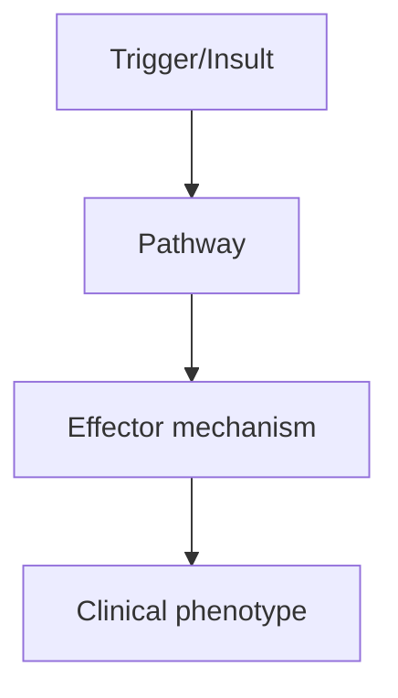
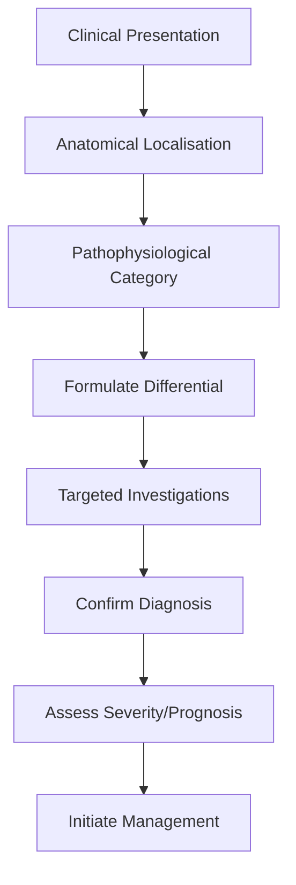
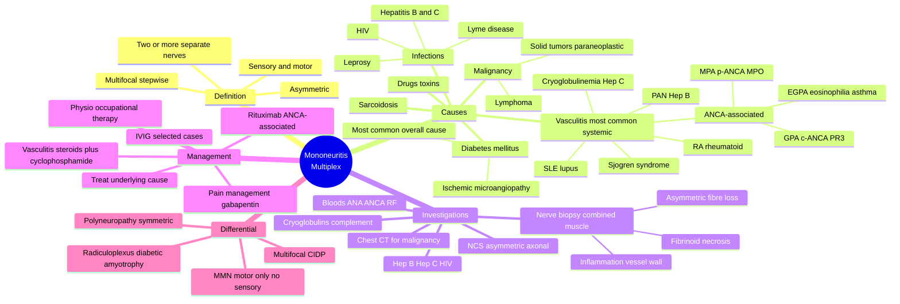

# Mononeuritis Multiplex

> [!tip] **High-Yield Definition**
> Mononeuritis multiplex (MM, multiple mononeuropathy): simultaneous or sequential damage to ≥2 separate non-contiguous nerve territories. Usually asymmetric, often due to vasculitis (systemic or non-systemic), but also diabetes, sarcoid, leprosy, malignancy, infection, HIV.

---

## 1. Definition / Epidemiology / Classification

### Definition
Mononeuritis multiplex (MM, multiple mononeuropathy): simultaneous or sequential damage to ≥2 separate non-contiguous nerve territories. Usually asymmetric, often due to vasculitis (systemic or non-systemic), but also diabetes, sarcoid, leprosy, malignancy, infection, HIV.

### Epidemiology
Vasculitic neuropathy: 1/100,000. 30% of vasculitis has neuropathy. PAN: 50-70% neuropathy. GPA: 15-50%. EGPA: 50-80%. RA: 10-20%. SLE: 10-15%. Cryoglobulinemia: 30-50%. Diabetes: less common MM (more distal symmetric). HIV: 5-10%. Leprosy: most common cause worldwide.

### Classification
| Variant | Key Features | Prognosis |
|---------|-------------|-----------|
| | | |

---

## 2. Aetiology / Pathophysiology

### Aetiology
Vasculitis (most common in developed world): systemic (PAN, GPA, MPA, EGPA, RA, SLE, cryoglobulinemia, Sjögren's), non-systemic (NSVN, idiopathic). Infections: leprosy (worldwide most common, Mycobacterium leprae, borderline/tuberculoid/lepromatous, affects Schwann cells), Lyme, HIV, hepatitis B/C, CMV. Diabetes: usually distal symmetric, but can cause MM. Sarcoidosis: 5-10% neuropathy, often MM, may have systemic. Malignancy: paraneoplastic (anti-Hu), direct infiltration (lymphoma, leukaemia). Cryoglobulinemia: type I (monoclonal, hyperviscosity), type II/III (mixed, HCV-associated, immune complex vasculitis). Drugs: hydralazine, isoniazid, propylthiouracil, minocycline, allopurinol, penicillamine.

### Pathophysiology

---

## 3. Clinical Features

### History
- **Onset/Duration:**
- **Progression:**
- **Key symptoms:**
- **Triggers:**
- **Systemic symptoms:**
- **Drug/Family/Social history:**

### Examination
| Domain | Key Findings | Localisation Value |
|--------|-------------|-------------------|
| | | |

### Specific Clinical Features
Asymmetric, multifocal, often painful sensory + motor deficit in ≥2 separate nerve territories. Common: peroneal (foot drop), ulnar (clawing, sensory), radial (wrist drop), median (thenar wasting, CTS-like), femoral, sciatic, cranial (VII, III). May progress: stepwise, new nerves affected. Vasculitic features: pain (often severe, burning, deep), constitutional (fever, weight loss, fatigue, myalgia, arthralgia), skin (palpable purpura, livedo, rash, ulceration), renal (glomerulonephritis), pulmonary (cavitary nodules, alveolar haemorrhage, asthma in EGPA), GI (abdominal pain, perforation - PAN), cardiac (pericarditis, MI, CHF), eyes (episcleritis, uveitis, scleritis).

---

## 4. Diagnostic Approach / Algorithm

---

## 5. Investigations

NCS/EMG: asymmetric, multifocal axonal neuropathy (reduced CMAP/sensory, denervation). Demyelinating: consider MMN, CIDP, HIV. Bloods: FBC, U&Es, LFTs, ESR, CRP, ANA, ANCA (PR3/MPO), anti-ENA, RF, anti-CCP, cryoglobulins, complement (C3, C4), immunoglobulins, SPEP, IFE, hepatitis B/C, HIV, Lyme, syphilis, blood glucose, HbA1c. Urine: Bence Jones, protein. Skin: biopsy (leukocytoclastic vasculitis, HHV-8 - Kaposi). Nerve + muscle biopsy: sural nerve (sensory, easy) + peroneus brevis muscle (asymmetric - vasculitis), look for vessel wall inflammation, fibrinoid necrosis, leukocytoclasis. Consider combined nerve + muscle biopsy. Imaging: MRI plexus, chest/abdomen/pelvis CT (malignancy, granuloma, infection). Tissue: skin, lymph node, bone marrow. CSF: usually normal or mild protein.

---

## 6. Differential Diagnosis

| Differential | Distinguishing Features | Key Test |
|--------------|------------------------|----------|
| | | |

---

## 7. Management

Treat underlying: vasculitis (corticosteroids, immunosuppressants - cyclophosphamide for severe, azathioprine, MMF, methotrexate, rituximab - for ANCA, RA, SLE, cryoglobulinemia), infection (specific antimicrobial - leprosy: MDT, HIV: ART, hepatitis C: DAA), diabetes (glycaemic control), sarcoid (corticosteroids, methotrexate, infliximab, rituximab). Pain: gabapentin, pregabalin, duloxetine, TCAs. Supportive: physiotherapy, OT, splints, walking aids, foot care, psychological support. Monitoring: clinical, neurophysiology, bloods (inflammatory, ANCA, complement). Multidisciplinary: neurologist, rheumatologist, dermatologist, infectious diseases, palliative, OT, PT, social. Treat complications: infection, ulceration, contracture, depression.

---

## 8. Drug Interactions / Contraindications / Comorbidity Cautions

| Drug | Interaction / Caution | Management |
|------|----------------------|------------|
| | | |

---

## 9. Procedures (if applicable)

### Procedure:
- **Indications:**
- **Contraindications:**
- **Preparation / Principle:**
- **Complications:**
- **Viva Pearls:**

---

## 10. Complications

| Complication | Frequency | Prevention / Monitoring | Management |
|--------------|-----------|------------------------|------------|
| | | | |

---

## 11. Red Flags / Emergencies

Rapid progression (especially PAN, vasculitis), organ involvement (renal, pulmonary, cardiac, GI, CNS), severe pain, constitutional symptoms, sepsis, infarcts, haemorrhage, treatment side effects (cyclophosphamide - haemorrhagic cystitis, malignancy; steroids - DM, HTN, osteoporosis, infection).

---

## 12. Prognosis

Depends on cause. Vasculitis: treatable, may respond dramatically to immunosuppression, but relapse common, chronic course. PAN: 5-year survival 80% with treatment. ANCA vasculitis: relapsing, 5-year survival 80%. Cryoglobulinemia: treatable (HCV DAAs, rituximab, immunosuppression). Leprosy: curable with MDT. Diabetes: progressive. Malignancy: poor. Early diagnosis and treatment critical for reversible causes (vasculitis, infection).

---

## 13. Topic Correlation

| Related Topic | Link | Key Overlap |
|---------------|------|-------------|
| | | |

---

## 14. Special Situations

| Situation | Consideration |
|-----------|---------------|
| **Pregnancy** | |
| **Lactation** | |
| **Paediatric** | |
| **Elderly / Frail** | |
| **Renal impairment** | |
| **Hepatic impairment** | |
| **Immunocompromised** | |
| **Perioperative** | |
| **Driving / DVLA** | |
| **Occupational** | |

---

## FCPS/MRCP High-Yield Summary

| Category | Key Points |
|----------|------------|
| **Definition** | Mononeuritis multiplex (MM, multiple mononeuropathy): simultaneous or sequential damage to ≥2 separate non-contiguous nerve territories. Usually asymmetric, often due to vasculitis (systemic or non-sy |
| **Epidemiology** | Vasculitic neuropathy: 1/100,000. 30% of vasculitis has neuropathy. PAN: 50-70% neuropathy. GPA: 15-50%. EGPA: 50-80%. RA: 10-20%. SLE: 10-15%. Cryogl |
| **Pathophysiology** | |
| **Clinical** | Asymmetric, multifocal, often painful sensory + motor deficit in ≥2 separate nerve territories. Common: peroneal (foot drop), ulnar (clawing, sensory), radial (wrist drop), median (thenar wasting, CTS |
| **Diagnosis** | |
| **Investigations** | NCS/EMG: asymmetric, multifocal axonal neuropathy (reduced CMAP/sensory, denervation). Demyelinating: consider MMN, CIDP, HIV. Bloods: FBC, U&Es, LFTs, ESR, CRP, ANA, ANCA (PR3/MPO), anti-ENA, RF, ant |
| **Management** | Treat underlying: vasculitis (corticosteroids, immunosuppressants - cyclophosphamide for severe, azathioprine, MMF, methotrexate, rituximab - for ANCA, RA, SLE, cryoglobulinemia), infection (specific  |
| **Complications** | |
| **Prognosis** | Depends on cause. Vasculitis: treatable, may respond dramatically to immunosuppression, but relapse common, chronic course. PAN: 5-year survival 80% with treatment. ANCA vasculitis: relapsing, 5-year  |
| **Viva Pearls** | |
| **Drug Doses** | |
| **Scoring Systems** | |
| **Genetics** | |
| **Imaging Signs** | |

---

## Viva Questions (PACES/FCPS Style)

1. **Q:** Define Mononeuritis Multiplex and classify its variants.
   **A:** Based on the definition above.

2. **Q:** What are the key clinical features?
   **A:** Asymmetric, multifocal, often painful sensory + motor deficit in ≥2 separate nerve territories. Common: peroneal (foot drop), ulnar (clawing, sensory), radial (wrist drop), median (thenar wasting, CTS-like), femoral, sciatic, cranial (VII, III). May progress: stepwise, new nerves affected. Vasculiti

3. **Q:** What is the first-line treatment?
   **A:** Based on the management section.

4. **Q:** What are the red flags requiring urgent referral?
   **A:** Rapid progression (especially PAN, vasculitis), organ involvement (renal, pulmonary, cardiac, GI, CNS), severe pain, constitutional symptoms, sepsis, infarcts, haemorrhage, treatment side effects (cyclophosphamide - haemorrhagic cystitis, malignancy; steroids - DM, HTN, osteoporosis, infection).

5. **Q:** What is the prognosis?
   **A:** Depends on cause. Vasculitis: treatable, may respond dramatically to immunosuppression, but relapse common, chronic course. PAN: 5-year survival 80% with treatment. ANCA vasculitis: relapsing, 5-year survival 80%. Cryoglobulinemia: treatable (HCV DAAs, rituximab, immunosuppression). Leprosy: curable

6. **Q:** How do you differentiate Mononeuritis Multiplex from key differentials?
   **A:** Clinical features, investigations, and response to treatment.

7. **Q:** What investigations are most useful?
   **A:** Based on the investigations section.

8. **Q:** Describe the stepwise management approach.
   **A:** Based on the management algorithm.

9. **Q:** What are the emergency presentations?
   **A:** Based on the red flags section.

10. **Q:** How does management change in pregnancy/paediatrics/elderly?
    **A:** Special considerations per population.

---

## Common Confusions / Exam Traps

| Confusion | Clarification |
|-----------|---------------|
| | |

---

## Mnemonics

1. **"MM = Multiple Mononeuropathies"** — Two or more separate, non-contiguous named nerves affected in an asymmetric, stepwise fashion (distinct from polyneuropathy which is symmetric and length-dependent).
2. **"Vasculitis = Vexing Asymmetric Sensorimotor Issues Causing Limb-Threatening Ischemia of Nerves"** — Most common systemic cause of MM; vessel wall inflammation (fibrinoid necrosis) → ischemic nerve damage in the territory of the affected vasa nervorum.
3. **"HEP-B = PAN, HEP-C = Cryoglobulinemia"** — Hepatitis B associated with polyarteritis nodosa (PAN); Hepatitis C associated with mixed cryoglobulinemia (Type II/III with monoclonal IgM RF).
4. **"ADA-CVA" for vasculitis work-up** — ANA, dsDNA, ANCA (p-ANCA, c-ANCA), Cryoglobulins, Viral (Hep B/C/HIV), Anti-GBM, Complement.
5. **"Peroneal first, ulnar next"** — Common peroneal nerve at fibular head is most commonly affected (long, superficial, against bone); ulnar at elbow is second most common.

---

## Mind Map

---

## Spaced Repetition Trackers

| **Day** | **Recall Goal** | **Self-Test Method** |
|---------|-----------------|---------------------|
| **Day 1** | Definition of mononeuritis multiplex (asymmetric, multifocal, ≥2 separate nerves); differentiate from polyneuropathy | Write out 3 distinguishing features |
| **Day 3** | Common causes: vasculitis (PAN, ANCA, RA, SLE), diabetes, sarcoidosis, infections (Hep B/C, HIV, Lyme, leprosy) | List 10 causes grouped by category |
| **Day 7** | Clinical: pain, sensorimotor deficit in named nerve distribution; stepwise progression; common nerves (peroneal, ulnar, radial, median) | Map 5 affected nerves to deficits |
| **Day 14** | Investigations: NCS (asymmetric axonal loss), bloods (ANA, ANCA, RF, cryoglobulins, Hep B/C, HIV, complement), nerve + muscle biopsy (gold standard) | Write investigation order; interpret ANCA |
| **Day 30** | Treatment: underlying cause + immunosuppression; steroids + cyclophosphamide for severe vasculitis; rituximab for ANCA; IVIG rarely | Algorithm for vasculitis Rx |
| **Day 90** | Differential (MMN, CIDP, radiculoplexus), monitoring, prognosis (depends on vasculitis control), red flags | Full clinical vignette; viva questions |

---

## Self-Test Scorecard

| **#** | **Topic** | **Score /5** | **Notes** |
|-------|-----------|--------------|-----------|
| 1 | Definition & distinguishing from polyneuropathy | | |
| 2 | Causes (vasculitis, diabetes, infection, malignancy) | | |
| 3 | Clinical Features (asymmetric, stepwise, sensorimotor) | | |
| 4 | Investigations (NCS, ANCA, ANA, viral, cryoglobulins) | | |
| 5 | Differential Diagnosis (MMN, CIDP, radiculoplexus) | | |
| 6 | Management (treat underlying, immunosuppression) | | |
| 7 | Red Flags & emergencies (rapid progression, systemic features) | | |
| 8 | Specific vasculitides (PAN/ANCA/RA/SLE/cryoglobulinemia) | | |
| 9 | Nerve + muscle biopsy (gold standard, vasculitic changes) | | |
| 10 | Prognosis & monitoring (depends on vasculitis control) | | |
| | **Total /50** | | |

---

## MCQs (10)

1. **A 55-year-old man with rheumatoid arthritis develops acute left foot drop, then 2 weeks later right hand weakness. NCS shows asymmetric axonal loss. Diagnosis?**
   - A. Diabetic polyneuropathy
   - B. Vasculitic mononeuritis multiplex
   - C. CIDP
   - D. Guillain-Barré syndrome
   - **Answer: B** — RA-associated vasculitis is the most likely cause; asymmetric, stepwise, sensorimotor, multiple named nerves → MM. GBS is acute and ascending; CIDP is symmetric.

2. **The most common cause of vasculitic neuropathy overall is:**
   - A. Polyarteritis nodosa (PAN)
   - B. ANCA-associated vasculitis (GPA, MPA, EGPA)
   - C. Rheumatoid vasculitis
   - D. SLE vasculitis
   - **Answer: B** — ANCA-associated vasculitides are now the most common cause of vasculitic neuropathy in most modern series, but RA vasculitis remains common in untreated or long-standing RA. PAN classically affects medium vessels with sparing of lungs.

3. **Nerve biopsy in vasculitic neuropathy characteristically demonstrates:**
   - A. Onion-bulb formations
   - B. Tomacula
   - C. Transmural inflammation of vessel wall with fibrinoid necrosis and asymmetric fibre loss
   - D. Amyloid deposits
   - **Answer: C** — Pathognomonic of vasculitic neuropathy: vessel wall inflammation, fibrinoid necrosis, and asymmetrical fibre loss (some fascicles severely affected, others spared).

4. **Hepatitis C infection is most strongly associated with:**
   - A. Polyarteritis nodosa
   - B. Mixed cryoglobulinemia (type II) with neuropathy
   - C. ANCA-associated vasculitis
   - D. Microscopic polyangiitis
   - **Answer: B** — Hep C drives mixed (type II) cryoglobulinemia: monoclonal IgM-RF + polyclonal IgG; presents with palpable purpura, arthralgia, glomerulonephritis, and mononeuritis multiplex. PAN is associated with Hep B.

5. **A 50-year-old with PAN-related mononeuritis multiplex is best initially treated with:**
   - A. Plasmapheresis alone
   - B. High-dose corticosteroids + cyclophosphamide ± antiviral (for Hep B-associated PAN)
   - C. Aspirin
   - D. IVIG
   - **Answer: B** — PAN: steroids + cyclophosphamide; add antiviral (entecavir/tenofovir) and short-term plasma exchange for severe Hep B-PAN. IVIG is not first-line for vasculitis.

6. **In a patient with suspected mononeuritis multiplex, which investigation provides the most definitive diagnosis?**
   - A. MRI of the affected limb
   - B. Nerve conduction studies alone
   - C. Combined nerve + muscle biopsy demonstrating vasculitis
   - D. Lumbar puncture
   - **Answer: C** — Combined superficial peroneal nerve + peroneus brevis muscle biopsy increases diagnostic yield; vasculitis may be patchy and biopsy of an affected nerve + adjacent muscle improves sensitivity.

7. **Common peroneal nerve palsy characteristically produces:**
   - A. Wrist drop with sensory loss over the dorsum of the hand
   - B. Foot drop with sensory loss over the dorsum of the foot and lateral leg
   - C. Inability to extend the elbow
   - D. Claw hand
   - **Answer: B** — Common peroneal (fibular) nerve at fibular head → foot drop, weak dorsiflexion/eversion, sensory loss over lateral leg and dorsum of foot (sparing the lateral heel — sural nerve).

8. **ANCA testing in mononeuritis multiplex helps identify:**
   - A. Cryoglobulinemia
   - B. Small-vessel vasculitis (c-ANCA/PR3 = GPA; p-ANCA/MPO = MPA, EGPA)
   - C. Polyarteritis nodosa (typically ANCA-negative)
   - D. Anti-GBM disease
   - **Answer: B** — ANCA is most useful for small-vessel vasculitis. PAN is classically ANCA-negative and affects medium-sized arteries.

9. **All of the following are recognized causes of mononeuritis multiplex EXCEPT:**
   - A. Diabetes mellitus
   - B. Polyarteritis nodosa
   - C. Charcot-Marie-Tooth disease
   - D. Cryoglobulinemia
   - **Answer: C** — CMT is a hereditary polyneuropathy (typically symmetric distal). Vasculitis, diabetes, and cryoglobulinemia cause MM.

10. **Asymmetric NCS pattern of multiple mononeuropathies differentiates mononeuritis multiplex from:**
    - A. Radiculopathy
    - B. Polyneuropathy (symmetric, length-dependent)
    - C. Plexopathy (typically unilateral, contiguous)
    - D. Mononeuropathy (single nerve)
    - **Answer: B** — Polyneuropathy shows symmetric, length-dependent (distal > proximal, legs > arms) changes. MM shows asymmetric, non-contiguous nerve involvement.

---

## SBA Questions (10)

1. **A 48-year-old man with known hepatitis B develops fever, weight loss, livedo reticularis, and sequential bilateral foot drop and wrist drop over 3 months. ANCA is negative. NCS shows asymmetric axonal loss. Diagnosis?**
   - A. ANCA-associated vasculitis
   - B. Polyarteritis nodosa (PAN)
   - C. Cryoglobulinemic vasculitis
   - D. Diabetic neuropathy
   - E. CIDP
   - **Answer: B** — Hep B, ANCA-negative, medium-vessel vasculitis with livedo and stepwise mononeuritis multiplex → PAN.

2. **The single most useful investigation to confirm vasculitic neuropathy is:**
   - A. Lumbar puncture
   - B. MRI of the brachial plexus
   - C. Combined nerve and muscle biopsy
   - D. Serum CK
   - E. Anti-GM1 antibodies
   - **Answer: C** — Combined superficial peroneal nerve + peroneus brevis muscle biopsy is the gold standard.

3. **Cryoglobulinemic vasculitis (mixed, type II) is most commonly associated with:**
   - A. Hepatitis B
   - B. Hepatitis C
   - C. HIV
   - D. EBV
   - E. CMV
   - **Answer: B** — Hep C drives monoclonal IgM-RF + polyclonal IgG cryoglobulinemia.

4. **Which is the most appropriate initial immunosuppression for ANCA-associated vasculitic neuropathy?**
   - A. Aspirin alone
   - B. High-dose corticosteroids + cyclophosphamide or rituximab
   - C. IVIG only
   - D. Plasmapheresis only
   - E. Methotrexate alone
   - **Answer: B** — Induction: steroids + cyclophosphamide (or rituximab per RAVE/RITUXVAS trials). Maintenance: azathioprine, methotrexate, rituximab.

5. **A 60-year-old woman presents with acute wrist drop, then a contralateral foot drop two weeks later, with severe pain and "burning" in the affected limbs. She has long-standing RA on methotrexate. Most likely pathology?**
   - A. CIDP
   - B. Vasculitic mononeuritis multiplex
   - C. Diabetic amyotrophy
   - D. GBS
   - E. MMN
   - **Answer: B** — RA + acute, painful, stepwise, asymmetric sensorimotor involvement → vasculitic MM.

6. **ANCA with PR3-ANCA (c-ANCA) positivity most strongly suggests:**
   - A. Microscopic polyangiitis
   - B. Granulomatosis with polyangiitis (GPA; formerly Wegener's)
   - C. Eosinophilic granulomatosis with polyangiitis (EGPA)
   - D. Polyarteritis nodosa
   - E. SLE
   - **Answer: B** — PR3/c-ANCA is highly specific for GPA. MPO/p-ANCA: MPA or EGPA.

7. **In mononeuritis multiplex due to cryoglobulinemia, the most appropriate disease-modifying treatment directed at the underlying cause is:**
   - A. Cyclophosphamide only
   - B. Antiviral therapy for Hepatitis C (direct-acting antivirals) ± rituximab
   - C. Plasmapheresis only
   - D. IVIG only
   - E. Splenectomy
   - **Answer: B** — Direct-acting antivirals (sofosbuvir/ledipasvir etc.) treat the underlying Hep C; rituximab for severe/refractory cryoglobulinemic vasculitis.

8. **EMG in mononeuritis multiplex characteristically shows:**
   - A. Uniform demyelinating features in all nerves
   - B. Asymmetric active denervation (fibrillation potentials, positive sharp waves) in the territory of multiple individual nerves
    - C. Myopathic motor units
    - D. Normal study
    - E. Myotonic discharges only
    - **Answer: B** — Asymmetric denervation in distribution of multiple named nerves.

9. **Diabetes causes mononeuritis multiplex via:**
    - A. Direct nerve compression
    - B. Microangiopathy of the vasa nervorum causing ischemic nerve damage
    - C. Autoimmune demyelination
    - D. Amyloid deposition
    - E. Hyperosmolar damage to axons
    - **Answer: B** — Diabetic MM is ischemic from microvascular disease (small vessel) of the nerve's blood supply.

10. **A 30-year-old woman with active SLE presents with bilateral asymmetric hand weakness and foot drop with painful paraesthesia. Initial workup includes all of the following EXCEPT:**
    - A. ANA, anti-dsDNA, complement
    - B. ANCA, anti-Smith, anti-Ro/La
    - C. Nerve conduction studies
    - D. Anti-GM1 antibodies
    - E. Hepatitis B and C serology
    - **Answer: D** — Anti-GM1 is for MMN/AMAN, not vasculitic MM in SLE.

---

## Tags

#neurology #peripheral-neuropathy #mononeuritis-multiplex #vasculitis #ANCA #PAN #cryoglobulinemia #rheumatoid #SLE #FCPS #MRCP

## Local Navigation
**Heading Hub:** [[../Hub]]  
**Chapter Hierarchy:** [[Davidson Chapter 25 - Neurology Hierarchy]]  
**Chapter MOC:** [[Neurology MOC]]  
**Drug Reference:** [[../00_Index/Neurology Drug Reference]]  
