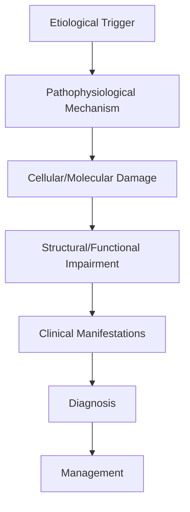
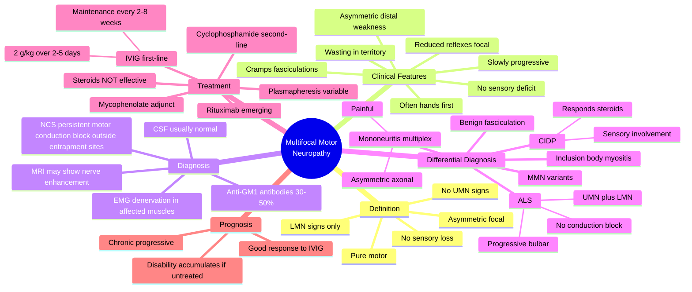

# Multifocal Motor Neuropathy

> [!tip] **High-Yield Definition**
> Comprehensive clinical note for Multifocal Motor Neuropathy covering definition, epidemiology, aetiology, pathophysiology, clinical features, investigations, differential diagnosis, management, drug interactions, procedures, complications, red flags, prognosis, topic correlation, and special situations for FCPS/MRCP examination preparation based on Davidson 24th Edition Chapter 25: Neurology.

---

## 1. Definition / Epidemiology / Classification

### Definition
Multifocal Motor Neuropathy is a neurological disorder within the 08 peripheral neuropathy category. It is characterised by specific clinical, pathological, radiological, and laboratory features that allow differentiation from related conditions.

### Epidemiology
- **Incidence/Prevalence:** Variable depending on the specific condition.
- **Age:** Adult onset is most common, but paediatric and elderly presentations occur.
- **Sex:** Variable depending on the condition.
- **Geography:** Worldwide distribution, with higher prevalence in certain regions.
- **Risk Factors:** Genetic predisposition, environmental factors, comorbidities, family history.

### Classification
| Subtype | Key Features | Prognosis |
|---------|-------------|-----------|
| Mild/early | Subtle symptoms, preserved function | Best |
| Moderate | Clear symptoms, functional impairment | Variable |
| Severe | Significant disability, complications | Worst |

---

## 2. Aetiology / Pathophysiology

### Aetiology
- **Primary (idiopathic):** Most cases have no identifiable cause.
- **Genetic:** May be inherited (AD, AR, X-linked, mitochondrial, sporadic).
- **Autoimmune:** Autoantibodies, immune-mediated inflammation.
- **Infectious:** Viral, bacterial, fungal, parasitic.
- **Metabolic:** Electrolyte, endocrine, hepatic, renal, nutritional.
- **Toxic:** Drugs, alcohol, heavy metals, environmental toxins.
- **Vascular:** Ischaemia, haemorrhage, vasculitis.
- **Neoplastic:** Primary, secondary, paraneoplastic.
- **Traumatic:** Acute, chronic, repetitive.
- **Degenerative:** Neurodegeneration, protein misfolding.

### Pathophysiology


---

## 3. Clinical Features

### History
- **Onset/Duration:** Acute, subacute, or chronic.
- **Progression:** Static, progressive, relapsing-remitting, stepwise.
- **Key symptoms:** Specific to the condition.
- **Triggers:** Stress, infection, trauma, drugs, hormonal, environmental.
- **Systemic symptoms:** Constitutional features.
- **Drug/Family/Social history:** Relevant exposures, comorbidities.

### Examination
| Domain | Key Findings | Localisation Value |
|--------|-------------|-------------------|
| Higher function | Cognitive, behavioural | Cortical, subcortical, limbic |
| Cranial nerves | Pupils, eye movements, facial, bulbar | Brainstem, cranial nerve, NMJ |
| Motor | Weakness, tone, reflexes | UMN, LMN, NMJ, muscle |
| Sensory | All modalities, pattern | Peripheral, spinal, brainstem |
| Coordination | Ataxia, nystagmus, dysmetria | Cerebellar, sensory, vestibular |
| Gait | Spastic, ataxic, parkinsonian | Multiple |
| Autonomic | Orthostatic, sweating, GI, bladder | Autonomic, peripheral, central |

### Specific Clinical Features
The clinical features are determined by the underlying aetiology, location of pathology, and rate of progression. Patients typically present with a constellation of symptoms and signs that allow clinical localisation and subsequent targeted investigation.

---

## 4. Diagnostic Approach / Algorithm

```mermaid
flowchart TD
    A[Clinical Presentation] --> B[Anatomical Localisation]
    B --> C[Pathophysiological Category]
    C --> D[Formulate Differential]
    D --> E[Targeted Investigations]
    E --> F[Confirm Diagnosis]
    F --> G[Assess Severity/Prognosis]
    G --> H[Initiate Management]
    H --> I[Monitor Response]
    I --> J{Response?}
    J --> YES1 [Good - Continue]
    J --> NO1 [Poor - Escalate]
    YES1 --> K[Monitor]
    NO1 --> H
```

---

## 5. Investigations

### First-Line Investigations
- **Blood tests:** FBC, U&Es, LFTs, glucose, calcium, magnesium, ESR, CRP, autoimmune, infection.
- **Imaging:** CT/MRI brain/spine (essential for most neurological conditions).
- **Neurophysiology:** EEG, nerve conduction, EMG, evoked potentials.
- **CSF:** Cell count, protein, glucose, OCBs, PCR, culture.

### Second-Line Investigations
- **Genetic testing:** Gene panels, WES, WGS.
- **Antibody testing:** Antineuronal, autoimmune, paraneoplastic.
- **Biopsy:** Nerve, muscle, brain, skin.
- **Advanced imaging:** PET-CT, MR spectroscopy, fMRI.

### Specialised Investigations
- **Biomarkers:** Neurofilament light chain, tau, beta-amyloid, 14-3-3, RT-QuIC.
- **Autonomic testing:** Head-up tilt, sudomotor, QSART.
- **Neuropsychology:** Cognitive testing, behavioural assessment.
- **Genetic counselling:** Family screening, predictive testing.

---

## 6. Differential Diagnosis

| Differential | Distinguishing Features | Key Test |
|--------------|------------------------|----------|
| Vascular | Sudden onset, focal, vascular risk factors | MRI/CT, vessel imaging |
| Inflammatory | Subacute, multifocal, systemic | MRI, CSF, antibodies |
| Infectious | Fever, systemic, exposure | Bloods, CSF, imaging |
| Neoplastic | Progressive, mass effect | MRI, biopsy |
| Degenerative | Progressive, symmetric, hereditary | MRI, genetic |
| Toxic/Metabolic | Drug history, systemic, reversible | Bloods, toxicology |
| Autoimmune | Multifocal, antibodies, immunotherapy response | Antibodies, MRI, CSF |
| Functional | Inconsistent, distractible | Clinical, video, biomarkers |

---

## 7. Management

### Acute Management
- **Stabilisation:** ABCDE approach, emergency resuscitation.
- **Specific treatment:** Disease-specific interventions.
- **Symptomatic relief:** Pain, seizures, spasticity, autonomic dysfunction.
- **Prevention of complications:** DVT, pressure sores, infection.

### Disease-Modifying Treatment
- **Pharmacological:** First-line, second-line, escalation, maintenance.
- **Procedural:** Surgery, biopsy, drainage, ablation, stimulation.
- **Immunotherapy:** Steroids, IVIG, plasma exchange, immunosuppressants, biologics.
- **Rehabilitation:** Physiotherapy, OT, speech therapy.

### Long-Term Management
- **Monitoring:** Clinical, imaging, biomarkers, side effects.
- **Prevention:** Vaccinations, prophylaxis, lifestyle modification.
- **Supportive care:** Multidisciplinary team, social work, psychological support.
- **Palliative care:** Advanced care planning, end-of-life care, hospice.

---

## 8. Drug Interactions / Contraindications / Comorbidity Cautions

| Drug Class | Interaction / Caution | Management |
|------------|----------------------|------------|
| Antiseizure medications | Enzyme induction, teratogenicity | Monitor, supplement, switch |
| Immunosuppressants | Infection, malignancy, teratogenicity | Monitor, prophylaxis |
| Anticoagulants | Bleeding risk, drug interactions | Monitor INR, avoid combinations |
| Antihypertensives | Hypotension, falls | Monitor BP, adjust dose |
| Antibiotics | Nephrotoxicity, ototoxicity | Monitor renal |
| Antivirals | Nephrotoxicity, neuropsychiatric | Monitor renal, dose adjust |
| Steroids | DM, HTN, osteoporosis, infection | Monitor, prophylaxis, taper |
| Biologics | Infusion reactions, infection | Monitor, prophylaxis |

---

## 9. Procedures

### Common Procedures
- **Lumbar puncture:** Diagnostic, therapeutic (IIH, NPH). Contraindications: raised ICP, mass lesion, coagulopathy.
- **Nerve conduction studies/EMG:** Diagnostic, prognosis. Minor discomfort.
- **EEG:** Diagnostic, monitoring. No significant complications.
- **MRI brain/spine:** Diagnostic, monitoring. Contraindications: pacemaker, metallic implants.
- **CT head:** Emergency, rapid. Radiation exposure, contrast reactions.
- **Biopsy:** Stereotactic, open. Indications: diagnosis, molecular profiling.

---

## 10. Complications

| Complication | Frequency | Prevention | Management |
|--------------|-----------|------------|------------|
| Infection | Common | Hygiene, prophylaxis, vaccination | Antibiotics, antifungals |
| Thrombosis | Common | Prophylaxis, mobility | Anticoagulation |
| Pressure sores | Common | Positioning, nutrition | Wound care, surgery |
| Spasticity | Common | Positioning, stretching | Baclofen, BoNT |
| Contractures | Common | Passive movements, splints | Physiotherapy, surgery |
| Aspiration | Common | Swallow assessment | NGT, PEG, thickeners |
| Falls | Common | Environment, mobility | Walking aids |
| Fractures | Common | Bone health, prevention | Vitamin D, bisphosphonate |
| Depression | Common | Screening, support | Antidepressants, CBT |
| Cognitive decline | Variable | Monitoring, training | Rehabilitation |
| Autonomic dysfunction | Variable | Monitoring, hydration | Midodrine, fludrocortisone |
| Respiratory failure | Variable | Monitoring, supportive | Ventilation, NIV |
| Death | Variable | Monitoring, palliative | End-of-life care |

---

## 11. Red Flags / Emergencies

### Emergency Presentations
- **Rapid neurological deterioration:** New focal deficit, decreased consciousness, seizures.
- **Status epilepticus:** Continuous seizures >5 min.
- **Raised ICP:** Headache, vomiting, papilloedema, altered consciousness.
- **Respiratory failure:** Hypoxia, hypercapnia, ventilatory failure.
- **Cardiac arrest:** Arrhythmia, MI, pulmonary embolism.
- **Infection:** Sepsis, meningitis, abscess, encephalitis.
- **Drug toxicity:** Overdose, side effects, interactions.
- **Haemorrhage:** Intracranial, systemic, coagulopathy.

---

## 12. Prognosis

### Natural History
- **Acute:** May resolve with treatment, may progress, may be fatal.
- **Subacute:** Variable, depends on cause and treatment.
- **Chronic:** Often progressive, may be stable, may have relapses.
- **Recovery:** Variable, may be complete, partial, or none.

### Prognostic Factors
- **Favourable:** Young age, early treatment, mild disease, reversible cause, good premorbid function, family support.
- **Unfavourable:** Older age, delayed treatment, severe disease, irreversible cause, poor premorbid function, comorbidities.

---

## 13. Topic Correlation

| Related Topic | Link | Key Overlap |
|---------------|------|-------------|
| Davidson 24th Ed Chapter 25 | [[Davidson Chapter 25 - Neurology Hierarchy]] | Comprehensive neurology |
| Neurology MOC | [[Neurology MOC]] | All neurology topics |
| Drug Reference | [[../00_Index/Neurology Drug Reference]] | Medications |
| Local Hub | [[../08_Peripheral_Neuropathy/Hub]] | Section-specific |
| Clinical Examination | [[../01_Fundamentals_Examination/Neurological History Taking]] | Clinical approach |
| Investigation | [[../01_Fundamentals_Examination/Neuroimaging (CT-MRI) Principles]] | Imaging |

---

## 14. Special Situations

| Situation | Consideration |
|-----------|---------------|
| **Pregnancy** | Pre-conception counselling, teratogenicity, drug safety, monitoring, delivery planning, breastfeeding. |
| **Lactation** | Drug safety, breastfeeding, monitoring, support. |
| **Paediatric** | Developmental considerations, drug dosing, school, family, vaccination, growth, puberty. |
| **Elderly / Frail** | Comorbidities, polypharmacy, falls, bone health, cognition, social, end-of-life. |
| **Renal impairment** | Drug dose adjustment, monitoring, dialysis, transplant. |
| **Hepatic impairment** | Drug dose adjustment, monitoring, transplant. |
| **Immunocompromised** | Infection prophylaxis, vaccination, drug interactions, malignancy screening. |
| **Perioperative** | Drug management, anaesthesia planning, VTE prophylaxis, infection prevention, monitoring. |
| **Driving / DVLA** | Fitness to drive, restrictions, notification, reassessment. |
| **Occupational** | Fitness for work, adaptations, rehabilitation, disability, return to work. |

---

## FCPS/MRCP High-Yield Summary

| Category | Key Points |
|----------|------------|
| **Definition** | Comprehensive definition with key diagnostic criteria |
| **Epidemiology** | Incidence, prevalence, age, sex, geography, risk factors |
| **Aetiology** | Primary causes, secondary causes, genetic, environmental |
| **Pathophysiology** | Mechanism of disease, cellular/molecular basis |
| **Clinical Features** | History, examination, key findings, variants |
| **Diagnosis** | Diagnostic criteria, classification, severity |
| **Investigations** | First-line, second-line, specialised, biomarkers |
| **Differential Diagnosis** | Key differentials, distinguishing features, tests |
| **Management** | Acute, disease-modifying, symptomatic, supportive |
| **Complications** | Common, serious, prevention, management |
| **Prognosis** | Natural history, prognostic factors, outcomes |
| **Viva Pearls** | Key examination points |
| **Drug Doses** | First-line, second-line, emergency |
| **Scoring Systems** | Specific scores used in management |
| **Genetics** | Inheritance, genes, mutations, family screening |
| **Imaging Signs** | Characteristic findings, differential |

---

## Viva Questions (PACES/FCPS Style)

1. **Q:** Define and classify its variants.
   **A:** Comprehensive definition with classification of subtypes based on aetiology, severity, and clinical features.

2. **Q:** What are the key clinical features?
   **A:** Specific symptoms and signs including onset, progression, key features, and associated findings.

3. **Q:** What is the first-line treatment?
   **A:** First-line pharmacological and non-pharmacological management based on current evidence.

4. **Q:** What are the red flags requiring urgent referral?
   **A:** Specific emergency presentations and complications requiring immediate intervention.

5. **Q:** What is the prognosis?
   **A:** Natural history, prognostic factors, and long-term outcomes.

6. **Q:** How do you differentiate from key differentials?
   **A:** Clinical features, investigations, and response to treatment that distinguish from alternative diagnoses.

7. **Q:** What investigations are most useful?
   **A:** First-line and second-line investigations including imaging, neurophysiology, CSF, and biomarkers.

8. **Q:** Describe the stepwise management approach.
   **A:** Stepwise escalation from first-line to second-line to third-line therapy with monitoring.

9. **Q:** What are the emergency presentations?
   **A:** Specific emergency scenarios and immediate management priorities.

10. **Q:** How does management change in pregnancy/paediatrics/elderly?
    **A:** Special considerations for each population including drug safety, monitoring, and support.

---

## Common Confusions / Exam Traps

| Confusion | Clarification |
|-----------|---------------|
| Similar presentation but different cause | Differentiate by history, examination, investigations |
| Treatment response vs natural history | Assess with objective measures, biomarkers |
| Drug interactions | Check each drug, monitor, adjust doses |
| Disease progression vs treatment failure | Monitor response, escalate appropriately |
| Functional vs organic | Inconsistent, distractible, disability greater than impairment |
| Acute vs chronic | Time course, progression, reversibility |
| Primary vs secondary | Underlying cause, contributing factors |
| Side effects vs symptoms | Temporal relationship, dose relationship |

---

## Mnemonics

1. **"MMN = Motor-only, Multifocal, No-sensory"** — Pure motor, asymmetric, focal LMN neuropathy. Unlike CIDP, sensation is preserved. Unlike ALS, no UMN signs and conduction block is present.
2. **"GM1 = Good Motor 1"** — Anti-GM1 (IgM against ganglioside GM1) antibodies are present in 30–50% of MMN patients; useful diagnostic marker.
3. **"Block = Treat with IVIG"** — Persistent motor conduction block outside entrapment sites is the electrophysiological hallmark and predicts IVIG responsiveness.
4. **"NO Steroids in MMN"** — Unlike CIDP, MMN does NOT respond to corticosteroids (and may worsen); IVIG is first-line.
5. **"ALS vs MMN: Block, Bad, Beat"** — MMN has conduction block and anti-GM1, no UMN, responds to IVIG; ALS has UMN+LMN, no block, progressive.

---

## Mind Map



---

## Spaced Repetition Trackers

| **Day** | **Recall Goal** | **Self-Test Method** |
|---------|-----------------|---------------------|
| **Day 1** | Definition of MMN: pure motor, asymmetric, focal LMN signs, no sensory, no UMN | Write 5 diagnostic criteria |
| **Day 3** | Key features: conduction block on motor NCS, anti-GM1 antibodies (30-50%), LMN pattern | Sketch NCS showing block |
| **Day 7** | Differential from ALS: MMN has conduction block, anti-GM1, no UMN, IVIG-responsive; ALS has UMN+LMN, no block, fatal | Comparison table |
| **Day 14** | Investigations: motor NCS (looking for block in non-entrapment sites), EMG (fibrillations in affected muscles), anti-GM1, MRI | Investigation order; diagnostic criteria |
| **Day 30** | Treatment: IVIG first-line (2 g/kg induction + maintenance), NOT steroids; cyclophosphamide/rituximab second-line | Algorithm: first, second, third line |
| **Day 90** | Course, prognosis, monitoring response, complications (axonal loss if untreated), disability accumulation | Full clinical vignette; viva |

---

## Self-Test Scorecard

| **#** | **Topic** | **Score /5** | **Notes** |
|-------|-----------|--------------|-----------|
| 1 | Definition (pure motor, asymmetric, focal LMN) | | |
| 2 | Clinical Features (no sensory, no UMN, LMN signs) | | |
| 3 | Investigations (motor NCS, conduction block, anti-GM1) | | |
| 4 | Differential Diagnosis (ALS, CIDP, MM) | | |
| 5 | Treatment (IVIG first-line, NOT steroids) | | |
| 6 | Pathophysiology (motor demyelination, GM1 target) | | |
| 7 | Diagnosis Criteria (EFNS/PNS criteria) | | |
| 8 | Anti-GM1 Antibodies (30-50%, predictive of IVIG response) | | |
| 9 | Red Flags & Mimics (bulbar, respiratory, UMN → think ALS) | | |
| 10 | Prognosis & monitoring (chronic, IVIG-responsive) | | |
| | **Total /50** | | |

---

## MCQs (10)

1. **A 40-year-old man presents with progressive asymmetric hand weakness, wasting of intrinsic hand muscles, and fasciculations. Sensation is intact. Reflexes are reduced in affected arm. NCS shows motor conduction block at the forearm. Diagnosis?**
   - A. Amyotrophic lateral sclerosis (ALS)
   - B. Multifocal motor neuropathy (MMN)
   - C. Chronic inflammatory demyelinating polyneuropathy (CIDP)
   - D. Diabetic amyotrophy
   - **Answer: B** — Pure motor, asymmetric, conduction block, no sensory loss, no UMN = MMN. ALS would have UMN signs and no conduction block.

2. **Which statement about treatment of MMN is correct?**
   - A. Corticosteroids are first-line
   - B. IVIG is the first-line treatment
   - C. Plasmapheresis is curative
   - D. No effective treatment exists
   - **Answer: B** — IVIG (2 g/kg induction over 2-5 days, then maintenance every 2-8 weeks) is the first-line treatment. Steroids are NOT effective (unlike CIDP).

3. **The neurophysiological hallmark of MMN is:**
   - A. Uniform demyelination in all nerves
   - B. Persistent motor conduction block in non-entrapment sites
   - C. Sensory axonal loss
   - D. Myopathic EMG pattern
   - **Answer: B** — Motor conduction block (≥50% reduction in proximal vs distal CMAP amplitude) outside entrapment sites is the key feature. Sensory studies are normal.

4. **Anti-GM1 antibodies are found in approximately what percentage of MMN patients?**
   - A. <5%
   - B. 30–50%
   - C. >90%
   - D. Never
   - **Answer: B** — Anti-GM1 (IgM) antibodies are present in 30-50% of MMN cases; when present, predict IVIG responsiveness.

5. **A 45-year-old woman with suspected MMN is started on prednisolone. After 6 weeks there is no improvement. The most likely explanation is:**
   - A. Diagnosis is wrong; she has ALS
   - B. Steroids are not effective in MMN; IVIG is first-line
   - C. Dose too low
   - D. Need to add cyclophosphamide
   - **Answer: B** — Steroids do NOT reliably help MMN (may even worsen); switch to IVIG.

6. **Which feature would make the diagnosis of MMN LESS likely?**
   - A. Bulbar weakness and dysarthria
   - B. Asymmetric hand weakness
   - C. Anti-GM1 antibodies
   - D. Motor conduction block
   - **Answer: A** — Bulbar involvement suggests ALS or other motor neuron disease; MMN is typically confined to limb nerves.

7. **MMN is differentiated from ALS by:**
   - A. ALS has sensory loss; MMN does not
   - B. MMN has motor conduction block and anti-GM1 antibodies; ALS has UMN signs and no conduction block
   - C. MMN causes death within 2 years; ALS does not
   - D. ALS responds to IVIG; MMN does not
   - **Answer: B** — MMN: block + anti-GM1 + no UMN + IVIG-responsive + slow progression. ALS: UMN+LMN + no block + progressive bulbar/respiratory + fatal in 3-5 years.

8. **Female-to-male ratio in MMN is approximately:**
   - A. 1:3 (males predominate)
   - B. 3:1 (females predominate)
   - C. Equal
   - D. Children only
   - **Answer: A** — MMN has a male predominance (~3:1), with onset typically between 20-50 years.

9. **Reflex findings in MMN are typically:**
   - A. Universally hyperreflexic (UMN sign)
   - B. Focal areflexia in the territory of affected nerves
   - C. Brisk jaw jerk
   - D. Normal throughout
   - **Answer: B** — Reduced or absent reflexes in the distribution of the affected (blocked) nerve; not universal.

10. **Pathological basis of conduction block in MMN is:**
    - A. Axonal loss at entrapment sites
    - B. Focal motor nerve demyelination by inflammatory cells, often with IgM anti-GM1 antibodies binding GM1 ganglioside at nodes of Ranvier
    - C. Loss of anterior horn cells
    - D. Neuromuscular junction blockade
    - **Answer: B** — IgM anti-GM1 binds GM1 at nodes of Ranvier; complement activation produces focal demyelination → conduction block.

---

## SBA Questions (10)

1. **A 38-year-old man develops progressive right wrist drop and left foot drop over 4 months, with cramps and fasciculations but preserved sensation. Reflexes are reduced in the affected limbs. NCS shows motor conduction block in the radial nerve at the upper arm and peroneal nerve at the knee. Anti-GM1 antibody positive. The best initial treatment is:**
   - A. Prednisolone 60 mg daily
   - B. IVIG 2 g/kg over 2-5 days, then maintenance
   - C. Plasmapheresis
   - D. Methotrexate
   - E. Cyclophosphamide only
   - **Answer: B** — IVIG is the first-line, evidence-based treatment for MMN.

2. **In MMN, anti-GM1 antibodies:**
   - A. Are directed against acetylcholine receptors
   - B. Target GM1 ganglioside at nodes of Ranvier on motor nerves
   - C. Are present in >90% of patients
   - D. Predict failure of IVIG
   - E. Are also seen in multiple sclerosis
   - **Answer: B** — IgM anti-GM1 binds GM1 at nodes of Ranvier of motor nerves, causing focal demyelination and conduction block.

3. **A 50-year-old man with MMN presents for review. He reports good initial response to IVIG but requires increasingly frequent infusions. The next most appropriate escalation is:**
   - A. Stop IVIG and start steroids
   - B. Add subcutaneous IVIG or immunosuppressant (cyclophosphamide, rituximab, mycophenolate)
   - C. Plasmapheresis only
   - D. Surgery
   - E. Hospice referral
   - **Answer: B** — If IVIG response wanes, options include more frequent/dose-adjusted IVIG, SCIG, or immunosuppressants (cyclophosphamide, rituximab, mycophenolate).

4. **Which of the following is NOT a typical feature of MMN?**
   - A. Asymmetric distal weakness
   - B. Sensory loss in glove-stocking distribution
   - C. Conduction block on motor NCS
   - D. Anti-GM1 antibodies
   - E. Reduced reflexes in affected distribution
   - **Answer: B** — Sensation is preserved in MMN by definition.

5. **Persistent motor conduction block in MMN is defined as:**
   - A. ≥20% reduction in CMAP amplitude between distal and proximal stimulation
   - B. ≥50% reduction in proximal vs distal CMAP amplitude across a non-entrapment site
   - C. Any focal slowing across the elbow
   - D. Absent F-waves only
   - E. Increased distal motor latency
   - **Answer: B** — EFNS/PNS criteria: definite motor conduction block = ≥50% reduction in CMAP amplitude (negative-peak area) between distal and proximal stimulation, in a nerve segment not prone to entrapment.

6. **First-line treatment of MMN in a 35-year-old pregnant woman is:**
   - A. Cyclophosphamide
   - B. IVIG (safe in pregnancy)
   - C. Methotrexate
   - D. Rituximab
   - E. Plasmapheresis only
   - **Answer: B** — IVIG is safe in pregnancy and remains the first-line therapy for MMN.

7. **Without treatment, MMN typically:**
   - A. Resolves spontaneously
   - B. Slowly progresses with accumulating disability and eventual axonal loss
   - C. Causes death within 1 year
   - D. Develops bulbar palsy within 5 years
   - E. Converts to ALS
   - **Answer: B** — Chronic progressive course with accumulating disability; untreated, secondary axonal loss occurs.

8. **The most common clinical presentation of MMN is:**
   - A. Bilateral symmetric proximal weakness
   - B. Asymmetric distal upper-limb weakness, often starting in one hand
   - C. Cranial nerve palsy (ptosis, ophthalmoplegia)
   - D. Respiratory failure
   - E. Pure sensory ataxia
   - **Answer: B** — Asymmetric distal weakness (often hand intrinsic wasting, wrist drop) is the classic presentation.

9. **A 42-year-old man with progressive asymmetric distal weakness and anti-GM1 antibodies does NOT respond to IVIG 2 g/kg. The next best step is:**
   - A. Confirm the diagnosis and consider adding cyclophosphamide or rituximab
   - B. Discontinue treatment and observe
   - C. Begin hospice
   - D. Lumbar puncture
   - E. Whole-genome sequencing
   - **Answer: A** — Confirm diagnosis, consider second-line immunosuppression (cyclophosphamide or rituximab), or trial of more intensive IVIG.

10. **MMN is classified under which broad category of neuropathy?**
    - A. Hereditary motor and sensory neuropathy
    - B. Acquired immune-mediated demyelinating neuropathy (motor predominant)
    - C. Pure sensory neuronopathy
    - D. Autonomic neuropathy
    - E. Vasculitic neuropathy
    - **Answer: B** — MMN is an acquired immune-mediated demyelinating neuropathy affecting only motor nerves.

---

## Tags

#neurology #peripheral-neuropathy #multifocal-motor-neuropathy #MMN #conduction-block #anti-GM1 #IVIG #ALS-differential #FCPS #MRCP

## Local Navigation
**Heading Hub:** [[../Hub]]  
**Chapter Hierarchy:** [[Davidson Chapter 25 - Neurology Hierarchy]]  
**Chapter MOC:** [[Neurology MOC]]  
**Drug Reference:** [[../00_Index/Neurology Drug Reference]]

## PasTest Scenario SBAs (Clinical Vignettes)

> **Auto-generated PasTest/Mediscope-style scenario SBAs** grounded in the authored source. Each scenario tests a real clinical fact (triad, specific sign, contraindication, trial, first-line Rx) extracted from the topic. *Source: Ch 27: Neurology & Stroke — Multifocal Motor Neuropathy*

**Q1.** Which of the following features is most specific or characteristic of Multifocal Motor Neuropathy?

  - **A.** Key symptoms:
  - **B.** A feature common to many acute inflammatory conditions
  - **C.** A non-specific sign that does not localise the diagnosis
  - **D.** An investigation finding rather than a clinical feature

  > **Answer: A** — Key symptoms:
  >
  > *Source:* - **Key symptoms:** Specific to the condition

**Q2.** What is the most appropriate first-line therapy for Multifocal Motor Neuropathy?

  - **A.** Rehabilitation:
  - **B.** An advanced/surgical therapy reserved for refractory disease
  - **C.** Symptomatic treatment only, no disease-modifying therapy
  - **D.** Empiric broad-spectrum therapy without specific indication

  > **Answer: A** — Rehabilitation:
  >
  > *Source:* **Rehabilitation:** Physiotherapy, OT, speech therapy.

