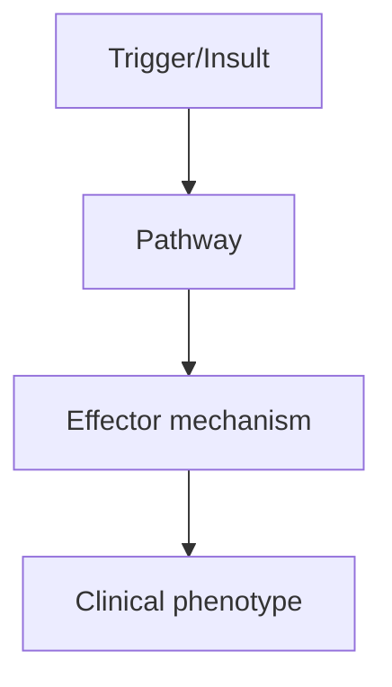
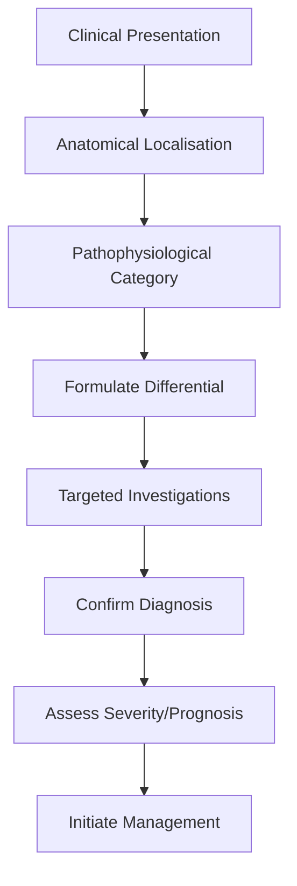
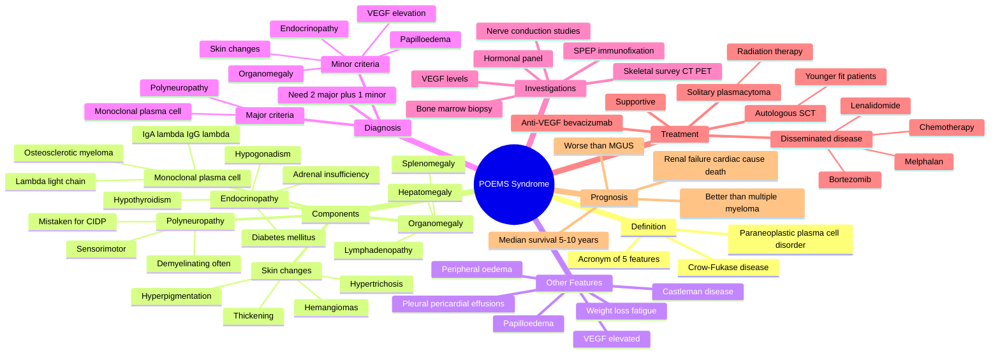

# POEMS Syndrome

> [!tip] **High-Yield Definition**
> POEMS syndrome: rare paraneoplastic syndrome. Polyneuropathy, Organomegaly, Endocrinopathy, M-protein, Skin changes. Plasma cell disorder (osteosclerotic myeloma, Castleman disease). VEGF-driven. Treatable but serious.

---

## 1. Definition / Epidemiology / Classification

### Definition
POEMS syndrome: rare paraneoplastic syndrome. Polyneuropathy, Organomegaly, Endocrinopathy, M-protein, Skin changes. Plasma cell disorder (osteosclerotic myeloma, Castleman disease). VEGF-driven. Treatable but serious.

### Epidemiology
Prevalence: 0.3/100,000. Age: 40-60y. Male predominance (2:1). Median survival: 5-10 years (improved with therapy).

### Classification
| Variant | Key Features | Prognosis |
|---------|-------------|-----------|
| | | |

---

## 2. Aetiology / Pathophysiology

### Aetiology
Plasma cell neoplasm: osteosclerotic myeloma (>95%), Castleman disease (30-50%), MGUS. VEGF (vascular endothelial growth factor) elevation: pathogenetic. Cytokines: IL-6, IL-1, TNF-alpha. Monoclonal protein: IgA or IgG lambda most common. Lymphadenopathy. Hepatomegaly, splenomegaly. Endocrine: diabetes, hypothyroidism, hypogonadism, adrenal insufficiency, gynaecomastia. Skin: hyperpigmentation, hypertrichosis, skin thickening, telangiectasia, papilloedema, glomeruloid haemangioma. Polyneuropathy: demyelinating, axonal, length-dependent. Papilloedema (30-50%).

### Pathophysiology

---

## 3. Clinical Features

### History
- **Onset/Duration:**
- **Progression:**
- **Key symptoms:**
- **Triggers:**
- **Systemic symptoms:**
- **Drug/Family/Social history:**

### Examination
| Domain | Key Findings | Localisation Value |
|--------|-------------|-------------------|
| | | |

### Specific Clinical Features
Polyneuropathy: distal, symmetric, sensorimotor, demyelinating + axonal, progressive. Often severe, foot drop, sensory ataxia, motor weakness. Organomegaly: hepatomegaly, splenomegaly, lymphadenopathy. Endocrinopathy: diabetes (50%), hypothyroidism (30%), hypogonadism (erectile dysfunction, gynaecomastia, amenorrhoea), adrenal insufficiency. M-protein: IgA or IgG lambda (95%), osteosclerotic bone lesions. Skin: hyperpigmentation, hypertrichosis, skin thickening, telangiectasia, papilloedema, glomeruloid haemangioma. Papilloedema (30-50%, often). Oedema: peripheral, effusions (pericardial, pleural, ascites). Constitutional: fatigue, weight loss, fever. POEMS may be incomplete (e.g., only Polyneuropathy, Organomegaly, Endocrinopathy - need M-protein).

---

## 4. Diagnostic Approach / Algorithm

---

## 5. Investigations

Diagnostic criteria (need all): (1) Polyneuropathy (demyelinating, often mistaken for CIDP), (2) Monoclonal plasma cell disorder (M-protein, usually lambda, osteosclerotic bone lesion), (3) ≥1 other feature: organomegaly, endocrinopathy, skin changes, papilloedema, extravascular volume overload, thrombocytosis/polycythemia, VEGF elevation. Workup: SPEP, immunofixation (IgA/IgG lambda), serum free light chains (abnormal ratio), bone survey (skeletal X-ray, CT, PET-CT - osteosclerotic lesions), lymph node biopsy (Castleman), VEGF level (elevated, >1000 pg/ml), NCS (demyelinating + axonal, often misdiagnosed as CIDP), bone marrow biopsy, MRI spine (if solitary plasmacytoma). Endocrine: TSH, glucose, HbA1c, testosterone, cortisol, oestradiol. Skin biopsy: glomeruloid haemangioma. Fundoscopy: papilloedema. Exclude: CIDP, MMN, ALS, diabetic neuropathy, amyloidosis.

---

## 6. Differential Diagnosis

| Differential | Distinguishing Features | Key Test |
|--------------|------------------------|----------|
| | | |

---

## 7. Management

Directed at plasma cell clone. First-line: lenalidomide + dexamethasone (Rd) - effective, oral. Bortezomib-based (VD or VTD - bortezomib, dexamethasone, thalidomide). Autologous stem cell transplant (ASCT) - for eligible (young, fit). Anti-VEGF: bevacizumab (anti-VEGF monoclonal) - effective, especially with rapid progression. Anti-plasma cell: daratumumab (anti-CD38). Local radiation: solitary osteosclerotic lesion. Supportive: physiotherapy, OT, walking aids, thromboprophylaxis (high VTE risk), pain management (gabapentin, pregabalin, duloxetine, TCAs), endocrine replacement (levothyroxine, insulin, testosterone, hydrocortisone), diuretics for oedema, paracentesis for effusions. Multidisciplinary: haematology, neurology, endocrinology, palliative, OT, PT. Monitor: M-protein, VEGF, NCS, organ function.

---

## 8. Drug Interactions / Contraindications / Comorbidity Cautions

| Drug | Interaction / Caution | Management |
|------|----------------------|------------|
| | | |

---

## 9. Procedures (if applicable)

### Procedure:
- **Indications:**
- **Contraindications:**
- **Preparation / Principle:**
- **Complications:**
- **Viva Pearls:**

---

## 10. Complications

| Complication | Frequency | Prevention / Monitoring | Management |
|--------------|-----------|------------------------|------------|
| | | | |

---

## 11. Red Flags / Emergencies

Rapid neurological deterioration, respiratory failure (rare), renal failure (rare), VTE (high risk), heart failure, sepsis, hyperviscosity, multi-organ failure.

---

## 12. Prognosis

Median survival: 5-10 years (improved with modern therapy). ASCT: 90% 5-year survival. Lenalidomide-based: 80% 5-year survival. Cause of death: progressive neuropathy, cardiopulmonary, infection, VTE. Early diagnosis and treatment critical. Multidisciplinary care essential. Monitor for relapse (VEGF, M-protein).

---

## 13. Topic Correlation

| Related Topic | Link | Key Overlap |
|---------------|------|-------------|
| | | |

---

## 14. Special Situations

| Situation | Consideration |
|-----------|---------------|
| **Pregnancy** | |
| **Lactation** | |
| **Paediatric** | |
| **Elderly / Frail** | |
| **Renal impairment** | |
| **Hepatic impairment** | |
| **Immunocompromised** | |
| **Perioperative** | |
| **Driving / DVLA** | |
| **Occupational** | |

---

## FCPS/MRCP High-Yield Summary

| Category | Key Points |
|----------|------------|
| **Definition** | POEMS syndrome: rare paraneoplastic syndrome. Polyneuropathy, Organomegaly, Endocrinopathy, M-protein, Skin changes. Plasma cell disorder (osteosclerotic myeloma, Castleman disease). VEGF-driven. Trea |
| **Epidemiology** | Prevalence: 0.3/100,000. Age: 40-60y. Male predominance (2:1). Median survival: 5-10 years (improved with therapy). |
| **Pathophysiology** | |
| **Clinical** | Polyneuropathy: distal, symmetric, sensorimotor, demyelinating + axonal, progressive. Often severe, foot drop, sensory ataxia, motor weakness. Organomegaly: hepatomegaly, splenomegaly, lymphadenopathy |
| **Diagnosis** | |
| **Investigations** | Diagnostic criteria (need all): (1) Polyneuropathy (demyelinating, often mistaken for CIDP), (2) Monoclonal plasma cell disorder (M-protein, usually lambda, osteosclerotic bone lesion), (3) ≥1 other f |
| **Management** | Directed at plasma cell clone. First-line: lenalidomide + dexamethasone (Rd) - effective, oral. Bortezomib-based (VD or VTD - bortezomib, dexamethasone, thalidomide). Autologous stem cell transplant ( |
| **Complications** | |
| **Prognosis** | Median survival: 5-10 years (improved with modern therapy). ASCT: 90% 5-year survival. Lenalidomide-based: 80% 5-year survival. Cause of death: progressive neuropathy, cardiopulmonary, infection, VTE. |
| **Viva Pearls** | |
| **Drug Doses** | |
| **Scoring Systems** | |
| **Genetics** | |
| **Imaging Signs** | |

---

## Viva Questions (PACES/FCPS Style)

1. **Q:** Define POEMS Syndrome and classify its variants.
   **A:** Based on the definition above.

2. **Q:** What are the key clinical features?
   **A:** Polyneuropathy: distal, symmetric, sensorimotor, demyelinating + axonal, progressive. Often severe, foot drop, sensory ataxia, motor weakness. Organomegaly: hepatomegaly, splenomegaly, lymphadenopathy. Endocrinopathy: diabetes (50%), hypothyroidism (30%), hypogonadism (erectile dysfunction, gynaecom

3. **Q:** What is the first-line treatment?
   **A:** Based on the management section.

4. **Q:** What are the red flags requiring urgent referral?
   **A:** Rapid neurological deterioration, respiratory failure (rare), renal failure (rare), VTE (high risk), heart failure, sepsis, hyperviscosity, multi-organ failure.

5. **Q:** What is the prognosis?
   **A:** Median survival: 5-10 years (improved with modern therapy). ASCT: 90% 5-year survival. Lenalidomide-based: 80% 5-year survival. Cause of death: progressive neuropathy, cardiopulmonary, infection, VTE. Early diagnosis and treatment critical. Multidisciplinary care essential. Monitor for relapse (VEGF

6. **Q:** How do you differentiate POEMS Syndrome from key differentials?
   **A:** Clinical features, investigations, and response to treatment.

7. **Q:** What investigations are most useful?
   **A:** Based on the investigations section.

8. **Q:** Describe the stepwise management approach.
   **A:** Based on the management algorithm.

9. **Q:** What are the emergency presentations?
   **A:** Based on the red flags section.

10. **Q:** How does management change in pregnancy/paediatrics/elderly?
    **A:** Special considerations per population.

---

## Common Confusions / Exam Traps

| Confusion | Clarification |
|-----------|---------------|
| | |

---

## Mnemonics

1. **"POEMS"** — **P**olyneuropathy, **O**rganomegaly (hepato/spleno/lymphadenopathy), **E**ndocrinopathy, **M**onoclonal plasma cell disorder, **S**kin changes.
2. **"Crow-Fukase"** — Alternative name (also "Takatsuki disease" in Japan); polyneuropathy, organomegaly, endocrinopathy, M-protein, skin.
3. **"VEGF = Very Essential Factor for Growth"** — Vascular endothelial growth factor is markedly elevated and drives many features (oedema, effusions, hemangiomas, organomegaly).
4. **"Lambda Light Chain"** — Almost always lambda (λ) light chain (rarely kappa); M-protein usually IgA-λ or IgG-λ.
5. **"Osteosclerotic, not Lytic"** — Bone lesions are osteosclerotic (sclerotic, not lytic as in classic multiple myeloma).

---

## Mind Map

---

## Spaced Repetition Trackers

| **Day** | **Recall Goal** | **Self-Test Method** |
|---------|-----------------|---------------------|
| **Day 1** | Definition: POEMS acronym; plasma cell neoplasm with paraneoplastic features; Crow-Fukase disease | Spell out POEMS; 5 features |
| **Day 3** | Required criteria: polyneuropathy + monoclonal plasma cell disorder (λ); need 1+ minor criteria | Write diagnostic algorithm |
| **Day 7** | Clinical: neuropathy (CIDP mimic), organomegaly, endocrinopathy (thyroid, DM, gonadal, adrenal), skin (hyperpigmentation, hemangiomas, hypertrichosis), papilloedema | List each feature with example |
| **Day 14** | Investigations: SPEP/immunofixation (IgA-λ, IgG-λ), VEGF (very elevated), skeletal survey (osteosclerotic), NCS (demyelinating), bone marrow | Investigation order and interpretation |
| **Day 30** | Treatment: radiation for solitary plasmacytoma; chemotherapy (melphalan, lenalidomide, bortezomib); ASCT for younger fit patients; anti-VEGF (bevacizumab) | Algorithm based on disease extent |
| **Day 90** | Differential (CIDP, MGUS, multiple myeloma, amyloidosis), prognosis (median survival 5-10 years), monitoring (VEGF, M-protein, neuropathy) | Full clinical vignette; viva |

---

## Self-Test Scorecard

| **#** | **Topic** | **Score /5** | **Notes** |
|-------|-----------|--------------|-----------|
| 1 | Definition & Acronym (POEMS, Crow-Fukase) | | |
| 2 | Diagnostic Criteria (2 major + 1 minor) | | |
| 3 | Clinical Features (polyneuropathy, organomegaly, endocrinopathy, M-protein, skin) | | |
| 4 | Investigations (SPEP, VEGF, skeletal survey, NCS) | | |
| 5 | Differential Diagnosis (CIDP, MGUS, myeloma, amyloidosis) | | |
| 6 | Management (radiation solitary, chemotherapy, ASCT, anti-VEGF) | | |
| 7 | Red Flags & emergencies (renal failure, cardiac, effusions) | | |
| 8 | Castleman Disease & VEGF pathophysiology | | |
| 9 | Osteosclerotic Myeloma vs Lytic Myeloma | | |
| 10 | Prognosis (median survival 5-10 years, better than MM) | | |
| | **Total /50** | | |

---

## MCQs (10)

1. **POEMS syndrome is characterized by:**
   - A. Polyneuropathy, Organomegaly, Endocrinopathy, M-protein, Skin changes
   - B. Pain, Osteoporosis, Embolism, Myelopathy, Stroke
   - C. Polyuria, Oedema, Epilepsy, Migraine, Syncope
   - D. Peripheral neuropathy, Optic neuritis, Endocrine, Migraine, Spasticity
   - **Answer: A** — POEMS = Polyneuropathy, Organomegaly, Endocrinopathy, M-protein, Skin changes.

2. **The monoclonal light chain in POEMS syndrome is almost always:**
   - A. Kappa
   - B. Lambda
   - C. Equal kappa and lambda
   - D. Heavy chain only
   - **Answer: B** — Lambda light chain restriction is characteristic (IgA-λ or IgG-λ).

3. **Bone lesions in POEMS are characteristically:**
   - A. Lytic (punched-out)
   - B. Osteosclerotic (sclerotic)
   - C. Diffuse osteoporosis
   - D. Normal bone scan
   - **Answer: B** — Osteosclerotic lesions are characteristic, in contrast to classic lytic lesions of multiple myeloma.

4. **The most specific laboratory marker elevated in POEMS is:**
   - A. Calcium
   - B. VEGF (vascular endothelial growth factor)
   - C. Uric acid
   - D. Beta-2 microglobulin only
   - **Answer: B** — VEGF is markedly elevated and correlates with disease activity; used for monitoring.

5. **POEMS-associated polyneuropathy is often initially misdiagnosed as:**
   - A. Diabetic neuropathy
   - B. Chronic inflammatory demyelinating polyneuropathy (CIDP)
   - C. Guillain-Barré syndrome
   - D. ALS
   - **Answer: B** — Demyelinating polyneuropathy with raised CSF protein mimics CIDP; organomegaly, endocrinopathy, skin changes, and M-protein point to POEMS.

6. **Treatment of a solitary plasmacytoma in POEMS is:**
   - A. Combination chemotherapy
   - B. Localised radiation therapy
   - C. Autologous stem cell transplant
   - D. Plasmapheresis
   - **Answer: B** — Solitary plasmacytoma: radiation may induce durable remission. Disseminated disease: systemic therapy.

7. **Skin changes in POEMS include:**
   - A. Bullous pemphigoid
   - B. Hyperpigmentation, hemangiomas, hypertrichosis
   - C. Psoriasis and psoriatic arthritis
   - D. Stevens-Johnson syndrome
   - **Answer: B** — Hyperpigmentation, multiple cherry angiomas/hemangiomas, and hypertrichosis are characteristic.

8. **Endocrine dysfunction in POEMS most commonly includes:**
   - A. Hypothyroidism, diabetes mellitus, hypogonadism, adrenal insufficiency
   - B. Hyperthyroidism only
   - C. Cushing's syndrome only
   - D. Primary hyperparathyroidism
   - **Answer: A** — Multi-axis involvement: thyroid (hypothyroidism most common), gonadal (hypogonadism), pancreatic (diabetes), adrenal (insufficiency).

9. **POEMS syndrome is associated with:**
   - A. Multiple myeloma with lytic lesions
   - B. Osteosclerotic myeloma and angiofollicular lymph node hyperplasia (Castleman disease)
   - C. MGUS only
   - D. Waldenström macroglobulinemia
   - **Answer: B** — Osteosclerotic myeloma + Castleman disease (angiofollicular hyperplasia) are typical associations.

10. **Median overall survival in POEMS syndrome is approximately:**
    - A. 6 months
    - B. 5–10 years
    - C. 1 year
    - D. >20 years
    - **Answer: B** — Median survival 5-10 years (longer than classic multiple myeloma); renal failure, cardiac complications, and progressive neuropathy are leading causes of death.

---

## SBA Questions (10)

1. **A 55-year-old man presents with progressive sensorimotor peripheral neuropathy, hepatosplenomegaly, hyperpigmentation, and a monoclonal lambda spike on serum protein electrophoresis. Bone survey shows sclerotic vertebral lesions. Most likely diagnosis?**
   - A. Multiple myeloma
   - B. POEMS syndrome
   - C. MGUS
   - D. Waldenström macroglobulinemia
   - E. AL amyloidosis
   - **Answer: B** — POEMS: neuropathy + organomegaly + skin change + monoclonal λ + osteosclerotic lesions = pathognomonic cluster.

2. **The most specific serum marker for diagnosis and monitoring of POEMS is:**
   - A. Hypercalcemia
   - B. VEGF
   - C. Serum free light chain ratio alone
   - D. Beta-2 microglobulin only
   - E. Serum ferritin
   - **Answer: B** — VEGF is markedly elevated (often >2000 pg/mL); correlates with disease activity.

3. **Papilloedema in POEMS is most likely caused by:**
   - A. Raised intracranial pressure from cerebral venous sinus thrombosis
   - B. Direct infiltration of optic nerve
   - C. Hypertensive retinopathy
   - D. Meningeal carcinomatosis
   - E. BIH due to VEGF-driven increased capillary permeability
   - **Answer: E** — VEGF-driven increased microvascular permeability is implicated, although CSF opening pressure may be elevated.

4. **Castleman disease (angiofollicular lymph node hyperplasia) is associated with POEMS in approximately:**
   - A. <1% of cases
   - B. 10-30% of cases
   - C. 50-80% of cases
   - D. 100% of cases
   - E. Never
   - **Answer: B** — Castleman disease is found in a significant minority (10-30%) of POEMS cases; requires lymph node biopsy.

5. **First-line therapy for a 50-year-old with solitary plasmacytoma and POEMS features (no disseminated disease) is:**
   - A. Observation
   - B. Localised radiation therapy to the plasmacytoma
   - C. Autologous stem cell transplant
   - D. Plasmapheresis
   - E. Aspirin
   - **Answer: B** — Solitary plasmacytoma: radiation is potentially curative and may resolve POEMS features.

6. **In a young (<65 years) fit patient with disseminated POEMS, the most appropriate aggressive therapy is:**
   - A. Aspirin only
   - B. Autologous stem cell transplant after induction chemotherapy
   - C. Splenectomy
   - D. Plasmapheresis
   - E. Corticosteroids alone
   - **Answer: B** — ASCT is the preferred aggressive therapy for fit younger patients (with careful VEGF and fluid management).

7. **The neuropathy of POEMS on nerve conduction studies typically shows:**
   - A. Pure motor axonal pattern
   - B. Demyelinating features with prolonged distal motor latencies and slowed conduction velocities (often mistaken for CIDP)
   - C. Pure sensory axonal loss
   - D. Normal study
   - E. Myopathic pattern
   - **Answer: B** — Length-dependent demyelinating sensorimotor polyneuropathy; CSF protein elevated; biopsy may show uncompacted myelin lamellae.

8. **Organomegaly in POEMS includes all of the following EXCEPT:**
   - A. Hepatomegaly
   - B. Splenomegaly
   - C. Lymphadenopathy
   - D. Renal enlargement with cysts
   - E. None — all are common
   - **Answer: D** — Renal involvement in POEMS is typically microvascular glomerulopathy, not organomegaly with cysts.

9. **Compared to classic multiple myeloma, POEMS has:**
   - A. Higher tumour burden
   - B. Osteosclerotic (not lytic) lesions, less marrow infiltration, better prognosis (5-10 years median survival), and rare hypercalcaemia
   - C. Worse prognosis (median survival 1 year)
   - D. More frequent renal failure
   - E. Mandatory light chain only
   - **Answer: B** — POEMS has less marrow infiltration, osteosclerotic lesions, better survival (5-10 years) than classic MM, and rare hypercalcaemia.

10. **Anti-VEGF therapy (bevacizumab) in POEMS is:**
   - A. First-line in all patients
   - B. Reserved for refractory/relapsed disease; risk of capillary leak and renal toxicity
   - C. Never used
   - D. Used during pregnancy
   - E. Diagnostic, not therapeutic
   - **Answer: B** — Bevacizumab is used for refractory POEMS with high VEGF; careful patient selection required.

---

## Tags

#neurology #peripheral-neuropathy #POEMS #plasma-cell-disorder #paraneoplastic #VEGF #osteosclerotic-myeloma #Castleman #CIDP-mimic #FCPS #MRCP

## Local Navigation
**Heading Hub:** [[../Hub]]  
**Chapter Hierarchy:** [[Davidson Chapter 25 - Neurology Hierarchy]]  
**Chapter MOC:** [[Neurology MOC]]  
**Drug Reference:** [[../00_Index/Neurology Drug Reference]]  
