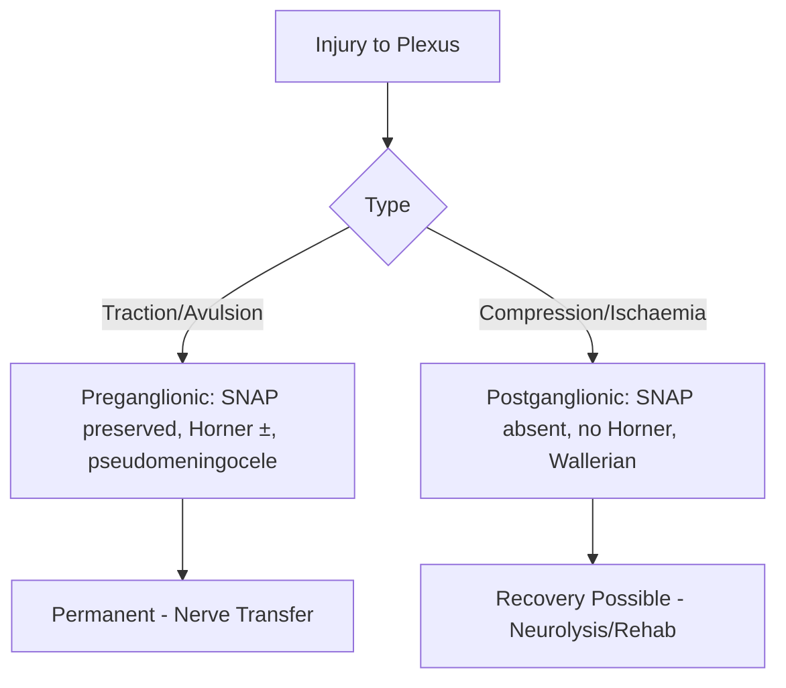
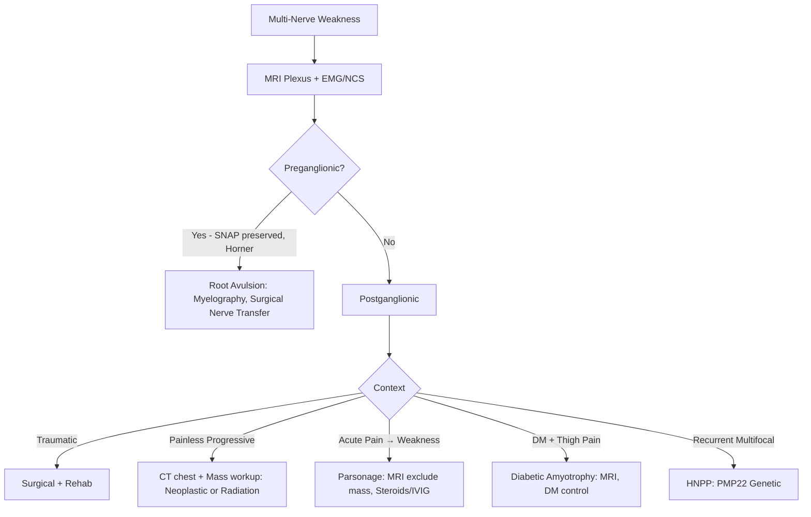
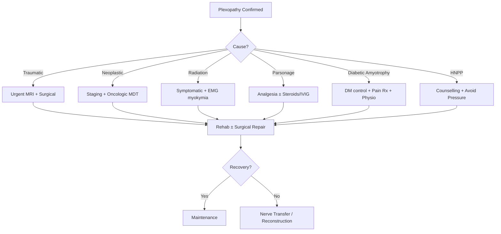
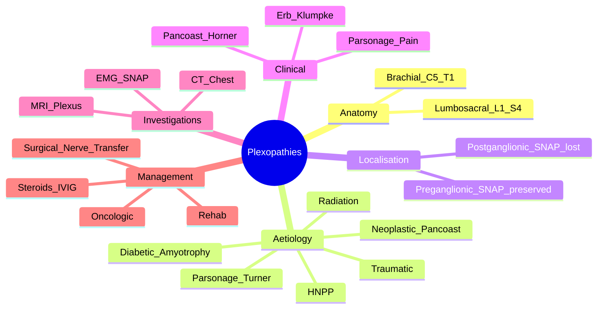
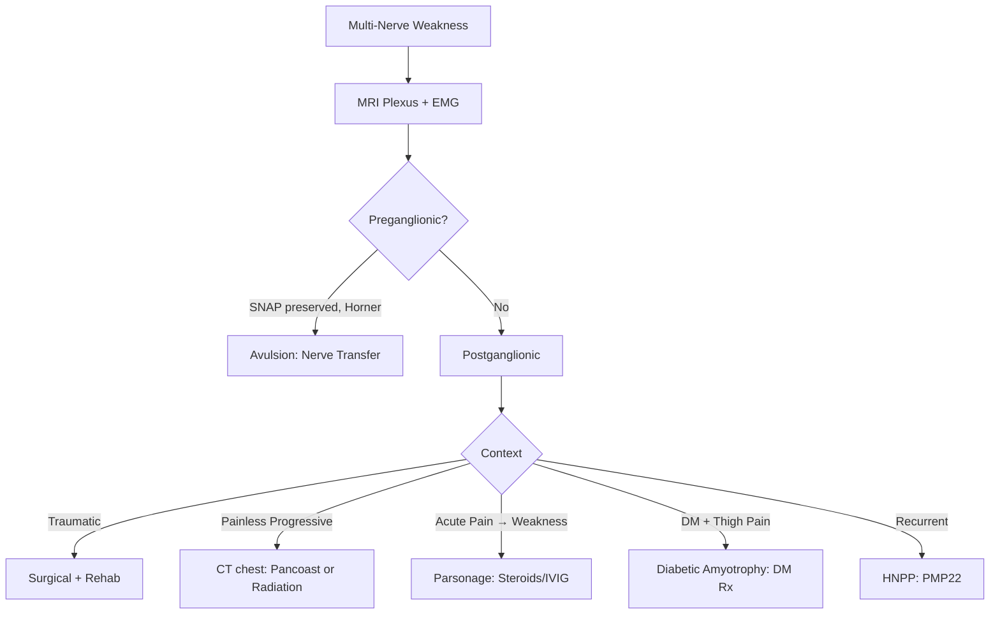

# Plexopathies (Brachial and Lumbosacral)

> [!tip] **Definition** — Disorder of **brachial (C5–T1)** or **lumbosacral (L1–S4)** plexus producing **multi-territory weakness/sensory loss** that does not fit a single root or peripheral nerve.
> [!tip] **Localising Rule** — **SNAP preserved + Horner's + pseudomeningocele = preganglionic (root avulsion).** MRI plexus + EMG/NCS are first-line.

Related: [[Peripheral Neuropathy Hub]], [[Approach to Peripheral Neuropathy]], [[Acute Inflammatory Neuropathies Overview]], [[Mononeuritis Multiplex]], [[Cranial Neuropathies]]

## Learning Objectives
- [ ] Define/classify plexopathies (traumatic vs non-traumatic)
- [ ] Brachial/lumbosacral anatomy
- [ ] Aetiology (traumatic, neoplastic, radiation, Parsonage, HNPP, obstetric, diabetic)
- [ ] Localise to trunk/division/cord or pre/postganglionic
- [ ] Erb's, Klumpke's, Pancoast, Parsonage-Turner
- [ ] Order MRI plexus + EMG + appropriate serology
- [ ] Differentiate from radiculopathy, MNM, MMN
- [ ] Stepwise management (analgesia, cause-specific, rehab, surgery)
- [ ] Red flags (Horner, mass, anticoag+thigh pain)
- [ ] FCPS/MRCP high-yield facts

---

## 1. Definition / Epidemiology / Classification
**Definition:** Lesion of brachial (C5–T1) or lumbosacral (L1–S4) plexus producing non-dermatomal, multi-nerve motor ± sensory loss, often painful.

**Epidemiology:** Brachial ~1.2/100k/yr; lumbosacral ~0.4/100k/yr. M>F (traumatic); bimodal age (young trauma, middle-aged neoplastic).

**Classification:**
| Type | Subtype | Key Features |
|------|---------|--------------|
| **Traumatic** | Stretch, avulsion, compression, laceration | Acute, painful, RTA/sports/shoulder dislocation |
| **Neoplastic** | Pancoast, breast, lymphoma, sarcoma | Progressive, painful, Horner's (Pancoast) |
| **Radiation** | Delayed (months–years post-RT, >50 Gy) | Painless initially, progressive, EMG myokymia |
| **Inflammatory** | Parsonage-Turner, MADSAM (Lewis-Sumner) | Acute severe pain → flaccid weakness, post-viral/vaccine |
| **Compressive** | TOS, retroperitoneal haematoma | Position-dependent (TOS) or anticoag (haematoma) |
| **Hereditary** | HNPP (PMP22 deletion) | Recurrent pressure palsies |
| **Obstetric** | Traction at delivery (Erb's, Klumpke's) | Neonate with flail limb |
| **Diabetic** | Diabetic amyotrophy (Bruns-Garland, L2–L4) | Older T2DM, weight loss, severe thigh pain |
| **Idiopathic** | ~30% | Exclude all above |

---

## 2. Aetiology / Pathophysiology
- **Genetic:** HNPP (PMP22 deletion on 17p11.2 → tomaculae)
- **Autoimmune:** Parsonage-Turner, MADSAM
- **Infectious/Post-infectious:** Post-viral (HSV, EBV, Hep E), post-vaccine (rare)
- **Vascular:** Retroperitoneal haematoma (anticoag), aneurysm
- **Neoplastic:** Direct invasion (Pancoast, breast, lymphoma) or RT-induced
- **Mechanical:** Trauma, traction, surgery, obstetric

**Pathophysiology:**

**Molecular basis:** HNPP = PMP22 deletion (tomaculae); Parsonage = autoimmune anti-GALNAc attack; radiation = microvascular fibrosis + Schwann injury.

---

## 3. Clinical Features
**History:** Onset (sudden = trauma, Parsonage, haematoma; progressive = neoplastic, RT); pain severity (severe = Parsonage, neoplastic; mild = RT, HNPP); triggers (RTA, surgery, anticoag, post-viral); PMH (DM, cancer, RT).

**Examination (Localisation):**
| Domain | Brachial | Lumbosacral |
|--------|----------|-------------|
| **Roots** | C5–T1 (prefix C4–C7; postfix C7–T2) | L1–S4 |
| **Trunks** | Upper (C5–C6), Middle (C7), Lower (C8–T1) | — |
| **Cords** | Lateral, Posterior, Medial | — |
| **Branches** | Lateral → MC/lat median; Post → axillary/radial; Med → ulnar/med median | Lumbar L1–L4: iliohypogastric, ilioinguinal, genitofemoral, femoral, obturator; Sacral L4–S4: sciatic, gluteal, pudendal |

**Key syndromes:**
| Syndrome | Roots | Key Features |
|----------|-------|--------------|
| **Erb-Duchenne** | C5–C6 (Upper trunk) | "Waiter's tip": adducted, internally rotated, forearm pronated, wrist flexed; biceps/deltoid weak |
| **Klumpke's** | C8–T1 (Lower trunk) | "Claw hand", intrinsic wasting, ± Horner's (sympathetic chain) |
| **Pancoast** | C8–T1 + sympathetic | Severe shoulder/arm pain, hand wasting, Horner's, ± SVC — apical lung tumour |
| **Parsonage-Turner** | Upper trunk, AIN, long thoracic | Acute severe shoulder pain → flaccid paralysis, scapular winging (serratus) |
| **Diabetic Amyotrophy (Bruns-Garland)** | L2–L4 (lumbar plexus) | Older T2DM, weight loss, severe thigh pain, quadriceps weakness |
| **Thoracic Outlet (TOS)** | Lower trunk (C8–T1) | Subclavian + plexus compression; Adson/Roos/Wright positive |
| **Root avulsion (preganglionic)** | Any | Flaccid, SNAP preserved, Horner's (C8–T1), pseudomeningocele on MRI |
| **Radiation plexopathy** | Trunk territory | Painless, progressive, EMG myokymia, ↑risk secondary malignancy |

---

## 4. Diagnostic Approach / Algorithm

**Severity:** MRC sum score (0–60); DASH; NRS pain; BMRC motor grading 0–5.

---

## 5. Investigations
**First-line:**
| Test | Indication | Finding |
|------|------------|---------|
| **MRI Plexus (T1, T2 fat-sat, STIR, post-gad)** | All | Mass, inflammation, fibrosis, pseudomeningocele |
| **MRI spine** | Exclude radiculopathy | Root compression |
| **CXR/CT chest** | Pancoast | Apical mass, rib erosion |
| **EMG/NCS (2–3 wk post-onset)** | Localisation, severity | Denervation, myokymia (RT), SNAP (pre vs post) |

**Other:**
- **MR neurography** — refined selective nerve imaging
- **Myelography/CT myelography** — root avulsion (pseudomeningocele, absent root sleeve)
- **PET-CT** — neoplastic staging/post-RT surveillance
- **SSEP** — root avulsion (absent N13 but preserved N9)
- **CSF** — exclude CIDP (albuminocytologic dissociation)
- **Serology** — HbA1c, ESR/CRP, ANA/ENA/ANCA, anti-GM1
- **Genetic** — PMP22 (HNPP)
- **Biopsy** — last resort (neoplastic, vasculitic)

---

## 6. Differential Diagnosis
| Differential | Distinguishing Features | Key Test |
|--------------|-------------------------|----------|
| **Cervical/lumbar radiculopathy** | Single root, dermatomal, paraspinal denervation | MRI spine, EMG paraspinal |
| **Mononeuritis multiplex** | Multiple discrete named nerves, asymmetric | ANCA, nerve biopsy |
| **MMN** | Pure motor, conduction block | Anti-GM1, NCS (CB) |
| **ALS** | Combined UMN+LMN, no pain, progressive | EMG (diffuse denervation, fasciculations) |
| **Parsonage-Turner** | Acute pain → flaccid weakness, recovers | Clinical, MRI normal/oedema |
| **TOS** | Position-dependent, vascular symptoms | Adson/Roos, MRI/MRA |
| **CRPS** | Pain disproportionate, allodynia, trophic | Budapest criteria, bone scan |
| **HNPP** | Recurrent, pressure sites, family hx | PMP22 deletion |

---

## 7. Management
**Emergency:**
- **Traumatic + vascular** — ATLS, vascular repair <6h
- **Root avulsion** — MRI, surgical nerve transfer (Oberlin, phrenic, accessory) within 6–12 months
- **Retroperitoneal haematoma** — reverse anticoagulation, supportive ± drainage
- **Pancoast + airway compromise** — steroids, urgent RT/oncology

**Disease-modifying:**
| Agent | Indication | Dose | Monitoring |
|-------|------------|------|------------|
| **IV Methylprednisolone** | Parsonage (early), inflammatory | 1g IV ×3–5d → oral taper | BP, glucose, infection |
| **IVIG** | Parsonage (steroid-refractory) | 2g/kg over 2–5d | Renal, IgA, thrombotic |
| **Nerve transfer (Oberlin/phrenic/accessory)** | Root avulsion | Within 6–12 months | Functional recovery |
| **Surgical neurolysis/grafting** | Compressive, gap >2cm | Autograft (sural) | Post-op neuro exam |
| **Tendon transfer** | Late reconstruction | Tendon rerouting | Adhesion |
| **TOS decompression** | Vascular/neuro TOS | First rib resection, scalenectomy | Pneumothorax risk |
| **Chemo/RT** | Neoplastic | Per oncology | Tumour response |

**Symptomatic:**
| Symptom | First-line | Second-line | Refractory |
|---------|------------|-------------|------------|
| **Neuropathic pain** | Gabapentin 300mg TDS, Pregabalin 75mg BD | Duloxetine 60mg, Amitriptyline 25–75mg | Tramadol, lidocaine patch |
| **Spasm** | Baclofen 5–10mg TDS | Tizanidine | Botulinum |
| **Contracture** | Physio, splints | Serial casting | Surgical release |

**Rehab:** Physiotherapy (ROM, scapular stability) within 1–2 wk; OT (ADL, splints); pain team; psychology; nerve/tendon transfer late.

**Management algorithm:**

**Special populations:**
- **Pregnancy:** Obstetric palsy (Erb's 90% recover in 3–6 mo with positioning/physio)
- **Paediatric:** Erb's/Klumpke's, Parsonage; botulinum for co-contraction
- **Elderly:** Lower-dose gabapentinoids, falls risk

---

## 8. Drug Interactions / Contraindications
| Drug | Interaction / Caution | Management |
|------|----------------------|------------|
| **Gabapentin/Pregabalin** | Sedation, opioid potentiation, renal excretion | ↓dose in CKD, avoid abrupt withdrawal |
| **Amitriptyline** | Anticholinergic, QT prolongation | ECG baseline, avoid in elderly |
| **Steroids** | DM, HTN, osteoporosis, infection | Vaccinations, PPI, monitor |
| **IVIG** | Aseptic meningitis, AKI, thrombosis, anaphylaxis (IgA) | IgA level, hydration, slow infusion |

---

## 9. Procedures
**MRI Plexus Protocol:** T1, T2 fat-sat, STIR, post-gad, coronal/axial, bilateral. Contrast nephrogenic systemic fibrosis risk (rare with newer agents).
**EMG/NCS in Plexopathy:** Wait 2–3 weeks for denervation. Motor+sensory NCS both limbs; EMG paraspinals, proximal, distal. SNAP key for pre/postganglionic.

---

## 10. Complications
| Complication | Frequency | Prevention / Management |
|--------------|-----------|-------------------------|
| **Chronic neuropathic pain** | 30–50% | Early gabapentinoids, pain team |
| **Contractures** | 20–30% (Klumpke's) | Splinting, physio, serial casting |
| **Frozen shoulder** | 15–25% | Early ROM, intra-articular steroid |
| **CRPS** | 5–10% post-trauma | Vitamin C, early mobilisation |
| **Disuse atrophy** | Common | Intensive physio |
| **Psychological impact** | Common | CBT, support |

---

## 11. Red Flags / Emergencies
| Red Flag | Immediate Action | Time Window |
|----------|------------------|-------------|
| **Progressive painful plexopathy + mass** | Urgent MRI + biopsy (Pancoast, lymphoma) | Days |
| **Horner's + arm pain** | CXR/CT chest → Pancoast | Days |
| **Traumatic + vascular** | Vascular surgical repair | <6 hours |
| **Anticoag + acute painful lumbosacral** | CT abdomen → retroperitoneal haematoma | Hours |
| **Rapidly progressive bilateral** | MRI + CSF → CIDP/MADSAM, vasculitis | Days |

---

## 12. Prognosis
| Factor | Good | Poor |
|--------|------|------|
| **Type** | Parsonage, obstetric Erb's | Root avulsion, Pancoast |
| **Aetiology** | Compressive, inflammatory | Malignant, RT |
| **Onset to Rx** | Early | Delayed |
| **Age** | Young | Elderly, comorbid |
| **Pre vs postganglionic** | Postganglionic | Preganglionic (avulsion) |

- **Obstetric Erb's:** 90% recover in 3–6 months
- **Parsonage:** 80% recovery by 2–3 years
- **Traumatic:** Variable; neuropraxia recovers, neurotmesis needs repair

---

## 13. Topic Correlation
| Related Topic | Link | Key Overlap |
|---------------|------|-------------|
| **Mononeuritis Multiplex** | [[Mononeuritis Multiplex]] | Multi-nerve but no plexus distribution |
| **Cervical Radiculopathy** | See | Single root, dermatomal |
| **ALS** | See | Combined UMN/LMN, no pain |
| **HNPP** | [[Hereditary Neuropathies]] | Recurrent plexopathy |
| **Pancoast Tumour** | See | Apical lung + C8/T1 |
| **Parsonage-Turner** | See | Acute pain → flaccid weakness |

---

## 14. Special Situations
| Situation | Consideration |
|-----------|---------------|
| **Pregnancy** | Obstetric palsy; Erb's 90% recover; avoid gabapentin (consider amitriptyline) |
| **Lactation** | Gabapentin/pregabalin compatible (low transfer); monitor infant |
| **Paediatric** | Erb's/Klumpke's, Parsonage; botulinum for co-contraction |
| **Elderly** | Falls, polypharmacy; lower gabapentin dose |
| **Renal** | ↓gabapentin/pregabalin; avoid IVIG high-dose |
| **Hepatic** | Caution amitriptyline |
| **Immunocompromised** | Atypical infections; biopsy if mass |
| **Driving (DVLA)** | Inform if weakness affects safety; Group 1 fitness assessment |
| **Occupational** | Ergonomic adjustments, vocational rehab |

---

## FCPS/MRCP High-Yield Summary
| Category | Key Points |
|----------|------------|
| **Definition** | Brachial (C5–T1) or lumbosacral (L1–S4) plexus lesion; multi-nerve distribution |
| **Epidemiology** | 1.2/100k brachial; traumatic most common |
| **Pathophysiology** | Preganglionic (SNAP preserved, Horner) vs postganglionic (SNAP lost) |
| **Localisation** | Trunk/division/cord; preganglionic vs postganglionic |
| **Clinical** | Erb's (C5–C6), Klumpke's (C8–T1), Pancoast+Horner, Parsonage |
| **Diagnosis** | MRI plexus + EMG (SNAP key), CT chest (Pancoast) |
| **Investigations** | MRI plexus first, EMG at 2–3 wk, CXR, haematoma screen |
| **Management** | Cause-specific: surgery (avulsion, mass), oncologic (Pancoast), steroids/IVIG (Parsonage), analgesia, physio |
| **Complications** | Chronic pain, contracture, CRPS, atrophy |
| **Prognosis** | Parsonage good; Erb's 90% obstetric; avulsion needs nerve transfer |
| **Viva Pearls** | "SNAP preserved = preganglionic"; "Horner + arm pain = Pancoast"; "Parsonage = acute pain → flaccid" |
| **Drug Doses** | Gabapentin 300mg TDS; Steroid 1g IV ×3d; IVIG 2g/kg |
| **Scoring** | MRC sum (0–60); DASH; NRS pain |
| **Genetics** | PMP22 deletion = HNPP |
| **Imaging Signs** | Pseudomeningocele (avulsion); apical mass (Pancoast); T2 hyperintensity (Parsonage); fibrosis (RT) |

---

## Viva Questions (PACES/FCPS Style)
1. **Q:** Define plexopathy and brachial plexus anatomy.
   **A:** Brachial plexus = C5–T1 (roots, trunks, divisions, cords, branches). Plexopathy = multi-nerve distribution not fitting single root.
2. **Q:** Preganglionic vs postganglionic.
   **A:** Preganglionic (avulsion): SNAP preserved, denervation, Horner's if C8/T1, pseudomeningocele on MRI. Postganglionic: SNAP absent.
3. **Q:** Erb's vs Klumpke's.
   **A:** Erb's (C5–C6, upper trunk): "waiter's tip" — adducted, internal rotation, pronation, wrist flexed. Klumpke's (C8–T1, lower trunk): claw hand ± Horner's.
4. **Q:** Horner's + arm pain.
   **A:** Pancoast tumour (apical lung) invading C8/T1 + sympathetic chain. CXR/CT, MRI plexus, biopsy.
5. **Q:** Acute severe shoulder pain → flaccid weakness.
   **A:** Parsonage-Turner. MRI plexus exclude mass, analgesia ± steroids/IVIG. 80% recover in 2–3 yr.
6. **Q:** Diabetic + weight loss + thigh pain + quadriceps weakness.
   **A:** Diabetic amyotrophy (L2–L4). MRI plexus, optimise DM, physio, pain Rx.
7. **Q:** Plexopathy vs radiculopathy.
   **A:** Plexopathy = multi-nerve, no dermatomal. Radiculopathy = single root, dermatomal/myotomal. EMG paraspinal favours root.
8. **Q:** Recurrent painless nerve palsies at compression sites.
   **A:** HNPP. PMP22 deletion. Tomaculae on biopsy. Avoid pressure.
9. **Q:** Radiotherapy 5 yr ago, painless arm weakness.
   **A:** Radiation plexopathy. EMG myokymia, MRI fibrosis. Slow progression. Symptomatic.
10. **Q:** EMG in radiation plexopathy.
    **A:** Myokymia (spontaneous grouped motor unit discharges), fibrillations, ↓CMAP.
11. **Q:** Surgical options for root avulsion.
    **A:** Nerve transfers (Oberlin: ulnar → biceps; phrenic → musculocutaneous; accessory → suprascapular); tendon transfers late.
12. **Q:** Anticoag + acute thigh pain + femoral neuropathy.
    **A:** Retroperitoneal/iliopsoas haematoma. CT abdomen, reverse anticoagulation, supportive.

---

## Common Confusions / Exam Traps
| Confusion | Clarification |
|-----------|---------------|
| **Plexopathy vs Radiculopathy** | Plexopathy = multi-nerve; EMG paraspinal favours root |
| **Parsonage vs cuff tear** | Parsonage = acute pain + flaccid + sensory; cuff = mechanical, no atrophy |
| **Pancoast vs Klumpke's** | Pancoast = neoplastic, Horner, mass; Klumpke's obstetric = no mass usually |
| **Radiation vs recurrence** | Radiation = painless, myokymia, slow; recurrence = painful, mass, PET-avid |
| **HNPP vs CIDP** | HNPP = focal at pressure, PMP22 del, normal CSF; CIDP = progressive, ↑protein |
| **Diabetic amyotrophy vs L3 radiculopathy** | Amyotrophy = bilateral, weight loss, plexus; radiculopathy = unilateral, dermatomal |

---

## Mnemonics
1. **ERB'S** = **E**xtension lost, **R**otation internal, **B**iceps weak, **S**ensory lateral arm = C5–C6
2. **KLUMP** = **K**law hand, **L**ower trunk, **U**lnar/median hand, **M**edial arm, **P**upil (Horner) = C8–T1
3. **PANCOAST** = **P**ectoral pain, **A**rm atrophy, **N**europathy, **C**lavicle erosion, **O**bstructive, **A**sympathetic (Horner), **S**uperior sulcus, **T**umour
4. **PARSONAGE** = **P**ainful **A**myotrophy, **R**ecurrent, **S**capular winging, **O**vernight severe pain, **N**erve (AIN/long thoracic), **A**trophy, **G**ood recovery, **E**xclude mass
5. **HNPP** = **H**its pressure sites — **P**MP22 **D**eletion (sausage tomaculae)

---

## Mind Map

---

## Flowchart (Diagnostic/Management)

---

## One-Page Revision Card
| **Topic** | **Plexopathies** |
|-----------|------------------|
| **Definition** | Brachial (C5–T1) / Lumbosacral (L1–S4) plexus, multi-nerve distribution |
| **Key Clinical** | Erb's waiter's tip; Klumpke's claw; Pancoast+Horner; Parsonage acute pain |
| **Localisation** | Preganglionic (SNAP preserved) vs postganglionic (SNAP lost) |
| **Dx Criteria** | MRI plexus + EMG (SNAP), CT chest (Pancoast) |
| **Differentials** | Radiculopathy, MNM, MMN, ALS, TOS, CRPS |
| **Investigations** | MRI plexus, EMG (2–3 wk), CXR, PMP22 (HNPP) |
| **Management** | 1. MRI+EMG localise 2. Treat cause 3. Neuropathic pain 4. Physio 5. Nerve transfer if avulsion |
| **Key Drugs** | Gabapentin 300mg TDS; Steroid 1g IV ×3d; IVIG 2g/kg |
| **Red Flags** | Horner+arm pain (Pancoast); mass; anticoag+thigh pain (haematoma) |
| **Prognosis** | Parsonage 80%; Erb's 90% obstetric; avulsion = nerve transfer |
| **Viva Pearls** | "SNAP preserved = preganglionic"; "Horner = C8–T1"; "Pancoast = apical lung" |
| **Mnemonics** | ERB'S, KLUMP, PANCOAST, PARSONAGE, HNPP |

---

## MCQs (10)

1. **Q:** In root avulsion (preganglionic), what happens to SNAP?
   **Options:** A. Absent B. Preserved C. Reduced D. Variable
   **Answer:** B — Preganglionic spares dorsal root ganglion → SNAP preserved despite sensory loss.

2. **Q:** Lung cancer + shoulder pain + hand wasting + ptosis with miosis. Where?
   **Options:** A. Upper trunk B. Lower trunk (C8–T1) C. Posterior cord D. Lateral cord
   **Answer:** B — Pancoast compresses C8–T1 + sympathetic chain → Horner's + hand wasting.

3. **Q:** Erb-Duchenne palsy affects:
   **Options:** A. C5–C6 B. C7 C. C8–T1 D. T1 only
   **Answer:** A — Erb's = C5–C6 upper trunk, "waiter's tip".

4. **Q:** Characteristic EMG finding in radiation plexopathy:
   **Options:** A. Myokymia B. Myotonia C. Fibrillation D. Fasciculations
   **Answer:** A — Myokymia (grouped spontaneous motor unit discharges) is hallmark of radiation plexopathy/Isaacs.

5. **Q:** Diabetic + weight loss + thigh pain + quadriceps weakness. Diagnosis?
   **Options:** A. L3 radiculopathy B. Diabetic amyotrophy C. PMR D. Meralgia paraesthetica
   **Answer:** B — Diabetic amyotrophy (Bruns-Garland) = painful L2–L4 plexopathy.

6. **Q:** HNPP gene:
   **Options:** A. PMP22 dup B. PMP22 del C. MPZ D. GJB1
   **Answer:** B — HNPP = PMP22 deletion; CMT1A = PMP22 duplication.

7. **Q:** Parsonage-Turner typically presents with:
   **Options:** A. Gradual painless weakness B. Acute severe pain → flaccid weakness C. Bilateral symmetric from onset D. Ascending paralysis
   **Answer:** B — Neuralgic amyotrophy: acute severe pain → flaccid weakness in plexus distribution.

8. **Q:** Horner's with brachial plexopathy suggests:
   **Options:** A. Upper trunk C5–C6 B. Middle trunk C7 C. Lower trunk C8–T1 D. Lateral cord
   **Answer:** C — Sympathetic chain (T1±C8) at lower trunk.

9. **Q:** First-line imaging in brachial plexopathy:
   **Options:** A. CT B. MRI plexus with contrast C. US D. X-ray
   **Answer:** B — MRI plexus (T1, T2 fat-sat, STIR, post-gad) is gold standard.

10. **Q:** Treatment of Parsonage-Turner includes all EXCEPT:
    **Options:** A. Analgesia B. Physio C. IV methylprednisolone (early) D. Surgical neurolysis
    **Answer:** D — Parsonage is inflammatory; medical Rx, not surgical.

---

## SBA Questions (10)

1. **Scenario:** RTA, flail left arm, no hand sensation, ptosis+miosis, pseudomeningocele at C7–T1, denervation on EMG but preserved SNAP. Diagnosis?
   **Options:** A. Postganglionic B. Preganglionic root avulsion C. Erb's D. Klumpke's
   **Answer:** B — Pseudomeningocele + preserved SNAP + Horner = preganglionic avulsion. Nerve transfer.

2. **Scenario:** 6 yr post-mastectomy + 50 Gy RT, painless arm weakness, EMG myokymia. Diagnosis?
   **Options:** A. Recurrence B. Radiation plexopathy C. Parsonage D. CIDP
   **Answer:** B — Delayed, painless, post-RT, myokymia = radiation plexopathy.

3. **Scenario:** Post-viral severe shoulder pain, then scapular winging + weak abduction. Diagnosis?
   **Options:** A. Cuff tear B. Capsulitis C. Parsonage-Turner D. Cervical spondylosis
   **Answer:** C — Parsonage: long thoracic → serratus → scapular winging.

4. **Scenario:** Severe arm pain, hand wasting, Horner, CXR right apical mass. Next investigation?
   **Options:** A. EMG B. CT chest + MRI plexus C. LP D. Biopsy alone
   **Answer:** B — Pancoast: CT chest + MRI plexus for extent; then biopsy.

5. **Scenario:** Warfarin + acute thigh pain + hip flexion weak + anterior thigh sensory loss. CT: iliopsoas haematoma. Acute management?
   **Options:** A. Urgent surgery B. Reverse anticoagulation + supportive C. IV methylprednisolone D. PLEX
   **Answer:** B — Reverse warfarin (vitamin K + PCC), supportive ± drainage.

6. **Scenario:** Recurrent painless wrist drop + foot drop at pressure sites, family hx. Genetic test?
   **Options:** A. PMP22 dup B. PMP22 del C. MPZ D. GJB1
   **Answer:** B — HNPP = PMP22 deletion, recurrent pressure palsies, tomaculae.

7. **Scenario:** Neonate, flail arm after shoulder dystocia, adducted, internally rotated, pronated, wrist flexed. Diagnosis?
   **Options:** A. Klumpke's B. Erb's C. Whole plexus avulsion D. Humeral fracture
   **Answer:** B — Erb's (C5–C6), 90% recover with physio.

8. **Scenario:** 3 yr post-RT 60 Gy, painless arm weakness, MRI diffuse fibrosis no mass. Treatment?
   **Options:** A. Chemo B. Repeat RT C. Symptomatic + physio D. Neurolysis
   **Answer:** C — Radiation: symptomatic only, no further RT/chemo.

9. **Scenario:** Right weak shoulder abduction/external rotation/elbow flexion, lateral shoulder sensory loss, hand normal. Structure?
   **Options:** A. Lower trunk C8–T1 B. Upper trunk C5–C6 C. Posterior cord D. Median n
   **Answer:** B — Deltoid (axillary C5), supraspinatus (suprascapular C5–C6), biceps (musculocutaneous C5–C6) = upper trunk.

10. **Scenario:** Hand intrinsic wasting, finger flexion/extension weak, Horner, apical mass. Tumour?
    **Options:** A. SCLC B. Squamous C. NSCLC (adeno) D. Mesothelioma
    **Answer:** C — Pancoast = NSCLC (adeno or squamous); adeno most common.

---

## Flashcards
- **Q:** Brachial plexus roots? **A:** C5–T1 (occasionally C4–T2)
- **Q:** Lumbosacral plexus roots? **A:** L1–S4
- **Q:** Erb's roots + posture? **A:** C5–C6 upper trunk; "waiter's tip" — adducted, internally rotated, pronated, wrist flexed
- **Q:** Klumpke's roots + sign? **A:** C8–T1 lower trunk; claw hand ± Horner
- **Q:** Pancoast tumour structures? **A:** Apical lung + C8–T1 + sympathetic chain
- **Q:** Horner's triad? **A:** Ptosis + Miosis + Anhidrosis
- **Q:** Preganglionic vs postganglionic SNAP? **A:** Preganglionic: SNAP preserved; Postganglionic: SNAP absent
- **Q:** Myokymia on EMG → cause? **A:** Radiation plexopathy or neuromyotonia (Isaacs)
- **Q:** HNPP gene? **A:** PMP22 deletion on 17p11.2
- **Q:** Parsonage-Turner presentation? **A:** Acute severe shoulder pain → flaccid paralysis; long thoracic → scapular winging
- **Q:** Diabetic amyotrophy features? **A:** Older T2DM, weight loss, severe thigh pain, quadriceps weakness (L2–L4)
- **Q:** Anticoag + thigh pain + femoral neuropathy? **A:** Retroperitoneal/iliopsoas haematoma

---

## Answer Key

### MCQs
1. **B** — SNAP preserved in preganglionic
2. **B** — Pancoast at C8–T1 + sympathetic
3. **A** — Erb's = C5–C6
4. **A** — Myokymia = radiation/Isaacs
5. **B** — Diabetic amyotrophy
6. **B** — HNPP = PMP22 deletion
7. **B** — Parsonage = acute pain → flaccid
8. **C** — Horner from sympathetic at C8–T1
9. **B** — MRI plexus gold standard
10. **D** — No neurolysis in Parsonage

### SBAs
1. **B** — Pre-ganglionic avulsion
2. **B** — Radiation plexopathy
3. **C** — Parsonage-Turner
4. **B** — Pancoast: CT + MRI
5. **B** — Reverse anticoagulation
6. **B** — PMP22 deletion (HNPP)
7. **B** — Erb's
8. **C** — Symptomatic only
9. **B** — Upper trunk C5–C6
10. **C** — Pancoast = NSCLC

---

## Local Navigation
**Heading Hub:** [[Peripheral Neuropathy Hub]]  
**Topic-Group Hub:** [[Focal & Entrapment Neuropathies Hub]]  
**Chapter Hierarchy:** [[Davidson Chapter 25 - Neurology Hierarchy]]  
**Chapter MOC:** [[Neurology MOC]]  
**Related Topics:** [[Approach to Peripheral Neuropathy]], [[Acute Inflammatory Neuropathies Overview]], [[Mononeuritis Multiplex]], [[Hereditary Neuropathies]]

## PasTest Scenario SBAs (Clinical Vignettes)

> **Auto-generated PasTest/Mediscope-style scenario SBAs** grounded in the authored source. Each scenario tests a real clinical fact (triad, specific sign, contraindication, trial, first-line Rx) extracted from the topic. *Source: Ch 27: Neurology & Stroke — Plexopathies*

**Q1.** What is the most appropriate first-line therapy for Plexopathies?

  - **A.** TOS decompression
  - **B.** An advanced/surgical therapy reserved for refractory disease
  - **C.** Symptomatic treatment only, no disease-modifying therapy
  - **D.** Empiric broad-spectrum therapy without specific indication

  > **Answer: A** — TOS decompression
  >
  > *Source:* **TOS decompression**   Vascular/neuro TOS   First rib resection, scalenectomy   Pneumothorax risk

