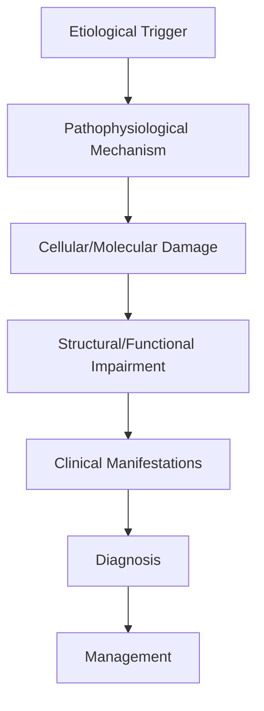
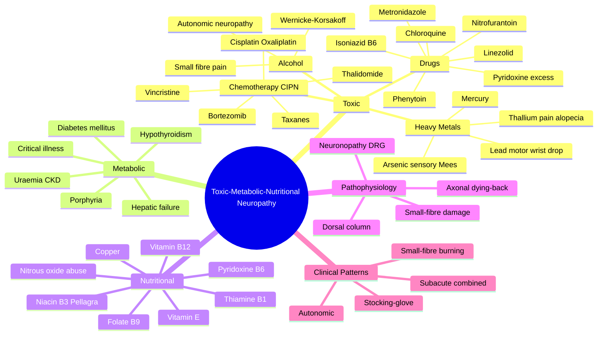

# Toxic-Metabolic-Nutritional Neuropathy

> [!tip] **High-Yield Definition**
> Comprehensive clinical note for Toxic-Metabolic-Nutritional Neuropathy covering definition, epidemiology, aetiology, pathophysiology, clinical features, investigations, differential diagnosis, management, drug interactions, procedures, complications, red flags, prognosis, topic correlation, and special situations for FCPS/MRCP examination preparation based on Davidson 24th Edition Chapter 25: Neurology.

---

## 1. Definition / Epidemiology / Classification

### Definition
Toxic-Metabolic-Nutritional Neuropathy is a neurological disorder within the 08 peripheral neuropathy category. It is characterised by specific clinical, pathological, radiological, and laboratory features that allow differentiation from related conditions.

### Epidemiology
- **Incidence/Prevalence:** Variable depending on the specific condition.
- **Age:** Adult onset is most common, but paediatric and elderly presentations occur.
- **Sex:** Variable depending on the condition.
- **Geography:** Worldwide distribution, with higher prevalence in certain regions.
- **Risk Factors:** Genetic predisposition, environmental factors, comorbidities, family history.

### Classification
| Subtype | Key Features | Prognosis |
|---------|-------------|-----------|
| Mild/early | Subtle symptoms, preserved function | Best |
| Moderate | Clear symptoms, functional impairment | Variable |
| Severe | Significant disability, complications | Worst |

---

## 2. Aetiology / Pathophysiology

### Aetiology
- **Primary (idiopathic):** Most cases have no identifiable cause.
- **Genetic:** May be inherited (AD, AR, X-linked, mitochondrial, sporadic).
- **Autoimmune:** Autoantibodies, immune-mediated inflammation.
- **Infectious:** Viral, bacterial, fungal, parasitic.
- **Metabolic:** Electrolyte, endocrine, hepatic, renal, nutritional.
- **Toxic:** Drugs, alcohol, heavy metals, environmental toxins.
- **Vascular:** Ischaemia, haemorrhage, vasculitis.
- **Neoplastic:** Primary, secondary, paraneoplastic.
- **Traumatic:** Acute, chronic, repetitive.
- **Degenerative:** Neurodegeneration, protein misfolding.

### Pathophysiology


---

## 3. Clinical Features

### History
- **Onset/Duration:** Acute, subacute, or chronic.
- **Progression:** Static, progressive, relapsing-remitting, stepwise.
- **Key symptoms:** Specific to the condition.
- **Triggers:** Stress, infection, trauma, drugs, hormonal, environmental.
- **Systemic symptoms:** Constitutional features.
- **Drug/Family/Social history:** Relevant exposures, comorbidities.

### Examination
| Domain | Key Findings | Localisation Value |
|--------|-------------|-------------------|
| Higher function | Cognitive, behavioural | Cortical, subcortical, limbic |
| Cranial nerves | Pupils, eye movements, facial, bulbar | Brainstem, cranial nerve, NMJ |
| Motor | Weakness, tone, reflexes | UMN, LMN, NMJ, muscle |
| Sensory | All modalities, pattern | Peripheral, spinal, brainstem |
| Coordination | Ataxia, nystagmus, dysmetria | Cerebellar, sensory, vestibular |
| Gait | Spastic, ataxic, parkinsonian | Multiple |
| Autonomic | Orthostatic, sweating, GI, bladder | Autonomic, peripheral, central |

### Specific Clinical Features
The clinical features are determined by the underlying aetiology, location of pathology, and rate of progression. Patients typically present with a constellation of symptoms and signs that allow clinical localisation and subsequent targeted investigation.

---

## 4. Diagnostic Approach / Algorithm

```mermaid
flowchart TD
    A[Clinical Presentation] --> B[Anatomical Localisation]
    B --> C[Pathophysiological Category]
    C --> D[Formulate Differential]
    D --> E[Targeted Investigations]
    E --> F[Confirm Diagnosis]
    F --> G[Assess Severity/Prognosis]
    G --> H[Initiate Management]
    H --> I[Monitor Response]
    I --> J{Response?}
    J --> YES1 [Good - Continue]
    J --> NO1 [Poor - Escalate]
    YES1 --> K[Monitor]
    NO1 --> H
```

---

## 5. Investigations

### First-Line Investigations
- **Blood tests:** FBC, U&Es, LFTs, glucose, calcium, magnesium, ESR, CRP, autoimmune, infection.
- **Imaging:** CT/MRI brain/spine (essential for most neurological conditions).
- **Neurophysiology:** EEG, nerve conduction, EMG, evoked potentials.
- **CSF:** Cell count, protein, glucose, OCBs, PCR, culture.

### Second-Line Investigations
- **Genetic testing:** Gene panels, WES, WGS.
- **Antibody testing:** Antineuronal, autoimmune, paraneoplastic.
- **Biopsy:** Nerve, muscle, brain, skin.
- **Advanced imaging:** PET-CT, MR spectroscopy, fMRI.

### Specialised Investigations
- **Biomarkers:** Neurofilament light chain, tau, beta-amyloid, 14-3-3, RT-QuIC.
- **Autonomic testing:** Head-up tilt, sudomotor, QSART.
- **Neuropsychology:** Cognitive testing, behavioural assessment.
- **Genetic counselling:** Family screening, predictive testing.

---

## 6. Differential Diagnosis

| Differential | Distinguishing Features | Key Test |
|--------------|------------------------|----------|
| Vascular | Sudden onset, focal, vascular risk factors | MRI/CT, vessel imaging |
| Inflammatory | Subacute, multifocal, systemic | MRI, CSF, antibodies |
| Infectious | Fever, systemic, exposure | Bloods, CSF, imaging |
| Neoplastic | Progressive, mass effect | MRI, biopsy |
| Degenerative | Progressive, symmetric, hereditary | MRI, genetic |
| Toxic/Metabolic | Drug history, systemic, reversible | Bloods, toxicology |
| Autoimmune | Multifocal, antibodies, immunotherapy response | Antibodies, MRI, CSF |
| Functional | Inconsistent, distractible | Clinical, video, biomarkers |

---

## 7. Management

### Acute Management
- **Stabilisation:** ABCDE approach, emergency resuscitation.
- **Specific treatment:** Disease-specific interventions.
- **Symptomatic relief:** Pain, seizures, spasticity, autonomic dysfunction.
- **Prevention of complications:** DVT, pressure sores, infection.

### Disease-Modifying Treatment
- **Pharmacological:** First-line, second-line, escalation, maintenance.
- **Procedural:** Surgery, biopsy, drainage, ablation, stimulation.
- **Immunotherapy:** Steroids, IVIG, plasma exchange, immunosuppressants, biologics.
- **Rehabilitation:** Physiotherapy, OT, speech therapy.

### Long-Term Management
- **Monitoring:** Clinical, imaging, biomarkers, side effects.
- **Prevention:** Vaccinations, prophylaxis, lifestyle modification.
- **Supportive care:** Multidisciplinary team, social work, psychological support.
- **Palliative care:** Advanced care planning, end-of-life care, hospice.

---

## 8. Drug Interactions / Contraindications / Comorbidity Cautions

| Drug Class | Interaction / Caution | Management |
|------------|----------------------|------------|
| Antiseizure medications | Enzyme induction, teratogenicity | Monitor, supplement, switch |
| Immunosuppressants | Infection, malignancy, teratogenicity | Monitor, prophylaxis |
| Anticoagulants | Bleeding risk, drug interactions | Monitor INR, avoid combinations |
| Antihypertensives | Hypotension, falls | Monitor BP, adjust dose |
| Antibiotics | Nephrotoxicity, ototoxicity | Monitor renal |
| Antivirals | Nephrotoxicity, neuropsychiatric | Monitor renal, dose adjust |
| Steroids | DM, HTN, osteoporosis, infection | Monitor, prophylaxis, taper |
| Biologics | Infusion reactions, infection | Monitor, prophylaxis |

---

## 9. Procedures

### Common Procedures
- **Lumbar puncture:** Diagnostic, therapeutic (IIH, NPH). Contraindications: raised ICP, mass lesion, coagulopathy.
- **Nerve conduction studies/EMG:** Diagnostic, prognosis. Minor discomfort.
- **EEG:** Diagnostic, monitoring. No significant complications.
- **MRI brain/spine:** Diagnostic, monitoring. Contraindications: pacemaker, metallic implants.
- **CT head:** Emergency, rapid. Radiation exposure, contrast reactions.
- **Biopsy:** Stereotactic, open. Indications: diagnosis, molecular profiling.

---

## 10. Complications

| Complication | Frequency | Prevention | Management |
|--------------|-----------|------------|------------|
| Infection | Common | Hygiene, prophylaxis, vaccination | Antibiotics, antifungals |
| Thrombosis | Common | Prophylaxis, mobility | Anticoagulation |
| Pressure sores | Common | Positioning, nutrition | Wound care, surgery |
| Spasticity | Common | Positioning, stretching | Baclofen, BoNT |
| Contractures | Common | Passive movements, splints | Physiotherapy, surgery |
| Aspiration | Common | Swallow assessment | NGT, PEG, thickeners |
| Falls | Common | Environment, mobility | Walking aids |
| Fractures | Common | Bone health, prevention | Vitamin D, bisphosphonate |
| Depression | Common | Screening, support | Antidepressants, CBT |
| Cognitive decline | Variable | Monitoring, training | Rehabilitation |
| Autonomic dysfunction | Variable | Monitoring, hydration | Midodrine, fludrocortisone |
| Respiratory failure | Variable | Monitoring, supportive | Ventilation, NIV |
| Death | Variable | Monitoring, palliative | End-of-life care |

---

## 11. Red Flags / Emergencies

### Emergency Presentations
- **Rapid neurological deterioration:** New focal deficit, decreased consciousness, seizures.
- **Status epilepticus:** Continuous seizures >5 min.
- **Raised ICP:** Headache, vomiting, papilloedema, altered consciousness.
- **Respiratory failure:** Hypoxia, hypercapnia, ventilatory failure.
- **Cardiac arrest:** Arrhythmia, MI, pulmonary embolism.
- **Infection:** Sepsis, meningitis, abscess, encephalitis.
- **Drug toxicity:** Overdose, side effects, interactions.
- **Haemorrhage:** Intracranial, systemic, coagulopathy.

---

## 12. Prognosis

### Natural History
- **Acute:** May resolve with treatment, may progress, may be fatal.
- **Subacute:** Variable, depends on cause and treatment.
- **Chronic:** Often progressive, may be stable, may have relapses.
- **Recovery:** Variable, may be complete, partial, or none.

### Prognostic Factors
- **Favourable:** Young age, early treatment, mild disease, reversible cause, good premorbid function, family support.
- **Unfavourable:** Older age, delayed treatment, severe disease, irreversible cause, poor premorbid function, comorbidities.

---

## 13. Topic Correlation

| Related Topic | Link | Key Overlap |
|---------------|------|-------------|
| Davidson 24th Ed Chapter 25 | [[Davidson Chapter 25 - Neurology Hierarchy]] | Comprehensive neurology |
| Neurology MOC | [[Neurology MOC]] | All neurology topics |
| Drug Reference | [[../00_Index/Neurology Drug Reference]] | Medications |
| Local Hub | [[../08_Peripheral_Neuropathy/Hub]] | Section-specific |
| Clinical Examination | [[../01_Fundamentals_Examination/Neurological History Taking]] | Clinical approach |
| Investigation | [[../01_Fundamentals_Examination/Neuroimaging (CT-MRI) Principles]] | Imaging |

---

## 14. Special Situations

| Situation | Consideration |
|-----------|---------------|
| **Pregnancy** | Pre-conception counselling, teratogenicity, drug safety, monitoring, delivery planning, breastfeeding. |
| **Lactation** | Drug safety, breastfeeding, monitoring, support. |
| **Paediatric** | Developmental considerations, drug dosing, school, family, vaccination, growth, puberty. |
| **Elderly / Frail** | Comorbidities, polypharmacy, falls, bone health, cognition, social, end-of-life. |
| **Renal impairment** | Drug dose adjustment, monitoring, dialysis, transplant. |
| **Hepatic impairment** | Drug dose adjustment, monitoring, transplant. |
| **Immunocompromised** | Infection prophylaxis, vaccination, drug interactions, malignancy screening. |
| **Perioperative** | Drug management, anaesthesia planning, VTE prophylaxis, infection prevention, monitoring. |
| **Driving / DVLA** | Fitness to drive, restrictions, notification, reassessment. |
| **Occupational** | Fitness for work, adaptations, rehabilitation, disability, return to work. |

---

## FCPS/MRCP High-Yield Summary

| Category | Key Points |
|----------|------------|
| **Definition** | Comprehensive definition with key diagnostic criteria |
| **Epidemiology** | Incidence, prevalence, age, sex, geography, risk factors |
| **Aetiology** | Primary causes, secondary causes, genetic, environmental |
| **Pathophysiology** | Mechanism of disease, cellular/molecular basis |
| **Clinical Features** | History, examination, key findings, variants |
| **Diagnosis** | Diagnostic criteria, classification, severity |
| **Investigations** | First-line, second-line, specialised, biomarkers |
| **Differential Diagnosis** | Key differentials, distinguishing features, tests |
| **Management** | Acute, disease-modifying, symptomatic, supportive |
| **Complications** | Common, serious, prevention, management |
| **Prognosis** | Natural history, prognostic factors, outcomes |
| **Viva Pearls** | Key examination points |
| **Drug Doses** | First-line, second-line, emergency |
| **Scoring Systems** | Specific scores used in management |
| **Genetics** | Inheritance, genes, mutations, family screening |
| **Imaging Signs** | Characteristic findings, differential |

---

## Viva Questions (PACES/FCPS Style)

1. **Q:** Define and classify its variants.
   **A:** Comprehensive definition with classification of subtypes based on aetiology, severity, and clinical features.

2. **Q:** What are the key clinical features?
   **A:** Specific symptoms and signs including onset, progression, key features, and associated findings.

3. **Q:** What is the first-line treatment?
   **A:** First-line pharmacological and non-pharmacological management based on current evidence.

4. **Q:** What are the red flags requiring urgent referral?
   **A:** Specific emergency presentations and complications requiring immediate intervention.

5. **Q:** What is the prognosis?
   **A:** Natural history, prognostic factors, and long-term outcomes.

6. **Q:** How do you differentiate from key differentials?
   **A:** Clinical features, investigations, and response to treatment that distinguish from alternative diagnoses.

7. **Q:** What investigations are most useful?
   **A:** First-line and second-line investigations including imaging, neurophysiology, CSF, and biomarkers.

8. **Q:** Describe the stepwise management approach.
   **A:** Stepwise escalation from first-line to second-line to third-line therapy with monitoring.

9. **Q:** What are the emergency presentations?
   **A:** Specific emergency scenarios and immediate management priorities.

10. **Q:** How does management change in pregnancy/paediatrics/elderly?
    **A:** Special considerations for each population including drug safety, monitoring, and support.

---

## Common Confusions / Exam Traps

| Confusion | Clarification |
|-----------|---------------|
| Similar presentation but different cause | Differentiate by history, examination, investigations |
| Treatment response vs natural history | Assess with objective measures, biomarkers |
| Drug interactions | Check each drug, monitor, adjust doses |
| Disease progression vs treatment failure | Monitor response, escalate appropriately |
| Functional vs organic | Inconsistent, distractible, disability greater than impairment |
| Acute vs chronic | Time course, progression, reversibility |
| Primary vs secondary | Underlying cause, contributing factors |
| Side effects vs symptoms | Temporal relationship, dose relationship |

---

## Mnemonics

### Mnemonic 1: "VICT-B" — Chemotherapy-Induced Peripheral Neuropathy (CIPN)
- **V** — **V**incristine (most common CIPN; sensory > motor, autonomic dysfunction with constipation/ileus; dose-limiting)
- **I** — **I**fosfamide (encephalopathy > neuropathy)
- **C** — **C**isplatin / Carboplatin / Oxaliplatin (sensory neuronopathy/dorsal root ganglionopathy; ototoxicity; oxaliplatin = acute cold-triggered pharyngolaryngeal dysaesthesia)
- **T** — **T**axanes (paclitaxel, docetaxel) — dose-dependent sensory axonal neuropathy
- **B** — **B**ortezomib, **B**rentuximab, **T**halidomide (all cause sensory neuropathy)

### Mnemonic 2: "ABCDEF-Toxins" — Heavy Metal & Drug Causes
- **A** — **A**lcohol (small-fibre, autonomic) + **A**rsenic (stocking-glove + Mees lines + rice-water diarrhoea)
- **B** — **B**12 deficiency (subacute combined degeneration) + Bismuth
- **C** — **C**opper deficiency (myeloneuropathy mimicking B12; post-bariatric surgery)
- **D** — **D**rugs: **I**soniazid, **M**etronidazole, **N**itrofurantoin, **L**inezolid, **P**henytoin
- **E** — **E**nvironmental: Lead (wrist drop + abdominal colic + basophilic stippling)
- **F** — **F**luoride, Thallium (alopecia + pain), Mercury, Organophosphates

### Mnemonic 3: "WET vs DRY Beriberi" — Thiamine (B1) Manifestations
- **WET Beriberi** — Cardiovascular: high-output cardiac failure, dilated cardiomyopathy, peripheral oedema
- **DRY Beriberi** — Neurological: symmetric sensorimotor polyneuropathy, Wernicke encephalopathy (confusion + ataxia + ophthalmoplegia), Korsakoff (anterograde amnesia + confabulation)
- **CRITICAL RULE:** Always give thiamine BEFORE glucose to avoid precipitating Wernicke encephalopathy

---

## Mind Map



---

## Spaced Repetition Trackers

| Day | Topic | Recall Score (/5) | Weak Areas | Review Date |
|-----|-------|-------------------|------------|-------------|
| Day 1 | Alcohol neuropathy + B12 (SACD) | ___/5 | | |
| Day 3 | Thiamine (WET/DRY) + Beriberi + Wernicke | ___/5 | | |
| Day 7 | Chemotherapy agents (VICT-B) | ___/5 | | |
| Day 14 | Heavy metals (Lead, Arsenic, Thallium, Mercury) | ___/5 | | |
| Day 30 | Drug-induced (INH, Metronidazole, Pyridoxine excess) | ___/5 | | |
| Day 60 | Nutritional (Copper, Folate, Vitamin E, N2O abuse) | ___/5 | | |
| Day 90 | Full review + Mixed clinical scenarios | ___/5 | | |

---

## Self-Test Scorecard

| Domain | Score (/5) | Date Achieved | Notes |
|--------|-----------|---------------|-------|
| Definition & Classification | ___/5 | | |
| Aetiology & Pathophysiology | ___/5 | | |
| Clinical Features | ___/5 | | |
| Investigations (B12, MMA, homocysteine, heavy metals) | ___/5 | | |
| Differential Diagnosis | ___/5 | | |
| Acute Management (Wernicke, N2O, OP poisoning) | ___/5 | | |
| Long-term Management & Rehabilitation | ___/5 | | |
| Complications & Prevention | ___/5 | | |
| Red Flags (Wernicke, opioid overdose, OP) | ___/5 | | |
| Special Populations (pregnancy, paediatric, elderly) | ___/5 | | |
| **TOTAL (/50)** | ___/50 | | |

**Pass Mark:** ≥35/50 (70%)

---

## MCQs (10)

**1. Question:** A 45-year-old chronic alcoholic presents with 6 months of progressive distal lower-limb numbness, burning feet, and gait unsteadiness. Examination reveals reduced pinprick and vibration to mid-calf, absent ankle reflexes, and dilated pupils with poor reaction to light. Which finding is most characteristic of the underlying pathophysiology?

   A. Demyelination of large myelinated fibres with segmental lesions
   B. Axonal degeneration with predominant involvement of small unmyelinated C-fibres and autonomic nerves
   C. Posterior column demyelination with dorsal column vacuolation
   D. Anterior horn cell loss with motor neuronopathy

   **Answer:** B

   **Explanation:** Alcoholic neuropathy is a distal symmetric "stocking-glove" sensory-predominant axonal neuropathy with prominent small-fibre (burning pain, allodynia) and autonomic involvement (the dilated pupils reflect autonomic small-fibre damage). Large-fibre demyelination describes GBS/CIDP; dorsal column vacuolation describes B12 deficiency (subacute combined degeneration); motor neuronopathy describes ALS.

**2. Question:** A 60-year-old man with chronic alcohol use presents with confusion, ophthalmoplegia, and ataxia after receiving IV 5% dextrose for hypoglycaemia. What is the most appropriate immediate management?

   A. IV 10% dextrose
   B. IV Pabrinex (high-dose thiamine + B vitamins) BEFORE further dextrose
   C. IV hydrocortisone 200 mg
   D. IV pyridoxine 100 mg

   **Answer:** B

   **Explanation:** This is Wernicke encephalopathy precipitated by giving glucose without thiamine cover. Always give IV thiamine (Pabrinex: 2 pairs ampoules TDS for 2–3 days, then daily) BEFORE or WITH dextrose in at-risk patients. Pyridoxine treats isoniazid-induced neuropathy; hydrocortisone is not the immediate intervention.

**3. Question:** A 35-year-old strict vegan woman presents with progressive numbness, gait ataxia, and a sore tongue. Examination shows loss of vibration and proprioception, spastic paraparesis, and a positive Romberg sign. MCV is 110 fL. What is the most likely diagnosis?

   A. Multiple sclerosis
   B. Subacute combined degeneration of the spinal cord (B12 deficiency)
   C. Friedreich ataxia
   D. Diabetic neuropathy

   **Answer:** B

   **Explanation:** B12 deficiency causes subacute combined degeneration with combined dorsal column (sensory ataxia, positive Romberg) and corticospinal tract (spastic paraparesis) involvement, plus macrocytic anaemia and glossitis. Strict vegans are at high risk because B12 is found almost exclusively in animal products.

**4. Question:** Which chemotherapeutic agent is most commonly associated with a dose-limiting peripheral neuropathy that predominantly affects sensory and autonomic function?

   A. Methotrexate
   B. Vincristine
   C. Cyclophosphamide
   D. 5-Fluorouracil

   **Answer:** B

   **Explanation:** Vincristine (vinca alkaloid) causes a length-dependent sensory-predominant axonal neuropathy with prominent autonomic dysfunction (constipation, ileus, orthostatic hypotension, urinary retention, erectile dysfunction). It is the most common dose-limiting neurotoxicity of this agent.

**5. Question:** A worker in a battery-recycling factory presents with abdominal pain, microcytic anaemia with basophilic stippling, and bilateral wrist drop. Which heavy metal is responsible?

   A. Arsenic
   B. Mercury
   C. Lead
   D. Thallium

   **Answer:** C

   **Explanation:** Lead poisoning causes the classic triad of abdominal colic, microcytic anaemia with basophilic stippling, and a motor-predominant neuropathy classically affecting the radial nerve (wrist drop). Burtonian blue line on gums may be present. Arsenic causes painful sensory neuropathy with Mees lines and GI upset; thallium causes painful sensory neuropathy with alopecia.

**6. Question:** A patient on isoniazid for tuberculosis develops progressive numbness and tingling in the feet after 3 months. Which vitamin should be supplemented to prevent/treat this complication?

   A. Thiamine (B1)
   B. Pyridoxine (B6)
   C. Cyanocobalamin (B12)
   D. Folic acid (B9)

   **Answer:** B

   **Explanation:** Isoniazid structurally resembles pyridoxine and inhibits pyridoxine kinase, depleting active B6 (pyridoxal-5-phosphate). B6 deficiency produces a distal sensory neuropathy (and in overdose, also sensory neuropathy with ataxia). Prophylactic pyridoxine 10–25 mg/day should be co-prescribed with isoniazid.

**7. Question:** A 25-year-old presents after recreational nitrous oxide (N₂O) abuse with numbness, gait unsteadiness, and megaloblastic anaemia. What is the mechanism of nerve damage?

   A. Direct axonal toxicity by N₂O
   B. Irreversible oxidation of the cobalt ion in methylcobalamin (B12)
   C. Thiamine deficiency
   D. Folate deficiency

   **Answer:** B

   **Explanation:** N₂O irreversibly oxidises the cobalt ion in methylcobalamin, inactivating methionine synthase. This impairs myelin synthesis, producing a subacute combined degeneration–like syndrome. Serum B12 levels may appear normal because the inactive oxidised form is still detected by immunoassays — a classic exam trap.

**8. Question:** A patient who underwent Roux-en-Y gastric bypass 3 years ago develops progressive gait ataxia and sensorimotor polyneuropathy with myeloneuropathy on MRI. Serum B12 is normal, but methylmalonic acid is markedly elevated and caeruloplasmin is low. What is the diagnosis?

   A. Thiamine deficiency
   B. Copper deficiency myelopathy
   C. Vitamin E deficiency
   D. Niacin deficiency (pellagra)

   **Answer:** B

   **Explanation:** Copper deficiency (common after bariatric surgery due to impaired copper absorption in the duodenum/proximal jejunum) causes a myeloneuropathy clinically and radiologically indistinguishable from B12 deficiency (subacute combined degeneration), but with normal B12, elevated MMA and homocysteine, low caeruloplasmin, and low serum copper.

**9. Question:** Which agent causes a sensory neuropathy when taken in chronic high doses but is the SAME agent used to prevent another drug-induced neuropathy?

   A. Phenytoin
   B. Pyridoxine (B6)
   C. Niacin
   D. Riboflavin

   **Answer:** B

   **Explanation:** Pyridoxine (B6) in physiological doses prevents isoniazid-induced neuropathy, but in chronic high doses (>200 mg/day, often from "health supplements") causes a sensory neuronopathy with ataxia and areflexia. This is a classic "too much of a good thing" exam point.

**10. Question:** A farmer presents 24 hours after spraying insecticide with muscle weakness, fasciculations, miosis, salivation, bradycardia, and bronchorrhoea. After atropine, what is the specific antidote for the neuromuscular weakness?

   A. Naloxone
   B. Flumazenil
   C. Pralidoxime (2-PAM)
   D. Sodium bicarbonate

   **Answer:** C

   **Explanation:** Organophosphate poisoning causes cholinergic crisis by inhibiting acetylcholinesterase. Atropine reverses muscarinic effects (salivation, miosis, bradycardia, bronchorrhoea); pralidoxime (2-PAM) reactivates acetylcholinesterase BEFORE "aging" occurs and reverses nicotinic (neuromuscular) weakness, preventing intermediate syndrome.

---

## SBA Questions (10)

**1. Scenario:** A 55-year-old with newly diagnosed multiple myeloma on bortezomib develops painful distal sensory neuropathy.
   **Question:** What is the most appropriate next step in management?

   **Options:**
   A. Stop bortezomib permanently
   B. Reduce bortezomib dose and consider switching to subcutaneous administration
   C. Switch to thalidomide
   D. Add amitriptyline only
   E. Continue at same dose

   **Answer:** B

   **Explanation:** Bortezomib-induced peripheral neuropathy (BIPN) is dose-dependent and often improves with dose reduction. Switching from IV to subcutaneous bortezomib significantly reduces neuropathy incidence (subQ-APEX trial). Duloxetine is the only agent with moderate evidence for CIPN pain; amitriptyline is not first-line.

**2. Scenario:** A 30-year-old vegetarian with macrocytic anaemia, peripheral neuropathy, and dorsal column signs.
   **Question:** Which investigation pattern is most likely?

   **Options:**
   A. Low serum folate, normal homocysteine, normal methylmalonic acid
   B. Elevated homocysteine AND elevated methylmalonic acid
   C. Elevated homocysteine only, normal methylmalonic acid
   D. Anti-tissue transglutaminase antibodies positive
   E. Low serum copper

   **Answer:** B

   **Explanation:** B12 deficiency causes elevated BOTH homocysteine AND methylmalonic acid (because B12 is needed for methylmalonyl-CoA mutase AND methionine synthase). Folate deficiency elevates only homocysteine (MMA normal). This biochemical distinction differentiates the cause of macrocytic anaemia with neurological signs.

**3. Scenario:** A chronic alcoholic presents with confusion, ataxia, and ophthalmoplegia.
   **Question:** What is the most appropriate immediate parenteral treatment?

   **Options:**
   A. IV 5% dextrose
   B. IV Pabrinex (thiamine + B vitamins)
   C. IV hydrocortisone 200 mg
   D. IV naloxone
   E. IV flumazenil

   **Answer:** B

   **Explanation:** Wernicke encephalopathy is treated with IV Pabrinex (high-dose thiamine with other B vitamins) — 2 pairs ampoules TDS for 2–3 days, then 1 pair daily for 5 days, then oral thiamine. Dextrose must be given AFTER or WITH thiamine to avoid precipitating Wernicke.

**4. Scenario:** A 50-year-old develops progressive painful peripheral neuropathy 2 months after starting cisplatin for testicular cancer.
   **Question:** What is the most likely electrophysiological finding?

   **Options:**
   A. Demyelinating neuropathy with conduction block
   B. Length-dependent sensory axonal neuropathy with reduced/absent SNAP amplitudes
   C. Motor neuronopathy with widespread fibrillations
   D. Myopathic EMG with small, polyphasic units
   E. Decremental response on repetitive nerve stimulation

   **Answer:** B

   **Explanation:** Cisplatin causes a dose-dependent sensory neuronopathy/dorsal root ganglionopathy (the DRG is outside the blood–brain barrier and is highly exposed to platinum). NCS show reduced or absent sensory nerve action potentials (SNAPs); motor studies are relatively preserved. This is a true sensory neuronopathy rather than a dying-back axonopathy.

**5. Scenario:** A 35-year-old with Hodgkin lymphoma on vincristine develops constipation, abdominal distension, and paralytic ileus.
   **Question:** What is the most likely mechanism?

   **Options:**
   A. Direct bowel obstruction by tumour
   B. Autonomic neuropathy from vincristine
   C. Neutropenic enterocolitis (typhlitis)
   D. Hypercalcaemia of malignancy
   E. Opioid-induced constipation

   **Answer:** B

   **Explanation:** Vincristine commonly causes autonomic neuropathy with constipation, ileus, orthostatic hypotension, urinary retention, and erectile dysfunction. Prophylactic laxatives (senna + docusate) should be prescribed with vincristine. Autonomic dysfunction typically occurs alongside the sensory neuropathy.

**6. Scenario:** A patient presents with wrist drop, abdominal colic, anaemia, and a blue line on the gums.
   **Question:** What is the most appropriate diagnostic test?

   **Options:**
   A. Serum arsenic level
   B. Blood lead level + urinary coproporphyrin
   C. Sural nerve biopsy
   D. Anti-GM1 antibodies
   E. Serum vitamin B12

   **Answer:** B

   **Explanation:** Lead poisoning: blood lead level >5 µg/dL is significant (intervention threshold >45 µg/dL in adults); free erythrocyte protoporphyrin (FEP) and urinary coproporphyrin are elevated. Classic clinical tetrad: abdominal colic, microcytic anaemia with basophilic stippling, motor neuropathy (wrist/foot drop), and Burtonian blue line on the gingival margin.

**7. Scenario:** A patient with chronic kidney disease on haemodialysis develops restless legs syndrome and burning feet.
   **Question:** Which vitamin supplementation should typically be AVOIDED in standard renal multivitamins?

   **Options:**
   A. Thiamine
   B. Pyridoxine
   C. Vitamin A (retinol)
   D. Vitamin C
   E. Folic acid

   **Answer:** C

   **Explanation:** In CKD/dialysis patients, vitamin A (retinol) accumulates because it is not renally cleared and is not removed by dialysis, causing hypervitaminosis A (raised ICP, anaemia, hypercalcaemia, hepatic dysfunction). Renal multivitamins therefore exclude vitamins A and K, and use water-soluble vitamins only (thiamine, riboflavin, B6, B12, folate, niacin, pantothenate, biotin, and modest vitamin C).

**8. Scenario:** A 25-year-old with Crohn's disease presents with sensory ataxia, areflexia, and proprioceptive loss. Serum B12 is normal, but methylmalonic acid is high and caeruloplasmin is low.
   **Question:** What is the most likely diagnosis?

   **Options:**
   A. Vitamin B12 deficiency
   B. Copper deficiency
   C. Vitamin E deficiency
   D. Folate deficiency
   E. Chronic inflammatory demyelinating polyneuropathy

   **Answer:** B

   **Explanation:** Copper deficiency can occur in Crohn's disease, coeliac disease, and after bariatric surgery due to malabsorption. It produces a B12-like myeloneuropathy but with low caeruloplasmin, low serum copper, normal B12, and elevated MMA and homocysteine. Treat with IV copper (avoid oral in severe malabsorption) followed by oral maintenance.

**9. Scenario:** A factory worker presents 2 weeks after exposure with painful sensory neuropathy, vomiting, profuse rice-water diarrhoea, and transverse white lines on the nails (Mees lines).
   **Question:** Which toxin is responsible?

   **Options:**
   A. Lead
   B. Arsenic
   C. Mercury
   D. Thallium
   E. Cadmium

   **Answer:** B

   **Explanation:** Arsenic causes painful sensory neuropathy with prominent GI upset (rice-water or bloody diarrhoea), Mees lines (white transverse bands on nails appearing weeks later), hyperkeratosis of palms/soles, garlic breath, QTc prolongation, and ARDS. Common in contaminated groundwater (Bangladesh, West Bengal), pesticides/herbicides, wood preservatives, and smelting.

**10. Scenario:** A patient on isoniazid develops progressive peripheral neuropathy after 6 months.
    **Question:** What is the underlying molecular mechanism?

    **Options:**
    A. Direct neuronal toxicity by isoniazid
    B. Competitive inhibition of pyridoxine kinase, depleting pyridoxal-5-phosphate
    C. Anti-myelin antibody formation
    D. Folate deficiency
    E. Mitochondrial respiratory chain dysfunction

    **Answer:** B

    **Explanation:** Isoniazid structurally resembles pyridoxine and competitively inhibits pyridoxine kinase, depleting active B6 (pyridoxal-5-phosphate, the cofactor for many transaminases and decarboxylases). Prophylactic B6 (10–25 mg/day) is recommended for all patients on isoniazid to prevent this neuropathy, especially in those at risk (malnutrition, alcoholism, diabetes, pregnancy, HIV).

---

## Tags

#neurology #peripheral-neuropathy #toxic #metabolic #nutritional #CIPN #B12-deficiency #beriberi #heavy-metals #FCPS #MRCP

---


## Local Navigation
**Heading Hub:** [[../Hub]]  
**Chapter Hierarchy:** [[Davidson Chapter 25 - Neurology Hierarchy]]  
**Chapter MOC:** [[Neurology MOC]]  
**Drug Reference:** [[../00_Index/Neurology Drug Reference]]  
