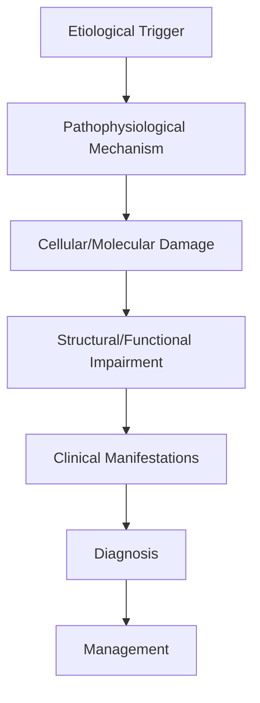
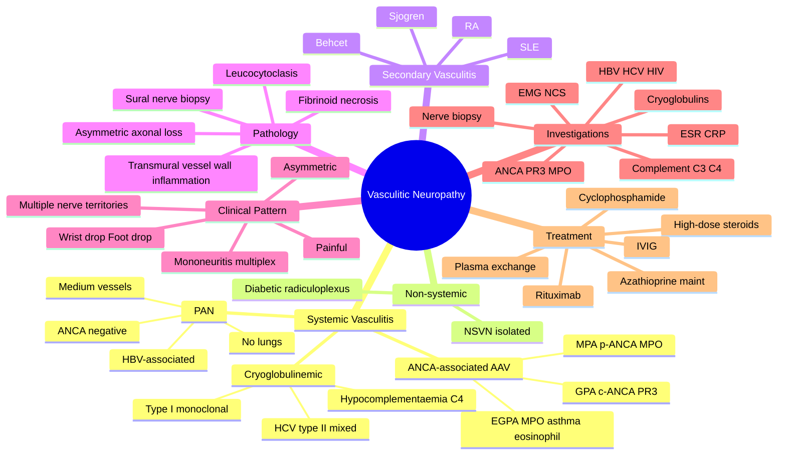

# Vasculitic Neuropathy

> [!tip] **High-Yield Definition**
> Comprehensive clinical note for Vasculitic Neuropathy covering definition, epidemiology, aetiology, pathophysiology, clinical features, investigations, differential diagnosis, management, drug interactions, procedures, complications, red flags, prognosis, topic correlation, and special situations for FCPS/MRCP examination preparation based on Davidson 24th Edition Chapter 25: Neurology.

---

## 1. Definition / Epidemiology / Classification

### Definition
Vasculitic Neuropathy is a neurological disorder within the 08 peripheral neuropathy category. It is characterised by specific clinical, pathological, radiological, and laboratory features that allow differentiation from related conditions.

### Epidemiology
- **Incidence/Prevalence:** Variable depending on the specific condition.
- **Age:** Adult onset is most common, but paediatric and elderly presentations occur.
- **Sex:** Variable depending on the condition.
- **Geography:** Worldwide distribution, with higher prevalence in certain regions.
- **Risk Factors:** Genetic predisposition, environmental factors, comorbidities, family history.

### Classification
| Subtype | Key Features | Prognosis |
|---------|-------------|-----------|
| Mild/early | Subtle symptoms, preserved function | Best |
| Moderate | Clear symptoms, functional impairment | Variable |
| Severe | Significant disability, complications | Worst |

---

## 2. Aetiology / Pathophysiology

### Aetiology
- **Primary (idiopathic):** Most cases have no identifiable cause.
- **Genetic:** May be inherited (AD, AR, X-linked, mitochondrial, sporadic).
- **Autoimmune:** Autoantibodies, immune-mediated inflammation.
- **Infectious:** Viral, bacterial, fungal, parasitic.
- **Metabolic:** Electrolyte, endocrine, hepatic, renal, nutritional.
- **Toxic:** Drugs, alcohol, heavy metals, environmental toxins.
- **Vascular:** Ischaemia, haemorrhage, vasculitis.
- **Neoplastic:** Primary, secondary, paraneoplastic.
- **Traumatic:** Acute, chronic, repetitive.
- **Degenerative:** Neurodegeneration, protein misfolding.

### Pathophysiology


---

## 3. Clinical Features

### History
- **Onset/Duration:** Acute, subacute, or chronic.
- **Progression:** Static, progressive, relapsing-remitting, stepwise.
- **Key symptoms:** Specific to the condition.
- **Triggers:** Stress, infection, trauma, drugs, hormonal, environmental.
- **Systemic symptoms:** Constitutional features.
- **Drug/Family/Social history:** Relevant exposures, comorbidities.

### Examination
| Domain | Key Findings | Localisation Value |
|--------|-------------|-------------------|
| Higher function | Cognitive, behavioural | Cortical, subcortical, limbic |
| Cranial nerves | Pupils, eye movements, facial, bulbar | Brainstem, cranial nerve, NMJ |
| Motor | Weakness, tone, reflexes | UMN, LMN, NMJ, muscle |
| Sensory | All modalities, pattern | Peripheral, spinal, brainstem |
| Coordination | Ataxia, nystagmus, dysmetria | Cerebellar, sensory, vestibular |
| Gait | Spastic, ataxic, parkinsonian | Multiple |
| Autonomic | Orthostatic, sweating, GI, bladder | Autonomic, peripheral, central |

### Specific Clinical Features
The clinical features are determined by the underlying aetiology, location of pathology, and rate of progression. Patients typically present with a constellation of symptoms and signs that allow clinical localisation and subsequent targeted investigation.

---

## 4. Diagnostic Approach / Algorithm

```mermaid
flowchart TD
    A[Clinical Presentation] --> B[Anatomical Localisation]
    B --> C[Pathophysiological Category]
    C --> D[Formulate Differential]
    D --> E[Targeted Investigations]
    E --> F[Confirm Diagnosis]
    F --> G[Assess Severity/Prognosis]
    G --> H[Initiate Management]
    H --> I[Monitor Response]
    I --> J{Response?}
    J --> YES1 [Good - Continue]
    J --> NO1 [Poor - Escalate]
    YES1 --> K[Monitor]
    NO1 --> H
```

---

## 5. Investigations

### First-Line Investigations
- **Blood tests:** FBC, U&Es, LFTs, glucose, calcium, magnesium, ESR, CRP, autoimmune, infection.
- **Imaging:** CT/MRI brain/spine (essential for most neurological conditions).
- **Neurophysiology:** EEG, nerve conduction, EMG, evoked potentials.
- **CSF:** Cell count, protein, glucose, OCBs, PCR, culture.

### Second-Line Investigations
- **Genetic testing:** Gene panels, WES, WGS.
- **Antibody testing:** Antineuronal, autoimmune, paraneoplastic.
- **Biopsy:** Nerve, muscle, brain, skin.
- **Advanced imaging:** PET-CT, MR spectroscopy, fMRI.

### Specialised Investigations
- **Biomarkers:** Neurofilament light chain, tau, beta-amyloid, 14-3-3, RT-QuIC.
- **Autonomic testing:** Head-up tilt, sudomotor, QSART.
- **Neuropsychology:** Cognitive testing, behavioural assessment.
- **Genetic counselling:** Family screening, predictive testing.

---

## 6. Differential Diagnosis

| Differential | Distinguishing Features | Key Test |
|--------------|------------------------|----------|
| Vascular | Sudden onset, focal, vascular risk factors | MRI/CT, vessel imaging |
| Inflammatory | Subacute, multifocal, systemic | MRI, CSF, antibodies |
| Infectious | Fever, systemic, exposure | Bloods, CSF, imaging |
| Neoplastic | Progressive, mass effect | MRI, biopsy |
| Degenerative | Progressive, symmetric, hereditary | MRI, genetic |
| Toxic/Metabolic | Drug history, systemic, reversible | Bloods, toxicology |
| Autoimmune | Multifocal, antibodies, immunotherapy response | Antibodies, MRI, CSF |
| Functional | Inconsistent, distractible | Clinical, video, biomarkers |

---

## 7. Management

### Acute Management
- **Stabilisation:** ABCDE approach, emergency resuscitation.
- **Specific treatment:** Disease-specific interventions.
- **Symptomatic relief:** Pain, seizures, spasticity, autonomic dysfunction.
- **Prevention of complications:** DVT, pressure sores, infection.

### Disease-Modifying Treatment
- **Pharmacological:** First-line, second-line, escalation, maintenance.
- **Procedural:** Surgery, biopsy, drainage, ablation, stimulation.
- **Immunotherapy:** Steroids, IVIG, plasma exchange, immunosuppressants, biologics.
- **Rehabilitation:** Physiotherapy, OT, speech therapy.

### Long-Term Management
- **Monitoring:** Clinical, imaging, biomarkers, side effects.
- **Prevention:** Vaccinations, prophylaxis, lifestyle modification.
- **Supportive care:** Multidisciplinary team, social work, psychological support.
- **Palliative care:** Advanced care planning, end-of-life care, hospice.

---

## 8. Drug Interactions / Contraindications / Comorbidity Cautions

| Drug Class | Interaction / Caution | Management |
|------------|----------------------|------------|
| Antiseizure medications | Enzyme induction, teratogenicity | Monitor, supplement, switch |
| Immunosuppressants | Infection, malignancy, teratogenicity | Monitor, prophylaxis |
| Anticoagulants | Bleeding risk, drug interactions | Monitor INR, avoid combinations |
| Antihypertensives | Hypotension, falls | Monitor BP, adjust dose |
| Antibiotics | Nephrotoxicity, ototoxicity | Monitor renal |
| Antivirals | Nephrotoxicity, neuropsychiatric | Monitor renal, dose adjust |
| Steroids | DM, HTN, osteoporosis, infection | Monitor, prophylaxis, taper |
| Biologics | Infusion reactions, infection | Monitor, prophylaxis |

---

## 9. Procedures

### Common Procedures
- **Lumbar puncture:** Diagnostic, therapeutic (IIH, NPH). Contraindications: raised ICP, mass lesion, coagulopathy.
- **Nerve conduction studies/EMG:** Diagnostic, prognosis. Minor discomfort.
- **EEG:** Diagnostic, monitoring. No significant complications.
- **MRI brain/spine:** Diagnostic, monitoring. Contraindications: pacemaker, metallic implants.
- **CT head:** Emergency, rapid. Radiation exposure, contrast reactions.
- **Biopsy:** Stereotactic, open. Indications: diagnosis, molecular profiling.

---

## 10. Complications

| Complication | Frequency | Prevention | Management |
|--------------|-----------|------------|------------|
| Infection | Common | Hygiene, prophylaxis, vaccination | Antibiotics, antifungals |
| Thrombosis | Common | Prophylaxis, mobility | Anticoagulation |
| Pressure sores | Common | Positioning, nutrition | Wound care, surgery |
| Spasticity | Common | Positioning, stretching | Baclofen, BoNT |
| Contractures | Common | Passive movements, splints | Physiotherapy, surgery |
| Aspiration | Common | Swallow assessment | NGT, PEG, thickeners |
| Falls | Common | Environment, mobility | Walking aids |
| Fractures | Common | Bone health, prevention | Vitamin D, bisphosphonate |
| Depression | Common | Screening, support | Antidepressants, CBT |
| Cognitive decline | Variable | Monitoring, training | Rehabilitation |
| Autonomic dysfunction | Variable | Monitoring, hydration | Midodrine, fludrocortisone |
| Respiratory failure | Variable | Monitoring, supportive | Ventilation, NIV |
| Death | Variable | Monitoring, palliative | End-of-life care |

---

## 11. Red Flags / Emergencies

### Emergency Presentations
- **Rapid neurological deterioration:** New focal deficit, decreased consciousness, seizures.
- **Status epilepticus:** Continuous seizures >5 min.
- **Raised ICP:** Headache, vomiting, papilloedema, altered consciousness.
- **Respiratory failure:** Hypoxia, hypercapnia, ventilatory failure.
- **Cardiac arrest:** Arrhythmia, MI, pulmonary embolism.
- **Infection:** Sepsis, meningitis, abscess, encephalitis.
- **Drug toxicity:** Overdose, side effects, interactions.
- **Haemorrhage:** Intracranial, systemic, coagulopathy.

---

## 12. Prognosis

### Natural History
- **Acute:** May resolve with treatment, may progress, may be fatal.
- **Subacute:** Variable, depends on cause and treatment.
- **Chronic:** Often progressive, may be stable, may have relapses.
- **Recovery:** Variable, may be complete, partial, or none.

### Prognostic Factors
- **Favourable:** Young age, early treatment, mild disease, reversible cause, good premorbid function, family support.
- **Unfavourable:** Older age, delayed treatment, severe disease, irreversible cause, poor premorbid function, comorbidities.

---

## 13. Topic Correlation

| Related Topic | Link | Key Overlap |
|---------------|------|-------------|
| Davidson 24th Ed Chapter 25 | [[Davidson Chapter 25 - Neurology Hierarchy]] | Comprehensive neurology |
| Neurology MOC | [[Neurology MOC]] | All neurology topics |
| Drug Reference | [[../00_Index/Neurology Drug Reference]] | Medications |
| Local Hub | [[../08_Peripheral_Neuropathy/Hub]] | Section-specific |
| Clinical Examination | [[../01_Fundamentals_Examination/Neurological History Taking]] | Clinical approach |
| Investigation | [[../01_Fundamentals_Examination/Neuroimaging (CT-MRI) Principles]] | Imaging |

---

## 14. Special Situations

| Situation | Consideration |
|-----------|---------------|
| **Pregnancy** | Pre-conception counselling, teratogenicity, drug safety, monitoring, delivery planning, breastfeeding. |
| **Lactation** | Drug safety, breastfeeding, monitoring, support. |
| **Paediatric** | Developmental considerations, drug dosing, school, family, vaccination, growth, puberty. |
| **Elderly / Frail** | Comorbidities, polypharmacy, falls, bone health, cognition, social, end-of-life. |
| **Renal impairment** | Drug dose adjustment, monitoring, dialysis, transplant. |
| **Hepatic impairment** | Drug dose adjustment, monitoring, transplant. |
| **Immunocompromised** | Infection prophylaxis, vaccination, drug interactions, malignancy screening. |
| **Perioperative** | Drug management, anaesthesia planning, VTE prophylaxis, infection prevention, monitoring. |
| **Driving / DVLA** | Fitness to drive, restrictions, notification, reassessment. |
| **Occupational** | Fitness for work, adaptations, rehabilitation, disability, return to work. |

---

## FCPS/MRCP High-Yield Summary

| Category | Key Points |
|----------|------------|
| **Definition** | Comprehensive definition with key diagnostic criteria |
| **Epidemiology** | Incidence, prevalence, age, sex, geography, risk factors |
| **Aetiology** | Primary causes, secondary causes, genetic, environmental |
| **Pathophysiology** | Mechanism of disease, cellular/molecular basis |
| **Clinical Features** | History, examination, key findings, variants |
| **Diagnosis** | Diagnostic criteria, classification, severity |
| **Investigations** | First-line, second-line, specialised, biomarkers |
| **Differential Diagnosis** | Key differentials, distinguishing features, tests |
| **Management** | Acute, disease-modifying, symptomatic, supportive |
| **Complications** | Common, serious, prevention, management |
| **Prognosis** | Natural history, prognostic factors, outcomes |
| **Viva Pearls** | Key examination points |
| **Drug Doses** | First-line, second-line, emergency |
| **Scoring Systems** | Specific scores used in management |
| **Genetics** | Inheritance, genes, mutations, family screening |
| **Imaging Signs** | Characteristic findings, differential |

---

## Viva Questions (PACES/FCPS Style)

1. **Q:** Define and classify its variants.
   **A:** Comprehensive definition with classification of subtypes based on aetiology, severity, and clinical features.

2. **Q:** What are the key clinical features?
   **A:** Specific symptoms and signs including onset, progression, key features, and associated findings.

3. **Q:** What is the first-line treatment?
   **A:** First-line pharmacological and non-pharmacological management based on current evidence.

4. **Q:** What are the red flags requiring urgent referral?
   **A:** Specific emergency presentations and complications requiring immediate intervention.

5. **Q:** What is the prognosis?
   **A:** Natural history, prognostic factors, and long-term outcomes.

6. **Q:** How do you differentiate from key differentials?
   **A:** Clinical features, investigations, and response to treatment that distinguish from alternative diagnoses.

7. **Q:** What investigations are most useful?
   **A:** First-line and second-line investigations including imaging, neurophysiology, CSF, and biomarkers.

8. **Q:** Describe the stepwise management approach.
   **A:** Stepwise escalation from first-line to second-line to third-line therapy with monitoring.

9. **Q:** What are the emergency presentations?
   **A:** Specific emergency scenarios and immediate management priorities.

10. **Q:** How does management change in pregnancy/paediatrics/elderly?
    **A:** Special considerations for each population including drug safety, monitoring, and support.

---

## Common Confusions / Exam Traps

| Confusion | Clarification |
|-----------|---------------|
| Similar presentation but different cause | Differentiate by history, examination, investigations |
| Treatment response vs natural history | Assess with objective measures, biomarkers |
| Drug interactions | Check each drug, monitor, adjust doses |
| Disease progression vs treatment failure | Monitor response, escalate appropriately |
| Functional vs organic | Inconsistent, distractible, disability greater than impairment |
| Acute vs chronic | Time course, progression, reversibility |
| Primary vs secondary | Underlying cause, contributing factors |
| Side effects vs symptoms | Temporal relationship, dose relationship |

---

## Mnemonics

### Mnemonic 1: "PAN-PAIN" — Polyarteritis Nodosa (PAN) Features
- **P** — **P**eripheral neuropathy (mononeuritis multiplex) in 50–75%
- **A** — **A**bdominal pain (mesenteric ischaemia, perforation, cholecystitis)
- **N** — **N**o pulmonary involvement (characteristically spares lungs)
- **P** — **P**ositive hepatitis B serology (5–30%) and ANCA-**N**egative
- **A** — **A**neurysms on mesenteric/renal angiography
- **I** — Increased BP (renin-mediated hypertension from renal artery ischaemia)
- **N** — **N**odules (subcutaneous, livedo reticularis)

### Mnemonic 2: "ELMO-ANCA" — ANCA-Associated Vasculitis with Neuropathy
- **E**osinophilic granulomatosis with polyangiitis (EGPA / Churg-Strauss): asthma + eosinophilia + p-ANCA/MPO in 40–60%
- **L**ong-standing GPA (Wegener): ENT (saddle nose, subglottic stenosis) + lung nodules + glomerulonephritis; c-ANCA/PR3
- **M**icroscopic polyangiitis (MPA): pauci-immune GN + diffuse alveolar haemorrhage + peripheral neuropathy; p-ANCA/MPO
- **O**ther: Drug-induced AAV (hydralazine, PTU, cocaine/levamisole) — always ANCA-positive

### Mnemonic 3: "MCQ-MM" — Mononeuritis Multiplex Differential
- **M**icroscopic polyangiitis (most common systemic vasculitis cause)
- **C**ryoglobulinemia (HCV-associated type II mixed)
- **Q**uietly progressive vasculitides (GPA, EGPA)
- **M**imics to exclude: Diabetes (diabetic radiculoplexus / lumbosacral radiculoplexus neuropathy), Sarcoid, Multifocal CIDP, Lymphoma/leukaemia (neurolymphomatosis), Infection (Lyme, leprosy, HIV, HBV, HCV, CMV)

---

## Mind Map



---

## Spaced Repetition Trackers

| Day | Topic | Recall Score (/5) | Weak Areas | Review Date |
|-----|-------|-------------------|------------|-------------|
| Day 1 | Definition + Mononeuritis Multiplex pattern | ___/5 | | |
| Day 3 | Systemic Vasculitides (PAN, MPA, GPA, EGPA) | ___/5 | | |
| Day 7 | Cryoglobulinemia + ANCA testing + Complement | ___/5 | | |
| Day 14 | Nerve biopsy + Histopathology | ___/5 | | |
| Day 30 | Treatment (steroids, cyclophosphamide, rituximab) | ___/5 | | |
| Day 60 | Secondary vasculitis (RA, SLE, Sjögren) | ___/5 | | |
| Day 90 | Full review + Mixed clinical scenarios | ___/5 | | |

---

## Self-Test Scorecard

| Domain | Score (/5) | Date Achieved | Notes |
|--------|-----------|---------------|-------|
| Definition & Classification | ___/5 | | |
| Aetiology & Pathophysiology | ___/5 | | |
| Clinical Features (mononeuritis multiplex) | ___/5 | | |
| Investigations (ANCA, complement, cryoglobulins, biopsy) | ___/5 | | |
| Differential Diagnosis | ___/5 | | |
| Acute Management | ___/5 | | |
| Long-term Management & Maintenance | ___/5 | | |
| Complications & Drug Toxicity | ___/5 | | |
| Red Flags (rapid progression, renal, DAH) | ___/5 | | |
| Special Populations (pregnancy, paediatric, elderly) | ___/5 | | |
| **TOTAL (/50)** | ___/50 | | |

**Pass Mark:** ≥35/50 (70%)

---

## MCQs (10)

**1. Question:** A 55-year-old man presents with acute onset of left foot drop and right wrist drop, with severe pain in the affected limbs. Examination shows steppage gait and weakness of right wrist and finger extensors. Which is the most characteristic clinical pattern?

   A. Distal symmetric polyneuropathy
   B. Mononeuritis multiplex (asymmetric multifocal neuropathy)
   C. Polyradiculopathy
   D. Motor neuron disease

   **Answer:** B

   **Explanation:** Mononeuritis multiplex (MM) is the hallmark of vasculitic neuropathy — painful, asymmetric, multifocal involvement of individual named nerves in different anatomical territories simultaneously or sequentially. This pattern in an adult should prompt urgent workup for vasculitis (systemic, ANCA-associated, cryoglobulinemic, or secondary).

**2. Question:** Which of the following is the gold standard investigation for confirmation of vasculitic neuropathy?

   A. MRI of the brachial plexus
   B. Combined sural nerve and peroneus brevis muscle biopsy
   C. Anti-PR3 antibody alone
   D. Nerve conduction studies alone

   **Answer:** B

   **Explanation:** Sural nerve biopsy (combined with peroneus brevis muscle biopsy to increase yield and reduce sampling error) is the gold standard, showing transmural inflammation of the vessel wall, fibrinoid necrosis, and leucocytoclasis. NCS/EMG support the diagnosis (showing asymmetric axonal neuropathy) but do not confirm vasculitis on their own.

**3. Question:** A patient with EGPA (Churg-Strauss) presents with peripheral neuropathy. Which of the following is most characteristic of the ANCA status?

   A. c-ANCA (PR3) positive in 90%
   B. p-ANCA (MPO) positive in 40–60%
   C. Anti-GBM positive
   D. ANA positive

   **Answer:** B

   **Explanation:** EGPA is ANCA-positive in only 40–60% (typically MPO/p-ANCA); ANCA-positive EGPA tends to have more renal and neurological involvement. PR3 is more typical of GPA. Anti-GBM is Goodpasture's. EGPA classically presents with asthma, eosinophilia, sinusitis, and peripheral neuropathy.

**4. Question:** A 50-year-old man with hepatitis C infection develops palpable purpura on the legs, arthralgia, and a painful asymmetric peripheral neuropathy. What is the most likely underlying mechanism of the neuropathy?

   A. Immune complex deposition in vessel walls (mixed cryoglobulinemia type II)
   B. Direct viral cytotoxicity to nerve
   C. Post-infectious demyelination
   D. Vitamin deficiency

   **Answer:** A

   **Explanation:** HCV-associated mixed (type II) cryoglobulinemia causes small-vessel immune-complex vasculitis with the clinical triad of palpable purpura, arthralgia, and neuropathy (often mononeuritis multiplex), with membranoproliferative glomerulonephritis. Cryoglobulins precipitate in cold and consume complement (low C4).

**5. Question:** Which of the following vasculitides characteristically spares the pulmonary circulation?

   A. Granulomatosis with polyangiitis (GPA)
   B. Microscopic polyangiitis (MPA)
   C. Polyarteritis nodosa (PAN)
   D. Eosinophilic granulomatosis with polyangiitis (EGPA)

   **Answer:** C

   **Explanation:** PAN affects medium-sized arteries and characteristically spares the lungs (no pulmonary involvement). GPA causes necrotising granulomatous inflammation in the upper/lower respiratory tract. MPA causes pulmonary capillaritis with diffuse alveolar haemorrhage. EGPA causes asthma and pulmonary eosinophilic infiltrates.

**6. Question:** A patient with new mononeuritis multiplex and positive MPO-ANCA is to start induction treatment. Initial treatment should include:

   A. Oral NSAIDs only
   B. High-dose glucocorticoids plus either cyclophosphamide or rituximab
   C. Plasmapheresis alone
   D. IVIg only

   **Answer:** B

   **Explanation:** ANCA-associated vasculitis with neurological involvement is severe organ-threatening disease and requires induction with high-dose glucocorticoids plus either cyclophosphamide (CYCLOPS, CAVAS) or rituximab (RAVE, RITUXVAS). Rituximab is preferred in PR3-AAV, women of childbearing age, and relapsing disease. Plasmapheresis is added for severe renal failure or diffuse alveolar haemorrhage (PEXIVAS).

**7. Question:** Which histological finding on sural nerve biopsy confirms vasculitic neuropathy?

   A. Onion bulb formations
   B. Inflammatory infiltrate of the vessel wall with fibrinoid necrosis
   C. Segmental demyelination only
   D. Posterior column vacuolation

   **Answer:** B

   **Explanation:** Transmural inflammation (neutrophils, lymphocytes, eosinophils) with fibrinoid necrosis of the vessel wall ± leucocytoclasis is diagnostic. Onion bulbs suggest CIDP or hereditary demyelinating neuropathy. Posterior column vacuolation suggests B12 deficiency (subacute combined degeneration). Segmental demyelination alone suggests an immune-mediated demyelinating process.

**8. Question:** Non-systemic vasculitic neuropathy (NSVN) is best described as:

   A. Vasculitis affecting multiple organs including nerves
   B. Vasculitis confined to the peripheral nervous system
   C. Secondary vasculitis due to connective tissue disease
   D. A severe form of polyarteritis nodosa

   **Answer:** B

   **Explanation:** NSVN (also called "isolated" or "idiopathic" vasculitic neuropathy) is a vasculitis restricted to the peripheral nerves, without systemic organ involvement. It is more indolent than systemic vasculitis but still requires immunosuppression (typically steroids + steroid-sparing agent) to prevent progressive neurological deficit.

**9. Question:** A patient with long-standing seropositive rheumatoid arthritis develops new asymmetric painful foot drop with skin ulceration. The most likely cause is:

   A. Drug-induced neuropathy from methotrexate
   B. Rheumatoid vasculitis with mononeuritis multiplex
   C. Atlantoaxial subluxation
   D. Bilateral carpal tunnel syndrome

   **Answer:** B

   **Explanation:** Rheumatoid vasculitis is a serious extra-articular manifestation of long-standing seropositive RA, presenting as mononeuritis multiplex or distal symmetric neuropathy, often with skin lesions (purpura, ulceration, digital gangrene). Risk factors: high RF titre, erosive disease, smoking, male sex. Carpal tunnel is bilateral and median, not foot drop.

**10. Question:** Cryoglobulinemic vasculitis with neuropathy associated with hepatitis C should be treated first-line with:

   A. Cyclophosphamide alone
   B. Antiviral therapy (DAAs) ± rituximab for severe disease
   C. Plasmapheresis only
   D. Methotrexate

   **Answer:** B

   **Explanation:** HCV-associated cryoglobulinemic vasculitis is treated with direct-acting antivirals (DAAs — sofosbuvir/ledipasvir, glecaprevir/pibrentasvir) to eradicate the underlying HCV, with rituximab added for severe vasculitic manifestations (including neuropathy, glomerulonephritis, or skin necrosis). Antivirals alone may be insufficient when vasculitis is active and severe.

---

## SBA Questions (10)

**1. Scenario:** A 60-year-old presents with painful asymmetric wrist and foot drop, weight loss, and livedo reticularis on the legs.
   **Question:** What is the most likely diagnosis?

   **Options:**
   A. Diabetic amyotrophy
   B. Vasculitic neuropathy (mononeuritis multiplex)
   C. Guillain-Barré syndrome
   D. Chronic inflammatory demyelinating polyneuropathy
   E. Lead poisoning

   **Answer:** B

   **Explanation:** Painful asymmetric multifocal neuropathy + constitutional symptoms + livedo reticularis is classic for vasculitic neuropathy. GBS is acute, symmetric, and ascending (not multifocal). CIDP is chronic and predominantly sensory-motor symmetric. Lead causes motor wrist drop but is usually bilateral and not associated with livedo.

**2. Scenario:** A patient with new mononeuritis multiplex is tested. ANCA is negative, but hepatitis B surface antigen is positive.
   **Question:** Which vasculitis is most likely?

   **Options:**
   A. Granulomatosis with polyangiitis
   B. Microscopic polyangiitis
   C. Polyarteritis nodosa
   D. Cryoglobulinemic vasculitis
   E. Eosinophilic granulomatosis with polyangiitis

   **Answer:** C

   **Explanation:** PAN is associated with chronic hepatitis B in ~5–30% of cases and is characteristically ANCA-negative. Hepatitis B-associated PAN may require combination therapy: antiviral (entecavir/tenofovir) + short-course immunosuppression + plasmapheresis to remove immune complexes.

**3. Scenario:** A 45-year-old woman with SLE develops a new painful foot drop. Nerve biopsy shows transmural inflammation and fibrinoid necrosis of small vessels.
   **Question:** What is the most appropriate induction therapy?

   **Options:**
   A. Oral NSAIDs
   B. IVIg alone
   C. High-dose glucocorticoids plus cyclophosphamide or rituximab
   D. Methotrexate only
   E. Plasmapheresis only

   **Answer:** C

   **Explanation:** Severe SLE vasculitis with mononeuritis multiplex requires aggressive immunosuppression with high-dose IV methylprednisolone (500–1000 mg/day × 3 days) plus either cyclophosphamide or rituximab. Methotrexate is not sufficient induction therapy for severe vasculitis. IVIg and plasmapheresis alone are inadequate.

**4. Scenario:** A patient presents with mononeuritis multiplex. Examination shows palpable purpura, arthralgia, and low C4 complement.
   **Question:** What is the next most important investigation?

   **Options:**
   A. Hepatitis C antibody and RNA PCR
   B. HbA1c
   C. Anti-GM1 antibodies
   D. MRI spine
   E. Lumbar puncture

   **Answer:** A

   **Explanation:** Mixed cryoglobulinemia (low C4, palpable purpura, arthralgia, neuropathy) is strongly associated with HCV. Testing for HCV antibody and HCV RNA PCR is essential. Treatment of HCV with direct-acting antivirals (DAAs) is now the cornerstone of therapy, often combined with rituximab for severe vasculitis.

**5. Scenario:** A patient with new mononeuritis multiplex and positive c-ANCA (PR3) is started on high-dose steroids and rituximab. Creatinine is 350 µmol/L with active sediment; there is no diffuse alveolar haemorrhage.
   **Question:** What is the role of plasma exchange in this patient?

   **Options:**
   A. First-line for all patients with AAV
   B. Considered if severe renal failure (creatinine >500) or diffuse alveolar haemorrhage
   C. Used for chronic maintenance only
   D. Replaced by IVIg
   E. Not used in vasculitis

   **Answer:** B

   **Explanation:** Plasma exchange is reserved for severe AAV with rapid renal deterioration (creatinine >500 µmol/L or dialysis-dependent) or diffuse alveolar haemorrhage, based on the PEXIVAS trial (no overall mortality benefit, but renal-recovery benefit). With creatinine 350 and no DAH, plasma exchange is not routine.

**6. Scenario:** Biopsy of the sural nerve shows inflammatory infiltrate in the epineurial vessels, fibrinoid necrosis, and asymmetric axonal fibre loss.
   **Question:** What is the most likely diagnosis?

   **Options:**
   A. CIDP
   B. Vasculitic neuropathy
   C. Diabetic neuropathy
   D. Sarcoid neuropathy
   E. Amyloid neuropathy

   **Answer:** B

   **Explanation:** Fibrinoid necrosis + epineurial vessel inflammation + asymmetric axonal fibre loss is pathognomonic for vasculitic neuropathy. CIDP shows demyelination/remyelination with onion bulbs. Diabetic neuropathy shows axonal loss with endoneurial microangiopathy but no active vessel wall inflammation. Sarcoid shows non-caseating granulomas. Amyloid shows Congo-red positive deposits.

**7. Scenario:** A patient with EGPA presents with progressive foot drop. The disease has been refractory to high-dose steroids and cyclophosphamide.
   **Question:** What is the next-line biologic option specifically targeting the eosinophilic pathophysiology?

   **Options:**
   A. Adalimumab (anti-TNF)
   B. Rituximab (anti-CD20)
   C. Mepolizumab (anti-IL-5)
   D. Etanercept (TNF receptor fusion)
   E. Infliximab (anti-TNF)

   **Answer:** C

   **Explanation:** Mepolizumab (anti-IL-5) is approved for EGPA and reduces steroid dependence and relapse rate (MIRRA trial). Rituximab is preferred for ANCA-positive EGPA with severe disease. Anti-TNF agents are not first-line for EGPA.

**8. Scenario:** A patient on long-standing hydralazine for hypertension develops mononeuritis multiplex, and MPO-ANCA is positive.
   **Question:** What is the most appropriate first step?

   **Options:**
   A. Continue hydralazine and add high-dose steroids
   B. Stop hydralazine immediately
   C. Add cyclophosphamide only
   D. Add IVIg
   E. Plasmapheresis

   **Answer:** B

   **Explanation:** Hydralazine, propylthiouracil, minocycline, and cocaine (with levamisole adulterant) are classic causes of drug-induced ANCA-associated vasculitis. The offending agent MUST be stopped as the first step. Many drug-induced AAV cases resolve after withdrawal; severe disease additionally requires immunosuppression.

**9. Scenario:** A patient with HCV cryoglobulinemia is started on direct-acting antivirals (DAAs) and achieves sustained virological response. Six months later, neuropathy is worse with new mononeuritis multiplex.
   **Question:** What is the next most appropriate management?

   **Options:**
   A. Stop DAAs
   B. Add rituximab for cryoglobulinemic vasculitis
   C. Add plasmapheresis only
   D. Add steroids alone
   E. Switch to interferon

   **Answer:** B

   **Explanation:** Cryoglobulinemic vasculitis may persist or flare even after HCV clearance. Rituximab is the preferred B-cell depleting agent for severe/refractory cryoglobulinemic vasculitis (per ACR/EULAR guidance). Steroids alone are insufficient for severe disease. Interferon is no longer standard of care.

**10. Scenario:** A 50-year-old presents with painful mononeuritis multiplex and rapidly progressive renal impairment (creatinine 600 µmol/L). Urinalysis shows active red cell casts. ANCA is positive (p-ANCA/MPO).
    **Question:** What is the most likely diagnosis?

    **Options:**
    A. Polyarteritis nodosa
    B. ANCA-associated vasculitis (MPA)
    C. Cryoglobulinemic vasculitis
    D. Goodpasture syndrome
    E. IgA nephropathy

    **Answer:** B

    **Explanation:** ANCA-associated vasculitis (especially MPA, but also GPA) causes pauci-immune necrotizing crescentic glomerulonephritis with rapidly progressive renal failure + mononeuritis multiplex. PAN causes renal impairment via hypertension/ischaemia but typically NOT active sediment (no glomerulonephritis — medium vessels, not small). Cryoglobulinemia causes membranoproliferative GN. Goodpasture is primarily pulmonary-renal with anti-GBM antibodies.

---

## Tags

#neurology #peripheral-neuropathy #vasculitis #ANCA #mononeuritis-multiplex #GPA #MPA #EGPA #PAN #cryoglobulinemia #FCPS #MRCP

---


## Local Navigation
**Heading Hub:** [[../Hub]]  
**Chapter Hierarchy:** [[Davidson Chapter 25 - Neurology Hierarchy]]  
**Chapter MOC:** [[Neurology MOC]]  
**Drug Reference:** [[../00_Index/Neurology Drug Reference]]  
