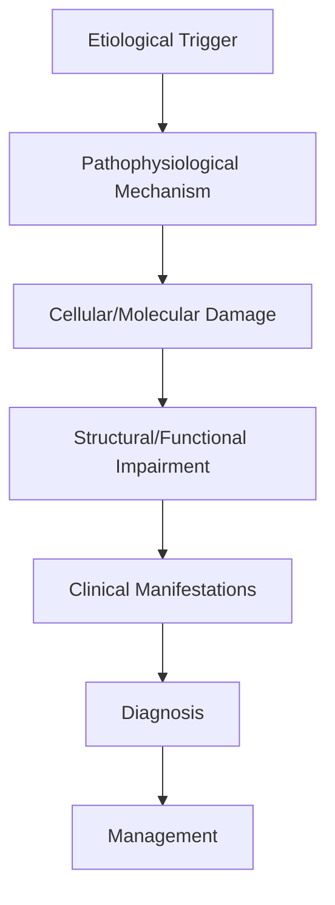
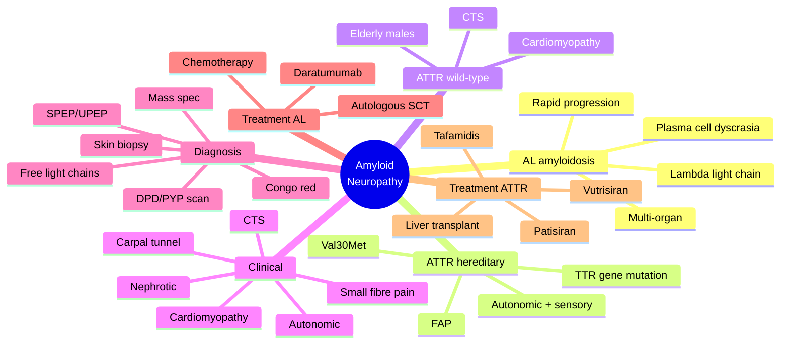

# Amyloid Neuropathy

> [!tip] **High-Yield Definition**
> Comprehensive clinical note for Amyloid Neuropathy covering definition, epidemiology, aetiology, pathophysiology, clinical features, investigations, differential diagnosis, management, drug interactions, procedures, complications, red flags, prognosis, topic correlation, and special situations for FCPS/MRCP examination preparation based on Davidson 24th Edition Chapter 25: Neurology.

---

## 1. Definition / Epidemiology / Classification

### Definition
Amyloid Neuropathy is a neurological disorder within the 08 peripheral neuropathy category. It is characterised by specific clinical, pathological, radiological, and laboratory features that allow differentiation from related conditions.

### Epidemiology
- **Incidence/Prevalence:** Variable depending on the specific condition.
- **Age:** Adult onset is most common, but paediatric and elderly presentations occur.
- **Sex:** Variable depending on the condition.
- **Geography:** Worldwide distribution, with higher prevalence in certain regions.
- **Risk Factors:** Genetic predisposition, environmental factors, comorbidities, family history.

### Classification
| Subtype | Key Features | Prognosis |
|---------|-------------|-----------|
| Mild/early | Subtle symptoms, preserved function | Best |
| Moderate | Clear symptoms, functional impairment | Variable |
| Severe | Significant disability, complications | Worst |

---

## 2. Aetiology / Pathophysiology

### Aetiology
- **Primary (idiopathic):** Most cases have no identifiable cause.
- **Genetic:** May be inherited (AD, AR, X-linked, mitochondrial, sporadic).
- **Autoimmune:** Autoantibodies, immune-mediated inflammation.
- **Infectious:** Viral, bacterial, fungal, parasitic.
- **Metabolic:** Electrolyte, endocrine, hepatic, renal, nutritional.
- **Toxic:** Drugs, alcohol, heavy metals, environmental toxins.
- **Vascular:** Ischaemia, haemorrhage, vasculitis.
- **Neoplastic:** Primary, secondary, paraneoplastic.
- **Traumatic:** Acute, chronic, repetitive.
- **Degenerative:** Neurodegeneration, protein misfolding.

### Pathophysiology


---

## 3. Clinical Features

### History
- **Onset/Duration:** Acute, subacute, or chronic.
- **Progression:** Static, progressive, relapsing-remitting, stepwise.
- **Key symptoms:** Specific to the condition.
- **Triggers:** Stress, infection, trauma, drugs, hormonal, environmental.
- **Systemic symptoms:** Constitutional features.
- **Drug/Family/Social history:** Relevant exposures, comorbidities.

### Examination
| Domain | Key Findings | Localisation Value |
|--------|-------------|-------------------|
| Higher function | Cognitive, behavioural | Cortical, subcortical, limbic |
| Cranial nerves | Pupils, eye movements, facial, bulbar | Brainstem, cranial nerve, NMJ |
| Motor | Weakness, tone, reflexes | UMN, LMN, NMJ, muscle |
| Sensory | All modalities, pattern | Peripheral, spinal, brainstem |
| Coordination | Ataxia, nystagmus, dysmetria | Cerebellar, sensory, vestibular |
| Gait | Spastic, ataxic, parkinsonian | Multiple |
| Autonomic | Orthostatic, sweating, GI, bladder | Autonomic, peripheral, central |

### Specific Clinical Features
The clinical features are determined by the underlying aetiology, location of pathology, and rate of progression. Patients typically present with a constellation of symptoms and signs that allow clinical localisation and subsequent targeted investigation.

---

## 4. Diagnostic Approach / Algorithm

```mermaid
flowchart TD
    A[Clinical Presentation] --> B[Anatomical Localisation]
    B --> C[Pathophysiological Category]
    C --> D[Formulate Differential]
    D --> E[Targeted Investigations]
    E --> F[Confirm Diagnosis]
    F --> G[Assess Severity/Prognosis]
    G --> H[Initiate Management]
    H --> I[Monitor Response]
    I --> J{Response?}
    J --> YES1 [Good - Continue]
    J --> NO1 [Poor - Escalate]
    YES1 --> K[Monitor]
    NO1 --> H
```

---

## 5. Investigations

### First-Line Investigations
- **Blood tests:** FBC, U&Es, LFTs, glucose, calcium, magnesium, ESR, CRP, autoimmune, infection.
- **Imaging:** CT/MRI brain/spine (essential for most neurological conditions).
- **Neurophysiology:** EEG, nerve conduction, EMG, evoked potentials.
- **CSF:** Cell count, protein, glucose, OCBs, PCR, culture.

### Second-Line Investigations
- **Genetic testing:** Gene panels, WES, WGS.
- **Antibody testing:** Antineuronal, autoimmune, paraneoplastic.
- **Biopsy:** Nerve, muscle, brain, skin.
- **Advanced imaging:** PET-CT, MR spectroscopy, fMRI.

### Specialised Investigations
- **Biomarkers:** Neurofilament light chain, tau, beta-amyloid, 14-3-3, RT-QuIC.
- **Autonomic testing:** Head-up tilt, sudomotor, QSART.
- **Neuropsychology:** Cognitive testing, behavioural assessment.
- **Genetic counselling:** Family screening, predictive testing.

---

## 6. Differential Diagnosis

| Differential | Distinguishing Features | Key Test |
|--------------|------------------------|----------|
| Vascular | Sudden onset, focal, vascular risk factors | MRI/CT, vessel imaging |
| Inflammatory | Subacute, multifocal, systemic | MRI, CSF, antibodies |
| Infectious | Fever, systemic, exposure | Bloods, CSF, imaging |
| Neoplastic | Progressive, mass effect | MRI, biopsy |
| Degenerative | Progressive, symmetric, hereditary | MRI, genetic |
| Toxic/Metabolic | Drug history, systemic, reversible | Bloods, toxicology |
| Autoimmune | Multifocal, antibodies, immunotherapy response | Antibodies, MRI, CSF |
| Functional | Inconsistent, distractible | Clinical, video, biomarkers |

---

## 7. Management

### Acute Management
- **Stabilisation:** ABCDE approach, emergency resuscitation.
- **Specific treatment:** Disease-specific interventions.
- **Symptomatic relief:** Pain, seizures, spasticity, autonomic dysfunction.
- **Prevention of complications:** DVT, pressure sores, infection.

### Disease-Modifying Treatment
- **Pharmacological:** First-line, second-line, escalation, maintenance.
- **Procedural:** Surgery, biopsy, drainage, ablation, stimulation.
- **Immunotherapy:** Steroids, IVIG, plasma exchange, immunosuppressants, biologics.
- **Rehabilitation:** Physiotherapy, OT, speech therapy.

### Long-Term Management
- **Monitoring:** Clinical, imaging, biomarkers, side effects.
- **Prevention:** Vaccinations, prophylaxis, lifestyle modification.
- **Supportive care:** Multidisciplinary team, social work, psychological support.
- **Palliative care:** Advanced care planning, end-of-life care, hospice.

---

## 8. Drug Interactions / Contraindications / Comorbidity Cautions

| Drug Class | Interaction / Caution | Management |
|------------|----------------------|------------|
| Antiseizure medications | Enzyme induction, teratogenicity | Monitor, supplement, switch |
| Immunosuppressants | Infection, malignancy, teratogenicity | Monitor, prophylaxis |
| Anticoagulants | Bleeding risk, drug interactions | Monitor INR, avoid combinations |
| Antihypertensives | Hypotension, falls | Monitor BP, adjust dose |
| Antibiotics | Nephrotoxicity, ototoxicity | Monitor renal |
| Antivirals | Nephrotoxicity, neuropsychiatric | Monitor renal, dose adjust |
| Steroids | DM, HTN, osteoporosis, infection | Monitor, prophylaxis, taper |
| Biologics | Infusion reactions, infection | Monitor, prophylaxis |

---

## 9. Procedures

### Common Procedures
- **Lumbar puncture:** Diagnostic, therapeutic (IIH, NPH). Contraindications: raised ICP, mass lesion, coagulopathy.
- **Nerve conduction studies/EMG:** Diagnostic, prognosis. Minor discomfort.
- **EEG:** Diagnostic, monitoring. No significant complications.
- **MRI brain/spine:** Diagnostic, monitoring. Contraindications: pacemaker, metallic implants.
- **CT head:** Emergency, rapid. Radiation exposure, contrast reactions.
- **Biopsy:** Stereotactic, open. Indications: diagnosis, molecular profiling.

---

## 10. Complications

| Complication | Frequency | Prevention | Management |
|--------------|-----------|------------|------------|
| Infection | Common | Hygiene, prophylaxis, vaccination | Antibiotics, antifungals |
| Thrombosis | Common | Prophylaxis, mobility | Anticoagulation |
| Pressure sores | Common | Positioning, nutrition | Wound care, surgery |
| Spasticity | Common | Positioning, stretching | Baclofen, BoNT |
| Contractures | Common | Passive movements, splints | Physiotherapy, surgery |
| Aspiration | Common | Swallow assessment | NGT, PEG, thickeners |
| Falls | Common | Environment, mobility | Walking aids |
| Fractures | Common | Bone health, prevention | Vitamin D, bisphosphonate |
| Depression | Common | Screening, support | Antidepressants, CBT |
| Cognitive decline | Variable | Monitoring, training | Rehabilitation |
| Autonomic dysfunction | Variable | Monitoring, hydration | Midodrine, fludrocortisone |
| Respiratory failure | Variable | Monitoring, supportive | Ventilation, NIV |
| Death | Variable | Monitoring, palliative | End-of-life care |

---

## 11. Red Flags / Emergencies

### Emergency Presentations
- **Rapid neurological deterioration:** New focal deficit, decreased consciousness, seizures.
- **Status epilepticus:** Continuous seizures >5 min.
- **Raised ICP:** Headache, vomiting, papilloedema, altered consciousness.
- **Respiratory failure:** Hypoxia, hypercapnia, ventilatory failure.
- **Cardiac arrest:** Arrhythmia, MI, pulmonary embolism.
- **Infection:** Sepsis, meningitis, abscess, encephalitis.
- **Drug toxicity:** Overdose, side effects, interactions.
- **Haemorrhage:** Intracranial, systemic, coagulopathy.

---

## 12. Prognosis

### Natural History
- **Acute:** May resolve with treatment, may progress, may be fatal.
- **Subacute:** Variable, depends on cause and treatment.
- **Chronic:** Often progressive, may be stable, may have relapses.
- **Recovery:** Variable, may be complete, partial, or none.

### Prognostic Factors
- **Favourable:** Young age, early treatment, mild disease, reversible cause, good premorbid function, family support.
- **Unfavourable:** Older age, delayed treatment, severe disease, irreversible cause, poor premorbid function, comorbidities.

---

## 13. Topic Correlation

| Related Topic | Link | Key Overlap |
|---------------|------|-------------|
| Davidson 24th Ed Chapter 25 | [[Davidson Chapter 25 - Neurology Hierarchy]] | Comprehensive neurology |
| Neurology MOC | [[Neurology MOC]] | All neurology topics |
| Drug Reference | [[../00_Index/Neurology Drug Reference]] | Medications |
| Local Hub | [[../08_Peripheral_Neuropathy/Hub]] | Section-specific |
| Clinical Examination | [[../01_Fundamentals_Examination/Neurological History Taking]] | Clinical approach |
| Investigation | [[../01_Fundamentals_Examination/Neuroimaging (CT-MRI) Principles]] | Imaging |

---

## 14. Special Situations

| Situation | Consideration |
|-----------|---------------|
| **Pregnancy** | Pre-conception counselling, teratogenicity, drug safety, monitoring, delivery planning, breastfeeding. |
| **Lactation** | Drug safety, breastfeeding, monitoring, support. |
| **Paediatric** | Developmental considerations, drug dosing, school, family, vaccination, growth, puberty. |
| **Elderly / Frail** | Comorbidities, polypharmacy, falls, bone health, cognition, social, end-of-life. |
| **Renal impairment** | Drug dose adjustment, monitoring, dialysis, transplant. |
| **Hepatic impairment** | Drug dose adjustment, monitoring, transplant. |
| **Immunocompromised** | Infection prophylaxis, vaccination, drug interactions, malignancy screening. |
| **Perioperative** | Drug management, anaesthesia planning, VTE prophylaxis, infection prevention, monitoring. |
| **Driving / DVLA** | Fitness to drive, restrictions, notification, reassessment. |
| **Occupational** | Fitness for work, adaptations, rehabilitation, disability, return to work. |

---

## FCPS/MRCP High-Yield Summary

| Category | Key Points |
|----------|------------|
| **Definition** | Comprehensive definition with key diagnostic criteria |
| **Epidemiology** | Incidence, prevalence, age, sex, geography, risk factors |
| **Aetiology** | Primary causes, secondary causes, genetic, environmental |
| **Pathophysiology** | Mechanism of disease, cellular/molecular basis |
| **Clinical Features** | History, examination, key findings, variants |
| **Diagnosis** | Diagnostic criteria, classification, severity |
| **Investigations** | First-line, second-line, specialised, biomarkers |
| **Differential Diagnosis** | Key differentials, distinguishing features, tests |
| **Management** | Acute, disease-modifying, symptomatic, supportive |
| **Complications** | Common, serious, prevention, management |
| **Prognosis** | Natural history, prognostic factors, outcomes |
| **Viva Pearls** | Key examination points |
| **Drug Doses** | First-line, second-line, emergency |
| **Scoring Systems** | Specific scores used in management |
| **Genetics** | Inheritance, genes, mutations, family screening |
| **Imaging Signs** | Characteristic findings, differential |

---

## Viva Questions (PACES/FCPS Style)

1. **Q:** Define and classify its variants.
   **A:** Comprehensive definition with classification of subtypes based on aetiology, severity, and clinical features.

2. **Q:** What are the key clinical features?
   **A:** Specific symptoms and signs including onset, progression, key features, and associated findings.

3. **Q:** What is the first-line treatment?
   **A:** First-line pharmacological and non-pharmacological management based on current evidence.

4. **Q:** What are the red flags requiring urgent referral?
   **A:** Specific emergency presentations and complications requiring immediate intervention.

5. **Q:** What is the prognosis?
   **A:** Natural history, prognostic factors, and long-term outcomes.

6. **Q:** How do you differentiate from key differentials?
   **A:** Clinical features, investigations, and response to treatment that distinguish from alternative diagnoses.

7. **Q:** What investigations are most useful?
   **A:** First-line and second-line investigations including imaging, neurophysiology, CSF, and biomarkers.

8. **Q:** Describe the stepwise management approach.
   **A:** Stepwise escalation from first-line to second-line to third-line therapy with monitoring.

9. **Q:** What are the emergency presentations?
   **A:** Specific emergency scenarios and immediate management priorities.

10. **Q:** How does management change in pregnancy/paediatrics/elderly?
    **A:** Special considerations for each population including drug safety, monitoring, and support.

---

## Common Confusions / Exam Traps

| Confusion | Clarification |
|-----------|---------------|
| Similar presentation but different cause | Differentiate by history, examination, investigations |
| Treatment response vs natural history | Assess with objective measures, biomarkers |
| Drug interactions | Check each drug, monitor, adjust doses |
| Disease progression vs treatment failure | Monitor response, escalate appropriately |
| Functional vs organic | Inconsistent, distractible, disability greater than impairment |
| Acute vs chronic | Time course, progression, reversibility |
| Primary vs secondary | Underlying cause, contributing factors |
| Side effects vs symptoms | Temporal relationship, dose relationship |

---

## Mnemonics

1. **TTR-CMR** — Transthyretin amyloid (ATTR) essentials:
   - **T**ransthyretin gene on chromosome 18 (TTR)
   - **T**TR mutations are the most common cause of hereditary amyloid polyneuropathy
   - **R**eplacement of TTR by **R**NA silencing (patisiran, vutrisiran) or stabilisation (tafamidis)
   - Val30Met (p.Val50Met) is the most common mutation; endemic in Portugal, Japan, Sweden
   - Wild-type ATTR (ATTRwt) causes restrictive cardiomyopathy + CTS in elderly, no/minimal neuropathy

2. **AL-CHAINS** — AL (light-chain) amyloidosis:
   - **A**L = Amyloid **L**ight chain
   - **C**lonally expanded plasma cells in marrow → monoclonal light chains
   - **H**eart (restrictive cardiomyopathy), kidneys (proteinuria), liver, peripheral nerve, soft tissues
   - **A**lmost always associated with MGUS, smouldering myeloma, or multiple myeloma
   - **I**mmunoglobulin light chain (most often lambda) misfolds → forms β-pleated sheet fibrils
   - **N**erve involvement is small-fibre and autonomic predominant early
   - **S**erum free light chain assay is the most sensitive screening test

3. **AMYLOID-FIVE** — Five diagnostic cornerstones:
   - **C**ongo red → apple-green birefringence under polarised light
   - **M**ass spectrometry of biopsy tissue → types the amyloid (gold standard)
   - **I**mmunohistochemistry with anti-AA, anti-λ, anti-κ, anti-TTR antibodies
   - **N**erve conduction studies (small-fibre sparing) + skin biopsy for IENFD
   - **S**erum/urine immunofixation + serum free light chains (to rule out AL)
   - **C**ardiac MRI / DPD/PYP scan (ATTR cardiac uptake, Grade 2–3 = highly specific)

---

## Mind Map



---

## Spaced Repetition Trackers

| Topic | Day 1 | Day 3 | Day 7 | Day 14 | Day 30 | Day 90 |
|-------|-------|-------|-------|--------|--------|--------|
| Distinguish AL vs ATTR (hereditary vs wild-type) | ☐ | ☐ | ☐ | ☐ | ☐ | ☐ |
| Most common TTR mutation (Val30Met / p.Val50Met) | ☐ | ☐ | ☐ | ☐ | ☐ | ☐ |
| Classic triad of small-fibre + autonomic + CTS | ☐ | ☐ | ☐ | ☐ | ☐ | ☐ |
| Congo red → apple-green birefringence | ☐ | ☐ | ☐ | ☐ | ☐ | ☐ |
| Mass spectrometry as the gold standard for typing | ☐ | ☐ | ☐ | ☐ | ☐ | ☐ |
| Serum free light chain assay in AL | ☐ | ☐ | ☐ | ☐ | ☐ | ☐ |
| DPD / PYP scan specificity for ATTR cardiac | ☐ | ☐ | ☐ | ☐ | ☐ | ☐ |
| Tafamidis for ATTR-CM and ATTR-PN | ☐ | ☐ | ☐ | ☐ | ☐ | ☐ |
| Patisiran / vutrisiran — RNA interference | ☐ | ☐ | ☐ | ☐ | ☐ | ☐ |
| Liver transplant for hereditary ATTR (removes source of mutant TTR) | ☐ | ☐ | ☐ | ☐ | ☐ | ☐ |

---

## Self-Test Scorecard

| Section | Score (/5) |
|---------|-----------|
| 1. Can list the 3 main types of systemic amyloidosis causing neuropathy (AL, ATTRv, ATTRwt) | /5 |
| 2. Can describe the genetic basis of hereditary ATTR (TTR gene, autosomal dominant) | /5 |
| 3. Can name the most common TTR mutation (Val30Met) | /5 |
| 4. Can list the small-fibre + autonomic + CTS presentation | /5 |
| 5. Can describe Congo red staining and apple-green birefringence | /5 |
| 6. Can outline the diagnostic algorithm — biopsy, mass spec, free light chains, DPD/PYP scan | /5 |
| 7. Can describe AL treatment (chemo, autologous SCT, daratumumab) | /5 |
| 8. Can describe ATTR treatment (tafamidis, patisiran, vutrisiran, liver transplant) | /5 |
| 9. Can identify cardiac, renal and autonomic red flags | /5 |
| 10. Can discuss prognosis (AL worse than ATTR; Val30Met early onset better with treatment) | /5 |
| **TOTAL** | **/50** |

---

## MCQs (10)

1. **Question:** Which of the following is the most common form of hereditary amyloid polyneuropathy?
   **Options:** A. AL amyloidosis (light chain) B. AA amyloidosis (serum amyloid A) C. ATTR amyloidosis due to TTR gene mutation (Val30Met) D. Apolipoprotein A-I amyloidosis
   **Answer:** C
   **Explanation:** Hereditary transthyretin amyloidosis (ATTRv, formerly FAP) is the most common inherited amyloid neuropathy. The Val30Met (p.Val50Met) mutation is the most frequent worldwide, with endemic foci in Portugal, Japan, and northern Sweden. AL amyloidosis is the most common acquired form overall but is a plasma cell dyscrasia, not hereditary.

2. **Question:** Which investigation is the gold standard for typing amyloid deposits in tissue?
   **Options:** A. Congo red staining alone B. Immunohistochemistry with light-chain antibodies only C. Mass spectrometry-based proteomic analysis D. Electron microscopy of fibrils
   **Answer:** C
   **Explanation:** Mass spectrometry-based proteomic analysis of Congo-red-positive tissue is the current gold standard for amyloid typing. It identifies the specific precursor protein with high sensitivity and specificity. Congo red is the screening test; immunohistochemistry can be misleading because of background staining and antibody cross-reactivity. Electron microscopy shows the characteristic 7.5–10 nm non-branching fibrils but does not type the amyloid.

3. **Question:** A 70-year-old man with bilateral carpal tunnel syndrome and new heart failure (preserved ejection fraction) with thick-walled ventricles is found to have low-voltage ECG and an apical-sparing pattern on strain echocardiography. What is the most likely diagnosis?
   **Options:** A. AL amyloidosis B. Hereditary ATTR (Val30Met) C. Wild-type ATTR (ATTRwt) D. Hypertensive cardiomyopathy
   **Answer:** C
   **Explanation:** Wild-type ATTR (ATTRwt, formerly "senile systemic amyloidosis") typically affects elderly men (>70), presents with bilateral carpal tunnel syndrome (often years before cardiac diagnosis) and a restrictive cardiomyopathy with thick ventricular walls, low-voltage ECG, and apical-sparing strain pattern. Diagnosis is confirmed by Grade 2–3 cardiac uptake on DPD/PYP/HMDP/PYP scan in the absence of a monoclonal protein. AL amyloid must be excluded with serum free light chains and immunofixation.

4. **Question:** Which is the most sensitive screening blood test for AL amyloidosis?
   **Options:** A. Serum protein electrophoresis (SPEP) alone B. Urinary Bence-Jones protein C. Serum free light chain assay (sFLC) D. Immunofixation of serum and urine
   **Answer:** C
   **Explanation:** The serum free light chain (sFLC) assay, combined with serum and urine immunofixation, has the highest sensitivity (>95%) for detecting monoclonal light chains in AL amyloidosis. SPEP alone misses ~30% of AL cases because the monoclonal protein is often small. Bence-Jones protein is only present in a subset. All three (sFLC, SIFE, UIFE) should be performed when AL is suspected.

5. **Question:** Which of the following is the first-line disease-modifying therapy for symptomatic ATTR polyneuropathy?
   **Options:** A. Tafamidis B. Patisiran or vutrisiran (RNA interference) C. Inotersen (antisense oligonucleotide) D. Cyclophosphamide
   **Answer:** B
   **Explanation:** In current practice, the RNA interference therapeutics patisiran and vutrisiran are first-line disease-modifying therapy for ATTRv polyneuropathy based on the APOLLO and HELIOS-A trials showing halting or reversal of neuropathy progression. Inotersen (antisense) is an alternative. Tafamidis is a TTR stabiliser first approved for ATTR cardiomyopathy; it can be used in ATTRv-PN with cardiac involvement. Cyclophosphamide has no role in ATTR.

6. **Question:** Which autonomic symptom is most characteristic of amyloid neuropathy?
   **Options:** A. Resting tremor B. Orthostatic hypotension, erectile dysfunction, and gastrointestinal dysmotility C. Heat intolerance only D. Painful muscle spasms
   **Answer:** B
   **Explanation:** Amyloid neuropathy characteristically affects small autonomic fibres early, producing orthostatic hypotension, erectile dysfunction, bladder/bowel dysfunction, gastroparesis, alternating constipation and diarrhoea, anhidrosis, and cardiac conduction abnormalities. The combination of small-fibre neuropathic pain with prominent autonomic failure is highly suggestive of amyloid. Resting tremor, heat intolerance alone, and cramps are not typical.

7. **Question:** In a patient with suspected amyloid neuropathy, which skin-biopsy finding is most useful?
   **Options:** A. Subepidermal blistering B. Reduced intra-epidermal nerve fibre density (IENFD) C. Acanthosis nigricans D. Psoriasiform hyperplasia
   **Answer:** B
   **Explanation:** Amyloid neuropathy is a small-fibre neuropathy, and skin biopsy (usually distal leg, 10 cm above the lateral malleolus) with quantification of the intra-epidermal nerve fibre density (IENFD) using PGP9.5 immunostaining is the most sensitive test. Reduced IENFD is found in most cases even when NCS is normal, because standard NCS evaluates large myelinated fibres. Congo red staining of the skin may also reveal perivascular amyloid.

8. **Question:** Which of the following is a characteristic ECG finding in cardiac amyloidosis?
   **Options:** A. Tall R waves in V1–V3 B. Low-voltage QRS complexes with a pseudo-infarct pattern C. Delta wave D. Short PR interval
   **Answer:** B
   **Explanation:** Cardiac amyloidosis classically shows low-voltage QRS complexes (despite echocardiographic ventricular wall thickening — a hallmark voltage/mass mismatch) with a pseudo-infarct pattern (pathological Q waves in the precordial leads) and conduction abnormalities (AV block, bundle branch block, AF). Tall R waves, delta waves, and short PR intervals are not typical.

9. **Question:** A patient with hereditary ATTR (Val30Met) develops progressive neuropathy at age 35. Liver transplantation has been considered. What is the rationale?
   **Options:** A. The liver clears amyloid from nerves B. The liver is the main site of mutant TTR production, and a new liver makes normal TTR C. The liver stores amyloid fibrils D. ATTR is caused by a hepatitis virus
   **Answer:** B
   **Explanation:** The liver is the principal site of transthyretin synthesis. In hereditary ATTR (most variants), >95% of circulating TTR is from the liver. Liver transplantation replaces the source of mutant TTR with normal TTR, halting disease progression (and sometimes allowing regression of cardiomyopathy with combined heart–liver transplant). It is most effective in younger patients with the Val30Met mutation and short disease duration. It does not affect existing wild-type TTR in ATTRwt and does not clear existing amyloid.

10. **Question:** Which of the following statements about prognosis in AL amyloidosis is most accurate?
    **Options:** A. Median survival is >15 years with modern therapy B. Cardiac involvement is the dominant prognostic factor (Mayo staging) C. AL amyloidosis is universally fatal within 1 year D. Renal involvement is the most important prognostic factor
    **Answer:** B
    **Explanation:** In AL amyloidosis, cardiac involvement is the dominant prognostic factor and the basis of the Mayo 2004 / 2012 staging systems (NT-proBNP and troponin). Median survival with modern therapy (proteasome inhibitors, daratumumab, autologous SCT) ranges from ~5 years for stage I to <1 year for stage IIIb. Renal involvement worsens prognosis but is second to cardiac. Untreated disease is rapidly fatal (months), but modern therapy has transformed outcomes.

---

## SBA Questions (10)

1. **Scenario:** A 40-year-old man of Portuguese descent presents with 2 years of progressive burning feet, alternating constipation and diarrhoea, erectile dysfunction, and weight loss. His father died of a "neuropathy" in his 40s. Examination shows distal sensory loss to the knees, absent ankle reflexes, and a blood pressure drop of 30/15 mmHg on standing.
   **Question:** What is the most likely diagnosis?
   **Options:** A. Diabetic autonomic neuropathy B. Hereditary transthyretin amyloidosis (ATTRv, Val30Met) C. Chronic inflammatory demyelinating polyneuropathy (CIDP) D. Paraneoplastic autonomic neuropathy
   **Answer:** B
   **Explanation:** The combination of small-fibre neuropathic pain, prominent autonomic dysfunction (orthostatic hypotension, GI dysmotility, erectile dysfunction), family history suggestive of autosomal dominant inheritance, and Portuguese origin (endemic Val30Met focus) is highly suggestive of hereditary ATTR (ATTRv). Diabetes usually has a slower, longer course and lacks the family history of early death. CIDP is demyelinating and motor-predominant. Paraneoplastic autonomic neuropathy is usually acute/subacute and associated with anti-Hu or CRMP5 antibodies.

2. **Scenario:** A 65-year-old man presents with bilateral carpal tunnel syndrome, a restrictive cardiomyopathy, and a Grade 3 cardiac uptake on DPD scintigraphy. Serum free light chain ratio is normal, and serum/urine immunofixation are negative.
   **Question:** What is the diagnosis and the appropriate next step?
   **Options:** A. AL amyloidosis — start chemotherapy B. ATTRwt (wild-type) amyloidosis — confirm with non-cardiac biopsy, then start tafamidis C. Hypertensive heart disease — start antihypertensives D. Fabry disease — start enzyme replacement
   **Answer:** B
   **Explanation:** In the absence of a monoclonal protein (normal sFLC ratio, negative SIFE/UIFE), Grade 2–3 cardiac uptake on bone-tracer scintigraphy (DPD/PYP/HMDP) is diagnostic of ATTR cardiac amyloidosis without need for endomyocardial biopsy. In an elderly man, this is most likely ATTRwt. Confirm with biopsy of an accessible site (fat pad, salivary gland, nerve) and Congo red + mass spectrometry. Tafamidis (61 mg or 80 mg daily) is disease-modifying for ATTR-CM.

3. **Scenario:** A patient with biopsy-proven AL amyloidosis (lambda light chain) has NYHA class II heart failure, proteinuria 4 g/24h, and is being considered for therapy. NT-proBNP is 4500 pg/mL, troponin T 80 ng/L, and the bone marrow shows 20% plasma cells.
   **Question:** What is the appropriate first-line treatment?
   **Options:** A. Cyclophosphamide, bortezomib, and dexamethasone (CyBorD) ± daratumumab; consider autologous SCT if eligible B. Tafamidis C. Liver transplant D. Patisiran
   **Answer:** A
   **Explanation:** AL amyloidosis is treated with anti-plasma-cell therapy. Standard first-line is CyBorD (cyclophosphamide + bortezomib + dexamethasone) with the addition of daratumumab (anti-CD38) in many regimens (e.g., ANDROMEDA trial). Autologous stem cell transplant is an option in selected, transplant-eligible patients with limited cardiac involvement (Mayo stage I/II). Tafamidis and patisiran are for ATTR, not AL.

4. **Scenario:** A 50-year-old woman with hereditary ATTR (Val30Met) and progressive peripheral neuropathy is started on patisiran. She asks how the drug works.
   **Question:** What is the mechanism of action?
   **Options:** A. Stabilisation of the circulating TTR tetramer B. RNA interference (RNAi) targeting the 3′ untranslated region of TTR mRNA, reducing hepatic TTR production C. Inhibition of light-chain misfolding D. Anti-inflammatory suppression of macrophages
   **Answer:** B
   **Explanation:** Patisiran and vutrisiran are small interfering RNAs (siRNAs) conjugated to a GalNAc ligand (vutrisiran) or in a lipid nanoparticle (patisiran) that target the 3′ UTR of TTR mRNA in hepatocytes, reducing both mutant and wild-type TTR production by ~80–90%. Inotersen is an antisense oligonucleotide that works similarly. Tafamidis and diflunisal work by stabilising the TTR tetramer, not by reducing production.

5. **Scenario:** A 32-year-old woman is 24 weeks pregnant and is found to have hereditary ATTR (Val30Met) with progressive peripheral neuropathy. She is concerned about treatment effects on the fetus.
   **Question:** What is the most appropriate advice?
   **Options:** A. Start tafamidis immediately B. Start patisiran after delivery; defer disease-modifying therapy during pregnancy with close monitoring C. Terminate the pregnancy D. Start high-dose steroids
   **Answer:** B
   **Explanation:** Patisiran (and vutrisiran) and inotersen are not recommended in pregnancy due to teratogenicity in animal studies and lack of human safety data. Tafamidis is also not recommended. Management during pregnancy is supportive — autonomic symptom control, cardiac monitoring, prevention of falls and pressure sores. The pregnancy can usually continue. Disease-modifying therapy is initiated post-partum.

6. **Scenario:** A 7-year-old child presents with painful feet, postural dizziness, and a strong family history of "peripheral neuropathy". Genetic testing confirms a TTR gene mutation. Both parents are unaffected.
   **Question:** What is the most likely explanation for the family history?
   **Options:** A. Autosomal dominant inheritance with reduced penetrance B. Mitochondrial inheritance C. X-linked recessive D. Anticipation
   **Answer:** A
   **Explanation:** Hereditary ATTR is autosomal dominant with markedly variable age of onset and penetrance. In Val30Met, penetrance in endemic Portuguese families is high by age 80, but in non-endemic populations (e.g., Swedish, Japanese) penetrance is much lower and onset is later. The unaffected parents may carry the mutation but be pre-symptomatic, and childhood onset is uncommon but reported. There is no anticipation. Mitochondrial and X-linked inheritance are not applicable.

7. **Scenario:** A patient with hereditary ATTR (Val30Met) is being assessed for liver transplantation. His echocardiogram shows moderate concentric left ventricular hypertrophy, NT-proBNP 1200 pg/mL, and EF 50%.
   **Question:** Which intervention is most appropriate?
   **Options:** A. Isolated liver transplant B. Combined heart–liver transplant C. Tafamidis only and avoid transplant D. Heart transplant alone
   **Answer:** B
   **Explanation:** Isolated liver transplant in ATTR can be followed by progressive cardiac amyloidosis because wild-type TTR continues to deposit on existing cardiac amyloid, and the mutant TTR already deposited does not resolve. In patients with established cardiomyopathy (NT-proBNP >750–1000, EF <50% or significant LVH), combined heart–liver transplantation is preferred. Tafamidis should be started if transplant is not pursued.

8. **Scenario:** A 60-year-old man is found to have incidental proteinuria (3 g/24h) and a thickened ventricular wall on echo. Renal biopsy shows Congo-red-positive deposits, and mass spectrometry reveals AA amyloid. He has a 20-year history of rheumatoid arthritis.
   **Question:** What is the most appropriate next step in management?
   **Options:** A. Start tafamidis B. Start patisiran C. Optimise control of the underlying inflammatory disease (RA) with biologic agents (TNF inhibitors, tocilizumab) D. Start CyBorD
   **Answer:** C
   **Explanation:** AA amyloidosis (serum amyloid A) is a complication of chronic inflammation (RA, IBD, chronic infections, familial Mediterranean fever). Treatment is to suppress the underlying inflammation aggressively — biologics such as anti-TNF agents, tocilizumab, or anti-IL-1 therapy in FMF (colchicine). Tafamidis, patisiran, and CyBorD are not effective for AA amyloid. The proteinuria often improves with control of SAA levels.

9. **Scenario:** A patient with biopsy-proven ATTRv polyneuropathy (Phe64Leu mutation) is being followed up. He is on patisiran. His serial echocardiograms show progressive LV thickening and rising NT-proBNP.
   **Question:** What is the most appropriate addition to his treatment?
   **Options:** A. Add tafamidis B. Switch from patisiran to inotersen C. Add eplerenone D. Add metoprolol
   **Answer:** A
   **Explanation:** Patisiran is approved for ATTRv polyneuropathy, but evidence for ATTR cardiomyopathy is less robust than for tafamidis. Patients with progressive cardiac involvement on a TTR-silencing therapy are commonly offered add-on tafamidis (TTR stabiliser) — combination therapy is increasingly used. The Phe64Leu mutation is known to have prominent cardiac involvement. Eplerenone and metoprolol are poorly tolerated in amyloid cardiomyopathy (risk of hypotension and bradycardia).

10. **Scenario:** A patient with ATTRwt (wild-type) amyloidosis is on tafamidis 80 mg daily. He asks about monitoring response to therapy.
    **Question:** What is the most appropriate monitoring plan?
    **Options:** A. Serial NT-proBNP, troponin, echocardiography (wall thickness, strain), 6-min walk test, and KCCQ quality-of-life score every 3–6 months B. Annual skeletal survey only C. Liver function tests only D. No monitoring required
    **Answer:** A
    **Explanation:** Patients on disease-modifying therapy for ATTR-CM require regular monitoring of cardiac biomarkers (NT-proBNP, troponin), echocardiographic parameters (LV wall thickness, GLS strain, EF), functional capacity (6-minute walk distance), and quality of life (Kansas City Cardiomyopathy Questionnaire). For ATTRv-PN, clinical neurophysiology (NIS, Norfolk QOL), nerve conduction studies, and mNIS+7 are used. Skeletal survey is for myeloma staging, not ATTR monitoring. Liver function tests alone are inadequate.

---

## Tags

#neurology #peripheral-neuropathy #amyloid #ATTR #AL-amyloidosis #transthyretin #FAP #small-fibre-neuropathy #autonomic #tafamidis #patisiran #daratumumab #FCPS #MRCP

---

## Local Navigation
**Heading Hub:** [[../Hub]]  
**Chapter Hierarchy:** [[Davidson Chapter 25 - Neurology Hierarchy]]  
**Chapter MOC:** [[Neurology MOC]]  
**Drug Reference:** [[../00_Index/Neurology Drug Reference]]

## PasTest Scenario SBAs (Clinical Vignettes)

> **Auto-generated PasTest/Mediscope-style scenario SBAs** grounded in the authored source. Each scenario tests a real clinical fact (triad, specific sign, contraindication, trial, first-line Rx) extracted from the topic. *Source: Ch 27: Neurology & Stroke — Amyloid Neuropathy*

**Q1.** Which of the following features is most specific or characteristic of Amyloid Neuropathy?

  - **A.** Key symptoms:
  - **B.** A feature common to many acute inflammatory conditions
  - **C.** A non-specific sign that does not localise the diagnosis
  - **D.** An investigation finding rather than a clinical feature

  > **Answer: A** — Key symptoms:
  >
  > *Source:* - **Key symptoms:** Specific to the condition

**Q2.** What is the most appropriate first-line therapy for Amyloid Neuropathy?

  - **A.** Rehabilitation:
  - **B.** An advanced/surgical therapy reserved for refractory disease
  - **C.** Symptomatic treatment only, no disease-modifying therapy
  - **D.** Empiric broad-spectrum therapy without specific indication

  > **Answer: A** — Rehabilitation:
  >
  > *Source:* **Rehabilitation:** Physiotherapy, OT, speech therapy.

