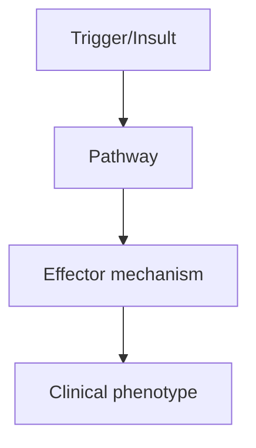
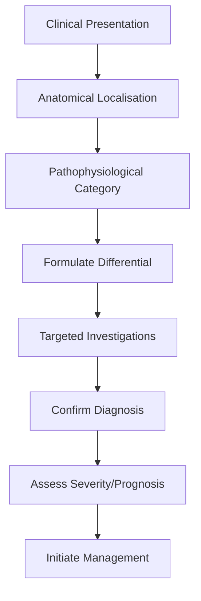
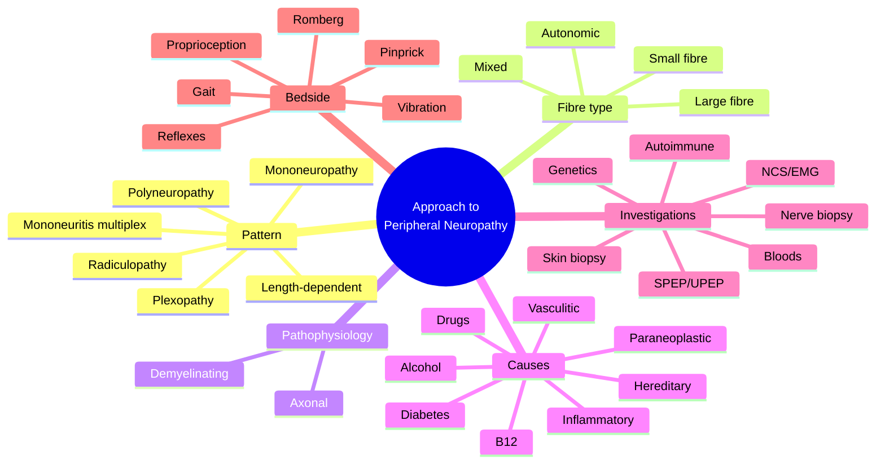

# Approach to Peripheral Neuropathy

> [!tip] **High-Yield Definition**
> Peripheral neuropathy: disease of peripheral nerves (motor, sensory, autonomic). Classification: (1) Anatomical (mononeuropathy, mononeuritis multiplex, polyneuropathy, polyradiculopathy), (2) Pathophysiology (axonal vs demyelinating), (3) Aetiology (genetic, metabolic, toxic, inflammatory, immune, infectious, neoplastic, traumatic).

---

## 1. Definition / Epidemiology / Classification

### Definition
Peripheral neuropathy: disease of peripheral nerves (motor, sensory, autonomic). Classification: (1) Anatomical (mononeuropathy, mononeuritis multiplex, polyneuropathy, polyradiculopathy), (2) Pathophysiology (axonal vs demyelinating), (3) Aetiology (genetic, metabolic, toxic, inflammatory, immune, infectious, neoplastic, traumatic).

### Epidemiology
Common. Diabetic neuropathy: 30-50% of diabetics. CIDP: 1-2/100,000. GBS: 1-2/100,000/year. CMT: 1/2,500. Overall: 2-7% prevalence in general population, 10-20% in elderly.

### Classification
| Variant | Key Features | Prognosis |
|---------|-------------|-----------|
| | | |

---

## 2. Aetiology / Pathophysiology

### Aetiology
Axonal (most common): metabolic (diabetes, B12, hypothyroidism, renal, hepatic), toxic (alcohol, chemotherapy - vincristine, cisplatin, taxanes, bortezomib, isoniazid, metronidazole, nitrofurantoin, vincristine), inflammatory (CIDP variants, vasculitis), infections (HIV, leprosy, Lyme, syphilis, hepatitis C), paraneoplastic, amyloid, hereditary (CMT2, HSAN, Fabry, TTR). Demyelinating: immune (GBS, CIDP, MMN, anti-MAG), hereditary (CMT1, CMTX, CMT4, HNPP, metachromatic leukodystrophy, Refsum), drugs (amiodarone, chloroquine, perhexiline), toxins (heavy metals). Small fibre: diabetes, Fabry, TTR, Sjogren's, paraneoplastic, idiopathic, B6, chemotherapy, sodium channel mutations (SCN9A, SCN10A, SCN11A).

### Pathophysiology

---

## 3. Clinical Features

### History
- **Onset/Duration:**
- **Progression:**
- **Key symptoms:**
- **Triggers:**
- **Systemic symptoms:**
- **Drug/Family/Social history:**

### Examination
| Domain | Key Findings | Localisation Value |
|--------|-------------|-------------------|
| | | |

### Specific Clinical Features
History: onset (acute, subacute, chronic), progression (static, progressive, relapsing), distribution (distal symmetric, asymmetric, multifocal, length-dependent), symptoms (motor, sensory, autonomic, pain), associated (systemic, family, drugs, alcohol, DM, infections, autoimmune, malignancy), functional impact. Examination: motor (weakness, wasting, fasciculations, tone, reflexes), sensory (all modalities, distribution - stocking-glove, length-dependent, dermatome, nerve territory), autonomic (orthostatic, sweating, GI, bladder, sexual), coordination, gait, trophic changes (ulcers, Charcot joints, skin changes). Pattern: symmetric distal (most polyneuropathies), asymmetric (mononeuropathy, MMN, vasculitis), sensory predominant (diabetic, idiopathic), motor predominant (GBS, CIDP, MND), autonomic (diabetic, amyloid, AAG).

---

## 4. Diagnostic Approach / Algorithm

---

## 5. Investigations

Bloods: FBC, U&Es, LFTs, glucose, HbA1c, B12, folate, TSH, ESR, CRP, ANA, ANCA, anti-ENA, RF, anti-CCP, anti-GM1, anti-MAG, anti-GQ1b, anti-AQP4, anti-MOG, immunoglobulins, SPEP, IFE, serum free light chains, ACE, cryoglobulins, syphilis, Lyme, HIV, hepatitis B/C, B6, copper, ANA. Urine: Bence Jones (kappa, lambda). NCS/EMG: axonal (reduced CMAP/sensory, normal NCV), demyelinating (slow NCV <38 m/s, prolonged distal latency, conduction block, temporal dispersion). CSF: protein (CIDP, GBS, diabetic), cells (inflammatory, infection), OCBs (CIDP, MS). Imaging: MRI plexus/root, ultrasound. Nerve biopsy: sural (sensory), superficial peroneal, radial (pure sensory), nerve + muscle (vasculitis). Genetic: CMT panel, PMP22, MFN2, GJB1, MPZ, TTR, GLA, SCN9A. Tumour screen: CT chest/abdomen/pelvis, mammogram, PSA, age-appropriate, paraneoplastic antibodies, PET-CT.

---

## 6. Differential Diagnosis

| Differential | Distinguishing Features | Key Test |
|--------------|------------------------|----------|
| | | |

---

## 7. Management

Treat underlying cause: diabetes (glycaemic control, B12, thyroid, alcohol cessation, remove offending drugs, plasmapheresis, IVIG, rituximab for immune-mediated). Symptomatic: pain (gabapentin, pregabalin, duloxetine, TCAs - amitriptyline, tramadol, capsaicin 8% patch, lidocaine 5% patch, opioid if severe), dysaesthesia, autonomic (orthostatic: fluids, salt, compression, midodrine, fludrocortisone; gastroparesis: prokinetics; bladder: intermittent self-catheterisation, anticholinergics; sweating: glycopyrrolate; erectile: PDE5 inhibitors). Supportive: physiotherapy, OT, walking aids, foot care (podiatry, orthotics, ulcer prevention, Charcot), falls prevention, exercise, support groups. Multidisciplinary: neurologist, endocrinologist, pain team, OT, PT, podiatrist, orthotist, dietitian, social, palliative. Vaccination: influenza, pneumococcal (especially if on immunosuppression).

---

## 8. Drug Interactions / Contraindications / Comorbidity Cautions

| Drug | Interaction / Caution | Management |
|------|----------------------|------------|
| | | |

---

## 9. Procedures (if applicable)

### Procedure:
- **Indications:**
- **Contraindications:**
- **Preparation / Principle:**
- **Complications:**
- **Viva Pearls:**

---

## 10. Complications

| Complication | Frequency | Prevention / Monitoring | Management |
|--------------|-----------|------------------------|------------|
| | | | |

---

## 11. Red Flags / Emergencies

Rapid progression (GBS, vasculitis, paraneoplastic), respiratory failure (GBS, severe CIDP), autonomic instability (GBS, AAG), pain crisis, sudden weakness (compressive, vasculitis), ulcers, Charcot joints, falls, fractures, sepsis (ulcers).

---

## 12. Prognosis

Depends on cause. CIDP: variable, often responds to IVIG/steroids. GBS: 80% complete recovery, 5-10% residual. Diabetic: progressive, complications. Inflammatory: treat underlying. Hereditary: progressive, slow. Toxins: stop drug, may improve. Lifetime monitoring for progression, complications, falls, ulcers.

---

## 13. Topic Correlation

| Related Topic | Link | Key Overlap |
|---------------|------|-------------|
| | | |

---

## 14. Special Situations

| Situation | Consideration |
|-----------|---------------|
| **Pregnancy** | |
| **Lactation** | |
| **Paediatric** | |
| **Elderly / Frail** | |
| **Renal impairment** | |
| **Hepatic impairment** | |
| **Immunocompromised** | |
| **Perioperative** | |
| **Driving / DVLA** | |
| **Occupational** | |

---

## FCPS/MRCP High-Yield Summary

| Category | Key Points |
|----------|------------|
| **Definition** | Peripheral neuropathy: disease of peripheral nerves (motor, sensory, autonomic). Classification: (1) Anatomical (mononeuropathy, mononeuritis multiplex, polyneuropathy, polyradiculopathy), (2) Pathoph |
| **Epidemiology** | Common. Diabetic neuropathy: 30-50% of diabetics. CIDP: 1-2/100,000. GBS: 1-2/100,000/year. CMT: 1/2,500. Overall: 2-7% prevalence in general populati |
| **Pathophysiology** | |
| **Clinical** | History: onset (acute, subacute, chronic), progression (static, progressive, relapsing), distribution (distal symmetric, asymmetric, multifocal, length-dependent), symptoms (motor, sensory, autonomic, |
| **Diagnosis** | |
| **Investigations** | Bloods: FBC, U&Es, LFTs, glucose, HbA1c, B12, folate, TSH, ESR, CRP, ANA, ANCA, anti-ENA, RF, anti-CCP, anti-GM1, anti-MAG, anti-GQ1b, anti-AQP4, anti-MOG, immunoglobulins, SPEP, IFE, serum free light |
| **Management** | Treat underlying cause: diabetes (glycaemic control, B12, thyroid, alcohol cessation, remove offending drugs, plasmapheresis, IVIG, rituximab for immune-mediated). Symptomatic: pain (gabapentin, prega |
| **Complications** | |
| **Prognosis** | Depends on cause. CIDP: variable, often responds to IVIG/steroids. GBS: 80% complete recovery, 5-10% residual. Diabetic: progressive, complications. Inflammatory: treat underlying. Hereditary: progres |
| **Viva Pearls** | |
| **Drug Doses** | |
| **Scoring Systems** | |
| **Genetics** | |
| **Imaging Signs** | |

---

## Viva Questions (PACES/FCPS Style)

1. **Q:** Define Approach to Peripheral Neuropathy and classify its variants.
   **A:** Based on the definition above.

2. **Q:** What are the key clinical features?
   **A:** History: onset (acute, subacute, chronic), progression (static, progressive, relapsing), distribution (distal symmetric, asymmetric, multifocal, length-dependent), symptoms (motor, sensory, autonomic, pain), associated (systemic, family, drugs, alcohol, DM, infections, autoimmune, malignancy), funct

3. **Q:** What is the first-line treatment?
   **A:** Based on the management section.

4. **Q:** What are the red flags requiring urgent referral?
   **A:** Rapid progression (GBS, vasculitis, paraneoplastic), respiratory failure (GBS, severe CIDP), autonomic instability (GBS, AAG), pain crisis, sudden weakness (compressive, vasculitis), ulcers, Charcot joints, falls, fractures, sepsis (ulcers).

5. **Q:** What is the prognosis?
   **A:** Depends on cause. CIDP: variable, often responds to IVIG/steroids. GBS: 80% complete recovery, 5-10% residual. Diabetic: progressive, complications. Inflammatory: treat underlying. Hereditary: progressive, slow. Toxins: stop drug, may improve. Lifetime monitoring for progression, complications, fall

6. **Q:** How do you differentiate Approach to Peripheral Neuropathy from key differentials?
   **A:** Clinical features, investigations, and response to treatment.

7. **Q:** What investigations are most useful?
   **A:** Based on the investigations section.

8. **Q:** Describe the stepwise management approach.
   **A:** Based on the management algorithm.

9. **Q:** What are the emergency presentations?
   **A:** Based on the red flags section.

10. **Q:** How does management change in pregnancy/paediatrics/elderly?
    **A:** Special considerations per population.

---

## Common Confusions / Exam Traps

| Confusion | Clarification |
|-----------|---------------|
| | |

---

## Mnemonics

1. **DAM-MMM** — Classifying peripheral neuropathy:
   - **D**emyelinating vs **A**xonal (first key branch on NCS)
   - **M**ixed (sensorimotor, small + large fibre)
   - **M**ononeuropathy (single nerve), **M**ononeuritis multiplex (multiple separate nerves), **M**ononeuropathy multiplex
   - **P**olyneuropathy (diffuse, symmetric, length-dependent)
   - **S**mall-fibre (pain, autonomic, normal NCS, abnormal skin biopsy)
   - **L**arge-fibre (proprioception, vibration, weakness, abnormal NCS)

2. **GLOVES-AND-STOCKINGS** — Classic length-dependent pattern:
   - **G**radual distal-to-proximal progression
   - **L**ongest nerves affected first (small-fibre burning feet → large-fibre numbness → hand involvement when leg reaches mid-calf)
   - **O**ften diabetic, alcoholic, B12, idiopathic
   - **V**ibration and pinprick reduced distally in symmetric pattern
   - **E**MG/NCS most useful in large-fibre
   - **S**kin biopsy for small-fibre diagnosis
   - (Confusing but high-yield for clinical pattern recognition)

3. **AIDP-CIDP-FOUR** — Inflammatory neuropathies by tempo:
   - **A**cute (<4 weeks): GBS
   - **S**ubacute (4–8 weeks): subacute inflammatory demyelinating polyneuropathy
   - **C**hronic progressive (>8 weeks): CIDP
   - **M**onophasic / relapsing: CIDP, MMN
   - **A**typical: MADSAM (Lewis-Sumner), DADS, sensory CIDP, motor CIDP
   - **T**reatable: IVIG, steroids, plasma exchange

---

## Mind Map

---

## Spaced Repetition Trackers

| Topic | Day 1 | Day 3 | Day 7 | Day 14 | Day 30 | Day 90 |
|-------|-------|-------|-------|--------|--------|--------|
| Differentiate axonal vs demyelinating on NCS | ☐ | ☐ | ☐ | ☐ | ☐ | ☐ |
| Length-dependent "stocking-glove" pattern | ☐ | ☐ | ☐ | ☐ | ☐ | ☐ |
| Mononeuritis multiplex pattern (vasculitis, DM, sarcoid) | ☐ | ☐ | ☐ | ☐ | ☐ | ☐ |
| Causes of small-fibre neuropathy (normal NCS) | ☐ | ☐ | ☐ | ☐ | ☐ | ☐ |
| Bedside sensory exam (vibration, pinprick, proprioception) | ☐ | ☐ | ☐ | ☐ | ☐ | ☐ |
| Routine blood workup (glucose, B12, TFT, SPEP, ANA, ESR, HIV) | ☐ | ☐ | ☐ | ☐ | ☐ | ☐ |
| Indications for nerve biopsy | ☐ | ☐ | ☐ | ☐ | ☐ | ☐ |
| Indications for skin biopsy (small-fibre) | ☐ | ☐ | ☐ | ☐ | ☐ | ☐ |
| Hereditary neuropathy (CMT) clues (pes cavus, hammer toes, family history) | ☐ | ☐ | ☐ | ☐ | ☐ | ☐ |
| Red flags — urgent referral (asymmetry, rapid progression, respiratory, autonomic) | ☐ | ☐ | ☐ | ☐ | ☐ | ☐ |

---

## Self-Test Scorecard

| Section | Score (/5) |
|---------|-----------|
| 1. Can describe the difference between axonal and demyelinating neuropathies (NCS) | /5 |
| 2. Can describe the length-dependent "stocking-glove" pattern | /5 |
| 3. Can distinguish mononeuropathy, mononeuritis multiplex, polyneuropathy | /5 |
| 4. Can list the bedside exam components (sensation, power, reflexes, gait) | /5 |
| 5. Can name the routine blood workup (glucose, HbA1c, B12, folate, TFT, SPEP, ANA, ESR, HIV, B6) | /5 |
| 6. Can list the indications for NCS/EMG | /5 |
| 7. Can list the indications for skin biopsy (suspected small-fibre neuropathy) | /5 |
| 8. Can list the indications for nerve biopsy (vasculitis, amyloid, sarcoid) | /5 |
| 9. Can recognise CMT features and refer for genetic testing | /5 |
| 10. Can identify red flags requiring urgent investigation | /5 |
| **TOTAL** | **/50** |

---

## MCQs (10)

1. **Question:** A 60-year-old man presents with 2 years of progressive numbness and burning in both feet, with preserved hand function. Examination shows reduced pinprick and vibration to the mid-calves, absent ankle reflexes, and normal reflexes elsewhere. What is the most likely pattern?
   **Options:** A. Length-dependent axonal polyneuropathy B. Acute inflammatory demyelinating polyradiculoneuropathy C. Mononeuritis multiplex D. Polyradiculopathy
   **Answer:** A
   **Explanation:** The combination of distal, symmetric, "stocking" sensory loss with absent ankle reflexes, slow progression over years, and preserved proximal reflexes is the classic length-dependent axonal polyneuropathy pattern, most commonly diabetic, alcoholic, B12-deficiency, or idiopathic. GBS is acute and motor-predominant. Mononeuritis multiplex produces asymmetric, multifocal deficits.

2. **Question:** Which nerve conduction study finding is most consistent with a demyelinating polyneuropathy rather than axonal?
   **Options:** A. Reduced CMAP and SNAP amplitudes with preserved velocity B. Prolonged distal motor latencies, slowed conduction velocity, and prolonged F-waves C. Normal sensory studies with fibrillations on EMG D. Absent H-reflex only
   **Answer:** B
   **Explanation:** Demyelinating neuropathies (e.g., CIDP, AIDP) show prolonged distal motor latencies, slowed conduction velocity, prolonged or absent F-waves, and conduction block / temporal dispersion. Axonal neuropathies show reduced CMAP/SNAP amplitudes with relatively preserved conduction velocity. An absent H-reflex alone is a non-specific finding, often present in S1 radiculopathy and distal polyneuropathy.

3. **Question:** A 55-year-old woman with burning feet, normal reflexes, normal NCS, and a normal clinical examination apart from pinprick hyperaesthesia. What is the most useful next investigation?
   **Options:** A. MRI lumbosacral spine B. Sural nerve biopsy C. Skin biopsy with PGP9.5 immunostaining for intra-epidermal nerve fibre density D. Whole-body PET-CT
   **Answer:** C
   **Explanation:** Pure small-fibre neuropathy presents with burning pain, normal reflexes, and normal NCS (because NCS only evaluates large myelinated fibres). The diagnostic test is a 3-mm skin punch biopsy from the distal leg (10 cm above the lateral malleolus) and the proximal thigh, with immunostaining for PGP9.5 to quantify the intra-epidermal nerve fibre density (IENFD). Reduced IENFD confirms the diagnosis. MRI spine, sural nerve biopsy, and PET-CT are not first-line.

4. **Question:** A 35-year-old man presents with progressive foot drop, high-arched feet, and inverted champagne-bottle legs. His mother had similar feet and used callipers. What is the most likely diagnosis?
   **Options:** A. Diabetic amyotrophy B. Charcot-Marie-Tooth disease (hereditary motor and sensory neuropathy) C. CIDP D. Lead poisoning
   **Answer:** B
   **Explanation:** Charcot-Marie-Tooth (CMT) disease is the most common inherited peripheral neuropathy, typically presenting in the first two decades with distal weakness, foot drop, pes cavus, hammer toes, "stork leg" or inverted-champagne-bottle deformity, and often reduced vibration sense. Family history (autosomal dominant most commonly) is a key clue. Diabetic amyotrophy is painful proximal weakness in older diabetics. CIDP is motor-predominant and progressive without skeletal deformities.

5. **Question:** Which of the following is most suggestive of mononeuritis multiplex?
   **Options:** A. Symmetric distal sensory loss in stocking distribution B. Asymmetric, multifocal motor and sensory deficits in the territory of 2 or more separate named nerves C. Isolated median nerve sensory symptoms in the hand D. Bilateral facial palsy with normal limbs
   **Answer:** B
   **Explanation:** Mononeuritis multiplex refers to simultaneous or sequential damage to 2 or more separate, non-contiguous named peripheral nerves, producing asymmetric, multifocal deficits. Common causes are systemic vasculitis (PAN, ANCA-associated, cryoglobulinemia), sarcoidosis, multifocal motor neuropathy, and diabetes. Stocking-glove pattern is polyneuropathy. Isolated median nerve is a mononeuropathy (e.g., carpal tunnel). Bilateral facial palsy is cranial.

6. **Question:** Which of the following tests is the most sensitive screening investigation for AL amyloidosis in a patient with peripheral neuropathy?
   **Options:** A. Serum protein electrophoresis alone B. Serum free light chain assay + serum and urine immunofixation C. Nerve biopsy D. Abdominal fat-pad aspiration only
   **Answer:** B
   **Explanation:** The combination of serum free light chain (sFLC) assay, serum immunofixation (SIFE), and urine immunofixation (UIFE) has the highest sensitivity (>95%) for detecting monoclonal light chains in AL amyloidosis. SPEP alone misses ~30% of cases. Nerve biopsy is invasive and not first-line. Fat-pad aspirate is positive in only 50–70% of AL cases and is not a screening test.

7. **Question:** A 45-year-old presents with progressive asymmetric foot drop, painful sensory loss, and palpable purpura on the legs. ESR is 80, ANA 1:160, p-ANCA positive. What is the most likely diagnosis?
   **Options:** A. Diabetic amyotrophy B. Vasculitic neuropathy (mononeuritis multiplex) C. CIDP D. Sarcoid neuropathy
   **Answer:** B
   **Explanation:** The triad of painful, asymmetric multifocal neuropathy (mononeuritis multiplex), palpable purpura, and ANCA positivity strongly suggests a systemic vasculitis (microscopic polyangiitis, PAN, or granulomatosis with polyangiitis) causing vasculitic neuropathy. Nerve biopsy (sural or superficial peroneal) will confirm the diagnosis and should be sought before committing to long-term immunosuppression. Diabetic amyotrophy is proximal and unilateral. CIDP is symmetric and painless. Sarcoid neuropathy is usually cranial or small-fibre.

8. **Question:** Which of the following features would be a "red flag" suggesting a non-length-dependent, atypical neuropathy requiring urgent investigation?
   **Options:** A. Symmetric distal burning feet in a 65-year-old diabetic B. Rapidly progressive weakness over 4 weeks with respiratory involvement C. Chronic, slowly progressive distal numbness over 5 years D. Asymptomatic absent ankle reflexes
   **Answer:** B
   **Explanation:** Red flags for an atypical neuropathy include: rapid progression (especially over weeks), respiratory or bulbar involvement, marked asymmetry, painful progression, weight loss, fever, palpable purpura, lymphadenopathy, organomegaly, new-onset diabetes or renal impairment, and lack of ankle reflexes only without other findings. Rapid progression with respiratory involvement suggests GBS or vasculitis. Length-dependent diabetic or idiopathic patterns without red flags do not require urgent investigation.

9. **Question:** A patient with a 10-year history of type 2 diabetes has a normal bedside examination. Quantitative sensory testing shows a raised warm threshold in the feet, and skin biopsy shows reduced intra-epidermal nerve fibre density. What is the most likely diagnosis?
   **Options:** A. Diabetic small-fibre neuropathy B. Diabetic autonomic neuropathy C. B12 deficiency D. Idiopathic small-fibre neuropathy
   **Answer:** A
   **Explanation:** In long-standing diabetes, small-fibre neuropathy often precedes large-fibre involvement. The patient has no clinical signs of large-fibre damage (normal bedside exam) but has abnormal thermal thresholds on QST and reduced IENFD on skin biopsy — diagnostic of small-fibre neuropathy, most likely diabetic in this context. Autonomic neuropathy would require autonomic testing (heart rate variability, tilt table). B12 deficiency would usually show large-fibre signs and macrocytosis. Idiopathic SFN is a diagnosis of exclusion.

10. **Question:** A 60-year-old with progressive distal sensory neuropathy is found on serum immunofixation to have an IgM paraprotein. What is the most appropriate next step?
    **Options:** A. Nerve biopsy B. Anti-MAG antibody testing and consideration of bone-marrow biopsy C. CT chest, abdomen, pelvis for malignancy D. Start IVIG immediately
    **Answer:** B
    **Explanation:** An IgM paraprotein with a predominantly sensory, slowly progressive, distal neuropathy is suspicious for an IgM paraproteinaemic neuropathy (anti-MAG disease, CANOMAD, or CIDP). Anti-MAG antibody testing is the first investigation; if positive, treatment is often deferred in mild cases. A bone-marrow biopsy is needed to look for Waldenström macroglobulinaemia or lymphoma. Whole-body CT is for IgG/IgA paraproteins to look for myeloma or solid tumours. IVIG is not first-line for anti-MAG disease (poor response).

---

## SBA Questions (10)

1. **Scenario:** A 58-year-old man presents with 6 months of progressive, symmetric distal burning pain in both feet. He has a history of hypertension and takes amlodipine. He drinks 20 units of alcohol weekly. Examination shows reduced pinprick to the ankles, normal vibration and proprioception, and normal reflexes. NCS is normal.
   **Question:** What is the most appropriate first-line investigation?
   **Options:** A. MRI lumbar spine B. Skin biopsy for IENFD C. Sural nerve biopsy D. Genetic panel for CMT
   **Answer:** B
   **Explanation:** The pattern (burning pain, normal reflexes and NCS, no motor signs) is small-fibre neuropathy. The most useful diagnostic test is skin biopsy with IENFD quantification. While treatable causes (diabetes, B12, alcohol) should be sought with bloods, the diagnostic test to confirm small-fibre damage is the skin biopsy. MRI spine is for radiculopathy, sural nerve biopsy is invasive and not first-line, and CMT is unlikely without skeletal features and family history.

2. **Scenario:** A 72-year-old man presents with a 5-year history of slowly progressive numbness in his feet and hands, with preserved balance. Examination shows distal loss to the mid-shin, normal reflexes at the knees, absent ankle reflexes, and normal gait. He has type 2 diabetes well controlled on metformin.
   **Question:** What is the most likely diagnosis?
   **Options:** A. Diabetic distal symmetric polyneuropathy B. CIDP C. Paraneoplastic neuropathy D. B12 deficiency
   **Answer:** A
   **Explanation:** The slow, symmetric, length-dependent, predominantly sensory pattern in a patient with long-standing diabetes is classic diabetic distal symmetric polyneuropathy. CIDP is more rapidly progressive (over months) and motor-predominant. Paraneoplastic neuropathy is usually subacute, painful, and often sensory ataxic. B12 deficiency would have dorsal column signs (positive Romberg, proprioceptive loss) and macrocytosis.

3. **Scenario:** A 40-year-old woman presents with acute onset bilateral facial weakness, mild distal paraesthesiae, and areflexia. She had a diarrhoeal illness 2 weeks ago. NCS shows prolonged F-waves and slowed conduction velocity.
   **Question:** What is the most likely diagnosis?
   **Options:** A. Lyme disease B. Guillain-Barré syndrome (GBS) — AIDP variant C. Myasthenia gravis D. Sarcoid neuropathy
   **Answer:** B
   **Explanation:** Acute bilateral facial weakness (a form of bifacial weakness with paraesthesiae — BFP variant of GBS), areflexia, and a recent diarrhoeal illness with demyelinating NCS are highly suggestive of GBS-AIDP. The BFP variant is one of the regional GBS variants. Lyme is a possibility but usually in endemic areas and associated with erythema migrans; CSF would show pleocytosis. Myasthenia has fluctuating weakness and normal reflexes/NCS. Sarcoid is usually cranial but with uveitis and hilar nodes.

4. **Scenario:** A 65-year-old man has a 3-month history of progressive distal weakness, sensory loss, and areflexia. NCS shows a demyelinating pattern (prolonged distal latencies, slowed conduction velocity, conduction block).
   **Question:** What is the most likely diagnosis and first-line treatment?
   **Options:** A. CIDP — IVIG 0.4 g/kg/day for 5 days B. GBS — IVIG 0.4 g/kg/day for 5 days C. CMT — physiotherapy and ankle-foot orthoses D. Vasculitic neuropathy — cyclophosphamide and steroids
   **Answer:** A
   **Explanation:** Progressive (>8 weeks), motor and sensory, areflexic, demyelinating polyneuropathy is the classic picture of CIDP. First-line treatments (IVIG, steroids, plasma exchange) are all equally effective; IVIG is commonly used first. GBS evolves in <4 weeks. CMT has skeletal features, family history, and very slow progression. Vasculitic neuropathy is painful, asymmetric, axonal, and usually associated with systemic features.

5. **Scenario:** A patient with chronic kidney disease on dialysis presents with burning feet and a progressive sensory neuropathy.
   **Question:** What is the most likely diagnosis and most appropriate management?
   **Options:** A. Uraemic neuropathy — optimise dialysis, consider renal transplantation; symptomatic relief with gabapentin/pregabalin B. Diabetic neuropathy — start metformin C. B12 deficiency — start hydroxocobalamin D. AL amyloidosis — start chemotherapy
   **Answer:** A
   **Explanation:** Uraemic neuropathy is a distal, symmetric, sensorimotor polyneuropathy that improves with adequate dialysis and may resolve after successful renal transplantation. Symptomatic treatment for neuropathic pain (gabapentin, pregabalin, duloxetine — adjusted for renal function) is appropriate. Metformin is contraindicated in advanced CKD. B12 deficiency is unlikely in this setting. AL amyloidosis would be associated with a paraprotein and multi-organ involvement.

6. **Scenario:** A 22-year-old woman of Pakistani origin, now living in the UK, presents with 6 months of progressive distal weakness, foot drop, and a positive family history of "Charcot-Marie-Tooth". Examination shows pes cavus, hammer toes, and distal wasting.
   **Question:** What is the most appropriate next step?
   **Options:** A. Nerve biopsy B. Genetic testing for PMP22 duplication (CMT1A) and MPZ, GJB1, MFN2 C. Start IVIG D. Lumbar puncture
   **Answer:** B
   **Explanation:** The clinical picture and family history are highly suggestive of CMT. The most common form is CMT1A, caused by PMP22 duplication on chromosome 17. First-line investigation is genetic testing (a panel including PMP22, MPZ, GJB1, MFN2). Nerve biopsy is rarely needed now that genetic testing is widely available. IVIG has no role. CSF is not useful.

7. **Scenario:** A 50-year-old presents with 3 months of painful, asymmetric foot drop, then wrist drop. ESR is 70, ANA 1:320, p-ANCA positive, MPO antibodies positive. Sural nerve biopsy shows transmural inflammation of the epineurial vessels.
   **Question:** What is the diagnosis and appropriate treatment?
   **Options:** A. Vasculitic neuropathy (microscopic polyangiitis) — high-dose steroids + cyclophosphamide or rituximab B. CIDP — IVIG C. Diabetic radiculoplexus neuropathy (diabetic amyotrophy) — analgesia and physiotherapy D. Sarcoidosis — prednisolone
   **Answer:** A
   **Explanation:** Painful, asymmetric, multifocal neuropathy, raised ESR, p-ANCA/MPO positivity, and necrotising vasculitis on nerve biopsy establish the diagnosis of vasculitic neuropathy due to microscopic polyangiitis. Treatment is induction with high-dose corticosteroids + cyclophosphamide (or rituximab, increasingly used), followed by maintenance (azathioprine, methotrexate, rituximab). IVIG is for CIDP. Diabetic amyotrophy is unilateral and proximal.

8. **Scenario:** A patient with known HIV presents with rapidly progressive, painful, predominantly sensory polyneuropathy. CD4 count is 80.
   **Question:** What is the most likely cause?
   **Options:** A. HIV-related distal sensory polyneuropathy B. Cytomegalovirus polyradiculopathy C. CIDP D. Vitamin B12 deficiency
   **Answer:** A
   **Explanation:** HIV-associated distal sensory polyneuropathy is the most common neuromuscular complication of HIV, typically presenting with painful, distal, symmetric sensory symptoms in patients with low CD4 counts. It is caused by the virus itself and (historically) by older nucleoside reverse-transcriptase inhibitors (didanosine, stavudine). CMV polyradiculopathy presents with cauda equina syndrome (saddle anaesthesia, urinary retention, leg weakness) and is treated with ganciclovir. CIDP is demyelinating. B12 deficiency is unlikely.

9. **Scenario:** A 35-year-old man presents with a 6-month history of progressive, painless, asymmetric distal weakness with preserved sensation. Anti-GM1 antibodies are positive.
   **Question:** What is the most likely diagnosis and most appropriate treatment?
   **Options:** A. Multifocal motor neuropathy (MMN) — IVIG B. ALS — riluzole C. CIDP — IVIG D. Inclusion body myositis — methotrexate
   **Answer:** A
   **Explanation:** Pure motor, asymmetric, multifocal weakness with conduction block on NCS (often subtle) and anti-GM1 antibodies is classic for multifocal motor neuropathy. IVIG is the only proven treatment (steroids and plasma exchange may worsen). ALS has upper motor neurone signs, sensory sparing, and progression despite IVIG. CIDP has sensory involvement. IBM has slow progression, finger flexor and quadriceps weakness, and is a myopathy.

10. **Scenario:** A 60-year-old patient with a 5-year history of type 2 diabetes, autonomic neuropathy (orthostatic hypotension, gastroparesis), and chronic kidney disease stage 3 is reviewed in clinic. He asks what can be done to slow progression.
    **Question:** What is the most appropriate management to slow progression of his diabetic neuropathy?
    **Options:** A. Tight glycaemic control, aggressive risk-factor modification (BP, lipids, smoking), and foot care B. Long-term oral steroids C. High-dose vitamin B12 injections D. IVIG every 3 months
    **Answer:** A
    **Explanation:** Tight glycaemic control (DCCT/EDIC follow-up) reduces the risk of developing diabetic neuropathy and slows progression in type 1 diabetes; in type 2, the benefit is less dramatic but still supported. Aggressive management of hypertension, dyslipidaemia, smoking, and weight slows progression of microvascular complications. Foot care (regular inspection, well-fitting shoes, podiatry) prevents ulceration and amputation. Steroids, B12, and IVIG have no role.

---

## Tags

#neurology #peripheral-neuropathy #approach #clinical-methods #NCS #EMG #skin-biopsy #diabetic-neuropathy #CIDP #CMT #vasculitis #FCPS #MRCP

---

## Local Navigation
**Heading Hub:** [[../Hub]]  
**Chapter Hierarchy:** [[Davidson Chapter 25 - Neurology Hierarchy]]  
**Chapter MOC:** [[Neurology MOC]]  
**Drug Reference:** [[../00_Index/Neurology Drug Reference]]

## PasTest Scenario SBAs (Clinical Vignettes)

> **Auto-generated PasTest/Mediscope-style scenario SBAs** grounded in the authored source. Each scenario tests a real clinical fact (triad, specific sign, contraindication, trial, first-line Rx) extracted from the topic. *Source: Ch 27: Neurology & Stroke — Approach to Peripheral Neuropathy*

**Q1.** Which of the following features is most specific or characteristic of Approach to Peripheral Neuropathy?

  - **A.** emyelinating vs
  - **B.** A feature common to many acute inflammatory conditions
  - **C.** A non-specific sign that does not localise the diagnosis
  - **D.** An investigation finding rather than a clinical feature

  > **Answer: A** — emyelinating vs
  >
  > *Source:* **DAM-MMM** — Classifying peripheral neuropathy:
   - **D**emyelinating vs **A**xonal (first key branch on NCS)
   - **M**ixed (sensorimotor, small + large fibre)
   - **M**ononeuropathy (single nerve

