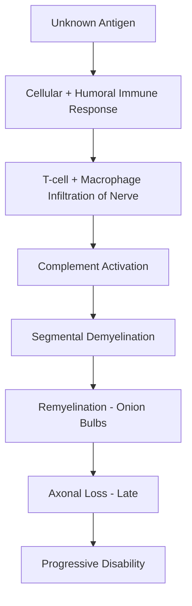
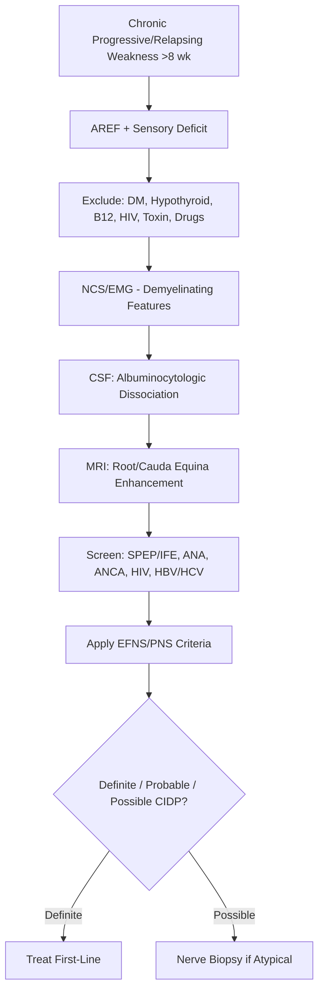
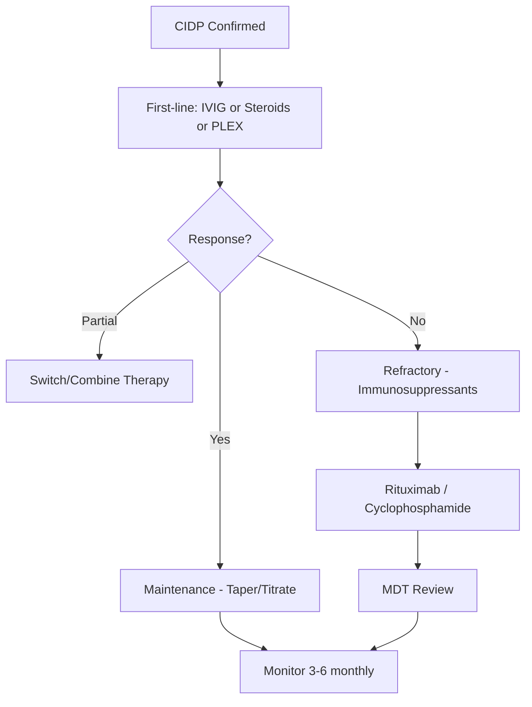

# Chronic Inflammatory Demyelinating Polyneuropathy (CIDP)

Related: [[Guillain-Barre Syndrome]], [[Approach to Peripheral Neuropathy]], [[Paraproteinaemic Neuropathy]]

> [!tip] **CIDP** is an acquired, immune-mediated demyelinating polyneuropathy with progressive or relapsing-remitting course over **>8 weeks**. **First-line: IVIG, corticosteroids, PLEX** (all equally effective). Distinguish from GBS by chronicity.

## Learning Objectives
- [ ] Define CIDP and distinguish from GBS
- [ ] Describe epidemiology and variants
- [ ] Explain pathophysiology (demyelination)
- [ ] Recognise clinical features (motor > sensory, AREF)
- [ ] Apply EFNS/PNS diagnostic criteria
- [ ] List investigations (NCS, CSF, MRI, nerve biopsy)
- [ ] Differentiate from mimics (MMN, GBS, CMT, paraneoplastic)
- [ ] Detail treatment (IVIG, steroids, PLEX) and maintenance
- [ ] Identify red flags, prognosis
- [ ] Recall high-yield facts (doses, criteria)

---

## 1. Definition / Epidemiology / Classification
**Definition:** Acquired immune-mediated sensorimotor polyneuropathy with **chronic progressive or relapsing-remitting course >8 weeks** (vs GBS <4 weeks), caused by segmental demyelination of peripheral nerves and roots.

**Epidemiology:**
- **Prevalence:** 1.0–8.9/100,000 (varies by diagnostic criteria)
- **Incidence:** 0.15–1.6/100,000/year
- **Age:** Any (bimodal: young adults, elderly); peak 50–60 yrs
- **Sex:** M > F (1.5:1)
- **Risk factors:** Diabetes (controversial — likely association), preceding infection (rare), monoclonal gammopathy (variant)

**Classification (EFNS/PNS 2021):**
| Type | Subtype | Key Features |
|------|---------|--------------|
| **Typical CIDP** | Chronic progressive; relapsing-remitting | Symmetric proximal + distal weakness, sensory loss, AREF |
| **Atypical CIDP** | **DADS** (Distal Acquired Demyelinating Symmetric) | Distal weakness, sensory; often IgM paraprotein |
| | **MADSAM** (Multifocal Acquired Demyelinating Sensory And Motor) / Lewis-Sumner | Asymmetric, multifocal; mimics MMN but with sensory involvement |
| | **Pure sensory CIDP** | Sensory only; chronic |
| | **Pure motor CIDP** | Motor only; resembles MMN |
| | **Focal CIDP** | Single limb |
| | **CIDP with CNS demyelination** | Combined central + peripheral |

---

## 2. Aetiology / Pathophysiology
**Aetiology:**
- **Autoimmune:** Most cases; triggered by unknown antigen
- **Post-infectious:** Uncommonly follows viral/bacterial infection
- **Associated:** DM, IgG/IgA MGUS, HIV (especially seroconversion), SLE, IBD, thyroid disease
- **No identifiable trigger in majority**

**Pathophysiology:**

**Molecular Basis:**
- Autoantibodies target: **PMP22**, **P0/MPZ**, **neurofascin-155 (NF155)**, **contactin-1 (CNTN1)**, **CASPR1**
- NF155/CNTN1/CASPR1 antibodies → nodopathy/paranodopathy variant (poor response to IVIG, responds to rituximab)
- Macrophage-mediated demyelination; onion bulb formation from Schwann cell proliferation

---

## 3. Clinical Features

**History:**
- **Onset:** Insidious (weeks-months) or relapsing-remitting
- **Progression:** >8 weeks (vs GBS <4 weeks)
- **Symptoms:**
  - **Motor:** Symmetric proximal AND distal weakness (legs > arms initially); difficulty climbing stairs, rising from chair
  - **Sensory:** Distal numbness, paraesthesia (often mild relative to weakness)
  - **Pain:** 20-30% (radicular, deep aching)
  - **Autonomic:** Mild (vs GBS); sphincter usually spared
  - **Cranial:** VII palsy (rare), bulbar (rare)
- **Functional:** Difficulty with fine motor, walking aids needed

**Examination:**
| Domain | Findings | Localisation |
|--------|----------|--------------|
| **Motor** | Symmetric proximal + distal weakness; foot drop, hand weakness; **AREF or hyporeflexia globally** | Polyradiculoneuropathy |
| **Sensory** | Stocking-glove, all modalities; vibration + position often affected | Large + small fibre |
| **Coordination** | Sensory ataxia (proprioceptive loss) | Dorsal column involvement |
| **Cranial** | Mild facial weakness; rarely bulbar | Cranial nerve roots |
| **Autonomic** | Mild orthostasis | Autonomic fibres |

**Variants:**
- **DADS:** Distal symmetric, often IgM MGUS, anti-MAG antibodies (responds poorly to IVIG)
- **MADSAM (Lewis-Sumner):** Asymmetric, multifocal, sensory + motor
- **Pure sensory:** Sensory ataxia, areflexia; mimics ganglionopathy

---

## 4. Diagnostic Approach

### EFNS/PNS 2021 Criteria

**Definite CIDP** (must have ≥1 of):
1. **Motor NCS:** ≥2 nerves with one of:
   - Motor distal latency ↑ ≥50% above ULN
   - Motor CV ↓ ≥30% below LLN
   - F-wave latency ↑ ≥20% above ULN (or absent)
   - **Conduction block** (≥30% reduction in proximal vs distal CMAP amplitude, excluding entrapment sites)
   - **Abnormal temporal dispersion**
2. **Sensory NCS:** Abnormal in ≥2 nerves
3. **CSF:** Protein >0.45 g/L, WCC <10/μL
4. **MRI:** Gadolinium enhancement or hypertrophy of nerve roots, plexus, trunks

**Probable:** Motor NCS abnormalities in 1 nerve + ≥1 supportive (CSF, MRI, biopsy)

**Possible:** Typical clinical + CSF or MRI supportive

---

## 5. Investigations

| Investigation | Indication | Expected Finding |
|---------------|------------|------------------|
| NCS/EMG | All suspected | **Demyelinating features** (prolonged DML, slowed CV, conduction block, temporal dispersion, prolonged/absent F-waves); sural sparing pattern |
| CSF | All | **Albuminocytologic dissociation** (protein >0.45 g/L, WCC <10); 95% in typical CIDP |
| MRI brachial/lumbosacral plexus | Atypical cases | Hypertrophy, contrast enhancement of roots/plexus |
| Nerve biopsy (sural) | Atypical, treatment-resistant | Onion bulbs, endoneurial inflammation, demyelination/remyelination |
| SPEP/IFE | All | MGUS (IgG/IgA in 20-30%; IgM in DADS) |
| Autoantibodies (NF155, CNTN1, CASPR1) | Atypical, poor response | Positive in nodopathy variant |
| Anti-MAG | DADS variant | Often positive |
| HIV, HBV, HCV, Lyme | Risk factors | Co-infection |
| ANA, ANCA, ENA | Vasculitis mimic | Usually negative |
| B12, folate, TFTs, HbA1c | Exclude metabolic | Normal |

---

## 6. Differential Diagnosis

| Differential | Distinguishing Features |
|--------------|------------------------|
| **GBS** | Acute (<4 wk), antecedent infection, severe, autonomic |
| **POEMS** | Polyneuropathy, organomegaly, endocrinopathy, M-protein, skin; VEGF↑ |
| **Vasculitic neuropathy** | Asymmetric, painful, mononeuritis multiplex pattern |
| **MMN** | Pure motor, asymmetric, no sensory; anti-GM1 |
| **CMT** | Family history, pes cavus, hammer toes, very chronic |
| **Diabetic neuropathy** | Length-dependent, sensory predominant, autonomic |
| **Paraneoplastic** | Subacute, asymmetric, anti-Hu/CV2 |
| **Amyloid neuropathy** | Carpal tunnel, autonomic, systemic amyloidosis |
| **IgM MGUS (anti-MAG)** | DADS pattern, sensory ataxia, tremor |
| **HIV neuropathy** | Often distal symmetric, antiretroviral toxicity |
| **Toxic (alcohol, chemo)** | Exposure history |

---

## 7. Management

### First-Line Treatment (EFNS/PNS 2021 — equally effective)
| Agent | Dose | Regimen | Notes |
|-------|------|---------|-------|
| **IVIG** | 2 g/kg total | 0.4 g/kg/day × 5 days (or 1 g/kg × 2 days) | 1st line; rapid onset (days-weeks); preferred initial |
| **Corticosteroids** | Prednisolone 0.8–1 mg/kg/day | Daily or pulsed (1g IV methylpred × 3-5 days) | 1st line; oral maintenance; slower onset |
| **PLEX (Plasma Exchange)** | 5 sessions over 2 weeks | Exchange 1-1.5 plasma volumes | 1st line; reserved for severe or steroid/IVIG failures; short-term effect |

**Sequence:** Start with IVIG (rapid, fewer side effects) → if poor response, switch to steroids or add PLEX.

### Maintenance / Long-Term
- **IVIG maintenance:** 1 g/kg every 2-4 weeks (titrate to response)
- **Steroid-sparing:** Azathioprine, methotrexate, mycophenolate, ciclosporin
- **Refractory CIDP:** Rituximab (especially NF155/CNTN1/CASPR1+), cyclophosphamide, ciclosporin, haematopoietic stem cell transplant (rare)

### Symptomatic
- **Neuropathic pain:** Gabapentin, pregabalin, amitriptyline, duloxetine
- **Spasticity/cramps:** Baclofen, physio
- **Fatigue:** Graded exercise
- **Foot drop:** AFO
- **Bladder:** Monitor; rare

### Rehabilitation
- **Physiotherapy:** Strengthening, balance, gait re-education
- **Occupational therapy:** ADL aids, energy conservation
- **Psychology:** Coping with chronic disease
- **MDT:** Neurologist, nurse specialist, PT, OT, social worker

### Management Algorithm

### Special Situations
- **Pregnancy:** IVIG safe; steroids ok; PLEX if severe
- **Paediatric:** IVIG + steroids; less chronic
- **Elderly:** Lower steroid dose; infection risk
- **Renal:** IVIG caution (renal failure, thrombosis); hydrate

---

## 8. Drug Interactions
| Drug | Caution | Management |
|------|---------|------------|
| IVIG | Renal failure, thrombosis, aseptic meningitis, anaphylaxis (IgA def) | Hydrate; check IgA; slow infusion |
| Steroids | DM, osteoporosis, infection, mood | PPI, vit D, bisphosphonate, monitor glucose |
| Azathioprine | Bone marrow, hepatotoxic | FBC, LFT |
| Rituximab | Infusion reaction, PML, hepatitis B reactivation | Screen HBV; monitor |

---

## 9. Procedures
- **Lumbar puncture:** Routine; check opening pressure, protein, cells, oligoclonal bands
- **Nerve biopsy (sural):** Reserved for atypical cases; not routine
- **PLEX:** Central or peripheral line; anticoagulation
- **IVIG infusion:** Monitor vitals; slow initial rate

---

## 10. Complications
| Complication | Frequency | Management |
|--------------|-----------|------------|
| Foot drop, contractures | Common | AFO, physio, splints |
| Chronic pain | 30% | Neuropathic agents |
| Disability (wheelchair) | 10-30% | MDT, aids |
| Treatment-related (steroid) | Common | Prophylaxis |
| Thrombosis (IVIG) | Rare | Hydration, mobility |
| Respiratory failure | Rare | Monitor FVC; ICU if declining |

---

## 11. Red Flags
| Red Flag | Action |
|----------|--------|
| Rapid deterioration with respiratory failure | ICU; PLEX/IVIG urgent |
| Suspected vasculitis (pain, asymmetric) | Nerve biopsy, ANCA |
| Underlying malignancy | CT, anti-Hu |
| Treatment failure with IVIG | Consider nodopathy; check NF155/CNTN1 |
| HIV | Antiretroviral; modified treatment |

---

## 12. Prognosis
| Factor | Good | Poor |
|--------|------|------|
| Age | Young | Older |
| Onset | Acute-like | Insidious |
| Course | Relapsing-remitting | Progressive |
| NCS | Demyelinating only | Axonal loss |
| Antibodies | Negative | NF155/CNTN1 (nodo) |
| Comorbidities | None | DM, MGUS, HIV |

- **Outcome:** 50-60% have good response; 20-30% partial; 10-20% refractory
- **Mortality:** Low; mostly treatment complications, sepsis
- **Long-term:** Many require maintenance; some achieve drug-free remission after 2-5 years

---

## 13. Topic Correlation
| Related | Overlap |
|---------|---------|
| [[Guillain-Barre Syndrome]] | Spectrum; CIDP if >8 weeks |
| [[Approach to Peripheral Neuropathy]] | Pattern recognition |
| [[Paraproteinaemic Neuropathy]] | IgM/IgG MGUS; DADS |
| [[POEMS Syndrome]] | Mimic; check VEGF |

---

## 14. Special Situations
| Situation | Consideration |
|-----------|---------------|
| Pregnancy | IVIG + steroids; PLEX if severe |
| Paediatric | Similar to adults; better prognosis |
| Elderly | Lower steroids; careful IVIG hydration |
| HIV | CIDP at seroconversion; ART; avoid immunosuppression early |
| Diabetes | Possible association; cautious steroids |
| Renal | IVIG caution; hydration; PLEX alternative |

---

## FCPS/MRCP High-Yield Summary
| Category | Key Points |
|----------|------------|
| **Definition** | Acquired demyelinating polyneuropathy >8 wk |
| **Vs GBS** | >8 weeks; GBS <4 weeks |
| **Clinical** | Symmetric proximal+distal weakness, AREF, mild sensory |
| **NCS** | Slowed CV, prolonged DML/F, conduction block, temporal dispersion |
| **CSF** | Albuminocytologic dissociation (protein↑, cells normal) |
| **First-line** | IVIG, steroids, PLEX — equally effective |
| **IVIG dose** | 2 g/kg total (0.4 g/kg × 5 days) |
| **Steroid** | Pred 0.8-1 mg/kg/day |
| **Refractory** | Rituximab (esp. NF155+), cyclophosphamide |
| **Variants** | DADS, MADSAM, pure sensory/motor, focal |

---

## Viva Questions
1. **CIDP vs GBS?** CIDP >8 wk, chronic/relapsing, mild autonomic. GBS <4 wk, severe, autonomic dysfunction.
2. **EFNS/PNS criteria?** Demyelinating NCS in ≥2 nerves (prolonged DML, slowed CV, prolonged F, conduction block ≥30%, temporal dispersion) + CSF protein >0.45 g/L or MRI.
3. **First-line?** IVIG (2 g/kg), pred 0.8-1 mg/kg, PLEX — equally effective. Start with IVIG.
4. **Albuminocytologic dissociation?** ↑ CSF protein, normal WCC.
5. **Refractory CIDP?** Rituximab (esp. NF155/CNTN1+), cyclophosphamide, ciclosporin.
6. **DADS variant?** Distal, IgM MGUS, anti-MAG, poor IVIG response.
7. **Nodopathy antibodies?** NF155, CNTN1, CASPR1. Distal, severe, poor IVIG, good rituximab.
8. **Sural sparing?** Demyelinating spares distal sensory nerves early; vs axonal.
9. **Conduction block?** ≥30% reduction proximal vs distal CMAP amplitude.
10. **Nerve biopsy indication?** Atypical, treatment-resistant, suspected vasculitis/amyloid.

---

## Common Confusions
| Confusion | Clarification |
|-----------|---------------|
| CIDP vs GBS | Duration: CIDP >8 wk, GBS <4 wk |
| CIDP vs MMN | MMN: pure motor, asymmetric, no sensory, anti-GM1, IVIG responsive |
| Typical vs DADS | Typical: proximal+distal, IgG/IgA MGUS. DADS: distal, IgM, anti-MAG, poor response |
| Vasculitis vs CIDP | Vasculitis: painful, asymmetric, often acute, biopsy diagnostic |
| AIDP vs AMAN | Both GBS variants; AIDP demyelinating, AMAN axonal |

---

## Mnemonics
1. **CIDP Treatment Triad:** "**VIP**" — **V**IG, **I**mmunosuppressants (steroids), **P**LEX
2. **CIDP vs GBS:** "**8** weeks" — CIDP >8, GBS <4
3. **DADS:** **D**istal, **A**cquired, **D**emyelinating, **S**ymmetric — IgM MGUS, anti-MAG
4. **MADSAM:** **M**ultifocal, **A**cquired, **D**emyelinating, **S**ensory **A**nd **M**otor (Lewis-Sumner)
5. **CSF finding:** "**P**rotein **U**p, **C**ells **U**nchanged" = albuminocytologic dissociation

---

## One-Page Revision Card
| **Topic** | **CIDP** |
|-----------|-----------|
| **Definition** | Acquired demyelinating polyneuropathy >8 weeks |
| **Vs GBS** | >8 wk (GBS <4 wk) |
| **Clinical** | Symmetric proximal+distal weakness, AREF, mild sensory |
| **Dx Criteria** | EFNS/PNS: demyelinating NCS (≥2 nerves) + CSF protein ↑/MRI |
| **CSF** | Protein >0.45 g/L, WCC <10 (albuminocytologic dissociation) |
| **NCS** | Slowed CV, prolonged DML/F, conduction block ≥30% |
| **First-line** | IVIG 2 g/kg, pred 0.8-1 mg/kg, PLEX — all equal |
| **Refractory** | Rituximab, cyclophosphamide |
| **Variants** | DADS, MADSAM, pure sensory/motor, focal |
| **Red Flags** | Rapid progression, treatment failure, malignancy |
| **Prognosis** | 60% respond; 20% refractory |

---

## MCQs (10)

1. **Duration distinguishing CIDP from GBS:**
   A. 2 wk B. 4 wk C. 8 wk D. 12 wk
   **Answer:** C — CIDP >8 wk; GBS <4 wk; 4-8 wk is "subacute".
2. **CSF in CIDP shows:**
   A. ↑ protein, ↑ cells B. ↑ protein, normal cells C. Normal protein, normal cells D. ↓ protein
   **Answer:** B — Albuminocytologic dissociation.
3. **First-line treatments of CIDP include all EXCEPT:**
   A. IVIG B. Prednisolone C. PLEX D. Rituximab
   **Answer:** D — Rituximab is for refractory CIDP.
4. **DADS variant typically associated with:**
   A. IgG MGUS B. IgM MGUS + anti-MAG C. IgA MGUS D. IgE MGUS
   **Answer:** B — DADS: distal, IgM, anti-MAG, poor IVIG response.
5. **Conduction block defined as:**
   A. ≥20% reduction in proximal vs distal CMAP B. ≥30% reduction C. ≥50% reduction D. No reduction
   **Answer:** B — ≥30% reduction in CMAP amplitude (excluding entrapment sites).
6. **MADSAM (Lewis-Sumner) syndrome features:**
   A. Pure motor B. Asymmetric multifocal sensory+motor C. Symmetric distal sensory only D. Acute onset
   **Answer:** B — Multifocal acquired demyelinating sensory and motor.
7. **Nodopathy autoantibody associated with poor IVIG response but good rituximab response:**
   A. Anti-Hu B. Anti-GM1 C. Anti-NF155 D. Anti-MAG
   **Answer:** C — Anti-NF155 (paranodal); also CNTN1, CASPR1.
8. **CIDP typical NCS finding:**
   A. Reduced CMAP amplitude only B. Prolonged F-waves, slowed CV, conduction block C. Absent sensory responses D. Normal NCS
   **Answer:** B — Demyelinating features.
9. **IVIG dose for CIDP:**
   A. 0.4 g/kg × 5 days (total 2 g/kg) B. 1 g/kg × 1 day C. 5 g/kg × 1 day D. 0.1 g/kg × 10 days
   **Answer:** A — 0.4 g/kg/day × 5 days = 2 g/kg total.
10. **Sural sparing pattern suggests:**
    A. Axonal neuropathy B. Demyelinating (e.g., CIDP) C. Small fibre neuropathy D. Normal
    **Answer:** B — Sural sparing (preserved distal sensory) suggests demyelinating polyradiculoneuropathy.

---

## SBA Questions (10)

1. **50-year-old man with 3 months progressive leg weakness, difficulty climbing stairs, mild hand numbness. AREF globally. NCS shows prolonged DML, slowed CV, conduction block. CSF protein 1.2 g/L, cells 2. Diagnosis?**
   A. GBS B. CIDP C. MMN D. CMT
   **Answer:** B — >8 weeks, demyelinating NCS, AREF, albuminocytologic dissociation = CIDP.
2. **First-line treatment of choice in this patient?**
   A. IVIG 2 g/kg over 5 days B. Oral cyclophosphamide 6 months C. Rituximab D. Methotrexate
   **Answer:** A — First-line: IVIG (rapid onset, fewer side effects).
3. **3 months later, patient is stable on IVIG every 3 weeks. What's next?**
   A. Stop IVIG B. Taper and titrate to lowest effective dose C. Switch to steroids D. Add rituximab
   **Answer:** B — Maintenance: titrate IVIG to lowest effective dose.
4. **Patient relapses on IVIG maintenance and is now steroid-dependent. Next step?**
   A. Higher IVIG only B. Add immunosuppressant (azathioprine) C. Stop treatment D. Wait
   **Answer:** B — Steroid-sparing agent: azathioprine, methotrexate, mycophenolate.
5. **DADS variant: 65-year-old with distal sensory loss, gait ataxia, tremor, IgM MGUS. Anti-MAG positive. Best treatment?**
   A. IVIG + rituximab B. IVIG alone (often poor response) C. Steroids D. PLEX
   **Answer:** A — Anti-MAG DADS: IVIG + rituximab; consider other agents.
6. **Patient with CIDP on IVIG develops sudden headache, fever, neck stiffness 48h post-infusion. Diagnosis?**
   A. Aseptic meningitis (IVIG-related) B. Bacterial meningitis C. SAH D. Migraine
   **Answer:** A — Aseptic meningitis is an IVIG complication; self-limiting.
7. **Suspected CIDP with atypical features (asymmetric, painful, rapid). Best diagnostic step?**
   A. Repeat NCS B. Sural nerve biopsy C. MRI brain D. Trial of IVIG
   **Answer:** B — Biopsy to exclude vasculitis, amyloidosis.
8. **Patient with HIV seroconversion develops progressive weakness over 3 months, AREF, demyelinating NCS. Next step?**
   A. Avoid immunosuppression; start ART B. Start high-dose steroids C. IVIG D. PLEX
   **Answer:** A — HIV-associated CIDP at seroconversion: ART first; immunosuppressants later if needed.
9. **Anti-NF155 positive CIDP: best treatment?**
   A. IVIG B. Steroids C. Rituximab D. PLEX
   **Answer:** C — Anti-NF155 (nodopathy): poor IVIG response; rituximab effective.
10. **CIDP on long-term steroids — prophylaxis?**
    A. PPI, vitamin D, bisphosphonate, monitor glucose B. Antibiotics C. Anticoagulation D. None
    **Answer:** A — Steroid prophylaxis: bone protection, gastric protection, glucose monitoring.

---

## Flashcards
- **Q:** CIDP vs GBS duration?
  **A:** CIDP >8 wk; GBS <4 wk.
- **Q:** CSF in CIDP?
  **A:** ↑ protein, normal cells (albuminocytologic dissociation).
- **Q:** First-line CIDP treatment?
  **A:** IVIG, steroids, PLEX (all equal).
- **Q:** IVIG dose?
  **A:** 2 g/kg total (0.4 g/kg × 5 days).
- **Q:** Conduction block?
  **A:** ≥30% reduction proximal vs distal CMAP.
- **Q:** DADS variant?
  **A:** Distal, IgM MGUS, anti-MAG, poor IVIG response.
- **Q:** Nodopathy antibodies?
  **A:** NF155, CNTN1, CASPR1 (paranodal); respond to rituximab.
- **Q:** MADSAM?
  **A:** Multifocal acquired demyelinating sensory and motor (Lewis-Sumner).
- **Q:** Sural sparing?
  **A:** Preserved sural; suggests demyelinating (CIDP).
- **Q:** Refractory CIDP treatment?
  **A:** Rituximab, cyclophosphamide, azathioprine, MMF.

---

## Answer Key
### MCQs: 1-C, 2-B, 3-D, 4-B, 5-B, 6-B, 7-C, 8-B, 9-A, 10-B
### SBAs: 1-B, 2-A, 3-B, 4-B, 5-A, 6-A, 7-B, 8-A, 9-C, 10-A

**Local Navigation:** [[../00_Index/Peripheral Neuropathy Hub]] | [[Davidson Chapter 25 - Neurology Hierarchy]] | [[Neurology MOC]]
