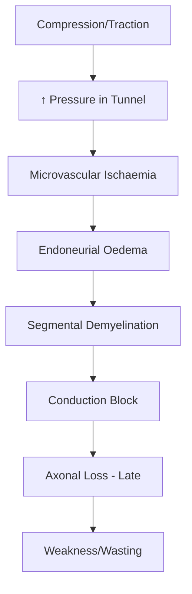
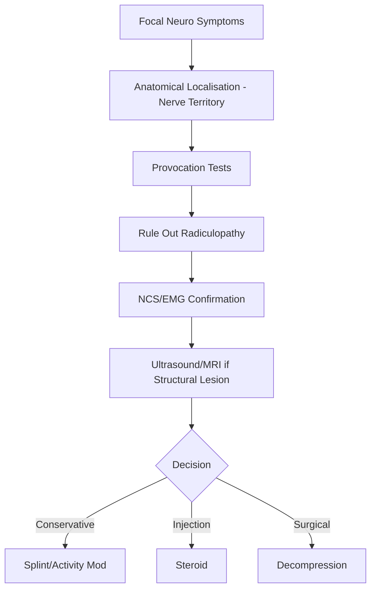
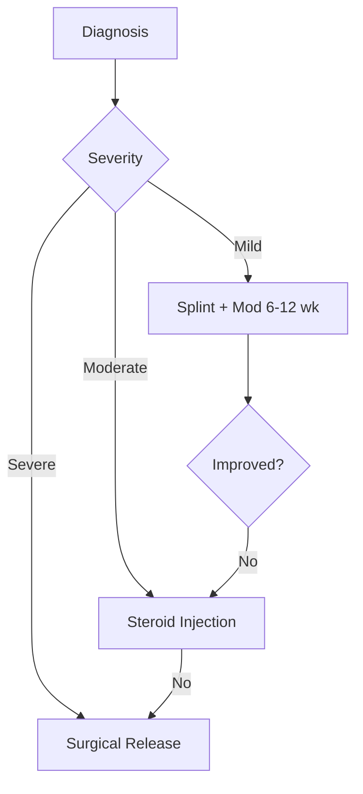

# Common Entrapment Neuropathies

Related: [[Approach to Peripheral Neuropathy]], [[Diabetic Neuropathy]], [[Hereditary Neuropathies]]

> [!tip] **Mononeuropathies** caused by mechanical compression at anatomically vulnerable sites. Most common cause of focal neuropathy. **NCS/EMG is gold standard** for diagnosis.

## Learning Objectives
- [ ] Define entrapment neuropathy and identify common sites
- [ ] Describe epidemiology and risk factors
- [ ] Explain pathophysiology of nerve compression
- [ ] Localise lesion anatomically
- [ ] List clinical features for CTS, ulnar at elbow, peroneal at fibular head, tarsal tunnel, meralgia paraesthetica
- [ ] Outline diagnostic approach (NCS/EMG, ultrasound, MRI)
- [ ] Differentiate from radiculopathy and polyneuropathy
- [ ] Detail management (conservative, injection, surgical)
- [ ] Identify complications and red flags
- [ ] Recall FCPS/MRCP high-yield facts

---

## 1. Definition / Epidemiology / Classification
**Definition:** Mononeuropathy from mechanical compression/traction of a peripheral nerve at an anatomically confined space (osteofibrous tunnel, fibrous arcade, bony prominence). May be acute (Saturday night palsy) or chronic (CTS).

**Epidemiology:**
- **CTS:** 50–150/100,000/yr (most common); F:M = 3:1; peak 40–60 yrs
- **UNE:** 20–25/100,000/yr; M>F (occupational)
- **Peroneal at fibular head:** 3rd most common entrapment
- **Risk factors:** Diabetes, hypothyroidism, pregnancy, obesity, RA, repetitive use, HNPP

**Classification:**
| Variant | Site | Nerve |
|---------|------|-------|
| Carpal tunnel syndrome (CTS) | Wrist (flexor retinaculum) | Median |
| Ulnar neuropathy at elbow (UNE) | Cubital tunnel/epicondyle | Ulnar |
| Ulnar at wrist (Guyon's) | Hypothenar | Ulnar |
| Peroneal at fibular head | Fibular head | Common peroneal |
| Tarsal tunnel syndrome | Ankle (flexor retinaculum) | Posterior tibial |
| Meralgia paraesthetica | Inguinal ligament | Lateral femoral cutaneous |
| Radial (Saturday night) | Spiral groove | Radial |

---

## 2. Aetiology / Pathophysiology
**Aetiology:**
- **Anatomical:** narrow tunnels, osteophytes, ganglia, lipomas, accessory muscles
- **Occupational:** repetitive motion, vibration, sustained pressure
- **Systemic:** DM, hypothyroidism, acromegaly, RA, pregnancy, ESRD, amyloidosis
- **Acute:** fracture, haematoma, tourniquet, malpositioning

**Pathophysiology:**

**Genetics:** **HNPP** = PMP22 deletion (17p11.2); recurrent pressure palsies. CMT1A = PMP22 duplication.

---

## 3. Clinical Features

**CTS:** Numbness/tingling in thumb, index, middle, radial half of ring (palmar). **Nocturnal symptoms**, flick sign (relief with shaking). Tinel's & Phalen's at wrist positive. Thenar wasting (APB) and weak thumb abduction/opposition in severe cases.

**UNE:** Numbness of 4th/5th digits (palmar AND dorsal — dorsal ulnar cutaneous branch affected at elbow). **Wartenberg's sign** (5th finger abduction due to weak adduction). **Froment's sign** (FPL compensation for weak adductor pollicis). Claw hand in chronic. Tinel's at elbow; **elbow flexion test** (symptoms <60s).

**Peroneal at fibular head:** Foot drop with **steppage gait**. Weak dorsiflexion + eversion; **inversion preserved** (tibial nerve). Sensory loss over dorsum of foot. Tinel's over fibular head.

**Tarsal tunnel:** Burning sole pain, worse with standing. Tinel's posterior to medial malleolus.

**Meralgia paraesthetica:** Burning/numbness of **anterolateral thigh** (LFCN distribution). **Pure sensory** — no motor deficit. Common in obesity, pregnancy, tight belts.

---

## 4. Diagnostic Approach

**CTS Diagnostic Criteria:** Clinical + NCS (median DML >4.5 ms; sensory latency across wrist; reduced CMAP/SNAP). **Padua grading:** 1 = very mild (segmental tests only); 2 = mild (sensory slow); 3 = moderate; 4 = severe (absent SNAP, low CMAP); 5 = very severe (absent SNAP + CMAP).

---

## 5. Investigations

| Investigation | Indication | Expected Finding |
|---------------|------------|------------------|
| NCS/EMG | Confirmation, localisation, severity | Conduction block at compression; axonal loss in severe cases |
| Ultrasound | Suspected structural lesion | Median CSA >10 mm² at wrist (CTS) |
| MRI | Mass, surgical planning | Ganglion, lipoma, synovitis |
| Glucose/HbA1c/TSH | Risk factor | DM, hypothyroidism |

---

## 6. Differential Diagnosis

| Differential | Distinguishing Features |
|--------------|------------------------|
| C6/C8 radiculopathy | Neck pain, radicular distribution, MRI spine |
| Polyneuropathy | Symmetric, stocking-glove, multiple nerves on NCS |
| HNPP | Recurrent, painless, multiple sites, FHx |
| Mononeuritis multiplex | Multifocal, asymmetric, systemic features (vasculitis) |
| TOS | Medial forearm/hand, postural, Roos/Adson |
| Central lesion | UMN signs, hemibody |

---

## 7. Management

| Intervention | Indication | Regimen |
|--------------|------------|---------|
| Neutral wrist splint (night) | Mild-moderate CTS | 6-12 weeks |
| Activity modification | All | Avoid provocative positions |
| Corticosteroid injection (methylpred 40 mg) | Moderate CTS, tarsal tunnel | Single, repeat if needed |
| Gabapentin/pregabalin | Neuropathic pain | 100-300 mg TDS / 75 mg BD |
| Amitriptyline | Neuropathic pain | 10-25 mg nocte |
| NSAIDs | Pain | Short course |
| Surgical decompression | Failed conservative; severe/wasting | Open/endoscopic release |

**Surgical Procedures:**
- **CTS:** Open or endoscopic carpal tunnel release (transverse incision, divide flexor retinaculum). Complications: scar tenderness, pillar pain, recurrence, palmar cutaneous branch injury.
- **UNE:** Anterior transposition (subcutaneous/submuscular) at elbow
- **Peroneal:** Decompression at fibular head
- **Tarsal tunnel:** Release flexor retinaculum

**Management Algorithm:**

---

## 8. Drug Interactions
| Drug | Caution | Management |
|------|---------|------------|
| Local steroids | Tendon rupture if intratendinous | Inject into tunnel |
| Gabapentin | Renal excretion | Adjust if eGFR <30 |
| Amitriptyline | QT prolongation | ECG in cardiac risk |
| NSAIDs | GI bleed, renal | PPI, avoid CKD |

---

## 9. Procedures
- **NCS/EMG:** Gold standard; comparative studies (e.g., ulnar 4th digit sensory median vs ulnar) increase sensitivity
- **Ultrasound-guided injection:** Improves accuracy in CTS/tarsal tunnel

---

## 10. Complications
| Complication | Frequency | Management |
|--------------|-----------|------------|
| Thenar wasting (CTS) | Untreated severe | Surgical (may not reverse) |
| Permanent sensory loss | Severe chronic | Symptomatic |
| Claw hand (UNE) | Chronic | Tendon transfer, physio |
| Recurrence post-surgery | 5-10% | Revision, treat underlying |

---

## 11. Red Flags / Emergencies
| Red Flag | Action |
|----------|--------|
| Sudden dense weakness, no clear cause | Exclude stroke, vasculitis |
| Rapidly progressive, multiple nerves | Urgent referral; vasculitis screen |
| Wasting in young patient | HNPP testing |
| Suspicion of malignancy | Imaging, biopsy |
| Systemic features (fever, weight loss) | Vasculitis/sarcoid workup |

---

## 12. Prognosis
| Factor | Good | Poor |
|--------|------|------|
| Duration | <6 months | >2 years |
| Severity | Mild | Severe with wasting |
| NCS | Demyelinating | Axonal loss |
| Systemic | No DM | DM, HNPP |

Acute palsies recover 6-12 weeks; chronic require 6-18 months post-decompression.

---

## 13. Topic Correlation
| Related | Overlap |
|---------|---------|
| [[Approach to Peripheral Neuropathy]] | Pattern recognition, NCS |
| [[Diabetic Neuropathy]] | ↑ risk of entrapment |
| [[Hereditary Neuropathies]] | HNPP mimics entrapment |
| [[Plexopathies]] | Differential of focal weakness |

---

## 14. Special Situations
| Situation | Consideration |
|-----------|---------------|
| Pregnancy | CTS common 3rd trimester; conservative, resolves postpartum |
| Diabetes | Higher risk; rule out diabetic radiculoplexus |
| Hypothyroidism | CTS association; check TSH |
| RA | Tenosynovitis; surgical management |
| ESRD | Amyloid, ischaemic monomelic; AVF consideration |
| HNPP | Recurrent; PMP22 deletion testing |
| Occupational | Ergonomic assessment, DVLA if driving affected |

---

## FCPS/MRCP High-Yield Summary
| Category | Key Points |
|----------|------------|
| **Most common** | CTS (median at wrist) |
| **Nocturnal symptoms + flick sign** | CTS |
| **Wartenberg/Froment signs** | Ulnar neuropathy |
| **Foot drop + preserved inversion** | Peroneal at fibular head |
| **Lateral thigh sensory loss** | Meralgia paraesthetica (LFCN) |
| **Recurrent pressure palsies + FH** | HNPP (PMP22 deletion) |
| **First-line mild CTS** | Splint + activity modification |
| **Severe CTS (wasting)** | Surgical release |
| **Gold standard test** | NCS/EMG |
| **Median thenar muscles** | LOAF (Lumbricals I/II, Opponens, APB, FPB) |

---

## Viva Questions
1. **Define entrapment neuropathy and list 5 common sites.** Mononeuropathy from compression at anatomically confined site. CTS, UNE, peroneal at fibular head, tarsal tunnel, meralgia paraesthetica.
2. **CTS vs C6 radiculopathy?** CTS: no neck pain, Tinel at wrist, flick sign, thenar weakness. C6: neck pain, biceps/brachioradialis weakness, MRI cervical spine.
3. **NCS findings in severe CTS?** Padua 4-5: absent SNAP, reduced/absent CMAP, prolonged DML >4.5 ms.
4. **HNPP features/genetics?** Recurrent painless pressure palsies; PMP22 deletion 17p11.2; AD inheritance.
5. **Peroneal vs L5 radiculopathy?** Peroneal: inversion preserved (tibialis posterior = tibial nerve). L5: inversion weak, other L5 muscles affected.
6. **Froment's sign?** IP flexion of thumb when gripping paper — adductor pollicis (ulnar) weakness compensated by FPL (median).
7. **Stepwise management of CTS?** Splint+mod → steroid injection → surgical release. Indications for surgery: failed conservative, severe/wasting.
8. **Red flags?** Rapid progression, multiple nerves, wasting in young, systemic features.
9. **Surgical indications in UNE?** Failed conservative (3-6 months), progressive weakness/wasting, severe NCS, persistent symptoms.
10. **Meralgia paraesthetica nerve?** Lateral femoral cutaneous nerve (L2-L3) at inguinal ligament. Pure sensory. Conservative first.

---

## Common Confusions
| Confusion | Clarification |
|-----------|---------------|
| CTS vs C6 radiculopathy | CTS: no neck pain, Tinel at wrist. C6: neck pain, biceps weakness, MRI |
| UNE at elbow vs wrist | Elbow: dorsal ulnar sensation lost. Guyon's: dorsal spared |
| Peroneal vs L5 | Peroneal: inversion preserved. L5: inversion weak |
| HNPP vs idiopathic CTS | HNPP: recurrent, painless, multiple sites, FHx |
| Meralgia vs L2/L3 | Meralgia: pure sensory, lateral thigh. Radiculopathy: groin pain, motor |

---

## Mnemonics
1. **CTS Median Sensory:** 1-3½ digits, NOT palm (palmar cutaneous branch arises proximal to retinaculum)
2. **LOAF** (Median thenar): Lateral 2 Lumbricals, Opponens, APB, FPB
3. **Peroneal vs Tibial:** "**P**eroneal = **P**ick foot up" (dorsiflex); "**T**ibial = **T**iptoe" (plantarflex)
4. **HNPP:** Recurrent, painless, pressure palsies
5. **Claw hand:** 4-5 digits (ulnar 1½), sparing 2-3 (median)

---

## One-Page Revision Card
| **Topic** | **Common Entrapment Neuropathies** |
|-----------|-----------------------------------|
| **Definition** | Mononeuropathy from compression at anatomically confined site |
| **Key Clinical** | CTS: nocturnal 1-3½, flick sign, thenar wasting. UNE: 4-5, Froment's |
| **Localisation** | CTS: median at wrist; UNE: ulnar at elbow; Peroneal: fibular head |
| **Dx Criteria** | NCS: prolonged DML across compression site; axonal loss = severe |
| **Differentials** | Radiculopathy, polyneuropathy, HNPP, mononeuritis multiplex |
| **Investigations** | NCS/EMG, ultrasound (CSA), MRI if structural |
| **Management** | 1. Splint+mod 2. Steroid injection 3. Surgical decompression |
| **Key Drugs** | Methylpred 40 mg; gabapentin 100-300 mg TDS |
| **Red Flags** | Rapid progression, multiple nerves, wasting in young |
| **Prognosis** | Demyelinating: good; axonal: poor |
| **Viva Pearls** | CTS 1-3½; UNE 4-5 + dorsal hand; HNPP = PMP22 del |
| **Mnemonics** | LOAF = median thenar; Peroneal pick foot up |

---

## MCQs (10)

1. **A 45-year-old woman has nocturnal tingling in thumb/index/middle, relieved by shaking. Tinel's at wrist, weak thumb abduction. Diagnosis?**
   A. UNE B. CTS C. C6 radiculopathy D. TOS
   **Answer:** B — Classic CTS: median distribution, nocturnal, flick sign, APB weakness.
2. **Which is NOT median-innervated in the hand?**
   A. APB B. Opponens pollicis C. 1st dorsal interosseous D. FPB (superficial head)
   **Answer:** C — 1st dorsal interosseous is ulnar. LOAF are median.
3. **Foot drop with preserved inversion indicates lesion at:**
   A. L5 root B. Common peroneal at fibular head C. Tibial D. Sciatic
   **Answer:** B — Peroneal palsy spares tibial (inversion via tibialis posterior).
4. **Froment's sign is positive in:**
   A. Median B. Ulnar C. Radial D. Musculocutaneous
   **Answer:** B — Tests adductor pollicis (ulnar); FPL compensation.
5. **HNPP genetic basis:**
   A. PMP22 duplication B. PMP22 deletion C. MPZ D. GJB1
   **Answer:** B — HNPP = PMP22 deletion (17p11.2). Duplication = CMT1A.
6. **Burning pain over anterolateral thigh, normal motor exam — diagnosis:**
   A. L2 radiculopathy B. L3 radiculopathy C. Meralgia paraesthetica D. Femoral neuropathy
   **Answer:** C — LFCN at inguinal ligament; pure sensory.
7. **NCS finding in severe CTS:**
   A. Prolonged sensory latency only B. Absent SNAP + reduced CMAP C. Slow ulnar across elbow D. Normal
   **Answer:** B — Padua 4-5 = axonal loss.
8. **Which is NOT typical of UNE?**
   A. Wartenberg's B. Froment's C. Claw hand D. Tinel's at wrist
   **Answer:** D — UNE: Tinel's at ELBOW, not wrist.
9. **First-line for mild CTS in pregnancy:**
   A. Surgery B. Steroid injection C. Wrist splinting at night D. Carbamazepine
   **Answer:** C — Conservative first; resolves postpartum.
10. **Recurrent painless wrist drop + foot drop with positive FH:**
    A. MMN B. CIDP C. HNPP D. Vasculitic
    **Answer:** C — Recurrent painless pressure palsies + FH = HNPP.

---

## SBA Questions (10)

1. **38-year-old typist, 3 months burning in 1-3 fingers, worse at night, dropping cups, Tinel's positive, weak thumb abduction. Next step?**
   A. Immediate surgery B. Splint + activity modification 6-12 weeks C. Oral steroids 2 weeks D. MRI cervical spine
   **Answer:** B — First-line mild-moderate CTS: splint + mod.
2. **55-year-old woman, progressive 4-5 finger numbness, clumsiness, Tinel's at elbow, 1st DI wasting. Site?**
   A. Guyon's B. Cubital tunnel C. TOS D. C8 root
   **Answer:** B — Cubital tunnel UNE; dorsal ulnar sensation affected.
3. **65-year-old diabetic, acute foot drop after bedrest, weak DF+eversion, normal inversion, no back pain. Diagnosis + test?**
   A. L5 radiculopathy; MRI B. Peroneal at fibular head; NCS/EMG C. Tibial; NCS D. Central; MRI brain
   **Answer:** B — Peroneal palsy at fibular head.
4. **30-year-old, 3rd trimester, bilateral hand numbness worse at night, relieved by shaking. Initial management?**
   A. CTR B. Wrist splints; reassure postpartum resolution C. NSAIDs 4 weeks D. TSH only
   **Answer:** B — Pregnancy CTS: splint + reassure; resolves postpartum.
5. **45-year-old, recurrent wrist drop + foot drop after minor pressure, mother similar. Genetic abnormality?**
   A. PMP22 dup 17 B. PMP22 del 17 C. MPZ D. GJB1
   **Answer:** B — HNPP: PMP22 deletion.
6. **50-year-old carpenter, 6 months progressive hand weakness, 4-5 numbness, NCS shows ulnar conduction block across elbow. Next step?**
   A. Long-term oral steroids B. Anterior transposition ulnar at elbow C. MRI cervical D. Observation
   **Answer:** B — Progressive UNE with wasting: surgical transposition.
7. **40-year-old obese (BMI 35), 6 months burning lateral thigh, reduced sensation 10x15 cm patch, normal motor. Management?**
   A. Lumbar MRI B. NSAIDs + weight loss; reassure C. Femoral decompression D. Carbamazepine
   **Answer:** B — Meralgia: weight loss + reassurance; conservative.
8. **60-year-old diabetic, burning sole pain worse standing, Tinel's post medial malleolus, EMG distal tibial latency ↑. Initial management?**
   A. Plantar fascia release B. Tarsal release C. Tarsal injection + NSAIDs + orthotics D. Lumbar sympathectomy
   **Answer:** C — Tarsal tunnel: conservative first.
9. **35-year-old, 4 months progressive hand weakness, thenar wasting, NCS absent median sensory + reduced CMAP, failed conservative. Definitive management?**
   A. Splint 3 more months B. Steroid injection C. Open CTR D. Cervical surgery
   **Answer:** C — Severe CTS + failed conservative: surgery.
10. **70-year-old, bilateral foot drop + left wrist drop over 3 days, 8 kg weight loss, ESR 95. Diagnosis + next test?**
    A. HNPP; genetics B. Vasculitic mononeuritis multiplex; ANCA + nerve biopsy C. Diabetic amyotrophy; HbA1c D. GBS; LP
    **Answer:** B — Multifocal, asymmetric, constitutional, ↑ESR = vasculitis.

---

## Flashcards
- **Q:** Most common entrapment neuropathy?
  **A:** CTS (median at wrist).
- **Q:** Nocturnal CTS symptom?
  **A:** Paraesthesia 1-3½ digits, flick sign.
- **Q:** LOAF (median thenar)?
  **A:** Lateral 2 Lumbricals, Opponens, APB, FPB.
- **Q:** Froment's sign?
  **A:** IP flexion of thumb gripping paper = adductor pollicis (ulnar) weak.
- **Q:** Foot drop + preserved inversion?
  **A:** Common peroneal palsy.
- **Q:** HNPP genetics?
  **A:** PMP22 deletion 17p11.2.
- **Q:** Meralgia nerve?
  **A:** Lateral femoral cutaneous (L2-L3) at inguinal ligament.
- **Q:** Tinel's site in UNE?
  **A:** At elbow.
- **Q:** First-line mild CTS?
  **A:** Neutral wrist splint (night) + activity mod 6-12 weeks.
- **Q:** Padua grade 5?
  **A:** Absent SNAP + absent CMAP (very severe).
- **Q:** Flick sign?
  **A:** Relief of CTS by shaking hand.
- **Q:** Guyon's vs cubital tunnel?
  **A:** Guyon's: spares dorsal ulnar sensation. Cubital: dorsal ulnar sensation lost.

---

## Answer Key
### MCQs: 1-B, 2-C, 3-B, 4-B, 5-B, 6-C, 7-B, 8-D, 9-C, 10-C
### SBAs: 1-B, 2-B, 3-B, 4-B, 5-B, 6-B, 7-B, 8-C, 9-C, 10-B

**Local Navigation:** [[../00_Index/Peripheral Neuropathy Hub]] | [[Davidson Chapter 25 - Neurology Hierarchy]] | [[Neurology MOC]]
