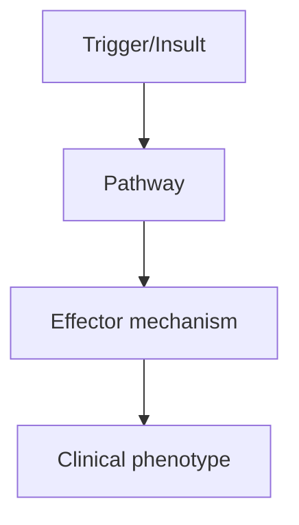
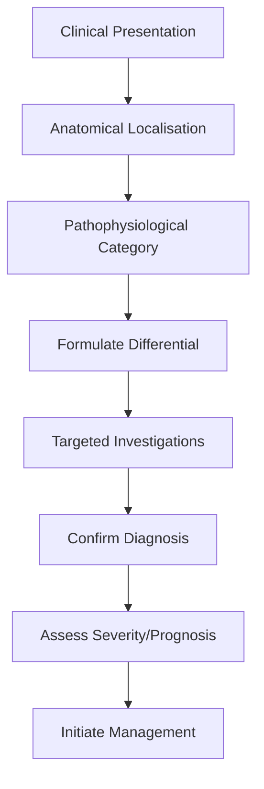
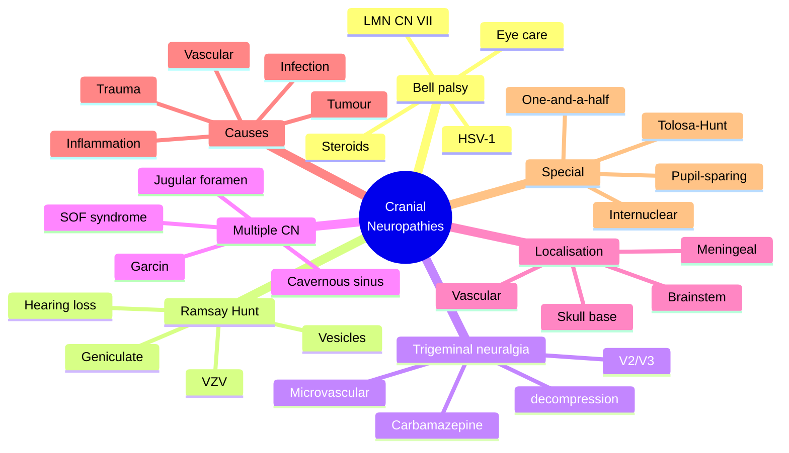

# Cranial Neuropathies

> [!tip] **High-Yield Definition**
> Cranial neuropathies: disorders of cranial nerves I-XII. May be isolated (single CN) or multiple. Causes: vascular, inflammatory (GBS, CIDP variants), infection (Lyme, syphilis, VZV, HSV), autoimmune (Bell's, Ramsay Hunt, LGI1, GQ1b), tumour (schwannoma, meningioma, metastasis), trauma, congenital, metabolic, neurodegenerative.

---

## 1. Definition / Epidemiology / Classification

### Definition
Cranial neuropathies: disorders of cranial nerves I-XII. May be isolated (single CN) or multiple. Causes: vascular, inflammatory (GBS, CIDP variants), infection (Lyme, syphilis, VZV, HSV), autoimmune (Bell's, Ramsay Hunt, LGI1, GQ1b), tumour (schwannoma, meningioma, metastasis), trauma, congenital, metabolic, neurodegenerative.

### Epidemiology
Bell's palsy: 20-30/100,000/year. Trigeminal neuralgia: 4-13/100,000. Vestibular schwannoma: 1.4/100,000. Multiple cranial neuropathies: rare, often sinister (skull base, cavernous sinus, nasopharyngeal Ca).

### Classification
| Variant | Key Features | Prognosis |
|---------|-------------|-----------|
| | | |

---

## 2. Aetiology / Pathophysiology

### Aetiology
Bell's palsy (CN VII): HSV-1 reactivation, vascular, idiopathic. Ramsay Hunt (CN VII/VIII): VZV reactivation. Trigeminal neuralgia (CN V): neurovascular compression (SCA, AICA, vein), MS, tumour. Vestibular schwannoma (CN VIII): NF2 (bilateral), sporadic. Glossopharyngeal neuralgia (CN IX): vascular compression, tumour. Multiple CN palsy: cavernous sinus (III, IV, V1, V2, VI - thrombosis, tumour, infection, granulomatous), skull base (nasopharyngeal Ca, chordoma, metastasis, meningioma, granulomatous - TB, syphilis, sarcoid), Guillain-Barré variants (Miller Fisher: III, IV, VI), CIDP, polyneuritis cranialis, autoimmune (anti-GQ1b, anti-GAD).

### Pathophysiology

---

## 3. Clinical Features

### History
- **Onset/Duration:**
- **Progression:**
- **Key symptoms:**
- **Triggers:**
- **Systemic symptoms:**
- **Drug/Family/Social history:**

### Examination
| Domain | Key Findings | Localisation Value |
|--------|-------------|-------------------|
| | | |

### Specific Clinical Features
Bell's palsy: acute unilateral facial weakness (forehead + lower face, LMN), hyperacusis, loss of taste (anterior 2/3), decreased lacrimation, post-auricular pain, hyperacusis. Ramsay Hunt: facial palsy + ear pain + vesicles (external ear, mouth), hearing loss, vertigo, tinnitus. Trigeminal neuralgia: brief, electric shock-like, V2/V3, trigger zones, unilateral. Vestibular schwannoma: unilateral SNHL, tinnitus, imbalance, facial numbness (late), facial palsy (late). Multiple CN palsy: depends on site (cavernous sinus: III, IV, V1, V2, VI; jugular foramen: IX, X, XI; skull base: V, VI, VII, VIII, IX, X, XI, XII).

---

## 4. Diagnostic Approach / Algorithm

---

## 5. Investigations

Clinical: site, distribution, onset, associated features. MRI brain with thin-section skull base (exclude tumour, demyelination, infection, vascular). MRI with contrast + MRA (vascular). LP: cells, protein, OCBs, culture, HSV/VZV PCR (Bell's, Ramsay Hunt). Bloods: glucose, HbA1c, B12, ACE, ANA, ANCA, anti-GQ1b (Miller Fisher), anti-AQP4, anti-MOG, anti-LGI1, anti-VGCC, syphilis, Lyme, HIV, ESR, CRP. NCS/EMG: blink reflex (VII), facial nerve (Bell's, prognosis), EMG (axonal loss). Audiometry, ENG, VEMP (vestibular). Genetic: NF2 (vestibular schwannoma).

---

## 6. Differential Diagnosis

| Differential | Distinguishing Features | Key Test |
|--------------|------------------------|----------|
| | | |

---

## 7. Management

Bell's palsy: oral prednisolone 50mg/day × 10 days (start within 72h for best outcome), antivirals (valaciclovir 1g TDS × 7d - if severe or Ramsay Hunt suspected, equivocal evidence but commonly given), eye care (artificial tears, patch, tape at night), physiotherapy (facial exercises). Ramsay Hunt: high-dose acyclovir/valaciclovir + steroids. Trigeminal neuralgia: carbamazepine, oxcarbazepine, baclofen, MVD if classical. Multiple CN palsy: treat underlying (cavernous sinus thrombosis: anticoagulation + antibiotics; nasopharyngeal Ca: RT, chemo; sarcoid: steroids, methotrexate; TB: ATT). Multidisciplinary: neurology, ENT, ophthalmology, maxillofacial, neurosurgery. Eye protection (CN V, VII palsy), speech/swallow (CN IX, X), airway protection (CN X), nutrition (NG/PEG).

---

## 8. Drug Interactions / Contraindications / Comorbidity Cautions

| Drug | Interaction / Caution | Management |
|------|----------------------|------------|
| | | |

---

## 9. Procedures (if applicable)

### Procedure:
- **Indications:**
- **Contraindications:**
- **Preparation / Principle:**
- **Complications:**
- **Viva Pearls:**

---

## 10. Complications

| Complication | Frequency | Prevention / Monitoring | Management |
|--------------|-----------|------------------------|------------|
| | | | |

---

## 11. Red Flags / Emergencies

Bilateral facial palsy (GBS, Lyme, sarcoid, HIV, carcinomatous meningitis), progressive or relapsing (tumour, demyelination, vasculitis), multiple CN involvement (skull base, cavernous sinus, meningeal disease), associated systemic features (vasculitis, sarcoid, malignancy).

---

## 12. Prognosis

Bell's: 70% complete recovery (House-Brackmann I/II), 12% permanent (III-VI), worse if severe at onset, elderly, pregnancy, no treatment. Ramsay Hunt: worse than Bell's (50% recovery). Trigeminal neuralgia: good with carbamazepine (90%), MVD 90% long-term. Vestibular schwannoma: surgical/SRS outcome depends on size, hearing. Multiple CN palsy: depends on cause.

---

## 13. Topic Correlation

| Related Topic | Link | Key Overlap |
|---------------|------|-------------|
| | | |

---

## 14. Special Situations

| Situation | Consideration |
|-----------|---------------|
| **Pregnancy** | |
| **Lactation** | |
| **Paediatric** | |
| **Elderly / Frail** | |
| **Renal impairment** | |
| **Hepatic impairment** | |
| **Immunocompromised** | |
| **Perioperative** | |
| **Driving / DVLA** | |
| **Occupational** | |

---

## FCPS/MRCP High-Yield Summary

| Category | Key Points |
|----------|------------|
| **Definition** | Cranial neuropathies: disorders of cranial nerves I-XII. May be isolated (single CN) or multiple. Causes: vascular, inflammatory (GBS, CIDP variants), infection (Lyme, syphilis, VZV, HSV), autoimmune  |
| **Epidemiology** | Bell's palsy: 20-30/100,000/year. Trigeminal neuralgia: 4-13/100,000. Vestibular schwannoma: 1.4/100,000. Multiple cranial neuropathies: rare, often s |
| **Pathophysiology** | |
| **Clinical** | Bell's palsy: acute unilateral facial weakness (forehead + lower face, LMN), hyperacusis, loss of taste (anterior 2/3), decreased lacrimation, post-auricular pain, hyperacusis. Ramsay Hunt: facial pal |
| **Diagnosis** | |
| **Investigations** | Clinical: site, distribution, onset, associated features. MRI brain with thin-section skull base (exclude tumour, demyelination, infection, vascular). MRI with contrast + MRA (vascular). LP: cells, pr |
| **Management** | Bell's palsy: oral prednisolone 50mg/day × 10 days (start within 72h for best outcome), antivirals (valaciclovir 1g TDS × 7d - if severe or Ramsay Hunt suspected, equivocal evidence but commonly given |
| **Complications** | |
| **Prognosis** | Bell's: 70% complete recovery (House-Brackmann I/II), 12% permanent (III-VI), worse if severe at onset, elderly, pregnancy, no treatment. Ramsay Hunt: worse than Bell's (50% recovery). Trigeminal neur |
| **Viva Pearls** | |
| **Drug Doses** | |
| **Scoring Systems** | |
| **Genetics** | |
| **Imaging Signs** | |

---

## Viva Questions (PACES/FCPS Style)

1. **Q:** Define Cranial Neuropathies and classify its variants.
   **A:** Based on the definition above.

2. **Q:** What are the key clinical features?
   **A:** Bell's palsy: acute unilateral facial weakness (forehead + lower face, LMN), hyperacusis, loss of taste (anterior 2/3), decreased lacrimation, post-auricular pain, hyperacusis. Ramsay Hunt: facial palsy + ear pain + vesicles (external ear, mouth), hearing loss, vertigo, tinnitus. Trigeminal neuralgi

3. **Q:** What is the first-line treatment?
   **A:** Based on the management section.

4. **Q:** What are the red flags requiring urgent referral?
   **A:** Bilateral facial palsy (GBS, Lyme, sarcoid, HIV, carcinomatous meningitis), progressive or relapsing (tumour, demyelination, vasculitis), multiple CN involvement (skull base, cavernous sinus, meningeal disease), associated systemic features (vasculitis, sarcoid, malignancy).

5. **Q:** What is the prognosis?
   **A:** Bell's: 70% complete recovery (House-Brackmann I/II), 12% permanent (III-VI), worse if severe at onset, elderly, pregnancy, no treatment. Ramsay Hunt: worse than Bell's (50% recovery). Trigeminal neuralgia: good with carbamazepine (90%), MVD 90% long-term. Vestibular schwannoma: surgical/SRS outcome

6. **Q:** How do you differentiate Cranial Neuropathies from key differentials?
   **A:** Clinical features, investigations, and response to treatment.

7. **Q:** What investigations are most useful?
   **A:** Based on the investigations section.

8. **Q:** Describe the stepwise management approach.
   **A:** Based on the management algorithm.

9. **Q:** What are the emergency presentations?
   **A:** Based on the red flags section.

10. **Q:** How does management change in pregnancy/paediatrics/elderly?
    **A:** Special considerations per population.

---

## Common Confusions / Exam Traps

| Confusion | Clarification |
|-----------|---------------|
| | |

---

## Mnemonics

1. **CN I-XII-LR-RR** — Cranial nerves in order with key function:
   - **I** — Olfactory (smell)
   - **II** — Optic (vision, RAPD, fields)
   - **III** — Oculomotor (most EOMs, pupil, levator palpebrae)
   - **IV** — Trochlear (SO — superior oblique)
   - **V** — Trigeminal (face sensation, muscles of mastication)
   - **VI** — Abducens (LR — lateral rectus)
   - **VII** — Facial (face muscles, taste ant 2/3, lacrimation, stapedius)
   - **VIII** — Vestibulocochlear (hearing, balance)
   - **IX** — Glossopharyngeal (oropharynx sensation, taste post 1/3, carotid body)
   - **X** — Vagus (palate, pharynx, larynx, parasympathetic)
   - **XI** — Accessory (SCM, trapezius)
   - **XII** — Hypoglossal (tongue)

2. **BELL-CRAMP** — Bell's palsy essentials:
   - **B**ilateral in 1% (think Lyme, sarcoid, GBS, lymphoma)
   - **E**tiology — HSV-1 reactivation in geniculate ganglion
   - **L**ower motor neurone (forehead involved — distinguishes from stroke)
   - **L**oss of nasolabial fold, drooping mouth, inability to close eye
   - **C**orticosteroids within 72 h improve outcome (prednisolone 50 mg × 10 d)
   - **R**amsay Hunt = VZV reactivation (vesicles, hearing loss, vertigo)
   - **A**ntivirals (valaciclovir) add modest benefit if started early
   - **M**ost recover by 3 months; ~30% have sequelae (synkinesis, contracture)
   - **P**rotect eye (lubricants, tape at night, ophthalmology review if no blink)

3. **SOF-CAVERN-JUG-BASE** — Topographic localisation of multiple cranial nerve palsies:
   - **S**uperior orbital fissure (CN III, IV, V1, VI) — proptosis, ophthalmoplegia, V1 sensory loss
   - **O**rbital apex (adds CN II — optic nerve involvement, vision loss)
   - **F**oramen rotundum / ovale (V2, V3) — facial numbness
   - **C**avernous sinus (CN III, IV, V1, V2, VI ± sympathetic) — ophthalmoplegia, V1/V2 sensory loss
   - **A**ICA / PICA / lateral medullary / lateral pontine syndromes
   - **V**ernet (jugular foramen) — IX, X, XI
   - **E**rlanger (parapharyngeal) — IX, X, XI, XII
   - **R**aymond (Claude, Weber, Millard-Gubler) — brainstem stroke
   - **N**ucleus ambiguus involvement (vocal cord paralysis) — IX, X
   - **B**ase of skull (Garcin syndrome) — all cranial nerves on one side, usually from nasopharyngeal Ca, lymphoma, metastases

---

## Mind Map

---

## Spaced Repetition Trackers

| Topic | Day 1 | Day 3 | Day 7 | Day 14 | Day 30 | Day 90 |
|-------|-------|-------|-------|--------|--------|--------|
| All 12 cranial nerves and their functions | ☐ | ☐ | ☐ | ☐ | ☐ | ☐ |
| Bell's palsy — LMN CN VII, HSV, steroids within 72 h | ☐ | ☐ | ☐ | ☐ | ☐ | ☐ |
| Ramsay Hunt — VZV, vesicles, CN VII + VIII | ☐ | ☐ | ☐ | ☐ | ☐ | ☐ |
| Trigeminal neuralgia — V2/V3, carbamazepine first-line | ☐ | ☐ | ☐ | ☐ | ☐ | ☐ |
| Cavernous sinus syndrome — III, IV, V1, V2, VI ± sympathetic | ☐ | ☐ | ☐ | ☐ | ☐ | ☐ |
| Jugular foramen (Vernet) — IX, X, XI | ☐ | ☐ | ☐ | ☐ | ☐ | ☐ |
| Garcin syndrome — unilateral multiple CN palsies, base of skull tumour | ☐ | ☐ | ☐ | ☐ | ☐ | ☐ |
| Pupil-sparing third nerve palsy = microvascular ischaemia | ☐ | ☐ | ☐ | ☐ | ☐ | ☐ |
| Multiple cranial nerve palsies — workup (MRI, LP, ESR, ANCA, ACE) | ☐ | ☐ | ☐ | ☐ | ☐ | ☐ |
| Red flags in Bell's palsy (recurrence, bilateral, no recovery) | ☐ | ☐ | ☐ | ☐ | ☐ | ☐ |

---

## Self-Test Scorecard

| Section | Score (/5) |
|---------|-----------|
| 1. Can list all 12 cranial nerves and their primary functions | /5 |
| 2. Can describe Bell's palsy — LMN CN VII, HSV-1, treatment (steroids within 72 h) | /5 |
| 3. Can describe Ramsay Hunt syndrome (VZV, vesicles, CN VII + VIII) | /5 |
| 4. Can describe trigeminal neuralgia and its first-line treatment (carbamazepine) | /5 |
| 5. Can localise cavernous sinus syndrome (CN III, IV, V1, V2, VI ± sympathetic) | /5 |
| 6. Can localise jugular foramen syndrome (CN IX, X, XI) — Vernet | /5 |
| 7. Can describe Garcin syndrome (multiple unilateral CN palsies from skull-base tumour) | /5 |
| 8. Can distinguish pupil-involving (compressive) from pupil-sparing (ischaemic) third nerve palsy | /5 |
| 9. Can list the red flags in Bell's palsy (recurrence, bilateral, slow recovery) | /5 |
| 10. Can describe a basic workup for multiple cranial nerve palsies | /5 |
| **TOTAL** | **/50** |

---

## MCQs (10)

1. **Question:** A 40-year-old man develops sudden left facial weakness, loss of the nasolabial fold, drooping of the mouth, and inability to close the left eye. He can still raise his eyebrows symmetrically. What is the most likely diagnosis?
   **Options:** A. Stroke (upper motor neurone CN VII palsy) B. Bell's palsy (lower motor neurone CN VII palsy) C. Trigeminal neuralgia D. Ramsay Hunt syndrome
   **Answer:** B
   **Explanation:** Forehead-sparing (because the patient can still raise his eyebrows symmetrically) is the key feature that identifies this as a *lower motor neurone* CN VII palsy. In an upper motor neurone lesion (e.g., stroke), the forehead is spared because of bilateral cortical innervation. Bell's palsy is the most common cause of acute LMN facial palsy. Trigeminal neuralgia is facial pain, not weakness. Ramsay Hunt would have vesicles in the ear or mouth.

2. **Question:** Which of the following is the most appropriate first-line treatment for Bell's palsy?
   **Options:** A. Oral aciclovir alone B. Oral prednisolone started within 72 h C. Topical steroid eye drops only D. Surgical facial nerve decompression
   **Answer:** B
   **Explanation:** Oral prednisolone (typically 50 mg daily for 10 days) started within 72 hours of onset significantly improves recovery in Bell's palsy (NNT ~10 for complete recovery). Antivirals alone are not effective. The addition of an antiviral (valaciclovir) to steroids may have a small additional benefit in severe cases. Surgical decompression is rarely indicated. Eye care (lubrication, taping, ophthalmology review) is essential to prevent exposure keratopathy.

3. **Question:** A 60-year-old man presents with facial weakness, ear pain, vesicles in the external auditory canal, hearing loss, and vertigo. What is the diagnosis?
   **Options:** A. Bell's palsy B. Ramsay Hunt syndrome C. Trigeminal neuralgia D. Acoustic neuroma
   **Answer:** B
   **Explanation:** Ramsay Hunt syndrome (herpes zoster oticus) is caused by VZV reactivation in the geniculate ganglion. The combination of facial palsy, ear pain, vesicles in the ear / mouth / face, hearing loss, vertigo (CN VIII involvement), and sometimes tinnitus is diagnostic. Treatment is high-dose aciclovir or valaciclovir plus corticosteroids within 72 hours. Outcomes are worse than in Bell's palsy.

4. **Question:** A 55-year-old woman presents with sudden, severe, electric-shock-like pain in the right cheek triggered by brushing her teeth, washing her face, and chewing. The pain lasts seconds. Examination is normal. What is the most likely diagnosis?
   **Options:** A. Cluster headache B. Trigeminal neuralgia C. Temporomandibular joint dysfunction D. Sinusitis
   **Answer:** B
   **Explanation:** The paroxysmal, electric-shock-like, triggerable facial pain localised to the V2/V3 distribution, with a normal examination, is the classic presentation of trigeminal neuralgia. Cluster headache is longer (15–180 min), periorbital, with autonomic features. TMJ dysfunction is aching and related to jaw movement. Sinusitis is dull, positional, with nasal symptoms. First-line treatment is carbamazepine; MRI brain with trigeminal protocol is required to exclude secondary causes (tumour, vascular loop, MS).

5. **Question:** A 30-year-old woman presents with right periorbital pain, complete right ophthalmoplegia (III, IV, VI), and sensory loss in V1 and V2 distributions. The pupil is involved. The MRI shows an enhancing mass in the right cavernous sinus. What is the most likely diagnosis?
   **Options:** A. Tolosa-Hunt syndrome B. Cavernous sinus syndrome — likely a tumour or thrombosis C. Migraine with ophthalmoplegia C. Diabetic third nerve palsy
   **Answer:** B
   **Explanation:** A cavernous sinus syndrome (multiple cranial nerves III, IV, V1, V2, VI, ± sympathetic) with an enhancing mass on MRI is most likely due to a tumour (meningioma, pituitary macroadenoma, nasopharyngeal carcinoma, lymphoma, metastasis) or a cavernous sinus thrombosis. Pupil involvement (ptosis, mydriasis) is the rule in compressive third nerve palsy. Tolosa-Hunt is a diagnosis of exclusion (steroid-responsive granulomatous inflammation) and shows a soft tissue mass in the region of the cavernous sinus / SOF. Diabetic third nerve palsy is pupil-sparing and isolated to CN III.

6. **Question:** Which of the following clinical features best distinguishes an upper motor neurone facial palsy from a lower motor neurone facial palsy?
   **Options:** A. Loss of taste in the anterior two-thirds of the tongue B. Hyperacusis C. Forehead sparing D. Decreased lacrimation
   **Answer:** C
   **Explanation:** Forehead sparing is the key bedside feature that distinguishes a UMN (central, e.g., stroke) facial palsy from an LMN (peripheral, e.g., Bell's palsy) facial palsy. The upper face receives bilateral cortical innervation, so a unilateral UMN lesion spares the forehead. LMN lesions involve the entire hemiface. Loss of taste, hyperacusis, and decreased lacrimation suggest involvement of specific CN VII branches and are typically features of LMN lesions.

7. **Question:** A 50-year-old presents with hoarseness, dysphagia, loss of sensation in the posterior pharynx, and weakness of the right sternocleidomastoid and trapezius. Where is the lesion?
   **Options:** A. Jugular foramen (Vernet syndrome) B. Cavernous sinus C. Orbital apex D. Internal auditory meatus
   **Answer:** A
   **Explanation:** Vernet syndrome is caused by a lesion at the jugular foramen involving CN IX (loss of pharyngeal sensation, taste posterior third), CN X (hoarseness, dysphagia, palatal weakness), and CN XI (SCM and trapezius weakness). Causes include glomus jugulare tumour, meningioma, schwannoma, metastasis, or thrombosis. The other syndromes (cavernous sinus, orbital apex) involve different combinations of nerves.

8. **Question:** A 35-year-old man presents with rapidly progressive unilateral palsies of cranial nerves V, VII, VIII, IX, X, XI, and XII in the absence of brainstem signs. MRI shows a mass at the skull base. What is the most likely diagnosis?
   **Options:** A. Garcin syndrome B. Multiple sclerosis C. Guillain-Barré syndrome D. Myasthenia gravis
   **Answer:** A
   **Explanation:** Garcin syndrome (hemibase-of-skull syndrome) is the progressive involvement of multiple cranial nerves on one side (often all 12) due to a destructive skull base lesion, classically a malignant tumour (nasopharyngeal carcinoma, lymphoma, metastasis, clivus chordoma). Absence of brainstem signs (no long-tract signs, no cerebellar signs) helps distinguish it from brainstem lesions. MS, GBS, and myasthenia would not produce this focal, unilateral, multiple-CN pattern with a mass on MRI.

9. **Question:** Which of the following is the most appropriate investigation in a patient with suspected cavernous sinus thrombosis?
   **Options:** A. Lumbar puncture B. MRI brain with venography (MRV) and contrast C. CT abdomen D. Nerve biopsy
   **Answer:** B
   **Explanation:** MRI brain with MRV (or CT venography) is the imaging of choice for suspected cavernous sinus thrombosis. Findings include filling defects in the cavernous sinus, expansion of the sinus, and enhancement of the sinus walls. Blood cultures, full septic screen, and prompt broad-spectrum IV antibiotics (e.g., ceftriaxone + metronidazole ± vancomycin) are required urgently as the condition has high mortality. LP is contraindicated due to raised intracranial pressure risk. Nerve biopsy is not relevant.

10. **Question:** A 25-year-old man presents with recurrent, brief, unilateral, excruciating periorbital headaches with lacrimation, conjunctival injection, and ptosis on the affected side. Each attack lasts 45 min. What is the most likely diagnosis?
    **Options:** A. Migraine B. Cluster headache C. Trigeminal neuralgia D. Raeder's paratrigeminal neuralgia
    **Answer:** B
    **Explanation:** Cluster headache is characterised by strictly unilateral, severe, periorbital/temporal pain attacks lasting 15–180 min, with prominent ipsilateral autonomic features (lacrimation, conjunctival injection, rhinorrhoea, nasal congestion, ptosis, miosis, facial sweating). It is sometimes called "suicide headache" due to its severity. Acute treatment is high-flow oxygen and subcutaneous sumatriptan; verapamil is first-line prophylaxis. Migraine is longer and often bilateral with photophobia. Trigeminal neuralgia is brief (seconds) and triggerable. Raeder syndrome is a Horner-like presentation with CN V pain.

---

## SBA Questions (10)

1. **Scenario:** A 32-year-old woman presents with sudden right facial weakness, drooling, inability to close the right eye, loss of taste on the right anterior two-thirds of the tongue, and hyperacusis. The remainder of the neurological examination is normal. She is 24 hours from onset.
   **Question:** What is the most appropriate first-line management?
   **Options:** A. Oral prednisolone 50 mg daily for 10 days + valaciclovir 1 g TDS for 7 days; eye protection B. Aspirin 300 mg and urgent stroke imaging C. IV methylprednisolone 1 g for 3 days D. Surgical facial nerve decompression
   **Answer:** A
   **Explanation:** This is a complete Bell's palsy with all the LMN features (forehead involvement, loss of taste, hyperacusis). Treatment is oral prednisolone within 72 hours (significantly improves recovery) plus an antiviral (valaciclovir) which may have modest additional benefit in complete/severe palsy. Eye protection (lubricants, taping at night, ophthalmology review) is essential. Stroke is excluded by the LMN pattern. High-dose IV methylprednisolone is not standard for Bell's palsy. Surgery is rarely indicated.

2. **Scenario:** A 65-year-old man develops left facial weakness, vertigo, hearing loss, and vesicles in the left external auditory canal. He is 48 hours from onset.
   **Question:** What is the most appropriate management?
   **Options:** A. Oral prednisolone only B. IV aciclovir 10 mg/kg TDS plus oral prednisolone; urgent ENT/audiology assessment C. Lumbar puncture D. Reassure — will resolve spontaneously
   **Answer:** B
   **Explanation:** This is Ramsay Hunt syndrome (VZV reactivation in the geniculate ganglion). Treatment is high-dose IV or oral aciclovir/valaciclovir plus corticosteroids, started as early as possible (definitely within 72 h). ENT assessment is required because of hearing loss, vertigo, and the risk of permanent hearing loss. Recovery is generally worse than for Bell's palsy. Reassurance alone is inadequate. LP is not indicated.

3. **Scenario:** A 70-year-old man presents with a "down and out" right eye, complete ptosis, and a fixed, dilated pupil. There is a severe right-sided headache. He is on warfarin for atrial fibrillation (INR 2.0).
   **Question:** What is the most appropriate next step?
   **Options:** A. Diagnose as a diabetic third nerve palsy; manage conservatively B. Urgent CT angiography / MRI to exclude a posterior communicating artery aneurysm C. Lumbar puncture D. IV methylprednisolone
   **Answer:** B
   **Explanation:** A pupil-involving ("surgical") third nerve palsy in an older patient with new headache is a posterior communicating artery (PCom) aneurysm until proven otherwise. Urgent vascular imaging (CTA / MRA / DSA) is mandatory. Diabetic third nerve palsy is classically pupil-sparing and ischaemic. The pupil is involved in compressive lesions (tumour, aneurysm) because the parasympathetic fibres run on the outside of the nerve. LP is contraindicated in suspected aneurysm. Steroids are not the priority.

4. **Scenario:** A 28-year-old woman with known relapsing-remitting multiple sclerosis develops acute, electric-shock-like pain in the right V2 distribution triggered by touch. Examination shows reduced pinprick in V2 and a positive jaw jerk.
   **Question:** What is the most likely diagnosis?
   **Options:** A. Idiopathic trigeminal neuralgia B. Symptomatic trigeminal neuralgia secondary to MS (demyelinating plaque in the pons) C. Cluster headache D. Temporomandibular joint dysfunction
   **Answer:** B
   **Explanation:** Trigeminal neuralgia in a young patient with MS is usually due to a demyelinating plaque at the root entry zone of CN V in the pons. The presence of sensory signs (reduced pinprick, positive jaw jerk — UMN CN V) supports a symptomatic rather than idiopathic cause. MRI brain with trigeminal protocol and gadolinium is required. Treatment is similar (carbamazepine) but microvascular decompression is not appropriate; management of the MS is also required.

5. **Scenario:** A 45-year-old man with long-standing, poorly controlled diabetes presents with isolated left ptosis and a "down and out" left eye. The pupil is normal and reactive. He denies headache.
   **Question:** What is the most appropriate management?
   **Options:** A. Urgent CTA to exclude aneurysm B. Watchful waiting — likely a microvascular ischaemic third nerve palsy; review in clinic in 4–6 weeks C. Lumbar puncture D. Start aciclovir
   **Answer:** B
   **Explanation:** A pupil-sparing ("medical") third nerve palsy in an older patient with vascular risk factors is typically microvascular (diabetic) ischaemia. Management is conservative with risk-factor modification and review. The pupil is spared because the parasympathetic fibres on the outside of the nerve are supplied by the pial vessels, which are spared in diabetes (vasa nervorum is affected). Pupil-sparing is >90% sensitive for ischaemic CN III palsy. Vascular imaging is required only if the pupil becomes involved, pain is severe, or atypical features develop.

6. **Scenario:** A 50-year-old woman presents with unilateral periorbital pain, ophthalmoplegia, and CN V1 numbness. MRI shows a soft-tissue enhancing mass in the region of the right cavernous sinus / superior orbital fissure. ESR is 60.
   **Question:** What is the most likely diagnosis and most appropriate initial treatment?
   **Options:** A. Cavernous sinus thrombosis — IV antibiotics B. Tolosa-Hunt syndrome — high-dose oral prednisolone, with reassessment in 48 h C. Pituitary apoplexy — urgent surgical decompression D. Cluster headache — verapamil
   **Answer:** B
   **Explanation:** Tolosa-Hunt syndrome is a painful ophthalmoplegia due to a granulomatous inflammation in the region of the cavernous sinus / superior orbital fissure / orbital apex. MRI shows enhancing soft tissue in this region, and ESR is often raised. The diagnosis is supported by a dramatic response to high-dose corticosteroids (within 48 h). It is a diagnosis of exclusion. Cavernous sinus thrombosis is supported by fever, sepsis, and filling defect on MRV. Pituitary apoplexy is acute with visual loss and hormonal disturbance.

7. **Scenario:** A 60-year-old man with a 30-pack-year smoking history presents with unilateral conductive hearing loss, facial palsy, otorrhoea, and chronic ear pain.
   **Question:** What is the most likely diagnosis?
   **Options:** A. Bell's palsy B. Ramsay Hunt syndrome C. Skull base malignancy (nasopharyngeal carcinoma) involving CN VII and VIII D. Vestibular schwannoma
   **Answer:** C
   **Explanation:** In an older smoker with conductive hearing loss, otorrhoea, otalgia, and facial palsy, a skull base malignancy (especially nasopharyngeal carcinoma) must be excluded. Vestibular schwannoma typically causes sensorineural (not conductive) hearing loss and is slow-growing, with a mass at the cerebellopontine angle. Bell's palsy is acute and not associated with ear discharge. Ramsay Hunt would have vesicles.

8. **Scenario:** A 14-year-old boy presents with bilateral facial palsy, painful polyarthritis, and a 2-week history of fever and a single annular skin lesion (erythema migrans) after a school camping trip.
   **Question:** What is the most likely diagnosis?
   **Options:** A. Bilateral Bell's palsy B. Lyme disease (neuroborreliosis) C. Guillain-Barré syndrome (bifacial weakness variant) D. Sarcoidosis (Heerfordt syndrome)
   **Answer:** B
   **Explanation:** Bilateral facial palsy in a child or young adult with a history suggestive of tick exposure and erythema migrans is highly suggestive of Lyme disease (early disseminated neuroborreliosis in Europe). Other features can be migratory arthralgia, meningitis, and radiculoneuritis. Diagnosis is supported by serology (ELISA + Western blot). Treatment is doxycycline (or amoxicillin in children) for 2–4 weeks. GBS and sarcoidosis are possible differentials but the camping history and erythema migrans make Lyme the most likely.

9. **Scenario:** A 55-year-old man presents with unilateral tongue wasting and deviation on protrusion to the affected side. Fasciculations are visible. The rest of the examination is normal.
   **Question:** What is the most likely diagnosis and likely prognosis?
   **Options:** A. Hypoglossal nerve palsy (CN XII) due to carotid dissection or skull base pathology — workup with MRI / MRA / carotid imaging B. ALS with bulbar onset C. Stroke D. Multiple sclerosis
   **Answer:** A
   **Explanation:** An isolated unilateral lower motor neurone CN XII palsy (tongue deviation to the weak side, wasting, fasciculations) is a hypoglossal nerve lesion. Causes include carotid artery dissection, skull base tumours (nasopharyngeal Ca, metastases, chordoma), occipital condyle fracture, and post-irradiation. Urgent imaging (MRI brain/skull base with contrast ± MRA of the carotids) is required. ALS would have upper motor neurone signs elsewhere. Stroke would produce a UMN tongue deviation (to the opposite side) and other brainstem signs.

10. **Scenario:** A 35-year-old woman with bilateral facial swelling, parotid enlargement, uveitis, fever, and bilateral CN VII palsy.
    **Question:** What is the most likely diagnosis?
    **Options:** A. Heerfordt syndrome (neurosarcoidosis) B. Lyme disease C. Bilateral Bell's palsy D. GBS
    **Answer:** A
    **Explanation:** Heerfordt syndrome is a manifestation of neurosarcoidosis characterised by the triad of cranial nerve palsies (especially CN VII, often bilateral), parotid gland enlargement, uveitis, and fever. CXR may show bilateral hilar lymphadenopathy. Serum ACE and CSF ACE/lysozyme may be raised. MRI brain can show leptomeningeal enhancement. Diagnosis often requires biopsy of an accessible site (e.g., minor salivary gland). Treatment is oral corticosteroids ± methotrexate or other steroid-sparing agents.

---

## Tags

#neurology #cranial-nerve #bell-palsy #ramsay-hunt #trigeminal-neuralgia #cavernous-sinus #jugular-foramen #garcin-syndrome #tolosa-hunt #pupil-sparing #FCPS #MRCP

---

## Local Navigation
**Heading Hub:** [[../Hub]]  
**Chapter Hierarchy:** [[Davidson Chapter 25 - Neurology Hierarchy]]  
**Chapter MOC:** [[Neurology MOC]]  
**Drug Reference:** [[../00_Index/Neurology Drug Reference]]

## PasTest Scenario SBAs (Clinical Vignettes)

> **Auto-generated PasTest/Mediscope-style scenario SBAs** grounded in the authored source. Each scenario tests a real clinical fact (triad, specific sign, contraindication, trial, first-line Rx) extracted from the topic. *Source: Ch 27: Neurology & Stroke — Cranial Neuropathies*

**Q1.** Which of the following features is most specific or characteristic of Cranial Neuropathies?

  - **A.** CN I-XII-LR-RR
  - **B.** A feature common to many acute inflammatory conditions
  - **C.** A non-specific sign that does not localise the diagnosis
  - **D.** An investigation finding rather than a clinical feature

  > **Answer: A** — CN I-XII-LR-RR
  >
  > *Source:* **CN I-XII-LR-RR** — Cranial nerves in order with key function:
   - **I** — Olfactory (smell)
   - **II** — Optic (vision, RAPD, fields)
   - **III** — Oculomotor (most EOMs, pupil, levator palpebrae

