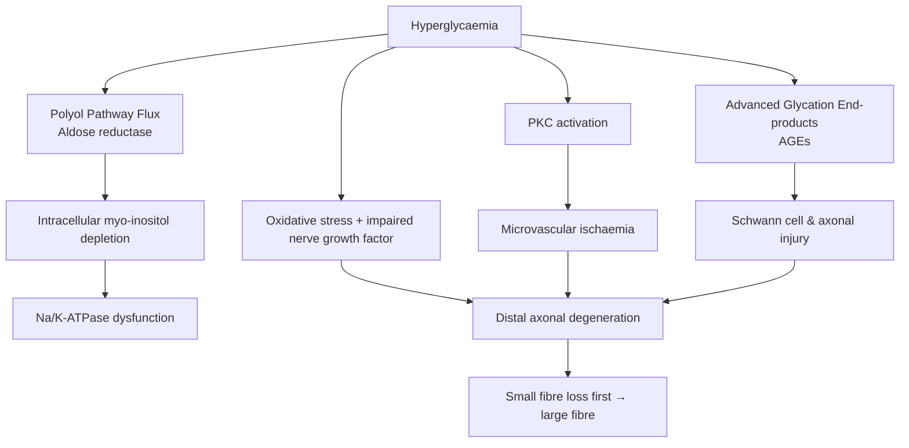

# Diabetic Neuropathy

Related: [[Peripheral Neuropathy Hub]], [[Chronic Inflammatory Demyelinating Polyneuropathy]], [[Amyloid Neuropathy]], [[Vasculitic Neuropathy]], [[Diabetic Foot]]

> [!tip] **High-Yield**
> Diabetic neuropathy is the **most common cause of peripheral neuropathy worldwide** (~50% of diabetics develop it). Pattern recognition matters: distal symmetric polyneuropathy (DSPN) is commonest, but **diabetic radiculoplexus neuropathy (diabetic amyotrophy)**, **mononeuropathies (CN III sparing pupil, CN VI)**, and **autonomic** dysfunction are FCPS/MRCP favourites. **Tight glycaemic control (DCCT/EDIC: 1% ↓HbA1c → 60% ↓ risk) is the only proven disease-modifying intervention**. **Duloxetine or pregabalin** = first-line for painful DSPN.

## 1. Definition / Epidemiology / Classification

### Definition
A heterogeneous group of neuropathies attributable to diabetes mellitus, classified by pattern of involvement (sensorimotor, autonomic, focal, multifocal). Diagnostic criteria require **abnormality of nerve conduction or validated clinical measures** in a diabetic patient, after exclusion of other causes.

### Epidemiology
- **Prevalence:** ~30% of all diabetics (50% by 10-yr); increases with diabetes duration
- **Lifetime risk:** Up to 50% (Type 1); 30-40% (Type 2)
- **Risk factors:** Duration, **HbA1c**, hypertension, dyslipidaemia, smoking, BMI, alcohol, vitamin B12 deficiency (metformin), height
- **DSPN** = ~75% of all diabetic neuropathies; most common form

### Classification (Thomas/Boulton)
| Type | Subtype | Key Features |
|------|---------|--------------|
| **Diffuse symmetric** | DSPN (sensorimotor) | Distal stocking-glove, chronic progressive |
| | **Small fibre neuropathy** | Pain, autonomic symptoms; normal NCS, abnormal QSART/skin biopsy |
| | **Autonomic neuropathy** | Cardiovascular, GI, GU, sudomotor |
| **Focal/Multifocal** | Cranial mononeuropathy (III, IV, VI, VII) | Acute, painful, often self-limiting |
| | **Peripheral mononeuropathy** (median, ulnar, peroneal) | Entrapment or ischaemia |
| | **Diabetic radiculoplexus neuropathy** (diabetic amyotrophy, Bruns-Garland) | Lumbosacral, asymmetric proximal pain+weakness |
| | **Thoracolumbar radiculopathy** | Asymmetric truncal pain ± abdominal wall weakness |
| **Treatment-induced** | Insulin neuritis | Acute painful neuropathy after rapid glycaemic control |

## 2. Aetiology / Pathophysiology

### Pathophysiology

### Molecular Basis
- **Aldose reductase** → sorbitol accumulation (osmotic stress)
- **AGEs** → cross-link proteins, RAGE-mediated inflammation
- **Endoneurial microangiopathy** → multifocal fibre loss
- **Mitochondrial dysfunction** + oxidative stress
- **Vitamin D deficiency**, dyslipidaemia amplify injury

## 3. Clinical Features

### DSPN (Most Common)
- **Symmetric** distal paraesthesiae, numbness, burning pain (feet → hands)
- **Loss of pinprick, vibration (128Hz), light touch**, temperature
- **Reduced/absent ankle reflexes** early; progression to ataxic gait
- **Charcot joints**, foot ulcers (plantar, metatarsal heads)
- **Motor involvement late** → distal wasting, foot drop

### Small Fibre Neuropathy
- **Pain prominent:** burning, lancinating, allodynia
- **Autonomic symptoms:** dry eyes/mouth, orthostasis
- **NCS normal** (large fibres spared); diagnosis by **QSART, skin biopsy (IENFD), Sudoscan, laser Doppler flare**

### Autonomic Neuropathy
- **Cardiovascular:** Resting tachycardia (>100 bpm), orthostatic hypotension (drop ≥20/10), reduced HRV, **silent MI**, QTc prolongation, exercise intolerance
- **GI:** Gastroparesis (early satiety, post-prandial bloating, vomiting, glycaemic lability), small bowel dysmotility, **diabetic enteropathy (constipation/diarrhoea)**
- **GU:** Erectile dysfunction (most common autonomic symptom), bladder dysfunction (retention, recurrent UTIs)
- **Sudomotor:** Anhidrosis (feet) → hyperhidrosis (trunk, head), gustatory sweating
- **Pupillary:** Small, sluggish pupils

### Diabetic Mononeuropathies
| Site | Features | Onset |
|------|----------|-------|
| **CN III** | Ptosis, painful ophthalmoplegia; **PUPIL SPARED** (in 80%, due to central ischaemia, peripheral pupil fibres get collateral blood) | Acute, resolves 6-12 weeks |
| **CN VI** | Lateral rectus palsy, horizontal diplopia | Acute, resolves |
| **CN VII** | Bell's palsy (2.5x increased risk) | Acute |
| **Median/ulnar/peroneal** | Entrapment (CTS, ulnar at elbow, common peroneal at fibular head) | Subacute |

### Diabetic Amyotrophy (Lumbosacral Radiculoplexus Neuropathy)
- **Elderly Type 2 diabetics**
- Acute, **asymmetric** proximal thigh pain → weakness (iliopsoas, quadriceps), weight loss
- ± contralateral or distal involvement
- Self-limiting over 12-24 months; recovery often incomplete

## 4. Diagnostic Approach

### Diagnostic Criteria (DSPN) — ADA/ADA-2017
- **Confirmed DSPN** = abnormal nerve conduction (≥1 NCS abnormality) **OR** validated clinical measure (e.g., Toronto Clinical Neuropathy Score, Utah, Michigan) in Type 1 or Type 2 DM
- **Subclinical DSPN** = abnormal NCS without symptoms
- **Possible DSPN** = symptoms OR signs only

### Severity (TCNS — Toronto Clinical Neuropathy Score)
- Symptoms (0-6) + Reflexes (0-8) + Sensory (0-5) = 0-19
- >5 = likely DSPN; >9 = significant

### Bedside Screening
- **10g monofilament** (1st, 3rd, 5th MT heads, plantar hallux) — protective sensation
- **128Hz tuning fork** at hallux — vibration
- **Pinprick** at dorsum foot — small fibre

## 5. Investigations

| Investigation | Indication | Expected Finding |
|---------------|------------|------------------|
| **HbA1c, fasting glucose** | All | Poor control predicts progression |
| **B12, folate, TSH, U&E, LFT, paraprotein, ANA, ANCA, SPEP** | Exclude mimics | Negative |
| **NCS/EMG** | Diagnostic uncertainty, atypical | Axonal sensorimotor (↓SNAP/CMAP, no demyelinating features) |
| **Skin biopsy (IENFD)** | Suspected small fibre | ↓intra-epidermal nerve fibre density (≤5.0/mm at distal leg) |
| **QSART / Sudoscan** | Autonomic, small fibre | Reduced sudomotor response |
| **Cardiovascular autonomic tests (CARTs)** | HRV, Valsalva, tilt-table | ↓HRV, orthostatic drop |
| **Gastric emptying study** | Gastroparesis | Delayed (>4h) |
| **Bladder scan, UDS** | Bladder dysfunction | Atonic bladder |

## 6. Differential Diagnosis
| Differential | Distinguishing | Test |
|--------------|----------------|------|
| **B12 deficiency** | Macrocytosis, dorsal column + corticospinal signs | B12, MMA, homocysteine |
| **CIDP** | Asymmetric, proximal, motor predominant, demyelinating NCS | NCS, CSF (↑protein) |
| **Hypothyroid neuropathy** | Myalgia, weight gain, ↓reflexia | TSH |
| **Paraneoplastic** | Subacute, pain, ataxia, weight loss | Anti-Hu, anti-CV2, CT CAP |
| **Vasculitic** | Asymmetric, painful, mononeuritis multiplex | ANCA, nerve biopsy |
| **Toxic (alcohol, drugs)** | History, systemic features | LFT, MCV, drug levels |
| **Uraemic** | Long-standing CKD | U&E |

## 7. Management

### Glycaemic Control (Only Disease-Modifying)
- **Target HbA1c** <7% (T1DM: <6.5% if no hypoglycaemia risk; T2DM: 7-8% in frail/elderly)
- **DCCT/EDIC:** Intensive control → 60% ↓ DSPN at 8-yr follow-up
- **STENO-2:** Multifactorial control (BP, lipid, glucose) → ~50% ↓ autonomic neuropathy

### Painful DSPN — First-Line (ADA/EAN 2024)
| Agent | Dose | Notes |
|-------|------|-------|
| **Duloxetine** | 30 mg → 60 mg OD (max 120 mg) | SNRI; **1st line**; contraindicated with MAOIs, severe liver disease; monitor BP, suicidality |
| **Pregabalin** | 75 mg BD → 150 mg BD (max 600 mg/day) | Gabapentinoid; renal adjust; sedation, weight gain, abuse potential |
| **Gabapentin** | 300 mg TDS → 3600 mg/day | Alternative; similar profile |
| **TCA (amitriptyline)** | 10-25 mg → 75 mg nocte | Cheap, but anticholinergic, cardiac (avoid >60 yr, ↑QT, ischaemia) |

**Second-line:** Tramadol, tapentadol, topical capsaicin (0.075%), lidocaine 5% patches. **Third-line:** Venlafaxine, botulinum toxin, spinal cord stimulation.

**Avoid opioids long-term** (abuse, hyperalgesia).

### Autonomic Neuropathy
| Symptom | Treatment |
|---------|-----------|
| **Orthostatic hypotension** | Liberal salt/fluid, head-up bed, compression stockings; **fludrocortisone 0.1-0.3 mg**, **midodrine 2.5-10 mg TDS** |
| **Gastroparesis** | Small frequent meals, low fat/fibre; **domperidone 10 mg TDS** (≤1 wk), metoclopramide, erythromycin; gastric pacing |
| **Erectile dysfunction** | **PDE5 inhibitors** (sildenafil 50 mg PRN); vacuum device, intracavernosal alprostadil |
| **Neurogenic bladder** | Intermittent self-catheterisation;bethanechol |
| **Cardiac autonomic** | Avoid beta-blockers if HRV poor; consider ACE-i, beta-blocker in CAD |
| **Sudomotor** | Glycopyrrolate, iontophoresis, botulinum toxin for gustatory sweating |

### Foot Care (Multidisciplinary)
- Annual foot screening, **regular chiropody**
- Custom footwear, insoles
- **Wound care, infection control** — early surgical debridement
- **Revascularisation assessment** (ABI, TBI, duplex, MRA) if ulcer or rest pain

### Amyotrophy/Radiculoplexus
- **Supportive;** immunomodulation (IVIG, methylprednisolone) may help early, evidence weak
- Physiotherapy, analgesia (gabapentinoids), optimise glycaemia

## 8. Drug Cautions
| Drug | Caution |
|------|---------|
| **Metformin** | ↓B12 (check annually) |
| **Duloxetine** | Serotonin syndrome with MAOIs/SSRIs; avoid in severe liver disease; suicide risk <25 yr |
| **Pregabalin/gabapentin** | Renal dose adjust; sedation, falls; abuse/misuse |
| **TCA (amitriptyline)** | Anticholinergic, ↑QT, cardiac, **avoid >60 yr** |
| **Beta-blockers** | Mask hypoglycaemia, worsen orthostasis |

## 9. Procedures
- **Skin biopsy:** 3 mm punch at distal leg (10 cm above lateral malleolus) + proximal thigh; quantitate IENFD (norm >5.0/mm at leg, >9.0/mm at thigh)
- **Nerve biopsy:** Rare — only for diagnostic uncertainty (vasculitis, amyloid)

## 10. Complications
| Complication | Frequency | Prevention |
|--------------|-----------|-----------|
| **Foot ulceration** | 15-25% lifetime | Foot care, footwear, glycaemia |
| **Charcot neuroarthropathy** | 0.1-7% | Avoid trauma, foot protection |
| **Amputation** | 15x ↑ risk in diabetes | Multidisciplinary foot team |
| **Falls** | ↑ 2-3x | Podiatric care, balance training |
| **Erectile dysfunction** | 30-75% (T2DM) | Optimise control, PDE5-i |

## 11. Red Flags / Emergencies
| Red Flag | Action |
|----------|--------|
| **CN III palsy with pupil involvement** | **NOT** typical diabetic — exclude **posterior communicating artery aneurysm** (CT/MR angiogram) |
| **Asymmetric weakness, rapid progression, motor predominance** | Exclude CIDP, vasculitis, radiculopathy, MND |
| **Foot ulcer with sepsis** | Emergency debridement, IV antibiotics, vascular assessment |
| **Charcot foot (red, hot, swollen, painless)** | Offload; suspect vs osteomyelitis (MRI) |
| **Gastroparesis with refractory vomiting/electrolyte disturbance** | Hospital admission, NG decompression |
| **Sudden painful mononeuritis multiplex** | Exclude vasculitis (ANCA, cryoglobulins) |

## 12. Prognosis
- **DSPN:** Slowly progressive; **10-25% amputation risk** in lifetime
- **Mononeuropathies:** Usually self-limiting (6-12 wk)
- **Amyotrophy:** Recovery 12-24 months, often incomplete
- **Cardiovascular autonomic:** ↑ mortality (2-3x) — risk of sudden death, silent MI

## 13. Topic Correlation
| Topic | Link | Overlap |
|-------|------|---------|
| **CIDP** | [[Chronic Inflammatory Demyelinating Polyneuropathy]] | Mimic; demyelinating NCS |
| **Vasculitic neuropathy** | [[Vasculitic Neuropathy]] | Mononeuritis multiplex |
| **Autonomic function** | [[Autonomic Function Testing]] | CARTs, QSART |
| **Diabetic foot** | [[Peripheral Neuropathy Hub]] | Ulceration, Charcot |
| **Erectile dysfunction** | [[Autonomic Nervous System Assessment]] | Autonomic involvement |

## 14. Special Situations
| Situation | Consideration |
|-----------|---------------|
| **Pregnancy** | Gestational DM neuropathy rare; T1DM tight control reduces risk |
| **Paediatric** | Painful DSPN uncommon; consider other causes (hereditary, CIDP) |
| **Elderly** | Falls risk; avoid TCAs; lower pregabalin dose |
| **Renal impairment** | Pregabalin/gabapentin dose adjust; metformin caution (eGFR <30 contraindicated) |
| **Hepatic** | Duloxetine avoided in severe disease |
| **Perioperative** | Glycaemia, autonomic dysfunction (cardiac, postural) — anaesthesia risk |
| **Driving (DVLA)** | Foot disability (charcot) may require adaptations |

## FCPS/MRCP High-Yield Summary
| Category | Key Points |
|----------|-----------|
| **Definition** | Most common peripheral neuropathy worldwide; heterogeneous |
| **Epidemiology** | 30-50% diabetics; HbA1c-dependent; major cause of foot ulceration |
| **Pathophysiology** | Polyol flux, AGEs, microangiopathy, oxidative stress, ↓NGF |
| **Clinical** | DSPN (stocking-glove, painless), small fibre (pain, autonomic), mononeuropathies, amyotrophy |
| **CN III Palsy** | **PUPIL SPARED** (vs PCOM aneurysm — pupil involved) |
| **Diagnosis** | HbA1c, NCS (axonal), skin biopsy (IENFD), CARTs, exclude mimics |
| **Management** | **Tight glycaemic control** (only disease-modifying); duloxetine/pregabalin for pain; treat autonomic |
| **Complications** | Foot ulcers (15-25%), Charcot, amputation, falls, ↑mortality with CAN |
| **Drug Doses** | Duloxetine 60 mg OD; Pregabalin 75-150 mg BD; Gabapentin 300-3600 mg/day; Amitriptyline 10-75 mg nocte |
| **Scoring** | TCNS, NDS, Michigan DNS |
| **Viva** | "Most common neuropathy in world"; "spares pupil"; "duloxetine 1st line pain"; "tight control = prevention" |

## Viva Questions
1. **Q:** What is the most common type of diabetic neuropathy?
   **A:** **Distal symmetric polyneuropathy (DSPN)** — chronic, length-dependent, axonal, sensorimotor.
2. **Q:** Why is the pupil spared in diabetic CN III palsy?
   **A:** Ischaemia affects central nerve fibres (motor) while peripheral parasympathetic pupil fibres receive collateral blood from the pia (vs compressive lesions like PCOM aneurysm → pupil involvement).
3. **Q:** First-line treatment for painful diabetic neuropathy?
   **A:** **Duloxetine 60 mg OD** or **Pregabalin 150 mg BD** (ADA 2024). Tricyclic antidepressants are also effective but limited by side effects.
4. **Q:** How does tight glycaemic control affect neuropathy risk?
   **A:** **DCCT/EDIC**: intensive control ↓ HbA1c by ~2% → 60% ↓ DSPN at 8 yr. **STENO-2** multifactorial control → 50% ↓ autonomic neuropathy.
5. **Q:** Differentiate diabetic amyotrophy from typical DSPN.
   **A:** Amyotrophy: **elderly T2DM**, **acute asymmetric proximal thigh pain + weakness** (iliopsoas, quadriceps), weight loss, ↑ESR, normal NCS (radiculoplexus) — self-limiting 12-24 mo.
6. **Q:** How is small fibre neuropathy diagnosed?
   **A:** **Skin biopsy** showing ↓ intra-epidermal nerve fibre density (IENFD <5/mm distal leg); NCS normal; may use QSART, Sudoscan, LDF.
7. **Q:** What cardiovascular autonomic findings predict mortality?
   **A:** ↓HRV, orthostatic hypotension, QTc prolongation, resting tachycardia, exercise intolerance — 2-3x ↑ mortality; **silent MI** risk.
8. **Q:** Foot care recommendations?
   **A:** Annual screening (10g monofilament, 128Hz tuning fork, pinprick, ankle reflexes, ABI); custom footwear; chiropody; aggressive wound care; revascularisation if PAD.
9. **Q:** How do you treat diabetic gastroparesis?
   **A:** Small frequent low-fat/low-fibre meals; domperidone 10 mg TDS (≤1 wk); metoclopramide; erythromycin (motilin agonist); gastric pacing (refractory).
10. **Q:** How to differentiate CN III palsy: diabetic vs aneurysm?
    **A:** **Diabetic: pupil spared**, painful, **ischaemic** (central fibres), resolves weeks. **PCOM aneurysm: pupil dilated, painful**, requires urgent CTA/MRA and neurosurgical intervention.

## Common Confusions
| Confusion | Clarification |
|-----------|---------------|
| CN III diabetic vs aneurysm | **Pupil** involvement: spared in ischaemia (diabetes), involved in compression (aneurysm, uncal herniation) |
| DSPN vs B12 deficiency | DSPN: axonal, length-dependent; B12: dorsal column + lateral corticospinal tract (UMN), macrocytosis |
| Insulin neuritis | Acute painful neuropathy after **rapid** glycaemic improvement (insulin, SGLT2-i); self-limiting |
| Amyotrophy vs radiculopathy | Amyotrophy: diffuse radiculoplexus, often bilateral, ↑ESR, weight loss; radiculopathy: single root distribution |
| Charcot joint vs osteomyelitis | Both red, hot, swollen foot; Charcot: **non-infectious**, painless, midfoot; osteomyelitis: painful, MRI/bone biopsy |

## Mnemonics
1. **DIABETIC N** — **D**uloxetine, **I**maging (r/o mimics), **A**utonomic screen, **B**12 check, **E**xclude mimics, **T**ight control, **I**nvestigate (NCS), **C**harcot care
2. **PUPIL PARADOX** — Diabetes **P**UPIl s**P**ar**E**d = **PE** central; Aneurysm = Pupil **Dilates** (compression parasympathetic)
3. **TIN-FOOT** — **T**uning fork, **I**ENFD/skin biopsy, **N**CS, **F**ilament (10g), **OO**rthostasis, **T**emperature
4. **DCCT REDUCES 60%** — **D**iabetes **C**ontrol and **C**omplications **T**rial: intensive Rx ↓ 60% neuropathy

## One-Page Revision Card
| Topic | Diabetic Neuropathy |
|-------|---------------------|
| **Definition** | Most common peripheral neuropathy; heterogeneous (diffuse, focal, autonomic) |
| **Key Clinical** | DSPN: stocking-glove, painless loss; small fibre: pain, autonomic; CN III pupil-sparing; amyotrophy: proximal pain/weakness |
| **Diagnosis** | HbA1c, NCS (axonal), skin biopsy (IENFD), CARTs, exclude mimics (B12, TSH, paraprotein) |
| **Meds (Pain)** | Duloxetine 60 mg OD / Pregabalin 150 mg BD; 2nd line: TCA, gabapentin, tramadol |
| **Autonomic Rx** | Midodrine, fludrocortisone (OH); Domperidone (gastroparesis); PDE5-i (ED) |
| **Prevention** | Tight glycaemic control (DCCT 60% ↓); multifactorial (STENO-2); foot care |
| **Red Flag** | CN III with pupil involvement → PCOM aneurysm; asymmetric motor → CIDP/vasculitis |

## Must Know / Should Know
- [ ] **Must:** DSPN pattern; pupil-sparing CN III; duloxetine/pregabalin 1st line; tight control prevents
- [ ] **Should:** Small fibre diagnosis (skin biopsy), cardiac autonomic mortality, Charcot foot, insulin neuritis
- [ ] **Nice:** Genetics (T2DM polygenic), NGF trials, spinal cord stimulation

## MCQs (10)

1. **Question:** Which cranial nerve palsy in diabetes classically SPARES the pupil?
   **Options:** A. CN II B. CN III C. CN IV D. CN VI
   **Answer:** B
   **Explanation:** Diabetic CN III palsy is ischaemic and affects the central somatic motor fibres, while the peripheral parasympathetic pupil fibres receive collateral pial blood supply and are spared. Aneurysmal/compressive CN III palsy (e.g., PCOM) involves the pupil.

2. **Question:** First-line oral pharmacological treatment for painful diabetic neuropathy (ADA 2024)?
   **Options:** A. Carbamazepine B. Duloxetine C. Amitriptyline D. Tramadol
   **Answer:** B
   **Explanation:** Duloxetine (SNRI) and pregabalin/gabapentin are first-line per ADA 2024. TCAs are effective but limited by anticholinergic and cardiac side effects, especially in older patients. Tramadol is second-line.

3. **Question:** What is the typical NCS finding in diabetic DSPN?
   **Options:** A. Demyelinating (slow CV, conduction block) B. Axonal (↓SNAP/CMAP) C. Normal D. Preserved SNAP with ↓CMAP
   **Answer:** B
   **Explanation:** DSPN is a length-dependent axonal neuropathy — reduced sensory (SNAP) and motor (CMAP) amplitudes with relatively preserved conduction velocities. Demyelination suggests CIDP.

4. **Question:** What is the most sensitive test for small fibre neuropathy?
   **Options:** A. Nerve conduction studies B. MRI brain C. Skin biopsy with IENFD D. Lumbar puncture
   **Answer:** C
   **Explanation:** Skin biopsy (3 mm punch at distal leg) with quantification of intra-epidermal nerve fibre density (IENFD) is the gold standard for small fibre neuropathy. NCS is normal in pure small fibre disease.

5. **Question:** DCCT/EDIC showed that intensive glycaemic control reduced DSPN risk by approximately?
   **Options:** A. 10% B. 30% C. 60% D. 90%
   **Answer:** C
   **Explanation:** The DCCT/EDIC follow-up showed a ~60% reduction in DSPN risk with intensive glycaemic control in T1DM at 8-year follow-up.

6. **Question:** Diabetic amyotrophy (Bruns-Garland) typically presents with:
   **Options:** A. Symmetric distal sensory loss B. Acute asymmetric proximal thigh pain and weakness with weight loss C. Bilateral foot drop D. Cranial nerve palsies
   **Answer:** B
   **Explanation:** Diabetic radiculoplexus neuropathy (amyotrophy) occurs in elderly T2DM and presents with acute, asymmetric, painful proximal thigh weakness (iliopsoas, quadriceps) often with weight loss. Recovery is slow and often incomplete.

7. **Question:** In diabetes, which autoantibody screen is NOT typically required for neuropathy workup?
   **Options:** A. ANCA B. Anti-Hu C. Anti-CCP D. Anti-GAD
   **Answer:** C
   **Explanation:** Anti-CCP is for rheumatoid arthritis, not neuropathy. ANCA (vasculitis), anti-Hu (paraneoplastic), and anti-GAD (autoimmune neuropathy) may be relevant in atypical cases.

8. **Question:** What is the first-line treatment for orthostatic hypotension in diabetic autonomic neuropathy?
   **Options:** A. Bisoprolol B. Midodrine C. Ivabradine D. Amiodarone
   **Answer:** B
   **Explanation:** Midodrine (α1-agonist) and fludrocortisone (mineralocorticoid) are first-line for neurogenic orthostatic hypotension. Non-pharmacological measures (liberal salt/fluid, head-up bed, compression stockings) are foundational.

9. **Question:** Which medication causes "insulin neuritis" (acute painful neuropathy after rapid glycaemic improvement)?
   **Options:** A. Metformin B. Insulin / SGLT2 inhibitors C. Sulfonylureas D. Pioglitazone
   **Answer:** B
   **Explanation:** Insulin neuritis (treatment-induced neuropathy of diabetes) occurs after rapid improvement in glycaemia, often with insulin or SGLT2 inhibitors; presents with acute pain and autonomic symptoms; self-limiting over weeks-months.

10. **Question:** The 10g monofilament test assesses which modality?
    **Options:** A. Vibration B. Proprioception C. Protective touch/pressure D. Temperature
    **Answer:** C
    **Explanation:** The 10g Semmes-Weinstein monofilament assesses protective sensation (light touch/pressure) and predicts foot ulceration risk in diabetes. Vibration is tested with a 128 Hz tuning fork; pinprick for small fibre; temperature for cold fibre.

## SBA Questions (10)

1. **Scenario:** 60-year-old man with T2DM presents with acute painful right ptosis and ophthalmoplegia. Pupil is 3 mm reactive. What is the most likely diagnosis?
   **Options:** A. PCOM aneurysm B. Diabetic CN III palsy C. Migraine D. Tolosa-Hunt syndrome
   **Answer:** B
   **Explanation:** Acute painful CN III palsy in diabetes with **normal reactive pupil (pupil spared)** is characteristic of diabetic (ischaemic) CN III palsy. PCOM aneurysm typically causes pupil dilation.

2. **Scenario:** 55-year-old woman with painful burning feet for 6 months. NCS normal. What is the next diagnostic step?
   **Options:** A. Repeat NCS B. Skin biopsy (IENFD) C. Lumbar puncture D. MRI spine
   **Answer:** B
   **Explanation:** Painful feet with normal NCS suggests small fibre neuropathy. Skin biopsy (3 mm punch at distal leg) for IENFD is the gold standard. LP is for demyelinating/inflammatory disorders.

3. **Scenario:** 65-year-old T2DM with HbA1c 11% presents with foot ulcer under 1st metatarsal head, no pain. ABI 1.0. What is the next best step?
   **Options:** A. Below-knee amputation B. Wound care, offloading, glycaemic optimisation, vascular assessment C. IV antibiotics only D. Hyperbaric oxygen only
   **Answer:** B
   **Explanation:** Standard diabetic foot ulcer management: wound care (debridement, dressings), offloading (total contact cast), glycaemic optimisation, vascular assessment (ABI, duplex, MRA if PAD suspected). Antibiotics added if infected.

4. **Scenario:** 50-year-old T1DM with symptomatic orthostatic hypotension. Supine BP 140/80, standing BP 90/60. What is the first-line pharmacological treatment?
   **Options:** A. Bisoprolol B. Midodrine 2.5-10 mg TDS C. ACE inhibitor D. IV sodium chloride
   **Answer:** B
   **Explanation:** Midodrine (α1-agonist) and fludrocortisone are first-line for neurogenic orthostatic hypotension. Start midodrine 2.5 mg TDS, titrate up. Avoid supine hypertension; monitor BP lying/sitting/standing.

5. **Scenario:** 70-year-old T2DM on metformin presents with foot numbness, MCV 105, HbA1c 8.5%. What is the most likely contributing cause?
   **Options:** A. Diabetic DSPN B. B12 deficiency (metformin) C. Hypothyroidism D. CIDP
   **Answer:** B
   **Explanation:** Metformin causes B12 malabsorption in 10-30% of long-term users, contributing to neuropathy. Check B12, MMA, homocysteine; supplement with B12. MCV may be macrocytic or normal if concurrent iron deficiency.

6. **Scenario:** 45-year-old T2DM with acute asymmetric proximal thigh pain and weight loss 5 kg, ↑ESR. EMG shows lumbosacral radiculoplexus involvement. What is the most appropriate initial management?
   **Options:** A. High-dose steroids (mimicking CIDP) B. IVIG C. Supportive care, analgesia, physiotherapy D. Plasmapheresis
   **Answer:** C
   **Explanation:** Diabetic amyotrophy (lumbosacral radiculoplexus neuropathy) is **self-limiting**; treatment is supportive (analgesia, physio, glycaemic optimisation). Immunotherapy has limited evidence.

7. **Scenario:** 60-year-old T2DM with painful neuropathy unresponsive to duloxetine 60 mg. What is the most appropriate second-line add-on?
   **Options:** A. Codeine B. Pregabalin 75 mg BD C. Morphine D. Carbamazepine
   **Answer:** B
   **Explanation:** Pregabalin (or gabapentin) is a first-line gabapentinoid option. Combination of duloxetine + pregabalin is often used. Carbamazepine is for trigeminal neuralgia. Opioids should be avoided long-term.

8. **Scenario:** 58-year-old man with T2DM presents with painful red, hot, swollen, painless midfoot. X-ray shows fragmentation. What is the diagnosis?
   **Options:** A. Osteomyelitis B. Cellulitis C. Charcot neuroarthropathy D. Gout
   **Answer:** C
   **Explanation:** Charcot neuroarthropathy: painless, red, hot, swollen foot in neuropathic patient; X-ray shows fragmentation/destruction. Differentiation from osteomyelitis requires MRI ± bone biopsy. Management: offloading, immobilisation.

9. **Scenario:** 50-year-old woman with T2DM and painful DSPN. HbA1c 9.5%. What is the SINGLE most important disease-modifying intervention?
   **Options:** A. Duloxetine B. Pregabalin C. Tight glycaemic control D. Vitamin B complex
   **Answer:** C
   **Explanation:** Tight glycaemic control is the **only proven disease-modifying** intervention for diabetic neuropathy (DCCT/EDIC). Symptomatic agents (duloxetine, pregabalin) treat pain only.

10. **Scenario:** 65-year-old man with diabetes, painful burning feet. On duloxetine, gabapentin, tramadol. Pain 8/10. What is the most appropriate next step?
    **Options:** A. Increase gabapentin to max dose B. Add amitriptyline 25 mg nocte C. Add opioid patch D. Refer to pain specialist / consider spinal cord stimulation
    **Answer:** D
    **Explanation:** Refractory neuropathic pain requires specialist referral. Spinal cord stimulation has evidence in refractory painful diabetic neuropathy. Avoid escalating opioids long-term.

## Flashcards
- **Q:** Most common type of diabetic neuropathy? **A:** Distal symmetric polyneuropathy (DSPN)
- **Q:** CN III palsy in diabetes — pupil status? **A:** Spared (ischaemic central fibres)
- **Q:** First-line treatment for painful diabetic neuropathy? **A:** Duloxetine 60 mg OD or Pregabalin 150 mg BD
- **Q:** DCCT/EDIC: % reduction in DSPN with intensive control? **A:** 60%
- **Q:** Diagnostic gold standard for small fibre neuropathy? **A:** Skin biopsy with IENFD
- **Q:** Treatment for diabetic amyotrophy? **A:** Supportive (self-limiting)
- **Q:** First-line for orthostatic hypotension in autonomic neuropathy? **A:** Midodrine + fludrocortisone
- **Q:** 10g monofilament tests what? **A:** Protective sensation (predicts foot ulcer)
- **Q:** Most common cranial mononeuropathies in diabetes? **A:** CN III (pupil-sparing), CN VI
- **Q:** Erectile dysfunction treatment in diabetes? **A:** PDE5 inhibitors (sildenafil 50 mg PRN)

## Answer Key

### MCQs
1. **B** — CN III ischaemic; pupil spared due to peripheral collateral blood supply
2. **B** — Duloxetine first-line per ADA 2024
3. **B** — Axonal neuropathy: ↓SNAP/CMAP, preserved CV
4. **C** — Skin biopsy (IENFD) for small fibre neuropathy
5. **C** — DCCT/EDIC: 60% reduction in DSPN
6. **B** — Amyotrophy = acute asymmetric proximal pain/weakness
7. **C** — Anti-CCP is for RA, not neuropathy
8. **B** — Midodrine first-line for orthostatic hypotension
9. **B** — Insulin/SGLT2 cause insulin neuritis (acute painful)
10. **C** — 10g monofilament = protective sensation

### SBAs
1. **B** — Painful CN III + normal pupil = diabetic (ischaemic)
2. **B** — Normal NCS + painful feet = small fibre → skin biopsy
3. **B** — Multidisciplinary foot care (offload, glycaemia, vascular)
4. **B** — Midodrine first-line for orthostatic hypotension
5. **B** — Metformin causes B12 deficiency (check MCV/B12)
6. **C** — Amyotrophy is self-limiting; supportive care
7. **B** — Pregabalin add-on after duloxetine failure
8. **C** — Charcot: painless, red, hot, swollen midfoot
9. **C** — Tight glycaemic control = only disease-modifying
10. **D** — Refractory pain → specialist/spinal cord stimulation

## Local Navigation
**Chapter Hierarchy:** [[Davidson Chapter 25 - Neurology Hierarchy]]  
**Chapter MOC:** [[Neurology MOC]]  
**Topic Hub:** [[Peripheral Neuropathy Hub]]  
**Related Topics:** [[CIDP]], [[Vasculitic Neuropathy]], [[Amyloid Neuropathy]], [[Autonomic Function Testing]]
