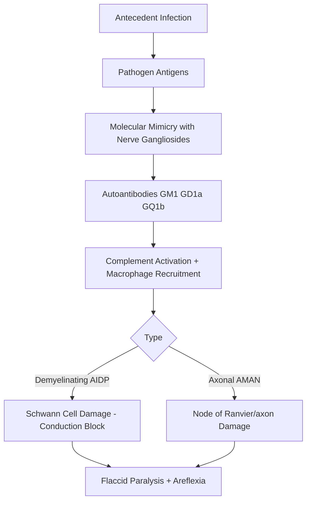
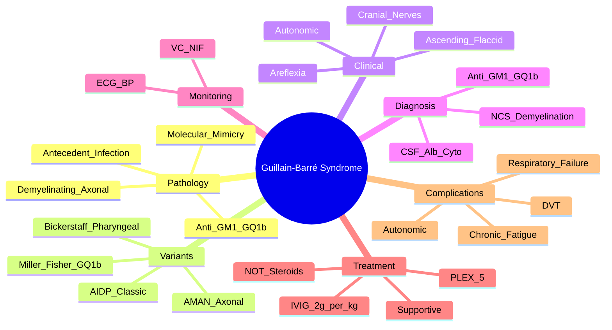

# Guillain-Barré Syndrome (GBS)

> [!tip] **GBS = Acute, ascending, symmetric flaccid paralysis with areflexia, post-infectious (esp. Campylobacter)**
> **Albuminocytological dissociation** in CSF (↑protein, normal WCC); **NCS: demyelinating** (AIDP) or **axonal** (AMAN)
> **Respiratory monitoring ESSENTIAL** — intubate if NIF < -30 cmH₂O or VC <20 ml/kg

## 1. Definition / Epidemiology / Classification

### Definition
Acute, immune-mediated polyradiculoneuropathy causing ascending flaccid paralysis, typically **post-infectious**, with **monophasic** course.

### Epidemiology
- **Incidence:** 1-2/100,000/year (↑ in elderly)
- **Age:** All ages; bimodal (young adults + elderly)
- **Sex:** M>F (1.5:1)
- **Antecedent infection:** 60-70% (respiratory or GI 1-3 weeks before)
  - **Campylobacter jejuni** (25-40%) → axonal variants (AMAN)
  - **CMV, EBV, Mycoplasma, Haemophilus influenzae**
  - **Influenza, Zika, SARS-CoV-2**
  - **Vaccines** (historical influenza 1976; rare COVID)

### Classification — Variants
| Variant | Pathology | Key Features |
|---------|-----------|--------------|
| **AIDP** (Acute Inflammatory Demyelinating Polyradiculoneuropathy) | **Demyelinating** (~85-90% in West) | Classic ascending paralysis; CSF alb-cyto dissociation |
| **AMAN** (Acute Motor Axonal Neuropathy) | **Axonal** (Asia, post-Campylobacter) | Pure motor; often slower recovery; anti-GM1 |
| **AMSAN** (Acute Motor and Sensory Axonal Neuropathy) | Axonal | Severe; poor recovery |
| **Miller Fisher Syndrome (MFS)** | Anti-**GQ1b** | Triad: ataxia + areflexia + ophthalmoplegia; ± ptosis |
| **Bickerstaff Brainstem Encephalitis** | Anti-GQ1b | Encephalopathy + ophthalmoplegia + ataxia + hyperreflexia |
| **Pharyngeal-Cervical-Brachial** | Anti-GT1a | Bulbar + arm weakness |
| **Sensory GBS** | Sensory variant | Ataxia, sensory loss, no weakness |
| **Pure Autonomic GBS** | Autonomic | Severe dysautonomia |

---

## 2. Aetiology / Pathophysiology

### Aetiology — **Molecular Mimicry**
- **Campylobacter jejuni** LOS → anti-**GM1/GD1a** antibodies cross-react with peripheral nerve gangliosides → axonal damage (AMAN)
- **CMV** → anti-**GM2** antibodies
- **Mycoplasma** → anti-**GalC**
- **Haemophilus** → anti-GM1
- **Miller Fisher:** Anti-**GQ1b** (enriched in oculomotor nerves, dorsal root ganglia)

### Pathophysiology

### Pathology
- **AIDP:** Endoneurial oedema, lymphocytic infiltration, segmental demyelination, macrophage-mediated stripping of myelin
- **AMAN:** Wallerian-like degeneration; axonal damage at nodes

---

## 3. Clinical Features

### History
- **Antecedent event:** 1-3 weeks prior (respiratory 41%, GI 22%, other 38%)
- **Onset:** Progressive weakness over **days to 4 weeks** (typically 1-2 weeks)
- **Symmetric, ascending weakness**: Legs first → arms → bulbar (in severe cases)
- **Sensory:** Mild paraesthesia (often subjective; objective less common)
- **Pain:** 50% — back/leg pain common early
- **Autonomic:** Fluctuating BP, arrhythmias, ileus, urinary retention
- **No fever** (suggests ongoing infection)

### Examination
| Sign | Finding |
|------|---------|
| **Motor** | Symmetric flaccid weakness; proximal + distal |
| **Reflexes** | **Areflexia/hyporeflexia** (universal; diagnostic clue) |
| **Sensory** | Mild glove/stocking sensory loss (or none) |
| **Cranial nerves** | Facial (50%, bilateral), bulbar (dysphagia/dysarthria), ophthalmoplegia (MFS) |
| **Respiratory** | Tachypnoea, shallow breathing, accessory muscles |
| **Autonomic** | HR/BP fluctuations, ileus |

### Specific Variants
- **Miller Fisher:** Ophthalmoplegia + ataxia + areflexia; anti-GQ1b
- **Bickerstaff:** + encephalopathy, hyperreflexia
- **Pharyngeal-cervical-brachial:** Bulbar + neck + arm; mimic of botulism/myasthenia

---

## 4. Diagnostic Approach / Algorithm

### Diagnostic Criteria (NINDS 1990 / Brighton)
| Feature | Required for Diagnosis |
|---------|----------------------|
| **Required** | Progressive, symmetric weakness of >1 limb; areflexia/hyporeflexia; <4 weeks progression; **CSF alb-cyto dissociation**; **NCS demyelination** |
| **Supportive** | Antecedent infection; autonomic dysfunction; cranial nerve involvement; no fever at onset |
| **Exclusion** | HIV, Lyme, polio, botulism, myasthenia, vasculitis, porphyria, lead, transverse myelitis, cord compression |

---

## 5. Investigations

### First-Line
| Test | Timing | Finding |
|------|--------|---------|
| **LP (CSF)** | Day 7-10 (earlier may be normal) | **Albuminocytological dissociation: ↑protein (>0.45 g/L), normal WCC (<10)** |
| **Nerve Conduction Studies (NCS)** | Day 5-7+ | **Demyelinating: ↓CV, prolonged F-wave/distal latencies, conduction block, temporal dispersion** (AIDP); Low CMAP (axonal) |
| **Bloods** | All | FBC, U&E, LFT, glucose, **Ca/Mg/PO4** (rule out metabolic), CK, ESR/CRP |
| **Spirometry** (VC, NIF) | **Serial** (4-hourly in acute) | **NIF < -30 cmH₂O** OR VC <20 ml/kg = ventilation risk |

### Serology / Antibody Testing
| Test | Indication |
|------|------------|
| **Anti-GM1, GD1a** | Axonal variants (AMAN/AMSAN), post-Campylobacter |
| **Anti-GQ1b** | **Miller Fisher syndrome** (>90%) |
| **Anti-GT1a** | Pharyngeal-cervical-brachial variant |
| **Campylobacter serology/stool** | Antecedent infection |

### When to Consider (Atypical Features)
| Test | Indication |
|------|------------|
| **HIV test** | GBS-like presentation (HIV-associated neuropathy) |
| **Spinal MRI** | If cord lesion suspected (sensory level, bladder) |
| **Porphyrins** | Acute intermittent porphyria (mimic) |
| **Anti-GQ1b (MFS)** | Confirms MFS |
| **Vasculitis screen** | Atypical, multisystem |

---

## 6. Differential Diagnosis
| Condition | Distinguishing Feature |
|-----------|----------------------|
| **Spinal Cord Compression** | Sensory level, bladder/bowel, MRI |
| **Transverse Myelitis** | Sensory level, hyperreflexia (after spinal shock), CSF pleocytosis |
| **Myasthenia Gravis** | Fatigable, ocular, normal reflexes, NCS normal, AChR antibodies |
| **Botulism** | Descending paralysis, pupils dilated, ↓GI motility |
| **Polymyositis/Dermatomyositis** | Proximal; ↑CK; muscle biopsy |
| **Tick Paralysis** | Ascending, but children, tick found, fast resolution on removal |
| **Acute Intermittent Porphyria** | Abdominal pain, psychiatric features, hyponatraemia |
| **Heavy metal poisoning** | Lead, arsenic |
| **Diphtheritic neuropathy** | Pharyngeal palsy, slow onset, myocarditis |
| **CIDP** | Chronic (>8 weeks progression) |

---

## 7. Management

### Emergency / Acute Management

#### A. Respiratory Monitoring — **CRITICAL**
| Parameter | Threshold | Action |
|-----------|-----------|--------|
| **VC (Vital Capacity)** | <20 ml/kg | HDU/ICU |
| **NIF (Negative Inspiratory Force)** | < -30 cmH₂O (i.e., closer to zero) | HDU/ICU |
| **PImax** | <30 cmH₂O | HDU/ICU |
| **Symptoms** | Dyspnoea, bulbar weakness, severe weakness | ICU |
| **ABG** | ↑pCO₂ | Consider ventilation |

- Monitor **2-4 hourly** during progression phase
- **20-30% require ventilation**

#### B. Haemodynamic / Autonomic Monitoring
- Continuous ECG (bradycardia, tachyarrhythmias, asystole)
- BP monitoring (fluctuating, labile)
- Treat bradyarrhythmias with atropine; avoid β-blockers
- Fludrocortisone, midodrine for severe hypotension
- Treat ileus (NG tube, laxatives); bladder catheter

### Specific Treatment

#### Immunomodulation
| Treatment | Dose | Notes |
|-----------|------|-------|
| **IVIG** | **0.4 g/kg/day × 5 days** (total 2 g/kg) | **First-line**; pooled IgG; rapid onset (days); side effects: headache, aseptic meningitis, thrombosis, AKI |
| **PLEX (Plasma Exchange)** | **4-5 exchanges over 1-2 weeks** | Equally effective to IVIG; used if IVIG contraindicated/unavailable; central line required; ↓BP, infection |
| **Corticosteroids** | **NOT effective** (no role in GBS) | Exception: pure sensory GBS (?) |

> [!tip] **IVIG = PLEX in efficacy** (no added benefit combining). IVIG preferred (easier, fewer complications). Both work best when given **within 2 weeks** of onset.

> [!tip] **Second course of IVIG:** Consider if deterioration after initial response or stable but poor recovery (SID-GBS trial ongoing).

### Supportive Care
- **Pressure area care:** 2-hourly turns (paralysed patients)
- **DVT prophylaxis:** LMWH (unless contraindicated)
- **Pain:** Gabapentin, pregabalin, amitriptyline, opioids (cautious — respiratory depression)
- **Nutrition:** NG tube if bulbar (assess swallow)
- **Physiotherapy:** Passive → active; prevent contractures
- **Psychological:** Anxiety, depression common; support
- **Communication:** With ICU/intubation patients — letter boards, electronic devices
- **Bowel/bladder:** Catheter; bowel regimen

### Recovery / Rehabilitation
- **Plateau phase:** 2-4 weeks after stopping progression
- **Recovery:** Begins weeks to months; ~80% walk independently at 6 months
- **Rehabilitation:** Multidisciplinary (PT, OT, SALT, psychology)
- **Long-term fatigue:** 60-80%; common persistent symptom

---

## 8. Drug Interactions / Cautions
| Drug | Caution |
|------|---------|
| **IVIG** | AKI (renal impairment, sucrose-containing); thrombosis (hyperviscosity); aseptic meningitis; anaphylaxis (IgA deficiency) |
| **Avoid steroids** | No proven benefit in GBS |
| **Opioids** | Respiratory depression risk in ventilated patients |
| **Neuromuscular blockers** | Sensitivity; avoidance preferred (use short-acting, monitor) |
| **β-blockers, CCBs** | Can worsen autonomic dysfunction |

---

## 9. Procedures
### Lumbar Puncture
- **Indication:** Diagnostic confirmation (CSF alb-cyto dissociation)
- **Timing:** Day 7-10 (may be normal earlier)
- **Contraindications:** Raised ICP, coagulopathy, cardiorespiratory compromise (position)

### Serial Spirometry
- **Indication:** Respiratory monitoring
- **Parameters:** VC, NIF, PImax
- **Frequency:** 2-4 hourly during progression

### Mechanical Ventilation
- **Indication:** VC <20 ml/kg, NIF <-30, fatigue, bulbar weakness, hypoxaemia, hypercapnia
- **Mode:** SIMV/PSV; weaning when stable

### Tracheostomy
- **Indication:** Prolonged ventilation (>2 weeks)

---

## 10. Complications
| Complication | Frequency | Management |
|--------------|-----------|------------|
| **Respiratory failure** | 20-30% | Mechanical ventilation |
| **Autonomic dysfunction** | 20% | ICU monitoring, treatment |
| **DVT/PE** | 5-10% | LMWH prophylaxis |
| **Pressure ulcers** | Common | Repositioning, mattresses |
| **Aspiration** | Bulbar | NG tube, SALT |
| **Pain** | 50% | Gabapentin, amitriptyline |
| **Psychological** | Common | Support, antidepressants |
| **Chronic fatigue** | 60-80% long-term | Pacing, rehabilitation |
| **Persistent disability** | 20% | Rehabilitation |

---

## 11. Red Flags
| Red Flag | Consider Alternative |
|----------|---------------------|
| **Asymmetric weakness** | MMN, vasculitis |
| **Prominent bladder/bowel early** | Cord compression |
| **Sensory level** | Myelopathy |
| **CSF pleocytosis (>50 cells)** | HIV, Lyme, sarcoid |
| **Fever at onset** | Infection, abscess |
| **Persistent severe weakness >4-6 weeks** | Consider CIDP |
| **Recent vaccination + atypical features** | Consider differential |
| **Reflexes preserved** | Not GBS |

---

## 12. Prognosis
| Factor | Good | Poor |
|--------|------|------|
| **Age** | <40y | >60y |
| **Preceding** | Respiratory | **Campylobacter**, no antecedent |
| **Variant** | AIDP (typical) | **AMAN, AMSAN** (axonal) |
| **Severity** | Mild (walking) | Ventilated |
| **Speed** | Slow progression | Rapid (<7d to bed) |
| **NCS** | Demyelinating | Axonal (low CMAP) |

- **Mortality:** 3-7% (respiratory failure, autonomic, PE)
- **Recovery:**
  - **80%** walk independently at 6 months
  - **60%** fully recovered at 1 year
  - **5-10%** persistent severe disability
  - **Chronic fatigue** in 60-80%
- **Recurrence:** 2-5% (consider CIDP if relapsing)

---

## 13. Topic Correlation
| Topic | Overlap |
|-------|---------|
| **CIDP** | Chronic GBS (>8 weeks progression); treatment: steroids + IVIG |
| **Myasthenia Gravis** | Fatigable weakness; NCS normal; AChR antibodies |
| **Botulism** | Descending, dilated pupils, ↓GI motility |
| **Transverse Myelitis** | Sensory level, hyperreflexia post-shock |
| **MMN** | Asymmetric, conduction block |

---

## 14. Special Situations
- **Pregnancy:** GBS rare but possible; IVIG safe; monitor maternal/fetal; pregnancy may worsen course
- **Paediatric:** Common post-infectious; similar course; rare mortality; **Campylobacter** common; outcomes good
- **Elderly:** ↑mortality, slower recovery
- **HIV:** Higher GBS incidence (esp. seroconversion); treat HIV too
- **Driving (DVLA):** Notify; medical assessment; depends on residual deficit
- **Vaccination:** Historical link (influenza 1976); modern vaccines very low risk

---

## FCPS/MRCP High-Yield Summary
| Category | Key Points |
|----------|------------|
| **Definition** | Acute post-infectious polyradiculoneuropathy |
| **Pathology** | Molecular mimicry (anti-GM1/GQ1b); demyelinating (AIDP) or axonal (AMAN) |
| **Antecedent** | **Campylobacter jejuni** (axonal); CMV, EBV, Mycoplasma |
| **Diagnosis** | Ascending paralysis + areflexia + **CSF alb-cyto dissociation** + NCS |
| **CSF** | ↑Protein (>0.45 g/L), **normal WCC** (<10) |
| **MFS** | Anti-GQ1b; ophthalmoplegia + ataxia + areflexia |
| **Respiratory** | **Monitor VC, NIF**; intubate if VC <20 ml/kg or NIF <-30 cmH₂O |
| **Treatment** | **IVIG 0.4 g/kg ×5d** OR **PLEX 4-5**; **NOT steroids** |
| **Complications** | Respiratory failure (20-30%), autonomic, DVT |
| **Prognosis** | 80% walk at 6mo; mortality 3-7% |

---

## Viva Questions
1. **GBS definition?** Acute post-infectious polyradiculoneuropathy with ascending flaccid paralysis + areflexia.
2. **CSF finding?** **Albuminocytological dissociation**: ↑protein, normal WCC.
3. **NCS finding?** **Demyelinating**: ↓CV, prolonged F-wave, conduction block, temporal dispersion.
4. **Miller Fisher triad?** Ataxia + areflexia + ophthalmoplegia; anti-GQ1b.
5. **Most common antecedent infection?** **Campylobacter jejuni** (esp. AMAN).
6. **IVIG dose?** 0.4 g/kg/day ×5 days (total 2 g/kg).
7. **Alternative to IVIG?** Plasma exchange (4-5 exchanges); equally effective.
8. **Are steroids effective?** **NO** — not effective in GBS.
9. **Respiratory monitoring?** VC and NIF 2-4 hourly; intubate if VC <20 ml/kg or NIF <-30 cmH₂O.
10. **Anti-GM1?** Axonal (AMAN); Anti-GQ1b? Miller Fisher.

---

## Common Confusions
| Confusion | Clarification |
|-----------|---------------|
| **GBS vs CIDP** | GBS: <4 weeks; CIDP: >8 weeks progression |
| **GBS vs MG** | GBS: areflexia, ↑CSF protein; MG: fatigable, normal reflexes |
| **GBS vs Transverse Myelitis** | Myelitis: sensory level, bladder, hyperreflexia |
| **GBS vs Botulism** | Botulism: descending, dilated pupils, ↓GI motility |
| **MFS vs Brainstem stroke** | MFS: anti-GQ1b+, young, post-infectious |
| **AMAN vs AIDP** | AMAN: axonal, slower recovery, Campylobacter, anti-GM1 |
| **Second IVIG course** | Use if deterioration after initial response (controversial) |
| **Treatment timing** | Best within 2 weeks of onset |

---

## Mnemonics
1. **GBS classic features:** "**ASC**" — **A**reflexia, **S**ymmetric, **C**hronic-progressive to peak <4 weeks
2. **CSF:** "**Protein up, cells normal**" — Albuminocytological dissociation
3. **MFS:** "**3 A's of Fisher**" — **A**taxia + **A**reflexia + **A**nopsia (ophthalmoplegia)
4. **Intubation thresholds:** "**20, 30, 40**" — VC <20, NIF <-30, PImax <40 (cmH₂O)

---

## Mind Map

---

## One-Page Revision Card
| **Topic** | **Guillain-Barré Syndrome** |
|-----------|---------------------------|
| **Definition** | Acute post-infectious polyradiculoneuropathy; ascending paralysis + areflexia |
| **Antecedent** | **Campylobacter jejuni** (esp. AMAN); CMV, EBV, Mycoplasma |
| **CSF** | ↑Protein, normal WCC (albuminocytological dissociation) |
| **NCS** | Demyelinating (AIDP): ↓CV, prolonged F-wave, conduction block |
| **MFS** | Ataxia + areflexia + ophthalmoplegia; anti-GQ1b |
| **Respiratory** | Monitor VC + NIF; intubate VC <20 ml/kg or NIF <-30 cmH₂O |
| **Treatment** | **IVIG 0.4 g/kg ×5d** OR **PLEX ×5**; **NOT steroids** |
| **Complications** | Respiratory failure (20-30%), autonomic, DVT |
| **Prognosis** | 80% walk at 6mo; mortality 3-7% |

---

## MCQs (10)

1. **CSF in GBS typically shows:**
   A. ↑WCC, ↑protein B. **↑Protein, normal WCC** C. ↓Protein, normal WCC D. ↑WCC, normal protein
   *Answer: B*

2. **Most common antecedent infection in GBS is:**
   A. CMV B. EBV C. **Campylobacter jejuni** D. HIV
   *Answer: C*

3. **Miller Fisher syndrome is associated with antibody:**
   A. Anti-GM1 B. **Anti-GQ1b** C. Anti-MAG D. Anti-AChR
   *Answer: B*

4. **Best treatment for GBS:**
   A. Steroids B. **IVIG** C. Aspirin D. Plasmapheresis only
   *Answer: B*

5. **Intubation threshold in GBS:**
   A. VC <10 ml/kg B. **VC <20 ml/kg** C. NIF < -10 D. pH <7.20
   *Answer: B*

6. **Which drug is NOT effective in GBS?**
   A. IVIG B. PLEX C. **Corticosteroids** D. Supportive care
   *Answer: C*

7. **Reflexes in GBS are typically:**
   A. Brisk B. Normal C. **Areflexia/hyporeflexia** D. Variable
   *Answer: C*

8. **Variant of GBS common in Asia after Campylobacter:**
   A. AIDP B. **AMAN** C. Miller Fisher D. CIDP
   *Answer: B*

9. **Mortality of GBS is approximately:**
   A. <1% B. **3-7%** C. 20% D. 50%
   *Answer: B*

10. **Which variant is treated with IVIG?**
    A. Miller Fisher only B. **All GBS variants** (including MFS) C. Only severe forms D. None
    *Answer: B*

---

## SBAs (10)

1. **A 30-year-old has ascending paralysis over 5 days after gastroenteritis. Areflexia. CSF: protein 0.8 g/L, WCC 2. NCS shows prolonged F-waves. Diagnosis?**
   A. CIDP B. **AIDP (GBS)** C. Transverse myelitis D. Poliomyelitis
   *Answer: B* — Ascending paralysis + areflexia + CSF alb-cyto dissociation + demyelinating NCS = AIDP.

2. **A patient with GBS has VC falling to 18 ml/kg. Next step?**
   A. Wait until VC <10 ml/kg B. **Transfer to ICU; consider intubation** C. Diuretics D. Tracheostomy
   *Answer: B* — VC <20 ml/kg = imminent respiratory failure; prepare for ventilation.

3. **A 25-year-old post-infectious with ophthalmoplegia, ataxia, and areflexia. Anti-GQ1b positive. Diagnosis?**
   A. AIDP B. **Miller Fisher syndrome** C. Brainstem stroke D. Myasthenia gravis
   *Answer: B* — MFS triad + anti-GQ1b confirms diagnosis.

4. **Which is NOT a feature of GBS?**
   A. Areflexia B. Albuminocytological dissociation C. **Sensory level** D. Autonomic dysfunction
   *Answer: C* — Sensory level suggests myelopathy, not GBS.

5. **A patient with GBS is given high-dose IV methylprednisolone. The expected outcome is:**
   A. Faster recovery B. **No benefit (steroids not effective)** C. Reduced mortality D. Improved respiratory function
   *Answer: B* — Steroids NOT effective in GBS.

6. **A 50-year-old with GBS develops fluctuating tachycardia, hypertension, and bradycardia. Best treatment?**
   A. Beta-blockers B. **ICU monitoring; treat symptomatically (atropine for brady)** C. ACE inhibitors D. Diuretics
   *Answer: B* — Autonomic dysfunction common; avoid β-blockers (worsen bradycardia).

7. **A patient with GBS on day 7 has been improving with IVIG but now worsens again on day 14. Next step?**
   A. Stop treatment B. **Consider second course of IVIG (controversial)** C. Add steroids D. Switch to PLEX
   *Answer: B* — Treatment-related fluctuations may benefit from second IVIG (esp. severe GBS).

8. **A patient with GBS has pain in legs. Best treatment?**
   A. Morphine only B. **Gabapentin** C. Aspirin D. Corticosteroids
   *Answer: B* — Neuropathic pain → gabapentin/pregabalin (cautious opioids).

9. **Compared to PLEX, IVIG is:**
   A. More effective B. **Equally effective; preferred (easier, fewer complications)** C. Less effective D. Contraindicated in renal failure
   *Answer: B* — IVIG = PLEX in efficacy; IVIG preferred for ease, fewer complications.

10. **A patient had GBS 2 months ago; now has persistent progressive weakness over weeks. Diagnosis?**
    A. GBS relapse B. **CIDP** C. AMAN D. Recurrent GBS
    *Answer: B* — Chronic progressive >8 weeks = CIDP (chronic inflammatory demyelinating polyneuropathy).

---

## Flashcards

- **Q:** GBS CSF finding?
  **A:** Albuminocytological dissociation: ↑protein, normal WCC
- **Q:** Most common antecedent infection?
  **A:** Campylobacter jejuni (esp. AMAN)
- **Q:** Anti-GQ1b?
  **A:** Miller Fisher syndrome
- **Q:** Anti-GM1?
  **A:** AMAN (axonal variant)
- **Q:** Treatment of GBS?
  **A:** IVIG (0.4 g/kg ×5d) OR PLEX (×5); NOT steroids
- **Q:** Intubation threshold?
  **A:** VC <20 ml/kg OR NIF < -30 cmH₂O
- **Q:** MFS triad?
  **A:** Ataxia + areflexia + ophthalmoplegia
- **Q:** GBS spares?
  **A:** Bowel/bladder (usually); no sensory level
- **Q:** GBS vs CIDP?
  **A:** GBS: <4 weeks; CIDP: >8 weeks
- **Q:** Mortality?
  **A:** 3-7% (respiratory, autonomic, PE)

---

## Answer Key

### MCQs
1. **B** — Albuminocytological dissociation
2. **C** — Campylobacter jejuni
3. **B** — Anti-GQ1b = MFS
4. **B** — IVIG first-line
5. **B** — VC <20 ml/kg
6. **C** — Steroids ineffective
7. **C** — Areflexia diagnostic
8. **B** — AMAN axonal variant
9. **B** — 3-7% mortality
10. **B** — All variants benefit

### SBAs
1. **B** — AIDP classic
2. **B** — ICU transfer for low VC
3. **B** — MFS confirmed by GQ1b
4. **C** — Sensory level = myelopathy
5. **B** — Steroids not effective
6. **B** — Autonomic dysfunction: monitor
7. **B** — Second IVIG for fluctuation
8. **B** — Gabapentin for neuropathic pain
9. **B** — IVIG = PLEX; IVIG preferred
10. **B** — >8 weeks = CIDP

---

## Local Navigation
**Heading Hub:** [[08_Peripheral_Neuropathy/Peripheral Neuropathy Hub]]
**Topic-Group Hub:** [[08_Peripheral_Neuropathy/PN MOC]]
**Chapter Hierarchy:** [[Davidson Chapter 25 - Neurology Hierarchy]]

## PasTest Scenario SBAs (Clinical Vignettes)

> **Auto-generated PasTest/Mediscope-style scenario SBAs** grounded in the authored source. Each scenario tests a real clinical fact (triad, specific sign, contraindication, trial, first-line Rx) extracted from the topic. *Source: Ch 27: Neurology & Stroke — Guillain-Barre Syndrome*

**Q1.** Which of the following features is most specific or characteristic of Guillain-Barre Syndrome?

  - **A.** Onset:
  - **B.** A feature common to many acute inflammatory conditions
  - **C.** A non-specific sign that does not localise the diagnosis
  - **D.** An investigation finding rather than a clinical feature

  > **Answer: A** — Onset:
  >
  > *Source:* ## History
- **Antecedent event:** 1-3 weeks prior (respiratory 41%, GI 22%, other 38%)
- **Onset:** Progressive weakness over **days to 4 weeks** (typically 1-2 weeks)
- **Symmetric, ascending weakne

**Q2.** What is the most appropriate first-line therapy for Guillain-Barre Syndrome?

  - **A.** IVIG + 0.4 g/kg/day ×
  - **B.** An advanced/surgical therapy reserved for refractory disease
  - **C.** Symptomatic treatment only, no disease-modifying therapy
  - **D.** Empiric broad-spectrum therapy without specific indication

  > **Answer: A** — IVIG + 0.4 g/kg/day ×
  >
  > *Source:* **IVIG**   **0.4 g/kg/day × 5 days** (total 2 g/kg)   **First-line**; pooled IgG; rapid onset (days); side effects: headache, aseptic meningitis, thrombosis, AKI

