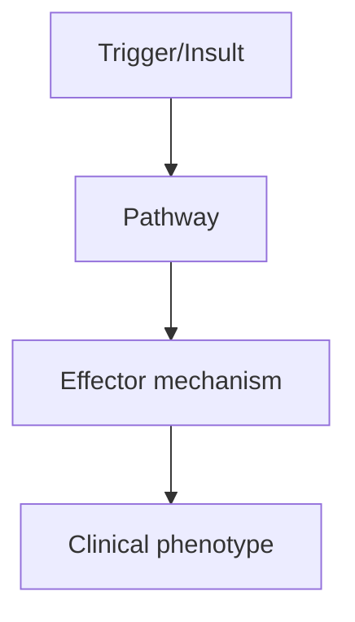
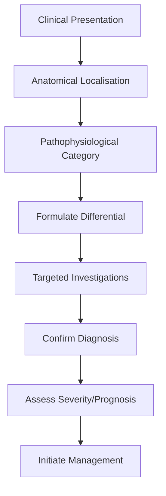
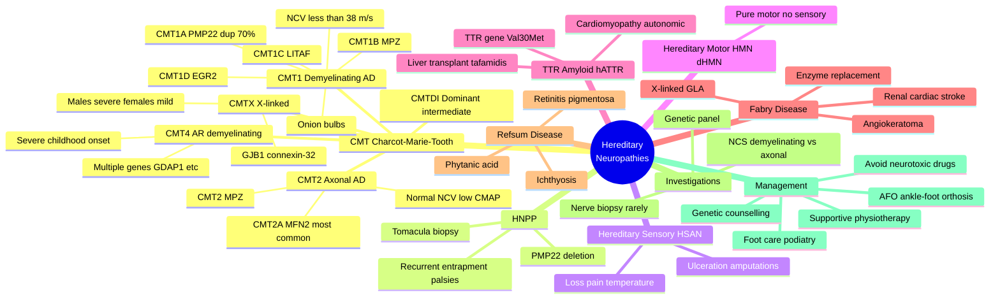

# Hereditary Neuropathies

> [!tip] **High-Yield Definition**
> Hereditary neuropathies: heterogeneous group of genetic neuropathies. CMT (Charcot-Marie-Tooth) most common. CMT1 (demyelinating, AD), CMT2 (axonal, AD), CMTX (X-linked, GJB1), CMT4 (AR, demyelinating, severe). Other: HNPP, hereditary sensory neuropathy, Fabry, TTR amyloid, leukodystrophies with neuropathy, mitochondrial.

---

## 1. Definition / Epidemiology / Classification

### Definition
Hereditary neuropathies: heterogeneous group of genetic neuropathies. CMT (Charcot-Marie-Tooth) most common. CMT1 (demyelinating, AD), CMT2 (axonal, AD), CMTX (X-linked, GJB1), CMT4 (AR, demyelinating, severe). Other: HNPP, hereditary sensory neuropathy, Fabry, TTR amyloid, leukodystrophies with neuropathy, mitochondrial.

### Epidemiology
CMT: 1-2,500. CMT1 50%, CMT2 20%, CMTX 15%, others 15%. HNPP: 1/5,000. Hereditary sensory neuropathies: rare. TTR amyloid: 1/100,000 (V30M Portugal, endemic).

### Classification
| Variant | Key Features | Prognosis |
|---------|-------------|-----------|
| | | |

---

## 2. Aetiology / Pathophysiology

### Aetiology
CMT1 (demyelinating, AD): CMT1A (PMP22 duplication, 70%), CMT1B (MPZ), CMT1C (LITAF), CMT1D (EGR2). CMT2 (axonal, AD): CMT2A (MFN2, most common), CMT2B (RAB7), CMT2C (TRPV4), CMT2D (GARS), CMT2E (NEFL), CMT2F (HSPB1), CMT2K (GDAP1), CMT2L (HSPB8), CMT2N (AARS), CMT2S (IGHMBP2), CMT2T (DNAJB1). CMTX (X-linked, GJB1, connexin-32). CMT4 (AR, demyelinating, severe): CMT4A (GDAP1), CMT4B1 (MTMR2), CMT4C (SH3TC2), CMT4D (NDRG1), CMT4F (PRX), CMT4J (FIG4). HNPP: PMP22 deletion. Others: hereditary sensory (SPTLC1, SPTLC2, ATL3, DNMT1, SCN9A), Fabry (GLA), TTR amyloid (TTR), mitochondrial (MFN2, POLG).

### Pathophysiology

---

## 3. Clinical Features

### History
- **Onset/Duration:**
- **Progression:**
- **Key symptoms:**
- **Triggers:**
- **Systemic symptoms:**
- **Drug/Family/Social history:**

### Examination
| Domain | Key Findings | Localisation Value |
|--------|-------------|-------------------|
| | | |

### Specific Clinical Features
CMT: distal weakness, wasting (inverted champagne bottle, pes cavus, hammer toes), sensory loss (vibration, proprioception), decreased or absent reflexes, foot drop, high-arched palate, scoliosis. Onset: childhood, slow progression. CMT1: demyelinating (slow NCV <38 m/s), onion bulbs on biopsy. CMT2: axonal (normal NCV, reduced CMAP). CMTX: variable, males worse, females milder. CMT4: AR, severe, early onset. HNPP: recurrent entrapment neuropathies, tomaculous neuropathy. Hereditary sensory: loss of pain sensation, foot ulcers, injuries. Fabry: small fibre pain, angiokeratomas, renal, cardiac, stroke. TTR amyloid: peripheral neuropathy, autonomic, cardiomyopathy.

---

## 4. Diagnostic Approach / Algorithm

---

## 5. Investigations

Clinical: distal weakness, wasting, pes cavus, hammer toes, family history (AD, X-linked), slow progression. NCS: demyelinating (slow NCV <38 m/s, prolonged distal latencies - CMT1), axonal (normal NCV, reduced CMAP - CMT2), intermediate (25-45 m/s - CMTX). EMG: chronic neurogenic changes. Genetic testing: CMT panels, single gene (PMP22 dup/del - CMT1A, HNPP), MFN2 (CMT2A), GJB1 (CMTX), MPZ (CMT1B/2), GARS (CMT2D), SPTLC1 (HSN1), GLA (Fabry), TTR (amyloid). Nerve biopsy: demyelination/remyelination, onion bulbs (CMT1), tomacula (HNPP). Bloods: B12, glucose, autoimmune, SPEP/IF (paraprotein). MRI feet/legs: muscle atrophy, fatty infiltration. Family screening.

---

## 6. Differential Diagnosis

| Differential | Distinguishing Features | Key Test |
|--------------|------------------------|----------|
| | | |

---

## 7. Management

Supportive: physiotherapy, OT, orthotics (ankle-foot orthosis AFO, walking aids, wheelchair), exercise (maintain strength, prevent contractures), foot care (podiatry, ulcer prevention), scoliosis monitoring, hand function (splints, OT). Multidisciplinary: neurologist, geneticist, PT, OT, orthotist, podiatrist, orthopaedic (foot deformity surgery - osteotomy, tendon transfer, triple arthrodesis), genetic counselling. No disease-modifying therapy for CMT. Investigational: PXT3003 (CMT1A, mixed results), gene therapy, ASO. Fabry: enzyme replacement (agalsidase alfa, beta), oral chaperone (migalastat), substrate reduction. TTR: patisiran, inotersen, tafamidis (silencer, TTR stabiliser). CMTX: family screening, female carrier monitoring. HNPP: avoid pressure on nerves, entrapment prevention.

---

## 8. Drug Interactions / Contraindications / Comorbidity Cautions

| Drug | Interaction / Caution | Management |
|------|----------------------|------------|
| | | |

---

## 9. Procedures (if applicable)

### Procedure:
- **Indications:**
- **Contraindications:**
- **Preparation / Principle:**
- **Complications:**
- **Viva Pearls:**

---

## 10. Complications

| Complication | Frequency | Prevention / Monitoring | Management |
|--------------|-----------|------------------------|------------|
| | | | |

---

## 11. Red Flags / Emergencies

Acute worsening (consider CIDP, autoimmune, inflammatory, superimposed compressive, drug-induced), cardiac involvement (CMT1 with PR interval, Fabry, TTR), respiratory (intercostal in severe CMT2, scoliosis), scoliosis surgery, pressure sores, falls, fractures, autonomic (Fabry, TTR), SIADH (CMTX, GJB1).

---

## 12. Prognosis

Generally normal life expectancy, slow progression. Severe forms (CMT4, DSN): wheelchair-bound, severe disability. CMTX: females usually mild, males more severe. Fabry, TTR: shortened life expectancy (renal, cardiac, neuropathy progression). Multidisciplinary care essential. Genetic counselling for family planning.

---

## 13. Topic Correlation

| Related Topic | Link | Key Overlap |
|---------------|------|-------------|
| | | |

---

## 14. Special Situations

| Situation | Consideration |
|-----------|---------------|
| **Pregnancy** | |
| **Lactation** | |
| **Paediatric** | |
| **Elderly / Frail** | |
| **Renal impairment** | |
| **Hepatic impairment** | |
| **Immunocompromised** | |
| **Perioperative** | |
| **Driving / DVLA** | |
| **Occupational** | |

---

## FCPS/MRCP High-Yield Summary

| Category | Key Points |
|----------|------------|
| **Definition** | Hereditary neuropathies: heterogeneous group of genetic neuropathies. CMT (Charcot-Marie-Tooth) most common. CMT1 (demyelinating, AD), CMT2 (axonal, AD), CMTX (X-linked, GJB1), CMT4 (AR, demyelinating |
| **Epidemiology** | CMT: 1-2,500. CMT1 50%, CMT2 20%, CMTX 15%, others 15%. HNPP: 1/5,000. Hereditary sensory neuropathies: rare. TTR amyloid: 1/100,000 (V30M Portugal, e |
| **Pathophysiology** | |
| **Clinical** | CMT: distal weakness, wasting (inverted champagne bottle, pes cavus, hammer toes), sensory loss (vibration, proprioception), decreased or absent reflexes, foot drop, high-arched palate, scoliosis. Ons |
| **Diagnosis** | |
| **Investigations** | Clinical: distal weakness, wasting, pes cavus, hammer toes, family history (AD, X-linked), slow progression. NCS: demyelinating (slow NCV <38 m/s, prolonged distal latencies - CMT1), axonal (normal NC |
| **Management** | Supportive: physiotherapy, OT, orthotics (ankle-foot orthosis AFO, walking aids, wheelchair), exercise (maintain strength, prevent contractures), foot care (podiatry, ulcer prevention), scoliosis moni |
| **Complications** | |
| **Prognosis** | Generally normal life expectancy, slow progression. Severe forms (CMT4, DSN): wheelchair-bound, severe disability. CMTX: females usually mild, males more severe. Fabry, TTR: shortened life expectancy  |
| **Viva Pearls** | |
| **Drug Doses** | |
| **Scoring Systems** | |
| **Genetics** | |
| **Imaging Signs** | |

---

## Viva Questions (PACES/FCPS Style)

1. **Q:** Define Hereditary Neuropathies and classify its variants.
   **A:** Based on the definition above.

2. **Q:** What are the key clinical features?
   **A:** CMT: distal weakness, wasting (inverted champagne bottle, pes cavus, hammer toes), sensory loss (vibration, proprioception), decreased or absent reflexes, foot drop, high-arched palate, scoliosis. Onset: childhood, slow progression. CMT1: demyelinating (slow NCV <38 m/s), onion bulbs on biopsy. CMT2

3. **Q:** What is the first-line treatment?
   **A:** Based on the management section.

4. **Q:** What are the red flags requiring urgent referral?
   **A:** Acute worsening (consider CIDP, autoimmune, inflammatory, superimposed compressive, drug-induced), cardiac involvement (CMT1 with PR interval, Fabry, TTR), respiratory (intercostal in severe CMT2, scoliosis), scoliosis surgery, pressure sores, falls, fractures, autonomic (Fabry, TTR), SIADH (CMTX, G

5. **Q:** What is the prognosis?
   **A:** Generally normal life expectancy, slow progression. Severe forms (CMT4, DSN): wheelchair-bound, severe disability. CMTX: females usually mild, males more severe. Fabry, TTR: shortened life expectancy (renal, cardiac, neuropathy progression). Multidisciplinary care essential. Genetic counselling for 

6. **Q:** How do you differentiate Hereditary Neuropathies from key differentials?
   **A:** Clinical features, investigations, and response to treatment.

7. **Q:** What investigations are most useful?
   **A:** Based on the investigations section.

8. **Q:** Describe the stepwise management approach.
   **A:** Based on the management algorithm.

9. **Q:** What are the emergency presentations?
   **A:** Based on the red flags section.

10. **Q:** How does management change in pregnancy/paediatrics/elderly?
    **A:** Special considerations per population.

---

## Common Confusions / Exam Traps

| Confusion | Clarification |
|-----------|---------------|
| | |

---

## Mnemonics

1. **"CMT - Can't Move Toes"** — Charcot-Marie-Tooth disease classically presents with distal weakness affecting foot/ankle dorsiflexion, causing foot drop and difficulty with toe movement.
2. **"1 = Demyelinating (slow), 2 = Axonal"** — CMT1 (demyelinating, NCV <38 m/s, onion bulbs); CMT2 (axonal, normal NCV, low CMAP); CMTX (X-linked, GJB1); CMT4 (autosomal recessive, severe).
3. **"PMP-22 = PeriMyelin Protein 22"** — Duplication of PMP22 on chromosome 17p11.2 → CMT1A (most common form, ~70% of CMT1); deletion → HNPP (tomaculous/sausage-shaped myelin on biopsy).
4. **"Onion Bulbs = CMT1, Tomacula = HNPP"** — Onion bulbs = repeated demyelination/remyelination (Schwann cell proliferation). Tomacula = focal myelin thickenings (sausage-shaped) seen in HNPP.
5. **"Inverted Champagne Glass"** — Classic appearance of legs in CMT due to selective wasting of distal lower limbs (below knee) with preserved thigh bulk.

---

## Mind Map

---

## Spaced Repetition Trackers

| **Day** | **Recall Goal** | **Self-Test Method** |
|---------|-----------------|---------------------|
| **Day 1** | Definition + CMT1/CMT2/CMTX classification, basic epidemiology (1/2,500) | Write out classification table from memory |
| **Day 3** | Genes: PMP22 (CMT1A, HNPP), MPZ, GJB1, MFN2, LITAF, EGR2 | Match gene → phenotype flashcards |
| **Day 7** | Clinical features: inverted champagne bottle, pes cavus, hammer toes, foot drop, scoliosis | Sketch foot + leg appearance, list 6 features |
| **Day 14** | NCS findings: CMT1 (NCV <38 m/s, uniform slowing), CMT2 (normal NCV, low CMAP), HNPP (prolonged distal latencies at entrapment sites) | Draw NCS trace; interpret NCV |
| **Day 30** | Differential: CIDP (treatable!), diabetic, CMTX vs CMT1 inheritance/genetics | Compare/contrast table; management urgency |
| **Day 90** | HNPP, HSAN, TTR (treatment: tafamidis, patisiran, liver transplant), Fabry, supportive Rx, genetic counselling | Full clinical vignette practice; viva questions |

---

## Self-Test Scorecard

| **#** | **Topic** | **Score /5** | **Notes** |
|-------|-----------|--------------|-----------|
| 1 | Definition & Classification (CMT1/2/X/4, HNPP) | | |
| 2 | Genetics (PMP22, MPZ, GJB1, MFN2, LITAF) | | |
| 3 | Clinical Features (pes cavus, inverted champagne, foot drop) | | |
| 4 | Investigations (NCS: demyelinating vs axonal, genetic panel) | | |
| 5 | Differential Diagnosis (CIDP, diabetic, HSAN) | | |
| 6 | Management (AFO, PT, foot care, genetic counselling) | | |
| 7 | Red Flags (acute worsening → superimposed CIDP/entrapment) | | |
| 8 | Prognosis (normal life expectancy, severe CMT4 wheelchair) | | |
| 9 | HNPP (PMP22 deletion, tomacula, recurrent entrapment) | | |
| 10 | TTR Amyloid & Fabry (multisystem, treatable, hATTR Rx) | | |
| | **Total /50** | | |

---

## MCQs (10)

1. **A 30-year-old man has slowly progressive bilateral foot drop, pes cavus, and inverted champagne glass legs since childhood. His mother has high-arched feet. Upper-limb motor nerve conduction velocity is 28 m/s. What is the most likely diagnosis?**
   - A. CMT2A
   - B. CMT1A
   - C. Charcot-Marie-Tooth type X (CMTX)
   - D. Chronic inflammatory demyelinating polyneuropathy (CIDP)
   - **Answer: B** — NCV <38 m/s = demyelinating = CMT1. Mother with pes cavus = AD inheritance. CMT1A (PMP22 duplication) is most common; CIDP would progress faster without family history.

2. **Charcot-Marie-Tooth type 2 (CMT2) is best described as:**
   - A. Autosomal dominant, demyelinating, NCV <38 m/s
   - B. Autosomal dominant, axonal, with normal nerve conduction velocity but low CMAP amplitudes
   - C. X-linked, due to GJB1 (connexin-32) mutation
   - D. Autosomal recessive demyelinating with childhood wheelchair use
   - **Answer: B** — CMT2 is an axonal (not demyelinating) neuropathy with normal NCV but reduced motor amplitudes; most common gene MFN2 (CMT2A).

3. **Nerve biopsy in a patient with CMT1A characteristically demonstrates:**
   - A. Tomacula (sausage-shaped myelin thickenings)
   - B. Onion-bulb formations from repeated demyelination/remyelination
   - C. Fibrinoid necrosis of vasa nervorum
   - D. Amyloid deposits on Congo red staining
   - **Answer: B** — Onion bulbs = concentric Schwann cell processes around axons after repeated demyelination. Tomacula = HNPP. Amyloid = TTR/Familial Amyloid Polyneuropathy.

4. **A 35-year-old woman has had three episodes of unilateral wrist drop and foot drop over 5 years, each after minor pressure (leaning on elbows, crossing legs). NCS shows prolonged distal motor latencies at multiple entrapment sites with otherwise preserved responses. What is the diagnosis?**
   - A. CMT1A (PMP22 duplication)
   - B. Multifocal motor neuropathy
   - C. Hereditary neuropathy with liability to pressure palsies (HNPP)
   - D. CIDP
   - **Answer: C** — HNPP from PMP22 deletion causes tomacula and recurrent entrapment palsies after trivial pressure. PMP22 duplication would give CMT1A (uniform demyelination).

5. **CMTX is caused by mutation in which gene?**
   - A. PMP22
   - B. MPZ (P0)
   - C. GJB1 (connexin-32)
   - D. MFN2
   - **Answer: C** — GJB1 encodes connexin-32, an X-linked gap junction protein in Schwann cells. Males are severely affected, females typically milder (X-inactivation).

6. **A 60-year-old man with progressive peripheral neuropathy, autonomic dysfunction, and cardiomyopathy has a TTR gene mutation (Val30Met). What class of disease-modifying therapy is available?**
   - A. IVIG
   - B. Tafamidis (TTR stabilizer) or patisiran/siRNA
   - C. High-dose corticosteroids
   - D. Plasmapheresis
   - **Answer: B** — TTR amyloid has specific Rx: tafamidis (ATTR-ACT trial), patisiran/inotersen (RNAi/ASO), and liver transplant (TTR made in liver).

7. **Which feature most strongly suggests a superimposed CIDP rather than baseline CMT?**
   - A. Positive family history
   - B. Pes cavus present from childhood
   - C. Subacute motor decline over weeks/months with proximal weakness and abnormal CSF protein
   - D. Uniformly slowed NCV <30 m/s in upper limbs since adolescence
   - **Answer: C** — CIDP is treatable; rapid worsening, proximal involvement, and CSF albuminocytologic dissociation suggest CIDP superimposed on CMT.

8. **A 4-year-old child from consanguineous parents develops severe distal weakness, foot deformities, and is wheelchair-bound by age 10. NCV is severely slowed (<15 m/s). Most likely inheritance and type?**
   - A. CMT2A (MFN2)
   - B. CMT1A (PMP22 duplication)
   - C. CMT4 (autosomal recessive demyelinating)
   - D. CMTX (GJB1)
   - **Answer: C** — CMT4 is AR (consanguinity), severe demyelinating, childhood onset, often wheelchair-bound. Multiple genes (GDAP1, SH3TC2, etc.).

9. **First-line supportive management for foot drop in CMT1 is:**
   - A. Oral prednisolone
   - B. Ankle-foot orthosis (AFO) and physiotherapy
   - C. Plasmapheresis
   - D. IVIG
   - **Answer: B** — CMT is genetic and progressive; treatment is supportive: AFO, PT, OT, orthotics, foot care, exercise, scoliosis monitoring. No disease-modifying drug.

10. **Fabry disease is best described as:**
    - A. Autosomal dominant demyelinating neuropathy with optic atrophy
    - B. X-linked lysosomal storage disorder (α-galactosidase A deficiency) causing angiokeratoma, neuropathic pain, renal failure, and cardiac/cerebrovascular disease
    - C. Autosomal recessive axonal neuropathy with high-arched palate
    - D. Mitochondrial disorder with CPEO and stroke-like episodes
    - **Answer: B** — Fabry: X-linked GLA gene; angiokeratomas (bathing trunk), neuropathic pain (acroparesthesia), renal failure, LVH, stroke; enzyme replacement therapy (agalsidase alfa/beta).

---

## SBA Questions (10)

1. **A 22-year-old asymptomatic man is found on family screening to have a PMP22 duplication. NCV shows 30 m/s in upper limbs. What is his most likely diagnosis?**
   - A. CMT1A
   - B. CMT2A
   - C. HNPP
   - D. CMTX
   - E. CIDP
   - **Answer: A** — PMP22 duplication = CMT1A. Slow NCV <38 m/s confirms demyelinating form.

2. **"Onion-bulb" formations on nerve biopsy result from:**
   - A. Amyloid deposition in endoneurium
   - B. Concentric Schwann cell processes after repeated demyelination/remyelination
   - C. Focal myelin thickenings (tomacula)
   - D. Vasculitis of vasa nervorum
   - E. Macrophage infiltration
   - **Answer: B** — Pathognomonic of chronic demyelination (CMT1, Dejerine-Sottas).

3. **A patient with known CMT presents with a 2-week progressive proximal weakness and areflexia in all four limbs with elevated CSF protein. The most appropriate next step is:**
   - A. Reassure — typical CMT progression
   - B. Genetic re-testing only
   - C. Treat as superimposed CIDP (steroids/IVIG) — CMT alone does not have proximal weakness or raised CSF protein
   - D. Nerve biopsy for tomacula
   - E. Tafamidis trial
   - **Answer: C** — Treatable superimposed CIDP must be ruled out when CMT acutely worsens; CSF protein elevated and proximal weakness is atypical for CMT alone.

4. **TTR amyloid polyneuropathy (hATTR) is best treated with:**
   - A. IVIG
   - B. Tafamidis, patisiran, or liver transplant
   - C. Plasmapheresis
   - D. Corticosteroids
   - E. Cyclophosphamide
   - **Answer: B** — Disease-modifying therapies target TTR: stabilizers (tafamidis, diflunisal), gene silencers (patisiran, inotersen), or liver transplant.

5. **CMTX is associated with:**
   - A. No male-to-male transmission; severe disease in males, mild in females
   - B. Autosomal dominant inheritance with male-to-male transmission
   - C. Mitochondrial inheritance pattern
   - D. Autosomal recessive inheritance with consanguinity
   - E. New mutation only
   - **Answer: A** — X-linked dominant; hemizygous males more severely affected.

6. **The most useful first-line genetic test in a patient suspected of CMT is:**
   - A. Whole-genome sequencing
   - B. Targeted neuropathy panel including PMP22 (duplication/deletion), GJB1, MPZ, MFN2
   - C. Single-gene testing only
   - D. Karyotype
   - E. Mitochondrial DNA sequencing only
   - **Answer: B** — Targeted panel most cost-effective; PMP22 MLPA (detects duplication in CMT1A and deletion in HNPP) is essential first step.

7. **Pes cavus in CMT results from:**
   - A. Cerebellar ataxia
   - B. Imbalance between intrinsic foot muscles (wasted) and long extensors (preserved) pulling the foot into a high-arched posture
   - C. Spasticity of calf muscles
   - D. Peripheral oedema
   - E. Charcot joint
   - **Answer: B** — Intrinsic foot muscle wasting → unopposed long extensor tendons → high arch and hammer toes.

8. **A 25-year-old man with CMT1A develops acute foot drop after sitting cross-legged for 2 hours. The most likely additional diagnosis contributing to this episode is:**
   - A. CIDP
   - B. Common peroneal nerve palsy at fibular head due to compression
   - C. Stroke
   - D. TIA
   - E. MS relapse
   - **Answer: B** — Patients with CMT are especially prone to entrapment neuropathies because of underlying demyelination (and additional tomacula if HNPP coexists).

9. **Refsum disease is characterized by:**
   - A. Elevated phytanic acid, retinitis pigmentosa, ichthyosis, and sensorimotor neuropathy
   - B. Tendon xanthomas and familial hypercholesterolaemia
   - C. Self-mutilation and loss of pain sensation
   - D. Angiokeratoma and renal failure
   - E. Hepatosplenomegaly and storage of GM1 ganglioside
   - **Answer: A** — Refsum = AR PHYH gene, phytanic acid accumulation, ataxia, RP, ichthyosis, cardiac arrhythmias; treated with dietary restriction and plasmapheresis.

10. **An 18-year-old with progressive CMT is offered genetic counselling. The most appropriate statement is:**
    - A. All children of an affected parent with autosomal dominant CMT1A have a 100% risk
    - B. Each child of an affected AD parent has 50% risk; severity can vary (anticipation absent in CMT1A); prenatal/preimplantation testing possible
    - C. CMT is contagious
    - D. CMT is curable with gene therapy
    - E. Female carriers of CMTX never develop symptoms
    - **Answer: B** — AD = 50% transmission per child. No anticipation in CMT1A. CMTX females can have symptoms (variable due to X-inactivation).

---

## Tags

#neurology #peripheral-neuropathy #hereditary-neuropathy #CMT #Charcot-Marie-Tooth #HNPP #TTR-amyloid #Fabry #FCPS #MRCP #genetics

## Local Navigation
**Heading Hub:** [[../Hub]]  
**Chapter Hierarchy:** [[Davidson Chapter 25 - Neurology Hierarchy]]  
**Chapter MOC:** [[Neurology MOC]]  
**Drug Reference:** [[../00_Index/Neurology Drug Reference]]  
