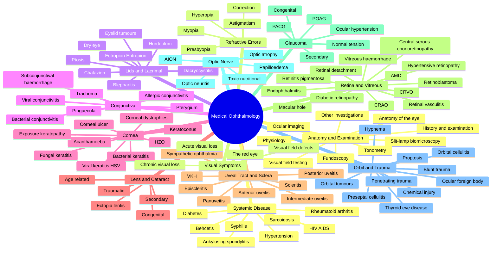

# Davidson Chapter 27 - Medical Ophthalmology Hierarchy

---
tags: [medicine, ophthalmology, davidson, hierarchy, fcps, mrcp]
davidson_part: Part 3: Clinical Medicine
davidson_chapter: Chapter 27: Medical ophthalmology
status: full-fcps-mrcp-hub
total_heading_hubs: 13
total_disease_level_topics: 97
created: 2026-06-16
modified: 2026-06-17
---

# Davidson Chapter 27: Medical Ophthalmology — Topic Hierarchy

> **Source:** Davidson's Principles and Practice of Medicine, 24th Edition, Chapter 27: Medical ophthalmology
> **Part:** Part 3: Clinical Medicine
> **Target:** FCPS / MRCP Part 1, Part 2, PACES

---

## Hierarchy Structure

### 1. Anatomy, Physiology & Clinical Examination (9 Disease Topics)

#### 1.1 Anatomy of the Eye
- Bony orbit and orbital contents
- Eyeball (tunics: outer fibrous, middle vascular, inner neural)
- Anterior and posterior chambers
- Visual pathway (retina → optic nerve → chiasm → tract → LGN → optic radiations → cortex)

#### 1.2 Physiology of the Eye
- Aqueous humour production and drainage
- Corneal transparency
- Visual transduction (rods and cones)
- Accommodation and the pupillary light reflex

#### 1.3 Ophthalmic History & Examination
- Ophthalmic history (presenting symptoms: red eye, pain, visual loss, diplopia)
- Visual acuity testing (Snellen, LogMAR)
- Pupillary examination (RAPD, swinging flashlight)
- External eye examination
- Confrontation visual fields

#### 1.4 Slit-lamp Biomicroscopy
- Anterior segment examination technique
- Corneal and lens assessment

#### 1.5 Tonometry
- Goldmann applanation tonometry
- Non-contact (air-puff) tonometry

#### 1.6 Fundoscopy (Ophthalmoscopy)
- Direct ophthalmoscopy technique
- Indirect ophthalmoscopy
- Red reflex assessment
- Optic disc and cup:disc ratio

#### 1.7 Ocular Imaging
- Optical coherence tomography (OCT)
- Fundus fluorescein angiography (FFA)
- Ocular ultrasound (B-scan)
- Corneal topography

#### 1.8 Visual Field Testing
- Perimetry (Humphrey, Goldmann)
- Visual field defect patterns

#### 1.9 Other Investigations
- Lacrimal system assessment (syringing, dye disappearance)
- Electroretinography (ERG)
- Visual evoked potentials (VEP)

---

### 2. Refractive Errors (5 Disease Topics)

#### 2.1 Myopia
- Simple myopia
- Pathological/degenerative myopia
- Myopia progression in children

#### 2.2 Hyperopia
- Latent and manifest hyperopia

#### 2.3 Astigmatism
- Regular vs irregular astigmatism
- Keratoconus as cause

#### 2.4 Presbyopia
- Age-related loss of accommodation

#### 2.5 Correction of Refractive Errors
- Spectacles
- Contact lenses (soft, RGP, scleral)
- Refractive surgery (LASIK, PRK, ICL, refractive lens exchange)

---

### 3. Lids & Lacrimal Apparatus (8 Disease Topics)

#### 3.1 Blepharitis
- Anterior blepharitis (staphylococcal, seborrhoeic)
- Posterior blepharitis (meibomian gland dysfunction)

#### 3.2 Chalazion (Meibomian Cyst)
- Chronic lipogranulomatous inflammation

#### 3.3 Hordeolum (Stye)
- External (glands of Zeis/Moll) and internal (meibomian)

#### 3.4 Ectropion & Entropion
- Involutional, cicatricial, paralytic
- Trichiasis

#### 3.5 Ptosis
- Aponeurotic, neurogenic (CN III), myogenic (myasthenia), mechanical

#### 3.6 Dry Eye Disease (Keratoconjunctivitis Sicca)
- Aqueous-deficient and evaporative subtypes

#### 3.7 Dacryocystitis
- Acute and chronic
- Nasolacrimal duct obstruction

#### 3.8 Eyelid Tumours
- Basal cell carcinoma (most common)
- Squamous cell carcinoma
- Sebaceous gland carcinoma
- Malignant melanoma
- Benign lesions (papilloma, naevus, xanthelasma)

---

### 4. Conjunctiva (7 Disease Topics)

#### 4.1 Bacterial Conjunctivitis
- Acute purulent conjunctivitis
- Neonatal conjunctivitis (ophthalmia neonatorum)

#### 4.2 Viral Conjunctivitis
- Adenoviral (epidemic keratoconjunctivitis)
- Acute haemorrhagic conjunctivitis

#### 4.3 Allergic Conjunctivitis
- Seasonal, perennial, vernal, atopic

#### 4.4 Pterygium
- Wing-shaped fibrovascular growth

#### 4.5 Pinguecula
- Yellowish conjunctival deposit

#### 4.6 Subconjunctival Haemorrhage
- Spontaneous, traumatic, Valsalva

#### 4.7 Trachoma
- Chlamydia trachomatis A–C
- Leading infectious cause of blindness worldwide

---

### 5. Cornea (9 Disease Topics)

#### 5.1 Bacterial Keratitis
- Common organisms, contact lens related

#### 5.2 Viral Keratitis
- Herpes simplex dendritic ulcer
- Herpes zoster ophthalmicus

#### 5.3 Fungal Keratitis
- Filamentous and yeast

#### 5.4 Acanthamoeba Keratitis
- Contact lens–associated

#### 5.5 Keratoconus
- Ectatic corneal disorder
- Acute hydrops

#### 5.6 Corneal Dystrophies
- Epithelial, stromal, endothelial (Fuchs)

#### 5.7 Corneal Ulcer
- Marginal, central, Mooren's (peripheral)

#### 5.8 Herpes Zoster Ophthalmicus
- V1 distribution, Hutchinson sign

#### 5.9 Exposure Keratopathy
- Incomplete lid closure (CN VII palsy, proptosis)

---

### 6. Lens & Cataract (5 Disease Topics)

#### 6.1 Age-related Cataract
- Nuclear, cortical, posterior subcapsular

#### 6.2 Congenital Cataract
- Idiopathic, hereditary, intrauterine infection (rubella), galactosemia

#### 6.3 Traumatic Cataract
- Blunt or penetrating injury

#### 6.4 Secondary Cataract
- Diabetes, steroids, uveitis

#### 6.5 Ectopia Lentis
- Marfan, homocystinuria, Weill-Marchesani, trauma

---

### 7. Uveal Tract — Uveitis & Sclera (8 Disease Topics)

#### 7.1 Anterior Uveitis (Iritis / Iridocyclitis)
- Idiopathic, HLA-B27, JIA, sarcoid
- Keratic precipitates, hypopyon, synechiae

#### 7.2 Posterior Uveitis (Choroiditis / Chorioretinitis)
- Toxoplasmosis, CMV, HSV/VZV

#### 7.3 Intermediate Uveitis
- Pars planitis

#### 7.4 Panuveitis
- Sarcoidosis, TB, syphilis, VKH

#### 7.5 Sympathetic Ophthalmia
- Bilateral granulomatous uveitis after penetrating injury

#### 7.6 Vogt-Koyanagi-Harada Syndrome
- Bilateral panuveitis, meningismus, vitiligo, alopecia, tinnitus

#### 7.7 Scleritis (NEW)
- Anterior 95% (diffuse, nodular, necrotising ± inflammation)
- Posterior 5% (T-sign on B-scan)
- Scleromalacia perforans (RA, painless)
- PUK (peripheral ulcerative keratitis)
- 50% systemic disease (RA, GPA, SLE)
- T-sign, phenylephrine test (no blanch)

#### 7.8 Episcleritis (NEW)
- Superficial vascular plexus inflammation
- Benign, self-limiting, recurrent
- Phenylephrine vessels BLANCH
- Mobile nodule (vs fixed scleritis nodule)
- No vision loss (vs scleritis)

---

### 8. Retina & Vitreous (13 Disease Topics)

#### 8.1 Diabetic Retinopathy
- NPDR (mild/moderate/severe)
- PDR
- Diabetic maculopathy

#### 8.2 Hypertensive Retinopathy
- AV nicking, cotton wool, papilloedema (Grade IV)

#### 8.3 Age-related Macular Degeneration (AMD)
- Dry (drusen, GA)
- Wet (CNV)

#### 8.4 Retinal Detachment
- Rhegmatogenous
- Tractional
- Exudative

#### 8.5 Central Retinal Artery Occlusion (CRAO)
- Cherry-red spot, GCA workup

#### 8.6 Central Retinal Vein Occlusion (CRVO)
- Blood and thunder fundus, ischaemic vs non-ischaemic

#### 8.7 Retinitis Pigmentosa
- Rod-cone dystrophy, bone spicule pigmentation

#### 8.8 Vitreous Haemorrhage
- PDR, retinal tear, trauma

#### 8.9 Macular Hole
- Stage 1–4

#### 8.10 Retinal Vasculitis
- Behçet's, sarcoid, SLE

#### 8.11 Retinoblastoma
- Childhood tumour, RB1 gene, leukocoria

#### 8.12 Endophthalmitis (NEW)
- Post-cataract (coag-neg Staph, 70%)
- EVS protocol: vitreous tap + vancomycin + ceftazidime
- Hypopyon + vitritis, "headlight in the fog"
- Endogenous: Candida (IVDU, immunocompromised)
- P. acnes: chronic low-grade

#### 8.13 Central Serous Chorioretinopathy (NEW)
- Young male, type A, recent steroid use
- Micropsia, metamorphopsia, central scotoma
- Subretinal fluid + pachychoroid on OCT
- Inkblot (90%) / Smokestack (10%) leak on FFA
- 80-90% resolve spontaneously; PDT for chronic
- 30-50% recurrence

---

### 9. Glaucoma (6 Disease Topics)

#### 9.1 Primary Open-Angle Glaucoma (POAG)
- Chronic progressive optic neuropathy
- IOP, cup:disc, field loss

#### 9.2 Primary Angle-Closure Glaucoma (PACG)
- Acute and chronic (intermittent)
- Pupillary block mechanism

#### 9.3 Secondary Glaucoma
- Pseudoexfoliation, pigment dispersion, neovascular, uveitic, traumatic, steroid

#### 9.4 Congenital / Developmental Glaucoma
- Primary congenital glaucoma
- Associated syndromes (Sturge-Weber, Axenfeld-Rieger)

#### 9.5 Normal-Tension Glaucoma (NTG)
- IOP <21 with glaucomatous damage

#### 9.6 Ocular Hypertension
- Elevated IOP without damage

---

### 10. Optic Nerve (5 Disease Topics)

#### 10.1 Optic Neuritis
- Demyelinating, post-viral
- Painful, RAPD, ↓colour vision

#### 10.2 Anterior Ischaemic Optic Neuropathy (AION)
- Arteritic (GCA) vs non-arteritic

#### 10.3 Papilloedema
- Bilateral disc swelling from raised ICP
- False localising sign

#### 10.4 Optic Atrophy
- Primary vs secondary
- Causes: MS, GCA, hereditary (Leber), toxic

#### 10.5 Toxic / Nutritional Optic Neuropathies
- Methanol, ethambutol, B12 deficiency, tobacco-alcohol amblyopia

---

### 11. Orbit & Ocular Trauma (9 Disease Topics)

#### 11.1 Preseptal Cellulitis
- Eyelid infection anterior to orbital septum

#### 11.2 Orbital Cellulitis
- Post-septal, usually from sinus disease
- Emergency

#### 11.3 Thyroid Eye Disease (Graves' Ophthalmopathy)
- Proptosis, lid retraction, EOM restriction, optic neuropathy
- Clinical activity score

#### 11.4 Orbital Tumours
- Adult: cavernous haemangioma, lymphoma, meningioma, metastases
- Paediatric: rhabdomyosarcoma, dermoid

#### 11.5 Proptosis (Approach)
- Unilateral vs bilateral
- Pulsatile, intermittent, axial vs non-axial

#### 11.6 Chemical Injury
- Acid vs alkali
- Emergency irrigation

#### 11.7 Ocular Foreign Body
- Corneal, intraorbital, intraocular

#### 11.8 Blunt Ocular Trauma
- Hyphema, commotio retinae, blowout fracture

#### 11.9 Penetrating Ocular Trauma / Globe Rupture
- Surgical emergency, endophthalmitis risk

---

### 12. Ocular Manifestations of Systemic Disease (8 Disease Topics)

#### 12.1 Diabetes Mellitus
- Retinopathy, maculopathy, cataract, rubeosis, cranial nerve palsies (III, IV, VI)

#### 12.2 Hypertension
- Hypertensive retinopathy, choroidopathy, optic neuropathy

#### 12.3 HIV / AIDS
- CMV retinitis, HIV retinopathy, KS, Molluscum

#### 12.4 Sarcoidosis
- Uveitis, lacrimal gland enlargement, conjunctival granuloma

#### 12.5 Syphilis
- Uveitis, chorioretinitis, optic atrophy (Argyll Robertson)

#### 12.6 Rheumatoid Arthritis
- Keratoconjunctivitis sicca, scleritis, peripheral ulcerative keratitis

#### 12.7 Ankylosing Spondylitis & Reactive Arthritis
- Acute anterior uveitis (HLA-B27)

#### 12.8 Behçet's Disease (Ocular) (NEW)
- Classic triad: oral ulcers + genital ulcers + uveitis
- Bilateral recurrent panuveitis with hypopyon
- Retinal vasculitis (arteries AND veins)
- HLA-B51, Silk Road populations
- Pathergy test positive in ~50%
- First-line: systemic steroid + azathioprine
- Biologics (anti-TNF) for refractory

---

### 13. Visual Symptoms & Approach (4 Disease Topics)

#### 13.1 Acute Visual Loss (Approach)
- Painless: vitreous haemorrhage, retinal detachment, CRAO, CRVO, optic neuritis, ischaemic optic neuropathy
- Painful: optic neuritis, acute angle-closure, keratitis, uveitis, endophthalmitis

#### 13.2 Chronic Progressive Visual Loss
- Cataract, glaucoma, AMD, diabetic maculopathy

#### 13.3 The Red Eye (Approach)
- Conjunctivitis, keratitis, acute uveitis, acute angle-closure, scleritis, episcleritis

#### 13.4 Visual Field Defects & Pathway Lesions
- Altitudinal (AION)
- Arcuate / nasal step (glaucoma)
- Bitemporal hemianopia (chiasmal)
- Homonymous hemianopia (post-chiasmal)
- Cortical blindness

---

## Quick Navigation Commands

```bash
# Count full notes
search_files pattern="status: full-fcps-mrcp-note" target=content path="/mnt/tb/Medicine/Medical Ophthalmology"

# Count hubs
search_files pattern="status: full-fcps-mrcp-hub" target=content path="/mnt/tb/Medicine/Medical Ophthalmology"

# Count scaffolds (should be 0 when complete)
search_files pattern="status: scaffold" target=content path="/mnt/tb/Medicine/Medical Ophthalmology"

# List all .md files
find /mnt/tb/Medicine/Medical\ Ophthalmology -name "*.md" -type f | wc -l

# Git commit after batch
cd /mnt/tb/Medicine/Medical\ Ophthalmology && git add -A && git commit -m "Medical Ophthalmology: [batch description]" && git push
```


## Chapter Summary Mnemonics

These mnemonics cover the **whole chapter** (cross-topic, not a single disease):

1. **"Red Eye = 5 C's"** — Conjunctivitis, Corneal (keratitis), Ciliary (uveitis), Closed-angle (acute glaucoma), Scleritis
2. **"Acute Visual Loss = 5 C's of Blindness"** — CRAO, CRVO, Retinal Detachment, Optic Neuritis, GCA/AION
3. **"AAU = Always Acute, Unilateral"** (in HLA-B27) — recurrent, alternating, non-granulomatous
4. **"HLA-B27 = PAIR"** — Psoriatic arthritis, Ankylosing spondylitis, IBD, Reactive arthritis → AAU
5. **"GCA = Headache, Jaw claudication, Visual loss"** → urgent IV methylprednisolone + temporal artery biopsy
6. **"DR 4-2-1 = Severe NPDR"** — 4 quadrants IRH, 2 quadrants venous beading, 1 quadrant IRMA
7. **"EVS: Vitrectomy if Light Perception"** — Endophthalmitis Vitrectomy Study criterion
8. **"CSCR = CorticoSteroid Cause Retinopathy"** — stop steroids first
9. **"DR = Duration Drives Risk"** — most important risk factor is duration
10. **"IOP 10-21 = Normal; >21 + damage = Glaucoma"**


## Chapter Mind Map



## Tags
#medicine #davidson #ophthalmology #hierarchy #fcps #mrcp
