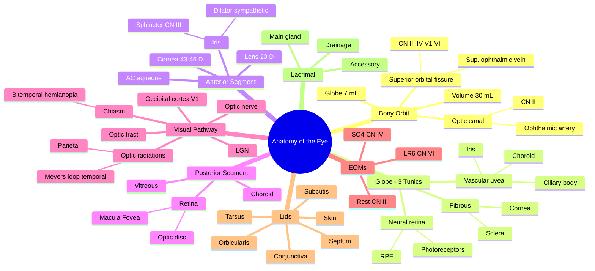

# Anatomy of the Eye

Related: [[Physiology of the Eye]], [[Ophthalmic History and Examination]], [[Visual Field Defects and Pathway Lesions]], [[Fundoscopy]], [[Medical Ophthalmology MOC]]

> [!tip] **FCPS/MRCP Priority: HIGH**
> Foundation topic. Most ocular clinical features map to specific anatomical structures. Know tunics, chambers, visual pathway, lid layers, and the innervation of extraocular muscles cold.

---

## Learning Objectives
- [ ] Describe the bony orbit, its walls, fissures and foramina
- [ ] List the tunics of the eyeball and the contents of each
- [ ] Identify the chambers of the eye and the structures within them
- [ ] Trace the visual pathway from retina to visual cortex
- [ ] Name the extraocular muscles and their innervation/actions
- [ ] Describe the eyelid layers and the lacrimal apparatus

## 1. Definition / Epidemiology

The eye is the sensory organ of vision, comprising the eyeball (globe), its protective adnexa (lids, lashes, lacrimal system), the extraocular muscles, and the visual pathway. Understanding anatomy underpins clinical examination and localisation of disease.

## 2. Anatomy

### 2.1 Bony Orbit
- **Shape:** Quadrilateral pyramid, base anterior, apex posterior
- **Volume:** ~30 mL; globe = 6.5–7 mL
- **Walls:**
  - Roof: frontal bone + lesser wing of sphenoid
  - Lateral wall: zygomatic + greater wing of sphenoid
  - Floor: maxilla + zygomatic + palatine
  - Medial wall: ethmoid (lamina papyracea), lacrimal, frontal, maxilla
- **Openings:**
  - Optic canal — optic nerve (CN II), ophthalmic artery
  - Superior orbital fissure — CN III, IV, V1, VI, superior ophthalmic vein, sympathetic fibres
  - Inferior orbital fissure — CN V2, inferior ophthalmic vein
  - Zygomatic, nasolacrimal, ethmoidal foramina

### 2.2 The Globe (Eyeball)
- **Diameter:** 24 mm (axial), slightly less in hyperopia, more in myopia
- **Three tunics (layers):**

| Tunic | Components | Function |
|-------|------------|----------|
| **Outer fibrous tunic** | Cornea (anterior 1/6) + sclera (posterior 5/6) | Mechanical protection, refraction (cornea) |
| **Middle vascular tunic (uvea)** | Iris + ciliary body + choroid | Nutrition, light regulation, aqueous production |
| **Inner neural tunic (retina)** | Neural retina + RPE | Photoreception, signal transduction |

### 2.3 Anterior Segment
- **Cornea:** transparent, avascular, 5 layers (epithelium, Bowman's, stroma, Descemet's, endothelium); 43–46 D refractive power
- **Anterior chamber:** between cornea and iris; depth 2.5–3.5 mm; contains aqueous
- **Iris:** pigmented diaphragm with central pupil; sphincter (CN III, miosis) and dilator (sympathetic, mydriasis)
- **Posterior chamber:** between iris and lens; contains aqueous
- **Lens:** biconvex, transparent, avascular; ~20 D refractive power; suspended by zonules from ciliary body

### 2.4 Posterior Segment
- **Vitreous body:** transparent gel (99% water, hyaluronic acid) filling posterior segment
- **Retina:** 10 layers; photoreceptors (rods ~120 million, cones ~6 million)
  - **Macula:** central 5–6 mm; **fovea** at centre (highest visual acuity, cone-only)
  - **Optic disc:** ~1.5 mm diameter; blind spot (no photoreceptors); physiological cup normally 0.3
- **Choroid:** vascular layer between RPE and sclera

### 2.5 The Visual Pathway

| Segment | Structure | Clinical Defect |
|---------|-----------|-----------------|
| Retina | Photoreceptors → bipolar → ganglion cells | Scotoma, altitudinal defect |
| Optic nerve | Axons of ganglion cells (CN II) | Monocular vision loss, optic atrophy |
| Chiasm | Crossing fibres from nasal retina | Bitemporal hemianopia (e.g., pituitary) |
| Optic tract | Post-chiasmal fibres | Contralateral homonymous hemianopia |
| Lateral geniculate nucleus | Thalamic relay | Congruous homonymous defects |
| Optic radiations | Meyer's loop (temporal) + parietal | Upper/lower homonymous quadrantanopia |
| Occipital cortex | Primary visual cortex (V1) | Cortical blindness, macular sparing |

### 2.6 Extraocular Muscles (EOMs)

| Muscle | Action | Innervation |
|--------|--------|------------|
| Medial rectus | Adduction | CN III |
| Lateral rectus | Abduction | CN VI |
| Superior rectus | Elevation, intorsion, adduction | CN III |
| Inferior rectus | Depression, extorsion, adduction | CN III |
| Superior oblique | Depression, intorsion, abduction | CN IV (trochlear) |
| Inferior oblique | Elevation, extorsion, abduction | CN III |
| Levator palpebrae superioris | Lid elevation | CN III (sympathetic for Müller's muscle) |

**Mnemonic — LR6SO4 — rest CN III**

### 2.7 Eyelids (Layers, anterior to posterior)
1. Skin (thinnest in body)
2. Subcutaneous areolar tissue
3. Orbicularis oculi (CN VII — closes eye)
4. Orbital septum (anatomical barrier: preseptal vs orbital)
5. Tarsal plate (Meibomian glands within)
6. Palpebral conjunctiva

### 2.8 Lacrimal Apparatus
- **Secretory:** Main lacrimal gland (reflex tearing) + accessory glands of Krause/Wolfring (basal)
- **Drainage:** Puncta → canaliculi → lacrimal sac → nasolacrimal duct → inferior meatus of nose

## 3. Clinical Correlations

| Finding | Anatomical basis |
|---------|------------------|
| Proptosis | Lesion behind orbital septum pushing globe forward |
| Enophthalmos | Blowout fracture (floor) |
| Afferent pupillary defect (RAPD) | Optic nerve dysfunction (pre-chiasmal) |
| Ptosis (CN III palsy) | Levator palpebrae paralysis ± sympathetic (Müller's) |
| Bitemporal hemianopia | Chiasmal compression (e.g., pituitary adenoma) |
| Homonymous hemianopia | Post-chiasmal lesion (contralateral side affected) |
| Total ophthalmoplegia | Cavernous sinus syndrome (CN III, IV, V1, VI) |

## 4. FCPS/MRCP High-Yield Summary

| Category | Key Points |
|----------|------------|
| **Orbit volume** | 30 mL, globe ~7 mL |
| **Optic canal contents** | CN II + ophthalmic artery |
| **Superior orbital fissure** | CN III, IV, V1, VI + sup. ophthalmic vein |
| **Lid layers** | Skin, subcutis, orbicularis, septum, tarsus, conjunctiva |
| **EOM innervation** | LR6, SO4, rest III |
| **Visual pathway defects** | Pre-chiasmal = unilateral; chiasmal = bitemporal; post-chiasmal = homonymous |
| **Fovea** | Highest acuity, cone-only, no blood vessels (foveal avascular zone) |
| **Optic disc** | Physiological cup ~0.3, blind spot |

## 5. Viva Questions

1. **Q:** What structures pass through the superior orbital fissure?
   **A:** CN III, IV, V1 (ophthalmic division of trigeminal), VI, superior ophthalmic vein, sympathetic fibres.

2. **Q:** Trace the visual pathway from retina to cortex.
   **A:** Photoreceptors → bipolar cells → ganglion cells → optic nerve → chiasm (nasal fibres cross) → optic tract → LGN → optic radiations (Meyer's loop temporal, parietal) → occipital cortex (V1).

3. **Q:** Which nerve supplies the lateral rectus?
   **A:** CN VI (abducens).

4. **Q:** Name the layers of the eyelid from anterior to posterior.
   **A:** Skin, subcutaneous tissue, orbicularis oculi, orbital septum, tarsal plate, palpebral conjunctiva.

5. **Q:** What is the normal cup:disc ratio?
   **A:** ~0.3 (range 0.0–0.4); >0.5 suspicious for glaucoma.

## 6. Common Confusions / Exam Traps

| Confusion | Clarification |
|-----------|---------------|
| "CN IV → SO" vs "CN VI → LR" | Mnemonic: **LR6SO4** (Lateral Rectus = 6, Superior Oblique = 4) |
| Optic canal vs superior orbital fissure | Optic canal = CN II only + ophthalmic artery; SOF = CN III, IV, V1, VI |
| EOM palsy in cavernous sinus | All EOMs affected (III, IV, VI) + V1 sensory loss; CN VI most medial, often affected first |
| Macula vs fovea | Macula = 5–6 mm area; fovea = central pit (highest acuity, cones only) |
| Optic disc cup:disc | Normal ~0.3; ≥0.6 suspicious for glaucoma; asymmetry >0.2 abnormal |
| Pupillary sphincter vs dilator | Sphincter = CN III (parasympathetic, miosis); Dilator = sympathetic (mydriasis) |
| Meyer's loop lesion | Temporal lobe lesion → contralateral superior quadrantanopia ("pie in the sky") |
| Parietal radiations lesion | Contralateral inferior quadrantanopia ("pie on the floor") |

## 7. Mnemonics

1. **"LR6SO4 rest are 3"** — Lateral Rectus = CN VI, Superior Oblique = CN IV, all other EOMs = CN III.
2. **"SOF has all the nerves except II"** — Superior Orbital Fissure carries CN III, IV, V1, VI + sup. ophthalmic vein. Optic canal carries CN II + ophthalmic artery.
3. **"The 3 P's of the pupil: Parasympathetic = Pupil constriction (CN III), Sympathetic = Pupil dilation"** — Edinger-Westphal (CN III) constricts; sympathetic chain dilates.
4. **"Lids go S-S-O-S-T-C"** — Skin, Subcutis, Orbicularis, Septum, Tarsus, Conjunctiva (anterior → posterior).

## 8. Mind Map

## 9. One-Page Revision Card

| Field | Content |
|-------|---------|
| **Topic** | Anatomy of the Eye |
| **Orbit** | 30 mL pyramid; globe 7 mL |
| **Optic canal** | CN II + ophthalmic artery |
| **SOF** | CN III, IV, V1, VI + sup. ophthalmic vein |
| **Tunics** | Fibrous (cornea/sclera), Vascular (uvea), Neural (retina) |
| **EOM rule** | LR6 SO4 rest 3 |
| **Pathway** | Retina → nerve → chiasm → tract → LGN → radiations → V1 |
| **Chiasmal lesion** | Bitemporal hemianopia (e.g., pituitary) |
| **Lid layers** | Skin, subcutis, orbicularis, septum, tarsus, conjunctiva |
| **Viva Pearl** | Optic nerve is the only cranial nerve with a true "blind spot" (disc) |

## Spaced Repetition Trackers

### 24-Hour Recall Prompts
- [ ] List the 3 tunics of the eye and the components of each
- [ ] State the structures passing through the superior orbital fissure
- [ ] State the structures passing through the optic canal
- [ ] Name the 6 EOMs and their innervation
- [ ] Trace the visual pathway from retina to V1
- [ ] List the eyelid layers anterior to posterior

### Revision Schedule
- [ ] **Day 1** completed (creation + 24h recall)
- [ ] **Day 3** revision completed
- [ ] **Day 7** revision completed
- [ ] **Day 15** revision completed
- [ ] **Day 30** revision completed
- [ ] **Day 90** revision completed

## Must Know / Should Know / Nice to Know

### Must Know (Core for passing)
- [x] Three tunics of the globe and their components
- [x] Bony orbit openings: optic canal vs SOF contents
- [x] EOM innervation (LR6SO4 rest 3)
- [x] Visual pathway and lesion localisation
- [x] Lid layers anterior → posterior
- [x] Lacrimal drainage pathway

### Should Know (High probability)
- [x] Fovea vs macula distinction
- [x] Cup:disc ratio and glaucoma relevance
- [x] Pupillary sphincter vs dilator innervation
- [x] Cavernous sinus syndrome anatomy
- [x] Pre-chiasmal vs chiasmal vs post-chiasmal lesion patterns

### Nice to Know (Differentiator)
- [ ] Detailed contents of inferior orbital fissure
- [ ] Embryology of the eye
- [ ] Blood supply of optic nerve (PCA branches)
- [ ] Detailed histology of cornea's 5 layers

## My Weak Points
- [ ] Add personal weak areas here

## Self-Test Scorecard

| Section | Score /10 |
|---------|-----------|
| Understanding: | /10 |
| Recall: | /10 |
| MCQ Performance: | /10 |
| SBA Performance: | /10 |
| Viva Confidence: | /10 |
| Total: | /50 |

> [!tip] **Interpretation:** <35 = weak topic, 35–44 = acceptable but insecure, 45+ = strong exam-ready topic.

## Exam Answer Modes

### Long Answer Skeleton
1. Bony orbit — shape, volume, walls, openings
2. Globe — 3 tunics (fibrous, vascular, neural)
3. Anterior segment — cornea, AC, iris, lens
4. Posterior segment — vitreous, retina (macula/fovea), choroid
5. Visual pathway — retina to V1 (with lesion correlations)
6. EOMs and innervation (LR6SO4)
7. Lids and lacrimal apparatus

### Short Note Skeleton
- Bony orbit + key openings
- Visual pathway with lesion map
- EOM innervation mnemonic

### Viva One-Liners
- **Q:** Superior orbital fissure contents? → **A:** CN III, IV, V1, VI, sup. ophthalmic vein, sympathetic fibres.
- **Q:** LR6SO4? → **A:** Lateral Rectus = 6, Superior Oblique = 4, rest of EOMs = CN III.
- **Q:** Fovea contains? → **A:** Cones only, highest visual acuity, foveal avascular zone.
- **Q:** Chiasmal lesion causes? → **A:** Bitemporal hemianopia (e.g., pituitary adenoma).

### Ward-Case Discussion Points
- Localise a visual field defect to the level of the visual pathway
- Differentiate CN III palsy (efferent) from RAPD (afferent)
- Recognise cavernous sinus syndrome pattern
- Identify lid anatomy in chalazion vs stye

### Last-Night-Before-Exam Sheet
- **Top 5 facts:** Optic canal = CN II + a. ophthalmica; SOF = III, IV, V1, VI + vein; LR6SO4; visual pathway lesion map; lid layers S-S-O-S-T-C
- **2 mnemonics:** "LR6SO4 rest are 3"; "SOF has every nerve except II"
- **Must-know differential:** Bitemporal hemianopia = chiasm (pituitary); Homonymous = post-chiasmal

## Summary

The eye is a complex sensory organ with three tunics (fibrous, vascular, neural), two segments (anterior — aqueous-filled, posterior — vitreous-filled), and a sophisticated visual pathway. Mastery of bony orbit openings, visual pathway lesions, EOM innervation, and lid layers is essential for clinical localisation.

## MCQs (10)

1. **Question:** Which cranial nerve innervates the superior oblique muscle?
   **Options:** A. CN II B. CN III C. CN IV D. CN V E. CN VI
   **Answer:** C
   **Explanation:** Superior oblique = CN IV (trochlear). Mnemonic LR6SO4.

2. **Question:** A patient with a pituitary macroadenoma most likely presents with which visual field defect?
   **Options:** A. Altitudinal B. Binasal C. Bitemporal hemianopia D. Homonymous hemianopia E. Central scotoma
   **Answer:** C
   **Explanation:** Pituitary mass compresses the optic chiasm from below, affecting the decussating nasal retinal fibres, producing bitemporal hemianopia.

3. **Question:** The lens derives its nutrition primarily from:
   **Options:** A. Blood vessels B. Aqueous humour C. Vitreous D. Choroid E. Ciliary body vessels
   **Answer:** B
   **Explanation:** The lens is avascular and depends on the aqueous humour for nutrition and oxygen.

4. **Question:** Which structure is NOT located in the superior orbital fissure?
   **Options:** A. CN III B. CN IV C. CN VI D. Optic nerve E. Superior ophthalmic vein
   **Answer:** D
   **Explanation:** The optic nerve passes through the optic canal, not the superior orbital fissure.

5. **Question:** The fovea centralis contains:
   **Options:** A. Rods only B. Cones only C. Both rods and cones D. No photoreceptors E. Bipolar cells only
   **Answer:** B
   **Explanation:** The fovea contains only cones, providing the highest visual acuity.

6. **Question:** Damage to Meyer's loop in the right temporal lobe produces:
   **Options:** A. Right inferior quadrantanopia B. Left superior quadrantanopia C. Left inferior quadrantanopia D. Right superior quadrantanopia E. Bitemporal hemianopia
   **Answer:** B
   **Explanation:** Meyer's loop carries inferior retinal fibres (which represent superior visual field) in the temporal lobe. Right temporal lesion → left superior quadrantanopia ("pie in the sky").

7. **Question:** The normal cup-to-disc ratio is approximately:
   **Options:** A. 0.1 B. 0.3 C. 0.6 D. 0.8 E. 1.0
   **Answer:** B
   **Explanation:** Physiological cup is normally ~0.3; cup:disc ≥0.6 is suspicious for glaucomatous optic neuropathy.

8. **Question:** The medial wall of the orbit is formed primarily by:
   **Options:** A. Frontal bone B. Maxilla C. Ethmoid (lamina papyracea) D. Sphenoid E. Zygomatic
   **Answer:** C
   **Explanation:** Lamina papyracea of the ethmoid bone forms the largest part of the medial orbital wall — clinically important as it is paper-thin and easily breached in orbital cellulitis.

9. **Question:** The sphincter pupillae muscle is innervated by:
   **Options:** A. Sympathetic fibres B. Parasympathetic fibres via CN III C. CN IV D. CN V E. CN VI
   **Answer:** B
   **Explanation:** Parasympathetic from Edinger-Westphal nucleus travels in CN III to the ciliary ganglion and then via short ciliary nerves to sphincter pupillae → miosis.

10. **Question:** The levator palpebrae superioris is supplied by:
    **Options:** A. CN II B. CN III C. CN IV D. CN VII E. Sympathetic only
    **Answer:** B
    **Explanation:** Main levator = CN III (oculomotor). Müller's muscle (sympathetic) is a small accessory elevator. CN III palsy → severe ptosis.

## SBA Questions (10)

1. **Scenario:** A 45-year-old man presents with progressive visual loss. Examination shows a right relative afferent pupillary defect and a swollen optic disc.
   **Question:** Which visual pathway structure is most likely affected?
   **Options:** A. Optic chiasm B. Right optic nerve C. Right optic tract D. Left optic tract E. Right lateral geniculate body
   **Answer:** B
   **Explanation:** Unilateral disc swelling + RAPD = pre-chiasmal lesion (right optic nerve). RAPD never occurs with cortical or chiasmal lesions.

2. **Scenario:** A 60-year-old woman has a right homonymous inferior quadrantanopia ("pie on the floor").
   **Question:** Where is the lesion?
   **Options:** A. Right optic nerve B. Optic chiasm C. Right temporal lobe D. Left parietal lobe E. Left occipital cortex
   **Answer:** D
   **Explanation:** Contralateral inferior quadrantanopia = parietal lobe lesion (parietal radiations carry superior retinal fibres representing inferior visual field). Right field defect → left parietal lesion.

3. **Scenario:** A 25-year-old presents with sudden painful loss of vision in one eye with reduced colour vision and a relative afferent pupillary defect.
   **Question:** Most likely diagnosis?
   **Options:** A. CRAO B. Retinal detachment C. Optic neuritis D. Acute glaucoma E. Vitreous haemorrhage
   **Answer:** C
   **Explanation:** Painful + ↓ colour vision + RAPD + young patient = demyelinating optic neuritis (often MS). Pain worsens on eye movement.

4. **Scenario:** A 35-year-old woman presents with sudden painful diplopia, complete ptosis, and a "down and out" eye with a fixed dilated pupil.
   **Question:** Site of the lesion?
   **Options:** A. Right CN VI nucleus B. Cavernous sinus (CN III) C. Right optic nerve D. Right CN IV E. Orbital apex
   **Answer:** B
   **Explanation:** Compressive CN III palsy (fixed dilated pupil = pupillomotor fibres on outside of nerve) — typical of posterior communicating artery aneurysm or uncal herniation.

5. **Scenario:** A 70-year-old presents with painless progressive loss of vision in the right eye. Fundoscopy shows a pale optic disc.
   **Question:** Site of the lesion?
   **Options:** A. Right optic nerve B. Right optic chiasm C. Right optic tract D. Right LGN E. Right occipital cortex
   **Answer:** A
   **Explanation:** Unilateral optic atrophy = pre-chiasmal lesion (right optic nerve). Cortical lesions do NOT cause optic atrophy.

6. **Scenario:** A patient has unilateral miosis, ptosis, and anhidrosis on the same side.
   **Question:** Diagnosis and lesion site?
   **Options:** A. CN III palsy; midbrain B. Horner's syndrome; sympathetic chain C. Adie pupil; ciliary ganglion D. Argyll Robertson; pretectal E. None
   **Answer:** B
   **Explanation:** Classic Horner's triad: miosis, ptosis, anhidrosis. Sympathetic lesion anywhere from hypothalamus to superior cervical ganglion.

7. **Scenario:** A patient presents with bilateral lateral rectus palsies following a road traffic accident with base of skull fracture.
   **Question:** Where is the lesion?
   **Options:** A. Cavernous sinus bilaterally B. Bilateral petrous temporal bones (CN VI) C. Midbrain D. Bilateral optic canals E. Orbit
   **Answer:** B
   **Explanation:** CN VI has the longest intracranial course and is vulnerable to basal skull fractures, especially at the petrous apex (over the ridge of the petrous temporal bone).

8. **Scenario:** A 55-year-old with proptosis, chemosis, and ophthalmoplegia with a bruit over the orbit.
   **Question:** Most likely diagnosis?
   **Options:** A. Thyroid eye disease B. Carotid-cavernous fistula C. Cavernous sinus thrombosis D. Orbital cellulitis E. Optic nerve glioma
   **Answer:** B
   **Explanation:** Pulsatile proptosis + bruit + chemosis + ophthalmoplegia after trauma = carotid-cavernous fistula (arterialised superior ophthalmic vein).

9. **Scenario:** A patient has loss of vision in the left eye with preserved pupillary reflex when light is shone in the right eye, but no consensual response in the left eye.
   **Question:** Site of lesion?
   **Options:** A. Right optic nerve B. Left optic nerve C. Right CN III D. Left CN III E. Left pretectal nucleus
   **Answer:** B
   **Explanation:** Loss of direct AND consensual response when light shone in the affected (left) eye = left afferent (CN II) lesion. Light in right eye → both pupils react normally (efferent pathways intact).

10. **Scenario:** A 50-year-old man presents with bitemporal hemianopia. MRI reveals a 2 cm sellar mass.
    **Question:** The visual pathway structure compressed is:
    **Options:** A. Right optic nerve B. Left optic nerve C. Optic chiasm D. Right optic tract E. Left LGN
    **Answer:** C
    **Explanation:** Pituitary adenoma compresses the central optic chiasm from below, affecting decussating nasal retinal fibres, producing bitemporal hemianopia.

## Flashcards

- **Q:** What passes through the optic canal?
  **A:** Optic nerve (CN II) and ophthalmic artery.
- **Q:** Mnemonic for EOM innervation?
  **A:** LR6SO4rest3 — Lateral Rectus = CN VI, Superior Oblique = CN IV, all others = CN III.
- **Q:** What is the function of the ciliary body?
  **A:** Aqueous humour production (ciliary processes) and accommodation (ciliary muscle).
- **Q:** Three tunics of the globe?
  **A:** Fibrous (cornea + sclera), vascular/uvea (iris + ciliary body + choroid), neural (retina + RPE).
- **Q:** Where is the fovea and what does it contain?
  **A:** Centre of the macula; contains cones only, gives highest visual acuity, has a foveal avascular zone.
- **Q:** What is the lacrimal drainage pathway?
  **A:** Puncta → canaliculi → lacrimal sac → nasolacrimal duct → inferior meatus of nose.
- **Q:** What is the normal depth of the anterior chamber?
  **A:** 2.5–3.5 mm; shallow AC predisposes to angle-closure glaucoma.

## Answer Key with Explanations

### MCQs
1. **C** — Superior oblique = CN IV (trochlear). Mnemonic LR6SO4.
2. **C** — Pituitary mass compresses optic chiasm from below → bitemporal hemianopia (decussating nasal fibres).
3. **B** — Lens is avascular; depends on aqueous humour for nutrition and oxygen.
4. **D** — Optic nerve passes through optic canal, not SOF. SOF carries III, IV, V1, VI + sup. ophthalmic vein.
5. **B** — Fovea = cones only, highest acuity, foveal avascular zone.
6. **B** — Meyer's loop (temporal lobe) carries inferior retinal fibres representing superior visual field. Right temporal lesion → left superior quadrantanopia.
7. **B** — Normal cup:disc ~0.3. ≥0.6 is suspicious for glaucoma.
8. **C** — Lamina papyracea (ethmoid) forms the largest portion of medial orbital wall and is paper-thin.
9. **B** — Sphincter pupillae = parasympathetic (Edinger-Westphal → CN III → ciliary ganglion → short ciliary nerves).
10. **B** — Levator palpebrae superioris = CN III; Müller's muscle = sympathetic (accessory). CN III palsy → severe ptosis.

### SBAs
1. **B** — Unilateral disc swelling + RAPD = pre-chiasmal right optic nerve lesion.
2. **D** — Right inferior quadrantanopia = left parietal radiations lesion.
3. **C** — Painful, ↓ colour vision, RAPD, young patient = demyelinating optic neuritis (often MS).
4. **B** — Compressive CN III palsy (pupil-involving) suggests PCom aneurysm.
5. **A** — Unilateral optic atrophy = pre-chiasmal right optic nerve lesion.
6. **B** — Miosis + ptosis + anhidrosis = Horner's syndrome (sympathetic lesion).
7. **B** — CN VI has the longest intracranial course; vulnerable at petrous apex.
8. **B** — Pulsatile proptosis + bruit + ophthalmoplegia = carotid-cavernous fistula.
9. **B** — Loss of both direct and consensual response in the left eye = left CN II lesion.
10. **C** — Sellar mass compresses optic chiasm → bitemporal hemianopia.

## Tags
#medicine #davidson #ophthalmology #anatomy #fcps #mrcp #exam-prep
