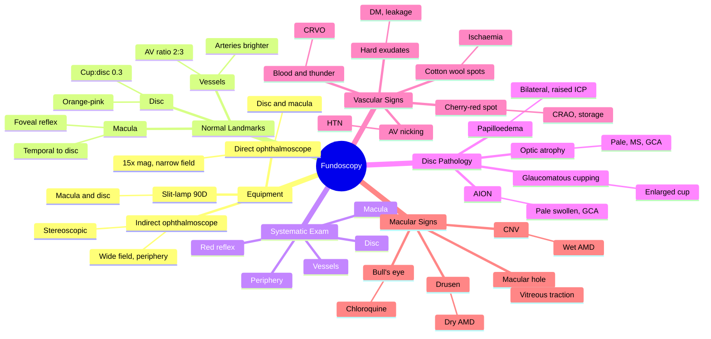

# Fundoscopy (Ophthalmoscopy)

Related: [[Diabetic Retinopathy]], [[Age-related Macular Degeneration]], [[Papilloedema]], [[Central Retinal Artery Occlusion]], [[Central Retinal Vein Occlusion]]

> [!tip] **FCPS/MRCP Priority: CRITICAL**
> Fundoscopy is a core skill — every PACES short case and medical clerking must include disc, vessels, macula, periphery. Know the red flags.

---

## Learning Objectives
- [ ] Perform direct and indirect ophthalmoscopy
- [ ] Identify normal fundus landmarks
- [ ] Recognise optic disc abnormalities (swelling, atrophy, cupping)
- [ ] Identify retinal vascular pathology
- [ ] Detect macular and peripheral pathology

## 1. Equipment

### Direct Ophthalmoscope
- Handheld, monocular, +15 to -30 D lens range
- Magnification ~15×, field 5–8°
- Best for disc and macula
- Dilation: tropicamide 0.5–1% (caution: shallow AC)

### Indirect Ophthalmoscope
- Head-mounted + handheld condensing lens (20D, 28D)
- Stereoscopic, wider field, more peripheral view
- Used for retinal detachment, peripheral tears
- Requires mydriasis

### Panfundoscope / Slit-lamp 90D
- Non-contact, ~7× view
- For macula and disc

## 2. Normal Fundus

- **Optic disc:** Orange-pink, well-defined, central cup ~0.3 of disc
- **Vessels:** Arteries brighter, narrower than veins; AV ratio ~2:3
- **Macula:** Temporal to disc, darker, central foveal reflex
- **Background:** Uniform orange-red (choroidal circulation)

## 3. Systematic Examination

1. **Red reflex** (from 1 m): opacity = cataract, vitreous haemorrhage
2. **Optic disc:** cup, colour, contour, swelling
3. **Vessels:** AV nicking, copper/silver wiring, neovascularisation, emboli
4. **Macula:** oedema, hole, drusen, haemorrhage
5. **Periphery:** tears, detachment, pigmentary changes

## 4. Optic Disc Abnormalities

| Finding | Description | Causes |
|---------|-------------|--------|
| **Papilloedema** | Blurred disc margins, hyperaemia, vessels obscured, loss of venous pulsation | ↑ ICP (bilateral) |
| **Optic atrophy** | Pale disc | MS, GCA, AION, hereditary (Leber), toxic |
| **Glaucomatous cupping** | Enlarged cup, notched NRR, bayoneting of vessels | POAG, NTG |
| **Anterior ischaemic optic neuropathy** | Pale swollen disc, altitudinal | GCA (arteritic), non-arteritic |
| **Optic neuritis** | Normal/slightly swollen disc | Demyelination |

## 5. Retinal Vascular Pathology

| Finding | Cause |
|---------|-------|
| **AV nicking** | Hypertension |
| **Copper/silver wiring** | Hypertension |
| **Flame haemorrhages** | Hypertension, CRVO |
| **Dot/blot haemorrhages** | Diabetes |
| **Microaneurysms** | Diabetes (earliest) |
| **Cotton wool spots** | Ischaemia (DM, HTN, HIV) |
| **Hard exudates** | Diabetes (lipid leakage) |
| **Neovascularisation** | Ischaemia (PDR, CRVO ischaemic) |
| **Cherry-red spot** | CRAO, storage diseases (Tay-Sachs) |
| **"Blood and thunder"** | CRVO |

## 6. Macular Signs

| Finding | Cause |
|---------|-------|
| Drusen | AMD (dry) |
| Subretinal haemorrhage/CNV | AMD (wet) |
| Macular oedema | Diabetes, vein occlusion, post-cataract |
| Cherry-red spot | CRAO, Tay-Sachs |
| Macular hole | Vitreous traction, trauma |
| Bull's eye macula | Chloroquine/Hydroxychloroquine toxicity |

## 7. FCPS/MRCP High-Yield Summary

| Topic | Key Points |
|-------|------------|
| Direct ophthalmoscope | High magnification, narrow field, disc + macula |
| Indirect ophthalmoscope | Wide field, peripheral retinal exam |
| Red reflex | Absent in dense cataract, vitreous haemorrhage |
| Normal cup:disc | ~0.3 |
| Cherry-red spot | CRAO, storage diseases |
| Cotton wool spots | Nerve fibre layer infarcts |
| Neovascularisation | PDR, ischaemic CRVO |

## 8. Viva Questions

1. **Q:** How do you differentiate papilloedema from optic neuritis on fundoscopy?
   **A:** Papilloedema = bilateral, raised ICP, normal VA initially, preserved colour vision. Optic neuritis = unilateral, ↓VA, ↓colour vision, painful eye movements, often MS.

2. **Q:** What is the significance of a cherry-red spot?
   **A:** Central retinal artery occlusion (intact choroidal circulation visible through thin fovea) or storage diseases (Tay-Sachs, Niemann-Pick).

3. **Q:** Describe the fundus in hypertensive retinopathy grade IV.
   **A:** All features of grades I–III plus papilloedema.

---

## 9. Common Confusions / Exam Traps

| Confusion | Clarification |
|-----------|---------------|
| "Papilloedema = optic neuritis" | NO — papilloedema = bilateral disc swelling from raised ICP, normal VA early. Optic neuritis = unilateral, ↓VA, ↓colour vision, painful EOM, often MS |
| "Cherry-red spot only in CRAO" | NO — also in storage diseases (Tay-Sachs, Niemann-Pick, Sandhoff), commotio retinae (Berlin oedema), and sometimes CRAO variants |
| "Cotton wool spots = exudates" | NO — CWS = nerve fibre layer INFARCTS (ischaemia). Hard exudates = lipid/lipoprotein deposits (chronic leakage) |
| "Flame haemorrhages are retinal" | NO — flame = NERVE fibre layer (superficial, follow nerve fibres); dot-blot = deeper retinal layers (round, diabetes) |
| "Cup:disc 0.5 = normal" | NO — average is 0.3. ≥ 0.6 is suspicious for glaucoma; asymmetry > 0.2 between eyes is significant |
| "DR with neovascularisation = NPDR" | NO — neovascularisation = PROLIFERATIVE DR (PDR). NPDR has microaneurysms, haemorrhages, exudates only |
| "Direct ophthalmoscope shows periphery" | NO — direct = high mag, narrow field, central retina only. Indirect = peripheral view |
| "Dilating tropicamide is always safe" | NO — caution in shallow AC / angle closure risk. Check Van Herick first |
| "Drusen are diagnostic of wet AMD" | NO — drusen = dry AMD. Wet AMD has CNV, subretinal fluid/haemorrhage |
| "CRVO is painless" | YES, but USUALLY sudden painless loss of vision. CRAO is also sudden painless. Vitreous haemorrhage = sudden painless with floaters |

## 10. Mnemonics

1. **"DAMP"** for disc assessment: **D**isc size & shape, **A**cceptable cup (≤ 0.3), **M**argins (sharp = normal, blurred = oedema), **P**allor (atrophy)
2. **"AV = 2:3"** — Arteries are 2 thirds the diameter of Veins (A:V = 2:3). Equal = arteriolar narrowing (HTN). "**A**rtery is **A**ttractive (smaller)"
3. **"CRAO Cherry"** — **C**entral **R**etinal **A**rtery **O**cclusion = **C**herry-red spot at the fovea
4. **"Blood and Thunder = VEIN"** — CRVO is "Blood and thunder" fundus (extensive haemorrhages, dilated tortuous veins). CRAO is cherry-red (arterial, pale)
5. **"HTN retinopathy grades: 1, 2, 3, 4 = AVC, F, HE, P"** — Grade 1 = Arteriolar narrowing/Vasospasm; Grade 2 = AV nicking/Copper wiring; Grade 3 = Flame haemorrhages/Exudates (Cotton wool); Grade 4 = Papilloedema (+ all above)

## 11. Mind Map

## 12. One-Page Revision Card

| **Topic** | **Fundoscopy** |
|-----------|----------------|
| **Direct Ophthalmoscope** | 15× magnification, narrow field, disc and macula |
| **Indirect Ophthalmoscope** | Stereoscopic, wide field, peripheral retina (detachments, tears) |
| **Slit-lamp 90D** | Non-contact, ~7× view, macula and disc |
| **Normal cup:disc** | ~0.3 (range 0–0.4); > 0.6 suspicious for glaucoma |
| **AV ratio** | 2:3 (artery:vein) |
| **Cherry-red spot** | CRAO, storage diseases (Tay-Sachs) |
| **Cotton wool spots** | Nerve fibre layer infarcts (DM, HTN, HIV) |
| **"Blood and thunder"** | CRVO (extensive haemorrhages) |
| **Papilloedema** | Bilateral disc swelling = ↑ ICP |
| **Optic neuritis** | Unilateral, ↓VA, ↓colour vision, painful EOM = MS |
| **Viva Pearl** | Red reflex first; absent = cataract or vitreous haemorrhage |

## 13. Spaced Repetition Trackers

### 24-Hour Recall Prompts
- [ ] List the equipment options for fundoscopy and the indication for each
- [ ] Describe normal fundus landmarks (disc, vessels, macula, AV ratio)
- [ ] Differentiate papilloedema from optic neuritis on fundoscopy
- [ ] List 5 retinal vascular signs and their causes
- [ ] Identify cherry-red spot and its differential
- [ ] State hypertensive retinopathy grades I–IV

### Revision Schedule
- [ ] **Day 1** completed (creation + 24h recall)
- [ ] **Day 3** revision completed
- [ ] **Day 7** revision completed
- [ ] **Day 15** revision completed
- [ ] **Day 30** revision completed
- [ ] **Day 90** revision completed

## 14. Must Know / Should Know / Nice to Know

### Must Know (Core for passing)
- [x] Equipment and technique (direct, indirect, slit-lamp 90D)
- [x] Normal fundus landmarks (cup:disc, AV ratio)
- [x] Papilloedema vs optic neuritis
- [x] CRAO cherry-red spot
- [x] CRVO "blood and thunder"
- [x] Cotton wool spots, hard exudates, microaneurysms
- [x] Hypertensive retinopathy grades I–IV

### Should Know (High probability)
- [x] DR grades (mild/moderate/severe NPDR, PDR, maculopathy)
- [x] AMD (dry vs wet)
- [x] AION (arteritic vs non-arteritic)
- [x] Macular hole and bull's eye maculopathy
- [x] Red reflex interpretation

### Nice to Know (Differentiator)
- [ ] Optic atrophy causes
- [ ] Leber's hereditary optic neuropathy
- [ ] Tay-Sachs cherry-red spot in paediatrics
- [ ] OCT correlation with fundoscopic findings
- [ ] Retinal vein anatomy (superior/inferior arcade)

## 15. My Weak Points
- [ ] Add personal weak areas here

## 16. Self-Test Scorecard

| Section | Score /5 |
|---------|----------|
| Understanding: | /10 |
| Recall: | /10 |
| MCQ Performance: | /10 |
| SBA Performance: | /10 |
| Viva Confidence: | /10 |
| Total: | /50 |

> [!tip] **Interpretation:** <35 = weak topic, 35-44 = acceptable but insecure, 45+ = strong exam-ready topic.

## 17. Exam Answer Modes

### Long Answer Skeleton
1. Equipment (direct ophthalmoscope, indirect + condensing lens, slit-lamp 90D)
2. Technique: red reflex → disc → vessels → macula → periphery
3. Normal landmarks (cup:disc 0.3, AV ratio 2:3)
4. Disc pathology (papilloedema, optic atrophy, glaucomatous cupping, AION, optic neuritis)
5. Vascular signs (AV nicking, CWS, hard exudates, microaneurysms, NV, cherry-red spot, blood and thunder)
6. Macular signs (drusen, CNV, hole, bull's eye)
7. Hypertensive and diabetic retinopathy grading
8. Red flags (CRAO, CRVO, papilloedema — urgent referral)

### Short Note Skeleton
- Equipment and technique
- Normal fundus findings
- Papilloedema vs optic neuritis
- Cherry-red spot differential
- Hypertensive retinopathy grades

### Viva One-Liners
- **Q:** Cherry-red spot cause? → **A:** CRAO (or storage diseases like Tay-Sachs)
- **Q:** Papilloedema vs optic neuritis? → **A:** Papilloedema = bilateral, raised ICP, normal VA early; optic neuritis = unilateral, ↓VA, ↓colour, painful EOM, often MS
- **Q:** "Blood and thunder" fundus? → **A:** CRVO — extensive haemorrhages, dilated tortuous veins
- **Q:** Normal cup:disc? → **A:** ~0.3 (> 0.6 suspicious, asymmetry > 0.2 significant)
- **Q:** Cotton wool spots represent? → **A:** Nerve fibre layer infarcts (ischaemia)

### Ward-Case Discussion Points
- Demonstrate red reflex and explain its significance
- Identify disc swelling and differentiate papilloedema from optic neuritis
- Recognise cherry-red spot and discuss CRAO management
- Identify signs of hypertensive and diabetic retinopathy
- Counsel on urgency of CRVO, CRAO, papilloedema (all need urgent referral)

### Last-Night-Before-Exam Sheet
- **Top 5 facts:** Cup:disc 0.3; AV 2:3; cherry-red = CRAO; blood and thunder = CRVO; cotton wool = infarct
- **1 mnemonic:** "CRAO Cherry" / "Blood and Thunder = VEIN" (CRVO)
- **Must-know differential:** Papilloedema (bilateral, raised ICP) vs optic neuritis (unilateral, ↓VA, MS)
- **Common trap:** Don't miss CRAO (emergency); don't dismiss CRVO (urgent); always check red reflex first

## Summary

Fundoscopy evaluates disc, vessels, macula, periphery. Red reflex, AV ratio, cup:disc, and cherry-red spot are key exam findings. Dilation is essential for thorough examination (caution: shallow AC). Papilloedema (bilateral, raised ICP) must be distinguished from optic neuritis (unilateral, ↓VA, MS). Cherry-red spot indicates CRAO or storage disease. "Blood and thunder" fundus = CRVO. Cotton wool spots = nerve fibre layer infarcts. Hypertensive retinopathy is graded I (arteriolar narrowing) to IV (papilloedema). Diabetic retinopathy ranges from mild NPDR to PDR (neovascularisation). Always assess red reflex first — its absence indicates cataract or vitreous haemorrhage.

## MCQs (10)

1. **Question:** A cherry-red spot on the macula is most characteristically seen in:
   **Options:** A. Diabetic retinopathy B. Central retinal vein occlusion (CRVO) C. Central retinal artery occlusion (CRAO) D. Retinal detachment E. Primary open-angle glaucoma
   **Answer:** C
   **Explanation:** CRAO produces a cherry-red spot because the thin foveal area allows the intact choroidal circulation to show through against the surrounding pale, ischaemic retina. Also seen in Tay-Sachs, Niemann-Pick, commotio retinae.

2. **Question:** Cotton wool spots on fundoscopy represent:
   **Options:** A. Hard lipid exudates B. Nerve fibre layer infarcts (ischaemia) C. Microaneurysms D. Retinal neovascularisation E. Subretinal haemorrhage
   **Answer:** B
   **Explanation:** Cotton wool spots = localised ischaemic infarcts of the retinal nerve fibre layer. Causes: diabetes, hypertension, HIV retinopathy, SLE, anaemia, interferon therapy. Different from hard exudates (lipid leakage).

3. **Question:** The normal cup-to-disc ratio is approximately:
   **Options:** A. 0.0 B. 0.3 C. 0.7 D. 0.9 E. 1.0
   **Answer:** B
   **Explanation:** Normal cup:disc ratio is ~0.3 (range 0–0.4). Cup:disc > 0.6, asymmetry > 0.2 between eyes, notching of the neuroretinal rim, or bayoneting of vessels is suspicious for glaucomatous optic neuropathy.

4. **Question:** Bilateral papilloedema is most commonly caused by:
   **Options:** A. Optic neuritis B. Raised intracranial pressure (ICP) C. Hypertension D. Diabetes mellitus E. Open-angle glaucoma
   **Answer:** B
   **Explanation:** Bilateral papilloedema = raised ICP (idiopathic intracranial hypertension, intracranial mass, venous sinus thrombosis, meningitis). In the early stages, visual acuity and colour vision are preserved (key differentiator from optic neuritis).

5. **Question:** A "blood and thunder" fundus appearance is characteristic of:
   **Options:** A. CRAO B. CRVO C. Age-related macular degeneration D. Mild diabetic retinopathy E. Retinal detachment
   **Answer:** B
   **Explanation:** CRVO produces the classic "blood and thunder" fundus: extensive flame and dot-blot haemorrhages in all four quadrants, dilated tortuous veins, disc oedema, and cotton wool spots. Ischaemic CRVO has a higher risk of neovascularisation and requires urgent referral.

6. **Question:** Hypertensive retinopathy Grade IV (Keith-Wagener-Barker) is characterised by:
   **Options:** A. Mild arteriolar narrowing only B. AV nicking and copper wiring C. Flame haemorrhages and cotton wool spots D. Papilloedema in addition to Grade III changes E. Retinal detachment
   **Answer:** D
   **Explanation:** Grade IV = papilloedema + all features of grades I–III (arteriolar narrowing, AV nicking, flame haemorrhages, cotton wool spots, hard exudates). Malignant/accelerated hypertension. Requires urgent BP control.

7. **Question:** The arteriole-to-venule (A:V) ratio in a normal fundus is approximately:
   **Options:** A. 1:1 B. 2:3 C. 1:2 D. 2:1 E. 3:2
   **Answer:** B
   **Explanation:** Normal A:V ratio is 2:3 (arterioles are 2/3 the diameter of venules). Reduced ratio (e.g., 1:3) = arteriolar narrowing (hypertension). Increased ratio may indicate venous dilation or arteriolar attenuation.

8. **Question:** Drusen at the macula are characteristic of:
   **Options:** A. Wet AMD B. Dry (non-exudative) AMD C. Diabetic maculopathy D. Central serous chorioretinopathy E. Retinal vein occlusion
   **Answer:** B
   **Explanation:** Drusen = yellow subretinal deposits at the macula = hallmark of dry (non-exudative, geographic atrophy) AMD. Wet AMD has choroidal neovascularisation (CNV), subretinal fluid, and haemorrhage.

9. **Question:** Optic neuritis is most commonly associated with:
   **Options:** A. Raised intracranial pressure B. Multiple sclerosis C. Giant cell arteritis D. Diabetes E. Hypertension
   **Answer:** B
   **Explanation:** Optic neuritis is the presenting feature in ~20% of MS patients and occurs in ~50% during disease course. Typical patient: young woman, painful eye movements, ↓VA, ↓colour vision, RAPD. Disc may appear normal (retrobulbar) or slightly swollen.

10. **Question:** Neovascularisation elsewhere (NVE) or at the disc (NVD) on fundoscopy indicates:
    **Options:** A. Non-proliferative diabetic retinopathy (NPDR) B. Proliferative diabetic retinopathy (PDR) C. Background retinopathy D. Maculopathy only E. Vitreous detachment
    **Answer:** B
    **Explanation:** PDR is defined by neovascularisation: NVD (new vessels at the disc) or NVE (new vessels elsewhere). NVD carries the highest risk of severe visual loss. Treatment: panretinal photocoagulation (PRP), anti-VEGF (e.g., ranibizumab, aflibercept), vitrectomy if non-clearing vitreous haemorrhage.

## SBA Questions (10)

1. **Scenario:** A 30-year-old woman presents with sudden painless loss of vision in one eye, a relative afferent pupillary defect (RAPD), and a cherry-red spot on fundoscopy.
   **Question:** What is the most likely diagnosis?
   **Options:** A. CRVO B. CRAO C. Retinal detachment D. Vitreous haemorrhage E. Macular hole
   **Answer:** B
   **Explanation:** Sudden painless monocular vision loss + RAPD + cherry-red spot = central retinal artery occlusion. Embolic in 70% (carotid atherosclerosis most common). Retinal appears pale due to inner retinal ischaemia; fovea appears red because of intact choroidal circulation visible through the thin foveal retina.

2. **Scenario:** A 65-year-old diabetic patient has fundoscopy showing dot-blot haemorrhages, hard exudates, microaneurysms, and neovascularisation at the disc.
   **Question:** What is the most likely grade of diabetic retinopathy, and what is the most appropriate next step?
   **Options:** A. Mild NPDR; observe B. Moderate NPDR; optimise glycaemic control C. Severe NPDR; refer for PRP D. Proliferative DR (PDR); urgent referral for panretinal photocoagulation ± anti-VEGF E. Maculopathy only
   **Answer:** D
   **Explanation:** NVD = neovascularisation at the disc = PDR. Requires urgent ophthalmology referral for PRP and/or anti-VEGF therapy (ranibizumab, aflibercept, bevacizumab). Vitrectomy if non-clearing vitreous haemorrhage or tractional retinal detachment.

3. **Scenario:** A 25-year-old obese woman presents with headaches, transient visual obscurations, and bilateral papilloedema on fundoscopy. Visual acuity is 6/6 in both eyes. CT brain is normal; CSF shows elevated opening pressure with normal constituents.
   **Question:** What is the most likely diagnosis?
   **Options:** A. Optic neuritis B. Idiopathic intracranial hypertension (IIH / pseudotumour cerebri) C. CRVO D. Hypertensive retinopathy E. Diabetic papillopathy
   **Answer:** B
   **Explanation:** IIH = young obese woman with raised ICP without mass lesion. Papilloedema is bilateral. VA preserved early, colour vision preserved. Treatment: weight loss, acetazolamide, topiramate, Foltz procedure (optic nerve sheath fenestration) or VP shunt if vision threatened.

4. **Scenario:** A 70-year-old presents with sudden painless loss of vision and a "blood and thunder" fundus appearance with extensive haemorrhages in all four quadrants.
   **Question:** What is the diagnosis, and what is the most important systemic association to investigate?
   **Options:** A. CRAO; giant cell arteritis B. CRVO; cardiovascular risk factors (hypertension, hyperlipidaemia, diabetes) and glaucoma C. Retinal detachment; trauma D. Diabetic retinopathy; pancreas E. Papilloedema; brain tumour
   **Answer:** B
   **Explanation:** CRVO = "blood and thunder". Strongly associated with hypertension, hyperlipidaemia, diabetes, glaucoma, and hyperviscosity. Ischaemic CRVO (with RAPD, extensive haemorrhages, cotton wool spots) carries 60% risk of neovascularisation — needs prompt laser and anti-VEGF.

5. **Scenario:** A 60-year-old hypertensive patient on fundoscopy shows arteriolar narrowing, AV nicking, flame haemorrhages, cotton wool spots, and bilateral papilloedema. BP is 220/130 mmHg.
   **Question:** What grade of hypertensive retinopathy is this, and what is the management priority?
   **Options:** A. Grade I; reassure B. Grade II; BP control as outpatient C. Grade III; start oral antihypertensives D. Grade IV; urgent BP reduction (malignant hypertension) E. Grade 0
   **Answer:** D
   **Explanation:** Grade IV HTN retinopathy = malignant hypertension. Patient may have encephalopathy, AKI, microangiopathic haemolytic anaemia. Requires urgent IV antihypertensives (labetalol, nicardipine) in monitored setting. Aim to lower MAP by 20–25% in the first hour, not to normal (cerebral hypoperfusion risk).

6. **Scenario:** A 35-year-old woman with a history of MS presents with sudden decreased vision in one eye, painful eye movements, ↓colour vision, and a normal-appearing disc.
   **Question:** What is the most likely diagnosis and investigation?
   **Options:** A. CRVO; fluorescein angiography B. Optic neuritis (retrobulbar); MRI brain + orbits with gadolinium C. Papilloedema; lumbar puncture D. Papillitis from sarcoidosis; CXR E. Hypertensive retinopathy; BP check
   **Answer:** B
   **Explanation:** Classic optic neuritis in MS: young woman, painful EOM, ↓VA, ↓colour vision, RAPD, normal or slightly swollen disc. MRI brain/orbits shows demyelinating lesions. IV methylprednisolone speeds recovery but doesn't change long-term outcome; oral interferon or other disease-modifying therapy reduces future MS attacks.

7. **Scenario:** A 65-year-old on hydroxychloroquine for SLE has fundoscopy showing a "bull's eye macula" appearance (ring of depigmentation around a preserved fovea).
   **Question:** What is the most likely diagnosis and management?
   **Options:** A. AMD; anti-VEGF B. Hydroxychloroquine retinal toxicity; stop the drug, consider switching to alternative C. Macular hole; surgery D. Central serous chorioretinopathy; observe E. Diabetic maculopathy; laser
   **Answer:** B
   **Explanation:** Bull's eye maculopathy = classic hydroxychloroquine (and chloroquine) retinal toxicity. Risk factors: dose > 6.5 mg/kg/day, duration > 5 years, renal/hepatic disease, tamoxifen use. Management: stop drug (often irreversible), consider switching. Monitor with OCT and visual fields.

8. **Scenario:** A 50-year-old with sudden painless loss of vision has a relative afferent pupillary defect (RAPD) on examination. Fundoscopy shows a pale, oedematous disc with altitudinal field loss.
   **Question:** What is the most likely diagnosis, and what is the most important test in older patients?
   **Options:** A. Optic neuritis; MRI B. Anterior ischaemic optic neuropathy (AION); ESR, CRP, and platelets (GCA workup) C. CRVO; BP check D. Papilloedema; CT brain E. Macular hole; OCT
   **Answer:** B
   **Explanation:** AION = sudden painless vision loss with altitudinal disc swelling, RAPD, and altitudinal field defect. In patients > 50 years, MUST rule out giant cell arteritis (arteritic AION): ESR, CRP, platelets. If GCA suspected: urgent high-dose IV methylprednisolone + temporal artery biopsy.

9. **Scenario:** A 70-year-old presents with headache, jaw claudication, scalp tenderness, and sudden vision loss. Fundoscopy shows a pale, swollen disc (chalky white). ESR is 95 mm/hr.
   **Question:** What is the most likely diagnosis, and what is the most appropriate immediate management?
   **Options:** A. Non-arteritic AION; observe B. Giant cell arteritis (arteritic AION); urgent IV methylprednisolone and temporal artery biopsy C. CRVO; laser D. Optic neuritis; MRI E. Papilloedema; LP
   **Answer:** B
   **Explanation:** GCA symptoms + raised ESR + pale swollen disc = arteritic AION. Treatment must NOT be delayed for biopsy: start high-dose steroids (IV methylprednisolone 1 g/day for 3 days, then oral prednisolone 1 mg/kg) immediately. Arrange temporal artery biopsy within 1–2 weeks. To prevent fellow-eye involvement.

10. **Scenario:** A 65-year-old on routine fundoscopy shows a macular hole on the right eye. Visual acuity is reduced with a central scotoma. There is no other fundus pathology.
    **Question:** What is the most likely cause and management?
    **Options:** A. Diabetic maculopathy; laser B. Idiopathic macular hole (vitreous traction); vitreoretinal surgery (vitrectomy + membrane peel + gas tamponade) C. Wet AMD; anti-VEGF D. CRVO; observation E. Papillitis; steroids
    **Answer:** B
    **Explanation:** Idiopathic (or age-related) macular hole is caused by perifoveal vitreous traction, more common in women > 60. Visual acuity typically 6/18–6/60 with central scotoma. Treatment: pars plana vitrectomy, ILM peeling, gas (SF6 or C3F8) tamponade, face-down posturing.

## Flashcards

- **Q:** How do you differentiate papilloedema from optic neuritis on fundoscopy?
  **A:** Papilloedema = bilateral, raised ICP, normal VA early, normal colour vision. Optic neuritis = unilateral, ↓VA, ↓colour vision, painful EOM, often MS.

- **Q:** What does a cherry-red spot indicate?
  **A:** CRAO (intact choroidal circulation visible through thin fovea) — also in storage diseases (Tay-Sachs, Niemann-Pick), commotio retinae.

- **Q:** Describe the hypertensive retinopathy grades.
  **A:** Grade I = arteriolar narrowing; Grade II = AV nicking/copper wiring; Grade III = flame haemorrhages, cotton wool, hard exudates; Grade IV = papilloedema + all above.

- **Q:** What is the significance of neovascularisation at the disc (NVD) or elsewhere (NVE)?
  **A:** Indicates proliferative diabetic retinopathy (PDR). Treatment: PRP, anti-VEGF (ranibizumab, aflibercept), vitrectomy if needed.

- **Q:** What is the differential for a "bull's eye macula"?
  **A:** Hydroxychloroquine/chloroquine retinal toxicity (most common), cone dystrophy, sometimes chronic macular hole, Stargardt disease. Stop drug if drug-induced.

## Answer Key with Explanations

### MCQs
1. C — Cherry-red spot = CRAO (or storage disease)
2. B — Cotton wool spots = nerve fibre layer infarcts (ischaemia)
3. B — Normal cup:disc ~0.3 (> 0.6 suspicious)
4. B — Bilateral papilloedema = raised ICP
5. B — "Blood and thunder" = CRVO
6. D — HTN retinopathy Grade IV = papilloedema + grade III changes
7. B — Normal A:V = 2:3
8. B — Drusen = dry (non-exudative) AMD
9. B — Optic neuritis most commonly associated with MS
10. B — NVD/NVE = PDR; needs PRP and/or anti-VEGF

### SBAs
1. B — Sudden painless + RAPD + cherry-red spot = CRAO
2. D — NVD = PDR; urgent PRP ± anti-VEGF
3. B — Young obese woman + papilloedema + normal CT + raised CSF pressure = IIH
4. B — CRVO = blood and thunder; associated with HTN, DM, hyperlipidaemia, glaucoma
5. D — Papilloedema + severe HTN = Grade IV = malignant HTN (urgent BP reduction)
6. B — Painful EOM + ↓VA + ↓colour + normal disc = retrobulbar optic neuritis; MRI brain
7. B — Bull's eye macula on hydroxychloroquine = retinal toxicity; stop drug
8. B — Pale swollen disc + altitudinal field = AION; check ESR/CRP for GCA
9. B — GCA symptoms + high ESR = arteritic AION; start IV steroids immediately
10. B — Macular hole = vitreous traction; vitrectomy + gas tamponade

## Tags
#medicine #davidson #ophthalmology #fundoscopy #fcps #mrcp
