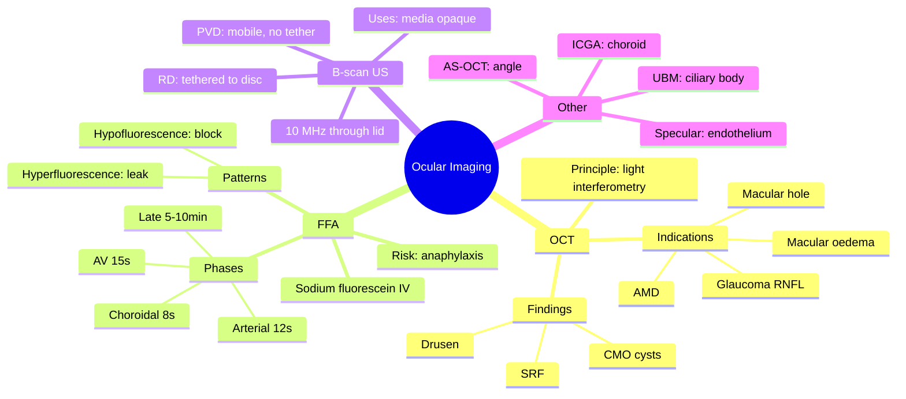

# Ocular Imaging (OCT, FFA, Ultrasound)

Related: [[Age-related Macular Degeneration]], [[Diabetic Retinopathy]], [[Retinal Detachment]], [[Central Serous Retinopathy]]

> [!tip] **FCPS/MRCP Priority: HIGH**
> OCT, FFA, and B-scan ultrasound are core investigations. Know indications, principles, and key findings.

---

## Learning Objectives
- [ ] Describe the principle of optical coherence tomography (OCT)
- [ ] List indications for OCT
- [ ] Describe fundus fluorescein angiography (FFA) and its phases
- [ ] Describe ocular B-scan ultrasound and its indications
- [ ] Recognise key imaging findings (CMO, CNV, PVD, RD)
- [ ] Differentiate retinal detachment from PVD on B-scan
- [ ] State the most serious adverse effect of fluorescein
- [ ] Compare OCT-A with FFA

---

## 1. Optical Coherence Tomography (OCT)

### Principle
- Non-contact, non-invasive cross-sectional imaging of retina
- Uses low-coherence interferometry (light, not sound)
- Analogy: "Optical ultrasound"
- Spectral-domain (SD-OCT) — current standard
- Swept-source (SS-OCT) — newer, deeper penetration

### Indications
- Macular oedema (diabetic, vein occlusion, post-cataract)
- AMD (drusen, geographic atrophy, CNV, subretinal fluid)
- Macular hole
- Vitreoretinal traction, ERM
- Glaucoma (RNFL analysis)
- Anterior segment OCT (cornea, angle)

### Key Findings
| Finding | Disease |
|---------|---------|
| Intraretinal cystoid spaces (CMO) | Diabetic maculopathy, vein occlusion, post-op |
| Subretinal fluid (SRF) | Wet AMD, CSR |
| Sub-RPE fluid | Wet AMD, PED |
| Drusen (sub-RPE deposits) | Dry AMD |
| Geographic atrophy | Advanced dry AMD |
| Macular hole (full-thickness) | Idiopathic, trauma |
| Vitreomacular traction | Vitreoretinal interface disease |
| Retinal thickening | Many retinopathies |

### OCT-A (Angiography)
- Non-invasive vascular imaging
- Useful for CNV (no dye needed)
- Limitations: artefacts, no leakage assessment

---

## 2. Fundus Fluorescein Angiography (FFA)

### Principle
- Sodium fluorescein IV (5 mL of 10%)
- Blue light excites → green-yellow fluorescence
- Captures fundus images over 10 minutes
- Leakage shows as bright (oedema, CNV), blockage as dark (haemorrhage)

### Phases
1. **Choroidal (pre-arterial):** ~8–12 s
2. **Arterial:** ~10–15 s
3. **Arteriovenous (laminar venous):** ~12–15 s
4. **Venous (early, late):** ~15–30 s
5. **Late (recirculation):** 5–10 min — leakage detected

### Key Patterns
| Pattern | Disease |
|---------|---------|
| Hyperfluorescence — leakage | CNV, vasculitis, oedema |
| Hyperfluorescence — staining | Scar, drusen |
| Hyperfluorescence — pooling | CSR, PED |
| Hypofluorescence — blockage | Haemorrhage, pigment |
| Hypofluorescence — filling defect | CRAO, ischaemia |

### Adverse Reactions
- Nausea (common, transient)
- Vomiting
- Urticaria, itching
- Anaphylaxis (rare, 1:200,000)
- Cardiac arrest (very rare)
- Skin/orange urine discoloration (transient)
- Resuscitation equipment and trained staff mandatory

### Indications
- Suspected CNV (AMD, myopic, inflammatory)
- Diabetic retinopathy (assess ischaemia, leakage)
- Vein occlusions
- Vasculitis
- Tumours

---

## 3. Ocular B-scan Ultrasound

### Principle
- High-frequency (10 MHz) ultrasound through closed eyelid
- 2D B-scan gives cross-section
- A-scan gives 1D spike (used for IOL biometry)

### Indications
- **Vitreous haemorrhage** (rule out RD)
- **Retinal detachment** (when view obscured)
- **Intraocular tumour** (mass vs RD)
- **Posterior scleritis**
- **Optic disc drusen** (when buried)
- **Endophthalmitis** (vitreous opacities)
- **Ocular trauma** (lens position, IOFB, globe integrity)
- **IOL biometry** (A-scan)

### Key Findings
- RD: echogenic membrane attached to optic disc, after-movement (tethered at disc)
- Vitreous haemorrhage: low-amplitude dots/membranes
- Tumour: solid, vascularity on Doppler
- PVD: thin mobile membrane, no attachment to disc (vs RD)

---

## 4. Other Imaging

| Modality | Use |
|----------|-----|
| **Indocyanine green angiography (ICGA)** | Choroidal vasculature (e.g., VKH, polypoidal choroidal vasculopathy) |
| **Corneal topography** | Keratoconus, astigmatism, refractive surgery planning |
| **Specular microscopy** | Endothelial cell count (pre-cataract, Fuchs) |
| **Ultrasound biomicroscopy (UBM)** | Anterior segment (angle, ciliary body) |
| **Anterior segment OCT (AS-OCT)** | Angle assessment |
| **MRI / CT** | Orbital disease, optic nerve, tumour staging |

---

## 5. FCPS/MRCP High-Yield Summary

| Topic | Key Points |
|-------|------------|
| OCT principle | Low-coherence interferometry |
| OCT indication | Macular disease, glaucoma, anterior segment |
| FFA phases | Choroidal → arterial → AV → venous → late |
| FFA leakage | Bright on late frames (CNV, oedema) |
| FFA adverse | Anaphylaxis rare; emergency equipment needed |
| B-scan | Used when media opaque (VH, dense cataract) |
| RD vs PVD on B-scan | RD tethered to disc; PVD not |

---

## 6. Viva Questions

1. **Q:** How does OCT differ from FFA?
   **A:** OCT = non-invasive, structural, cross-sectional, used for macular oedema, hole, CNV. FFA = invasive (IV dye), functional, shows leakage, used for CNV, vasculitis.

2. **Q:** What is the most serious adverse effect of fluorescein?
   **A:** Anaphylaxis (rare but life-threatening). Resuscitation equipment mandatory.

3. **Q:** How do you differentiate retinal detachment from vitreous detachment on B-scan?
   **A:** RD = high reflectivity, attached to optic disc, restricted mobility. PVD = thin membrane, not attached to disc, freely mobile.

---

## 7. Common Confusions / Exam Traps

| Confusion | Clarification |
|-----------|---------------|
| "OCT and FFA are interchangeable" | OCT is structural (cross-section); FFA is functional (leakage/perfusion) |
| "FFA leakage in early phase" | Leakage is best seen on LATE phase (5–10 min), not early |
| "B-scan uses sound → CT-like" | B-scan is high-frequency US (10 MHz); CT is X-ray. Different physics |
| "ICGA images retinal vessels" | ICGA images CHOROIDAL vessels (binds plasma proteins); FFA = retinal |
| "A-scan and B-scan same thing" | A-scan = 1D spike (IOL biometry); B-scan = 2D cross-section (posterior segment) |
| "RD and PVD look the same on B-scan" | RD tethered to disc with restricted movement; PVD mobile, not tethered |

---

## 8. Mnemonics

1. **"FFA Phases: Choral Aria Venously Late"** — **C**horoidal → **A**rterial → Arterio**V**enous → **L**ate
2. **"OCT = Optical Coherence Tomography"** — think "**O**ctopus eyes = see cross-section"
3. **"B-scan Behind, A-scan Ahead"** — B-scan = posterior (Behind); A-scan = Axial/biometry (Ahead)
4. **"RD tethers to disc, PVD is free"** — **R**etinal **D**etachment is **R**estricted; **P**VD = **P**eels off freely

---

## 9. Mind Map

---

## 10. One-Page Revision Card

| **Topic** | **Ocular Imaging** |
|-----------|----------------|
| **OCT Principle** | Low-coherence interferometry (light) |
| **OCT Indication** | Macular oedema, AMD, hole, glaucoma |
| **FFA Phases** | Choroidal → Arterial → AV → Venous → Late |
| **FFA Leakage** | Late frames (5–10 min) — CNV, oedema |
| **FFA Risk** | Anaphylaxis (resus equipment mandatory) |
| **B-scan Use** | Media opaque (VH, dense cataract) |
| **RD on B-scan** | Tethered to disc, restricted movement |
| **PVD on B-scan** | Mobile, NOT tethered to disc |
| **ICGA** | Choroidal vessels (VKH, polypoidal) |
| **Viva Pearl** | "OCT structure, FFA function, B-scan when blind" |

---

## Spaced Repetition Trackers

### 24-Hour Recall Prompts
- [ ] State the principle of OCT
- [ ] List the 5 phases of FFA in order
- [ ] Most serious adverse effect of fluorescein
- [ ] Differentiate RD from PVD on B-scan
- [ ] State 3 indications for OCT

### Revision Schedule
- [ ] **Day 1** completed (creation + 24h recall)
- [ ] **Day 3** revision completed
- [ ] **Day 7** revision completed
- [ ] **Day 15** revision completed
- [ ] **Day 30** revision completed
- [ ] **Day 90** revision completed

---

## Must Know / Should Know / Nice to Know

### Must Know (Core for passing)
- [x] OCT principle and indications
- [x] FFA phases and leakage patterns
- [x] B-scan use and RD vs PVD
- [x] Anaphylaxis risk of fluorescein

### Should Know (High probability)
- [x] OCT-A advantages/limitations
- [x] Hyperfluorescence vs hypofluorescence interpretation
- [x] ICGA for choroidal disease
- [x] Indications for B-scan

### Nice to Know (Differentiator)
- [ ] SD-OCT vs SS-OCT technical differences
- [ ] Quantitative RNFL analysis
- [ ] ICGA binding to plasma proteins (mechanism)

---

## My Weak Points
- [ ] Add personal weak areas here

---

## Self-Test Scorecard

| Section | Score /5 |
|---------|----------|
| Understanding: | /10 |
| Recall: | /10 |
| MCQ Performance: | /10 |
| SBA Performance: | /10 |
| Viva Confidence: | /10 |
| Total: | /50 |

> [!tip] **Interpretation:** <35 = weak topic, 35-44 = acceptable but insecure, 45+ = strong exam-ready topic.

---

## Exam Answer Modes

### Long Answer Skeleton
1. OCT principle (low-coherence interferometry), indications (macular disease, glaucoma, AS-OCT)
2. FFA principle (IV fluorescein), phases (choroidal → arterial → AV → venous → late)
3. FFA patterns (hyper/hypofluorescence: leak, stain, pool, block, filling defect)
4. Adverse effects of fluorescein (anaphylaxis, resus needed)
5. B-scan ultrasound principle (10 MHz), uses (media opaque)
6. RD vs PVD on B-scan (tethered vs mobile)
7. Other imaging: ICGA, specular microscopy, corneal topography, AS-OCT, UBM

### Short Note Skeleton
- OCT = light interferometry, structural imaging, macular oedema/hole
- FFA = IV dye, leakage, late phase key, anaphylaxis risk
- B-scan = ultrasound, when view obscured, RD vs PVD

### Viva One-Liners
- **Q:** What does OCT image? → **A:** Cross-section of retina using low-coherence interferometry (light)
- **Q:** FFA phases in order? → **A:** Choroidal, arterial, arteriovenous, venous, late
- **Q:** When is FFA leakage best seen? → **A:** Late phase (5–10 minutes)
- **Q:** RD vs PVD on B-scan? → **A:** RD tethered to disc, restricted movement; PVD mobile, not attached
- **Q:** Most serious FFA risk? → **A:** Anaphylaxis — resuscitation equipment mandatory

### Ward-Case Discussion Points
- Choose OCT for macular structural assessment (oedema, hole, CNV)
- Choose FFA for vascular leakage and perfusion
- Choose B-scan when fundus view is obscured
- Recognise anaphylaxis as rare but life-threatening FFA risk
- Differentiate RD from PVD on B-scan (mobility, disc attachment)

### Last-Night-Before-Exam Sheet
- Top 3 facts: OCT = light, FFA = dye + late-phase leakage, B-scan = ultrasound when blind
- 1 mnemonic: "FFA Phases: Choral Aria Venously Late"
- Must-know: RD tethers to disc; PVD does not
- Must-know: FFA risk = anaphylaxis, resus equipment needed
- Must-know: ICGA = choroid; FFA = retinal vessels

---

## Summary

OCT is the modern workhorse for macular and optic nerve imaging. FFA remains the gold standard for vascular and leakage assessment. B-scan ultrasound is essential when the fundus view is obscured. Each modality has specific indications and limitations.

---

## MCQs (10)

1. **Question:** OCT uses the principle of:
   **Options:** A. X-ray B. Sound waves C. Light interferometry D. MRI E. Radioactive tracer
   **Answer:** C
   **Explanation:** Low-coherence interferometry (light, similar to ultrasound principle but optical).

2. **Question:** The most serious adverse effect of IV fluorescein is:
   **Options:** A. Nausea B. Yellow skin C. Anaphylaxis D. Vomiting E. Diarrhoea
   **Answer:** C
   **Explanation:** Anaphylaxis (rare, ~1:200,000) — needs resuscitation facilities.

3. **Question:** A B-scan finding of a tethered membrane attached to the optic disc suggests:
   **Options:** A. PVD B. Retinal detachment C. Vitreous haemorrhage D. Tumour E. Asteroid hyalosis
   **Answer:** B
   **Explanation:** RD is tethered at the disc and has restricted after-movement.

4. **Question:** ICGA is primarily used to image:
   **Options:** A. Retinal vessels B. Choroidal vessels C. Vitreous D. Lens E. Optic nerve
   **Answer:** B
   **Explanation:** Indocyanine green binds to plasma proteins, better for choroidal vasculature.

5. **Question:** Wet AMD on FFA typically shows:
   **Options:** A. Hypofluorescence B. Hyperfluorescent leakage C. Blockage D. No change E. Staining only
   **Answer:** B
   **Explanation:** CNV leaks dye → hyperfluorescence on late frames.

6. **Question:** FFA leakage is best detected in the:
   **Options:** A. Choroidal phase B. Arterial phase C. Arteriovenous phase D. Early venous E. Late (recirculation) phase
   **Answer:** E
   **Explanation:** Late phase (5–10 min) shows leakage from CNV, oedema, vasculitis.

7. **Question:** Spectral-domain OCT (SD-OCT) is preferred over time-domain OCT because it:
   **Options:** A. Uses sound waves B. Provides faster acquisition and higher resolution C. Is invasive D. Requires IV dye E. Images choroid only
   **Answer:** B
   **Explanation:** SD-OCT has faster scan speed, better resolution, and 3D reconstruction capability.

8. **Question:** On B-scan ultrasound, posterior vitreous detachment (PVD) is characterised by:
   **Options:** A. Thick membrane tethered to disc B. Thin mobile membrane not attached to disc C. Solid mass with vascularity D. High-amplitude dots in vitreous E. Globe wall defect
   **Answer:** B
   **Explanation:** PVD = thin, mobile, no attachment to disc (vs RD which is tethered).

9. **Question:** A-scan ultrasound is primarily used in ophthalmology for:
   **Options:** A. Detecting retinal detachment B. IOL biometry C. Imaging choroidal tumours D. Detecting vitreous haemorrhage E. Visualising the optic disc
   **Answer:** B
   **Explanation:** A-scan gives a 1D spike used for axial length measurement and IOL power calculation.

10. **Question:** OCT-A (angiography) is preferred over FFA for detecting CNV in some patients because it:
    **Options:** A. Is invasive B. Requires IV dye C. Is non-invasive and faster D. Images choroid only E. Has poor resolution
    **Answer:** C
    **Explanation:** OCT-A is non-invasive (no IV dye) but cannot assess leakage (limitation).

---

## SBA Questions (10)

1. **Scenario:** A 70-year-old has sudden central scotoma, OCT shows subretinal fluid and a hyperreflective lesion.
   **Question:** Most likely diagnosis?
   **Options:** A. Dry AMD B. Wet AMD C. CSR D. Macular hole E. DR
   **Answer:** B
   **Explanation:** SRF + lesion = wet AMD (CNV).

2. **Scenario:** A patient with dense cataract prevents fundus view. US shows a tethered membrane.
   **Question:** Diagnosis?
   **Options:** A. PVD B. Retinal detachment C. Asteroid hyalosis D. Vitritis E. Normal
   **Answer:** B
   **Explanation:** Tethered membrane = RD.

3. **Scenario:** A 65-year-old diabetic has reduced vision. OCT shows intraretinal cystoid spaces at the fovea.
   **Question:** Most likely diagnosis?
   **Options:** A. Drusen B. Geographic atrophy C. Cystoid macular oedema (CMO) D. Macular hole E. ERM
   **Answer:** C
   **Explanation:** Intraretinal cystoid spaces = CMO (common in diabetic maculopathy, vein occlusion, post-op).

4. **Scenario:** A 50-year-old has gradual central vision loss. OCT shows a full-thickness defect at the fovea with intraretinal cysts at the edges.
   **Question:** Diagnosis?
   **Options:** A. AMD B. Macular hole C. CSR D. CME E. ERM
   **Answer:** B
   **Explanation:** Full-thickness foveal defect = macular hole (idiopathic, more common in older women).

5. **Scenario:** A patient undergoes FFA. 5 minutes after dye injection, the patient becomes hypotensive, develops urticaria and bronchospasm.
   **Question:** Most appropriate immediate management?
   **Options:** A. Oral antihistamine B. Continue imaging and observe C. IM adrenaline and resuscitation D. Topical steroid E. IV normal saline only
   **Answer:** C
   **Explanation:** Anaphylaxis → IM adrenaline (0.5 mg), IV fluids, oxygen, resuscitation. FFA suite must have emergency equipment.

6. **Scenario:** A 30-year-old presents with sudden painless vision loss. FFA shows a cherry-red spot with surrounding hyperfluorescence.
   **Question:** Most likely diagnosis?
   **Options:** A. CRAO B. CRVO C. AMD D. CSR E. Retinal detachment
   **Answer:** A
   **Explanation:** Cherry-red spot + hyperfluorescence around it = central retinal artery occlusion (CRAO); FFA shows filling defect at macula.

7. **Scenario:** An 80-year-old has sudden painless vision loss. On B-scan (no fundus view due to dense vitreous haemorrhage), a funnel-shaped echogenic membrane is seen attached to the optic disc.
   **Question:** Most likely diagnosis?
   **Options:** A. Asteroid hyalosis B. Vitreous haemorrhage alone C. Total retinal detachment D. Posterior vitreous detachment E. Choroidal detachment
   **Answer:** C
   **Explanation:** Funnel-shaped membrane attached to disc in presence of VH = total RD.

8. **Scenario:** A 25-year-old has progressive night blindness and tunnel vision. FFA shows widespread hyperfluorescence from window defects; OCT shows outer retinal thinning.
   **Question:** Most appropriate additional test?
   **Options:** A. ERG B. VEP C. MRI brain D. Carotid Doppler E. Visual fields
   **Answer:** A
   **Explanation:** Retinitis pigmentosa → ERG (extinguished scotopic/photopic responses). ERG confirms rod-cone dystrophy.

9. **Scenario:** A 60-year-old with wet AMD on FFA shows late hyperfluorescence in a lacy "sea-fan" pattern.
   **Question:** What does this pattern represent?
   **Options:** A. Normal choroidal flush B. Haemorrhagic blockage C. Classic choroidal neovascular membrane (CNV) D. Retinal vasculitis E. Disc swelling
   **Answer:** C
   **Explanation:** Lacy hyperfluorescence = classic CNV (well-defined leakage on FFA); occult CNV is more diffuse.

10. **Scenario:** A 45-year-old myope presents with metamorphopsia. OCT shows a dome-shaped serous detachment of the neurosensory retina at the macula.
    **Question:** Most likely diagnosis?
    **Options:** A. Wet AMD B. Macular hole C. Central serous chorioretinopathy (CSR) D. Diabetic maculopathy E. Retinal detachment
    **Answer:** C
    **Explanation:** Serous neurosensory detachment at macula in a middle-aged myope = CSR; FFA shows "smokestack" or "inkblot" leak.

---

## Flashcards

- **Q:** What is the principle of OCT?
  **A:** Low-coherence interferometry (light-based cross-sectional imaging of retina).
- **Q:** Most serious adverse effect of IV fluorescein?
  **A:** Anaphylaxis (1:200,000); resuscitation equipment mandatory in FFA suite.
- **Q:** How to differentiate RD from PVD on B-scan?
  **A:** RD = tethered to optic disc, restricted after-movement; PVD = mobile membrane, NOT tethered to disc.
- **Q:** What does ICGA image?
  **A:** Choroidal vasculature (indocyanine green binds plasma proteins → better choroidal penetration).
- **Q:** When is FFA leakage best seen?
  **A:** Late phase (5–10 min) — late frames.
- **Q:** What is OCT-A?
  **A:** Non-invasive angiography (no IV dye); images retinal/choroidal vasculature using motion contrast; cannot assess leakage.

---

## Answer Key with Explanations

### MCQs
1. C — Low-coherence interferometry is the principle of OCT
2. C — Anaphylaxis is the most serious FFA adverse effect
3. B — Tethered membrane to disc on B-scan = RD
4. B — ICGA images choroidal vessels
5. B — CNV leaks → hyperfluorescence on late FFA frames
6. E — Late (recirculation) phase shows leakage
7. B — SD-OCT has faster speed and better resolution than TD-OCT
8. B — PVD = mobile, no disc tether
9. B — A-scan = IOL biometry (axial length)
10. C — OCT-A is non-invasive; FFA requires IV dye

### SBAs
1. B — SRF + lesion on OCT = wet AMD
2. B — Tethered membrane on B-scan = RD
3. C — Intraretinal cystoid spaces = CMO
4. B — Full-thickness foveal defect = macular hole
5. C — Anaphylaxis → IM adrenaline + resuscitation
6. A — Cherry-red spot + FFA filling defect = CRAO
7. C — Funnel-shaped membrane to disc = total RD
8. A — Night blindness + RP features → ERG
9. C — Lacy hyperfluorescence = classic CNV
10. C — Serous macular detachment in myope = CSR

---

## Tags
#medicine #davidson #ophthalmology #imaging #OCT #FFA #B-scan #fcps #mrcp
