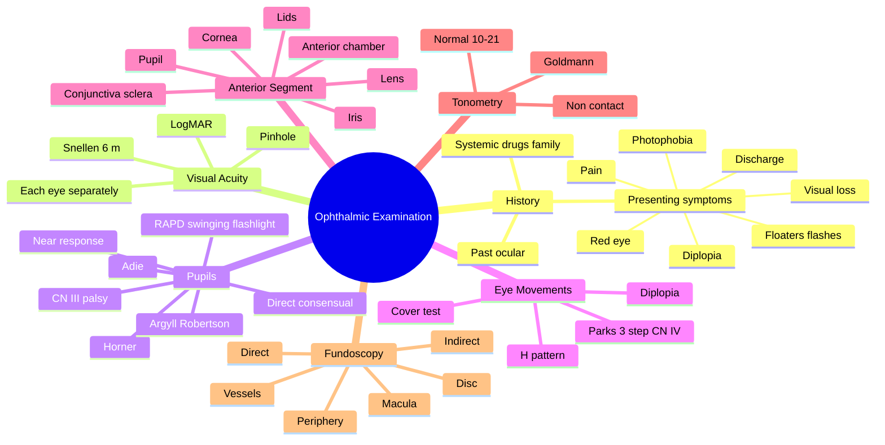

# Ophthalmic History and Examination

Related: [[Visual Acuity Testing]], [[The Red Eye Approach]], [[Acute Visual Loss Approach]], [[Anatomy of the Eye]], [[Fundoscopy]]

> [!tip] **FCPS/MRCP Priority: CRITICAL**
> Master a systematic approach — PACES stations and short cases often include eye examination. Always assess: vision, pupil, eye movements, anterior segment, fundus.

---

## Learning Objectives
- [ ] Take a focused ophthalmic history (presenting symptoms, past, drug, family, systemic)
- [ ] Perform systematic examination: visual acuity → pupil → EOMs → anterior segment → fundus
- [ ] Identify red flags in ophthalmic history
- [ ] Interpret common examination findings (RAPD, ptosis, proptosis, nystagmus)

## 1. Focused Ophthalmic History

### Presenting Symptoms
- **Red eye** — discharge, pain, photophobia, blurred vision
- **Visual loss** — sudden or gradual, painful or painless, transient or persistent, monocular or binocular
- **Diplopia** — monocular (usually refractive, doesn't correct with pinhole) vs binocular (extraocular muscle / nerve issue)
- **Discharge** — watery, mucoid, purulent, blood-stained
- **Foreign body sensation / pain** — superficial vs deep (deep = serious: uveitis, scleritis, endophthalmitis)
- **Photophobia** — corneal, uveal, meningeal irritation
- **Floaters, flashes, curtain** — posterior segment emergency (retinal detachment)
- **Itching** — allergy, blepharitis, dry eye

### Past Ocular History
- Spectacles, contact lens wear (type, hygiene)
- Previous surgery, trauma, amblyopia
- Glaucoma, diabetic eye disease, ARMD

### Systemic / Drug / Family
- DM, HTN, autoimmune disease, HIV, TB
- Steroids, hydroxychloroquine, ethambutol, tamoxifen, amiodarone
- Family history of glaucoma, retinitis pigmentosa, retinoblastoma

## 2. Visual Acuity

- **Snellen chart** at 6 m (or 3 m with mirror)
- Test each eye separately, with current correction, then pinhole (corrects refractive error to ~6/6)
- Document: VA right = 6/X, left = 6/Y (with correction)
- **LogMAR** preferred for research; CF, HM, LP, NLP if unable to read chart
- Near vision: Jaeger or N-point print

## 3. Pupillary Examination

### Direct and Consensual Response
- Shine light in one eye → both pupils constrict
- Direct = same eye, Consensual = opposite eye

### Swinging Flashlight Test (for RAPD / Marcus Gunn)
- Swing light from one eye to the other
- Affected eye (defective afferent) → paradoxical dilation when light swung to it
- Grade 1–4 using neutral density filters

### Causes of RAPD
- Optic neuritis, AION, optic nerve compression, severe retinal disease (CRAO, retinal detachment)
- NOT caused by cataract, refractive error, or cortical lesions

### Near Response
- Ask patient to focus on near target after looking far
- **Light-near dissociation:** absent light response, preserved near response
  - Argyll Robertson pupil (neurosyphilis)
  - Adie pupil (tonic dilated pupil, often young women)
  - Parinaud syndrome (dorsal midbrain)

### Other Pupil Signs
| Sign | Description | Cause |
|------|-------------|-------|
| Horner's | Miosis, ptosis, anhidrosis | Sympathetic lesion (Pancoast, brainstem) |
| CN III palsy | Fixed dilated pupil (compressive) | Posterior communicating artery aneurysm |
| Adie | Tonic dilated pupil, slow near response | Ciliary ganglion damage |
| Argyll Robertson | Small irregular, no light, normal near | Neurosyphilis |

## 4. Eye Movements (Extraocular Muscles)

- **H-pattern:** Move finger in H shape, observe for limitation, pain
- **Diplopia:** Worst in direction of action of weak muscle; image is "outer" (farthest) for the affected eye
- **Cover test:** For tropia/strabismus
- **Park's 3-step test** for CN IV palsy

## 5. Anterior Segment Examination (Slit-lamp)

- **Lids:** Position, lesions, closure (CN VII)
- **Conjunctiva/sclera:** Injection pattern (ciliary flush = keratitis/uveitis/acute glaucoma; diffuse = conjunctivitis)
- **Cornea:** Clarity, ulcers (fluorescein staining), keratic precipitates (KPs)
- **Anterior chamber:** Depth, cells, flare, hypopyon
- **Iris:** Synechiae, rubeosis, transillumination
- **Pupil:** Shape, RAPD
- **Lens:** Cataract, IOL position

## 6. Tonometry

- Goldmann applanation (gold standard)
- Non-contact (air-puff) — screening
- Normal 10–21 mmHg
- Higher in supine position, lower in thin corneas

## 7. Fundoscopy (Ophthalmoscopy)

- Dark room, dilate pupil (tropicamide 0.5–1%) if no contraindication
- Examine: optic disc (cup, colour, swelling), vessels (AV ratio, nicking, haemorrhages), macula (oedema, hole, drusen), periphery (tears, detachment)
- **Direct ophthalmoscope:** magnified view (~15×), limited field
- **Indirect ophthalmoscope:** wider field, used for retinal detachment

## 8. Confrontation Visual Fields

- Sit 1 m facing patient
- Test each quadrant separately with finger
- Useful for detecting gross field defects (homonymous hemianopia, etc.)

## 9. FCPS/MRCP High-Yield Summary

| Component | Key Tests |
|-----------|-----------|
| Vision | Snellen each eye, with correction, pinhole |
| Pupils | Direct, consensual, RAPD, near response |
| EOMs | H-pattern, diplopia, cover test |
| Anterior segment | Slit-lamp: lids → cornea → AC → iris → lens |
| IOP | Goldmann tonometry |
| Fundus | Disc, vessels, macula, periphery |
| Red flags | Sudden painless loss → retinal/optic nerve; painful red eye → serious cause |

## 10. Viva Questions

1. **Q:** How do you differentiate a relative afferent pupillary defect from a CN III palsy?
   **A:** RAPD = afferent (CN II) — both pupils still react, swinging flashlight shows paradoxical dilation. CN III palsy = efferent — affected pupil dilated and unreactive.

2. **Q:** How do you assess for RAPD?
   **A:** Swinging flashlight test. Normal: both pupils constrict equally. RAPD: defective eye dilates when light swung to it.

3. **Q:** What does pinhole testing do?
   **A:** Eliminates refractive error by allowing only central parallel rays through; improves vision to ~6/6 if refractive error is the cause of reduced acuity.

4. **Q:** What pattern of injection suggests serious red eye?
   **A:** Ciliary flush (limbal/perilimbal injection, deep red, circumcorneal) suggests keratitis, uveitis, or acute glaucoma — not conjunctivitis.

5. **Q:** Describe the slit-lamp examination order.
   **A:** Lids → conjunctiva/sclera → cornea → anterior chamber → iris → pupil → lens. Always document findings systematically.

6. **Q:** How is confrontation visual field testing done?
   **A:** Sit 1 m facing the patient. Test each eye separately, compare the patient's peripheral field with your own in all four quadrants.

## 11. Common Confusions / Exam Traps

| Confusion | Clarification |
|-----------|---------------|
| RAPD vs efferent defect | RAPD = afferent (CN II) — pupil still reactive to light from other eye. Efferent (CN III) = fixed dilated pupil |
| Ciliary flush vs conjunctival injection | Ciliary = deep, perilimbal, suggests serious disease. Conjunctival = superficial, peripheral, suggests conjunctivitis |
| Monocular vs binocular diplopia | Monocular persists with one eye covered → refractive (cataract, astigmatism). Binocular disappears with one eye covered → extraocular muscle problem |
| Pinhole improvement | Pinhole improves only refractive errors. If pinhole doesn't help, the cause is in the eye itself (media, retina, nerve) |
| Light-near dissociation | Argyll Robertson = small irregular + no light + normal near (syphilis). Adie = tonic dilated + slow near + absent light |
| Direct vs consensual | Direct = same eye; Consensual = opposite eye. Both pupils should constrict to light in either eye |
| Tonometry caveats | IOP higher supine, lower in thin corneas, falsely low after topical anaesthetic overuse, higher in morning |
| Horner's vs CN III palsy | Horner's = miosis + ptosis + anhidrosis. CN III palsy = mydriasis + ptosis + "down and out" |

## 12. Mnemonics

1. **"V-PEE-AT-F"** — Systematic exam order: Visual acuity → Pupils → External/Eye movements → Anterior segment (slit-lamp) → Tonometry → Fundus.
2. **"3 P's of the Red Eye: Pain, Photophobia, Poor vision"** — If all 3 present → serious (keratitis, uveitis, acute glaucoma). If only 1–2 (e.g., discharge) → conjunctivitis.
3. **"Ciliary flush = serious, conjunctival injection = trivial"** — Deep perilimbal = anterior segment pathology; superficial = surface disease.
4. **"RAPD = afferent, fixed dilated = efferent"** — Afferent (CN II) lesion → RAPD; Efferent (CN III) lesion → fixed dilated pupil.

## 13. Mind Map

## 14. One-Page Revision Card

| Field | Content |
|-------|---------|
| **Topic** | Ophthalmic History & Examination |
| **Exam order** | V → P → E → A → T → F (Vision, Pupils, External, Anterior, Tonometry, Fundus) |
| **VA** | Snellen 6 m, with correction, pinhole |
| **RAPD** | Swinging flashlight — affected eye dilates |
| **Ciliary flush** | Deep perilimbal = serious; superficial = conjunctivitis |
| **Tonometry** | Goldmann; normal 10–21 mmHg |
| **Pinhole** | Improves refractive errors only |
| **Light-near dissociation** | Argyll Robertson (syphilis), Adie |
| **Viva Pearl** | Always document VA first — it is the cornerstone of the eye exam |

## Spaced Repetition Trackers

### 24-Hour Recall Prompts
- [ ] State the systematic exam order V-PEE-AT-F
- [ ] Describe how to perform the swinging flashlight test
- [ ] List 3 causes of RAPD
- [ ] Differentiate ciliary flush from conjunctival injection
- [ ] State the normal IOP range and gold standard tonometry method
- [ ] Describe slit-lamp exam order

### Revision Schedule
- [ ] **Day 1** completed (creation + 24h recall)
- [ ] **Day 3** revision completed
- [ ] **Day 7** revision completed
- [ ] **Day 15** revision completed
- [ ] **Day 30** revision completed
- [ ] **Day 90** revision completed

## Must Know / Should Know / Nice to Know

### Must Know (Core for passing)
- [x] Systematic exam order (V-PEE-AT-F)
- [x] Visual acuity testing (Snellen, pinhole)
- [x] Pupillary examination (direct, consensual, RAPD, near)
- [x] Ciliary flush vs conjunctival injection
- [x] Slit-lamp examination sequence
- [x] Tonometry (Goldmann, normal 10–21 mmHg)
- [x] Fundoscopy essentials (disc, vessels, macula)
- [x] Red flags in history (sudden painless loss, painful red eye)

### Should Know (High probability)
- [x] Horner's vs CN III palsy
- [x] Light-near dissociation causes
- [x] Confrontation visual field testing
- [x] Cover test and Park's 3-step
- [x] Monocular vs binocular diplopia
- [x] Drugs with ocular toxicity (hydroxychloroquine, ethambutol, steroids)

### Nice to Know (Differentiator)
- [ ] Indirect vs direct ophthalmoscopy differences
- [ ] Neutral density filter grading of RAPD
- [ ] Slit-lamp techniques (gonioscopy, applanation)
- [ ] Optical coherence tomography (OCT) interpretation

## My Weak Points
- [ ] Add personal weak areas here

## Self-Test Scorecard

| Section | Score /10 |
|---------|-----------|
| Understanding: | /10 |
| Recall: | /10 |
| MCQ Performance: | /10 |
| SBA Performance: | /10 |
| Viva Confidence: | /10 |
| Total: | /50 |

> [!tip] **Interpretation:** <35 = weak topic, 35–44 = acceptable but insecure, 45+ = strong exam-ready topic.

## Exam Answer Modes

### Long Answer Skeleton
1. History — presenting symptoms, past ocular, systemic, drugs, family
2. Visual acuity (Snellen, with correction, pinhole)
3. Pupils (direct, consensual, RAPD, near response)
4. External/Eye movements (H pattern, cover test)
5. Anterior segment (slit-lamp: lids → conjunctiva → cornea → AC → iris → lens)
6. Tonometry (Goldmann; normal 10–21)
7. Fundoscopy (disc, vessels, macula, periphery)
8. Red flags and triage

### Short Note Skeleton
- RAPD — swinging flashlight test, causes
- Ciliary flush vs conjunctival injection
- Pinhole testing
- Tonometry methods

### Viva One-Liners
- **Q:** Exam order? → **A:** V-PEE-AT-F: Vision, Pupils, External/EOMs, Anterior segment, Tonometry, Fundus.
- **Q:** How to detect RAPD? → **A:** Swinging flashlight test; defective eye dilates when light swings to it.
- **Q:** Ciliary flush suggests? → **A:** Keratitis, uveitis, or acute glaucoma — not conjunctivitis.
- **Q:** Pinhole improves? → **A:** Refractive errors only (if VA still reduced → media, retina, or nerve disease).
- **Q:** Light-near dissociation causes? → **A:** Argyll Robertson (syphilis), Adie pupil, Parinaud syndrome.

### Ward-Case Discussion Points
- Recognise ciliary flush and triage as serious red eye
- Differentiate afferent (RAPD) from efferent (CN III) pupillary defect
- Identify Horner's vs CN III palsy from the eye signs
- Choose appropriate imaging / referral based on examination findings

### Last-Night-Before-Exam Sheet
- **Top 5 facts:** V-PEE-AT-F order; pinhole → refractive; ciliary flush = serious; RAPD = afferent; tonometry 10–21
- **2 mnemonics:** "V-PEE-AT-F"; "3 P's of serious red eye: Pain, Photophobia, Poor vision"
- **Must-know differential:** Monocular diplopia = refractive; Binocular diplopia = EOM/neural

## Summary

Systematic ophthalmic exam: **V**isual acuity → **P**upils → **E**xternal → **E**ye movements → **A**nterior segment (slit-lamp) → **T**onometry → **F**undus. Ciliary flush + ↓VA + pain = serious red eye. RAPD = afferent defect. Document carefully — eye notes are medico-legally important.

## MCQs (10)

1. **Q:** Pinhole testing improves vision in:
   **Options:** A. Cataract B. Glaucoma C. Refractive error D. Retinal disease E. Optic neuritis
   **Answer:** C
   **Explanation:** Pinhole eliminates refractive error by allowing only central parallel rays through.

2. **Q:** Ciliary flush is characteristic of:
   **Options:** A. Conjunctivitis B. Keratitis C. Blepharitis D. Chalazion E. Pterygium
   **Answer:** B
   **Explanation:** Ciliary (perilimbal) injection = deep, suggests keratitis/uveitis/acute glaucoma.

3. **Q:** Argyll Robertson pupil is associated with:
   **Options:** A. Diabetes B. Syphilis C. Multiple sclerosis D. Myasthenia gravis E. Horner's syndrome
   **Answer:** B
   **Explanation:** Neurosyphilis = irregular pupils, no light response, normal near response ("prostitute's pupil" — accommodates but does not react).

4. **Q:** The swinging flashlight test detects:
   **Options:** A. Efferent pupillary defect B. Afferent pupillary defect C. CN III palsy D. CN VI palsy E. Convergence insufficiency
   **Answer:** B
   **Explanation:** Detects RAPD (afferent = CN II). The affected eye paradoxically dilates when the light swings to it.

5. **Q:** Snellen 6/60 in the better eye defines:
   **Options:** A. Driving standard B. Legal blindness (most countries) C. Severe visual impairment D. Normal vision E. Low vision
   **Answer:** B
   **Explanation:** VA 6/60 or worse in the better eye = legal blindness in many jurisdictions (WHO definition: <6/60 in better eye).

6. **Q:** Goldmann applanation tonometry measures:
   **Options:** A. Corneal thickness B. Intraocular pressure C. Refractive error D. Retinal thickness E. Axial length
   **Answer:** B
   **Explanation:** Goldmann applanation is the gold standard for measuring IOP (normal 10–21 mmHg).

7. **Q:** A dilated pupil that does not react to direct or consensual light is:
   **Options:** A. RAPD B. Efferent (CN III) defect C. Adie pupil D. Argyll Robertson E. Horner's
   **Answer:** B
   **Explanation:** A fixed dilated pupil = efferent defect (CN III palsy). RAPD is afferent — the pupil still reacts to light shone in the other eye.

8. **Q:** Dilating drops should be AVOIDED in suspected:
   **Options:** A. Conjunctivitis B. Acute angle-closure glaucoma C. Cataract D. Blepharitis E. Pterygium
   **Answer:** B
   **Explanation:** Mydriasis can precipitate angle closure in susceptible eyes (shallow anterior chambers) — always check AC depth first.

9. **Q:** Confrontation visual field testing is performed at:
   **Options:** A. 6 m B. 3 m C. 1 m D. 30 cm E. 2 m
   **Answer:** C
   **Explanation:** Standard confrontation testing is at 1 m distance, comparing the patient's peripheral field with your own.

10. **Q:** The first step in ophthalmic examination is:
    **Options:** A. Tonometry B. Fundoscopy C. Visual acuity D. Slit-lamp E. Pupil examination
    **Answer:** C
    **Explanation:** Visual acuity is always tested first — it is the cornerstone of the eye exam and guides all further testing.

## SBA Questions (10)

1. **Scenario:** A 30-year-old woman has sudden painless loss of vision in one eye, fundus shows a swollen disc, vision improves over weeks.
   **Question:** Most likely cause?
   **Options:** A. CRAO B. Optic neuritis C. Retinal detachment D. Vitreous haemorrhage E. Macular hole
   **Answer:** B
   **Explanation:** Demyelinating optic neuritis typical — young, painful eye movements, swollen disc, recovers.

2. **Scenario:** A 60-year-old man has painful red eye, ↓VA, halos around lights, fixed mid-dilated pupil, IOP 60 mmHg.
   **Question:** Diagnosis?
   **Options:** A. Acute conjunctivitis B. Acute anterior uveitis C. Acute angle-closure glaucoma D. Endophthalmitis E. Scleritis
   **Answer:** C
   **Explanation:** Painful red eye + halos + fixed mid-dilated pupil + ↑IOP = acute angle-closure glaucoma. Halos due to corneal oedema.

3. **Scenario:** A 35-year-old has red eye with mucopurulent discharge, no pain, normal vision.
   **Question:** Diagnosis?
   **Options:** A. Keratitis B. Acute angle-closure glaucoma C. Bacterial conjunctivitis D. Uveitis E. Endophthalmitis
   **Answer:** C
   **Explanation:** Painless red eye + mucopurulent discharge + normal vision = bacterial conjunctivitis (sticky eyes in the morning).

4. **Scenario:** A 70-year-old man presents with sudden painless loss of vision in one eye. Fundus shows a pale retina with a "cherry-red spot" at the macula.
   **Question:** Diagnosis?
   **Options:** A. CRVO B. CRAO C. Retinal detachment D. Vitreous haemorrhage E. Optic neuritis
   **Answer:** B
   **Explanation:** Sudden painless loss + cherry-red spot at macula + pale retina = central retinal artery occlusion (CRAO). Ophthalmic emergency.

5. **Scenario:** A 25-year-old woman has sudden loss of vision in one eye with floaters and a "curtain" descending over her vision.
   **Question:** Most likely diagnosis?
   **Options:** A. CRAO B. Retinal detachment C. Optic neuritis D. Vitreous haemorrhage E. Acute glaucoma
   **Answer:** B
   **Explanation:** Floaters + flashes + curtain descending = retinal detachment. Needs urgent ophthalmic referral.

6. **Scenario:** A patient has ptosis, miosis, and anhidrosis on one side of the face. The pupil reacts normally to light.
   **Question:** Diagnosis?
   **Options:** A. CN III palsy B. Horner's syndrome C. Adie pupil D. Argyll Robertson E. Carotid dissection
   **Answer:** B
   **Explanation:** Horner's triad: miosis, ptosis, anhidrosis. Pupil reacts normally (afferent and parasympathetic efferent intact). Sympathetic lesion.

7. **Scenario:** A 50-year-old diabetic presents with sudden painless loss of vision. Fundus shows "blood and thunder" appearance with multiple retinal haemorrhages.
   **Question:** Diagnosis?
   **Options:** A. CRAO B. CRVO C. Diabetic retinopathy D. Retinal detachment E. Vitreous haemorrhage
   **Answer:** B
   **Explanation:** "Blood and thunder" fundus = CRVO (ischaemic type). Severe disc oedema, multiple haemorrhages in all four quadrants.

8. **Scenario:** A 45-year-old presents with sudden severe eye pain, photophobia, blurred vision, and a small pupil that doesn't dilate in the dark. The eye is red around the limbus.
   **Question:** Most likely diagnosis?
   **Options:** A. Conjunctivitis B. Acute angle-closure glaucoma C. Acute anterior uveitis D. Keratitis E. Scleritis
   **Answer:** C
   **Explanation:** Pain + photophobia + ↓VA + ciliary flush + small miotic pupil = acute anterior uveitis. IOP usually normal or low.

9. **Scenario:** A 65-year-old with giant cell arteritis presents with sudden loss of vision. Fundus shows a pale, swollen optic disc.
   **Question:** Diagnosis?
   **Options:** A. CRVO B. CRAO C. Arteritic AION D. Optic neuritis E. Retinal detachment
   **Answer:** C
   **Explanation:** Pale swollen disc + GCA symptoms (jaw claudication, scalp tenderness, headache) = arteritic anterior ischaemic optic neuropathy. Needs urgent IV methylprednisolone.

10. **Scenario:** A 25-year-old has sudden painful loss of vision in one eye with reduced colour vision, RAPD, and pain worse on eye movement.
    **Question:** Most likely diagnosis?
    **Options:** A. CRAO B. Retinal detachment C. Optic neuritis D. Acute glaucoma E. Vitreous haemorrhage
    **Answer:** C
    **Explanation:** Painful ↓VA + ↓ colour vision + RAPD + pain on eye movement + young patient = demyelinating optic neuritis (often MS).

## Flashcards

- **Q:** Systematic exam order?
  **A:** V-PEE-AT-F: Visual acuity → Pupils → External/Eye movements → Anterior segment (slit-lamp) → Tonometry → Fundus.
- **Q:** What does the swinging flashlight test detect?
  **A:** RAPD (relative afferent pupillary defect). Affected eye paradoxically dilates when light swings to it.
- **Q:** Ciliary flush vs conjunctival injection?
  **A:** Ciliary flush = deep perilimbal (serious: keratitis, uveitis, acute glaucoma). Conjunctival = superficial peripheral (conjunctivitis).
- **Q:** When should you avoid dilating drops?
  **A:** Suspected acute angle-closure glaucoma (shallow anterior chamber).
- **Q:** Three causes of light-near dissociation?
  **A:** Argyll Robertson (syphilis), Adie pupil (tonic dilated), Parinaud syndrome (dorsal midbrain).
- **Q:** How is confrontation visual field testing performed?
  **A:** Sit 1 m facing the patient; test each eye separately; compare patient's peripheral field with your own in all four quadrants.

## Answer Key with Explanations

### MCQs
1. **C** — Pinhole eliminates refractive error.
2. **B** — Ciliary (perilimbal) injection = keratitis, uveitis, or acute glaucoma.
3. **B** — Neurosyphilis = irregular pupils, no light response, normal near response.
4. **B** — Swinging flashlight detects RAPD (afferent = CN II).
5. **B** — 6/60 or worse in the better eye = legal blindness in many jurisdictions.
6. **B** — Goldmann applanation = gold standard for IOP.
7. **B** — Fixed dilated pupil = efferent (CN III) defect.
8. **B** — Mydriasis can precipitate angle closure in shallow AC.
9. **C** — Standard confrontation testing is at 1 m.
10. **C** — Visual acuity is always tested first.

### SBAs
1. **B** — Young patient + sudden loss + swollen disc + recovers = optic neuritis (often MS).
2. **C** — Painful red eye + halos + fixed pupil + ↑IOP = acute angle-closure glaucoma.
3. **C** — Painless red eye + mucopurulent discharge + normal vision = bacterial conjunctivitis.
4. **B** — Sudden painless loss + cherry-red spot + pale retina = CRAO.
5. **B** — Floaters + flashes + curtain = retinal detachment.
6. **B** — Miosis + ptosis + anhidrosis = Horner's syndrome.
7. **B** — "Blood and thunder" fundus = CRVO (ischaemic).
8. **C** — Pain + photophobia + ↓VA + ciliary flush + small pupil = acute anterior uveitis.
9. **C** — Pale swollen disc + GCA symptoms = arteritic AION.
10. **C** — Painful ↓VA + ↓ colour vision + RAPD + pain on eye movement = optic neuritis.

## Tags
#medicine #davidson #ophthalmology #examination #fcps #mrcp #exam-prep
