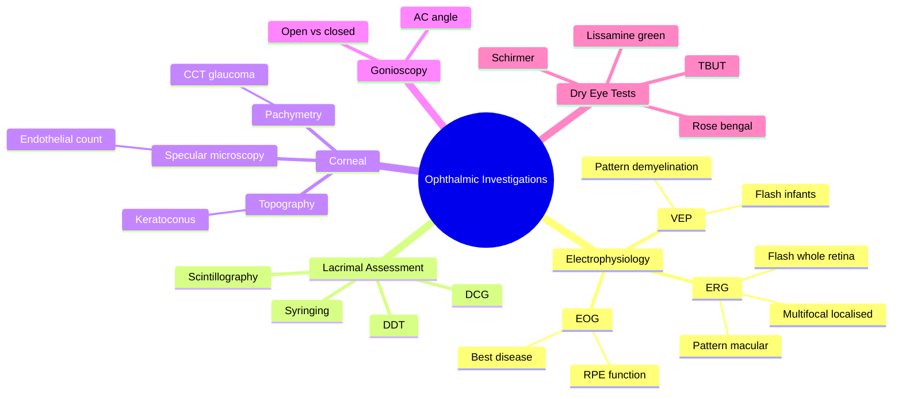

## Learning Objectives

- [ ] Describe the principles, indications, and limitations of electrophysiology tests (ERG, EOG, VEP).
- [ ] Differentiate photoreceptor, RPE, and post-retinal disease using the standard test battery (flash ERG, pattern ERG, EOG, VEP).
- [ ] Interpret fluorescein angiography phases (choroidal, arterial, arteriovenous, venous, late recirculation) and recognise hyperfluorescence vs hypofluorescence patterns.
- [ ] Describe the role of indocyanine green angiography in choroidal vasculature imaging (e.g., choroidal neovascularisation, vasculitis).
- [ ] Outline optical coherence tomography (OCT) principles and identify retinal layer changes in macular oedema, epiretinal membrane, and macular hole.
- [ ] List the indications for ocular ultrasound (B-scan) in opaque media and identify common findings (RD, mass, IOFB).

---

# Other Ophthalmic Investigations

Related: [[Ocular Imaging]], [[Slit-lamp Biomicroscopy]], [[Visual Evoked Potentials]], [[ERG]]

> [!tip] **FCPS/MRCP Priority: MEDIUM**
> Less commonly tested but important to know principles and indications.

---

## 1. Electrophysiology

### Electroretinography (ERG)
- Records electrical response of retina to light
- **Flash ERG:** whole retina
  - a-wave = photoreceptor
  - b-wave = bipolar/Müller
- **Pattern ERG:** macular function (ganglion cells)
- **Multifocal ERG:** localised macular function
- Uses: retinitis pigmentosa (rod-cone dystrophy, extinguished ERG), CRVO, congenital stationary night blindness

### Visual Evoked Potentials (VEP)
- Records occipital response to visual stimulus
- **Pattern VEP:** checks for demyelination (delayed P100 in optic neuritis)
- **Flash VEP:** for infants, opaque media
- Uses: suspected optic neuritis (delayed P100, often with reduced amplitude), functional visual loss

### Electro-oculography (EOG)
- Measures standing potential of RPE
- Arden ratio (light peak / dark trough) <1.8 = abnormal
- Best for vitelliform lesions (Best disease)

---

## 2. Lacrimal System Assessment

### Dye Disappearance Test (DDT)
- Fluorescein in conjunctival sac → observe clearance
- Delayed = obstruction

### Syringing (Lacrimal Irrigation)
- Cannula into punctum → saline
- Fluid into nose/throat = patent system
- Regurgitation = obstruction (sac → punctum)

### Dacryocystography (DCG)
- Contrast into lacrimal system
- Defines site of obstruction (canaliculus, sac, NLD)

### Lacrimal Scintillography
- Radioactive tracer
- Functional study of drainage

---

## 3. Specular Microscopy

- Photographic count of corneal endothelial cells
- Normal density: 2000–2500 cells/mm²
- Decreased in: Fuchs dystrophy, contact lens wear, post-cataract
- Critical <1000 cells/mm² — risk of corneal decompensation

---

## 4. Corneal Topography / Tomography

- Placido disc, scanning slit, Scheimpflug
- Maps corneal curvature (keratometry, astigmatism)
- Detects keratoconus (irregular astigmatism, ↑K max)
- Pre-LASIK evaluation
- Pentacam = tomography (anterior + posterior curvature, pachymetry)

---

## 5. Pachymetry (CCT)

- **Ultrasound** (contact, accurate, gold standard)
- **Optical** (non-contact, OCT-based)
- Normal: ~540 µm
- Affects: IOP reading, glaucoma risk, LASIK eligibility
- Thin (<520) = more glaucoma risk, falsely low IOP
- Thick (>600) = more Fuchs, falsely high IOP

---

## 6. Gonioscopy

- Goldmann or Zeiss lens on anaesthetised eye
- Visualises the anterior chamber angle
- Differentiates open-angle vs closed-angle glaucoma
- Identifies: neovascularisation, pigment, peripheral anterior synechiae (PAS), angle recession
- Shaffer grading (0–4): 0 = closed, 4 = wide open (>35°)

---

## 7. Lacrimal Function Tests

| Test | What it measures |
|------|------------------|
| **Schirmer I** | Total tear production (no anaesthetic); <10 mm/5 min = dry eye |
| **Schirmer II** | Reflex tear production (nasal stimulation) |
| **Tear break-up time (TBUT)** | <10 s = evaporative dry eye (MGD) |
| **Rose bengal** | Stains devitalised epithelial cells, mucin |
| **Lissamine green** | Less toxic alternative to rose bengal |

---

## 8. FCPS/MRCP High-Yield Summary

| Test | Use |
|------|-----|
| ERG | Retinal dystrophies (RP) |
| VEP (pattern) | Optic neuritis (delayed P100) |
| Specular microscopy | Endothelial cell count (Fuchs) |
| Corneal topography | Keratoconus, refractive surgery |
| Gonioscopy | Angle assessment (glaucoma) |
| Schirmer test | Dry eye diagnosis |

---

## 9. Viva Questions

1. **Q:** What does pattern VEP show in optic neuritis?
   **A:** Delayed P100 latency (due to demyelination), often with reduced amplitude.

2. **Q:** What is the Arden ratio in EOG?
   **A:** Light peak / dark trough ratio. <1.8 abnormal (e.g., Best disease).

3. **Q:** How is gonioscopy performed and what does it assess?
   **A:** Contact lens on anaesthetised cornea at slit-lamp. Visualises the AC angle. Differentiates open vs closed angle, identifies neovascularisation, PAS.

---

## Summary

ERG assesses retinal function (RP, CRVO). VEP assesses optic nerve conduction (delayed in demyelination). Specular microscopy counts endothelial cells. Gonioscopy is essential in glaucoma assessment. Schirmer and TBUT diagnose dry eye.

## MCQs (10)
1. **Q:** Pattern VEP is most useful in diagnosing:
   **Options:** A. Cataract B. Optic neuritis C. Glaucoma D. Retinal detachment E. Keratitis
   **Answer: B**
   **Explanation:** Delayed P100 latency is the classic finding in demyelinating optic neuritis.
2. **Q:** Schirmer test <10 mm/5 min suggests:
   **Options:** A. Glaucoma B. Dry eye C. Uveitis D. Cataract E. Infection
   **Answer: B**
   **Explanation:** Reduced tear production = aqueous-deficient dry eye (without anaesthetic, tests total + reflex).
3. **Q:** Normal central corneal thickness (CCT) is approximately:
   **Options:** A. 200 µm B. 400 µm C. 540 µm D. 800 µm E. 1000 µm
   **Answer: C**
   **Explanation:** Mean ~540 µm. Affects IOP measurement and glaucoma risk.
4. **Q:** Gonioscopy is used to:
   **Options:** A. Examine retina B. Examine optic disc C. Examine anterior chamber angle D. Measure IOP E. Examine cornea
   **Answer: C**
   **Explanation:** Visualises AC angle (open/closed, neovascularisation, PAS, recession).
5. **Q:** Flash ERG a-wave originates from:
   **Options:** A. Bipolar cells B. Müller cells C. Photoreceptors D. Ganglion cells E. RPE
   **Answer: C**
   **Explanation:** a-wave = photoreceptor activity; b-wave = bipolar/Müller.
6. **Q:** Pattern ERG (PERG) primarily assesses:
   **Options:** A. Rod function B. Macular/ganglion cell function C. Optic nerve conduction D. RPE E. Vitreous
   **Answer: B**
   **Explanation:** PERG is generated by retinal ganglion cells; reduced in optic nerve and macular disease.
7. **Q:** Tear break-up time (TBUT) <10 s indicates:
   **Options:** A. Aqueous-deficient dry eye B. Evaporative dry eye (MGD) C. Allergy D. Normal tear film E. Blepharospasm
   **Answer: B**
   **Explanation:** TBUT <10 s = tear film instability, often from meibomian gland dysfunction.
8. **Q:** Specular microscopy is most useful for:
   **Options:** A. Corneal thickness B. Endothelial cell count C. Corneal curvature D. Refraction E. Intraocular pressure
   **Answer: B**
   **Explanation:** Counts endothelial cells; normal 2000–2500/mm²; critical <1000/mm².
9. **Q:** Corneal topography is the gold standard investigation for:
   **Options:** A. Keratoconus B. Glaucoma C. Uveitis D. Retinoblastoma E. Optic neuritis
   **Answer: A**
   **Explanation:** Detects irregular astigmatism and ↑K max; essential for refractive surgery screening.
10. **Q:** Dacryocystography (DCG) is used to:
    **Options:** A. Image the lacrimal drainage system B. Image the retina C. Measure IOP D. Examine optic nerve E. Examine cornea
    **Answer: A**
    **Explanation:** Contrast study to localise the site of lacrimal obstruction (canaliculus, sac, NLD).

## SBA Questions (10)
1. **Scenario:** A 25-year-old has nyctalopia, tunnel vision, and bone-spicule pigmentation on fundoscopy.
   **Question:** Most useful investigation?
   **Options:** A. ERG B. VEP C. OCT D. MRI E. FFA
   **Answer: A**
   **Explanation:** Retinitis pigmentosa → flash ERG is extinguished (rod-cone dystrophy).
2. **Scenario:** A 30-year-old with suspected demyelinating optic neuritis has a normal MRI brain. The patient insists vision is still "blurred" two weeks after onset.
   **Question:** Most useful objective test of optic nerve conduction?
   **Options:** A. Pattern VEP B. OCT macula C. Visual field only D. Fundus photography E. Fluorescein angiography
   **Answer: A**
   **Explanation:** Pattern VEP shows delayed P100 in demyelination and can confirm functional visual loss.
3. **Scenario:** A patient planned for cataract surgery has a history of Fuchs endothelial dystrophy in the family. The surgeon requests a count of corneal endothelial cells.
   **Question:** Which investigation is required?
   **Options:** A. Specular microscopy B. Corneal topography C. OCT D. Pachymetry E. Confocal microscopy
   **Answer: A**
   **Explanation:** Specular microscopy quantifies endothelial cell density; critical <1000 cells/mm² = high decompensation risk.
4. **Scenario:** A 60-year-old glaucoma patient has CCT of 490 µm. The IOP is 18 mmHg on Goldmann.
   **Question:** How does CCT affect this patient's risk assessment?
   **Options:** A. Thin cornea overestimates true IOP; high glaucoma risk B. Thick cornea overestimates true IOP C. CCT has no effect D. Thin cornea means normal pressure E. CCT affects pachymetry only
   **Answer: A**
   **Explanation:** Thin cornea (<520 µm) causes under-reading of IOP and is itself a glaucoma risk factor.
5. **Scenario:** A patient with sudden painful red eye, haloes, and IOP 50 mmHg has corneal oedema precluding fundus view.
   **Question:** What investigation is needed before starting pilocarpine?
   **Options:** A. Gonioscopy B. OCT C. MRI D. ERG E. Visual field
   **Answer: A**
   **Explanation:** Gonioscopy confirms angle closure vs open angle; pilocarpine is used only in closure; avoid in inflammatory/uveitic angle closure.
6. **Scenario:** A 70-year-old presents with epiphora and a mucocoele. Syringing reveals fluid regurgitating from the same punctum.
   **Question:** Where is the obstruction?
   **Options:** A. Punctum/canaliculus B. Nasolacrimal duct C. Lacrimal sac D. Conjunctiva E. Sinus
   **Answer: B**
   **Explanation:** Regurgitation from same punctum on syringing = NLD obstruction; lacrimal sac level obstruction gives reflux of mucoid material.
7. **Scenario:** A patient with suspected Best disease has normal fundus but family history of vitelliform lesions.
   **Question:** Which test is diagnostic?
   **Options:** A. Arden ratio (EOG) <1.8 B. Flash ERG C. Pattern VEP D. Visual field E. OCT only
   **Answer: A**
   **Explanation:** EOG with Arden ratio <1.8 is diagnostic of Best disease (vitelliform macular dystrophy).
8. **Scenario:** A 6-year-old has reduced vision and nystagmus. ERG is normal but VEP is abnormal.
   **Question:** Where is the lesion?
   **Options:** A. Optic nerve / post-retinal B. Photoreceptors C. RPE D. Vitreous E. Cornea
   **Answer: A**
   **Explanation:** Normal ERG + abnormal VEP = post-retinal (optic nerve / pathway) dysfunction.
9. **Scenario:** A patient with dry eye symptoms has Schirmer I = 6 mm, TBUT = 14 s.
   **Question:** What type of dry eye is this?
   **Options:** A. Aqueous-deficient (Schirmer low, TBUT normal) B. Evaporative (Schirmer normal, TBUT low) C. Mixed D. Allergic E. Neuropathic
   **Answer: A**
   **Explanation:** Low Schirmer with normal TBUT = aqueous-deficient dry eye.
10. **Scenario:** A patient has a superficial corneal foreign body. Which stain most clearly highlights epithelial damage?
    **Options:** A. Fluorescein B. Rose bengal C. Trypan blue D. Indocyanine green E. Methylene blue
    **Answer: A**
    **Explanation:** Fluorescein stains epithelial defects (negative staining of healthy cells); rose bengal stains devitalised cells/mucin.

## Flashcards
- **Q:** What does pattern VEP show in optic neuritis?
  **A:** Delayed P100 latency (often with reduced amplitude) due to demyelination.
- **Q:** What is the Arden ratio in EOG?
  **A:** Light peak / dark trough ratio. <1.8 abnormal (e.g., Best disease).
- **Q:** How is gonioscopy performed and what does it assess?
  **A:** Contact lens on anaesthetised cornea at slit-lamp. Visualises AC angle: open/closed, neovascularisation, PAS, recession.
- **Q:** What does specular microscopy measure?
  **A:** Endothelial cell density (normal 2000–2500/mm²); critical <1000/mm².
- **Q:** What is the normal CCT and why does it matter?
  **A:** ~540 µm. Affects IOP reading (thin = under-reads) and glaucoma/refractive surgery risk.

## Mnemonics
- **"a-wave before b-wave"** — In flash ERG, a-wave (photoreceptors) precedes b-wave (bipolar/Müller).
- **"VEP, EOG, ERG"** — VEP for optic nerve/pathway; EOG for RPE (Best disease); ERG for retinal dystrophies (RP).

## Mind Map

## One-Page Revision Card
| Item | Detail |
|------|--------|
| **Definition** | Specialised ocular investigations beyond slit-lamp and fundoscopy to localise pathology. |
| **Key Clinical** | ERG for retinal dystrophies; VEP for demyelination; specular for endothelium; gonioscopy for angle. |
| **Dx Criteria** | Flash ERG a-wave = photoreceptors; b-wave = bipolar/Müller. VEP delayed P100 = demyelination. EOG Arden ratio <1.8 = Best disease. |
| **Differentials** | Visual loss + normal ERG = optic nerve; visual loss + abnormal ERG = retinal. |
| **Investigations** | ERG, VEP, EOG, specular microscopy, corneal topography, pachymetry, gonioscopy, Schirmer, TBUT, syringing, DCG. |
| **Management** | Treat underlying cause; gonioscopy guides glaucoma management; endothelial count guides cataract surgery safety. |
| **Key Drugs/Doses** | Not primarily pharmacological (diagnostic tests). |
| **Red Flags** | Extinguished ERG = RP; Arden <1.8 = Best; CCT <520 µm = glaucoma risk; cells <1000/mm² = decompensation risk. |
| **Prognosis** | Depends on underlying diagnosis; RP progressive, Best relatively stable, optic neuritis recovers. |
| **Viva Pearls** | "ERG for retina, VEP for optic nerve, EOG for RPE"; "CCT affects IOP — thin = under-reads"; "Gonioscopy = angle assessment in glaucoma". |

## Spaced Repetition Trackers
- [ ] 24 hours
- [ ] 3 days
- [ ] 7 days
- [ ] 15 days
- [ ] 30 days
- [ ] 60 days
- [ ] 90 days

## Self-Test Scorecard
| Section | Score /10 |
|---------|-----------|
| Understanding of modalities | /10 |
| Recall of indications | /10 |
| MCQ Performance | /10 |
| SBA Performance | /10 |
| Viva Confidence | /10 |
| **Total** | **/50** |

## Exam Answer Modes
**Long Answer Skeleton** — Define the test. Principle (electrophysiology, imaging, lacrimal study). Indication. Normal vs abnormal values. Clinical interpretation. Examples.
**Short Note Skeleton** — ERG: photoreceptor & inner nuclear layer; VEP: P100 latency; EOG: Arden ratio; specular: cell density; gonioscopy: AC angle.
**Viva One-Liners** —
1. Q: Pattern VEP in optic neuritis? A: Delayed P100.
2. Q: Arden ratio in Best disease? A: <1.8.
3. Q: ERG a-wave? A: Photoreceptors.
4. Q: Critical endothelial count? A: <1000/mm².
5. Q: CCT and IOP? A: Thin cornea under-reads IOP.
**Ward-Case Discussion Points** — When to order ERG (RP, CRVO); VEP (suspected optic neuritis, functional loss); specular (Fuchs, pre-cataract); gonioscopy (all new glaucoma).
**Last-Night-Before-Exam Sheet** —
- Top 5 facts: 1) ERG = retina, VEP = optic nerve, EOG = RPE; 2) Arden <1.8 = Best; 3) CCT 540 µm; 4) Endothelial critical <1000; 5) Gonioscopy = angle.
- 3 drug doses: N/A (diagnostic tests).
- 2 algorithms: Visual loss + normal fundus → ERG/VEP; Pre-cataract → specular + pachymetry.
- 1 mnemonic: "a before b" (a-wave photoreceptor before b-wave bipolar).
- Must-know differential: Optic neuritis (VEP delayed) vs CRVO (ERG abnormal).

## Common Confusions / Exam Traps
| Confusion | Clarification |
|-----------|---------------|
| "VEP is for retina" | No, VEP is for optic nerve and pathway; ERG is for retina. |
| "Schirmer needs anaesthetic" | Schirmer I is performed WITHOUT anaesthetic (tests total + reflex); with anaesthetic = Schirmer II (basal). |
| "Pachymetry is the same as specular" | No, pachymetry = thickness; specular = cell count/density. |
| "CCT has no clinical relevance" | Thin CCT is an independent glaucoma risk factor and falsely lowers IOP. |
| "Gonioscopy is part of IOP measurement" | No, it is a separate contact lens exam; IOP is measured by tonometry. |
| "EOG is the same as ERG" | No, EOG measures standing RPE potential; ERG measures retinal response to light. |

## Answer Key with Explanations

### MCQs
1. **B** — Pattern VEP shows delayed P100 latency in demyelinating optic neuritis — the classic objective finding.
2. **B** — Schirmer I <10 mm/5 min (without anaesthetic) indicates aqueous-deficient dry eye (reduced reflex + basal tear production).
3. **C** — Mean central corneal thickness ≈ 540 µm. CCT affects tonometry accuracy (thin cornea falsely lowers IOP) and is itself a glaucoma risk factor.
4. **C** — Gonioscopy uses a contact lens at the slit-lamp to visualise the anterior chamber angle (open/closed, neovascularisation, PAS, recession).
5. **C** — In flash ERG, the a-wave arises from photoreceptor hyperpolarisation; the b-wave reflects bipolar/Müller cell activity ("a before b").
6. **B** — Pattern ERG is generated mainly by retinal ganglion cells and is reduced in optic neuropathy and macular disease — useful localiser.
7. **B** — TBUT <10 s = tear film instability, typically from meibomian gland dysfunction (evaporative dry eye).
8. **B** — Specular microscopy quantifies corneal endothelial cell density (normal 2000–2500/mm²). Critical <1000/mm² → decompensation risk.
9. **A** — Corneal topography/tomography is the gold standard for keratoconus screening (irregular astigmatism, ↑K max, inferior steepening) and refractive surgery work-up.
10. **A** — Dacryocystography is a contrast study that localises the level of lacrimal drainage obstruction (canaliculus, sac, or nasolacrimal duct).

### SBAs
1. **A** — Retinitis pigmentosa (nyctalopia, tunnel vision, bone-spicule pigmentation) is confirmed by a markedly reduced/extinguished scotopic flash ERG.
2. **A** — Pattern VEP is the most useful objective test for optic nerve conduction; delayed P100 supports demyelination and can unmask functional overlay.
3. **A** — Specular microscopy quantifies endothelial cell density and is mandatory before intraocular surgery in suspected Fuchs dystrophy; <1000 cells/mm² signals high decompensation risk.
4. **A** — Thin CCT (<520 µm) causes Goldmann tonometry to under-read true IOP and is itself an independent glaucoma risk factor.
5. **A** — Gonioscopy is essential before starting pilocarpine; it distinguishes angle closure (treat with pilocarpine + IOP-lowering + peripheral iridotomy) from open-angle mechanisms.
6. **B** — Regurgitation of fluid from the same punctum on syringing indicates nasolacrimal duct obstruction (NLD); lacrimal sac-level obstruction yields mucoid reflux.
7. **A** — EOG with Arden ratio <1.8 is the diagnostic test for Best vitelliform macular dystrophy, even when the fundus appears normal early.
8. **A** — Normal ERG + abnormal VEP localises disease to the post-retinal visual pathway (optic nerve / chiasm / radiations / cortex).
9. **A** — Low Schirmer with normal TBUT = aqueous-deficient dry eye; evaporative dry eye has the opposite pattern.
10. **A** — Fluorescein stains epithelial defects (negative staining of healthy cells) and is best for corneal abrasions/foreign bodies; rose bengal/lissamine green stain devitalised cells and mucin.

## Tags
#medicine #davidson #ophthalmology #investigations #ERG #VEP #fcps #mrcp
