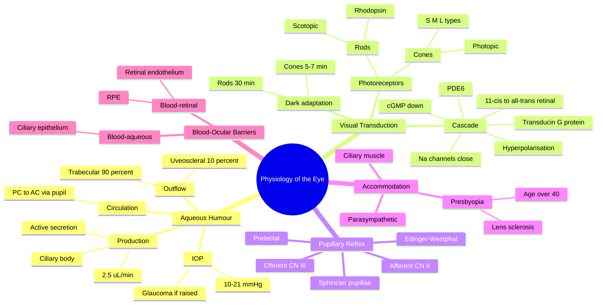

# Physiology of the Eye

Related: [[Anatomy of the Eye]], [[Glaucoma]], [[Tonometry]], [[Medical Ophthalmology MOC]]

> [!tip] **FCPS/MRCP Priority: HIGH**
> Aqueous humour dynamics, visual transduction, and accommodation are tested in physiology and glaucoma vivas.

---

## Learning Objectives
- [ ] Describe aqueous humour production, circulation and drainage
- [ ] Explain the phototransduction cascade
- [ ] Describe the pupillary light reflex pathway
- [ ] Explain accommodation and its neural control
- [ ] Outline the blood-retinal barrier

## 1. Aqueous Humour Dynamics

### Production
- Produced by **ciliary processes** of ciliary body
- Active secretion (carbonic anhydrase, Na⁺/K⁺-ATPase) + ultrafiltration + diffusion
- Rate: ~2.5 µL/min
- Volume: ~250 µL (anterior chamber 200 µL, posterior chamber 50 µL)

### Circulation
- Posterior chamber → pupil → anterior chamber → trabecular meshwork (90%, conventional) → canal of Schlemm → episcleral veins
- 10% uveoscleral outflow (unconventional, through ciliary muscle)

### Intraocular Pressure (IOP)
- Normal: 10–21 mmHg
- Steady-state: production = outflow
- Raised IOP = imbalance → glaucoma risk
- Drugs that lower IOP: β-blockers (↓ production), prostaglandin analogues (↑ uveoscleral outflow), α-agonists (↓ production, ↑ outflow), carbonic anhydrase inhibitors (↓ production), miotics (↑ trabecular outflow)

## 2. Visual Transduction

### Photoreceptors
- **Rods:** scotopic (low light), 120 million, rhodopsin (11-cis-retinal + opsin), concentrated in peripheral retina
- **Cones:** photopic (bright light), 6 million, three types (S=blue 437 nm, M=green 533 nm, L=red 564 nm), concentrated in fovea

### Cascade
1. Photon → 11-cis-retinal → all-trans-retinal (photoisomerisation)
2. Activates transducin (G protein)
3. Activates phosphodiesterase (PDE6)
4. ↓ cGMP → Na⁺ channels close → hyperpolarisation (photoreceptors are unique — hyperpolarise, not depolarise, in response to light)
5. ↓ Glutamate release → bipolar cells → ganglion cells → optic nerve

### Dark adaptation
- Cones adapt faster (5–7 min), rods slower (30+ min)
- Vitamin A deficiency → night blindness (nyctalopia)

## 3. Pupillary Light Reflex

| Step | Pathway |
|------|---------|
| Afferent | Optic nerve (CN II) → pretectal nucleus |
| Bilateral projection | Both Edinger-Westphal nuclei (consensual response) |
| Efferent | CN III → ciliary ganglion → short ciliary nerves → sphincter pupillae (miosis) |

### Near (accommodation) reflex
- Convergence (medial recti) + miosis (sphincter pupillae) + accommodation (ciliary muscle)
- Pathway: visual cortex → midbrain → CN III
- Light-near dissociation (RAPD present, near response preserved): Argyll Robertson pupil (neurosyphilis), Adie pupil

## 4. Accommodation

- Near response: ciliary muscle contracts → zonules relax → lens becomes more convex → ↑ refractive power
- Far response: ciliary muscle relaxes → zonules tension → lens flattens
- Controlled by **parasympathetic** (Edinger-Westphal → CN III → ciliary ganglion → ciliary muscle)
- Sympathetic innervation: dilator pupillae
- **Presbyopia:** loss of lens elasticity from age >40 → difficulty focusing near

## 5. Blood-Ocular Barriers

| Barrier | Components | Function |
|---------|------------|----------|
| Blood-aqueous | Ciliary epithelium + iridal endothelium | Maintains optical clarity of aqueous |
| Blood-retinal | Tight junctions of RPE + retinal capillary endothelium | Prevents plasma leakage into retina |
| Breakdown causes | Uveitis, diabetic retinopathy, etc. | Causes aqueous flare, macular oedema |

## 6. FCPS/MRCP High-Yield Summary

| Topic | Key Points |
|-------|------------|
| Aqueous outflow | 90% trabecular, 10% uveoscleral |
| IOP normal | 10–21 mmHg |
| Aqueous production | Ciliary body via active secretion |
| Photoreceptors | Rods (peripheral, night), Cones (fovea, colour) |
| Phototransduction | ↓cGMP → channel closure → hyperpolarisation |
| Pupillary reflex | CN II afferent, CN III efferent |
| Presbyopia | Age-related loss of accommodation, near vision affected |
| Blood-aqueous barrier | Ciliary epithelium |
| Blood-retinal barrier | RPE + retinal endothelium (both tight junctions) |
| Visual cycle | All-trans-retinal → 11-cis-retinal via RPE (vitamin A) |

## 7. Viva Questions

1. **Q:** What is the normal intraocular pressure and how is aqueous humour produced?
   **A:** 10–21 mmHg. Produced by ciliary processes via active secretion, ultrafiltration, and diffusion.

2. **Q:** What happens to photoreceptors in light?
   **A:** They hyperpolarise (the only sensory receptor to do so). Light causes ↓cGMP → Na⁺ channels close → hyperpolarisation → ↓ glutamate release.

3. **Q:** Describe the pupillary light reflex pathway.
   **A:** Light → retina → CN II → pretectal nucleus → both Edinger-Westphal nuclei → CN III → ciliary ganglion → sphincter pupillae (miosis, direct + consensual).

4. **Q:** Why does presbyopia occur with age?
   **A:** Lens loses elasticity → cannot become more convex for near focus. Treat with reading adds, multifocals.

5. **Q:** Differentiate conventional from uveoscleral aqueous outflow.
   **A:** Conventional (90%) = trabecular meshwork → canal of Schlemm → episcleral veins. Uveoscleral (10%) = through ciliary muscle into suprachoroidal space.

6. **Q:** What is the role of the RPE in the visual cycle?
   **A:** The RPE regenerates 11-cis-retinal from all-trans-retinal (using RPE65 enzyme) and recycles retinoids back to photoreceptors.

7. **Q:** Name two causes of light-near dissociation.
   **A:** Argyll Robertson pupil (neurosyphilis) and Adie pupil (ciliary ganglion damage). Also Parinaud syndrome (dorsal midbrain).

## 8. Common Confusions / Exam Traps

| Confusion | Clarification |
|-----------|---------------|
| Photoreceptor response | **Hyperpolarise** in light (unique) — most sensory cells depolarise |
| Mydriasis vs miosis | Mydriasis = dilated (sympathetic), miosis = constricted (parasympathetic, CN III) |
| Direct vs consensual | Direct = same eye as light; Consensual = opposite eye |
| Trabecular vs uveoscleral outflow | Trabecular = 90% (target of β-blockers, miotics, α-agonists); uveoscleral = 10% (target of prostaglandin analogues) |
| Aqueous vs vitreous | Aqueous is actively produced and circulated; vitreous is a static gel |
| Afferent vs efferent pupillary defect | Afferent (CN II) = RAPD; efferent (CN III) = fixed dilated pupil |
| Adie vs Argyll Robertson | Adie = tonic dilated pupil, slow constriction to near. AR = small irregular pupil, no light, normal near |
| Presbyopia vs cataract | Presbyopia = loss of lens elasticity (refractive). Cataract = lens opacity (media opacity) |

## 9. Mnemonics

1. **"Photoreceptors are the odd ones out — they HYPERpolarise"** — All other sensory receptors depolarise.
2. **"90 trabecular, 10 uveoscleral"** — Conventional outflow 90%, uveoscleral 10%.
3. **"Light → 2 → 3"** — Pupillary light reflex: afferent = CN II, efferent = CN III.
4. **"Miosis via CN III, Mydriasis via sympathetic"** — Parasympathetic constricts, sympathetic dilates.
5. **"Vitamin A is the night-vitamin"** — Vit A deficiency → night blindness (nyctalopia) because rhodopsin can't be regenerated.

## 10. Mind Map

## 11. One-Page Revision Card

| Field | Content |
|-------|---------|
| **Topic** | Physiology of the Eye |
| **IOP** | 10–21 mmHg |
| **Aqueous production** | Ciliary body, 2.5 µL/min |
| **Outflow** | 90% trabecular, 10% uveoscleral |
| **Phototransduction** | Light → ↓cGMP → hyperpolarisation |
| **Pupillary reflex** | CN II afferent → CN III efferent |
| **Accommodation** | Parasympathetic via CN III |
| **Presbyopia** | Lens sclerosis, age >40 |
| **Viva Pearl** | Photoreceptors HYPERpolarise in light (unique among sensory cells) |

## Spaced Repetition Trackers

### 24-Hour Recall Prompts
- [ ] State the normal IOP range and aqueous production rate
- [ ] Describe the 90/10 outflow split
- [ ] List the phototransduction cascade steps
- [ ] Trace the pupillary light reflex pathway
- [ ] Explain accommodation and the cause of presbyopia
- [ ] Differentiate blood-aqueous from blood-retinal barrier

### Revision Schedule
- [ ] **Day 1** completed (creation + 24h recall)
- [ ] **Day 3** revision completed
- [ ] **Day 7** revision completed
- [ ] **Day 15** revision completed
- [ ] **Day 30** revision completed
- [ ] **Day 90** revision completed

## Must Know / Should Know / Nice to Know

### Must Know (Core for passing)
- [x] Aqueous production, circulation and drainage (90/10 split)
- [x] Normal IOP range (10–21 mmHg)
- [x] Phototransduction cascade (including hyperpolarisation)
- [x] Pupillary light reflex pathway (CN II afferent, CN III efferent)
- [x] Accommodation and presbyopia
- [x] Drug classes that lower IOP

### Should Know (High probability)
- [x] Light-near dissociation causes
- [x] Blood-aqueous and blood-retinal barriers
- [x] Dark adaptation curve (cones vs rods)
- [x] Rhodopsin regeneration / visual cycle
- [x] Vitamin A and night blindness

### Nice to Know (Differentiator)
- [ ] RPE65 enzyme and Leber congenital amaurosis
- [ ] Colour vision genetics (L/M on X chromosome)
- [ ] Photopigment absorption peaks
- [ ] Electroretinography (ERG) waveforms

## My Weak Points
- [ ] Add personal weak areas here

## Self-Test Scorecard

| Section | Score /10 |
|---------|-----------|
| Understanding: | /10 |
| Recall: | /10 |
| MCQ Performance: | /10 |
| SBA Performance: | /10 |
| Viva Confidence: | /10 |
| Total: | /50 |

> [!tip] **Interpretation:** <35 = weak topic, 35–44 = acceptable but insecure, 45+ = strong exam-ready topic.

## Exam Answer Modes

### Long Answer Skeleton
1. Aqueous humour — production, circulation, drainage (90% trabecular, 10% uveoscleral)
2. IOP — normal range, drugs that lower it (mechanisms)
3. Phototransduction — rhodopsin, cascade, hyperpolarisation
4. Pupillary light reflex — afferent/efferent, consensual response
5. Accommodation — near triad, presbyopia
6. Blood-ocular barriers — components and clinical relevance

### Short Note Skeleton
- Aqueous dynamics (90/10 outflow, drugs)
- Phototransduction cascade
- Light-near dissociation causes

### Viva One-Liners
- **Q:** What happens in photoreceptors in light? → **A:** Hyperpolarise (↓cGMP, Na⁺ channels close).
- **Q:** Aqueous outflow split? → **A:** 90% trabecular, 10% uveoscleral.
- **Q:** Pupillary reflex afferent/efferent? → **A:** Afferent = CN II, efferent = CN III.
- **Q:** What is presbyopia? → **A:** Age-related loss of lens elasticity → near vision difficulty.

### Ward-Case Discussion Points
- Differentiate POAG (open angle) vs PACG (angle closure) mechanism
- Explain how each glaucoma drug class works
- Recognise Argyll Robertson vs Adie pupils
- Discuss why vitamin A deficiency causes night blindness

### Last-Night-Before-Exam Sheet
- **Top 5 facts:** IOP 10–21; 90/10 outflow split; photoreceptors HYPERpolarise; pupillary reflex CN II → CN III; presbyopia = lens sclerosis
- **2 mnemonics:** "Photoreceptors HYPERpolarise"; "Light → 2 → 3"
- **Must-know differential:** Light-near dissociation = Argyll Robertson (syphilis) or Adie

## Summary

Ocular physiology centres on aqueous humour dynamics (IOP), phototransduction (hyperpolarisation in light), and accommodation (parasympathetic via CN III). Blood-ocular barriers maintain optical clarity. Aqueous outflow via trabecular (90%) and uveoscleral (10%) routes is the target of all glaucoma therapies.

## MCQs (10)

1. **Q:** Photoreceptors in response to light:
   **Options:** A. Depolarise B. Hyperpolarise C. Generate action potentials D. Release more glutamate E. None
   **Answer:** B
   **Explanation:** Photoreceptors hyperpolarise when light closes cGMP-gated Na⁺ channels — the only sensory receptor to hyperpolarise.

2. **Q:** What percentage of aqueous humour drains via the trabecular meshwork?
   **Options:** A. 10% B. 50% C. 75% D. 90% E. 100%
   **Answer:** D
   **Explanation:** 90% conventional (trabecular), 10% uveoscleral.

3. **Q:** The pupillary light reflex efferent limb is:
   **Options:** A. CN II B. CN III C. CN IV D. CN V E. CN VI
   **Answer:** B
   **Explanation:** Parasympathetic via CN III to sphincter pupillae (Edinger-Westphal → ciliary ganglion → short ciliary nerves).

4. **Q:** Aqueous humour is produced by:
   **Options:** A. Trabecular meshwork B. Ciliary body C. Iris D. Choroid E. Retina
   **Answer:** B
   **Explanation:** Ciliary processes of ciliary body via active secretion, ultrafiltration, and diffusion.

5. **Q:** The lens loses accommodation with age due to:
   **Options:** A. Weakened ciliary muscle B. Loss of lens elasticity C. Increased IOP D. Lens opacification E. Zonule rupture
   **Answer:** B
   **Explanation:** Presbyopia = loss of lens elasticity (sclerosis), not ciliary muscle weakness.

6. **Q:** The blood-retinal barrier is formed by:
   **Options:** A. Bruch's membrane B. RPE and retinal capillary endothelium C. Sclera and choroid D. Iris and ciliary body E. Lens capsule
   **Answer:** B
   **Explanation:** Tight junctions of both the RPE and retinal capillary endothelium form the inner and outer blood-retinal barrier.

7. **Q:** In the phototransduction cascade, light causes:
   **Options:** A. ↑ cGMP B. ↓ cGMP C. Na⁺ channel opening D. Depolarisation E. Increased glutamate
   **Answer:** B
   **Explanation:** Light activates PDE6 which breaks down cGMP → ↓cGMP → Na⁺ channels close → hyperpolarisation → ↓ glutamate.

8. **Q:** The ciliary ganglion is the relay for which pupillary reflex?
   **Options:** A. Afferent limb B. Direct response C. Efferent limb (parasympathetic) D. Sympathetic E. Trigeminal
   **Answer:** C
   **Explanation:** Ciliary ganglion is the parasympathetic relay between CN III and the short ciliary nerves that innervate sphincter pupillae and ciliary muscle.

9. **Q:** Which prostaglandin analogue is used in glaucoma?
   **Options:** A. Latanoprost B. Dorzolamide C. Timolol D. Brimonidine E. Pilocarpine
   **Answer:** A
   **Explanation:** Latanoprost is a prostaglandin F2α analogue that increases uveoscleral outflow. Dorzolamide is a carbonic anhydrase inhibitor; timolol a β-blocker; brimonidine an α2-agonist; pilocarpine a miotic.

10. **Q:** Vitamin A deficiency most likely causes:
    **Options:** A. Day blindness B. Night blindness C. Colour blindness D. Total blindness E. Photophobia
    **Answer:** B
    **Explanation:** Without vitamin A, 11-cis-retinal cannot be regenerated → rhodopsin cannot reform → rod function impaired → night blindness (nyctalopia).

## SBA Questions (10)

1. **Scenario:** A patient has IOP 35 mmHg with optic disc cupping. Visual field shows arcuate scotoma.
   **Question:** Which aqueous outflow pathway is most impaired?
   **Options:** A. Uveoscleral B. Trabecular C. Trans-scleral D. Intraretinal E. Corneal
   **Answer:** B
   **Explanation:** POAG primarily affects trabecular outflow → ↑ IOP → optic nerve damage → arcuate scotoma.

2. **Scenario:** A 55-year-old has difficulty reading. Distance vision is normal.
   **Question:** Cause?
   **Options:** A. Cataract B. POAG C. Presbyopia D. AMD E. Diabetic retinopathy
   **Answer:** C
   **Explanation:** Presbyopia affects near vision only due to loss of lens elasticity. Cataract and AMD would affect distance vision too.

3. **Scenario:** A patient has dilated pupils that don't react to light but constrict on near focus.
   **Question:** Diagnosis?
   **Options:** A. CN III palsy B. Adie pupil C. Argyll Robertson pupil D. Drug mydriasis E. Horner's
   **Answer:** C
   **Explanation:** Light-near dissociation = Argyll Robertson (neurosyphilis). Adie is tonic dilated pupil with slow constriction to near; CN III palsy has fixed dilated pupil with no near response.

4. **Scenario:** A patient on timolol for glaucoma is now prescribed verapamil. He develops bradycardia and bronchospasm.
   **Question:** Drug interaction is:
   **Options:** A. Additive β-blockade B. Additive α-blockade C. Calcium toxicity D. CYP450 inhibition E. None
   **Answer:** A
   **Explanation:** Timolol is non-selective β-blocker; verapamil is a calcium channel blocker that can cause bradycardia. Combined effect on the SA node causes profound bradycardia. Also avoid in asthma.

5. **Scenario:** A 40-year-old with eye trauma has hyphaema and IOP 45 mmHg. He is started on acetazolamide.
   **Question:** Mechanism of acetazolamide?
   **Options:** A. ↑ trabecular outflow B. ↓ aqueous production via carbonic anhydrase inhibition C. ↑ uveoscleral outflow D. Miosis E. Osmotic diuresis only
   **Answer:** B
   **Explanation:** Acetazolamide inhibits carbonic anhydrase in ciliary epithelium, reducing HCO3⁻ formation and active aqueous secretion.

6. **Scenario:** A patient has small irregular pupils that do not react to light but accommodate normally.
   **Question:** Most likely underlying disease?
   **Options:** A. Diabetes B. Neurosyphilis C. Multiple sclerosis D. Myasthenia gravis E. Parkinson's
   **Answer:** B
   **Explanation:** Argyll Robertson pupil: small, irregular, no light response, normal accommodation. Pathognomonic of neurosyphilis (tertiary).

7. **Scenario:** A 60-year-old woman has bitemporal visual loss. MRI shows a pituitary macroadenoma compressing the optic chiasm. Visual acuity is preserved.
   **Question:** Visual pathway structure affected?
   **Options:** A. Bilateral optic nerves B. Optic chiasm (central) C. Optic tracts D. Optic radiations E. Occipital cortex
   **Answer:** B
   **Explanation:** Central chiasmal compression from below by pituitary mass affects decussating nasal retinal fibres → bitemporal hemianopia with preserved acuity (macular fibres spared initially).

8. **Scenario:** A patient has open-angle glaucoma. Drug that works by increasing uveoscleral outflow is:
   **Question:** Which drug?
   **Options:** A. Timolol B. Latanoprost C. Pilocarpine D. Brimonidine E. Dorzolamide
   **Answer:** B
   **Explanation:** Latanoprost (prostaglandin F2α analogue) increases uveoscleral outflow. Pilocarpine increases trabecular outflow; timolol, brimonidine, dorzolamide reduce aqueous production.

9. **Scenario:** A patient with retinitis pigmentosa has difficulty seeing at night.
   **Question:** Cells primarily affected?
   **Options:** A. Cones B. Rods C. Ganglion cells D. Bipolar cells E. RPE
   **Answer:** B
   **Explanation:** Retinitis pigmentosa primarily affects rods (peripheral retina) → night blindness. Tunnel vision is the classic field defect.

10. **Scenario:** A 70-year-old has progressive loss of central vision. Fundus shows drusen. Diagnosis?
    **Question:** Cells affected?
    **Options:** A. Rods B. Cones (macula) C. Bipolar cells D. RPE dysfunction with photoreceptor loss E. Ganglion cells
    **Answer:** D
    **Explanation:** Age-related macular degeneration involves RPE dysfunction, drusen formation, and loss of overlying photoreceptors (mainly cones) in the macula.

## Flashcards

- **Q:** Normal IOP range?
  **A:** 10–21 mmHg.
- **Q:** Photoreceptor response to light?
  **A:** Hyperpolarisation (unique among sensory receptors).
- **Q:** Aqueous outflow split?
  **A:** 90% trabecular (Schlemm), 10% uveoscleral.
- **Q:** Pupillary reflex pathway?
  **A:** Light → CN II → pretectal → both EW nuclei → CN III → ciliary ganglion → sphincter pupillae.
- **Q:** Cause of presbyopia?
  **A:** Loss of lens elasticity (sclerosis) with age → cannot accommodate for near.
- **Q:** Function of the RPE in the visual cycle?
  **A:** Regenerates 11-cis-retinal from all-trans-retinal (via RPE65); recycles retinoids to photoreceptors.
- **Q:** What two IOP-lowering mechanisms do prostaglandin analogues use?
  **A:** Prostaglandin F2α analogues (e.g., latanoprost) increase uveoscleral outflow by remodelling the extracellular matrix of the ciliary muscle.

## Answer Key with Explanations

### MCQs
1. **B** — Photoreceptors hyperpolarise when light closes cGMP-gated Na⁺ channels.
2. **D** — 90% conventional trabecular, 10% uveoscleral.
3. **B** — Parasympathetic via CN III to sphincter pupillae.
4. **B** — Ciliary processes of ciliary body.
5. **B** — Presbyopia = loss of lens elasticity (sclerosis).
6. **B** — RPE + retinal capillary endothelium (both with tight junctions).
7. **B** — Light → ↓cGMP → Na⁺ channels close → hyperpolarisation → ↓glutamate.
8. **C** — Ciliary ganglion is parasympathetic relay for pupillary constriction and accommodation.
9. **A** — Latanoprost is the prostaglandin analogue; others listed have different mechanisms.
10. **B** — Vit A deficiency impairs rhodopsin regeneration → night blindness (nyctalopia).

### SBAs
1. **B** — POAG primarily affects trabecular outflow → ↑ IOP → optic nerve damage.
2. **C** — Presbyopia = loss of lens elasticity → near vision difficulty only.
3. **C** — Light-near dissociation = Argyll Robertson (neurosyphilis).
4. **A** — Timolol (β-blocker) + verapamil → additive bradycardia. Avoid in asthma.
5. **B** — Acetazolamide is a carbonic anhydrase inhibitor → ↓ aqueous production.
6. **B** — Argyll Robertson pupils: small, irregular, no light, normal near → neurosyphilis.
7. **B** — Pituitary mass compresses central chiasm → bitemporal hemianopia.
8. **B** — Latanoprost increases uveoscleral outflow.
9. **B** — Retinitis pigmentosa primarily affects rods → night blindness.
10. **D** — AMD involves RPE dysfunction, drusen, and overlying photoreceptor loss in the macula.

## Tags
#medicine #davidson #ophthalmology #physiology #fcps #mrcp #exam-prep
