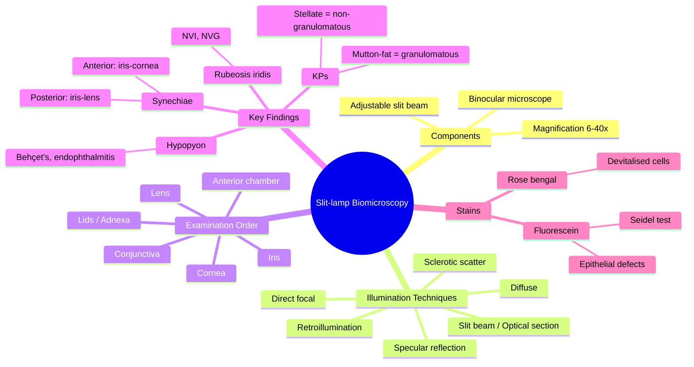

# Slit-lamp Biomicroscopy

Related: [[Ophthalmic History and Examination]], [[Tonometry]], [[Anterior Uveitis]], [[Age-related Cataract]]

> [!tip] **FCPS/MRCP Priority: HIGH**
> Slit-lamp examination is the cornerstone of anterior segment evaluation. Understand beam techniques, what each structure is examined for, and clinical findings.

---

## Learning Objectives
- [ ] Describe the slit-lamp and its illumination techniques
- [ ] Perform systematic anterior segment examination
- [ ] Recognise common findings: KPs, hypopyon, synechiae, flare
- [ ] Apply ancillary tests (fluorescein staining, rose bengal, Seidel test)

## 1. The Slit-lamp

- **Components:** Binocular microscope + adjustable illumination source
- **Slit beam:** Variable height, width, angle, colour
- **Magnification:** 6× to 40×

## 2. Illumination Techniques

| Technique | Use |
|-----------|-----|
| **Diffuse** | Overall anterior segment survey |
| **Direct focal** | Focused examination of specific structure |
| **Slit beam (parallelepiped)** | Optical section — estimate lesion depth |
| **Optical section** | Corneal thickness, AC depth |
| **Indirect (retroillumination)** | Cataract, corneal scars against red reflex |
| **Specular reflection** | Endothelial assessment (corneal guttata) |
| **Sclerotic scatter** | Corneal opacities |
| **Van Herick** | AC depth grading |

## 3. Systematic Examination

### Lids and Adnexa
- Position, closure, lesions, lashes (trichiasis, distichiasis)
- Lacrimal puncta, regurgitation on pressure (mucocele)

### Conjunctiva
- Bulbar vs tarsal; follicles vs papillae
- Discharge (watery, mucoid, purulent)
- Subconjunctival haemorrhage, pterygium, pinguecula

### Cornea
- **Epithelium:** Fluorescein staining (abrasion, dendritic ulcer)
- **Stroma:** Infiltrate, oedema, scars
- **Endothelium:** KPs (keratic precipitates — clusters of inflammatory cells)
- **Descemet's:** Folds, breaks (hydrops in keratoconus)

### Anterior Chamber
- **Cells and flare:** Inflammatory activity (graded SUN criteria)
- **Hypopyon:** Layered pus in AC (severe anterior uveitis, endophthalmitis)
- **Hyphaema:** Layered blood in AC
- **Depth:** Van Herick (≥ 1/2 corneal thickness = safe for dilation)

### Iris
- Synechiae (posterior → lens, anterior → cornea)
- Rubeosis (NVI — neovascularisation)
- Transillumination defects (albinism, pigment dispersion)
- Iridodonesis (lens subluxation)

### Lens
- Cataract morphology (cortical spoke, nuclear sclerosis, posterior subcapsular)
- IOL position (pseudophakia)
- Aphakia

## 4. Fluorescein Staining

- **Application:** Fluorescein strip or 2% drop
- **Cobalt blue light** → fluoresces green
- Detects: epithelial defects, dendrites (HSV), Seidel sign (aqueous leak from wound)

## 5. Grading Anterior Chamber Activity (SUN)

| Grade | Cells | Flare |
|-------|-------|-------|
| 0 | <1 | None |
| 0.5+ | 1–5 | Faint |
| 1+ | 6–15 | Mild |
| 2+ | 16–25 | Moderate (iris details clear) |
| 3+ | 26–50 | Marked (iris hazy) |
| 4+ | >50 | Intense (fibrin, plasmoid) |

## 6. FCPS/MRCP High-Yield Summary

| Finding | Significance |
|---------|--------------|
| KPs (granulomatous, mutton-fat) | Granulomatous uveitis (sarcoid, TB, syphilis) |
| KPs (non-granulomatous, fine) | Non-granulomatous uveitis (HLA-B27) |
| Hypopyon | Severe uveitis, endophthalmitis, Behçet's |
| Posterior synechiae | Adhesions to lens — chronic uveitis |
| Rubeosis iridis | Neovascular glaucoma (ischaemia) |
| Dendritic ulcer | HSV keratitis |
| Hyphaema | Trauma, surgery, herpetic uveitis |
| Seidel test positive | Corneal perforation (aqueous leak) |

## 7. Viva Questions

1. **Q:** What does the Van Herick test assess?
   **A:** Anterior chamber depth at the limbus. ≥ 1/2 corneal thickness = safe for dilation; < 1/4 = shallow (risk of angle closure).

2. **Q:** How do you differentiate mutton-fat from stellate KPs?
   **A:** Mutton-fat = large, greasy, granulomatous (sarcoid, TB, syphilis). Stellate = small, fine, non-granulomatous (HLA-B27, idiopathic).

3. **Q:** What is the Seidel test?
   **A:** Apply concentrated fluorescein to suspected perforation site; observe under cobalt blue. Aqueous leak dilutes the dye and shows streaming (positive test).

---

## 8. Common Confusions / Exam Traps

| Confusion | Clarification |
|-----------|---------------|
| "Posterior synechiae = iris to cornea" | NO — posterior = iris to lens; anterior = iris to cornea |
| "Van Herick 1/4 means safe to dilate" | NO — 1/4 means SHALLOW AC, do NOT dilate (risk of angle closure). Need ≥ 1/2 |
| "Mutton-fat KPs = HLA-B27" | NO — mutton-fat = granulomatous (sarcoid/TB/syphilis); fine stellate = HLA-B27 |
| "Hypopyon = infection always" | NO — sterile hypopyon seen in Behçet's, HLA-B27, even severe non-infectious uveitis |
| "Fluorescein stains normal epithelium" | NO — only stains areas of epithelial defect / disruption |
| "Rose bengal = same as fluorescein" | NO — rose bengal stains DEAD/devitalised cells & mucus; fluorescein stains epithelial defects |
| "Specular reflection for iris exam" | NO — specular reflection is for corneal ENDOTHELIUM (assess guttata, cell count) |
| "Sclerotic scatter diagnoses cataract" | NO — sclerotic scatter highlights CORNEAL opacities (against total internal reflection); cataract seen on retroillumination |

## 9. Mnemonics

1. **"S L I T L A M P"** — Structures to examine in order: **S**clera/conjunctiva → **L**ids → **I**ris → **T**ear film → **L**ens → **A**nterior chamber → **M**acula (or fundus if dilated) → **P**osterior segment
2. **"PASS = Posterior-Anterior, Synechiae-Side"** — Posterior synechiae (iris to lens) vs Anterior synechiae (iris to cornea) — "P" for "lens" (P is in "caPsule" — anterior lens capsule); Anterior = A for "Anterior cornea"
3. **"KPs GRIPE"** — KPs graded SUN: **0** = none, **0.5+** = rare, **1+** = 6–15, **2+** = 16–25, **3+** = 26–50, **4+** = >50 (cells in 1×1mm field)
4. **"Dendrites = HSV"** — "Den-DRITE" = HSV keratitis (linear branching with terminal bulbs)

## 10. Mind Map

## 11. One-Page Revision Card

| **Topic** | **Slit-lamp Biomicroscopy** |
|-----------|-----------------------------|
| **Components** | Binocular microscope + adjustable slit beam, 6–40× magnification |
| **Order of exam** | Lids → Conjunctiva → Cornea → AC → Iris → Lens |
| **Key stain 1** | Fluorescein (epithelial defects, Seidel test for perforation) |
| **Key stain 2** | Rose bengal (devitalised cells, dry eye) |
| **SUN grading** | Cells 0 (none) → 4+ (>50); Flare graded similarly |
| **Van Herick** | AC depth at limbus; ≥ 1/2 = safe to dilate; < 1/4 = shallow (don't dilate) |
| **KPs** | Mutton-fat = granulomatous; Fine/stellate = non-granulomatous (HLA-B27) |
| **Hypopyon** | Layered pus — Behçet's, endophthalmitis, severe uveitis |
| **Viva Pearl** | Seidel test = fluorescein + cobalt blue detects aqueous leak from perforation |

## 12. Spaced Repetition Trackers

### 24-Hour Recall Prompts
- [ ] Name 4 illumination techniques and their uses
- [ ] Define Van Herick test and the threshold for safe dilation
- [ ] List the SUN grading for AC cells/flare
- [ ] Differentiate mutton-fat from stellate KPs and their clinical significance
- [ ] Describe the Seidel test and what a positive result means

### Revision Schedule
- [ ] **Day 1** completed (creation + 24h recall)
- [ ] **Day 3** revision completed
- [ ] **Day 7** revision completed
- [ ] **Day 15** revision completed
- [ ] **Day 30** revision completed
- [ ] **Day 90** revision completed

## 13. Must Know / Should Know / Nice to Know

### Must Know (Core for passing)
- [x] Order of slit-lamp examination
- [x] Van Herick test interpretation
- [x] SUN criteria for AC cells/flare
- [x] Fluorescein and Seidel test
- [x] KP morphology (granulomatous vs non-granulomatous)

### Should Know (High probability)
- [x] All illumination techniques
- [x] Rose bengal vs fluorescein
- [x] Synechiae types and significance
- [x] Rubeosis iridis significance (NVG)

### Nice to Know (Differentiator)
- [ ] Specular reflection and endothelial assessment
- [ ] Sclerotic scatter for corneal opacities
- [ ] Retroillumination uses
- [ ] Cataract morphology classification at slit-lamp

## 14. My Weak Points
- [ ] Add personal weak areas here

## 15. Self-Test Scorecard

| Section | Score /5 |
|---------|----------|
| Understanding: | /10 |
| Recall: | /10 |
| MCQ Performance: | /10 |
| SBA Performance: | /10 |
| Viva Confidence: | /10 |
| Total: | /50 |

> [!tip] **Interpretation:** <35 = weak topic, 35-44 = acceptable but insecure, 45+ = strong exam-ready topic.

## 16. Exam Answer Modes

### Long Answer Skeleton
1. Components of slit-lamp (binocular microscope, slit beam, magnification 6–40×)
2. Order of examination (lids → conjunctiva → cornea → AC → iris → lens)
3. Illumination techniques (diffuse, direct focal, slit beam, retroillumination, specular reflection, sclerotic scatter)
4. Ancillary tests (fluorescein, rose bengal, Seidel test)
5. SUN grading for AC activity
6. Van Herick test for AC depth
7. Key clinical findings (KPs, synechiae, hypopyon, rubeosis)

### Short Note Skeleton
- Indications & components
- Order of examination
- Stains used (fluorescein vs rose bengal)
- Seidel test description
- Van Herick interpretation

### Viva One-Liners
- **Q:** What is the Van Herick test? → **A:** AC depth assessment at limbus; ≥ 1/2 corneal thickness = safe to dilate
- **Q:** Posterior vs anterior synechiae? → **A:** Posterior = iris-to-lens; Anterior = iris-to-cornea
- **Q:** Mutton-fat KPs suggest? → **A:** Granulomatous uveitis (sarcoid, TB, syphilis)
- **Q:** What is Seidel test? → **A:** Fluorescein + cobalt blue to detect aqueous leak from corneal perforation
- **Q:** Hypopyon in Behçet's? → **A:** Sterile hypopyon — hallmark of Behçet's disease

### Ward-Case Discussion Points
- Demonstrate slit-lamp handling and systematic anterior segment exam
- Identify KPs and categorise granulomatous vs non-granulomatous
- Perform Van Herick test and interpret AC depth
- Perform fluorescein staining and explain Seidel test
- Identify synechiae, rubeosis, hypopyon and their clinical significance

### Last-Night-Before-Exam Sheet
- **Top 5 facts:** Order of exam; Van Herick ≥ 1/2 safe; SUN grading 0–4+; mutton-fat = granulomatous; Seidel = perforation
- **1 mnemonic:** "S L I T L A M P" examination order
- **Must-know differential:** Posterior vs anterior synechiae (lens vs cornea)
- **Common trap:** Van Herick 1/4 = DO NOT dilate (shallow AC, angle closure risk)

## Summary

Slit-lamp biomicroscopy is fundamental to anterior segment examination. The Van Herick test guides dilation safety. SUN criteria standardise uveitis grading. Fluorescein and rose bengal detect epithelial and mucin defects. The Seidel test diagnoses corneal perforation. KP morphology (mutton-fat vs stellate) differentiates granulomatous from non-granulomatous uveitis.

## MCQs (10)

1. **Question:** The Van Herick test assesses:
   **Options:** A. Corneal thickness B. Intraocular pressure C. Anterior chamber depth D. Lens opacity E. Retinal function
   **Answer:** C
   **Explanation:** Van Herick grades AC depth at the limbus by comparing AC width to corneal thickness — used to determine safety of pupil dilation.

2. **Question:** A Van Herick grade of 1/4 indicates:
   **Options:** A. Safe for dilation B. Shallow AC — caution/avoid dilation C. Normal AC depth D. Deep AC E. Aphakic eye
   **Answer:** B
   **Explanation:** < 1/4 = shallow AC, high risk of angle closure with mydriasis. Do not dilate without safeguards (or use weaker mydriatic).

3. **Question:** Mutton-fat keratic precipitates are characteristic of:
   **Options:** A. HLA-B27 acute anterior uveitis B. Granulomatous uveitis (sarcoid, TB, syphilis) C. Acute angle-closure glaucoma D. Bacterial keratitis E. Acute retinal necrosis
   **Answer:** B
   **Explanation:** Large, greasy "mutton-fat" KPs = granulomatous uveitis (sarcoidosis, tuberculosis, syphilis). Small fine/stellate KPs = non-granulomatous (HLA-B27, idiopathic).

4. **Question:** Posterior synechiae are adhesions between:
   **Options:** A. Iris and cornea B. Iris and anterior lens capsule C. Iris and vitreous D. Lens and ciliary body E. Cornea and lens
   **Answer:** B
   **Explanation:** Posterior synechiae = iris to anterior lens capsule. Anterior synechiae = iris to posterior corneal surface (peripheral).

5. **Question:** A Seidel test is positive when:
   **Options:** A. Rose bengal stains conjunctiva B. Fluorescein is diluted/streams away from a corneal perforation site under cobalt blue light C. Mydriasis occurs after tropicamide D. IOP exceeds 21 mmHg E. Visual acuity is 6/6
   **Answer:** B
   **Explanation:** Concentrated fluorescein applied to suspected perforation is diluted by leaking aqueous — appears as a streaming "waterfall" of green under cobalt blue. Diagnostic of corneal perforation.

6. **Question:** Rose bengal stain is used to detect:
   **Options:** A. Epithelial defects only B. Devitalised/dead epithelial cells and mucus C. Intraepithelial nerves D. Endothelial cells E. Lens opacity
   **Answer:** B
   **Explanation:** Rose bengal stains dead/devitalised cells and mucus (not normal epithelium) — used in dry eye, exposure keratopathy, and to highlight HSV dendrites. Better than fluorescein for early dry eye.

7. **Question:** SUN grading 4+ cells in the anterior chamber indicates:
   **Options:** A. No inflammation B. Faint activity C. Mild activity D. Severe activity (>50 cells/1×1mm field) E. Hypopyon
   **Answer:** D
   **Explanation:** SUN 4+ = > 50 cells in a 1×1mm slit beam field — the most severe grade of AC cellular reaction.

8. **Question:** Specular reflection at the slit-lamp is used to examine:
   **Options:** A. Iris vessels B. Lens capsule C. Corneal endothelium D. Vitreous face E. Retina
   **Answer:** C
   **Explanation:** Specular reflection = bright reflection from the endothelial surface, used to visualise endothelial cells (count, morphology, guttata).

9. **Question:** Hypopyon most characteristically occurs in:
   **Options:** A. POAG B. Acute anterior uveitis and Behçet's disease C. Cataract D. Retinal detachment E. Vitreous haemorrhage
   **Answer:** B
   **Explanation:** Hypopyon = layered white cells/pus in AC. Causes include severe acute anterior uveitis, Behçet's disease (sterile), and infectious endophthalmitis.

10. **Question:** Rubeosis iridis (NVI) is most commonly associated with:
    **Options:** A. Chronic open-angle glaucoma B. Ocular ischaemia (e.g., proliferative diabetic retinopathy, ischaemic CRVO) C. Acute angle closure D. Cataract formation E. Dry eye syndrome
    **Answer:** B
    **Explanation:** NVI = new vessels on the iris surface from retinal ischaemia. Common causes: proliferative diabetic retinopathy, ischaemic CRVO, ocular ischaemic syndrome. Can lead to neovascular glaucoma (NVG).

## SBA Questions (10)

1. **Scenario:** A 35-year-old man presents with painful red eye, photophobia, and decreased vision. Slit-lamp reveals cells 2+, flare 2+, and small stellate keratic precipitates. IOP is 15 mmHg.
   **Question:** What is the most likely diagnosis?
   **Options:** A. Acute angle-closure glaucoma B. Acute anterior uveitis (non-granulomatous, likely HLA-B27) C. Acute conjunctivitis D. Keratitis E. Endophthalmitis
   **Answer:** B
   **Explanation:** Painful red eye, AC cells and flare, and fine/stellate KPs are classic for acute anterior uveitis. In a young male, think HLA-B27 (ankylosing spondylitis, reactive arthritis, IBD, psoriatic arthritis).

2. **Scenario:** A 50-year-old presents with a painful red eye after trauma. Slit-lamp shows a small full-thickness corneal laceration. The ophthalmologist applies concentrated fluorescein and views with cobalt blue light — a streaming "waterfall" of green is seen.
   **Question:** What does this finding indicate?
   **Options:** A. Corneal abrasion B. Corneal perforation with aqueous leak (positive Seidel test) C. Iris prolapse only D. Hyphaema E. Lens subluxation
   **Answer:** B
   **Explanation:** Positive Seidel test = aqueous humour leaking through the perforation, diluting the concentrated fluorescein dye and producing a streaming pattern. This confirms an open-globe injury requiring urgent surgical repair.

3. **Scenario:** A 40-year-old woman presents with bilateral red eyes, dry mouth, and dry eyes. Slit-lamp after rose bengal staining shows punctate staining of the bulbar conjunctiva and devitalised cells on the cornea.
   **Question:** What is the most likely diagnosis?
   **Options:** A. Acute bacterial conjunctivitis B. Sjögren syndrome with keratoconjunctivitis sicca C. Herpes zoster ophthalmicus D. Stevens-Johnson syndrome E. Acute angle-closure glaucoma
   **Answer:** B
   **Explanation:** Rose bengal stains devitalised epithelial cells in dry eye states. Combined with dry mouth (xerostomia), this is classic for Sjögren syndrome.

4. **Scenario:** A 70-year-old man with poorly controlled diabetes presents with painful red eye, IOP 50 mmHg, and new vessels on the iris surface seen at the slit-lamp.
   **Question:** What is the most likely diagnosis?
   **Options:** A. Acute angle-closure glaucoma B. Neovascular glaucoma secondary to proliferative diabetic retinopathy C. Primary open-angle glaucoma D. Steroid-induced glaucoma E. Pseudoexfoliation glaucoma
   **Answer:** B
   **Explanation:** Rubeosis iridis (NVI) in a diabetic patient with raised IOP = neovascular glaucoma. Driven by retinal ischaemia producing VEGF → new vessels on iris/trabeculum → peripheral anterior synechiae and IOP rise.

5. **Scenario:** A 25-year-old with sarcoidosis has slit-lamp examination showing large, greasy, "mutton-fat" keratic precipitates on the corneal endothelium.
   **Question:** What type of uveitis do these KPs suggest?
   **Options:** A. Non-granulomatous (HLA-B27) B. Granulomatous (sarcoidosis) C. Endophthalmitis D. Phacoantigenic E. Fuchs heterochromic iridocyclitis
   **Answer:** B
   **Explanation:** Mutton-fat KPs are characteristic of granulomatous uveitis. Causes include sarcoidosis, tuberculosis, syphilis, Vogt-Koyanagi-Harada (VKH), and sympathetic ophthalmia.

6. **Scenario:** A patient presents for routine eye exam. The ophthalmologist measures the AC depth at the limbus and finds it is ≥ 1/2 of corneal thickness.
   **Question:** What is the clinical implication?
   **Options:** A. AC is shallow — do not dilate B. AC is occludable angle — refer for iridotomy C. AC is deep enough to safely dilate D. Glaucoma is present E. Endothelial dystrophy
   **Answer:** C
   **Explanation:** Van Herick grade ≥ 1/2 = AC deep enough that dilation is generally safe. Grade < 1/4 = shallow AC and angle-closure risk with dilation.

7. **Scenario:** A patient has chronic anterior uveitis. On slit-lamp, the iris is found to be adherent to the anterior lens capsule.
   **Question:** What is this finding called?
   **Options:** A. Anterior synechiae B. Posterior synechiae C. Rubeosis iridis D. Iridodonesis E. Synchysis scintillans
   **Answer:** B
   **Explanation:** Posterior synechiae = adhesions between the posterior iris and the anterior lens capsule. Caused by chronic or recurrent anterior uveitis. May cause irregular pupil, seclusio pupillae (360°), and iris bombé.

8. **Scenario:** A patient has slit-lamp specular reflection showing irregularly shaped endothelial cells with dark spots ("guttata") and reduced cell density.
   **Question:** What is the most likely diagnosis?
   **Options:** A. Fuchs endothelial dystrophy B. Keratoconus C. Acute angle closure D. Bullous keratopathy only E. Lattice dystrophy
   **Answer:** A
   **Explanation:** Specular reflection visualises the corneal endothelium. Guttata (excrescences of Descemet's membrane) with reduced cell count and pleomorphism = Fuchs endothelial dystrophy.

9. **Scenario:** A patient has fluorescein staining of a linear, branching corneal lesion with terminal end bulbs and swollen corneal epithelium. The ophthalmologist is concerned about a specific pathogen.
   **Question:** What is the most likely causative organism?
   **Options:** A. Staphylococcus aureus B. Herpes simplex virus (HSV) C. Acanthamoeba D. Pseudomonas aeruginosa E. Candida albicans
   **Answer:** B
   **Explanation:** Dendritic ulcer with terminal end bulbs is pathognomonic for herpes simplex virus (HSV) keratitis. Treat with topical aciclovir; avoid topical steroids alone (worsens disease).

10. **Scenario:** A 30-year-old man from the Mediterranean presents with recurrent painful red eye, oral ulcers, and genital ulcers. Slit-lamp shows a layered collection of white cells in the anterior chamber (hypopyon).
    **Question:** What is the most likely diagnosis?
    **Options:** A. Behçet's disease B. HLA-B27 uveitis only C. Sarcoidosis D. Tuberculous uveitis E. Syphilitic uveitis
    **Answer:** A
    **Explanation:** Recurrent hypopyon uveitis + oral ulcers + genital ulcers (pathergy positive) = Behçet's disease. The hypopyon is typically sterile and shifts with head position ("shifting hypopyon").

## Flashcards

- **Q:** What does the Van Herick test assess, and what is the safe-dilation threshold?
  **A:** Anterior chamber depth at the limbus. ≥ 1/2 corneal thickness = safe to dilate; < 1/4 = shallow (do not dilate, angle-closure risk).

- **Q:** Differentiate mutton-fat from stellate KPs.
  **A:** Mutton-fat = large, greasy = granulomatous uveitis (sarcoid, TB, syphilis). Stellate = small, fine = non-granulomatous (HLA-B27, idiopathic).

- **Q:** What is the Seidel test?
  **A:** Apply concentrated fluorescein to a suspected corneal perforation and view with cobalt blue light. Aqueous leak dilutes the dye and shows streaming → positive test = corneal perforation.

- **Q:** Posterior vs anterior synechiae?
  **A:** Posterior = iris to anterior lens capsule (chronic uveitis). Anterior = iris to posterior cornea (peripheral, e.g., post-angle closure, NVG).

- **Q:** What does rose bengal stain, and how does it differ from fluorescein?
  **A:** Rose bengal stains devitalised/dead epithelial cells and mucus (dry eye, exposure). Fluorescein stains epithelial defects/breaks (abrasion, dendrite, Seidel).

## Answer Key with Explanations

### MCQs
1. C — Van Herick measures AC depth at the limbus
2. B — Van Herick < 1/4 = shallow AC, dilation risky
3. B — Mutton-fat KPs = granulomatous uveitis
4. B — Posterior synechiae = iris-to-lens-capsule
5. B — Seidel positive = aqueous leak from perforation
6. B — Rose bengal = devitalised cells (not epithelial defects)
7. D — SUN 4+ = > 50 cells in 1×1mm field
8. C — Specular reflection = endothelial assessment
9. B — Hypopyon = severe uveitis / Behçet's / endophthalmitis
10. B — Rubeosis iridis = ocular ischaemia → NVG

### SBAs
1. B — Painful red eye + cells/flare + fine KPs = acute anterior uveitis (HLA-B27 likely in young male)
2. B — Streaming fluorescein = positive Seidel = corneal perforation
3. B — Rose bengal punctate staining + dry mouth = Sjögren syndrome
4. B — NVI + raised IOP + DM = neovascular glaucoma from PDR
5. B — Mutton-fat KPs in sarcoidosis = granulomatous uveitis
6. C — Van Herick ≥ 1/2 = safe to dilate
7. B — Iris adherent to lens capsule = posterior synechiae
8. A — Guttata + low cell count = Fuchs endothelial dystrophy
9. B — Dendritic ulcer with terminal bulbs = HSV keratitis
10. A — Recurrent hypopyon + oral + genital ulcers = Behçet's disease

## Tags
#medicine #davidson #ophthalmology #slit-lamp #fcps #mrcp
