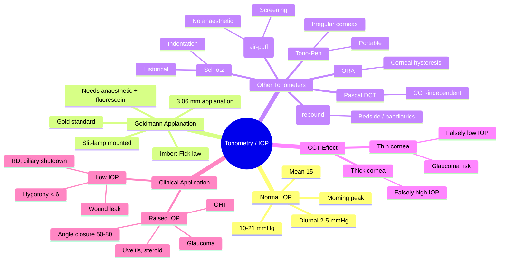

# Tonometry and Intraocular Pressure

Related: [[Primary Open-Angle Glaucoma]], [[Primary Angle-Closure Glaucoma]], [[Glaucoma Hub]], [[Ocular Hypertension]]

> [!tip] **FCPS/MRCP Priority: CRITICAL**
> IOP measurement is the cornerstone of glaucoma diagnosis. Know techniques, normal range, sources of error, and diurnal variation.

---

## Learning Objectives
- [ ] Define normal IOP and its diurnal variation
- [ ] Describe Goldmann applanation tonometry (principle, technique)
- [ ] List alternative tonometers (non-contact, iCare, Tono-Pen)
- [ ] Identify sources of error in tonometry
- [ ] Interpret IOP in context of corneal thickness (CCT)

## 1. Intraocular Pressure (IOP)

- **Normal:** 10–21 mmHg (mean ~15)
- **Diurnal variation:** 2–5 mmHg (highest morning)
- **Population distribution:** Gaussian; "normal" is a range, not a threshold
- **IOP ≠ glaucoma** — most ocular hypertensives don't progress; many NTG patients have IOP <21

## 2. Goldmann Applanation Tonometry (Gold Standard)

### Principle
- Imbert-Fick law: P = F/A (force per unit area)
- Applanate a fixed area (3.06 mm diameter) of cornea
- Force required = IOP
- Doubles tear film surface tension (corneal rigidity cancels out at 3.06 mm)

### Technique
1. Topical anaesthetic (proxymetacaine 0.5%) + fluorescein
2. Patient at slit-lamp, chin and forehead on rests, eyes wide
3. Prism contacts cornea, force dial adjusted
4. Read when inner edges of fluorescein semicircles just touch

### Sources of Error
| Factor | Effect on IOP |
|--------|---------------|
| Thick cornea | Falsely high |
| Thin cornea | Falsely low |
| Corneal oedema | Falsely low |
| Corneal scarring | Falsely low |
| Tight collar / Valsalva | Falsely high |
| Supine position | Falsely high (~2-3 mmHg) |

### Corneal Compensated IOP
- Corneal thickness (CCT) matters — measure with pachymetry
- Thin CCT = underestimation of true IOP, more glaucoma risk
- Thick CCT = overestimation

## 3. Other Tonometers

| Tonometer | Use | Notes |
|-----------|-----|-------|
| **Non-contact (air-puff)** | Screening | Quick, no anaesthetic, less accurate |
| **iCare (rebound)** | Bedside, children | Disposable probe, no anaesthetic |
| **Tono-Pen** | Portable, irregular corneas | Less accurate but useful in scarred corneas |
| **Schiötz (indentation)** | Historical | Patient supine, weighted plunger |
| **Dynamic contour (Pascal)** | CCT-independent | Direct transcorneal pressure |
| **Ocular Response Analyser (ORA)** | CCT + biomechanics | Corneal hysteresis |

## 4. Clinical Application

### Raised IOP
- **Ocular hypertension:** IOP >21 without glaucomatous damage
- **Glaucoma:** IOP-related optic neuropathy (most cases)
- **Acute angle-closure:** IOP often 50–80 mmHg
- Other: uveitis, trauma, steroid use, intraocular tumour

### Low IOP (<6 mmHg)
- Hypotony — risk of choroidal detachment, maculopathy
- Causes: wound leak, retinal detachment, ciliary body shutdown (post-inflammation, post-surgery)

## 5. FCPS/MRCP High-Yield Summary

| Topic | Key Points |
|-------|------------|
| Normal IOP | 10–21 mmHg |
| Diurnal variation | 2–5 mmHg, highest in morning |
| Goldmann tonometer | Gold standard; uses Imbert-Fick law |
| Pachymetry | Adjusts interpretation for CCT |
| Thin cornea | Glaucoma risk, falsely low IOP |
| Thick cornea | Falsely high IOP, over-treatment risk |

## 6. Viva Questions

1. **Q:** What is normal IOP, and what is diurnal variation?
   **A:** 10–21 mmHg. Diurnal variation 2–5 mmHg, highest in morning.

2. **Q:** How does central corneal thickness affect IOP measurement?
   **A:** Thick cornea = falsely high reading; thin cornea = falsely low reading. Always measure CCT (pachymetry) and adjust interpretation.

3. **Q:** Name two non-Goldmann tonometers.
   **A:** Non-contact (air-puff), iCare (rebound), Tono-Pen (Mackay-Marg).

---

## 7. Common Confusions / Exam Traps

| Confusion | Clarification |
|-----------|---------------|
| "IOP > 21 = glaucoma" | NO — ocular hypertension is IOP > 21 WITHOUT optic nerve damage. Glaucoma needs structural + functional damage |
| "Thin cornea = falsely high IOP" | NO — thin cornea = FALSELY LOW reading. These eyes are at HIGHER glaucoma risk (true IOP higher than measured) |
| "Goldmann uses indentation" | NO — Goldmann uses applanation (Imbert-Fick). Schiötz is the indentation tonometer (historical) |
| "Tono-Pen is more accurate than Goldmann" | NO — Goldmann is gold standard. Tono-Pen is portable, useful for irregular corneas, but less accurate |
| "Air-puff needs anaesthetic" | NO — non-contact tonometer does NOT need anaesthetic (key screening advantage) |
| "Normal-tension glaucoma = high IOP" | NO — NTG = glaucomatous optic neuropathy with IOP < 21 mmHg (often low/normal) |
| "IOP highest in evening" | NO — diurnal variation peaks in MORNING (some patients have nocturnal peaks — assess with phasing) |
| "Pachymetry is optional in glaucoma workup" | NO — essential. CCT changes interpretation of IOP and risk stratification (OHTS trial) |
| "Schiötz is widely used today" | NO — historical/obsolete in most countries; replaced by Goldmann and others |
| "Eye rubbing lowers IOP" | NO — eye rubbing RAISES IOP transiently (and is a risk factor for keratoconus) |

## 8. Mnemonics

1. **"10–21, mean 15"** — Normal IOP range and mean: "**T**en-**T**wenty**O**ne, **M**ean **F**ifteen" (TTO-MF)
2. **"CCT changes = IOP changes"** — Thick cornea → Tonometry reads Too-high; Thin cornea → Too-low. "**T**hick cornea → **T**ruth is **h**igher; **T**hin cornea → **T**ruth is **l**ower"
3. **"Pascal: Pressure Accurate, CCT-Independent, All-corneas Safe And Logical"** — Dynamic contour (Pascal) tonometer is CCT-independent
4. **"Imbert-Fick: I Force Area = Pressure"** — I = Imbert, F = Force, A = Area, P = Pressure. Applanation at 3.06 mm diameter where corneal rigidity cancels tear film surface tension

## 9. Mind Map

## 10. One-Page Revision Card

| **Topic** | **Tonometry / IOP** |
|-----------|---------------------|
| **Normal IOP** | 10–21 mmHg, mean ~15 |
| **Diurnal variation** | 2–5 mmHg, highest in morning |
| **Gold standard** | Goldmann applanation (Imbert-Fick, 3.06 mm) |
| **CCT effect** | Thick = falsely high; Thin = falsely low (glaucoma risk) |
| **Pachymetry** | Always in glaucoma workup |
| **Acute angle closure** | IOP 50–80 mmHg |
| **Screening** | Non-contact (air-puff), no anaesthetic |
| **Bedside / children** | iCare rebound |
| **Irregular corneas** | Tono-Pen |
| **CCT-independent** | Pascal dynamic contour |
| **Viva Pearl** | Thin cornea = underestimates IOP — these eyes need closer follow-up |

## 11. Spaced Repetition Trackers

### 24-Hour Recall Prompts
- [ ] State the normal IOP range and the value of the diurnal variation
- [ ] State the Imbert-Fick law and how Goldmann tonometry uses it
- [ ] List 3 sources of error in Goldmann tonometry
- [ ] Explain how CCT affects IOP measurement
- [ ] Name 3 non-Goldmann tonometers and one indication for each

### Revision Schedule
- [ ] **Day 1** completed (creation + 24h recall)
- [ ] **Day 3** revision completed
- [ ] **Day 7** revision completed
- [ ] **Day 15** revision completed
- [ ] **Day 30** revision completed
- [ ] **Day 90** revision completed

## 12. Must Know / Should Know / Nice to Know

### Must Know (Core for passing)
- [x] Normal IOP range (10–21 mmHg)
- [x] Goldmann applanation (principle and technique)
- [x] CCT effect on IOP (thick = high, thin = low)
- [x] Diurnal variation (2–5 mmHg, morning peak)
- [x] Acute angle-closure IOP (50–80 mmHg)

### Should Know (High probability)
- [x] Non-contact and iCare tonometry
- [x] Sources of error in Goldmann
- [x] Ocular hypertension vs glaucoma
- [x] Normal-tension glaucoma
- [x] Hypotony causes

### Nice to Know (Differentiator)
- [ ] Ocular Response Analyser and corneal hysteresis
- [ ] Dynamic contour (Pascal) tonometer
- [ ] Schiötz historical details
- [ ] OHTS trial and risk calculation
- [ ] Water drinking test and other provocative tests

## 13. My Weak Points
- [ ] Add personal weak areas here

## 14. Self-Test Scorecard

| Section | Score /5 |
|---------|----------|
| Understanding: | /10 |
| Recall: | /10 |
| MCQ Performance: | /10 |
| SBA Performance: | /10 |
| Viva Confidence: | /10 |
| Total: | /50 |

> [!tip] **Interpretation:** <35 = weak topic, 35-44 = acceptable but insecure, 45+ = strong exam-ready topic.

## 15. Exam Answer Modes

### Long Answer Skeleton
1. Definition and normal range (10–21 mmHg, mean 15)
2. Diurnal variation (2–5 mmHg, morning peak)
3. Goldmann applanation: principle (Imbert-Fick, 3.06 mm), technique, anaesthetic + fluorescein
4. Sources of error (CCT, corneal oedema, Valsalva, position)
5. Other tonometers (non-contact, iCare, Tono-Pen, Pascal, ORA)
6. Clinical application: raised IOP (OHT, glaucoma, angle closure, secondary), low IOP (hypotony causes)
7. Pachymetry and CCT adjustment

### Short Note Skeleton
- Goldmann applanation: principle, technique, sources of error
- Effect of CCT on IOP reading
- Two alternative tonometers with one indication each
- Differentiate ocular hypertension from glaucoma

### Viva One-Liners
- **Q:** What is the Imbert-Fick law? → **A:** P = F/A. Applanate cornea at 3.06 mm where surface tension and rigidity cancel.
- **Q:** Normal IOP and diurnal variation? → **A:** 10–21 mmHg, 2–5 mmHg, peaks in morning
- **Q:** Effect of thin cornea on Goldmann reading? → **A:** Falsely low; these patients need closer glaucoma surveillance
- **Q:** Two non-Goldmann tonometers? → **A:** Air-puff (screening, no anaesthetic), iCare (rebound, children), Tono-Pen (irregular corneas)

### Ward-Case Discussion Points
- Differentiate ocular hypertension from primary open-angle glaucoma
- Interpret IOP in context of CCT and disc/field findings
- Choose appropriate tonometer for the patient (screening vs definitive)
- Recognise IOP in acute angle-closure crisis (50–80 mmHg)
- Counsel patient on glaucoma risk with family history and thin cornea

### Last-Night-Before-Exam Sheet
- **Top 5 facts:** 10–21 mmHg normal; Goldmann = Imbert-Fick; thin cornea underestimates IOP; ACG = 50–80 mmHg; diurnal = 2–5 mmHg morning peak
- **1 mnemonic:** "CCT changes = IOP changes" (Thick → falsely high; Thin → falsely low)
- **Must-know differential:** OHT (IOP > 21, no damage) vs POAG (damage present)
- **Common trap:** Don't assume IOP > 21 = glaucoma; don't dismiss NTG because IOP is "normal"

## Summary

Goldmann applanation tonometry remains the gold standard. Pachymetry is essential for interpretation. IOP is one parameter in glaucoma diagnosis — disc and field are more important. Diurnal variation (2–5 mmHg) peaks in the morning. CCT biases Goldmann readings (thick overestimates, thin underestimates). Thin corneas carry higher glaucoma risk. Non-contact tonometers are useful for screening; iCare for paediatrics; Tono-Pen for irregular corneas; Pascal and ORA are CCT-independent. Hypotony (< 6 mmHg) suggests wound leak, RD, or ciliary body shutdown.

## MCQs (10)

1. **Question:** Normal intraocular pressure is:
   **Options:** A. 5–15 mmHg B. 10–21 mmHg C. 15–25 mmHg D. 20–30 mmHg E. 25–35 mmHg
   **Answer:** B
   **Explanation:** Normal IOP is 10–21 mmHg (mean ~15 mmHg). Distribution is Gaussian in the population.

2. **Question:** Goldmann applanation tonometry is based on the:
   **Options:** A. Indentation principle (Schiötz) B. Imbert-Fick law (applanation of a fixed area) C. Rebound principle (iCare) D. Air-pulse principle (non-contact) E. Ultrasound principle
   **Answer:** B
   **Explanation:** Imbert-Fick law: P = F/A. Goldmann applanates a fixed area (3.06 mm diameter) and measures the force required. At this diameter, tear film surface tension and corneal rigidity cancel.

3. **Question:** Thin central corneal thickness (CCT) on Goldmann tonometry typically results in:
   **Options:** A. Falsely high IOP reading B. Falsely low IOP reading C. No effect on IOP reading D. Falsely normal reading E. Over-estimation by 10 mmHg
   **Answer:** B
   **Explanation:** Thin CCT underestimates true IOP. These patients are at higher risk of glaucoma progression and need closer surveillance (key OHTS finding).

4. **Question:** The typical diurnal variation in IOP is approximately:
   **Options:** A. 0 mmHg B. 1–2 mmHg C. 2–5 mmHg D. 10–15 mmHg E. > 20 mmHg
   **Answer:** C
   **Explanation:** IOP varies 2–5 mmHg through the day, typically peaking in the morning. This is why phasing (multiple readings) is sometimes used in glaucoma assessment.

5. **Question:** The non-contact (air-puff) tonometer is best described as:
   **Options:** A. Gold standard B. Screening tool, no anaesthetic required C. CCT-independent D. Used for indefinite monitoring E. Indentation-based
   **Answer:** B
   **Explanation:** Air-puff tonometer is a screening tool: quick, no anaesthetic needed, no cross-infection risk. Less accurate than Goldmann.

6. **Question:** In acute angle-closure glaucoma, IOP typically reaches:
   **Options:** A. 15–20 mmHg B. 21–30 mmHg C. 30–40 mmHg D. 50–80 mmHg E. 100+ mmHg
   **Answer:** D
   **Explanation:** Acute angle closure typically presents with IOP 50–80 mmHg due to sudden pupillary block and trabecular obstruction. Requires emergency treatment.

7. **Question:** Ocular hypertension is defined as:
   **Options:** A. IOP > 21 mmHg with glaucomatous optic neuropathy B. IOP > 21 mmHg without glaucomatous damage C. IOP < 21 mmHg with damage D. Any raised IOP in a young patient E. Bilateral IOP asymmetry > 2 mmHg
   **Answer:** B
   **Explanation:** Ocular hypertension (OHT) = IOP > 21 mmHg with NO optic nerve damage and NO visual field loss. Glaucoma requires structural (disc) and functional (field) damage.

8. **Question:** Hypotony (IOP < 6 mmHg) is most commonly caused by:
   **Options:** A. Open-angle glaucoma B. Wound leak, retinal detachment, or ciliary body shutdown C. Steroid use D. Pupillary block E. Acute conjunctivitis
   **Answer:** B
   **Explanation:** Hypotony causes: post-surgical wound leak, retinal detachment, ciliary body shutdown (post-inflammation), cyclodialysis cleft, severe uveitis. Risk: choroidal detachment, maculopathy, hypotony maculopathy.

9. **Question:** The iCare (rebound) tonometer is most useful for:
   **Options:** A. Gold standard glaucoma assessment B. Bedside and paediatric IOP measurement C. CCT-independent reading D. Diagnosis of angle closure E. Measuring blood pressure
   **Answer:** B
   **Explanation:** iCare uses a disposable probe that rebounds off the cornea. Quick, no anaesthetic, well tolerated by children and at the bedside.

10. **Question:** The OHTS (Ocular Hypertension Treatment Study) established that:
    **Options:** A. CCT does not affect glaucoma risk B. Thin CCT is an independent risk factor for glaucoma progression in OHT C. All OHT patients need treatment D. Thick CCT confers high glaucoma risk E. IOP is irrelevant in glaucoma
    **Answer:** B
    **Explanation:** OHTS showed thin CCT is an INDEPENDENT risk factor for conversion from OHT to glaucoma. Other risk factors: higher IOP, older age, larger cup:disc ratio, worse visual field.

## SBA Questions (10)

1. **Scenario:** A 60-year-old man has IOP 19 mmHg, central corneal thickness (CCT) of 480 µm (thin), a suspicious optic disc, and early visual field changes. The ophthalmologist is considering treatment.
   **Question:** How does the thin cornea affect the interpretation of IOP and the patient's risk?
   **Options:** A. IOP is truly lower than measured; low risk B. IOP is truly higher than measured; higher glaucoma risk; treat aggressively C. CCT has no effect D. The patient has cataract E. The patient has angle closure
   **Answer:** B
   **Explanation:** Thin cornea underestimates true IOP. True IOP likely higher than 19; combined with disc/field changes = glaucoma. Treat to lower target IOP. CCT adjustment essential in glaucoma risk stratification (OHTS).

2. **Scenario:** A 70-year-old woman presents with painful red eye, blurred vision, haloes around lights, fixed mid-dilated pupil, and IOP of 60 mmHg.
   **Question:** What is the most likely diagnosis and target IOP reduction?
   **Options:** A. POAG; treat to 21 mmHg B. Acute angle-closure glaucoma; emergency IOP reduction to < 30 within hours C. Cataract; observe D. Uveitis; topical steroid E. Normal-tension glaucoma
   **Answer:** B
   **Explanation:** Acute angle-closure glaucoma is an emergency. Need urgent IOP reduction (topical + systemic agents) and definitive laser peripheral iridotomy once cornea clears. Target: lower IOP by ≥ 25% within hours, prevent optic nerve damage.

3. **Scenario:** A 25-year-old man with known glaucoma is found to have IOP of 14 mmHg but progressive optic disc cupping and visual field loss on maximal tolerated medical therapy.
   **Question:** What type of glaucoma does this represent, and what is the next consideration?
   **Options:** A. Ocular hypertension; stop treatment B. Normal-tension glaucoma (NTG); lower IOP further (trabeculectomy/tube) C. POAG; cataract surgery D. Acute angle closure; laser iridotomy E. Steroid-induced glaucoma
   **Answer:** B
   **Explanation:** NTG = glaucomatous damage with IOP < 21 mmHg. Despite "normal" IOP, lowering it further (by 30% from baseline) slows progression (CNTGS trial). Consider surgery if progressing on drops.

4. **Scenario:** A 55-year-old patient is screened at an optician with an air-puff tonometer reading of 28 mmHg. The patient is asymptomatic.
   **Options:** A. Confirm with Goldmann tonometry and full glaucoma workup (pachymetry, disc, field) B. Start IOP-lowering drops immediately C. Perform laser iridotomy D. Refer to neurology E. Discharge
   **Answer:** A
   **Explanation:** Air-puff readings must be confirmed with Goldmann (gold standard) before treatment. Full workup: Goldmann IOP, pachymetry (CCT), gonioscopy, disc assessment, visual field, OCT nerve fibre layer. Then decide on treatment.

5. **Scenario:** A patient 1 week post-cataract surgery has IOP of 4 mmHg, shallow choroidal detachment on B-scan, and blurred vision.
   **Question:** What is the most likely cause and management?
   **Options:** A. Acute angle closure; laser B. Wound leak / overfiltration causing hypotony; investigate wound, may need suturing or AC reformation C. Steroid response; stop drops D. Endophthalmitis; intravitreal antibiotics E. Normal post-op; reassure
   **Answer:** B
   **Explanation:** Post-op hypotony with choroidal detachment suggests wound leak or over-filtering bleb (if trabeculectomy). Check Seidel test, examine wound, and consider AC reformation, suturing, or conservative management if mild.

6. **Scenario:** A patient with thick corneas (CCT 620 µm) has Goldmann IOP of 24 mmHg but normal discs and visual fields on repeated testing.
   **Question:** How should the IOP be interpreted?
   **Options:** A. Treat as glaucoma immediately B. Likely overestimated by Goldmann; needs adjustment and ongoing surveillance; no treatment if no damage C. Has angle closure D. Has uveitis E. Has cataract
   **Answer:** B
   **Explanation:** Thick cornea overestimates IOP by Goldmann. True IOP likely lower (within normal range). No disc/field damage = OHT, not glaucoma. Don't over-treat. Monitor with repeat fields and OCT.

7. **Scenario:** A 65-year-old patient is on long-term topical steroid drops for chronic anterior uveitis. IOP has risen to 32 mmHg.
   **Question:** What is the most likely cause and management?
   **Options:** A. Acute angle closure; laser B. Steroid-induced ocular hypertension; reduce/stop steroid and add IOP-lowering drops; switch to non-steroidal anti-inflammatory C. POAG primary; surgery D. Normal ageing; observe E. Cataract
   **Answer:** B
   **Explanation:** Topical steroids raise IOP in steroid responders (10% general, higher in POAG patients). Management: stop or reduce steroid, switch to NSAID or steroid-sparing agent, add IOP-lowering therapy. IOP usually normalises weeks after stopping steroid.

8. **Scenario:** A patient has a corneal scar from old trauma and needs IOP measurement. The ophthalmologist selects a Tono-Pen.
   **Question:** Why was Tono-Pen chosen over Goldmann?
   **Options:** A. Tono-Pen is more accurate B. Tono-Pen is portable and useful in irregular / scarred corneas where Goldmann is unreliable C. Tono-Pen is the gold standard D. Tono-Pen needs no anaesthetic E. Tono-Pen doesn't touch the cornea
   **Answer:** B
   **Explanation:** Tono-Pen (Mackay-Marg electronic) is portable, easy to use, and more reliable than Goldmann in irregular, scarred, or oedematous corneas. Goldmann remains more accurate in normal corneas.

9. **Scenario:** A glaucoma patient is on maximum tolerated medical therapy but continues to progress (worsening fields, OCT). IOP is 16 mmHg.
   **Question:** What is the next consideration?
   **Options:** A. Continue same treatment; observe B. Consider surgical intervention (trabeculectomy or tube shunt) to lower IOP further C. Add another bottle of same drops D. Stop all treatment E. Cataract surgery
   **Answer:** B
   **Explanation:** Progressive glaucoma on maximum medical therapy = surgical candidate. Options: trabeculectomy (with antifibrotics), tube shunt drainage devices, or MIGS (minimally invasive glaucoma surgery). Target lower IOP than current to halt progression.

10. **Scenario:** A 35-year-old optometrist measures IOP 18 mmHg at 9 am and 14 mmHg at 4 pm. CCT is 540 µm. Discs and fields are normal.
    **Question:** How should the IOP be interpreted?
    **Options:** A. High; needs treatment B. Normal variation within diurnal range; reassuring; no treatment needed C. Acute angle closure D. Glaucoma suspect needing surgery E. Steroid response
    **Answer:** B
    **Explanation:** Diurnal variation of 4 mmHg (18 → 14) is within normal range (2–5 mmHg). IOP within normal limits, no disc/field damage, CCT normal. Continue routine surveillance; no treatment needed.

## Flashcards

- **Q:** What is normal IOP, diurnal variation, and how does CCT affect the reading?
  **A:** Normal IOP 10–21 mmHg, mean ~15. Diurnal variation 2–5 mmHg, peaks in morning. Thick CCT → falsely high; thin CCT → falsely low. Always pachymetry in glaucoma workup.

- **Q:** State the Imbert-Fick law and how Goldmann uses it.
  **A:** P = F/A. Applanate cornea at 3.06 mm diameter (where tear film surface tension and corneal rigidity cancel), measure force = IOP. Gold standard.

- **Q:** How does Goldmann differ from Tono-Pen, iCare, and non-contact tonometer?
  **A:** Goldmann = slit-lamp, gold standard, anaesthetic + fluorescein. Tono-Pen = portable, irregular corneas. iCare = rebound, paediatric/bedside. Air-puff = screening, no anaesthetic.

- **Q:** Differentiate ocular hypertension from primary open-angle glaucoma.
  **A:** OHT = IOP > 21 mmHg, NO optic nerve/field damage. POAG = glaucomatous optic neuropathy (cupping, field loss) — IOP may be normal or high.

- **Q:** How does acute angle-closure glaucoma present and what is the IOP?
  **A:** Painful red eye, ↓VA, haloes, fixed mid-dilated pupil, nausea/vomiting. IOP 50–80 mmHg. Emergency: lower IOP, then laser peripheral iridotomy.

## Answer Key with Explanations

### MCQs
1. B — Normal IOP 10–21 mmHg
2. B — Goldmann uses Imbert-Fick (applanation)
3. B — Thin cornea = falsely LOW IOP
4. C — Diurnal variation 2–5 mmHg, morning peak
5. B — Air-puff = screening tool, no anaesthetic
6. D — Acute angle closure IOP 50–80 mmHg
7. B — OHT = IOP > 21 WITHOUT glaucomatous damage
8. B — Hypotony: wound leak, RD, ciliary body shutdown
9. B — iCare best for bedside / paediatrics
10. B — OHTS: thin CCT = independent risk factor for glaucoma progression

### SBAs
1. B — Thin cornea underestimates IOP; treat as glaucoma suspect
2. B — Acute angle-closure: emergency IOP reduction
3. B — NTG with progression: lower IOP further (surgery)
4. A — Air-puff must be confirmed by Goldmann + full workup
5. B — Post-op hypotony + choroidal detachment = wound leak
6. B — Thick cornea overestimates Goldmann; adjust interpretation
7. B — Steroid-induced: stop/reduce steroid, IOP-lowering drops
8. B — Tono-Pen chosen for scarred/irregular corneas
9. B — Progressing glaucoma: consider trabeculectomy / tube shunt
10. B — 4 mmHg diurnal swing is normal; no treatment needed

## Tags
#medicine #davidson #ophthalmology #tonometry #IOP #fcps #mrcp
