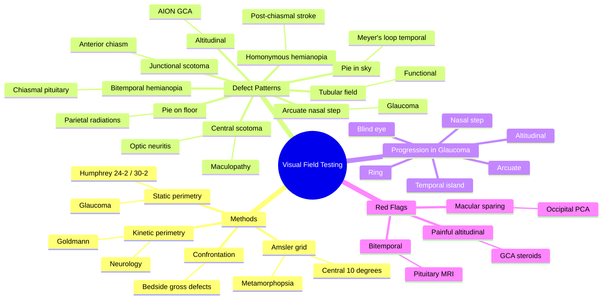

# Visual Field Testing

Related: [[Visual Pathway Defects and Pathway Lesions]], [[Primary Open-Angle Glaucoma]], [[Pituitary Tumours]]

> [!tip] **FCPS/MRCP Priority: HIGH**
> Visual field defects localise disease in the visual pathway. Master the patterns — chiasmal bitemporal, homonymous, altitudinal, arcuate, central scotoma.

---

## Learning Objectives
- [ ] List methods of visual field testing
- [ ] Describe confrontation, perimetry (kinetic/static), Amsler grid
- [ ] Recognise visual field defect patterns
- [ ] Localise lesions based on field defects

---

## 1. Methods

### Confrontation
- Quick bedside test, 1 m, compare patient's field to yours
- Useful for gross defects (homonymous hemianopia, severe altitudinal)

### Perimetry

| Type | Description | Use |
|------|-------------|-----|
| **Kinetic (Goldmann)** | Moving target of constant size | Detailed manual mapping, neurologically useful |
| **Static (Humphrey)** | Fixed points, varying intensity | Gold standard for glaucoma |
| **Frequency doubling** | Screening | Bedside glaucoma screening |

### Amsler Grid
- 10 cm × 10 cm grid with central fixation point
- Tests central 10° of vision
- Detects metamorphopsia (lines wavy = CSR, AMD), central scotoma
- Patient can do at home

---

## 2. Visual Field Defects and Localisation

| Defect | Location | Cause |
|--------|----------|-------|
| **Central scotoma** | Macula/optic nerve | Optic neuritis, CSR, macular hole, toxic |
| **Altitudinal** | Ischaemic optic neuropathy | AION (often inferior altitudinal in non-arteritic) |
| **Arcuate / nasal step** | Nerve fibre layer (Bjerrum) | Glaucoma |
| **Bitemporal hemianopia** | Optic chiasm | Pituitary adenoma, craniopharyngioma |
| **Junctional scotoma** | Anterior chiasm | Pituitary mass (ipsilateral central + contralateral superotemporal) |
| **Homonymous hemianopia** | Post-chiasmal | Stroke (PCA territory), tumour |
| **Superior quadrantanopia ("pie in sky")** | Temporal lobe (Meyer's loop) | Temporal lobe lesion |
| **Inferior quadrantanopia ("pie on floor")** | Parietal lobe | Parietal lobe lesion |
| **Cortical blindness** | Occipital cortex (bilateral) | Bilateral PCA stroke, PRES |
| **Tubular field** | Functional | Hysteria/malingering (doesn't expand with distance) |
| **Constricted field** | Retinal, advanced glaucoma | RP, advanced POAG |

---

## 3. Glaucomatous Field Loss Progression

1. Earliest: nasal step, paracentral scotoma
2. Bjerrum (arcuate) scotoma
3. Ring scotoma
4. Altitudinal defect
5. Temporal island (last central vision)
6. Total vision loss (blind eye)

---

## 4. Visual Pathway Lesion Map

```
Optic nerve (CN II) — Monocular defect
       |
   Chiasm (nasal fibres cross) — Bitemporal hemianopia
       |
   Optic tract — Contralateral homonymous hemianopia
       |
   LGN — Contralateral homonymous (often sectorial)
       |
Optic radiations (Meyer's loop = temporal = upper visual field) — Superior quadrantanopia
Optic radiations (parietal) — Inferior quadrantanopia
       |
   Occipital cortex (V1) — Contralateral homonymous (with macular sparing if PCA)
```

---

## 5. FCPS/MRCP High-Yield Summary

| Defect | Cause |
|--------|-------|
| Bitemporal hemianopia | Chiasmal — pituitary |
| Homonymous hemianopia | Post-chiasmal — stroke, tumour |
| Superior quadrantanopia | Temporal lobe — Meyer's loop |
| Inferior quadrantanopia | Parietal lobe |
| Altitudinal | AION, BRVO, NAION |
| Arcuate / nasal step | Glaucoma |
| Central scotoma | Optic neuritis, CSR, toxic |
| Tubular field | Functional (malingering) |

---

## 6. Viva Questions

1. **Q:** A 45-year-old has progressive bitemporal loss of vision. Where is the lesion?
   **A:** Optic chiasm (most commonly pituitary adenoma compressing from below).

2. **Q:** What is macular sparing?
   **A:** Preserved central vision in a homonymous hemianopia from occipital cortex lesion — the occipital pole has dual blood supply (PCA + MCA), sparing the macular representation.

3. **Q:** Differentiate superior vs inferior quadrantanopia anatomically.
   **A:** Superior ("pie in the sky") = temporal lobe lesion (Meyer's loop). Inferior ("pie on the floor") = parietal lobe lesion.

---

## Summary

Visual field defects localise disease in the visual pathway. Humphrey perimetry is gold standard for glaucoma. Confrontation is quick at bedside. Amsler grid detects central macular distortion.

## MCQs (10)
1. **Q:** Bitemporal hemianopia is caused by a lesion at the:
   **Options:** A. Optic nerve B. Optic chiasm C. Optic tract D. LGN E. Occipital cortex
   **Answer: B**
   **Explanation:** Chiasmal compression (e.g., pituitary adenoma from below) damages the decussating nasal retinal fibres.
2. **Q:** A left homonymous hemianopia localises the lesion to the:
   **Options:** A. Left optic nerve B. Optic chiasm C. Right optic tract/radiations D. Left LGN E. Left frontal lobe
   **Answer: C**
   **Explanation:** Post-chiasmal lesions produce contralateral homonymous defects; the right side of the visual pathway serves the left visual field.
3. **Q:** "Pie in the sky" superior quadrantanopia is caused by a lesion in the:
   **Options:** A. Parietal lobe B. Temporal lobe (Meyer's loop) C. Occipital cortex D. Optic nerve E. Chiasm
   **Answer: B**
   **Explanation:** Meyer's loop in the temporal lobe carries inferior retinal fibres that represent the superior visual field.
4. **Q:** The earliest visual field defect in primary open-angle glaucoma is typically:
   **Options:** A. Central scotoma B. Altitudinal defect C. Nasal step / paracentral scotoma D. Bitemporal hemianopia E. Homonymous hemianopia
   **Answer: C**
   **Explanation:** Nasal step or paracentral/arcuate (Bjerrum) scotomas are the earliest detectable glaucomatous defects.
5. **Q:** The Amsler grid tests the central visual field of:
   **Options:** A. 1° B. 5° C. 10° D. 30° E. 60°
   **Answer: C**
   **Explanation:** Amsler grid assesses the central 10° and detects metamorphopsia (CSR, AMD) and central scotomas.
6. **Q:** Humphrey 24-2 perimetry tests the central:
   **Options:** A. 10° B. 24° C. 30° D. 48° E. 60°
   **Answer: B**
   **Explanation:** 24-2 strategy tests a 24° field with a 6° grid (mostly nasal); 30-2 tests 30° (full field).
7. **Q:** Macular sparing in a homonymous hemianopia suggests a lesion at the:
   **Options:** A. Optic tract B. LGN C. Parietal radiations D. Occipital cortex E. Optic nerve
   **Answer: D**
   **Explanation:** Occipital pole has dual blood supply (PCA + MCA), sparing the macular representation in PCA strokes.
8. **Q:** A junctional scotoma (ipsilateral central scotoma + contralateral superotemporal defect) localises to the:
   **Options:** A. Optic nerve B. Anterior optic chiasm C. Posterior chiasm D. Optic tract E. LGN
   **Answer: B**
   **Explanation:** Pituitary mass at the anterior chiasm compresses one optic nerve + crossing inferonasal fibres from the fellow eye (Wilbrand's knee).
9. **Q:** A patient has tubular (gun-barrel) vision that does not enlarge with distance. The most likely cause is:
   **Options:** A. Advanced glaucoma B. Retinitis pigmentosa C. Functional (malingering/non-organic) D. Bilateral occipital stroke E. Papilloedema
   **Answer: C**
   **Explanation:** Tubular field that fails to expand with testing distance = classic non-organic/functional visual loss.
10. **Q:** Goldmann kinetic perimetry is most useful for:
    **Options:** A. Routine glaucoma follow-up B. Detecting subtle early glaucoma defects C. Neurological field mapping D. Screening community E. Colour vision testing
    **Answer: C**
    **Explanation:** Kinetic (moving target) perimetry is best for neurological field mapping (homonymous defects, quadrantanopias); static (Humphrey) is for glaucoma.

## SBA Questions (10)
1. **Scenario:** A 50-year-old woman has progressive bitemporal hemianopia, headaches, and galactorrhoea.
   **Question:** What is the most likely diagnosis and first-line investigation?
   **Options:** A. Craniopharyngioma; CT skull B. Pituitary adenoma (prolactinoma); MRI pituitary with contrast C. Meningioma; lumbar puncture D. Optic neuritis; VEP E. GCA; ESR
   **Answer: B**
   **Explanation:** Bitemporal hemianopia + galactorrhoea = prolactinoma. MRI pituitary with gadolinium is the imaging of choice.
2. **Scenario:** A 70-year-old has sudden right homonymous hemianopia with preserved central vision.
   **Question:** Most likely cause and location?
   **Options:** A. Migraine; occipital B. PCA stroke; left occipital cortex C. Pituitary apoplexy; chiasm D. Optic neuritis; optic nerve E. Retinal detachment; peripheral retina
   **Answer: B**
   **Explanation:** Macular-sparing homonymous hemianopia = left occipital cortex lesion (PCA territory with dual blood supply to macular representation).
3. **Scenario:** A 35-year-old with painful loss of vision, RAPD, and reduced colour vision has a delayed P100 on VEP. Visual field shows a central scotoma.
   **Question:** What is the diagnosis and why is confrontation testing normal in this patient?
   **Options:** A. CRAO; field is normal early B. Optic neuritis; confrontation misses central/paracentral scotomas C. Maculopathy; field is normal D. Migraine; field is normal E. Conversion; field is normal
   **Answer: B**
   **Explanation:** Optic neuritis (often MS) gives central scotoma; confrontation is insensitive to small central/paracentral defects — formal perimetry is needed.
4. **Scenario:** A glaucoma patient on Humphrey 24-2 has new superior arcuate defect with a nasal step.
   **Question:** What does this pattern indicate?
   **Options:** A. Tractional retinal damage B. Nerve fibre layer damage at the horizontal raphe C. Optic nerve compression C. Drug toxicity D. Normal ageing
   **Answer: B**
   **Explanation:** Arcuate scotoma + nasal step = damage to the nerve fibre layer respecting the horizontal midline, characteristic of glaucoma.
5. **Scenario:** A patient with binasal field loss (both nasal fields affected) is seen.
   **Question:** What is the most likely anatomical basis?
   **Options:** A. Bilateral lateral chiasmal compression B. Bilateral optic nerve disease C. Bilateral occipital disease D. Bilateral temporal lobe disease E. Bilateral parietal disease
   **Answer: A**
   **Explanation:** Binasal defects require bilateral compression of the uncrossed temporal fibres on both lateral aspects of the chiasm (e.g., bilateral ICA aneurysms) — rare.
6. **Scenario:** A child with congenital nystagmus is found to have vision 6/60 in both eyes with an apparently "normal" visual field.
   **Question:** What is the best approach to formal perimetry in this child?
   **Options:** A. Standard Humphrey 24-2 B. Goldmann perimetry with attention to cooperation C. Confrontation only D. No field testing is possible E. Frequency-doubling technology
   **Answer: B**
   **Explanation:** Children and patients with poor fixation/attention need Goldmann kinetic perimetry or behavioural techniques, not standard automated perimetry.
7. **Scenario:** A patient has progressive field loss with preserved central island then complete loss.
   **Question:** What type of field defect is this and what disease is the typical cause?
   **Options:** A. Constricted field; retinitis pigmentosa B. Altitudinal; AION C. Central scotoma; optic neuritis D. Arcuate; glaucoma E. Homonymous; stroke
   **Answer: A**
   **Explanation:** Concentric/constricted field with preserved central vision (tunnel vision) progressing to total loss is classic for RP and advanced glaucoma.
8. **Scenario:** Humphrey visual field shows a left homonymous hemianopia that is more extensive (less congruous) when re-tested.
   **Question:** What does incongruity of a homonymous defect suggest?
   **Options:** A. Optic nerve disease B. Optic tract lesion (more incongruous) C. Occipital cortex lesion (more congruous) D. LGN lesion (always sectorial) E. Functional visual loss
   **Answer: B**
   **Explanation:** Optic tract lesions produce highly incongruous homonymous defects; more posterior lesions (radiations, cortex) give more congruous defects.
9. **Scenario:** A 60-year-old with new altitudinal inferior visual field defect has headache, jaw claudication, and ESR 95.
   **Question:** What is the most likely diagnosis and what field pattern is typical?
   **Options:** A. NAION; altitudinal (often inferior) B. GCA/AION; altitudinal (often inferior) C. Glaucoma; arcuate D. Pituitary; bitemporal E. Migraine; normal field
   **Answer: B**
   **Explanation:** GCA causes arteritic AION with altitudinal (often inferior) field loss; treat with IV/oral steroids immediately to prevent fellow-eye involvement.
10. **Scenario:** A patient with headache and papilloedema has constricted fields bilaterally.
    **Question:** What is the typical pattern of field loss in chronic papilloedema?
    **Options:** A. Enlarged blind spots, then constriction B. Bitemporal hemianopia C. Altitudinal D. Central scotoma E. Arcuate
    **Answer: A**
    **Explanation:** In papilloedema, the first field change is enlargement of the blind spot; later concentric constriction can occur (Foster Kennedy pattern in severe cases).

## Flashcards
- **Q:** What is the Amsler grid and what does it test?
  **A:** 10 cm × 10 cm grid with central fixation; tests central 10°; detects metamorphopsia (CSR, AMD) and central scotoma.
- **Q:** What is the earliest glaucomatous field defect?
  **A:** Nasal step or paracentral (Bjerrum) scotoma, then arcuate, then ring, then altitudinal, then total loss.
- **Q:** What does macular sparing in a homonymous hemianopia suggest?
  **A:** Occipital cortex lesion — the occipital pole has dual PCA + MCA blood supply.
- **Q:** What is the difference between kinetic and static perimetry?
  **A:** Kinetic = moving targets of constant size (Goldmann, neurological use). Static = fixed points, varying intensity (Humphrey, glaucoma).
- **Q:** Where is Meyer's loop and what does it carry?
  **A:** Temporal lobe, carries inferior retinal fibres representing the superior visual field ("pie in the sky" defect if lesioned).

## Mnemonics
- **"Pie in the Sky = Temporal lobe (Meyer's loop); Pie on the Floor = Parietal lobe"** — TemporaL → superior (sky); ParietaL → inferior (floor).
- **"Pre-Chiasmal = One eye; Chiasmal = Bitemporal; Post-Chiasmal = Homonymous"** — Simplifies localisation of any field defect.

## Mind Map


## One-Page Revision Card
| Item | Detail |
|------|--------|
| **Definition** | Mapping the visual field using confrontation, perimetry, or Amsler grid to localise disease in the visual pathway. |
| **Key Clinical** | Confrontation misses central/paracentral scotomas; Humphrey 24-2 is gold standard for glaucoma. |
| **Dx Criteria** | Field defect pattern → anatomical site (pre-chiasmal, chiasmal, post-chiasmal, cortical). |
| **Differentials** | Bitemporal = pituitary; homonymous = stroke; arcuate = glaucoma; altitudinal = AION; central = optic neuritis. |
| **Investigations** | Humphrey 24-2 (glaucoma), Goldmann (neurology), Amsler (macula), MRI brain (homonymous/bitemporal). |
| **Management** | Treat underlying cause; ESR/CRP + steroids urgently in suspected GCA; refer pituitary mass to neurosurgery. |
| **Key Drugs/Doses** | Methylprednisolone 1 g IV daily × 3 days then oral prednisolone 1 mg/kg in GCA-AION. |
| **Red Flags** | Sudden altitudinal field loss + jaw claudication + headache = GCA; bitemporal hemianopia = pituitary emergency; macular sparing = stroke not migraine. |
| **Prognosis** | Glaucoma field loss irreversible; pituitary field loss often improves after surgery; AION can spare remaining field. |
| **Viva Pearls** | "Pie in the sky = temporal (Meyer's loop)"; "Binasal = bilateral lateral chiasmal compression"; "Tubular field that doesn't expand = functional". |

## Spaced Repetition Trackers
- [ ] 24 hours
- [ ] 3 days
- [ ] 7 days
- [ ] 15 days
- [ ] 30 days
- [ ] 60 days
- [ ] 90 days

## Self-Test Scorecard
| Section | Score /10 |
|---------|-----------|
| Understanding of anatomy | /10 |
| Recall of defect patterns | /10 |
| MCQ Performance | /10 |
| SBA Performance | /10 |
| Viva Confidence | /10 |
| **Total** | **/50** |

## Exam Answer Modes
**Long Answer Skeleton** — Define visual field. Methods (confrontation, kinetic/static, Amsler). List pattern → lesion map (pre-chiasmal, chiasmal, post-chiasmal, cortical). Discuss glaucomatous progression. Red flags (GCA, pituitary). Investigations and management.
**Short Note Skeleton** — Bitemporal hemianopia: chiasmal (pituitary); inferior quadrantanopia: parietal; superior quadrantanopia: temporal (Meyer's loop); macular sparing: occipital cortex.
**Viva One-Liners** —
1. Q: Earliest glaucomatous field defect? A: Nasal step / paracentral scotoma.
2. Q: What does macular sparing suggest? A: Occipital cortex lesion (PCA territory).
3. Q: Most useful perimetry for neurology? A: Goldmann kinetic.
4. Q: Tubular field that doesn't expand? A: Functional visual loss.
5. Q: Most common cause of bitemporal hemianopia? A: Pituitary adenoma.
**Ward-Case Discussion Points** — Examination technique for confrontation; how to interpret a Humphrey printout (MD, PSD, GHT, probability plots); red flag for jaw claudication in AION; pituitary MDT referral pathway.
**Last-Night-Before-Exam Sheet** —
- Top 5 facts: 1) Bitemporal = chiasm; 2) Homonymous = post-chiasmal; 3) Arcuate = glaucoma; 4) Pie in sky = temporal; 5) Pie on floor = parietal.
- 3 drug doses: Methylprednisolone 1 g IV; Prednisolone 1 mg/kg; Topical β-blocker for IOP-lowering where needed.
- 2 algorithms: Confrontation → formal perimetry → Amsler; Altitudinal field loss → ESR/CRP + IV methylprednisolone if GCA suspected.
- 1 mnemonic: "Pie in the Sky = Temporal lobe (Meyer's loop); Pie on the Floor = Parietal lobe."
- Must-know differential: Bitemporal hemianopia — pituitary adenoma, craniopharyngioma, meningioma, aneurysm.

## Common Confusions / Exam Traps
| Confusion | Clarification |
|-----------|---------------|
| "Bitemporal hemianopia = chiasmal" — always? | Yes, central chiasm from below = pituitary. Binasal defects = bilateral lateral chiasmal compression. |
| "Macular sparing = stroke" | Only if associated with other cortical signs; isolated macular sparing can be a PCA territory infarct. |
| "Optic neuritis has normal field" | No — optic neuritis classically produces a central scotoma; confrontation may miss it. |
| "Pupil-sparing third nerve palsy = medical" | Diabetic/ischaemic microvascular third nerve palsy = pupil sparing, but painful third with pupil involvement = compressive (PCom aneurysm). |
| "Amsler grid tests peripheral field" | No, Amsler tests the central 10° only. |
| "Kinetic perimetry is obsolete" | No, still the best for neurological field mapping and patients unable to do automated perimetry. |

## Answer Key with Explanations

### MCQs
1. **B** — Chiasmal compression (e.g., pituitary adenoma from below) damages the decussating nasal retinal fibres → bitemporal hemianopia.
2. **C** — Post-chiasmal lesions produce contralateral homonymous defects; the right side of the visual pathway serves the left visual field.
3. **B** — Meyer's loop in the temporal lobe carries inferior retinal fibres that represent the superior visual field → "pie in the sky".
4. **C** — Nasal step or paracentral (Bjerrum) scotoma is the earliest detectable glaucomatous defect, reflecting nerve fibre layer damage at the horizontal raphe.
5. **C** — Amsler grid assesses the central 10° of the visual field; it detects metamorphopsia (CSR, AMD) and central/paracentral scotomas.
6. **B** — The 24-2 strategy tests the central 24° with a 6° grid (nasal points included); 30-2 tests a wider 30° field.
7. **D** — The occipital pole has dual blood supply (PCA + MCA), so PCA infarcts may spare the macular representation → macular sparing.
8. **B** — A pituitary mass at the anterior chiasm compresses one optic nerve plus crossing inferonasal fibres from the fellow eye (Wilbrand's knee) → junctional scotoma.
9. **C** — Tubular (gun-barrel) field that fails to expand with testing distance = classic non-organic/functional visual loss; organic constriction (e.g., RP, advanced glaucoma) expands with distance.
10. **C** — Kinetic perimetry (Goldmann) is best for neurological field mapping (homonymous defects, quadrantanopias); static (Humphrey) perimetry is for glaucoma follow-up.

### SBAs
1. **B** — Bitemporal hemianopia + galactorrhoea in a 50-year-old woman = prolactinoma. MRI pituitary with gadolinium is the imaging of choice.
2. **B** — Sudden right homonymous hemianopia with macular sparing = left occipital cortex PCA infarct; dual blood supply (PCA + MCA) spares macular representation.
3. **B** — Painful vision loss, RAPD, reduced colour vision, delayed P100, central scotoma in a young adult = demyelinating optic neuritis (often MS). Confrontation is insensitive to small central/paracentral scotomas.
4. **B** — Superior arcuate scotoma with nasal step = retinal nerve fibre layer damage respecting the horizontal raphe, the hallmark of glaucoma.
5. **A** — Binasal field defects require bilateral compression of the uncrossed temporal retinal fibres on the lateral aspects of the chiasm (e.g., bilateral ICA aneurysms) — rare but classic.
6. **B** — Children, patients with nystagmus, or those with poor fixation/attention require Goldmann kinetic perimetry (or behavioural techniques) rather than standard automated perimetry.
7. **A** — Progressive concentric/constricted field with preserved central island then total loss is classic for retinitis pigmentosa (and advanced glaucoma); RP is confirmed by extinguished scotopic ERG.
8. **B** — Optic tract lesions produce highly incongruous homonymous defects; more posterior lesions (radiations, cortex) produce more congruous defects.
9. **B** — Headache + jaw claudication + high ESR + sudden altitudinal (often inferior) field loss = giant cell arteritis with arteritic AION. Start IV methylprednisolone immediately to protect the fellow eye.
10. **A** — Chronic papilloedema first enlarges the blind spot; later concentric constriction may occur (Foster Kennedy pattern in severe cases with secondary optic atrophy).

## Tags
#medicine #davidson #ophthalmology #visual-field #perimetry #fcps #mrcp
