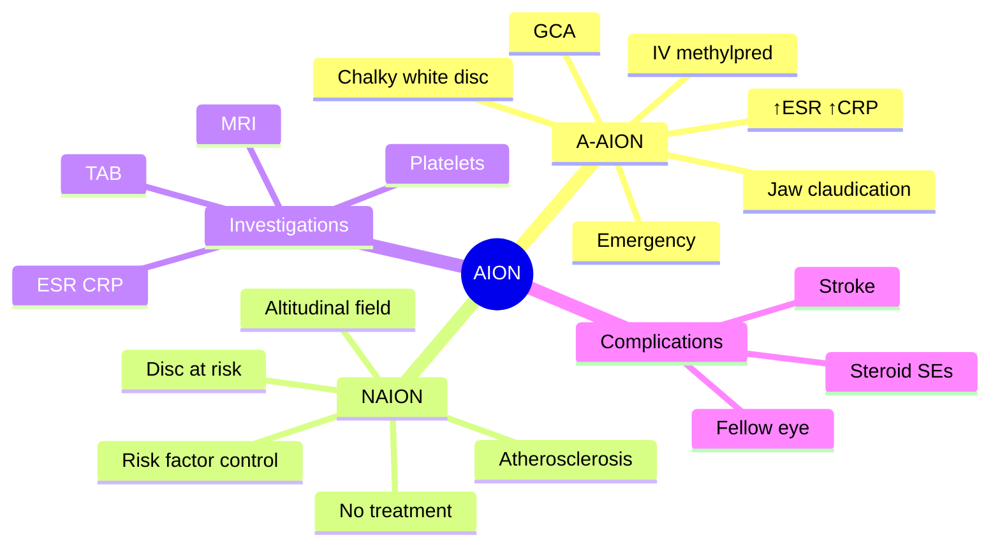

# Anterior Ischaemic Optic Neuropathy (AION)

Related: [[Giant Cell Arteritis]], [[Optic Neuritis]], [[Papilloedema]]

> [!tip] **FCPS/MRCP Priority: CRITICAL**
> Sudden painless ↓VA + altitudinal field defect + pale swollen disc. Arteritic (GCA) = emergency, IV methylpred. Non-arteritic = observation, risk factor control.

---

## Learning Objectives
- [ ] Define AION and distinguish arteritic (A-AION) from non-arteritic (NAION)
- [ ] Identify clinical features of arteritic vs non-arteritic AION
- [ ] Recognise GCA features requiring urgent investigation
- [ ] Order ESR, CRP, platelets, and arrange temporal artery biopsy appropriately
- [ ] Initiate emergency IV methylprednisolone for suspected A-AION
- [ ] Counsel on long-term risk to fellow eye

---

## 1. Definition / Epidemiology / Classification

### Definition
- **AION:** Infarction of the optic nerve head (anterior portion), supplied by posterior ciliary arteries
- Two main types:
  - **Arteritic (A-AION):** Giant cell arteritis — emergency
  - **Non-arteritic (NAION):** Atherosclerotic risk factors, "disc at risk"

### Epidemiology
- **NAION:** most common acute optic neuropathy in >50y; ~2–10/100,000/year
- **A-AION:** rarer (~1/100,000/year) but vision-threatening
- Typical patient: **white, >50y**, often with vascular risk factors

### Classification
- **Non-arteritic AION (NAION)** — most common
- **Arteritic AION (A-AION)** — GCA-related, emergency
- **In-situ** (small vessel disease at lamina cribrosa) vs embolic (rare)

---

## 2. Non-Arteritic AION (NAION)

### Pathophysiology
- Small disc / crowded (**"disc at risk"**) — small or absent physiological cup
- Transient hypoperfusion / hypotension (e.g., nocturnal)
- Infarction of prelaminar/laminar optic nerve
- Common in elderly with vascular risk factors

### Risk Factors
- **"Disc at risk"** (small cup:disc ratio, no physiological cup) — strongest anatomical risk
- **Age >50**
- **Hypertension**
- **Diabetes mellitus**
- **Hyperlipidaemia**
- **Nocturnal hypotension** (antihypertensives at bedtime)
- **Obstructive sleep apnoea**
- **Smoking**
- **Hypercoagulable states** (rare — antiphospholipid, protein C/S deficiency)
- **Drugs:** PDE5 inhibitors (rare association)
- **White ethnicity** (NAION is uncommon in Black/Asian populations)

### Clinical Features
- **Sudden, painless, monocular ↓VA** (often on waking)
- **Altitudinal field defect** (often inferior — "altitudinal")
- **RAPD** present
- **Disc:** diffusely pale, swollen (chalky white), **± segmental (altitudinal) hyperaemia/swelling**
- ± Flame haemorrhages
- Often initially hyperaemic, then pale as oedema resolves
- Disc oedema resolves in 6–8 weeks, leaving **sectoral pallor**

### Investigations
- **ESR, CRP** (exclude GCA — must be done in all >50y)
- **Platelets** (thrombocytosis in GCA)
- FBC, lipids, glucose, HbA1c
- BP, sleep study (if features)
- MRI brain/orbit if atypical (suspected compressive lesion)
- **Temporal artery biopsy** if any suspicion of GCA

### Management
- **No proven treatment** to reverse visual loss
- **Address risk factors** (BP, glucose, lipids, sleep apnoea)
- **Avoid antihypertensives at bedtime** (prevent nocturnal hypotension)
- **Aspirin** (controversial — may reduce fellow eye risk)
- **Steroid** — NOT effective
- **Optic nerve sheath fenestration** — not effective
- **Watch fellow eye** — 15% risk over 5 years
- Newer therapies under investigation: levodopa, brimonidine, steroids (RAVEN trial)

---

## 3. Arteritic AION (A-AION)

### Cause
- **Giant cell arteritis (GCA / temporal arteritis)**
- Granulomatous vasculitis of medium/large arteries
- Affects **posterior ciliary arteries** → optic nerve head infarction
- Associated with **polymyalgia rheumatica** in ~50%

### Clinical Features
- **Sudden, profound ↓VA** (often CF or worse; can be NPL)
- **Pale, swollen ("chalky white") disc**
- May have **cotton wool spots** (ciliary artery occlusion)
- ± **Amaurosis fugax** preceding
- ± **Diplopia** (extraocular muscle ischaemia — CN III, IV, VI)
- **Systemic GCA features:**
  - New-onset headache
  - Scalp tenderness
  - **Jaw claudication** (highly specific)
  - Polymyalgia rheumatica (proximal pain/stiffness)
  - Weight loss, fever, malaise, anorexia
  - Temporal artery tenderness, reduced pulsation

### Investigations (Urgent)
- **ESR** (often >50, frequently >100) and **CRP** (almost always elevated — more sensitive)
- **Platelets** (thrombocytosis in GCA)
- **FBC** (normocytic anaemia of chronic disease)
- **LFT** (alkaline phosphatase often raised)
- **Temporal artery biopsy** (within 1–2 weeks of starting steroids) — gold standard; **skip lesions** present
- **Ultrasound temporal artery** ("halo sign") — non-invasive adjunct
- **PET/CT** or **MR angiography** in large-vessel GCA

### Management — EMERGENCY
- **IV methylprednisolone 1 g × 3 days**, then oral prednisolone 1 mg/kg with very slow taper (1–2 years)
- **Don't wait for biopsy** — start steroids if high suspicion; biopsy remains positive for 2+ weeks
- **Tocilizumab** (IL-6 inhibitor) — steroid-sparing, now first-line in many centers (GiACTA trial)
- **High-dose aspirin** (controversial — for ischaemic complications)
- **Bone protection** (calcium/vitamin D, bisphosphonate)
- **PPI** for gastric protection
- **Follow-up:** monitor ESR/CRP, symptoms, BP, glucose

---

## 4. Diagnosis — Key Differentiators

| Feature | A-AION (GCA) | NAION |
|---------|--------------|-------|
| Age | >50 (usually >70) | >50 |
| Severity | Profound (often CF or worse) | Mild–moderate |
| Pain | Painless (but headache) | Painless |
| Disc | Chalky white, pallor may extend | Pale, swollen, altitudinal |
| Field | Any, often severe | Altitudinal (inferior) |
| ESR/CRP | ↑↑ | Normal |
| Systemic features | Headache, jaw claudication, PMR | Vascular risk factors |
| Fellow eye risk | High (if untreated) | 15% in 5y |
| Treatment | IV methylpred (EMERGENCY) | Risk factor control |
| Prognosis | Poor without treatment | Often stable |

---

## 5. Complications
- **Permanent visual loss** (often severe in A-AION)
- **Fellow eye involvement** — 15% in NAION; 50% within days/weeks in untreated A-AION
- **Stroke, MI** (GCA is systemic vasculitis)
- **Aortic aneurysm/dissection** (late GCA complication)
- **Steroid side effects** (long-term high-dose pred)
- **Vision-related disability**, falls, depression

---

## 6. Red Flags / Emergencies
- **>50y + sudden ↓VA** → think GCA
- **Jaw claudication, scalp tenderness, headache, PMR, weight loss, fever** → GCA
- **Markedly ↑ESR/CRP, thrombocytosis** → treat urgently
- **Chalky white disc with cotton wool spots** → GCA
- **Amaurosis fugax** in elderly → consider GCA
- **High-risk patient not on aspirin, BP not optimised** → fellow eye prevention

---

## 7. FCPS/MRCP High-Yield Summary

| Type | Cause | Pain | Disc | GCA Features |
|------|-------|------|------|--------------|
| NAION | Atherosclerosis, "disc at risk" | Painless | Pale, swollen, altitudinal | No |
| A-AION | GCA | Painless (but headache) | Chalky white | Yes (headache, jaw claudication, ↑ESR/CRP, ↓VA profound) |
| Treatment | A-AION: IV methylpred (1g×3d) → oral pred 1 mg/kg slow taper + tocilizumab; NAION: risk factor control |
| Don't | Wait for biopsy in suspected A-AION |

---

## 8. Viva Questions

1. **Q:** How do you differentiate arteritic from non-arteritic AION?
   **A:** Arteritic = GCA features (headache, jaw claudication, scalp tenderness, ↑ESR/CRP, ↓VA profound, chalky white disc, ± PMR). Non-arteritic = no systemic features, less severe ↓VA, altitudinal field, "disc at risk", normal ESR/CRP.

2. **Q:** What is the management of suspected GCA-related AION?
   **A:** IV methylpred 1g × 3 days immediately, then oral pred 1 mg/kg with slow taper over 1–2 years. Don't wait for biopsy. Add tocilizumab (IL-6 inhibitor) as steroid-sparing.

3. **Q:** What is the significance of "disc at risk"?
   **A:** Small cup:disc ratio (crowded disc) predisposes to NAION — less space for axons to swell, leading to compartment syndrome at lamina cribrosa.

4. **Q:** What is jaw claudication and why is it important?
   **A:** Pain in jaw on chewing — due to ischaemia of masseter (arteritis of maxillary artery). Highly specific for GCA; mandates urgent steroids.

5. **Q:** Why is the fellow eye at risk?
   **A:** Both NAION and A-AION are bilateral diseases; A-AION untreated → 50% fellow eye within days. NAION → 15% in 5y.

6. **Q:** Role of temporal artery biopsy?
   **A:** Gold standard for GCA — skip lesions possible, so >2 cm length recommended. Biopsy remains positive for 2+ weeks after starting steroids — never delay treatment.

---

## 9. Common Confusions / Exam Traps

| Confusion | Clarification |
|-----------|---------------|
| "Wait for biopsy before treating" | Wrong — start IV methylpred immediately if suspicion high |
| "Oral pred is enough for GCA" | Wrong — IV methylpred for vision loss, then oral |
| "NAION needs IV methylpred" | Wrong — no proven treatment; risk factor control only |
| "PDE5 inhibitors always cause AION" | Rare association; not absolute contraindication |
| "GCA only affects the eye" | Wrong — systemic vasculitis: stroke, aortic aneurysm, large-vessel involvement |
| "Normal ESR rules out GCA" | Wrong — CRP more sensitive; 5–10% have normal ESR; clinical judgment |
| "Jaw claudication is just jaw pain" | Specific — pain on chewing due to masseter ischaemia |

---

## 10. Mnemonics

1. **"A-AION = Arteritic = Acute, Awful, Always steroids"** — vision-threatening emergency
2. **"NAION = Nocturnal, No treatment, Non-arteritic"** — most common, observation
3. **"Jaw claudication = Just Call Rheumatology (urgent)"** — pathognomonic GCA symptom
4. **"Don't tarry with TAB, treat first"** — temporal artery biopsy can wait
5. **"GCA = Granulomatous, Giant cells, Ciliary arteries"** — pathology and target vessel

---

## 11. Mind Map

---

## 12. One-Page Revision Card

| **Topic** | **AION** |
|-----------|----------|
| **Two types** | A-AION (GCA, emergency) vs NAION (atherosclerosis, observation) |
| **Demographics** | >50y, vascular risk factors |
| **A-AION features** | Profound ↓VA, chalky white disc, jaw claudication, headache, ↑ESR/CRP |
| **NAION features** | Mild–moderate ↓VA, altitudinal field, "disc at risk", no systemic features |
| **A-AION treatment** | IV methylpred 1g × 3d → oral pred 1 mg/kg slow taper; tocilizumab; don't wait for biopsy |
| **NAION treatment** | Risk factor control; avoid nocturnal hypotension; no proven therapy |
| **Fellow eye risk** | A-AION high (untreated); NAION 15% in 5y |
| **Viva pearl** | Jaw claudication = GCA until proven otherwise |

---

## Spaced Repetition Trackers

### 24-Hour Recall Prompts
- [ ] Define AION and distinguish A-AION from NAION
- [ ] List GCA features requiring urgent treatment
- [ ] State the first-line emergency treatment for A-AION
- [ ] Explain why oral pred alone is insufficient for A-AION
- [ ] Describe the "disc at risk" and its role in NAION
- [ ] Outline management of NAION

### Revision Schedule
- [ ] **Day 1** completed (creation + 24h recall)
- [ ] **Day 3** revision completed
- [ ] **Day 7** revision completed
- [ ] **Day 15** revision completed
- [ ] **Day 30** revision completed
- [ ] **Day 90** revision completed

---

## Must Know / Should Know / Nice to Know

### Must Know (Core for passing)
- [x] Difference between A-AION and NAION
- [x] GCA features (jaw claudication, headache, scalp tenderness, PMR, ↑ESR/CRP)
- [x] Emergency IV methylpred 1g × 3d for A-AION
- [x] Don't wait for biopsy
- [x] "Disc at risk" in NAION
- [x] Fellow eye risk

### Should Know (High probability)
- [x] Tocilizumab as steroid-sparing
- [x] Risk factors for NAION (HTN, DM, hyperlipidaemia, sleep apnoea)
- [x] Altitudinal field defect
- [x] Temporal artery biopsy (skip lesions)
- [x] Steroid side effects and bone protection

### Nice to Know (Differentiator)
- [ ] Ultrasound temporal artery "halo sign"
- [ ] Large-vessel GCA (aortitis)
- [ ] RAVEN trial (levodopa in NAION)
- [ ] Optical coherence tomography angiography findings
- [ ] Histology of GCA (granulomatous, multinucleated giant cells)

---

## My Weak Points
- [ ] Add personal weak areas here

---

## Self-Test Scorecard

| Section | Score /5 |
|---------|----------|
| Understanding: | /10 |
| Recall: | /10 |
| MCQ Performance: | /10 |
| SBA Performance: | /10 |
| Viva Confidence: | /10 |
| Total: | /50 |

> [!tip] **Interpretation:** <35 = weak topic, 35-44 = acceptable but insecure, 45+ = strong exam-ready topic.

---

## Exam Answer Modes

### Long Answer Skeleton
1. **Definition** — infarction of anterior optic nerve (posterior ciliary artery territory)
2. **Two types** — A-AION (GCA, emergency) vs NAION (atherosclerosis, "disc at risk")
3. **Pathophysiology** — small vessel occlusion at lamina cribrosa
4. **Risk factors** — A-AION: age, female, PMR; NAION: HTN, DM, hyperlipidaemia, sleep apnoea, "disc at risk"
5. **Clinical features** — sudden painless monocular ↓VA, altitudinal field defect, RAPD, pale swollen disc
6. **Investigations** — ESR, CRP, platelets, FBC; TAB if GCA suspected; MRI if atypical
7. **Differential** — optic neuritis (painful, young, MRI), CRVO, retinal disease
8. **Management** — A-AION: IV methylpred 1g × 3d → oral pred 1 mg/kg + tocilizumab; NAION: risk factor control
9. **Prognosis** — A-AION poor without treatment; NAION stable, fellow eye at risk

### Short Note Skeleton
- AION definition + 2 types
- GCA features (jaw claudication, headache, ↑ESR)
- Emergency treatment: IV methylpred 1g × 3d
- Don't wait for biopsy

### Viva One-Liners
- **Q:** Most specific GCA symptom? → **A:** Jaw claudication
- **Q:** First-line treatment for A-AION? → **A:** IV methylpred 1g × 3 days
- **Q:** "Disc at risk"? → **A:** Small cup:disc ratio, predisposes to NAION
- **Q:** Role of tocilizumab? → **A:** Steroid-sparing IL-6 inhibitor, first-line in many centers
- **Q:** Wait for TAB before treating? → **A:** NO — treat immediately if suspicion high
- **Q:** Fellow eye risk in NAION? → **A:** ~15% over 5 years

### Ward-Case Discussion Points
- Urgent ESR, CRP, platelets in any >50y with sudden ↓VA
- Examine for headache, scalp tenderness, jaw claudication, PMR
- Examine disc (pale, swollen; chalky white in GCA; altitudinal in NAION)
- Examine fellow eye
- Start IV methylpred if GCA suspected
- Arrange temporal artery biopsy within 2 weeks
- Counsel on risk factor modification in NAION
- Monitor for steroid side effects (BP, glucose, bone)

### Last-Night-Before-Exam Sheet
- **Top 3 facts:** A-AION = emergency IV methylpred 1g × 3d; jaw claudication = GCA; don't wait for biopsy
- **1 mnemonic:** "A-AION = Acute, Awful, Always steroids"
- **Must-know differential:** Optic neuritis (painful, young)
- **Don't forget:** NAION has no proven treatment

---

## Summary

AION is infarction of the optic nerve head, with two main types. **A-AION (GCA)** is an emergency — sudden profound painless ↓VA with chalky white disc, jaw claudication, headache, and markedly ↑ESR/CRP; treat with **IV methylprednisolone 1 g × 3 days** then oral prednisolone with tocilizumab, **without waiting for biopsy**. **NAION** is more common, occurs in older patients with vascular risk factors and a "disc at risk", presenting with mild–moderate ↓VA and altitudinal field defect; no proven treatment, but address risk factors and avoid nocturnal hypotension. Fellow eye involvement is common.

---

## MCQs (10)

1. **Question:** Sudden painless profound ↓VA in a 75-year-old with jaw claudication and scalp tenderness suggests:
   **Options:** A. NAION B. Arteritic AION (GCA) C. Optic neuritis D. CRAO E. Vitreous haemorrhage
   **Answer:** B
   **Explanation:** Age + profound ↓VA + GCA features (jaw claudication, scalp tenderness) = A-AION.

2. **Question:** The first-line emergency treatment of arteritic AION is:
   **Options:** A. Oral aspirin B. IV methylprednisolone 1 g × 3 days C. Topical steroid D. Intravitreal anti-VEGF E. Acetazolamide
   **Answer:** B
   **Explanation:** IV methylpred 1g × 3d → oral pred 1 mg/kg slow taper; don't wait for biopsy.

3. **Question:** NAION is strongly associated with:
   **Options:** A. "Disc at risk" B. Multiple sclerosis C. Diabetes insipidus D. Young age E. Hyperthyroidism
   **Answer:** A
   **Explanation:** Small cup:disc ratio (no physiological cup) = "disc at risk" — strongest anatomical risk for NAION.

4. **Question:** The most specific clinical feature of GCA is:
   **Options:** A. Headache B. Scalp tenderness C. Jaw claudication D. Polymyalgia rheumatica E. ↓VA
   **Answer:** C
   **Explanation:** Jaw claudication is highly specific for GCA; mandates urgent treatment.

5. **Question:** In suspected A-AION, when should steroids be started?
   **Options:** A. After temporal artery biopsy confirms B. After ESR/CRP returns C. Immediately, before biopsy D. Only if PMR present E. Only if jaw claudication present
   **Answer:** C
   **Explanation:** Treat immediately if suspicion is high; biopsy remains positive for 2+ weeks of steroids.

6. **Question:** A 65-year-old with sudden painless ↓VA on waking, inferior altitudinal field defect, normal ESR. Most likely diagnosis:
   **Options:** A. A-AION B. NAION C. Optic neuritis D. CRVO E. Papilloedema
   **Answer:** B
   **Explanation:** Painless ↓VA on waking + altitudinal field + normal ESR/CRP + vascular risk factors = NAION.

7. **Question:** Temporal artery biopsy in GCA should ideally be performed:
   **Options:** A. Within 24 hours of starting steroids B. Within 1–2 weeks of starting steroids C. After completing steroid course D. Only if ESR is raised E. Not at all
   **Answer:** B
   **Explanation:** Biopsy within 1–2 weeks of steroids remains positive; skip lesions common, so >2 cm specimen.

8. **Question:** Tocilizumab in GCA acts by inhibiting:
   **Options:** A. TNF-α B. IL-6 C. IL-1 D. B cells E. T cells
   **Answer:** B
   **Explanation:** Tocilizumab is an IL-6 receptor antagonist — steroid-sparing in GCA (GiACTA trial).

9. **Question:** A 60-year-old with NAION has well-controlled HTN. Which antihypertensive adjustment is most appropriate?
   **Options:** A. Add a third agent B. Stop evening dose (avoid nocturnal hypotension) C. Switch to beta-blocker D. Add ACEi E. No change
   **Answer:** B
   **Explanation:** Nocturnal hypotension is a precipitant of NAION; avoid evening dosing.

10. **Question:** The approximate risk of fellow eye involvement in untreated A-AION is:
    **Options:** A. <5% B. 15% C. 30% D. 50% E. 100%
    **Answer:** D
    **Explanation:** Untreated A-AION → ~50% fellow eye involvement within days to weeks; dramatically reduced by steroids.

---

## SBA Questions (10)

1. **Scenario:** A 75-year-old presents with sudden painless profound loss of vision in the right eye, jaw pain on chewing, scalp tenderness, and new headache. ESR is 95 mm/h, CRP 80 mg/L.
   **Question:** What is the most appropriate immediate management?
   **Options:** A. Oral aspirin B. IV methylprednisolone 1 g × 3 days C. Topical steroid D. Plasma exchange E. Acetazolamide
   **Answer:** B
   **Explanation:** GCA suspected → IV methylpred 1g × 3d immediately; don't wait for biopsy.

2. **Scenario:** A 65-year-old wakes with painless ↓VA in the right eye, inferior altitudinal field defect, normal ESR/CRP, and small cup:disc ratio.
   **Question:** What is the most likely diagnosis?
   **Options:** A. A-AION B. NAION C. Optic neuritis D. CRVO E. Papilloedema
   **Answer:** B
   **Explanation:** Painless ↓VA + altitudinal field + small disc + normal ESR = NAION.

3. **Scenario:** A patient with suspected GCA is started on IV methylpred. When should the temporal artery biopsy be performed?
   **Options:** A. After completing 6 weeks of steroids B. Within 1–2 weeks of starting steroids C. Before starting steroids D. Only if ESR remains raised E. Not needed if steroids work
   **Answer:** B
   **Explanation:** Biopsy within 1–2 weeks; remains positive for 2+ weeks. Steroids should not be withheld.

4. **Scenario:** A 78-year-old with GCA and visual loss is on oral prednisolone. To reduce steroid burden, which agent is added?
   **Options:** A. Methotrexate B. Azathioprine C. Tocilizumab D. Cyclophosphamide E. Mycophenolate
   **Answer:** C
   **Explanation:** Tocilizumab (IL-6 inhibitor) is the steroid-sparing agent of choice in GCA (GiACTA trial).

5. **Scenario:** A 60-year-old with NAION is reviewed. Which risk factor modification is most likely to reduce fellow eye involvement?
   **Options:** A. Stop smoking, optimise BP, treat OSA, avoid nocturnal hypotension B. Daily vitamin C C. Low-fat diet only D. Aspirin only E. Topical lubrication
   **Answer:** A
   **Explanation:** Comprehensive vascular risk factor control; aspirin controversial but commonly used.

6. **Scenario:** A 70-year-old with GCA is started on high-dose steroids. Which investigation should also be done for vasculitic involvement?
   **Options:** A. Renal biopsy B. CT chest C. PET/CT or CT aortogram (large-vessel) D. Lumbar puncture E. EEG
   **Answer:** C
   **Explanation:** Large-vessel GCA (aortitis) is increasingly recognised; PET/CT or CT aortogram in selected patients.

7. **Scenario:** A patient with A-AION has visual loss for 2 weeks. The other eye is normal. The patient's ESR has normalised on steroids.
   **Question:** When can steroids be tapered?
   **Options:** A. After 1 week B. After 1 month C. Slowly over 1–2 years D. Never E. After 6 months
   **Answer:** C
   **Explanation:** GCA requires slow taper over 1–2 years; relapse risk high if too rapid.

8. **Scenario:** A 55-year-old on ethambutol for TB develops ↓VA. Fundus shows disc swelling.
   **Question:** Most likely cause?
   **Options:** A. AION B. Optic neuritis C. Ethambutol optic neuropathy D. Papilloedema E. CRVO
   **Answer:** C
   **Explanation:** Ethambutol causes dose-dependent optic neuropathy; not AION.

9. **Scenario:** A patient with NAION asks about treatment. What is the evidence?
   **Options:** A. Strong evidence for IV methylpred B. Strong evidence for oral pred C. No proven treatment D. Surgical decompression E. Hyperbaric oxygen
   **Answer:** C
   **Explanation:** No proven treatment for NAION; risk factor control only.

10. **Scenario:** A 72-year-old with new headache, jaw claudication, and PMR has visual loss. ESR 110, CRP 95. TAB shows granulomatous vasculitis with giant cells.
    **Question:** What is the long-term risk if steroids are stopped early?
    **Options:** A. Recurrence and visual loss B. Hypertension C. Diabetes D. Cataract E. Osteoporosis
    **Answer:** A
    **Explanation:** Relapse with visual loss is the main risk; taper over 1–2 years with monitoring of ESR/CRP and symptoms.

---

## Flashcards

- **Q:** What is the emergency treatment of A-AION?
  **A:** IV methylprednisolone 1 g daily × 3 days, then oral prednisolone 1 mg/kg with slow taper over 1–2 years. Add tocilizumab as steroid-sparing.
- **Q:** How do you differentiate A-AION from NAION?
  **A:** A-AION = GCA features (jaw claudication, headache, ↑ESR/CRP, PMR, profound ↓VA). NAION = no systemic features, altitudinal field, "disc at risk", normal ESR/CRP.
- **Q:** Why not wait for TAB before treating suspected GCA?
  **A:** Biopsy remains positive for 2+ weeks of steroids; delay risks irreversible bilateral blindness.
- **Q:** What is "disc at risk"?
  **A:** Small cup:disc ratio (no physiological cup); crowded disc predisposes to NAION.
- **Q:** What is the role of tocilizumab in GCA?
  **A:** IL-6 receptor antagonist; steroid-sparing; reduces relapse rate (GiACTA trial).

---

## Answer Key with Explanations

### MCQs
1. B — Profound ↓VA + jaw claudication = A-AION
2. B — IV methylpred 1g × 3d is first-line
3. A — "Disc at risk" = small cup:disc ratio
4. C — Jaw claudication is most specific
5. C — Treat immediately; biopsy can wait
6. B — NAION: painless, altitudinal, normal ESR
7. B — Biopsy within 1–2 weeks of steroids
8. B — Tocilizumab inhibits IL-6
9. B — Avoid nocturnal hypotension
10. D — ~50% fellow eye in untreated A-AION

### SBAs
1. B — IV methylpred 1g × 3d for suspected GCA
2. B — NAION: painless, altitudinal, normal ESR
3. B — Biopsy within 1–2 weeks
4. C — Tocilizumab is steroid-sparing
5. A — Comprehensive risk factor control
6. C — Large-vessel GCA imaging
7. C — Slow taper over 1–2 years
8. C — Ethambutol causes toxic optic neuropathy
9. C — No proven treatment for NAION
10. A — Relapse and visual loss if stopped early

---

## Tags
#medicine #davidson #ophthalmology #AION #GCA #fcps #mrcp #temporal-arteritis
