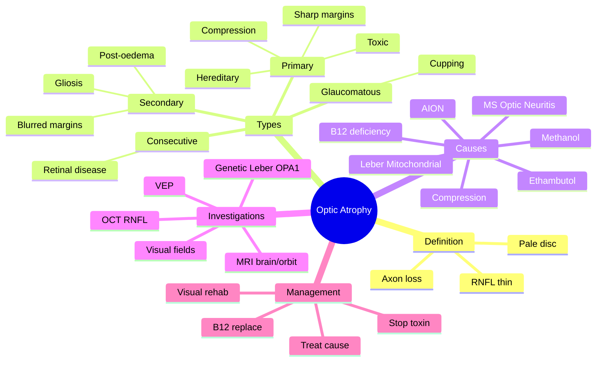

# Optic Atrophy

Related: [[Anterior Ischaemic Optic Neuropathy (AION)]], [[Optic Neuritis]], [[Glaucoma]]

> [!tip] **FCPS/MRCP Priority: HIGH**
> Pale disc — endpoint of many optic nerve diseases. Localise by history: GCA, MS, hereditary (Leber), toxic.

---

## Learning Objectives
- [ ] Define optic atrophy and identify the four pathological types
- [ ] List the major causes of optic atrophy
- [ ] Recognise the clinical features of optic atrophy
- [ ] Order appropriate investigations to identify the underlying cause
- [ ] Counsel on genetic and visual rehabilitation aspects

---

## 1. Definition / Epidemiology / Classification

### Definition
- **Optic atrophy:** Pallor of the optic disc due to **loss of axons (retinal ganglion cell nerve fibre layer)**
- Endpoint of many optic nerve disorders
- Sign of irreversible axonal loss
- Often associated with **RNFL thinning on OCT** and **visual field defects**

### Epidemiology
- Variable — depends on underlying cause
- Most common causes worldwide: glaucoma, optic neuritis (MS), AION
- Leber hereditary optic neuropathy: ~1 in 30,000–50,000

### Classification

| Type | Features | Cause |
|------|----------|-------|
| **Primary** | Pale, sharp margins, no gliosis | Chronic optic nerve compression, hereditary, toxic, post-radiation |
| **Secondary** | Pale, blurred margins, gliosis | Severe disc oedema, AION, chronic papilloedema |
| **Consecutive** | Pallor after retinal disease | RP, CRVO, severe retinal ischaemia |
| **Glaucomatous** | Not true atrophy; excavation with rim loss | Glaucoma |
| **Temporal / sectoral** | Pallor confined to part of disc (often temporal) | AION (altitudinal), toxic/nutritional, Leber's, MS |
| **Waxy** | Yellow-white pallor | Tay-Sachs, amaurotic familial idiocy |

---

## 2. Aetiology / Pathophysiology

### Pathophysiology
- Loss of retinal ganglion cell axons
- Reduced axoplasmic flow → thinning of retinal nerve fibre layer
- Loss of capillaries within disc → pallor
- Glial proliferation (in secondary type) → blurred margins
- Disc cupping (in glaucoma) — neuroretinal rim loss

### Causes (Comprehensive)
- **Demyelinating:** Optic neuritis (MS, NMOSD, MOG)
- **Ischaemic:** AION (arteritic and non-arteritic), CRVO
- **Raised ICP:** Chronic papilloedema → secondary optic atrophy
- **Compressive:** Tumour (meningioma, glioma, pituitary adenoma, craniopharyngioma), aneurysm, thyroid eye disease, osteopetrosis
- **Hereditary:** Leber hereditary optic neuropathy (LHON), autosomal dominant optic atrophy (OPA1 mutation), recessive optic atrophy
- **Toxic/Nutritional:** Methanol, ethambutol, isoniazid, chloramphenicol, amiodarone, B12 deficiency, folate, thiamine
- **Infiltrative:** Sarcoidosis, lymphoma, leukaemia, metastasis
- **Inflammatory:** Sarcoidosis, Behçet's, SLE, post-infectious
- **Traumatic:** Optic nerve avulsion, indirect optic nerve injury
- **Retinal disease:** Retinitis pigmentosa, Leber congenital amaurosis, severe CRVO
- **Glaucoma:** True cupping (often not classed as "optic atrophy" but is the end result of axonal loss)
- **Radiation optic neuropathy**
- **Congenital:** Optic nerve hypoplasia

---

## 3. Clinical Features

### Symptoms
- **↓VA** (gradual or sudden, depending on cause)
- **↓Colour vision** (often out of proportion to VA)
- **Visual field defect** (depends on cause):
  - Central/centrocaecal scotoma (toxic, Leber's, optic neuritis)
  - Altitudinal (AION)
  - Bitemporal (chiasmal compression)
  - Arcuate/nasal step (glaucoma)
  - Concentric constriction
- **Photophobia, glare** (loss of contrast)

### Signs
- **Pale optic disc** (slit-lamp / fundoscopy)
- **Loss of disc substance** (in primary/consecutive types)
- **± RAPD** (if asymmetric/unilateral)
- **↓Colour vision** (Ishihara, HRR)
- **Visual field defect**
- **RNFL thinning** on OCT
- ± Optociliary shunt vessels (chronic papilloedema, CRVO)
- ± Nerve fibre layer haemorrhages (continued disease activity)

---

## 4. Diagnosis

### Approach
1. **History:** onset, progression, pain, systemic features, drug history, family history
2. **Examination:** VA, colour, RAPD, disc appearance, visual fields
3. **Investigations:** targeted to cause

### Investigations
- **MRI brain/orbit** with contrast — compressive lesion, MS, infiltrative
- **Bloods:**
  - B12, folate, MMA, homocysteine (nutritional)
  - ANA, ACE (autoimmune, sarcoidosis)
  - Aquaporin-4 (NMOSD), MOG antibodies
  - Syphilis serology, Lyme, Bartonella
  - Hypercoagulable screen (if CRVO association)
- **Genetic testing:**
  - Leber's mutation: 11778 (most common), 14484, 3460 (mitochondrial DNA)
  - OPA1 (autosomal dominant optic atrophy)
- **Visual fields** (Humphrey/Goldmann)
- **VEP** (delayed in demyelination)
- **OCT RNFL** (quantifies axonal loss)
- **FFA** (if vascular cause suspected — CRVO)
- **Lumbar puncture** (MS workup — OCB)
- **Chest X-ray** (sarcoid, TB)

---

## 5. Specific Causes — Key Features

### Leber Hereditary Optic Neuropathy (LHON)
- **Mitochondrial inheritance** (transmitted through mothers; affects predominantly **males**)
- Onset **20–30 years**
- **Painless, sequential** central vision loss (one eye, then fellow eye within weeks-months)
- Acute phase: **peripapillary telangiectasia, pseudo-oedema** (swollen-appearing disc, no leakage on FFA)
- Later: **temporal/sectoral pallor**
- Central/centrocaecal scotoma
- **Three primary mutations:** 11778 (most common, worst prognosis), 14484, 3460
- **Idebenone** may help (especially 14484 mutation)
- No proven cure; avoid smoking, alcohol (precipitate vision loss)

### Autosomal Dominant Optic Atrophy (ADOA)
- **OPA1 gene** mutation (most common)
- **Insidious, bilateral, symmetric** vision loss in childhood
- **Temporal pallor** (pathognomonic but not always present)
- Mild to moderate ↓VA (6/9 to 6/36)
- **Trichromatic colour vision** defect (especially blue-yellow)
- No proven treatment

### Methanol-Induced Optic Atrophy
- **Acute onset** (within hours-days of ingestion)
- Severe, often permanent bilateral ↓VA
- Initially disc may be hyperaemic, then pallor within 1–2 months
- **Bilateral putaminal necrosis** on MRI
- Treatment: ethanol/fomepizole, haemodialysis, folinic acid (within hours)

### Toxic Optic Atrophy (Ethambutol, etc.)
- **Dose-dependent** (ethambutol >15 mg/kg/d)
- Central/centrocaecal scotoma
- May be reversible if drug stopped early
- Often temporal pallor

---

## 6. Management

### Treat Underlying Cause
- **Discontinue toxic drugs** (ethambutol, isoniazid, amiodarone)
- **B12 replacement** (intramuscular)
- **Steroids** for inflammatory causes (sarcoidosis, autoimmune)
- **Surgery** for compressive lesions (pituitary adenoma, meningioma)
- **Plasma exchange** for severe NMOSD
- **Genetic counselling** (Leber, ADOA)
- **Antioxidants/idebenone** for Leber's (limited evidence)

### Supportive
- **Visual rehabilitation, low-vision aids**
- **Registration as visually impaired** (if severe)
- **Occupational therapy, mobility training**
- **Psychological support** (depression common)
- **Vocational rehabilitation**

### Prevention (Fellow Eye)
- Aspirin for NAION (controversial)
- Avoid smoking, alcohol in Leber's
- Vitamin supplementation (B12, folate)
- Control vascular risk factors

---

## 7. Complications
- **Permanent visual loss** (irreversible)
- **Fellow eye involvement** (in many causes)
- **Loss of driving licence** (UK DVLA: VA standards)
- **Depression, social isolation**
- **Falls and fractures** (in elderly)

---

## 8. Red Flags / Emergencies
- **Rapidly progressive visual loss** → urgent workup
- **Painful disc oedema with progressive atrophy** → consider infiltrative, inflammatory
- **Bitemporal field loss** → chiasmal compression (pituitary apoplexy — emergency)
- **Child with bilateral optic atrophy** → Leber congenital amaurosis, hereditary, metabolic
- **Methanol ingestion** → emergency treatment
- **Suspected GCA** → IV methylpred

---

## 9. FCPS/MRCP High-Yield Summary

| Topic | Key Points |
|-------|------------|
| Definition | Pale disc from axon loss |
| Primary | Sharp margins, no gliosis |
| Secondary | Blurred margins, gliosis |
| Glaucomatous | Not true atrophy — cupping |
| Causes | MS, GCA, compression, hereditary, toxic |
| Leber | Young men, painless, sequential, mitochondrial, 11778 mutation |
| ADOA | OPA1, childhood, bilateral, temporal pallor |
| Methanol | Acute, severe, bilateral |
| Approach | MRI + targeted bloods + visual fields |
| Treatment | Treat cause, stop toxin, B12, rehab |

---

## 10. Viva Questions

1. **Q:** What is Leber hereditary optic neuropathy?
   **A:** Mitochondrial inheritance, young men (20–30), painless sequential central vision loss, peripapillary telangiectasia, pseudo-oedema. Mitochondrial DNA mutations (11778, 14484, 3460).

2. **Q:** Differentiate primary and secondary optic atrophy.
   **A:** Primary = pale disc with sharp margins, no gliosis (e.g., chronic compression, hereditary, toxic). Secondary = pale with blurred margins and gliosis (after severe disc oedema, AION, chronic papilloedema).

3. **Q:** What is the inheritance pattern of Leber's?
   **A:** Mitochondrial (maternal) — affects predominantly males (90%).

4. **Q:** Approach to a patient with bilateral optic atrophy?
   **A:** History (drugs, family, nutrition, systemic) → MRI brain/orbit + visual fields → bloods (B12, folate, ANA, ACE, AQP4, syphilis) → genetic testing (Leber, OPA1) → VEP, OCT, LP if needed.

5. **Q:** What is the OPA1 gene?
   **A:** Most common mutation in autosomal dominant optic atrophy — encoding a dynamin-related GTPase in mitochondria.

6. **Q:** What is the most important management for toxic optic atrophy?
   **A:** Stop the offending drug/toxin; B12/folate replacement; supportive (low-vision aids); monitor.

---

## 11. Common Confusions / Exam Traps

| Confusion | Clarification |
|-----------|---------------|
| "Optic atrophy is a diagnosis" | No — it's a sign; need to find the cause |
| "Pale disc = blindness" | Not always — colour vision, field, RNFL thickness vary |
| "Primary = secondary" | Different pathology (with/without gliosis) |
| "Leber's affects females equally" | No — 80–90% male, but female carriers transmit |
| "Glaucomatous cupping is optic atrophy" | Pathologically yes (axonal loss) but classified separately |
| "Methanol is reversible" | Often permanent if severe; only reversible if treated within hours |
| "Ethambutol always reversible" | No — late stoppage may be permanent |
| "All pale discs need MRI" | Targeted approach — clinically directed |

---

## 12. Mnemonics

1. **"PALE DISC"** — Pressure (papilloedema), AION, Leber's, Ethambutol/methanol, Demyelination (MS), Ischaemia, Sarcoid, Chronic compression
2. **"Leber = Lad's loss, mitochondrial"** — young men, sequential, mitochondrial
3. **"OPA1 = One Parent Affected"** — autosomal dominant optic atrophy, OPA1 gene
4. **"Methanol = Massive, Metabolic acidosis"** — acute, severe, anion gap acidosis

---

## 13. Mind Map

---

## 14. One-Page Revision Card

| **Topic** | **Optic Atrophy** |
|-----------|-------------------|
| **Definition** | Pale optic disc from retinal ganglion cell axon loss |
| **Primary** | Sharp margins, no gliosis (compression, hereditary, toxic) |
| **Secondary** | Blurred margins, gliosis (post-oedema) |
| **Glaucomatous** | Cupping, not true atrophy (also axonal loss) |
| **Major causes** | MS, AION, compression, hereditary (Leber, OPA1), toxic (methanol, ethambutol) |
| **Leber** | Mitochondrial, young men, sequential, 11778 mutation |
| **Methanol** | Acute, severe, bilateral, anion gap acidosis |
| **Approach** | MRI + bloods + genetic + visual fields |
| **Treatment** | Treat cause, stop toxin, B12, visual rehab |
| **Viva pearl** | Optic atrophy is a sign, not a diagnosis — find the cause |

---

## Spaced Repetition Trackers

### 24-Hour Recall Prompts
- [ ] Define optic atrophy and its major pathological types
- [ ] List 6 causes of optic atrophy
- [ ] Differentiate primary from secondary optic atrophy
- [ ] Describe Leber hereditary optic neuropathy
- [ ] Outline the management of toxic optic atrophy
- [ ] Identify the approach to bilateral optic atrophy

### Revision Schedule
- [ ] **Day 1** completed (creation + 24h recall)
- [ ] **Day 3** revision completed
- [ ] **Day 7** revision completed
- [ ] **Day 15** revision completed
- [ ] **Day 30** revision completed
- [ ] **Day 90** revision completed

---

## Must Know / Should Know / Nice to Know

### Must Know (Core for passing)
- [x] Definition (pale disc from axon loss)
- [x] Primary vs secondary optic atrophy
- [x] Major causes (MS, AION, compression, hereditary, toxic)
- [x] Leber's: mitochondrial, young men, sequential
- [x] Methanol: acute, severe, bilateral
- [x] Stop offending toxin (ethambutol)

### Should Know (High probability)
- [x] OPA1 mutation in autosomal dominant optic atrophy
- [x] LHON mutations (11778, 14484, 3460)
- [x] OCT RNFL thinning
- [x] B12 replacement
- [x] Glaucomatous cupping

### Nice to Know (Differentiator)
- [ ] Idebenone for Leber's
- [ ] OPA1 GTPase function
- [ ] Optociliary shunt vessels (chronic CRVO, papilloedema)
- [ ] LHON female carriers
- [ ] Genetic counselling

---

## My Weak Points
- [ ] Add personal weak areas here

---

## Self-Test Scorecard

| Section | Score /5 |
|---------|----------|
| Understanding: | /10 |
| Recall: | /10 |
| MCQ Performance: | /10 |
| SBA Performance: | /10 |
| Viva Confidence: | /10 |
| Total: | /50 |

> [!tip] **Interpretation:** <35 = weak topic, 35-44 = acceptable but insecure, 45+ = strong exam-ready topic.

---

## Exam Answer Modes

### Long Answer Skeleton
1. **Definition** — pallor of optic disc from loss of retinal ganglion cell axons
2. **Pathophysiology** — axonal loss → ↓RNFL → ↓capillaries → pallor
3. **Types** — primary (sharp, no gliosis), secondary (blurred, gliosis), consecutive (post-retinal), glaucomatous (cupping), sectoral
4. **Causes** — MS, AION, compression, hereditary, toxic/nutritional, infiltrative, trauma, retinal
5. **Clinical features** — ↓VA, ↓colour, field defect, pale disc, ±RAPD
6. **Investigations** — MRI brain/orbit, bloods, genetic (Leber, OPA1), visual fields, OCT, VEP
7. **Specific causes** — Leber's (mitochondrial, young men, sequential, 11778), OPA1 (childhood, bilateral, temporal pallor), methanol (acute, severe)
8. **Management** — treat cause, stop toxin, B12, visual rehabilitation
9. **Prognosis** — usually permanent; treat early where possible

### Short Note Skeleton
- Optic atrophy definition + 4 types
- 5 major causes
- Leber's (mitochondrial, young men)
- Management: treat cause

### Viva One-Liners
- **Q:** What is optic atrophy? → **A:** Pallor of disc from retinal ganglion cell axon loss
- **Q:** Primary vs secondary? → **A:** Primary = sharp margins, no gliosis; secondary = blurred margins, gliosis
- **Q:** Leber's inheritance? → **A:** Mitochondrial (maternal)
- **Q:** Common Leber's mutation? → **A:** 11778 (others: 14484, 3460)
- **Q:** Most common cause of toxic optic atrophy? → **A:** Ethambutol (dose-dependent) and methanol (acute)

### Ward-Case Discussion Points
- Detailed history (drugs, family, nutrition, systemic)
- VA, colour vision, RAPD, visual fields
- Disc examination (pallor type, sectoral, cupping)
- Fundus examination (RP, CRVO, infiltrates)
- MRI brain/orbit to exclude compressive lesion
- Bloods: B12, folate, MMA, homocysteine, ANA, ACE, AQP4
- Consider genetic testing (Leber, OPA1)
- Stop offending drugs/toxins
- Visual rehabilitation, low-vision support
- Genetic counselling if hereditary

### Last-Night-Before-Exam Sheet
- **Top 3 facts:** Pale disc from axon loss; Leber = mitochondrial, young men, 11778; stop the toxin
- **1 mnemonic:** "PALE DISC" (Pressure, AION, Leber, Ethambutol, Demyelination, Ischaemia, Sarcoid, Compression)
- **Must-know differential:** Primary vs secondary optic atrophy
- **Don't forget:** Optic atrophy is a sign — always find the cause

---

## Summary

Optic atrophy is **pallor of the optic disc from retinal ganglion cell axon loss**, an endpoint of many optic nerve diseases. **Primary** atrophy (sharp margins, no gliosis) suggests chronic compression, hereditary, or toxic causes; **secondary** (blurred margins, gliosis) follows severe disc oedema. Major causes include **MS, AION, compression, hereditary (Leber, OPA1), and toxic/nutritional (methanol, ethambutol, B12 deficiency)**. Approach requires targeted history, examination, MRI, bloods, and genetic testing. Management is to **treat the underlying cause, stop the offending toxin, replace B12, and provide visual rehabilitation**.

---

## MCQs (10)

1. **Question:** Optic atrophy is best described as:
   **Options:** A. Swelling of the optic disc B. Pallor of the optic disc from axonal loss C. Cupping of the optic disc D. Neovascularisation of the disc E. Haemorrhage around the disc
   **Answer:** B
   **Explanation:** Pallor of the disc from loss of retinal ganglion cell axons.

2. **Question:** Primary optic atrophy is characterised by:
   **Options:** A. Blurred disc margins B. Sharp disc margins without gliosis C. Hyperaemic disc D. Cupping E. Disc swelling
   **Answer:** B
   **Explanation:** Primary atrophy = pale disc, sharp margins, no gliosis (compression, hereditary, toxic).

3. **Question:** Leber hereditary optic neuropathy is most commonly due to mutation at:
   **Options:** A. OPA1 gene B. 11778 mitochondrial DNA C. RB1 gene D. CFTR gene E. BRCA1
   **Answer:** B
   **Explanation:** 11778 is the most common mitochondrial mutation in LHON (others 14484, 3460).

4. **Question:** Methanol poisoning causes optic atrophy that is typically:
   **Options:** A. Unilateral and painless B. Bilateral and acute C. Always reversible D. Painful E. Sectoral only
   **Answer:** B
   **Explanation:** Methanol causes acute, severe, often permanent bilateral optic atrophy.

5. **Question:** Ethambutol-induced optic neuropathy is associated with:
   **Options:** A. Low-dose long-term use B. Doses >15 mg/kg/day C. Reversible in all cases D. Painful E. Always unilateral
   **Answer:** B
   **Explanation:** Dose-dependent — risk increases with doses >15 mg/kg/day for >2 months.

6. **Question:** Secondary optic atrophy is associated with:
   **Options:** A. Sharp disc margins B. Blurred margins and gliosis C. Glaucomatous cupping D. Normal disc E. Drusen
   **Answer:** B
   **Explanation:** Secondary atrophy = blurred margins + gliosis (follows severe disc oedema).

7. **Question:** The most common cause of optic atrophy worldwide is:
   **Options:** A. Trauma B. Glaucoma C. MS D. Compression E. Hereditary
   **Answer:** B
   **Explanation:** Glaucoma is the most common cause of optic nerve axonal loss globally.

8. **Question:** Autosomal dominant optic atrophy is most commonly due to mutation in:
   **Options:** A. OPA1 B. NF1 C. RB1 D. CFTR E. BRCA1
   **Answer:** A
   **Explanation:** OPA1 gene mutation is the most common cause of ADOA (mitochondrial fission-fusion GTPase).

9. **Question:** Optociliary shunt vessels on fundoscopy are associated with:
   **Options:** A. Acute optic neuritis B. Chronic papilloedema, optic atrophy, CRVO C. Central serous retinopathy D. Macular hole E. Retinal detachment
   **Answer:** B
   **Explanation:** Optociliary shunts are retinochoroidal collaterals seen in chronic papilloedema (with optic atrophy) and CRVO.

10. **Question:** In the management of toxic optic neuropathy, the most important first step is:
    **Options:** A. Steroids B. Stop the offending agent C. Surgery D. Aspirin E. Vitamin C
    **Answer:** B
    **Explanation:** Stop the offending drug/toxin immediately; may be reversible if caught early.

---

## SBA Questions (10)

1. **Scenario:** A 25-year-old man has painless sequential central vision loss over 3 months. Fundus shows pseudo-oedema with peripapillary telangiectasia in the acute phase. Family history is significant (maternal uncle blind from age 30).
   **Question:** What is the most likely diagnosis?
   **Options:** A. MS-related optic neuritis B. Leber hereditary optic neuropathy C. NAION D. CRVO E. AION
   **Answer:** B
   **Explanation:** Young man + sequential painless ↓VA + peripapillary telangiectasia + maternal family history = Leber's.

2. **Scenario:** A 60-year-old with bilateral temporal disc pallor, mild ↓VA (6/12), and blue-yellow colour vision defect since childhood. Family history shows similar visual problems in mother and maternal grandmother.
   **Question:** What is the most likely diagnosis?
   **Options:** A. LHON B. Autosomal dominant optic atrophy (OPA1) C. Toxic optic neuropathy D. NAION E. Glaucoma
   **Answer:** B
   **Explanation:** Childhood onset, bilateral, temporal pallor, AD inheritance = OPA1 mutation.

3. **Scenario:** A 35-year-old alcoholic presents after ingesting windshield washer fluid. He has severe bilateral ↓VA, severe anion gap metabolic acidosis.
   **Question:** What is the most likely cause of visual loss?
   **Options:** A. Bilateral AION B. Methanol-induced optic neuropathy C. Leber's D. Ethambutol E. NAION
   **Answer:** B
   **Explanation:** Methanol ingestion → severe metabolic acidosis + bilateral optic neuropathy.

4. **Scenario:** A 50-year-old on ethambutol 25 mg/kg/day for 4 months has ↓VA and central scotoma. Fundus shows mild temporal pallor.
   **Question:** What is the most appropriate next step?
   **Options:** A. Continue ethambutol B. Stop ethambutol and monitor C. Add steroids D. IV methylpred E. Aspirin
   **Answer:** B
   **Explanation:** Ethambutol-induced optic neuropathy → stop drug immediately. Dose >15 mg/kg/d increases risk.

5. **Scenario:** A patient with chronic papilloedema has pale discs and optociliary shunt vessels. Visual acuity is now 6/60.
   **Question:** What is the chronic complication?
   **Options:** A. Primary optic atrophy B. Secondary optic atrophy C. Glaucoma D. Macular degeneration E. Retinal detachment
   **Answer:** B
   **Explanation:** Chronic papilloedema → secondary optic atrophy (pale disc + optociliary shunts + retinochoroidal collaterals).

6. **Scenario:** A 40-year-old has progressive ↓VA, bitemporal hemianopia, and pale discs. MRI shows a sellar mass.
   **Question:** What is the most likely cause?
   **Options:** A. Pituitary adenoma (chiasmal compression) B. Optic neuritis C. LHON D. Toxic E. CRVO
   **Answer:** A
   **Explanation:** Bitemporal hemianopia + sellar mass = chiasmal compression (pituitary adenoma).

7. **Scenario:** A patient with optic atrophy has OPA1 mutation confirmed. What is the inheritance?
   **Options:** A. Mitochondrial B. Autosomal dominant C. Autosomal recessive D. X-linked E. Sporadic
   **Answer:** B
   **Explanation:** OPA1 mutation is autosomal dominant.

8. **Scenario:** A 70-year-old has bilateral pale discs with sharp margins, no gliosis. VA is 6/24, fields show arcuate defects, IOP is normal.
   **Options:** A. The cause is most likely inflammatory B. The cause is most likely compression, hereditary, or toxic C. Acute papilloedema D. Severe disc swelling E. NAION
   **Answer:** B
   **Explanation:** Primary optic atrophy (sharp, no gliosis) suggests compression, hereditary, or toxic cause.

9. **Scenario:** A patient with severe pernicious anaemia (B12 deficiency) develops ↓VA. Fundus shows temporal disc pallor.
   **Question:** What is the most appropriate management?
   **Options:** A. Stop B12 replacement B. Intramuscular B12 replacement C. Oral B12 D. Folic acid only E. Steroids
   **Answer:** B
   **Explanation:** B12 deficiency → IM hydroxocobalamin replacement; oral may be inadequate in pernicious anaemia.

10. **Scenario:** A 30-year-old has bilateral optic atrophy. Which genetic test is most likely to confirm LHON?
    **Options:** A. OPA1 sequencing B. Mitochondrial DNA 11778 mutation C. RB1 testing D. BRCA1 E. NF1
    **Answer:** B
    **Explanation:** LHON — most common mutation is mitochondrial DNA 11778.

---

## Flashcards

- **Q:** What is the difference between primary and secondary optic atrophy?
  **A:** Primary = pale disc, sharp margins, no gliosis (compression, hereditary, toxic). Secondary = pale disc, blurred margins, gliosis (after severe disc oedema, AION, chronic papilloedema).
- **Q:** What is the most common mitochondrial mutation in Leber's hereditary optic neuropathy?
  **A:** 11778 (also 14484, 3460).
- **Q:** What is the inheritance of OPA1-related optic atrophy?
  **A:** Autosomal dominant.
- **Q:** What is the most important first step in toxic optic neuropathy?
  **A:** Stop the offending drug/toxin (e.g., ethambutol).
- **Q:** What is the most common cause of optic nerve axonal loss worldwide?
  **A:** Glaucoma.

---

## Answer Key with Explanations

### MCQs
1. B — Pallor from axonal loss
2. B — Primary = sharp, no gliosis
3. B — 11778 mitochondrial DNA most common in LHON
4. B — Methanol = acute, bilateral, severe
5. B — Ethambutol >15 mg/kg/d
6. B — Secondary = blurred + gliosis
7. B — Glaucoma is the most common global cause
8. A — OPA1 mutation
9. B — Optociliary shunts in chronic papilloedema, CRVO
10. B — Stop the toxin

### SBAs
1. B — Leber's in young man with maternal family history
2. B — OPA1 (ADOA) in childhood onset
3. B — Methanol-induced optic neuropathy
4. B — Stop ethambutol
5. B — Secondary optic atrophy from chronic papilloedema
6. A — Pituitary adenoma (chiasmal compression)
7. B — OPA1 is autosomal dominant
8. B — Primary optic atrophy suggests compression, hereditary, toxic
9. B — IM B12 in pernicious anaemia
10. B — LHON 11778 mutation

---

## Tags
#medicine #davidson #ophthalmology #optic-atrophy #fcps #mrcp #Leber
