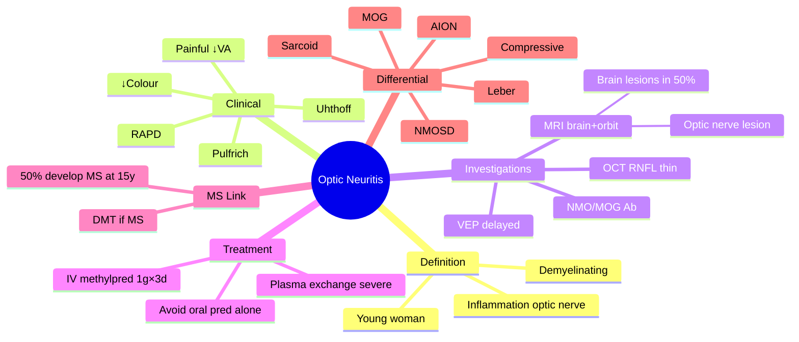

# Optic Neuritis

Related: [[Multiple Sclerosis]], [[Anterior Ischaemic Optic Neuropathy (AION)]], [[Papilloedema]]

> [!tip] **FCPS/MRCP Priority: CRITICAL**
> Painful loss of vision + RAPD + ↓ colour vision in young adult = demyelinating optic neuritis. MRI brain to look for demyelination. IV methylpred accelerates recovery (no long-term effect).

---

## Learning Objectives
- [ ] Define optic neuritis and its relationship to multiple sclerosis
- [ ] Identify the classic clinical features (pain on eye movement, ↓VA, ↓colour, RAPD)
- [ ] Order and interpret MRI brain/orbit with contrast
- [ ] Apply evidence-based treatment (IV methylpred per ONTT)
- [ ] Counsel on long-term prognosis and MS risk
- [ ] Distinguish from AION, NMOSD, Leber's, compressive lesions

---

## 1. Definition / Epidemiology / Classification

### Definition
- **Optic neuritis:** Inflammation of the optic nerve, most often demyelinating
- Strongly associated with multiple sclerosis (MS) — often the presenting clinically isolated syndrome (CIS)

### Epidemiology
- Typical patient: **young woman (20–40 years)**, female:male ≈ 3:1
- Incidence ≈ 5/100,000/year in Western populations
- Bilateral simultaneous disease is **uncommon** (think NMOSD, MOG, or infectious)
- **Recurrence rate:** ~30% within 10 years (higher in MS)

### Classification
- **Typical (demyelinating / MS-associated):** unilateral, painful, retrobulbar
- **Atypical:** bilateral, severe, no pain, no recovery, recurrent — look for NMOSD, MOG antibody disease, sarcoid, Leber's, infectious
- **Papillitis:** anterior variant with visible disc swelling
- **Retrobulbar:** disc appears normal initially (most common)
- **Neuroretinitis:** disc oedema + macular star (cat scratch, syphilis, Lyme)

---

## 2. Aetiology / Pathophysiology

### Aetiology
- **Demyelination** of the optic nerve (most common in young adults)
- Acute inflammation → conduction block → axonal injury in some
- In most cases, part of **MS spectrum** (clinically isolated syndrome)
- Other causes: NMOSD (aquaporin-4), MOG antibody disease, sarcoidosis, Behçet's, SLE, post-infectious, post-vaccination (rare), syphilis, Lyme, cat scratch (Bartonella)

### Pathophysiology
- Autoimmune-mediated demyelination of optic nerve fibres
- Inflammatory infiltrate (T-cells, macrophages) → myelin loss
- Conduction block → acute visual loss
- Remyelination + sodium channel redistribution → recovery over weeks
- Repeated attacks → axonal loss → permanent visual defect (RNFL thinning on OCT)

---

## 3. Clinical Features

### Symptoms
- **Sudden loss of vision** (over hours to days; progresses for 1–2 weeks)
- **Pain on eye movement** (90%) — key feature, often retro-orbital
- **↓ Colour vision** (often out of proportion to VA)
- **Central / paracentral scotoma**
- May have **Uhthoff phenomenon** (worsening with heat/exercise/hot bath) — demyelination sign
- **Pulfrich effect** (perception of asymmetrical movement of a pendulum — intereye conduction delay)
- **Phosphenes** (light flashes on eye movement)
- May have Lhermitte sign (suggesting cervical demyelination elsewhere)

### Signs
- **↓ VA** (variable, 6/6 to NPL; mean ≈ 6/18, recovers to 6/9 in most)
- **RAPD** (relative afferent pupillary defect) — present in unilateral/bilateral asymmetric disease
- **↓ Colour vision** (Ishihara, HRR) — often profound
- **Fundus:** Normal (retrobulbar — 2/3) or mild disc swelling (papillitis — 1/3)
- ± Periphlebitis (perivenous sheathing — MS)
- Pain on eye movement
- Reduced contrast sensitivity
- Visual field: most commonly a diffuse/central defect, but altitudinal, arcuate, hemianopic defects possible

### MRI Findings
- **Bright T2/FLAIR** lesion in optic nerve (often with gadolinium enhancement in acute phase)
- **Brain lesions** in 50% (silent MS) — important for prognosis and treatment decisions
- Periventricular, juxtacortical, infratentorial, spinal cord lesions per McDonald criteria

---

## 4. Diagnosis

- **Clinical + MRI** is the standard
- **McDonald criteria:** dissemination in space and time on MRI → MS
- Differential diagnosis must be excluded:
  - AION (painless, older, vascular risk factors)
  - NMOSD (severe, bilateral, longitudinally extensive)
  - MOG antibody disease (optic neuritis ± ADEM)
  - Sarcoid, Behçet's
  - Leber hereditary optic neuropathy
  - Toxic/nutritional
  - Compressive (tumour, aneurysm)

---

## 5. Investigations

- **MRI brain + orbit with contrast + fat suppression** — gold standard
- **Visual evoked potentials (VEP):** delayed P100 — supportive, not required for diagnosis
- **OCT (RNFL):** thinning in chronic disease, useful for monitoring
- **Bloods:**
  - NMO IgG (aquaporin-4 antibodies) for atypical/bilateral/severe
  - MOG antibodies for bilateral/recurrent/optic neuritis with severe swelling
  - ANA, ACE (sarcoid), syphilis serology, Lyme, Bartonella (if atypical)
  - B12, folate (exclude nutritional)
- **Lumbar puncture** (oligoclonal bands — MS) — supportive for MS diagnosis
- **Visual fields** (Humphrey/Goldmann) — to characterise defect
- **Chest X-ray** (sarcoid) when atypical

---

## 6. Management

### Acute Treatment
- **IV methylprednisolone 1 g daily × 3 days** — accelerates visual recovery (no long-term benefit on final VA per ONTT)
- ± Oral prednisolone taper (e.g., 1 mg/kg × 11 days)
- **Do NOT use oral prednisolone alone** — worse outcomes (more recurrences) per ONTT
- **No proven disease-modifying therapy** for vision
- **Plasma exchange / IVIG** — for severe, bilateral, NMOSD-associated, steroid-unresponsive

### Long-Term Management
- **Disease-modifying therapy for MS** (interferon-β, glatiramer, dimethyl fumarate, ocrelizumab, natalizumab, etc.) if MS confirmed/high risk
- **Neuroprotection:** no proven agents yet; high-dose vitamin D debated
- **Visual rehabilitation:** low-vision aids, registration if severely impaired
- **Patient education:** MS risk, recognition of new symptoms, smoking cessation, vitamin D

### ONTT (Optic Neuritis Treatment Trial) Key Findings
- IV methylpred → **faster recovery**, no long-term benefit
- Oral pred alone → **worse outcomes** (more recurrences)
- **50% of women develop MS within 15 years**
- 30% recurrence rate within 10 years

---

## 7. Complications / Prognosis
- **Visual recovery:** begins at 2–3 weeks, plateau at 6–12 months; ~90% recover to 6/12 or better
- Residual deficits in **colour vision, contrast sensitivity, motion perception** common
- **RNFL thinning** on OCT persists
- **MS conversion:** ~30% at 5 years, 50% at 15 years (higher if MRI lesions at baseline)
- **Recurrence** in ~30% within 10 years
- Rarely: severe permanent visual loss (especially NMOSD)

---

## 8. Red Flags / Emergencies
- **Bilateral simultaneous** optic neuritis → think NMOSD, MOG
- **No pain** → atypical; reconsider diagnosis
- **No recovery** at 6 weeks → reconsider; consider chronic relapsing inflammatory optic neuropathy (CRION), sarcoid
- **Severe pain, marked disc swelling, retinal haemorrhages** → atypical; consider neuroretinitis
- **Age <12 or >50** → atypical
- **Suspected GCA features** → think A-AION, urgent ESR/CRP, IV methylpred

---

## 9. FCPS/MRCP High-Yield Summary

| Topic | Key Points |
|-------|------------|
| Symptoms | Pain on eye movement, ↓VA, ↓colour |
| Sign | RAPD, ↓colour, ± disc swelling |
| MRI | Optic nerve lesion, brain lesions (50%) |
| Treatment | IV methylpred (1g × 3d) |
| Outcome | Most recover, 50% develop MS |
| Don't use | Oral pred alone (worse) |
| Atypical features | Bilateral, severe, no pain, no recovery → NMOSD/MOG/sarcoid |

---

## 10. Viva Questions

1. **Q:** What are the classic clinical features of optic neuritis?
   **A:** Pain on eye movement, ↓VA, ↓colour vision, RAPD, ± disc swelling. Young woman, subacute onset.

2. **Q:** Why is MRI important in optic neuritis?
   **A:** To look for demyelinating lesions — predicts risk of MS conversion. Also excludes compressive lesions. Brain lesions in 50% at presentation.

3. **Q:** What is the treatment?
   **A:** IV methylprednisolone 1 g × 3 days (accelerates recovery). No oral pred alone. Treat underlying MS with DMT.

4. **Q:** What is Uhthoff's phenomenon?
   **A:** Temporary worsening of vision with ↑ body temperature (exercise, hot bath, fever) — sign of demyelination.

5. **Q:** When do you suspect NMOSD rather than MS?
   **A:** Severe bilateral optic neuritis, longitudinally extensive cord lesions, intractable hiccups/nausea/vomiting (area postrema), aquaporin-4 antibodies positive.

6. **Q:** What is the most important modifiable risk factor for MS after optic neuritis?
   **A:** Smoking cessation; vitamin D supplementation debated.

---

## 11. Common Confusions / Exam Traps

| Confusion | Clarification |
|-----------|---------------|
| "Oral pred alone is fine" | Wrong — ONTT showed worse recurrence rate |
| "IV methylpred improves final VA" | No — it only accelerates recovery |
| "RAPD is pathognomonic" | No — present in any asymmetric optic neuropathy (AION, CRION, tumour) |
| "Optic neuritis is always MS" | No — NMOSD, MOG, sarcoid, infections all can present similarly |
| "Pain on eye movement = optic neuritis" | Almost always, but rare in other conditions |
| "Recovery is always complete" | Colour vision, contrast, motion perception often persistently abnormal |

---

## 12. Mnemonics

1. **"Painful, Pale (normal disc), Poor colour, Pupil RAPD, People in 20s–30s, MRI bright"** — typical optic neuritis in young adult woman
2. **"ONTT: IV good, Oral bad"** — IV methylpred accelerates recovery; oral pred alone worsens outcomes
3. **"50% at 15 years"** — half of women with optic neuritis develop MS within 15 years
4. **"Uhthoff = Unmasked demyelination with heat"** — vision worsens with ↑ temperature

---

## 13. Mind Map

---

## 14. One-Page Revision Card

| **Topic** | **Optic Neuritis** |
|-----------|--------------------|
| **Definition** | Acute demyelinating inflammation of optic nerve |
| **Demographics** | Young woman, 20–40y, F:M 3:1 |
| **Key symptoms** | Pain on eye movement + ↓VA + ↓colour |
| **Key sign** | RAPD present, ± disc swelling |
| **MRI** | Optic nerve T2 hyperintense + brain lesions in 50% |
| **Treatment** | IV methylpred 1 g × 3 days |
| **Don't** | Oral pred alone (worse outcomes) |
| **Prognosis** | 90% recover to 6/12; 50% develop MS at 15y |
| **Atypical** | Bilateral/severe/no pain → NMOSD, MOG |
| **Viva pearl** | Pain on EOM in 90% — almost diagnostic |

---

## Spaced Repetition Trackers

### 24-Hour Recall Prompts
- [ ] Define optic neuritis and the typical patient demographic
- [ ] List the 5 classic features (pain, ↓VA, ↓colour, RAPD, ± disc swelling)
- [ ] State the ONTT treatment regimen and why oral pred alone is contraindicated
- [ ] Describe the MRI findings and MS risk
- [ ] Distinguish from NMOSD and AION

### Revision Schedule
- [ ] **Day 1** completed (creation + 24h recall)
- [ ] **Day 3** revision completed
- [ ] **Day 7** revision completed
- [ ] **Day 15** revision completed
- [ ] **Day 30** revision completed
- [ ] **Day 90** revision completed

---

## Must Know / Should Know / Nice to Know

### Must Know (Core for passing)
- [x] Classic clinical features (pain, ↓VA, ↓colour, RAPD)
- [x] MRI findings and MS risk
- [x] IV methylpred 1g × 3d treatment
- [x] ONTT: avoid oral pred alone
- [x] 50% develop MS in 15 years

### Should Know (High probability)
- [x] Uhthoff phenomenon
- [x] Pulfrich effect
- [x] NMOSD/MOG antibody disease (when to suspect)
- [x] Plasma exchange for severe cases
- [x] OCT RNFL thinning

### Nice to Know (Differentiator)
- [ ] McDonald MRI criteria for MS
- [ ] Oligoclonal bands in CSF
- [ ] Ocrelizumab, natalizumab mechanism
- [ ] Aquaporin-4 channel location and NMOSD
- [ ] MOG antibody disease phenotype

---

## My Weak Points
- [ ] Add personal weak areas here

---

## Self-Test Scorecard

| Section | Score /5 |
|---------|----------|
| Understanding: | /10 |
| Recall: | /10 |
| MCQ Performance: | /10 |
| SBA Performance: | /10 |
| Viva Confidence: | /10 |
| Total: | /50 |

> [!tip] **Interpretation:** <35 = weak topic, 35-44 = acceptable but insecure, 45+ = strong exam-ready topic.

---

## Exam Answer Modes

### Long Answer Skeleton
1. **Definition** — acute demyelinating inflammation of optic nerve; most common CIS of MS
2. **Demographics** — young woman, 20–40y, F:M 3:1
3. **Clinical features** — subacute ↓VA over hours-days, pain on EOM (90%), ↓colour vision, RAPD, ± disc swelling; Uhthoff and Pulfrich phenomena
4. **Investigations** — MRI brain + orbit with contrast (optic nerve lesion, brain lesions in 50%), VEP, OCT, AQP4-IgG, MOG antibodies, OCB
5. **Differential** — AION, NMOSD, MOG disease, sarcoid, Leber's, compressive
6. **Management** — IV methylpred 1g × 3d (accelerates recovery only); avoid oral pred alone; DMT for MS if confirmed; plasma exchange for severe/NMOSD
7. **Prognosis** — 90% recover; 50% develop MS at 15y

### Short Note Skeleton
- Definition + demographics
- Classic features (pain + ↓VA + ↓colour + RAPD)
- MRI findings (optic nerve + brain)
- IV methylpred 1g × 3d; ONTT data
- MS risk

### Viva One-Liners
- **Q:** What is the most useful investigation? → **A:** MRI brain + orbit with contrast
- **Q:** Best initial treatment? → **A:** IV methylpred 1 g × 3 days
- **Q:** Why not oral pred alone? → **A:** ONTT — increases recurrence rate
- **Q:** Uhthoff phenomenon? → **A:** Vision worsens with ↑ temperature (demyelination sign)
- **Q:** Long-term MS risk? → **A:** 50% at 15 years in women

### Ward-Case Discussion Points
- Examine for RAPD and colour vision (often out of proportion to VA)
- Look for signs of MS elsewhere (INO, sensory level)
- Urgent MRI brain + orbit to confirm demyelination
- Counsel on MS risk and modifiable factors
- Arrange DMT discussion if MS confirmed
- Recognize atypical features → NMOSD/MOG workup

### Last-Night-Before-Exam Sheet
- **Top 3 facts:** pain on EOM, ↓colour, RAPD; IV methylpred 1g×3d; 50% develop MS at 15y
- **1 mnemonic:** "ONTT: IV good, Oral bad"
- **Must-know differential:** AION (painless, older, vascular), NMOSD (bilateral, severe)
- **Don't forget:** Avoid oral pred alone

---

## Summary

Optic neuritis is an acute demyelinating inflammation of the optic nerve, typically in young women. The classic presentation is **painful loss of vision with ↓colour vision and RAPD**. MRI brain/orbit is essential to confirm demyelination, exclude compressive lesions, and assess MS risk (50% at 15 years). Treatment is **IV methylprednisolone 1 g × 3 days**, which accelerates recovery but does not change final VA. Oral pred alone worsens outcomes (ONTT). Recognize atypical features (bilateral, severe, no pain, no recovery) → test for NMOSD, MOG, sarcoid. Most patients recover useful vision.

---

## MCQs (10)

1. **Question:** A young woman with painful loss of vision and ↓colour vision most likely has:
   **Options:** A. Acute glaucoma B. Optic neuritis C. Subretinal haemorrhage D. Retinal detachment E. Vitreous haemorrhage
   **Answer:** B
   **Explanation:** Young + pain on EOM + ↓VA + ↓colour = typical demyelinating optic neuritis.

2. **Question:** The most useful investigation in suspected optic neuritis is:
   **Options:** A. Visual evoked potentials B. CT brain C. MRI brain + orbit with contrast D. Lumbar puncture E. OCT only
   **Answer:** C
   **Explanation:** MRI confirms optic nerve demyelination, excludes compressive lesions, identifies brain lesions (50% — silent MS), and predicts MS risk.

3. **Question:** Treatment of choice in demyelinating optic neuritis is:
   **Options:** A. Oral prednisolone alone B. IV methylprednisolone 1 g × 3 days C. Topical steroid D. Intravitreal steroid E. No treatment
   **Answer:** B
   **Explanation:** IV methylpred 1 g × 3d accelerates visual recovery; oral pred alone worsens outcomes (ONTT).

4. **Question:** Pain on eye movement in optic neuritis is due to:
   **Options:** A. Inflammation of extraocular muscles B. Inflammation of optic nerve sheath (CN V innervation) C. Raised ICP D. Corneal abrasion E. Scleritis
   **Answer:** B
   **Explanation:** Inflammation of the optic nerve sheath, innervated by the trigeminal nerve, causes pain on eye movement.

5. **Question:** Uhthoff phenomenon refers to:
   **Options:** A. Pain on eye movement B. ↓ Colour vision C. Worsening of vision with ↑ temperature D. RAPD E. Central scotoma
   **Answer:** C
   **Explanation:** Heat (exercise, hot bath, fever) worsens conduction in demyelinated nerves → transient ↓VA.

6. **Question:** Optic neuritis is most commonly associated with:
   **Options:** A. Hypertension B. Multiple sclerosis C. Diabetes D. Glaucoma E. Smoking alone
   **Answer:** B
   **Explanation:** MS is the most common cause; ~50% of women with optic neuritis develop MS within 15 years.

7. **Question:** The Optic Neuritis Treatment Trial showed that oral prednisolone alone:
   **Options:** A. Improves long-term visual outcome B. Has no effect C. Increases the rate of recurrent attacks D. Cures optic neuritis E. Is the treatment of choice
   **Answer:** C
   **Explanation:** ONTT — oral pred alone is associated with increased recurrence rate of optic neuritis; do not use.

8. **Question:** A relative afferent pupillary defect (RAPD) in optic neuritis is:
   **Options:** A. Absent because both eyes are involved B. Present in unilateral or asymmetric disease C. Pathognomonic of MS D. Indicates raised ICP E. Reversed
   **Answer:** B
   **Explanation:** RAPD is present in unilateral or asymmetric bilateral optic neuritis; absent only if perfectly symmetric bilateral disease.

9. **Question:** Which feature suggests NMOSD rather than typical MS-related optic neuritis?
   **Options:** A. Pain on EOM B. Severe bilateral optic neuritis with poor recovery C. RAPD D. Age 30 E. Female sex
   **Answer:** B
   **Explanation:** NMOSD causes severe, often bilateral, longitudinally extensive optic neuritis with poor recovery; aquaporin-4 antibodies positive.

10. **Question:** Visual evoked potentials in optic neuritis classically show:
    **Options:** A. Normal response B. Delayed P100 with normal amplitude C. Reduced amplitude only D. Absent response E. Normal latency
    **Answer:** B
    **Explanation:** Demyelination causes delayed P100 latency; amplitude may also be reduced.

---

## SBA Questions (10)

1. **Scenario:** A 28-year-old woman has a 3-day history of painful loss of vision in the right eye, worse on eye movement, with subjective loss of colour.
   **Question:** What is the most likely diagnosis?
   **Options:** A. Central retinal artery occlusion B. Optic neuritis C. Acute angle-closure glaucoma D. Vitreous haemorrhage E. Retinal detachment
   **Answer:** B
   **Explanation:** Young + subacute painful ↓VA + ↓colour = demyelinating optic neuritis.

2. **Scenario:** A 25-year-old with painful loss of vision has RAPD, ↓colour, normal disc. MRI brain shows T2 hyperintense lesion in the right optic nerve and 2 periventricular white matter lesions.
   **Question:** What is the most appropriate acute treatment?
   **Options:** A. Oral prednisolone 1 mg/kg × 2 weeks B. IV methylprednisolone 1 g × 3 days C. Topical steroid D. Plasma exchange E. Observation
   **Answer:** B
   **Explanation:** Standard ONTT regimen — IV methylpred 1g × 3 days.

3. **Scenario:** A 30-year-old woman with confirmed MS-related optic neuritis is started on oral prednisolone only by a junior colleague.
   **Question:** What should be the next step?
   **Options:** A. Continue oral pred B. Switch to IV methylpred 1 g × 3 days C. Add topical steroid D. Add IVIG E. Stop all steroids
   **Answer:** B
   **Explanation:** ONTT — oral pred alone worsens recurrence rate; switch to IV methylpred.

4. **Scenario:** A 32-year-old with severe bilateral optic neuritis, intractable nausea/vomiting, and longitudinally extensive spinal cord lesion on MRI.
   **Question:** What antibody is most likely to be positive?
   **Options:** A. ANA B. Aquaporin-4 (NMO-IgG) C. Anti-CCP D. c-ANCA E. Anti-La
   **Answer:** B
   **Explanation:** Aquaporin-4 antibodies in NMOSD — associated with severe bilateral optic neuritis, area postrema syndrome (hiccups/nausea), and LETM.

5. **Scenario:** A patient with optic neuritis mentions that vision worsens after hot baths and exercise, but recovers after rest.
   **Question:** What is this phenomenon called?
   **Options:** A. Pulfrich effect B. Uhthoff phenomenon C. Marcus Gunn D. Marcus-Gunn pupil E. None
   **Answer:** B
   **Explanation:** Heat-induced transient worsening = Uhthoff phenomenon (demyelination sign).

6. **Scenario:** A 35-year-old with optic neuritis has 4 periventricular T2 hyperintense brain lesions on MRI.
   **Question:** What is the approximate risk of developing clinically definite MS within 15 years?
   **Options:** A. <10% B. 25% C. 50% D. 80% E. 100%
   **Answer:** C
   **Explanation:** ONTT data — ~50% of women develop MS within 15 years; risk higher with baseline MRI lesions.

7. **Scenario:** A patient with optic neuritis has vision of 6/60 on day 5, with pain on eye movement. The disc is normal.
   **Question:** What is the typical time course of visual recovery?
   **Options:** A. Within 24 hours B. Begins at 2–3 weeks, plateaus at 6–12 months C. Permanent blindness D. Improves over 5 years E. No recovery
   **Answer:** B
   **Explanation:** Recovery begins 2–3 weeks, continues for 6–12 months; ~90% reach 6/12 or better.

8. **Scenario:** A 26-year-old with bilateral simultaneous optic neuritis, severe loss of vision, with MOG antibodies positive.
   **Question:** What is the most likely diagnosis?
   **Options:** A. MS B. NMOSD C. MOG antibody-associated disease D. Sarcoidosis E. Leber's
   **Answer:** C
   **Explanation:** MOG antibody disease causes bilateral, often severe optic neuritis with good recovery on steroids.

9. **Scenario:** A patient with optic neuritis and a normal-appearing optic disc on fundoscopy.
   **Question:** What is this variant called?
   **Options:** A. Papillitis B. Retrobulbar optic neuritis C. Neuroretinitis D. Perineuritis E. Optic perineuritis
   **Answer:** B
   **Explanation:** Retrobulbar = inflammation behind the lamina cribrosa, disc appears normal (most common form, ~2/3).

10. **Scenario:** A 40-year-old with optic neuritis has been started on IV methylpred. The patient asks whether their final vision will be better than without treatment.
    **Question:** What is the correct response?
    **Options:** A. Yes, final VA is significantly better B. No, only the speed of recovery is improved C. Steroids cure the disease D. Steroids prevent MS E. Steroids prevent recurrence
    **Answer:** B
    **Explanation:** ONTT — IV methylpred accelerates visual recovery but does NOT improve final visual acuity.

---

## Flashcards

- **Q:** What is the classic tetrad of optic neuritis?
  **A:** Pain on eye movement, ↓VA, ↓colour vision, RAPD (± disc swelling).
- **Q:** What is the first-line acute treatment?
  **A:** IV methylprednisolone 1 g daily × 3 days (ONTT).
- **Q:** Why is oral prednisolone alone contraindicated?
  **A:** ONTT showed increased recurrence rate with oral pred alone.
- **Q:** Long-term MS risk in women with optic neuritis?
  **A:** ~50% develop clinically definite MS within 15 years.
- **Q:** What is Uhthoff phenomenon?
  **A:** Transient worsening of vision with ↑ body temperature (demyelination sign).

---

## Answer Key with Explanations

### MCQs
1. B — Young + pain + ↓colour = optic neuritis
2. C — MRI brain + orbit with contrast is the investigation of choice
3. B — IV methylpred 1g × 3d
4. B — Optic nerve sheath inflammation (trigeminal innervation)
5. C — Heat-induced worsening = Uhthoff
6. B — MS is the most common association
7. C — Oral pred alone increases recurrence (ONTT)
8. B — RAPD in unilateral or asymmetric disease
9. B — Severe bilateral optic neuritis = NMOSD
10. B — Delayed P100 in demyelination

### SBAs
1. B — Painful ↓VA in young woman = optic neuritis
2. B — IV methylpred 1g × 3d is the acute treatment
3. B — Switch oral pred to IV methylpred (ONTT)
4. B — Aquaporin-4 in NMOSD
5. B — Uhthoff phenomenon
6. C — ~50% MS risk at 15 years (women)
7. B — Recovery 2–3 weeks to 6–12 months
8. C — MOG antibody disease
9. B — Retrobulbar optic neuritis
10. B — IV methylpred accelerates but does not improve final VA

---

## Tags
#medicine #davidson #ophthalmology #optic-neuritis #MS #fcps #mrcp #demyelination

## PasTest Scenario SBAs (Clinical Vignettes)

> **Auto-generated PasTest/Mediscope-style scenario SBAs** grounded in the authored source. Each scenario tests a real clinical fact (triad, specific sign, contraindication, trial, first-line Rx) extracted from the topic. *Source: Ch 28: Medical Ophthalmology — Optic Neuritis*

**Q1.** Which of the following features is most specific or characteristic of Optic Neuritis?

  - **A.** Pain on eye movement
  - **B.** A feature common to many acute inflammatory conditions
  - **C.** A non-specific sign that does not localise the diagnosis
  - **D.** An investigation finding rather than a clinical feature

  > **Answer: A** — Pain on eye movement
  >
  > *Source:* ## Symptoms
- **Sudden loss of vision** (over hours to days; progresses for 1–2 weeks)
- **Pain on eye movement** (90%) — key feature, often retro-orbital
- **↓ Colour vision** (often out of proportio

**Q2.** What is the most appropriate first-line therapy for Optic Neuritis?

  - **A.** Do NOT use oral prednisolone alone
  - **B.** An advanced/surgical therapy reserved for refractory disease
  - **C.** Symptomatic treatment only, no disease-modifying therapy
  - **D.** Empiric broad-spectrum therapy without specific indication

  > **Answer: A** — Do NOT use oral prednisolone alone
  >
  > *Source:* **Do NOT use oral prednisolone alone** — worse outcomes (more recurrences) per ONTT

