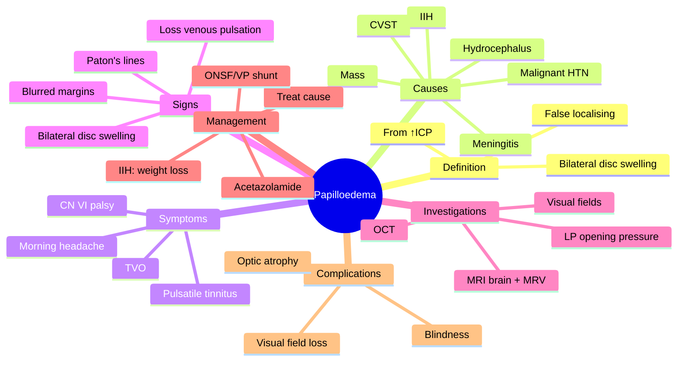

# Papilloedema

Related: [[Idiopathic Intracranial Hypertension]], [[Anterior Ischaemic Optic Neuropathy (AION)]], [[Optic Neuritis]]

> [!tip] **FCPS/MRCP Priority: CRITICAL**
> Bilateral disc swelling from raised ICP. Urgent neuroimaging to exclude mass. LP for CSF pressure. Treat cause.

---

## Learning Objectives
- [ ] Define papilloedema and its pathophysiology
- [ ] Identify the causes of raised ICP
- [ ] Recognise the symptoms and signs of ↑ICP
- [ ] Apply the Modified Frisén staging
- [ ] Order and interpret urgent neuroimaging, MRV, and LP
- [ ] Initiate appropriate management of IIH
- [ ] Recognise chronic papilloedema and risk of optic atrophy

---

## 1. Definition / Epidemiology / Classification

### Definition
- **Papilloedema:** Optic disc swelling (oedema) due to **raised intracranial pressure**
- Almost always **bilateral** (but can be asymmetric)
- "**False localising sign**" of ↑ICP — does not localise the cause
- **Disc oedema** = generic term for swollen disc from any cause
- **Papilloedema** = disc oedema specifically from ↑ICP
- **Unilateral/asymmetric disc oedema** is usually NOT papilloedema — consider AION, optic neuritis, CRVO, infiltration, local compression, hypotony

### Epidemiology
- Most common cause in **young obese women** = IIH
- IIH incidence rising with obesity epidemic (~20/100,000 in obese women)
- Brain tumours, hydrocephalus, CVST — variable epidemiology

### Classification
- **By cause:** IIH, intracranial mass, hydrocephalus, CVST, meningitis, malignant HTN
- **By chronicity:** acute, subacute, chronic (atrophic)
- **By symmetry:** symmetric (typical), asymmetric, unilateral (usually not papilloedema)

---

## 2. Pathophysiology

- ↑ ICP transmitted through **subarachnoid space** around the optic nerve (which is a CSF-filled extension of the subarachnoid space)
- Compression of optic nerve at **lamina cribrosa**
- **Axonal swelling** within retinal nerve fibre layer
- **Venous congestion** and leakage from peripapillary capillaries
- Disc swelling → blurred disc margins, hyperaemia, vessel engorgement
- Chronic phase → **secondary optic atrophy** (pale disc), optociliary shunt vessels, retinochoroidal collaterals

---

## 3. Causes

### Raised ICP
- **Idiopathic intracranial hypertension (IIH / pseudotumour cerebri)** — common in young obese women
- **Intracranial mass** (tumour, abscess, haematoma)
- **Hydrocephalus** (obstructive, communicating)
- **Meningitis, encephalitis** (esp. tuberculous, fungal, bacterial)
- **Cerebral venous sinus thrombosis (CVST)** — dural sinus thrombosis
- **Severe systemic hypertension** (malignant / hypertensive emergency)
- **Hypercapnia / CO2 retention** (COPD, OSA)
- **Hypervitaminosis A, retinoids, tetracyclines, nitrofurantoin** (drug-induced)
- **Pregnancy, eclampsia**
- **Guillain-Barré syndrome** (↑ICP from impaired CSF reabsorption)

### Other Causes of Disc Oedema (NOT papilloedema)
- Optic neuritis
- AION (NAION / A-AION)
- CRVO
- Infiltration (tumour, sarcoidosis, lymphoma)
- Local optic nerve compression
- Hypotony (ocular)
- Posterior uveitis, posterior scleritis
- Diabetic papillopathy
- Leber's hereditary optic neuropathy (pseudo-papilloedema)

---

## 4. Clinical Features

### Symptoms of ↑ICP
- **Headache** (worse on lying down, Valsalva, coughing, **worse in morning**)
- **Transient visual obscurations (TVO)** — seconds, bilateral, often on standing/bending
- Nausea, vomiting (often morning)
- **Pulsatile tinnitus** (whooshing in time with pulse)
- **Diplopia** (CN VI palsy — "false localising sign" of ↑ICP)
- Cognitive change, altered consciousness (late)
- Photophobia (meningeal irritation)

### Symptoms of Papilloedema Itself
- **Usually no visual loss initially** — important feature
- May have **transient visual obscurations** (seconds, monocular or binocular)
- Enlarged blind spot (perimetry)
- Progressive **visual field loss** in chronic disease (especially nasal → arcuate → global loss)
- **Loss of vision** (chronic — secondary optic atrophy)

### Signs
- **Bilateral disc swelling** (key feature)
  - Blurred disc margins (nasal first, then superior/inferior/temporal)
  - Disc hyperaemia
  - **Loss of spontaneous venous pulsations** (early sign, but can be absent in 10% of normals)
  - Vessel engorgement, tortuosity
  - Peripapillary haemorrhages, cotton wool spots, exudates
  - **Paton's lines** (circumferential retinal folds around disc)
  - **Macular oedema, hard exudates (macular star)** — especially in neuroretinitis
- **Chronic:** optic atrophy, pale disc, optociliary shunt vessels (triad with chronic papilloedema)
- **± CN VI palsy** (false localising — abducens nerve stretched by ↑ICP)
- **± Other cranial nerve palsies** (rare)

### Pseudo-Papilloedema (Mimics)
- **Optic disc drusen** (calcific deposits — autofluorescence, B-scan ultrasound)
- **Hypermetropic disc** (small, crowded)
- **Myelinated nerve fibres**
- **Tilted disc**

---

## 5. Staging (Modified Frisén)

- **Stage 0:** Normal disc
- **Stage 1:** Obscuration of nasal disc margin ± hyperaemia
- **Stage 2:** All disc margins obscured; circumferential halo
- **Stage 3:** Peripapillary haemorrhages, elevation, obscuration of vessels at disc margin
- **Stage 4:** Elevation of entire disc; major vessels completely obscured
- **Stage 5:** Dome-shaped protrusion with obscuration of all vessels at disc

---

## 6. Investigations

- **Urgent neuroimaging** (CT/MRI brain) — exclude mass
  - **MRI brain + MRV** is preferred (excludes mass, hydrocephalus, venous sinus thrombosis)
  - Look for **empty sella**, **flattening of posterior globe**, **distension of perioptic subarachnoid space**, **vertical tortuosity of optic nerve** (signs of ↑ICP)
- **Lumbar puncture** (after imaging) — opening pressure, CSF composition
  - **Opening pressure >25 cm H₂O** in adults (≥28 cm H₂O in children) = raised ICP
  - Normal CSF (in IIH)
- **FBC, ESR, CRP** (meningitis, vasculitis)
- **Coagulation, thrombophilia screen** (if CVST suspected)
- **OCT (RNFL)** — quantifies disc swelling, monitors progression
- **Visual fields (Humphrey/Goldmann)** — enlarged blind spot, nasal loss, arcuate
- **D-dimer** (CVST)
- **Fundus photo** for documentation

---

## 7. Management

### Treat Underlying Cause
- **Mass lesion:** neurosurgery (resection, biopsy)
- **Hydrocephalus:** VP shunt, ETV (endoscopic third ventriculostomy)
- **CVST:** anticoagulation (LMWH → warfarin/DOAC), even with haemorrhage
- **Meningitis:** appropriate antibiotics/antivirals
- **Malignant HTN:** urgent BP control

### IIH Management
- **Weight loss** (5–10% body weight can normalise ICP) — most important
- **Acetazolamide** (carbonic anhydrase inhibitor) — 250–500 mg BD/TDS, up to 2 g/day
- **Topiramate** (alternative; also weight loss benefit)
- **Furosemide** (add or alternative)
- **Lifestyle:** weight loss, low-salt diet, avoid precipitants (vitamin A, retinoids, tetracyclines, nitrofurantoin)
- **Optic nerve sheath fenestration (ONSF)** — vision threatened despite medical therapy
- **CSF diversion procedures:** VP shunt, LP shunt
- **Venous sinus stenting** (if significant transverse sinus stenosis)
- **Bariatric surgery** (for refractory IIH in obesity)

### Monitoring
- **Lifelong monitoring** of vision (visual fields, OCT RNFL, VA)
- Snellen VA, colour vision, visual fields, fundus
- Frequency depends on severity
- Pregnancy: monitored closely (IIH may worsen; acetazolamide contraindicated in first trimester)

### Chronic Papilloedema
- Leads to **secondary optic atrophy** (pale, atrophic disc)
- Optociliary shunt vessels (retinochoroidal collaterals)
- Vision loss may be permanent

---

## 8. Complications
- **Secondary optic atrophy** → permanent visual loss
- **Visual field defects** (nasal step, arcuate, global loss)
- **Loss of vision** (severe, irreversible)
- **Reduced quality of life** (chronic headache)
- **Treatment side effects:** metabolic acidosis (acetazolamide), kidney stones, paraesthesia

---

## 9. Red Flags / Emergencies
- **New papilloedema** → urgent neuroimaging
- **Severe headache + papilloedema + altered consciousness** → consider mass, meningitis, CVST
- **Focal neurological signs** → urgent imaging
- **Pregnancy/post-partum** → consider CVST (especially with seizures)
- **Child with papilloedema** → posterior fossa tumour (medulloblastoma)
- **Rapid visual loss in IIH** → consider surgical decompression
- **Malignant hypertension** → urgent BP control

---

## 10. FCPS/MRCP High-Yield Summary

| Topic | Key Points |
|-------|------------|
| Definition | Bilateral disc swelling from ↑ICP |
| Causes | IIH, mass, hydrocephalus, CVST, meningitis, malignant HTN |
| Symptoms | Morning headache, TVO, pulsatile tinnitus, CN VI palsy |
| Sign | Bilateral disc swelling, blurred margins, hyperaemia |
| Investigation | MRI brain + MRV first, then LP for opening pressure |
| IIH treatment | Weight loss, acetazolamide ± topiramate, ONSF/VP shunt |
| Don't LP | Before imaging (mass lesion → herniation) |
| Chronic | Optic atrophy, optociliary shunts |

---

## 11. Viva Questions

1. **Q:** What is the most common cause of papilloedema in young obese women?
   **A:** Idiopathic intracranial hypertension (IIH).

2. **Q:** What is a false localising sign?
   **A:** A sign (e.g., CN VI palsy, papilloedema) that suggests local pathology but is actually due to raised ICP — caused by displacement/stretching, not local disease.

3. **Q:** When is LP contraindicated in suspected papilloedema?
   **A:** When there is a mass lesion (risk of herniation) — image first, then LP.

4. **Q:** What are Paton's lines?
   **A:** Circumferential retinal folds around the disc — sign of chronic disc swelling.

5. **Q:** What is the role of weight loss in IIH?
   **A:** 5–10% body weight loss can normalise ICP and is the most important disease-modifying intervention.

6. **Q:** Why is acetazolamide used in IIH?
   **A:** Carbonic anhydrase inhibitor → reduces CSF production by choroid plexus → reduces ICP.

---

## 12. Common Confusions / Exam Traps

| Confusion | Clarification |
|-----------|---------------|
| "LP first in suspected papilloedema" | Wrong — image first to exclude mass (herniation risk) |
| "CN VI palsy localises to the pons" | Often false localising — due to ↑ICP stretching the long abducens nerve |
| "Unilateral disc oedema is papilloedema" | Rare — usually due to local cause (AION, CRVO, optic neuritis) |
| "IIH is benign" | No — can cause permanent visual loss; needs monitoring |
| "Acetazolamide is curative" | Symptomatic; ongoing monitoring required |
| "Pulsatile tinnitus is from the ear" | Often ↑ICP — listen for venous sinus stenosis |
| "Papilloedema = ↓VA" | No — usually vision preserved early; visual loss is late/chronic |

---

## 13. Mnemonics

1. **"PAPILLOEDEMA: Pressure Above, Pressure Inside, Light Loss, Loss Optic, Ocular, Disc, Edema, Macula, Atrophy"** — chronic complications
2. **"IIH = Inflate ICP, Hypertensive (idiopathic)"** — main features
3. **"Before LP, Look at Picture (image) first"** — image before LP
4. **"Morning Headache = ↑ICP"** — worse in morning, with Valsalva
5. **"TVO = Transient Visual Obscurations"** — seconds, often on standing

---

## 14. Mind Map

---

## 15. One-Page Revision Card

| **Topic** | **Papilloedema** |
|-----------|------------------|
| **Definition** | Bilateral disc swelling from ↑ICP |
| **Most common cause (young obese women)** | IIH |
| **Symptoms of ↑ICP** | Morning headache, TVO, pulsatile tinnitus, CN VI palsy, nausea/vomiting |
| **Sign** | Bilateral disc swelling, blurred margins, loss of venous pulsation |
| **First investigation** | MRI brain + MRV (NOT LP) |
| **LP** | After imaging; opening pressure >25 cm H₂O = raised |
| **IIH treatment** | Weight loss, acetazolamide, ONSF/VP shunt |
| **Chronic** | Optic atrophy, optociliary shunts |
| **Viva pearl** | Image before LP |

---

## Spaced Repetition Trackers

### 24-Hour Recall Prompts
- [ ] Define papilloedema and differentiate from disc oedema
- [ ] List 5 causes of raised ICP
- [ ] Describe the symptoms of ↑ICP
- [ ] State why LP is contraindicated before imaging
- [ ] List the first-line treatment of IIH
- [ ] Identify the signs of chronic papilloedema

### Revision Schedule
- [ ] **Day 1** completed (creation + 24h recall)
- [ ] **Day 3** revision completed
- [ ] **Day 7** revision completed
- [ ] **Day 15** revision completed
- [ ] **Day 30** revision completed
- [ ] **Day 90** revision completed

---

## Must Know / Should Know / Nice to Know

### Must Know (Core for passing)
- [x] Definition (bilateral disc swelling from ↑ICP)
- [x] Common causes (IIH, mass, hydrocephalus, CVST)
- [x] Symptoms of ↑ICP (headache, TVO, CN VI palsy, pulsatile tinnitus)
- [x] First investigation: MRI brain (not LP)
- [x] LP for opening pressure (after imaging)
- [x] IIH treatment: weight loss, acetazolamide

### Should Know (High probability)
- [x] Modified Frisén staging
- [x] Paton's lines, optociliary shunts
- [x] CVST — anticoagulation even with haemorrhage
- [x] Optic nerve sheath fenestration
- [x] Acetazolamide mechanism (CA inhibitor, ↓CSF)

### Nice to Know (Differentiator)
- [ ] MRV features of venous sinus stenosis
- [ ] Empty sella, posterior globe flattening on MRI
- [ ] Bariatric surgery for IIH
- [ ] Venous sinus stenting
- [ ] Pregnancy management in IIH

---

## My Weak Points
- [ ] Add personal weak areas here

---

## Self-Test Scorecard

| Section | Score /5 |
|---------|----------|
| Understanding: | /10 |
| Recall: | /10 |
| MCQ Performance: | /10 |
| SBA Performance: | /10 |
| Viva Confidence: | /10 |
| Total: | /50 |

> [!tip] **Interpretation:** <35 = weak topic, 35-44 = acceptable but insecure, 45+ = strong exam-ready topic.

---

## Exam Answer Modes

### Long Answer Skeleton
1. **Definition** — bilateral disc swelling secondary to raised ICP
2. **Pathophysiology** — ↑ICP transmitted through perioptic SAS → axonal/venous congestion at lamina cribrosa
3. **Causes** — IIH, intracranial mass, hydrocephalus, CVST, meningitis, malignant HTN
4. **Symptoms of ↑ICP** — morning headache, TVO, pulsatile tinnitus, CN VI palsy, nausea/vomiting
5. **Symptoms of papilloedema** — usually no visual loss initially; enlarged blind spot; chronic → ↓VA
6. **Signs** — bilateral disc swelling, blurred margins, loss of venous pulsation, hyperaemia, Paton's lines
7. **Investigations** — MRI brain + MRV first; LP for opening pressure >25 cm H₂O; OCT; visual fields
8. **Differential** — pseudo-papilloedema (drusen, hypermetropic disc)
9. **Management** — treat cause; IIH: weight loss, acetazolamide, ONSF/VP shunt
10. **Complications** — secondary optic atrophy, visual field loss, blindness

### Short Note Skeleton
- Papilloedema definition + pathophysiology
- Causes (4–5)
- Symptoms + signs
- Investigations (MRI before LP)
- IIH treatment

### Viva One-Liners
- **Q:** What is papilloedema? → **A:** Bilateral disc swelling from raised ICP
- **Q:** First investigation? → **A:** MRI brain + MRV (not LP)
- **Q:** When to LP? → **A:** After imaging excludes mass
- **Q:** IIH in young obese woman? → **A:** Weight loss + acetazolamide
- **Q:** CN VI palsy in ↑ICP? → **A:** False localising sign

### Ward-Case Discussion Points
- Examine disc (bilateral swelling, hyperaemia, haemorrhages)
- Look for TVO, pulsatile tinnitus, morning headache
- Examine for CN VI palsy
- Visual fields (enlarged blind spot)
- Urgent MRI brain + MRV
- LP after imaging (opening pressure, CSF)
- Counsel on weight loss in IIH
- Monitor visual fields and disc over time

### Last-Night-Before-Exam Sheet
- **Top 3 facts:** Bilateral disc swelling from ↑ICP; MRI before LP; IIH = weight loss + acetazolamide
- **1 mnemonic:** "Before LP, Look at Picture (image) first"
- **Must-know cause:** IIH in young obese women
- **Don't forget:** CN VI palsy is a false localising sign

---

## Summary

Papilloedema is **bilateral disc swelling from raised ICP**, a "false localising sign". It is characterised by morning headache, transient visual obscurations, pulsatile tinnitus, and (often) CN VI palsy. The first investigation is **MRI brain + MRV** (to exclude mass and venous sinus thrombosis); LP follows imaging (opening pressure >25 cm H₂O = raised). The most common cause in young obese women is **idiopathic intracranial hypertension (IIH)**, treated with weight loss and acetazolamide. Chronic papilloedema leads to **secondary optic atrophy** and irreversible visual loss — close monitoring of visual fields and OCT is essential.

---

## MCQs (10)

1. **Question:** Papilloedema is best described as:
   **Options:** A. Unilateral disc swelling from optic neuritis B. Bilateral disc swelling from raised ICP C. Disc swelling from CRVO D. Disc cupping from glaucoma E. Disc swelling from hypotony
   **Answer:** B
   **Explanation:** Papilloedema specifically refers to bilateral disc swelling secondary to raised ICP.

2. **Question:** The most common cause of papilloedema in a young obese woman is:
   **Options:** A. Brain tumour B. Idiopathic intracranial hypertension (IIH) C. CVST D. Meningitis E. Hydrocephalus
   **Answer:** B
   **Explanation:** IIH is the most common cause in young obese women of childbearing age.

3. **Question:** The first investigation in suspected papilloedema is:
   **Options:** A. Lumbar puncture B. MRI brain + MRV C. OCT D. Visual fields E. Fluorescein angiography
   **Answer:** B
   **Explanation:** Imaging first to exclude mass; LP contraindicated before imaging (herniation risk).

4. **Question:** Transient visual obscurations in papilloedema typically last:
   **Options:** A. Milliseconds B. Seconds C. Minutes D. Hours E. Days
   **Answer:** B
   **Explanation:** TVOs last seconds, are often bilateral, and may be precipitated by postural change.

5. **Question:** The first-line medical treatment of IIH is:
   **Options:** A. Topical steroid B. Acetazolamide C. Mannitol D. Furosemide only E. Aspirin
   **Answer:** B
   **Explanation:** Acetazolamide (carbonic anhydrase inhibitor) is the first-line medical therapy, alongside weight loss.

6. **Question:** A CN VI palsy in a patient with raised ICP is an example of:
   **Options:** A. A true localising sign B. A false localising sign C. A cerebellar sign D. A frontal lobe sign E. A brainstem sign
   **Answer:** B
   **Explanation:** The long abducens nerve is stretched by ↑ICP, not by local pathology — a classic false localising sign.

7. **Question:** Opening pressure on LP suggestive of raised ICP in an adult is:
   **Options:** A. >10 cm H₂O B. >15 cm H₂O C. >20 cm H₂O D. >25 cm H₂O E. >50 cm H₂O
   **Answer:** D
   **Explanation:** Opening pressure >25 cm H₂O in adults (and ≥28 cm H₂O in children) suggests raised ICP.

8. **Question:** Cerebral venous sinus thrombosis is best treated with:
   **Options:** A. Aspirin only B. Therapeutic anticoagulation C. IV methylpred D. Acetazolamide E. Surgical drainage
   **Answer:** B
   **Explanation:** CVST is treated with therapeutic anticoagulation (LMWH → warfarin/DOAC), even in the presence of intracerebral haemorrhage.

9. **Question:** Optic nerve sheath fenestration in IIH is indicated when:
   **Options:** A. As first-line therapy B. When vision is threatened despite maximal medical therapy C. Only in pregnancy D. For headache only E. For mild disease
   **Answer:** B
   **Explanation:** ONSF is a surgical option when vision is threatened despite medical therapy.

10. **Question:** Loss of spontaneous venous pulsations on the disc is:
    **Options:** A. Always pathological B. An early sign of raised ICP C. Diagnostic of glaucoma D. A sign of optic neuritis E. A normal variant only
    **Answer:** B
    **Explanation:** Loss of venous pulsations is an early sign of papilloedema; absent in 10% of normal discs.

---

## SBA Questions (10)

1. **Scenario:** A 30-year-old obese woman has morning headaches, transient visual obscurations, and bilateral disc swelling. Visual acuity is 6/6.
   **Question:** What is the most likely diagnosis?
   **Options:** A. Brain tumour B. IIH C. Meningitis D. Migraine E. CRVO
   **Answer:** B
   **Explanation:** Classic IIH — young obese woman + ↑ICP symptoms + bilateral disc swelling + preserved VA.

2. **Scenario:** A patient with suspected papilloedema is to undergo LP. The junior doctor plans to do LP first.
   **Question:** What is the most important reason to perform imaging first?
   **Options:** A. Cost B. Risk of herniation if mass present C. Patient preference D. To localise LP site E. Insurance
   **Answer:** B
   **Explanation:** LP in the presence of a mass lesion risks tonsillar/transtentorial herniation.

3. **Scenario:** A 25-year-old obese woman with IIH is started on acetazolamide. What is the mechanism of action?
   **Options:** A. Loop diuretic B. Carbonic anhydrase inhibitor (↓CSF production) C. Osmotic diuretic D. Thiazide diuretic E. Potassium-sparing diuretic
   **Answer:** B
   **Explanation:** Acetazolamide inhibits carbonic anhydrase in choroid plexus → ↓CSF production → ↓ICP.

4. **Scenario:** A 28-year-old woman with IIH has progressive visual field loss despite weight loss and acetazolamide 1 g BD. Visual acuity is deteriorating.
   **Question:** What is the most appropriate next step?
   **Options:** A. Increase acetazolamide B. Add aspirin C. Surgical intervention (ONSF or VP shunt) D. Observation E. Stop all treatment
   **Answer:** C
   **Explanation:** Surgical intervention (ONSF, VP shunt, or LP shunt) is indicated when vision is threatened despite maximal medical therapy.

5. **Scenario:** A post-partum woman has sudden severe headache, seizures, and bilateral papilloedema. MRV shows superior sagittal sinus thrombosis.
   **Question:** What is the most appropriate treatment?
   **Options:** A. Aspirin B. Therapeutic LMWH/heparin anticoagulation C. IV methylpred D. Acetazolamide E. Mannitol only
   **Answer:** B
   **Explanation:** CVST → therapeutic anticoagulation (LMWH → warfarin/DOAC), even with intracerebral haemorrhage.

6. **Scenario:** A patient with IIH has a 6-month history of headaches and bilateral disc swelling. Despite treatment, fundus now shows pale discs and optociliary shunt vessels.
   **Question:** What is the most likely chronic complication?
   **Options:** A. Primary optic atrophy B. Secondary optic atrophy C. Glaucoma D. Macular degeneration E. Retinal detachment
   **Answer:** B
   **Explanation:** Chronic papilloedema → secondary optic atrophy (pale disc + optociliary shunts + retinochoroidal collaterals).

7. **Scenario:** A 6-year-old has bilateral papilloedema and ataxia. MRI shows a posterior fossa mass.
   **Question:** What is the most likely diagnosis?
   **Options:** A. IIH B. Posterior fossa tumour (e.g., medulloblastoma) C. Migraine D. Optic neuritis E. AION
   **Answer:** B
   **Explanation:** Posterior fossa tumours (medulloblastoma, ependymoma, pilocytic astrocytoma) are common in children and obstruct CSF flow → papilloedema.

8. **Scenario:** A patient with chronic papilloedema has visual field testing. The most common early field defect is:
   **Options:** A. Central scotoma B. Altitudinal defect C. Enlarged blind spot D. Bitemporal hemianopia E. Homonymous hemianopia
   **Answer:** C
   **Explanation:** Enlarged blind spot is the earliest visual field defect in papilloedema; nasal/arcuate loss occurs later.

9. **Scenario:** A patient with IIH is counselled about lifestyle. Which is most important?
   **Options:** A. Stop smoking B. Weight loss C. Avoid sunlight D. Increase salt intake E. Stop exercise
   **Answer:** B
   **Explanation:** Weight loss (5–10%) can normalise ICP and is the most important disease-modifying intervention.

10. **Scenario:** A patient with papilloedema has a normal MRI brain and MRV. LP shows opening pressure of 32 cm H₂O with normal CSF composition.
    **Question:** What is the most likely diagnosis?
    **Options:** A. Brain tumour B. IIH C. Bacterial meningitis D. CVST E. Normal
    **Answer:** B
    **Explanation:** Normal imaging + raised opening pressure + normal CSF = IIH (modified Dandy criteria).

---

## Flashcards

- **Q:** What is papilloedema?
  **A:** Bilateral optic disc swelling due to raised intracranial pressure — a false localising sign.
- **Q:** What is the first investigation in suspected papilloedema?
  **A:** MRI brain + MRV (not LP) — to exclude mass and venous sinus thrombosis.
- **Q:** What is the most common cause in young obese women?
  **A:** Idiopathic intracranial hypertension (IIH).
- **Q:** What is the first-line treatment of IIH?
  **A:** Weight loss + acetazolamide.
- **Q:** What is the chronic complication of papilloedema?
  **A:** Secondary optic atrophy → permanent visual loss.

---

## Answer Key with Explanations

### MCQs
1. B — Bilateral disc swelling from raised ICP
2. B — IIH is the most common cause in young obese women
3. B — MRI brain + MRV (image before LP)
4. B — TVOs last seconds
5. B — Acetazolamide is first-line
6. B — CN VI palsy is a false localising sign
7. D — >25 cm H₂O in adults = raised
8. B — CVST → therapeutic anticoagulation
9. B — ONSF for vision threatened despite medical therapy
10. B — Loss of venous pulsations is early sign

### SBAs
1. B — IIH in young obese woman
2. B — Risk of herniation if mass present
3. B — CA inhibitor → ↓CSF
4. C — Surgical intervention for refractory IIH
5. B — Anticoagulation for CVST
6. B — Chronic papilloedema → secondary optic atrophy
7. B — Posterior fossa tumour in child
8. C — Enlarged blind spot is earliest
9. B — Weight loss is most important
10. B — Normal imaging + ↑opening pressure = IIH

---

## Tags
#medicine #davidson #ophthalmology #papilloedema #IIH #fcps #mrcp #raised-ICP
