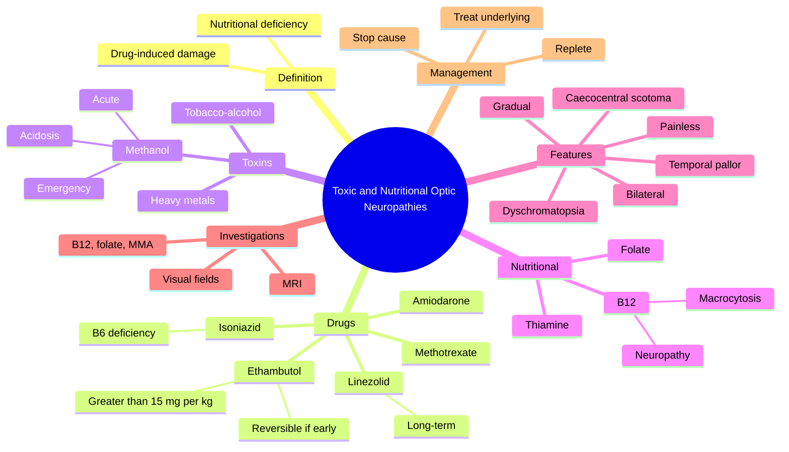

# Toxic and Nutritional Optic Neuropathies

Related: [[Optic Atrophy]], [[Ethambutol]], [[Methanol Poisoning]]

> [!tip] **FCPS/MRCP Priority: MEDIUM**
> Bilateral, painless, gradual ↓VA + central/caecocentral scotoma + dyschromatopsia. Methanol, ethambutol, B12 deficiency, tobacco-alcohol.

---

## Learning Objectives
- [ ] Define toxic and nutritional optic neuropathies
- [ ] List the common drugs and toxins (methanol, ethambutol, isoniazid, linezolid, amiodarone)
- [ ] Identify nutritional deficiencies (B12, folate, thiamine)
- [ ] Recognise the classic clinical triad: bilateral, painless, gradual ↓VA + caecocentral scotoma + dyschromatopsia
- [ ] Manage methanol poisoning (ethanol/fomepizole, dialysis, folinic acid)
- [ ] Counsel on ethambutol dose and monitoring

---

## 1. Definition

- **Toxic optic neuropathy:** Damage to the optic nerve caused by drugs, chemicals, or heavy metals
- **Nutritional optic neuropathy:** Damage due to deficiency of vitamins/essential nutrients (often in setting of alcoholism, malabsorption, vegan diet)
- They often coexist (e.g., tobacco-alcohol amblyopia) and produce an identical clinical picture

---

## 2. Causes

### Drugs
- **Ethambutol** (anti-TB) — dose-dependent, classic
- **Isoniazid** (often via B6 deficiency)
- **Linezolid** (long-term use)
- **Chloramphenicol** (rare)
- **Amiodarone** (corneal verticillata, optic neuropathy)
- **Vincristine**, **tamoxifen** (rare)
- **Sildenafil / tadalafil** (rare, non-arteritic AION)
- **Etoposide**, **methotrexate** (rare)

### Toxins
- **Methanol** (most acute and severe — medical emergency)
- Heavy metals: lead, arsenic, mercury, thallium
- Carbon disulfide (industrial)
- **Tobacco** (especially with alcohol and B12 deficiency)
- Ethylene glycol

### Nutritional
- **Vitamin B12 deficiency** (most common)
- Folate deficiency
- Thiamine (B1)
- Pyridoxine (B6)
- Copper
- Combined deficiencies (alcoholism, post-bariatric surgery, vegan)

---

## 3. Clinical Features

- **Bilateral, painless, gradual ↓VA** (symmetric or near-symmetric)
- **Caecocentral scotoma** (between fixation point and blind spot) — the hallmark visual field defect
- **Dyschromatopsia** (↓colour vision, often earliest sign)
- Temporal disc pallor (if chronic — papillomacular bundle damage)
- No RAPD if symmetric; present if asymmetric
- Pupillary light responses preserved in early disease
- May have associated peripheral neuropathy, dorsal column signs (B12)

### Pattern
- Selective damage to the **papillomacular bundle** → central/caecocentral scotoma, dyschromatopsia, temporal pallor

---

## 4. Specific Toxins / Deficiencies

### Methanol
- **Acute onset** (hours to days after ingestion)
- Severe bilateral ↓VA, can progress to no light perception (NLP)
- Associated with **metabolic acidosis** (high anion gap), headache, vomiting, confusion, seizures
- Fundus: optic disc swelling initially → atrophy
- **Treatment (emergency):**
  - **Ethanol** or **fomepizole** (blocks alcohol dehydrogenase)
  - **Haemodialysis**
  - **Folinic acid** (helps metabolise formate)
  - Supportive care; IV sodium bicarbonate
- Prognosis depends on time to treatment

### Ethambutol
- **Dose-dependent:** >15 mg/kg/day for >2 months = significant risk; risk much lower at 15 mg/kg/d
- Reversible if caught early and drug stopped; may be permanent
- Monitor visual acuity and colour vision monthly
- Stop the drug immediately on suspicion
- Risk factors: renal failure, older age, dose >15 mg/kg/d

### Isoniazid
- Optic neuropathy via pyridoxine (B6) depletion
- Prevent/treat with pyridoxine supplementation

### Linezolid
- Mitochondrial toxicity with long-term use (>28 days)
- Reversible if stopped early

### B12 Deficiency
- Bilateral, symmetric, insidious ↓VA
- Associated with: macrocytic anaemia, peripheral neuropathy, dorsal column signs (subacute combined degeneration), neuropsychiatric features
- Investigations: ↓serum B12, ↑methylmalonic acid (MMA), ↑homocysteine
- Treatment: IM hydroxocobalamin (B12) loading then maintenance

### Tobacco-Alcohol Amblyopia
- Combination of cyanide in tobacco, alcohol toxicity, and nutritional deficiency (B12, folate)
- Caecocentral scotoma
- Treat: stop smoking, B12, folate, multivitamin; abstinence from alcohol

---

## 5. Investigations

- **Bloods:** FBC (macrocytosis), B12, folate, MMA, homocysteine
- **LFT, electrolytes, glucose**
- **Drug history** (ethambutol, isoniazid, linezolid, amiodarone, tamoxifen)
- **MRI brain + orbits with contrast** (exclude compressive lesion, MS, infiltrative optic neuropathy)
- **Visual fields** (caecocentral scotoma)
- **OCT RNFL** (loss of papillomacular bundle)
- **VEP** (prolonged latency)
- **Angiotensin-converting enzyme, ANA, aquaporin-4 antibodies** (if considering inflammatory/autoimmune)

---

## 6. Management

- **Stop the offending drug / toxin** (most important)
- **Replete nutrition:** IM hydroxocobalamin, oral folate, multivitamin
- **Treat underlying cause** (alcoholism, malabsorption, malignancy)
- **Methanol:** emergency treatment as above
- **Visual rehabilitation** if permanent loss
- **Counselling and monitoring** if continuing essential drug (linezolid) at lower dose

### Prognosis
- Most improve if detected early and the cause is removed
- Some permanent damage if severe or prolonged exposure
- Methanol: poor prognosis if treatment delayed

---

## 7. FCPS/MRCP High-Yield Summary

| Cause | Onset | Notes |
|-------|-------|-------|
| **Methanol** | Acute | Severe, metabolic acidosis, emergency |
| **Ethambutol** | Subacute | Dose-dependent (>15 mg/kg/d), reversible if early |
| **Isoniazid** | Subacute | B6 deficiency — give pyridoxine |
| **Linezolid** | Subacute | >28 days use, mitochondrial |
| **B12 deficiency** | Chronic | Macrocytosis, neuropathy, dorsal column signs |
| **Tobacco-alcohol** | Chronic | Caecocentral scotoma, multivitamin treatment |

### Classic Triad
1. Bilateral, painless, progressive ↓VA
2. Caecocentral scotoma
3. Dyschromatopsia

---

## 8. Viva Questions

1. **Q:** What is the management of methanol optic neuropathy?
   **A:** Emergency — ethanol or fomepizole (competes for alcohol dehydrogenase), haemodialysis, IV folinic acid, supportive care, IV bicarbonate. Treat within hours to prevent permanent blindness.

2. **Q:** What is the dose of ethambutol that increases risk of optic neuropathy?
   **A:** >15 mg/kg/day for >2 months.

3. **Q:** What is the classic visual field defect in toxic/nutritional optic neuropathy?
   **A:** Caecocentral scotoma (between fixation and blind spot) — due to papillomacular bundle damage.

4. **Q:** What nutritional deficiencies cause optic neuropathy?
   **A:** B12 (most common), folate, thiamine (B1), B6, copper.

5. **Q:** What are the systemic features of B12 deficiency?
   **A:** Macrocytic anaemia, peripheral neuropathy, subacute combined degeneration of the cord (dorsal column + corticospinal), neuropsychiatric features.

---

## 9. Common Confusions / Exam Traps

| Confusion | Clarification |
|-----------|---------------|
| "Toxic optic neuropathy is painful" | It is **painless** (pain suggests inflammation, e.g., optic neuritis, AION) |
| "Bilateral optic neuritis" | Possible but uncommon; bilateral painless ↓VA + dyschromatopsia + scotoma = think toxic/nutritional |
| "Methotrexate is the anti-TB drug that causes optic neuropathy" | **Ethambutol** is the classic anti-TB drug causing optic neuropathy |
| "Ethambutol is always reversible" | Only if caught early; can be permanent |
| "Methanol is treated with steroids" | Methanol is treated with ethanol/fomepizole + dialysis + folinic acid |
| "Smoking alone causes optic neuropathy" | Tobacco-alcohol amblyopia requires combination of smoking + alcohol ± nutritional deficiency |

---

## 10. Mnemonics

1. **"MEET-E BAM"** — Methanol, Ethambutol, Ethylene glycol, Tobacco-alcohol, B12, Arsenic, Methotrexate (toxic/nutritional causes)
2. **"Caecocentral = Central + blind spot"** — between fixation and blind spot
3. **"B12 = Boring bilateral blindness"** — slow, bilateral, painless, insidious
4. **"Ethambutol: Eye check Every month"** — monthly VA + colour vision if on ethambutol

---

## 11. Mind Map

---

## 12. One-Page Revision Card

| **Topic** | **Toxic / Nutritional Optic Neuropathies** |
|-----------|---------------------------------------------|
| **Definition** | Damage to optic nerve from drugs, toxins, or nutritional deficiency |
| **Classic triad** | Bilateral, painless, gradual ↓VA + caecocentral scotoma + dyschromatopsia |
| **Common drugs** | Ethambutol, isoniazid, linezolid, amiodarone |
| **Common toxins** | Methanol (emergency), heavy metals, tobacco-alcohol |
| **Common deficiency** | B12 (also folate, B1, B6) |
| **Methanol Rx** | Ethanol/fomepizole + dialysis + folinic acid |
| **Ethambutol dose** | Risk >15 mg/kg/d for >2 months |
| **Viva Pearl** | Methanol = acute + acidosis; Ethambutol = dose + reversible if early |

---

## Spaced Repetition Trackers

### 24-Hour Recall Prompts
- [ ] Define toxic/nutritional optic neuropathy
- [ ] List 4 common drugs causing optic neuropathy
- [ ] State the classic triad
- [ ] Describe management of methanol poisoning
- [ ] Name the dose of ethambutol that increases risk

### Revision Schedule
- [ ] **Day 1** completed (creation + 24h recall)
- [ ] **Day 3** revision completed
- [ ] **Day 7** revision completed
- [ ] **Day 15** revision completed
- [ ] **Day 30** revision completed
- [ ] **Day 90** revision completed

---

## Must Know / Should Know / Nice to Know

### Must Know (Core for passing)
- [x] Classic triad (bilateral, painless, gradual + scotoma + dyschromatopsia)
- [x] Ethambutol dose (>15 mg/kg/d)
- [x] Methanol is an emergency; treatment
- [x] B12 deficiency systemic features
- [x] Caecocentral scotoma = papillomacular bundle

### Should Know (High probability)
- [x] Other drugs (isoniazid, linezolid, amiodarone)
- [x] Tobacco-alcohol amblyopia
- [x] Investigations: B12, folate, MMA, MRI
- [x] Reversibility depends on early detection

### Nice to Know (Differentiator)
- [ ] Heavy metal optic neuropathy
- [ ] Linezolid mitochondrial mechanism
- [ ] OCT RNFL pattern (papillomacular loss)

---

## My Weak Points
- [ ] Add personal weak areas here

---

## Self-Test Scorecard

| Section | Score /5 |
|---------|----------|
| Understanding: | /10 |
| Recall: | /10 |
| MCQ Performance: | /10 |
| SBA Performance: | /10 |
| Viva Confidence: | /10 |
| Total: | /50 |

> [!tip] **Interpretation:** <35 = weak topic, 35-44 = acceptable but insecure, 45+ = strong exam-ready topic.

---

## Exam Answer Modes

### Long Answer Skeleton
1. Definition (toxic/nutritional optic neuropathy)
2. Common causes — drugs (ethambutol, isoniazid, linezolid), toxins (methanol), deficiencies (B12)
3. Pathophysiology — papillomacular bundle damage
4. Clinical features — bilateral, painless, gradual ↓VA, caecocentral scotoma, dyschromatopsia
5. Investigations — B12, folate, MMA, drug history, MRI
6. Management — stop cause, replete nutrition, treat underlying

### Short Note Skeleton
- Definition + classic triad
- Common causes (ethambutol, methanol, B12)
- Caecocentral scotoma = papillomacular bundle

### Viva One-Liners
- **Q:** Classic triad? → **A:** Bilateral, painless, gradual ↓VA + caecocentral scotoma + dyschromatopsia
- **Q:** Methanol Rx? → **A:** Ethanol or fomepizole + haemodialysis + folinic acid
- **Q:** Ethambutol toxic dose? → **A:** >15 mg/kg/d for >2 months
- **Q:** B12 deficiency features? → **A:** Macrocytosis, neuropathy, dorsal column signs, neuropsychiatric

### Ward-Case Discussion Points
- Differentiate from optic neuritis (bilateral, painless, gradual = toxic/nutritional)
- Take detailed drug history (ethambutol, isoniazid, linezolid)
- Recognise methanol as an emergency (acidosis, treatment)
- Counsel on stopping drug and supplementing B12
- Arrange monitoring of visual function
- Screen for systemic B12 deficiency features

### Last-Night-Before-Exam Sheet
- Top 3 facts: bilateral + painless + caecocentral scotoma
- 1 mnemonic: "MEET-E BAM" for causes
- Must-know: methanol = ethanol/fomepizole + dialysis + folinic acid

---

## Summary

Toxic and nutritional optic neuropathies cause **bilateral, painless, gradual** visual loss with **caecocentral scotoma** and **dyschromatopsia** due to selective damage to the papillomacular bundle. Common drugs include ethambutol (>15 mg/kg/d), isoniazid, linezolid, and amiodarone. **Methanol** is the most acute and severe — an emergency treated with ethanol or fomepizole, haemodialysis, and folinic acid. **Vitamin B12** deficiency is the most common nutritional cause and is associated with macrocytic anaemia, peripheral neuropathy, and dorsal column signs. Management: stop the cause, replete nutrition, treat the underlying disease.

## MCQs (10)

1. **Question:** The classic visual field defect in toxic/nutritional optic neuropathy is:
   **Options:** A. Altitudinal B. Caecocentral scotoma C. Arcuate D. Bitemporal hemianopia E. Tunnel field
   **Answer:** B
   **Explanation:** Damage to the papillomacular bundle causes a caecocentral scotoma (between fixation and blind spot).

2. **Question:** Ethambutol optic neuropathy is significantly increased at doses:
   **Options:** A. >5 mg/kg/d B. >10 mg/kg/d C. >15 mg/kg/d D. >50 mg/kg/d E. Any dose
   **Answer:** C
   **Explanation:** Risk increases significantly above 15 mg/kg/day, especially with prolonged use.

3. **Question:** Methanol poisoning is treated with:
   **Options:** A. IV steroids B. Antibiotics C. Ethanol or fomepizole + dialysis + folinic acid D. Atropine E. Naloxone
   **Answer:** C
   **Explanation:** Ethanol/fomepizole blocks alcohol dehydrogenase, dialysis removes methanol/formate, folinic acid helps metabolise formate.

4. **Question:** The most common nutritional cause of optic neuropathy is:
   **Options:** A. Vitamin A deficiency B. Vitamin C deficiency C. Vitamin B12 deficiency D. Vitamin D deficiency E. Vitamin E deficiency
   **Answer:** C
   **Explanation:** B12 deficiency is the most common nutritional cause.

5. **Question:** Toxic/nutritional optic neuropathy is characteristically:
   **Options:** A. Unilateral and painful B. Bilateral and painful C. Bilateral, painless, gradual D. Sudden onset E. Associated with RAPD
   **Answer:** C
   **Explanation:** The classic triad is bilateral, painless, gradual visual loss.

6. **Question:** Isoniazid optic neuropathy is mediated by:
   **Options:** A. Direct toxicity B. Pyridoxine (B6) depletion C. Folate deficiency D. Mitochondrial damage E. None
   **Answer:** B
   **Explanation:** Isoniazid causes B6 deficiency — co-prescribe pyridoxine.

7. **Question:** Tobacco-alcohol amblyopia is treated with:
   **Options:** A. Steroids B. Stop smoking + B12 + folate + multivitamin C. Antibiotics D. Surgery E. None
   **Answer:** B
   **Explanation:** Smoking cessation + nutritional supplementation.

8. **Question:** A patient on ethambutol for TB develops ↓VA and dyschromatopsia. What is the next step?
   **Options:** A. Continue drug B. Stop ethambutol immediately C. Increase dose D. Add steroids E. Refer for surgery
   **Answer:** B
   **Explanation:** Stop ethambutol immediately on suspicion — may be reversible if caught early.

9. **Question:** Subacute combined degeneration of the cord is a feature of:
   **Options:** A. B1 deficiency B. B6 deficiency C. B12 deficiency D. Folate deficiency E. None
   **Answer:** C
   **Explanation:** B12 deficiency causes subacute combined degeneration (dorsal columns + lateral corticospinal tracts).

10. **Question:** The earliest sign of toxic optic neuropathy is often:
    **Options:** A. ↓VA B. Dyschromatopsia (↓colour vision) C. Disc swelling D. RAPD E. Pain
    **Answer:** B
    **Explanation:** Colour vision loss (dyschromatopsia) is often the earliest sign.

## SBA Questions (10)

1. **Scenario:** A 40-year-old alcoholic presents with bilateral, painless, progressive ↓VA over 6 months. He has macrocytic anaemia and peripheral neuropathy.
   **Question:** Most likely diagnosis?
   **Options:** A. Optic neuritis B. B12 deficiency optic neuropathy C. CRAO D. AION E. None
   **Answer:** B
   **Explanation:** Bilateral, painless, gradual + macrocytosis + neuropathy = B12 deficiency optic neuropathy.

2. **Scenario:** A patient is brought to A&E having ingested methanol. He has severe ↓VA in both eyes, metabolic acidosis, and is drowsy.
   **Question:** Most appropriate immediate treatment?
   **Options:** A. IV methylprednisolone B. Ethanol or fomepizole + haemodialysis + folinic acid C. IV acetazolamide D. Observation E. Topical steroid
   **Answer:** B
   **Explanation:** Methanol poisoning emergency — ethanol/fomepizole + dialysis + folinic acid.

3. **Scenario:** A 35-year-old on anti-TB treatment (HRZE) for 3 months develops ↓VA and colour vision loss. He takes 1200 mg ethambutol daily (weight 60 kg).
   **Question:** What is the most likely cause?
   **Options:** A. Isoniazid optic neuropathy B. Ethambutol optic neuropathy (dose 20 mg/kg/d) C. Pyridoxine deficiency D. Vitreous haemorrhage E. None
   **Answer:** B
   **Explanation:** Dose = 1200/60 = 20 mg/kg/d — exceeds 15 mg/kg/d — ethambutol optic neuropathy.

4. **Scenario:** A patient with B12 deficiency optic neuropathy has macrocytic anaemia and dorsal column signs. What is the appropriate treatment?
   **Options:** A. Oral B12 only B. IM hydroxocobalamin loading then maintenance C. Folate only D. Steroids E. None
   **Answer:** B
   **Explanation:** IM hydroxocobalamin is the standard treatment for B12 deficiency.

5. **Scenario:** A 60-year-old on long-term linezolid (>6 months) for MRSA develops ↓VA and dyschromatopsia. Visual fields show a caecocentral scotoma.
   **Question:** Most appropriate management?
   **Options:** A. Continue linezolid B. Stop linezolid if possible C. Add pyridoxine D. Laser E. Vitrectomy
   **Answer:** B
   **Explanation:** Linezolid causes mitochondrial optic neuropathy — stop the drug if possible.

6. **Scenario:** A patient on ethambutol develops dyschromatopsia. What is the most important monitoring test?
   **Options:** A. IOP B. Visual acuity + colour vision (Ishihara) C. MRI D. Blood glucose E. None
   **Answer:** B
   **Explanation:** Monthly monitoring of VA and colour vision (Ishihara) is essential.

7. **Scenario:** A patient with toxic optic neuropathy from methanol presents 24 hours after ingestion. He has no light perception in both eyes.
   **Question:** What is the most likely visual outcome?
   **Options:** A. Full recovery B. Partial recovery with treatment C. Permanent blindness likely D. Mild blurring only E. None
   **Answer:** C
   **Explanation:** Delayed treatment (>24 h) often results in permanent blindness due to optic nerve damage.

8. **Scenario:** A patient with chronic alcoholism has bilateral painless ↓VA, caecocentral scotoma, and macrocytic anaemia.
   **Question:** What is the most likely nutritional deficiency?
   **Options:** A. B1 (thiamine) B. B12 C. Folate D. Vitamin A E. None
   **Answer:** B
   **Explanation:** B12 deficiency — macrocytic anaemia, neuropathy, optic neuropathy.

9. **Scenario:** A 50-year-old is found to have bilateral, painless, gradual ↓VA with caecocentral scotoma. He is on amiodarone for arrhythmia. What is the most appropriate action?
   **Options:** A. Stop amiodarone immediately B. Stop amiodarone if possible and switch to alternative C. Continue amiodarone C. Laser D. Vitrectomy
   **Answer:** B
   **Explanation:** Amiodarone can cause optic neuropathy — discuss with cardiology to switch if possible.

10. **Scenario:** A patient on ethambutol has been on 15 mg/kg/d for 4 months. He has no visual symptoms. What is the most appropriate action?
    **Options:** A. Stop drug B. Continue with monthly visual monitoring (VA + colour vision) C. Increase dose D. Add steroids E. Surgery
    **Answer:** B
    **Explanation:** Continue with monthly monitoring of VA and colour vision.

## Flashcards

- **Q:** What is the classic triad of toxic/nutritional optic neuropathy?
  **A:** Bilateral, painless, gradual ↓VA + caecocentral scotoma + dyschromatopsia.
- **Q:** Most common anti-TB drug causing optic neuropathy and the toxic dose?
  **A:** Ethambutol at >15 mg/kg/d for >2 months.
- **Q:** Emergency treatment of methanol poisoning?
  **A:** Ethanol or fomepizole (blocks alcohol dehydrogenase) + haemodialysis + folinic acid.
- **Q:** Most common nutritional cause of optic neuropathy?
  **A:** Vitamin B12 deficiency.
- **Q:** What does isoniazid optic neuropathy cause via?
  **A:** Pyridoxine (B6) depletion — co-prescribe pyridoxine.

## Answer Key with Explanations

### MCQs
1. B — Caecocentral scotoma = papillomacular bundle damage
2. C — >15 mg/kg/d
3. C — Ethanol/fomepizole + dialysis + folinic acid
4. C — B12 is most common
5. C — Bilateral, painless, gradual
6. B — Isoniazid → B6 depletion
7. B — Smoking cessation + B12 + folate
8. B — Stop ethambutol immediately
9. C — B12 = subacute combined degeneration
10. B — Dyschromatopsia is the earliest sign

### SBAs
1. B — B12 deficiency optic neuropathy
2. B — Methanol emergency treatment
3. B — Dose >15 mg/kg/d = ethambutol toxicity
4. B — IM hydroxocobalamin
5. B — Stop linezolid
6. B — VA + colour vision monitoring
7. C — Delayed methanol = permanent blindness
8. B — B12 deficiency
9. B — Stop amiodarone if possible
10. B — Continue with monthly monitoring

## Tags
#medicine #davidson #ophthalmology #toxic-optic #fcps #mrcp
