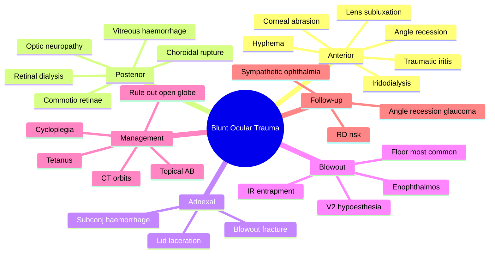

# Blunt Ocular Trauma

Related: [[Hyphema]], [[Traumatic Cataract]], [[Orbital Blowout Fracture]]

> [!tip] **FCPS/MRCP Priority: HIGH**
> Comprehensive exam: hyphema, iridodialysis, lens sublux, RD, commotio retinae, blowout fracture, angle recession. CT if orbital fracture.

---

## Learning Objectives
- [ ] Define blunt ocular trauma (closed globe injury)
- [ ] List anterior and posterior segment injuries from blunt trauma
- [ ] Recognise orbital blowout fracture signs and management
- [ ] Describe comprehensive examination approach
- [ ] Identify complications (angle recession glaucoma, RD, sympathetic ophthalmia)
- [ ] Apply appropriate management and follow-up

---

## 1. Definition

- **Blunt ocular trauma:** Closed globe injury from impact (ball, fist, fall)
- No full-thickness wall break (vs penetrating)

### Mechanism
- Antero-posterior compression with equatorial expansion
- Coup and contrecoup injury
- Sudden rise in IOP transmitted to all structures

---

## 2. Ocular Injuries

### Anterior Segment
- **Corneal abrasion** (epithelial defect, painful)
- **Hyphema** (blood in AC)
- **Iridodialysis** (iris root separation from ciliary body)
- **Traumatic iritis**
- **Traumatic mydriasis** (sphincter tears)
- **Angle recession** (↑ glaucoma risk)
- **Lens:** Subluxation, dislocation, traumatic cataract
- **Vossius ring** (iris pigment on lens)

### Posterior Segment
- **Commotio retinae** (Berlin oedema — retinal whitening, like cotton wool)
- **Retinal dialysis / break** → RD
- **Choroidal rupture** (concentric to disc, breaks in Bruch's)
- **Vitreous haemorrhage**
- **Optic neuropathy** (avulsion, contusion)

### Adnexal
- **Orbital blowout fracture** (medial wall, floor — see below)
- Lid laceration, ecchymosis
- Subconjunctival haemorrhage
- **Traumatic optic neuropathy** (indirect)

---

## 3. Blowout Fracture

- **Mechanism:** Sudden ↑ intraorbital pressure → fracture of weakest wall
- **Floor (most common):** Infraorbital nerve (V2) — cheek hypoesthesia
- **Medial wall:** Medial rectus entrapment
- **Signs:** Enophthalmos (sunken eye), infraorbital anaesthesia, restricted upgaze/diplopia (IR entrapment), crepitus, epistaxis
- **CT orbits** (coronal)
- **Management:** Oral decongestants, avoid nose-blowing, antibiotics; surgical repair if persistent diplopia, enophthalmos >2 mm, large fracture (>50% floor)

| Sign | Cause |
|------|-------|
| Enophthalmos | Orbital tissue herniation |
| Cheek hypoesthesia | Infraorbital (V2) injury |
| Restricted upgaze | Inferior rectus entrapment |
| Crepitus | Sinus air entry |
| Epistaxis | Maxillary sinus involvement |

---

## 4. Management

- Full exam (rule out open globe — if so, shield, transfer)
- **CT orbits** if orbital fracture suspected
- Tetanus prophylaxis
- **Topical antibiotic** (abrasion)
- **Cycloplegia** (iridocyclitis)
- **IOP control** (angle recession, hyphema)
- **Surgical repair** (laceration, RD, blowout, hyphema with pressure)
- **Follow-up** (angle recession → glaucoma risk; RD risk; sympathetic ophthalmia prevention)

---

## 5. Red Flags / Emergencies

- Suspected open globe — shield, no pressure, transfer
- Hyphema with raised IOP
- Sudden ↓VA — commotio, RD, optic neuropathy
- Diplopia with restricted EOM — blowout with entrapment
- Suspected IOFB — high-velocity mechanism
- RAPD (relative afferent pupillary defect) — optic nerve injury

---

## 6. FCPS/MRCP Summary

| Injury | Significance |
|--------|--------------|
| Hyphema | IOP, rebleed risk, corneal staining |
| Commotio retinae | Macular involvement → permanent ↓VA |
| Choroidal rupture | CNV risk |
| Angle recession | Glaucoma (years later) |
| Blowout fracture | Diplopia, enophthalmos, V2 hypoesthesia |

---

## 7. Viva Questions

1. **Q:** What is the most feared complication of hyphema?
   **A:** Rebleed (3–5 days, larger), corneal blood staining, glaucoma.

2. **Q:** What is commotio retinae (Berlin oedema)?
   **A:** Retinal whitening from concussion; macular involvement → permanent visual loss.

3. **Q:** What is angle recession?
   **A:** Tear between longitudinal and circular ciliary muscle fibres — predisposes to glaucoma years later.

4. **Q:** What is the most common wall fractured in blowout?
   **A:** Orbital floor (maxillary bone) — weakest wall.

---

## 8. Common Confusions / Exam Traps

| Confusion | Clarification |
|-----------|---------------|
| "Blowout = roof fracture" | **Floor is most common** (weakest wall) |
| "RAPD is normal" | **Always abnormal** — indicates optic nerve or severe retinal disease |
| "Commotio retinae always resolves" | **Macular involvement can cause permanent vision loss** |
| "Blowout always needs surgery" | **Most are managed conservatively** — surgery for persistent diplopia/enophthalmos/large fracture |
| "Angle recession is immediate" | **Glaucoma occurs years later** — long-term follow-up needed |
| "Vossius ring is on the cornea" | **On the anterior lens** — iris pigment imprint |

---

## 9. Mnemonics

1. **"Blunt trauma BNA"** — Blowout, Nerve damage, All structures at risk
2. **"Floor falls, Medial makes"** — Floor fracture (most common), Medial wall (MR entrapment)
3. **"RAPD = R for Retina/Optic N"** — Relative Afferent Pupillary Defect indicates severe damage
4. **"Berlin = Bruch's"** — Commotio retinae (Berlin oedema) at the level of outer retina/RPE/Bruch's

---

## 10. Mind Map

---

## 11. One-Page Revision Card

| **Topic** | **Blunt Ocular Trauma** |
|-----------|-------------------------|
| **Type** | Closed globe, no full-thickness break |
| **Anterior** | Hyphema, iridodialysis, angle recession, lens |
| **Posterior** | Commotio, RD, choroidal rupture |
| **Blowout** | Floor (V2 hypoesthesia, IR entrapment) |
| **Imaging** | CT orbits (coronal) if fracture suspected |
| **Follow-up** | Angle recession glaucoma (years), RD |
| **Viva Pearl** | Comprehensive exam — don't miss posterior segment |

---

## Spaced Repetition Trackers

### 24-Hour Recall Prompts
- [ ] Define blunt ocular trauma and describe mechanism
- [ ] List anterior segment injuries
- [ ] List posterior segment injuries
- [ ] Describe blowout fracture signs and management
- [ ] State 2 long-term complications

### Revision Schedule
- [ ] **Day 1** completed (creation + 24h recall)
- [ ] **Day 3** revision completed
- [ ] **Day 7** revision completed
- [ ] **Day 15** revision completed
- [ ] **Day 30** revision completed
- [ ] **Day 90** revision completed

---

## Must Know / Should Know / Nice to Know

### Must Know (Core for passing)
- [x] Comprehensive exam (anterior + posterior + adnexal)
- [x] Hyphema — rebleed, IOP, blood staining
- [x] Blowout fracture — floor most common, V2 hypoesthesia
- [x] Angle recession — glaucoma risk (years later)
- [x] Commotio retinae — macular involvement = permanent ↓VA

### Should Know (High probability)
- [x] Iridodialysis, traumatic mydriasis, Vossius ring
- [x] Choroidal rupture (concentric to disc) — CNV risk
- [x] CT orbits for suspected fracture
- [x] Indications for blowout surgery

### Nice to Know (Differentiator)
- [ ] RAPD significance in trauma
- [ ] Sympathetic ophthalmia prevention
- [ ] Traumatic optic neuropathy (indirect)
- [ ] Vitreous haemorrhage management

---

## My Weak Points
- [ ] Add personal weak areas here

---

## Self-Test Scorecard

| Section | Score /5 |
|---------|----------|
| Understanding: | /10 |
| Recall: | /10 |
| MCQ Performance: | /10 |
| SBA Performance: | /10 |
| Viva Confidence: | /10 |
| Total: | /50 |

> [!tip] **Interpretation:** <35 = weak topic, 35-44 = acceptable but insecure, 45+ = strong exam-ready topic.

---

## Exam Answer Modes

### Long Answer Skeleton
1. Definition (closed globe injury from blunt impact)
2. Mechanism (AP compression, equatorial expansion)
3. Anterior segment injuries (abrasion, hyphema, iridodialysis, angle recession, lens)
4. Posterior segment injuries (commotio, RD, choroidal rupture, VH, optic neuropathy)
5. Adnexal (blowout, lid laceration)
6. Blowout fracture (floor most common, signs, CT, management)
7. Management (rule out open globe, CT, topical AB, cycloplegia, IOP control)
8. Follow-up (angle recession glaucoma, RD, sympathetic ophthalmia)

### Short Note Skeleton
- Definition + mechanism
- Anterior and posterior segment injuries
- Blowout fracture (signs, management)
- Long-term complications

### Viva One-Liners
- **Q:** Most common site of blowout fracture? → **A:** Orbital floor
- **Q:** What is commotio retinae? → **A:** Retinal whitening from concussion; macular involvement = permanent visual loss
- **Q:** What is angle recession? → **A:** Tear between ciliary muscle fibres; glaucoma risk years later
- **Q:** Most feared complication of hyphema? → **A:** Rebleed (3–5 days)
- **Q:** Choroidal rupture pattern? → **A:** Concentric to disc (breaks in Bruch's membrane)

### Ward-Case Discussion Points
- Comprehensive exam — don't miss posterior segment
- Always rule out open globe (teardrop pupil, sentinel haemorrhage)
- CT orbits if fracture suspected
- Long-term follow-up for angle recession (glaucoma) and RD
- Discuss sympathetic ophthalmia risk
- Tetanus prophylaxis

### Last-Night-Before-Exam Sheet
- **Top 3 facts:** Comprehensive exam; Blowout = floor; Angle recession → glaucoma
- **1 mnemonic:** "Floor falls, Medial makes" (most common wall)
- **Must-know differential:** Penetrating vs blunt trauma
- **Long-term:** Angle recession glaucoma, RD risk
- **Imaging:** CT orbits for fracture

---

## Summary

Blunt trauma can injure any ocular structure — comprehensive exam is essential. Hyphema, commotio retinae, angle recession (glaucoma later), blowout fracture. CT for fractures.

---

## MCQs (10)

1. **Question:** Most common site of blowout fracture:
   **Options:** A. Roof B. Lateral wall C. Floor D. Medial wall E. None
   **Answer:** C
   **Explanation:** Floor is most common.

2. **Question:** What is angle recession?
   **Options:** A. Iris damage B. Tear between longitudinal and circular ciliary muscle fibres C. Lens dislocation D. None E. All
   **Answer:** B
   **Explanation:** Angle recession = tear between ciliary muscle layers.

3. **Question:** Commotio retinae (Berlin oedema) is best described as:
   **Options:** A. Retinal detachment B. Retinal whitening from concussion C. Choroidal break D. Vitreous bleed E. Macular hole
   **Answer:** B
   **Explanation:** Berlin oedema = retinal whitening, like a 'cloud' at the posterior pole.

4. **Question:** Cheek hypoesthesia after orbital trauma indicates injury to:
   **Options:** A. V1 (ophthalmic) B. V2 (maxillary/infraorbital) C. V3 (mandibular) D. Facial nerve E. None
   **Answer:** B
   **Explanation:** Infraorbital nerve (V2) — injured in orbital floor fracture.

5. **Question:** A patient with blunt trauma has a teardrop pupil pointing to the wound. This indicates:
   **Options:** A. Angle recession B. Iridodialysis C. Open globe (rupture) D. Commotio retinae E. Lens subluxation
   **Answer:** C
   **Explanation:** Teardrop pupil = sign of open globe/rupture — iris pulled toward wound.

6. **Question:** Choroidal rupture typically occurs:
   **Options:** A. Radially from disc B. Concentric to the optic disc C. At the ora serrata D. Randomly E. In the macula only
   **Answer:** B
   **Explanation:** Concentric to disc — relates to globe expansion mechanics.

7. **Question:** A patient with blunt trauma is found to have angle recession. The patient should be counselled about:
   **Options:** A. Immediate glaucoma B. Future glaucoma risk (years later) C. Cataract D. Retinal detachment E. Uveitis
   **Answer:** B
   **Explanation:** Angle recession → glaucoma risk years later — needs long-term follow-up.

8. **Question:** The most common posterior segment finding in blunt trauma is:
   **Options:** A. RD B. Commotio retinae C. Choroidal rupture D. Vitreous haemorrhage E. Macular hole
   **Answer:** B
   **Explanation:** Commotio retinae is common; macular involvement causes permanent ↓VA.

9. **Question:** Indications for surgical repair of blowout fracture include all EXCEPT:
   **Options:** A. Persistent diplopia B. Enophthalmos >2 mm C. Large fracture (>50% floor) D. Mild periorbital ecchymosis E. Muscle entrapment
   **Answer:** D
   **Explanation:** Ecchymosis alone is not an indication for surgery.

10. **Question:** Vossius ring is:
    **Options:** A. Pigment on the cornea B. Iris pigment imprint on anterior lens C. Retinal ring lesion D. Choroidal tear E. Scleral rupture sign
    **Answer:** B
    **Explanation:** Vossius ring = iris pigment imprint on anterior lens capsule from blunt trauma.

---

## SBA Questions (10)

1. **Scenario:** A 30-year-old presents after being hit in the eye with a cricket ball. He has restricted upgaze, infraorbital numbness, and crepitus on palpation.
   **Question:** Most likely diagnosis?
   **Options:** A. Retrobulbar haemorrhage B. Orbital floor blowout fracture C. Zygomatic fracture D. Globe rupture E. Lens dislocation
   **Answer:** B
   **Explanation:** Restricted upgaze (IR entrapment) + V2 hypoesthesia + crepitus = blowout floor fracture.

2. **Scenario:** A patient with blunt trauma 5 days ago presents with sudden pain, decreased vision, and a layered hyphema. He had a small hyphema initially.
   **Question:** Most likely complication?
   **Options:** A. Initial bleed B. Rebleed C. Infection D. Glaucoma only E. Cataract
   **Answer:** B
   **Explanation:** Rebleed typically occurs 3–5 days after initial injury — larger and more severe.

3. **Scenario:** A patient with blunt trauma has commotio retinae involving the macula.
   **Question:** Most appropriate counselling about visual prognosis?
   **Options:** A. Complete recovery expected B. Permanent central vision loss possible C. Immediate RD inevitable D. Always improves in 1 week E. None
   **Answer:** B
   **Explanation:** Macular commotio can cause permanent ↓VA due to photoreceptor damage.

4. **Scenario:** A patient with blowout fracture is found to have a 60% orbital floor fracture but no diplopia and no enophthalmos.
   **Question:** Most appropriate management?
   **Options:** A. Immediate surgery B. Conservative management C. Enucleation D. Vitrectomy E. Patch and discharge
   **Answer:** B
   **Explanation:** No diplopia/enophthalmos → conservative (decongestants, avoid blowing nose, AB).

5. **Scenario:** A patient with blunt trauma has a teardrop pupil and 360° subconjunctival haemorrhage. IOP is low.
   **Question:** Most important first step?
   **Options:** A. CT orbits B. Topical steroid C. MRI D. Rigid shield, NPO, IV AB, transfer E. US B-scan
   **Answer:** D
   **Explanation:** Open globe suspected — shield (no pressure), NPO, IV AB, urgent transfer.

6. **Scenario:** A patient with blunt trauma 10 years ago presents with raised IOP in the same eye. Slit-lamp shows a tear between ciliary muscle layers.
   **Question:** Most likely cause of glaucoma?
   **Options:** A. Primary open-angle glaucoma B. Angle recession glaucoma C. Steroid response D. Neovascular E. Acute angle closure
   **Answer:** B
   **Explanation:** Angle recession glaucoma — late complication of blunt trauma.

7. **Scenario:** A child has a hyphema from a cricket ball. He is sickle cell positive.
   **Question:** What is the IOP threshold for surgical intervention in this patient?
   **Options:** A. >50 mmHg >5 days B. >35 mmHg >7 days C. >30 mmHg >24h D. >40 mmHg E. Same as non-sickle
   **Answer:** C
   **Explanation:** Sickle cell patients have lower threshold for surgery — IOP >30 for >24h.

8. **Scenario:** A patient has an orbital floor blowout with white-eyed (no periocular signs) presentation and restricted upgaze in a child.
   **Question:** Most likely diagnosis?
   **Options:** A. Open globe B. White-eyed blowout fracture C. Retrobulbar haemorrhage D. Optic neuritis E. Third nerve palsy
   **Answer:** B
   **Explanation:** White-eyed blowout = trapdoor fracture in children; IR entrapment with minimal signs — needs urgent surgery.

9. **Scenario:** A patient with blunt trauma has commotio retinae. OCT shows disruption of outer retinal layers at the fovea.
   **Question:** What is the most likely long-term visual outcome?
   **Options:** A. Normal vision B. Permanent central vision loss C. Tunnel vision D. Sector defect E. Diplopia
   **Answer:** B
   **Explanation:** Outer retinal disruption at fovea = permanent photoreceptor loss → central scotoma.

10. **Scenario:** A patient with blunt trauma 2 weeks ago has decreased colour vision, RAPD, and normal disc appearance.
    **Question:** Most likely diagnosis?
    **Options:** A. Optic neuritis B. Traumatic optic neuropathy C. Retinal detachment D. Macular oedema E. Anterior ischaemic optic neuropathy
    **Answer:** B
    **Explanation:** Traumatic optic neuropathy — RAPD + ↓colour vision after trauma.

---

## Flashcards

- **Q:** What is commotio retinae (Berlin oedema)?
  **A:** Retinal whitening at the posterior pole from blunt trauma; macular involvement → permanent ↓VA.
- **Q:** What is the most common site of blowout fracture?
  **A:** Orbital floor — V2 hypoesthesia, IR entrapment, enophthalmos, crepitus.
- **Q:** What is angle recession?
  **A:** Tear between longitudinal and circular ciliary muscle fibres — glaucoma risk years later.
- **Q:** What is the teardrop pupil sign?
  **A:** Peaked pupil pointing to the wound — sign of open globe/rupture.
- **Q:** What is Vossius ring?
  **A:** Iris pigment imprint on the anterior lens capsule from blunt trauma.

---

## Answer Key with Explanations

### MCQs
1. C — Orbital floor is the weakest wall
2. B — Angle recession = ciliary muscle tear
3. B — Berlin oedema = retinal whitening
4. B — V2 (infraorbital) injury in floor fracture
5. C — Teardrop pupil = open globe
6. B — Choroidal rupture is concentric to disc
7. B — Glaucoma occurs years later
8. B — Commotio retinae is common
9. D — Ecchymosis alone is not surgical indication
10. B — Vossius ring = iris pigment on lens

### SBAs
1. B — Floor fracture with V2 + IR entrapment
2. B — Rebleed at 3–5 days is classic
3. B — Macular commotio can cause permanent loss
4. B — No symptoms → conservative management
5. D — Open globe → shield, NPO, IV AB
6. B — Angle recession glaucoma (late)
7. C — Sickle cell = lower IOP threshold
8. B — White-eyed blowout in children
9. B — Outer retinal disruption → permanent loss
10. B — Traumatic optic neuropathy (RAPD + ↓colour)

---

## Tags
#medicine #davidson #ophthalmology #blunt #trauma #fcps #mrcp
