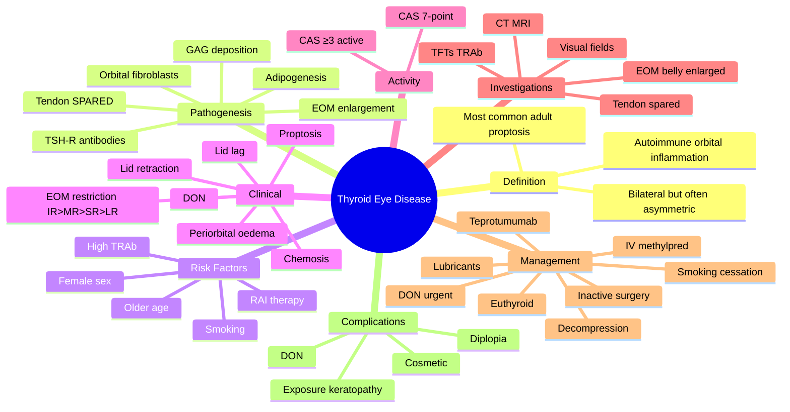

# Thyroid Eye Disease (Graves' Ophthalmopathy)

Related: [[Graves Disease]], [[Proptosis (Approach)]], [[Orbital Cellulitis]]

> [!tip] **FCPS/MRCP Priority: CRITICAL**
> Bilateral proptosis, lid retraction, lid lag, EOM restriction (IR > MR > SR), chemosis. Active = steroids, smoking cessation. Sight-threatening (DON) = urgent IV steroids + decompression.

---

## Learning Objectives
- [ ] Define thyroid eye disease (TED) and its association with Graves' disease
- [ ] Describe the autoimmune pathogenesis (TSH-R antibodies, fibroblasts, GAG deposition)
- [ ] Recognise clinical features: lid retraction, lid lag, proptosis, EOM restriction, chemosis
- [ ] Apply the Clinical Activity Score (CAS) to assess disease activity
- [ ] Distinguish active (inflammatory) from inactive (fibrotic) disease
- [ ] List modifiable risk factors (smoking) and general measures
- [ ] Outline treatment: active disease (IV methylpred, teprotumumab), DON (urgent IV + decompression), inactive (rehabilitative surgery)
- [ ] Identify dysthyroid optic neuropathy (DON) — a sight-threatening emergency

---

## 1. Definition / Epidemiology / Classification

### Definition
- **Thyroid eye disease (TED) / Graves' ophthalmopathy (GO):** Autoimmune inflammation of orbital soft tissues and extraocular muscles, strongly associated with autoimmune thyroid disease
- Also called **thyroid-associated orbitopathy (TAO)**
- A component of **Graves' disease** in 25–50% of patients; can occur in Hashimoto's or in euthyroid patients
- **Most common cause of unilateral AND bilateral proptosis in adults**

### Epidemiology
- Female > male (4:1), peak age 30–50 years
- 25–50% of patients with Graves' disease develop TED
- Bilateral in 70–80%, but can be asymmetric
- Smoking is the most important modifiable risk factor (5–10× risk, more severe disease)
- Radioactive iodine (RAI) ablation can worsen or precipitate TED — give steroid prophylaxis in at-risk patients

### Classification
- **By activity:** Active (inflammatory) vs Inactive (fibrotic / burnt-out)
- **By severity:** Mild, Moderate-to-severe, Sight-threatening (DON)
- **By thyroid status:** Hyperthyroid (most), Euthyroid, Hypothyroid (post-treatment or Hashimoto's)
- **NOSPECS** (older): No signs, Only signs, Soft tissue, Proptosis, EOM, Corneal, Sight loss

---

## 2. Aetiology / Pathophysiology

### Pathogenesis
- **TSH receptor antibodies (TRAb)** cross-react with **TSH receptors on orbital fibroblasts**
- Activated fibroblasts:
  - Secrete **glycosaminoglycans (GAGs)** — hydrophilic → tissue oedema
  - Differentiate into **adipocytes** (adipogenesis) → ↑ orbital fat
  - Recruit T-lymphocytes → cytokine release (IFN-γ, TNF-α, IL-1)
- Result: **enlargement of EOMs and orbital fat** → proptosis, EOM restriction, optic nerve compression
- Histology: **lymphocytic infiltrate, GAG deposition, fibrotic EOMs** (tendons SPARED — distinguishes from myositis)

### Risk Factors
- **Smoking** (most important modifiable) — 5–10× risk, more severe disease
- Female sex
- Older age at onset of Graves'
- **Radioactive iodine therapy** (can worsen TED — give steroid prophylaxis in smokers / severe disease)
- High TRAb titre
- Uncontrolled dysthyroidism
- Selenium deficiency (mild disease)

---

## 3. Clinical Features

### Symptoms
- **Proptosis** (often bilateral, axial, may be asymmetric)
- **Lid retraction** (staring appearance)
- Grittiness, redness, tearing, photophobia
- **Diplopia** (EOM restriction — most commonly restricted elevation, then abduction)
- **↓ Visual acuity, ↓ colour vision, field defect** (DON — emergency)
- Periorbital oedema, puffiness
- Pain is uncommon (consider optic neuropathy or active inflammation if present)
- Anxiety about appearance

### Signs
- **Lid retraction (Dalrymple sign)** — upper lid above superior limbus in primary gaze (most common sign)
- **Lid lag (von Graefe sign)** — upper lid lags on downgaze
- **Proptosis** — axial, bilateral, often asymmetric (Hertel exophthalmometry >21 mm or >2 mm asymmetry)
- **EOM restriction** — order: **IR > MR > SR > LR** (mnemonic **"I'M S**L**ow"**)
  - IR restriction → diplopia on upgaze
  - MR restriction → esotropia
  - In DON: SR and MR enlargement compress optic nerve at orbital apex
- **Chemosis, conjunctival injection**
- **Periorbital oedema**
- **Corneal exposure** (lagophthalmos, ↓ Bell's phenomenon)
- **Optic neuropathy (DON):** ↓VA, ↓colour vision, RAPD, field defect
- **Pretibial myxoedema, thyroid acropachy** (extra-orbital Graves' features)
- **Goitre, tremor, tachycardia** (signs of dysthyroidism)

### Clinical Activity Score (CAS, 7-point — for each feature present, 1 point)
1. Spontaneous pain
2. Pain on eye movement
3. Redness of eyelids
4. Redness of conjunctiva
5. Chemosis
6. Swollen caruncle / plica
7. ↑ Proptosis ≥2 mm in 1–3 months

- **CAS ≥ 3/7 = ACTIVE disease** (inflammatory, likely to respond to immunosuppression)
- **CAS < 3/7 = INACTIVE** (fibrotic, surgery phase)

---

## 4. Stages — Rundle's Curve

- **Active (inflammatory) phase:** 6–18 months, with rising proptosis (Rundle's curve initial rise)
- **Plateau phase**
- **Inactive (fibrotic, burnt-out) phase:** Rundle's curve plateau — EOMs fibrotic, restrictive strabismus stable

---

## 5. Investigations

### Essential
- **Thyroid function tests (TFTs):** most have Graves' (↓TSH, ↑fT4/fT3); can be euthyroid/hypothyroid
- **TSH receptor antibodies (TRAb):** positive in 95% of TED with Graves'
- **Anti-TPO, anti-thyroglobulin** antibodies
- **Visual acuity, RAPD, colour vision, visual fields** (DON screening)
- **Hertel exophthalmometry** (proptosis quantification)
- **CT or MRI orbits:** EOM belly enlargement with **tendon sparing** ("tendon-sparing myopathy"), ↑ orbital fat, proptosis, apical crowding
- **OCT RNFL, VEP** — for DON

### Optional
- **Serum GAG, urinary GAG** — research only
- **Lid measurements** (MRD1, MRD2, levator function)
- **Orthoptic assessment** (strabismus, diplopia fields)
- **Corneal assessment** (exposure keratopathy)

---

## 6. Management

### General (All Patients)
- **Smoking cessation** — most important modifiable risk factor
- **Achieve and maintain euthyroid state**
- **Lubricants** (artificial tears — preservative-free) — for exposure
- **Sunglasses** (photophobia)
- **Head elevation at night** (reduces periorbital oedema)
- **Selenium supplementation** (mild disease — EUGOGO recommendation)
- **Taping at night** / moisture chamber (severe exposure)
- **Prisms for diplopia** (temporary measure)
- **Avoid RAI** in active moderate-severe disease — use antithyroid drugs or surgery; if RAI essential → give **steroid prophylaxis** (prednisolone 0.2 mg/kg for 6 weeks)

### Mild Disease
- Observation + general measures (above)
- ± Selenium
- ± Lubricants

### Active Moderate-to-Severe Disease (CAS ≥ 3)
- **First-line: IV methylprednisolone** (cumulative 4.5 g over 6 weeks):
  - 0.5 g weekly × 6 weeks, then 0.25 g weekly × 6 weeks (EU GOGO regimen)
- **Teprotumumab** (anti-IGF-1R monoclonal antibody) — newer, effective, expensive; first-line in active moderate-severe TED in some guidelines
- ± Oral prednisolone taper if not IV
- ± **Orbital radiotherapy** (active disease with diplopia; contraindicated in diabetic retinopathy)
- ± Ciclosporin / mycophenolate (steroid-sparing)

### Sight-Threatening (DON)
- **Urgent IV methylprednisolone** (high dose, daily e.g., 1 g × 3 days)
- ± Oral taper
- **Urgent orbital decompression surgery** if no response in 1–2 weeks
- ± Radiotherapy (selected cases)

### Inactive Disease (Rehabilitative Surgery — sequence)
1. **Orbital decompression** (proptosis, optic nerve) — first
2. **Strabismus surgery** (EOM restriction) — second
3. **Eyelid surgery** (lid retraction, cosmesis) — last
   - Upper lid: levator recession / Müllerectomy
   - Lower lid: spacer graft (hard palate, ear cartilage)

### Inactive Euthyroid TED
- Can still slowly progress; monitor for 6–12 months after stable before cosmetic surgery

---

## 7. Complications

- **Dysthyroid optic neuropathy (DON)** — sight-threatening
- **Exposure keratopathy** → corneal ulcer, perforation
- **Restrictive strabismus / diplopia**
- **Cosmetic deformity** (proptosis, lid retraction)
- **Corneal breakdown, infection**
- **Psychological impact** (anxiety, depression, social withdrawal)
- **Globe subluxation** (rare, severe proptosis)

---

## 8. Red Flags / Emergencies

- **↓ Visual acuity or new RAPD** → DON — urgent IV methylpred + decompression
- **↓ Colour vision (desaturation)** — early DON
- **Severe corneal exposure / ulceration** — sight-threatening
- **Globe subluxation** (anterior displacement of globe beyond eyelids)
- **Sudden increase in proptosis** — haemorrhage, tumour, infection
- **Severe pain** (TED is usually painless; consider optic neuropathy or inflammation)
- **Pregnancy + active TED** — discuss with endocrinology and ophthalmology urgently

---

## 9. FCPS/MRCP High-Yield Summary

| Category | Key Points |
|----------|------------|
| **Most common cause of bilateral proptosis in adults** | TED |
| **Pathogenesis** | TSH-R antibodies → orbital fibroblast activation → GAG deposition, adipogenesis, EOM enlargement |
| **Classic signs** | Lid retraction, lid lag, proptosis, EOM restriction, chemosis |
| **EOM order of involvement** | **IR > MR > SR > LR** |
| **DON optic nerve compression** | Enlarged SR and MR at apex |
| **Most important modifiable risk factor** | **Smoking** |
| **Active disease (CAS ≥ 3)** | IV methylprednisolone (cumulative 4.5 g) |
| **DON** | Urgent IV methylpred + decompression if no response |
| **New therapy** | **Teprotumumab** (anti-IGF-1R) |
| **Inactive rehabilitative surgery sequence** | Decompression → strabismus → lid |
| **Histology hallmark** | EOM belly enlargement with **tendon sparing** |
| **Avoid in active disease** | RAI ablation (use steroids prophylactically) |

---

## 10. Viva Questions

1. **Q:** What is the most important modifiable risk factor in TED?
   **A:** Smoking — 5–10× risk, more severe disease, worse response to treatment.

2. **Q:** What is the order of EOM involvement in TED?
   **A:** **Inferior rectus (most) > medial rectus > superior rectus > lateral rectus** (mnemonic "**I'M SL**ow" — IR, MR, SR, LR).

3. **Q:** What is dysthyroid optic neuropathy (DON)?
   **A:** Compressive optic neuropathy from enlarged EOMs (especially SR and MR) at the orbital apex. Urgent IV methylprednisolone and orbital decompression if no response.

4. **Q:** What is the Clinical Activity Score and what does CAS ≥ 3 mean?
   **A:** A 7-point score of inflammatory signs (pain, redness, chemosis, proptosis increase). CAS ≥ 3/7 = active disease, likely to respond to immunosuppression.

5. **Q:** What is the first-line treatment for active moderate-to-severe TED?
   **A:** IV methylprednisolone (e.g., 0.5 g weekly × 6 weeks, then 0.25 g weekly × 6 weeks, cumulative 4.5 g) — EUGOGO regimen.

6. **Q:** What is the histological hallmark of TED on imaging?
   **A:** EOM belly enlargement with **tendon sparing** ("tendon-sparing myopathy") — distinguishes from myositis.

7. **Q:** What is the surgical sequence for inactive TED?
   **A:** Orbital decompression → strabismus surgery → lid surgery.

8. **Q:** Why is RAI avoided in active moderate-severe TED?
   **A:** RAI can worsen TED. If unavoidable, give steroid prophylaxis (prednisolone 0.2 mg/kg for 6 weeks).

---

## 11. Common Confusions / Exam Traps

| Confusion | Clarification |
|-----------|---------------|
| "TED is bilateral in all cases" | Bilateral in 70–80%, but can be unilateral or asymmetric |
| "TED is always associated with hyperthyroidism" | 25–50% of Graves' patients; can occur in euthyroid or hypothyroid patients |
| "DON presents with severe pain" | DON can be painless; check VA, colour, RAPD, fields |
| "Smoking has a small effect on TED" | Smoking is the **strongest modifiable risk factor** — 5–10× risk |
| "TED EOMs enlarge with tendon involvement" | TED spares the **tendon** (myositis involves the tendon) |
| "Steroids are first-line for inactive disease" | Inactive disease is **fibrotic** — surgery is the only effective treatment |
| "Teprotumumab is the same as methylpred" | Teprotumumab is a newer anti-IGF-1R antibody, expensive, used in active disease |
| "The order of EOM involvement is SR first" | **IR is the most commonly involved EOM**, then MR, SR, LR |

---

## 12. Mnemonics

1. **"I'M S**L**ow"** — EOM order in TED: **I**nferior rectus > **M**edial rectus > **S**uperior rectus > **L**ateral rectus.
2. **"TED C.A.N. be Active"** — features of active disease (**C**hemosis, **A**ll the 7 CAS items, **N**ew inflammation) — CAS ≥ 3 = active.
3. **"DON'T forget DON"** — **D**ysthyroid **O**ptic **N**europathy: ↓VA, ↓colour, RAPD, field defect — IV methylpred + decompression.
4. **"Stop Smoking to Save Sight"** — smoking is the strongest modifiable risk factor in TED.

---

## 13. Mind Map

---

## 14. One-Page Revision Card

| **Topic** | **Thyroid Eye Disease** |
|-----------|--------------------------|
| **Definition** | Autoimmune orbital inflammation associated with Graves' disease |
| **Most common cause** | Adult bilateral proptosis |
| **Pathogenesis** | TSH-R antibodies → orbital fibroblasts → GAG deposition, adipogenesis, EOM enlargement |
| **Risk factor** | **Smoking** (5–10× risk) |
| **Clinical features** | Lid retraction, lid lag, proptosis, EOM restriction (IR>MR>SR>LR), chemosis |
| **DON** | ↓VA, ↓colour, RAPD, field defect — emergency |
| **Activity score** | CAS 7-point; ≥3 = active |
| **Active disease Rx** | IV methylprednisolone (cumulative 4.5 g) ± teprotumumab |
| **DON Rx** | Urgent IV methylpred + decompression |
| **Inactive Rx** | Surgery: Decompression → Strabismus → Lid |
| **Imaging hallmark** | EOM belly enlargement, **tendon sparing** |
| **Viva Pearl** | "Smoking is the strongest modifiable risk factor; IR is the most involved EOM" |

---

## Spaced Repetition Trackers

### 24-Hour Recall Prompts
- [ ] Define TED and the most common clinical presentation
- [ ] State the order of EOM involvement in TED
- [ ] List the components of the Clinical Activity Score (CAS)
- [ ] Name the most important modifiable risk factor
- [ ] Outline first-line treatment for active moderate-to-severe TED
- [ ] Identify the features of DON
- [ ] State the surgical sequence for inactive disease

### Revision Schedule
- [ ] **Day 1** completed (creation + 24h recall)
- [ ] **Day 3** revision completed
- [ ] **Day 7** revision completed
- [ ] **Day 15** revision completed
- [ ] **Day 30** revision completed
- [ ] **Day 90** revision completed

---

## Must Know / Should Know / Nice to Know

### Must Know (Core for passing)
- [x] Most common cause of adult proptosis
- [x] Order of EOM involvement (IR > MR > SR > LR)
- [x] Smoking is the most important modifiable risk factor
- [x] Active disease → IV methylprednisolone
- [x] DON features and emergency treatment
- [x] Surgical sequence for inactive disease

### Should Know (High probability)
- [x] Clinical Activity Score (CAS 7-point, ≥3 = active)
- [x] RAI avoidance + steroid prophylaxis
- [x] Histology: tendon-sparing EOM enlargement
- [x] Lid signs (Dalrymple, von Graefe)

### Nice to Know (Differentiator)
- [ ] GAG deposition and adipogenesis
- [ ] Teprotumumab mechanism (anti-IGF-1R)
- [ ] EUGOGO IV methylprednisolone regimen
- [ ] Pretibial myxoedema and thyroid acropachy

---

## My Weak Points
- [ ] Add personal weak areas here

---

## Self-Test Scorecard

| Section | Score /5 |
|---------|----------|
| Understanding: | /10 |
| Recall: | /10 |
| MCQ Performance: | /10 |
| SBA Performance: | /10 |
| Viva Confidence: | /10 |
| Total: | /50 |

> [!tip] **Interpretation:** <35 = weak topic, 35-44 = acceptable but insecure, 45+ = strong exam-ready topic.

---

## Exam Answer Modes

### Long Answer Skeleton
1. Definition (autoimmune orbital inflammation in association with thyroid disease)
2. Pathogenesis (TSH-R antibodies, fibroblasts, GAGs, adipogenesis, EOM enlargement, tendon sparing)
3. Risk factors (smoking, RAI, high TRAb)
4. Clinical features (lid retraction, lid lag, axial proptosis, EOM restriction IR>MR>SR>LR, chemosis, DON)
5. Clinical Activity Score (CAS 7-point, ≥3 active)
6. Investigations (TFTs, TRAb, CT/MRI, VA, colour, RAPD, fields)
7. Management: general (smoking cessation, euthyroid, lubricants), active moderate-severe (IV methylpred, teprotumumab), DON (urgent IV + decompression), inactive (decompression → strabismus → lid)
8. Complications (DON, exposure keratopathy, diplopia, cosmetic)

### Short Note Skeleton
- Definition + pathogenesis (TSH-R Ab, fibroblasts, GAG, EOM enlargement, tendon sparing)
- Risk factors (smoking)
- Key clinical features (lid retraction/lag, proptosis, EOM restriction IR>MR>SR>LR)
- First-line Rx of active disease (IV methylprednisolone)
- DON: features and emergency Rx
- Surgical sequence for inactive disease

### Viva One-Liners
- **Q:** Most common cause of bilateral proptosis in adults? → **A:** Thyroid eye disease.
- **Q:** Most important modifiable risk factor? → **A:** Smoking.
- **Q:** Order of EOM involvement? → **A:** IR > MR > SR > LR ("I'M SLow").
- **Q:** What is CAS ≥ 3? → **A:** Active disease, responds to immunosuppression.
- **Q:** First-line Rx for active moderate-severe TED? → **A:** IV methylprednisolone (cumulative 4.5 g) ± teprotumumab.
- **Q:** Treatment of DON? → **A:** Urgent IV methylpred; orbital decompression if no response.
- **Q:** Imaging hallmark? → **A:** EOM belly enlargement with **tendon sparing**.
- **Q:** Surgical sequence for inactive TED? → **A:** Decompression → strabismus → lid.
- **Q:** Why avoid RAI in active moderate-severe TED? → **A:** Worsens TED; if unavoidable, give steroid prophylaxis.

### Ward-Case Discussion Points
- Examine VA, colour, RAPD, fields (DON screening)
- EOM — restriction pattern, diplopia
- Lid signs: Dalrymple, von Graefe, MRD1
- Proptosis — Hertel exophthalmometry
- Conjunctiva, cornea (exposure)
- Discuss smoking cessation
- Coordinate with endocrinology (euthyroid)
- Discuss treatment: CAS, IV methylpred, teprotumumab
- Counsel on red flags (↓VA, ↓colour)
- Active vs inactive — when to consider surgery

### Last-Night-Before-Exam Sheet
- Top 3 facts: most common adult proptosis; EOM order IR>MR>SR>LR; smoking is the key modifiable risk
- 1 mnemonic: "I'M SLow" (EOM order)
- Must-know differential: TED vs orbital cellulitis (afebrile, bilateral, slow)
- Red flag to remember: ↓VA + ↓colour + RAPD = DON — IV methylpred + decompression
- Surgical sequence: **Decompression → Strabismus → Lid**

---

## Summary

**Thyroid eye disease (TED)** is an autoimmune inflammation of the orbital soft tissues and EOMs, the **most common cause of adult proptosis** (bilateral in 70–80%, often asymmetric). Pathogenesis: **TSH-receptor antibodies** cross-react with orbital fibroblasts, leading to **GAG deposition, adipogenesis, and EOM belly enlargement with tendon sparing**. The strongest modifiable risk factor is **smoking**. Classic features: **lid retraction (Dalrymple sign), lid lag (von Graefe sign), axial proptosis, EOM restriction (IR > MR > SR > LR), chemosis, and periorbital oedema**. The **Clinical Activity Score (CAS) ≥ 3/7** defines active disease. Treatment: **smoking cessation, euthyroidism, lubricants, IV methylprednisolone** for active moderate-severe disease (cumulative 4.5 g); **teprotumumab** is a newer option. **DON** (↓VA, ↓colour, RAPD, field defect) is a sight-threatening emergency requiring **urgent IV methylpred ± orbital decompression**. Inactive disease is managed with **rehabilitative surgery in sequence: decompression → strabismus → lid surgery**.

## MCQs (10)

1. **Question:** The most common cause of bilateral proptosis in adults is:
   **Options:** A. Orbital tumour B. Thyroid eye disease C. Orbital cellulitis D. Carotid-cavernous fistula E. Cavernous sinus thrombosis
   **Answer:** B
   **Explanation:** TED is the most common cause of bilateral proptosis in adults.

2. **Question:** The most commonly involved extraocular muscle in thyroid eye disease is:
   **Options:** A. Inferior rectus B. Medial rectus C. Superior rectus D. Lateral rectus E. Superior oblique
   **Answer:** A
   **Explanation:** IR is most commonly involved, followed by MR, SR, LR ("I'm SLow").

3. **Question:** The most important modifiable risk factor for thyroid eye disease is:
   **Options:** A. Alcohol B. Stress C. Sun exposure D. Smoking E. Diet
   **Answer:** D
   **Explanation:** Smoking is the strongest modifiable risk factor (5–10× risk, worse severity).

4. **Question:** In the Clinical Activity Score (CAS) for TED, what score defines ACTIVE disease?
   **Options:** A. ≥ 1/7 B. ≥ 3/7 C. ≥ 5/7 D. ≥ 7/7 E. < 3/7
   **Answer:** B
   **Explanation:** CAS ≥ 3/7 = active (inflammatory) disease, likely to respond to immunosuppression.

5. **Question:** First-line treatment for active moderate-to-severe thyroid eye disease is:
   **Options:** A. Oral antihistamine B. Topical steroid C. IV methylprednisolone D. Surgical decompression E. Radioactive iodine
   **Answer:** C
   **Explanation:** IV methylprednisolone (cumulative 4.5 g) is first-line per EUGOGO.

6. **Question:** A patient with TED has ↓VA, ↓colour vision, and a RAPD. This represents:
   **Options:** A. Conjunctivitis B. Dry eye C. Dysthyroid optic neuropathy (DON) D. Stye E. Blepharitis
   **Answer:** C
   **Explanation:** ↓VA, ↓colour, RAPD = DON — emergency IV methylpred + decompression.

7. **Question:** On imaging, the hallmark of thyroid eye disease is:
   **Options:** A. EOM tendon involvement B. EOM belly enlargement with tendon sparing C. Lacrimal gland enlargement D. Bony erosion E. Sinus opacification
   **Answer:** B
   **Explanation:** EOM belly enlargement with **tendon sparing** is the imaging hallmark.

8. **Question:** The correct surgical sequence for rehabilitative surgery in inactive TED is:
   **Options:** A. Lid → Strabismus → Decompression B. Strabismus → Lid → Decompression C. Decompression → Strabismus → Lid D. Decompression → Lid → Strabismus E. Strabismus → Decompression → Lid
   **Answer:** C
   **Explanation:** Decompression first, then strabismus, then lid surgery.

9. **Question:** Teprotumumab, a newer therapy for active TED, targets which receptor?
   **Options:** A. TSH receptor B. IGF-1 receptor C. Glucocorticoid receptor D. CD20 E. TNF-α
   **Answer:** B
   **Explanation:** Teprotumumab is an anti-IGF-1R monoclonal antibody.

10. **Question:** RAI therapy in a patient with active moderate-severe TED should be:
   **Options:** A. Given without cover B. Combined with IV methylpred only C. Avoided; if essential, give steroid prophylaxis D. Given with selenium E. Delayed until euthyroid without prophylaxis
   **Answer:** C
   **Explanation:** RAI can worsen TED; if unavoidable, give steroid prophylaxis (e.g., prednisolone 0.2 mg/kg × 6 weeks).

## SBA Questions (10)

1. **Scenario:** A 45-year-old woman with Graves' disease presents with bilateral axial proptosis, lid retraction, lid lag on downgaze, restricted upgaze (worse in the right eye), and conjunctival injection. Visual acuity is 6/6, colour vision normal, no RAPD. She smokes 20 cigarettes/day.
   **Question:** What is the most appropriate next step in management?
   **Options:** A. Immediate surgical decompression B. Topical antihistamine C. Smoking cessation, achieve euthyroidism, lubricants, refer for IV methylpred if CAS ≥ 3 D. Reassure and discharge E. RAI ablation
   **Answer:** C
   **Explanation:** Active TED — smoking cessation, euthyroid, lubricants, assess CAS; IV methylpred if active moderate-severe.

2. **Scenario:** A 50-year-old man with TED presents with sudden ↓VA (6/24), ↓colour vision, and a right RAPD. CT shows apical crowding by enlarged EOMs.
   **Question:** Most appropriate immediate management?
   **Options:** A. Topical steroid B. Oral antihistamine C. Urgent IV methylprednisolone, consider orbital decompression D. Observe for 3 months E. Topical lubricants only
   **Answer:** C
   **Explanation:** DON — urgent IV methylpred; decompression if no response.

3. **Scenario:** A 35-year-old woman with active TED (CAS 5/7) on IV methylprednisolone wants to know the rationale.
   **Question:** What is the main goal of IV steroids in active TED?
   **Options:** A. Treat proptosis permanently B. Suppress orbital inflammation, prevent progression and DON, improve active disease C. Replace antithyroid drugs D. Treat hyperthyroidism E. Reduce need for selenium
   **Answer:** B
   **Explanation:** IV steroids suppress the autoimmune inflammation of the active phase, preventing progression and DON.

4. **Scenario:** A 60-year-old with TED has stable disease for 18 months, euthyroid, with persistent proptosis and lid retraction. CAS is 1/7. He is bothered by appearance.
   **Question:** What is the most appropriate management?
   **Options:** A. IV methylprednisolone B. Teprotumumab C. Reassess CAS and consider rehabilitative surgery in correct sequence: decompression → strabismus → lid D. RAI E. Long-term oral steroids
   **Answer:** C
   **Explanation:** Inactive TED (CAS < 3) — rehabilitative surgery in correct sequence.

5. **Scenario:** A 40-year-old with TED is scheduled for RAI therapy. She has active moderate-severe eye disease.
   **Question:** What prophylaxis should be given to prevent worsening of TED?
   **Options:** A. Topical antibiotic B. Oral prednisolone (0.2–0.5 mg/kg) for 6 weeks C. Selenium D. IV methylpred only E. Topical steroid
   **Answer:** B
   **Explanation:** Oral prednisolone prophylaxis during and after RAI in at-risk patients prevents worsening.

6. **Scenario:** A patient with inactive TED complains of persistent diplopia. Examination shows right IR restriction.
   **Question:** Most appropriate management?
   **Options:** A. IV methylprednisolone B. Botulinum toxin to IR C. Strabismus surgery (IR recession) on the affected eye, after decompression D. Prisms only as definitive Rx E. Topical steroid
   **Answer:** C
   **Explanation:** Inactive TED with stable diplopia → strabismus surgery (after decompression if needed).

7. **Scenario:** A patient with TED has marked proptosis (25 mm), lagophthalmos, and a corneal ulcer.
   **Question:** Most appropriate next step in management of the cornea?
   **Options:** A. Topical anaesthetic B. Aggressive lubrication, moisture chamber, taping at night, treat exposure (urgent orbital decompression) C. Topical steroid D. Antihistamine E. Observation
   **Answer:** B
   **Explanation:** Exposure keratopathy → urgent lubrication, taping, and orbital decompression to address the cause.

8. **Scenario:** A 30-year-old with newly diagnosed Graves' is found to have mild eye signs (slight lid retraction, no proptosis, CAS 1/7).
   **Question:** Most appropriate management?
   **Options:** A. IV methylprednisolone B. Teprotumumab C. Observation, smoking cessation, euthyroid state, lubricants, ± selenium D. Surgical decompression E. RAI
   **Answer:** C
   **Explanation:** Mild TED → general measures, observation, ± selenium.

9. **Scenario:** A 25-year-old non-smoker with active TED (CAS 4/7) is started on IV methylprednisolone. She asks if there is a newer alternative.
   **Question:** Which newer therapy can be considered for active moderate-to-severe TED?
   **Options:** A. Oral methotrexate B. Mycophenolate alone C. Teprotumumab (anti-IGF-1R) D. Infliximab E. Topical steroid
   **Answer:** C
   **Explanation:** Teprotumumab is a newer anti-IGF-1R monoclonal antibody effective in active moderate-to-severe TED.

10. **Scenario:** A patient with TED presents with bilateral lid retraction, lid lag, axial proptosis (22 mm), and Hertel asymmetry 3 mm. Visual acuity and colour vision are normal. No RAPD. EOM full.
    **Question:** What is the most appropriate next investigation?
    **Options:** A. Lumbar puncture B. CT brain C. MRI orbits and TFTs D. Temporal artery biopsy E. Carotid angiography
    **Answer:** C
    **Explanation:** MRI orbits to assess EOM enlargement (tendon sparing) and TFTs to confirm dysthyroidism.

## Flashcards

- **Q:** What is the most common cause of bilateral proptosis in adults?
  **A:** **Thyroid eye disease (TED).**
- **Q:** What is the order of EOM involvement in TED?
  **A:** **IR > MR > SR > LR** ("I'm SLow").
- **Q:** What is the strongest modifiable risk factor in TED?
  **A:** **Smoking** (5–10× risk, worse severity).
- **Q:** What is the CAS threshold for ACTIVE TED?
  **A:** **CAS ≥ 3/7** = active.
- **Q:** First-line treatment for active moderate-to-severe TED?
  **A:** **IV methylprednisolone** (cumulative 4.5 g) ± **teprotumumab**.
- **Q:** What are the features of DON?
  **A:** **↓VA, ↓colour vision, RAPD, field defect** — emergency.
- **Q:** Treatment of DON?
  **A:** **Urgent IV methylpred ± orbital decompression.**
- **Q:** Surgical sequence for inactive TED?
  **A:** **Decompression → Strabismus → Lid.**
- **Q:** Imaging hallmark of TED?
  **A:** EOM belly enlargement with **tendon sparing**.

## Answer Key with Explanations

### MCQs
1. B — TED is the most common cause of bilateral adult proptosis
2. A — IR is the most commonly involved EOM
3. D — Smoking is the strongest modifiable risk factor
4. B — CAS ≥ 3/7 = active disease
5. C — IV methylprednisolone is first-line (EUGOGO)
6. C — ↓VA + ↓colour + RAPD = DON
7. B — EOM belly enlargement with tendon sparing
8. C — Decompression → Strabismus → Lid
9. B — Teprotumumab is anti-IGF-1R
10. C — RAI avoided in active disease; steroid prophylaxis if essential

### SBAs
1. C — Active TED: smoking cessation, euthyroid, lubricants, IV methylpred if CAS ≥ 3
2. C — DON: urgent IV methylpred, decompression if no response
3. B — IV steroids suppress active inflammation, prevent progression/DON
4. C — Inactive TED: rehabilitative surgery in correct sequence
5. B — Oral prednisolone prophylaxis during RAI
6. C — Inactive TED + stable diplopia → strabismus surgery after decompression
7. B — Exposure keratopathy needs urgent lubrication + decompression
8. C — Mild TED: observation, general measures
9. C — Teprotumumab (anti-IGF-1R) for active moderate-severe TED
10. C — MRI orbits + TFTs for suspected TED

## Tags
#medicine #davidson #ophthalmology #TED #Graves #fcps #mrcp

## PasTest Scenario SBAs (Clinical Vignettes)

> **Auto-generated PasTest/Mediscope-style scenario SBAs** grounded in the authored source. Each scenario tests a real clinical fact (triad, specific sign, contraindication, trial, first-line Rx) extracted from the topic. *Source: Ch 28: Medical Ophthalmology — Thyroid Eye Disease*

**Q1.** What is the most appropriate first-line therapy for Thyroid Eye Disease?

  - **A.** Avoid RAI + steroid prophylaxis
  - **B.** An advanced/surgical therapy reserved for refractory disease
  - **C.** Symptomatic treatment only, no disease-modifying therapy
  - **D.** Empiric broad-spectrum therapy without specific indication

  > **Answer: A** — Avoid RAI + steroid prophylaxis
  >
  > *Source:* **Avoid RAI** in active moderate-severe disease — use antithyroid drugs or surgery; if RAI essential → give **steroid prophylaxis** (prednisolone 0.2 mg/kg for 6 weeks)

